# 2026-07-24 — Occupancy Learning with Spatiotemporal Memory

> [!TIP]
> **先读结论：** ST-Occ 不再按“第几帧”保存历史，而是维护一张按真实场景
> 位置寻址、持续读写的 3D memory。作者在 Occ3D 上报告 42.13 mIoU，
> 相比 temporal FB-OCC 的 39.11 提高 3.02 个点，并把作者发布评测口径下的
> mSTCV 从 12.18% 降到 8.68%；但证据仍来自单一数据域，本仓库尚未独立
> 运行 checkpoint。

`ICCV 2025` · `正式录用` · `论文、补充材料与官方源码已读` ·
`Checkpoint 未运行`

[▶ 从第一张图开始](#1-看图论文到底做了什么) ·
[返回首页](../../README.md) · [全部精读](../../index/papers.md) ·
[CVF 录用页](https://openaccess.thecvf.com/content/ICCV2025/html/Leng_Occupancy_Learning_with_Spatiotemporal_Memory_ICCV_2025_paper.html) ·
[论文 PDF](https://openaccess.thecvf.com/content/ICCV2025/papers/Leng_Occupancy_Learning_with_Spatiotemporal_Memory_ICCV_2025_paper.pdf) ·
[代码 @ 1633f62e](https://github.com/matthew-leng/ST-Occ/tree/1633f62e2e6677a5fa474905977acfeca4e7819e)

**学习顺序：**
[1 看原图](#1-看图论文到底做了什么) →
[2 读原式](#2-读公式核心机制怎样表达) →
[3 看结果](#3-看结果证据是否支持主张) →
[4 对源码](#4-对源码公式如何落地) →
[5 记结论](#5-记结论贡献边界与开放问题)

**只有 10 分钟：** 看完顶部结论后，依次读
[第 1 节三张方法图](#1-看图论文到底做了什么) →
[第 3 节四组实验](#3-看结果证据是否支持主张) →
[第 5 节结论与开放问题](#5-记结论贡献边界与开放问题)；
第 2 节和第 4 节留作完整深读。

证据标签：**[论文]** 论文、补充材料或正式 proceedings 直接支持；
**[源码]** 固定 commit 直接支持；**[判断]** 本笔记基于证据的解释；
**[未核验]** 尚未独立运行、复算或向作者确认。

> [!NOTE]
> “源码已读”不等于“结果已复现”；“预测更稳定”不自动等于“预测更正确”；
> “代码与公式不完全一致”也不自动等于“代码有 bug”。下文会把这三组边界
> 分开写清。

## 1. 看图：论文到底做了什么

### 1.1 先搭一座“积木城市”：Occupancy 是什么

想象桌面上有一座由小积木搭成的城市。每一块小立方体都对应现实空间中的
一小块区域：有的格子是道路，有的是汽车，有的是行人、建筑，也有的是空地。
论文把这种三维小格称为 **voxel**。

自动驾驶的 **3D semantic occupancy** 任务，就是让模型给车辆周围的每个
voxel 判断语义类别。它与普通 3D 检测框的区别在于：

- 检测框像“用一个长方体圈住一辆车”；
- occupancy 像“逐格涂色”，可以描述道路、植被、建筑和不规则障碍物；
- occupancy 有高度维，因此不是一张普通俯视图，而像一摞叠起来的棋盘。

贯穿全文的玩具场景是这样的：

```text
时刻 t-1：本车在路口左侧，红色汽车位于 A，大卡车没有遮挡。
时刻 t  ：本车向前移动，红色汽车从 A 开到 B，大卡车挡住右侧相机。
时刻 t+1：遮挡消失，本车需要判断旧记忆还能不能信。
```

这里有三个容易混淆的问题：

1. **本车在动。** 同一栋建筑在本车坐标中看起来会移动，ego pose alignment
   要把它重新放回统一场景坐标；
2. **物体在动。** 红色汽车真的从 A 到了 B，Occupancy flow 要估计它的位移；
3. **可见性和证据质量在变。** 遮挡或模糊会让新旧信息可靠程度不同，
   uncertainty-aware fusion 要决定应该更信哪一边。

> [!IMPORTANT]
> Ego pose 解决“地图坐标变了”，flow 解决“物体自己动了”，uncertainty
> 解决“新旧证据该信多少”。这三件事不是同一个对齐问题。

### 1.2 三种保存历史的方法：重画地图、保存相册、维护城市地图

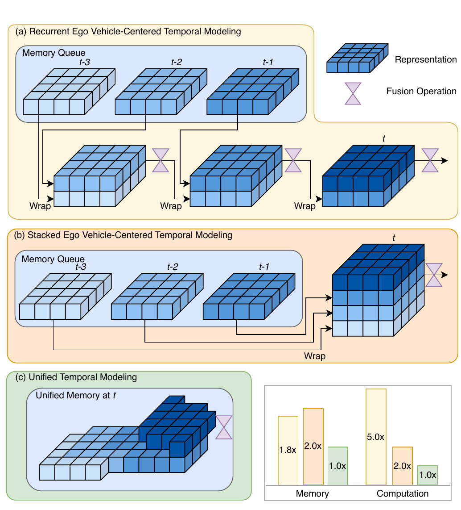

> **原图出处：** Leng et al., ICCV 2025, Figure 2，PDF p. 3 /
> proceedings p. 26571。[官方 PDF](https://openaccess.thecvf.com/content/ICCV2025/papers/Leng_Occupancy_Learning_with_Spatiotemporal_Memory_ICCV_2025_paper.pdf)。
> 仅作学术讲解所需的局部摘录，原图版权归原作者及其他权利人。

按“怎样保存一本行车记录”来读这张图：

1. **(a) Recurrent：不断重画上一版地图。** 每到新时刻，都把上一版 feature
   warp 到当前坐标，再融合新观察。信息经过的连续变换会随时间增加；
2. **(b) Stacked：保存多本旧相册。** 把多帧 dense 3D feature 都留下，
   需要时统一对齐和融合；旧信息少经历递归改写，但要同时保存多份大张量；
3. **(c) Unified：只维护一张按地点编号的城市地图。** 当前车辆按 pose
   读取附近区域，融合后再把新理解写回同一个场景位置。

作者在 Figure 2 的比较设置中给出相对量级：unified 的记忆和计算均记为
1.0×，recurrent 为 1.8× / 5.0×，stacked 为 2.0× / 2.0×。

**初学者版结论：** ST-Occ 不需要为每个历史时刻保存一整套“城市副本”，
而是对一张城市地图做局部读取和局部更新。

**专业版结论：** 它把时序状态的主索引从 frame index 改成 scene coordinate，
用 scene-centered persistent memory 取代显式 dense feature queue。

**这张图没有证明：** 所有 recurrent 或 stacked 模型、任意历史长度和任意
硬件都会保持上述固定比例；这些是作者实现和比较设置中的结果。

### 1.3 一帧怎样流过 ST-Occ：先看当前预测，再看下一帧状态

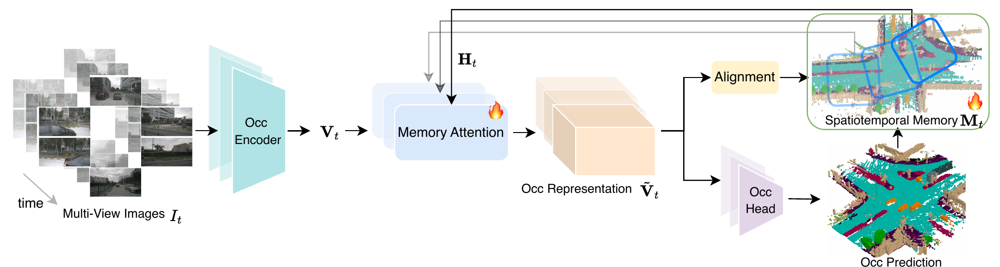

> **原图出处：** Leng et al., ICCV 2025, Figure 3，PDF p. 5 /
> proceedings p. 26573。[官方 PDF](https://openaccess.thecvf.com/content/ICCV2025/papers/Leng_Occupancy_Learning_with_Spatiotemporal_Memory_ICCV_2025_paper.pdf)。
> 仅作学术讲解所需的局部摘录，原图版权归原作者及其他权利人。

先沿图下方看“现在预测什么”：

```text
多视角图像
→ Occupancy encoder
→ 当前 3D feature V_t
→ Memory Attention 融合历史 H_t
→ 融合 feature V_tilde_t
→ Occupancy head
→ 当前预测
```

再沿图上方看“下一帧会记得什么”：

```text
场景 memory M_t
→ 按当前 ego pose 读取局部 H_t
→ 与当前 V_t 融合
→ Alignment
→ 把融合结果写回 M_(t+1)
```

四个对象可以这样记：

- ***V***<sub>*t*</sub>：本帧相机产生的当前 3D feature；
- ***H***<sub>*t*</sub>：从场景 memory 中读取的历史 feature；
- ***Ṽ***<sub>*t*</sub>：当前与历史融合后的 feature；
- ***M***<sub>*t*</sub>：在 scene coordinate 中持续存在的 memory。

> [!WARNING]
> 对普通单帧模型，一次错误主要影响当前输出；对状态化模型，错误还可能被
> 写回 memory，继而改变未来的读取、attention 和输出。这个结构允许“故障
> 后效”，但论文没有做相机故障恢复实验，所以这里只把它列为需要验证的问题，
> 不把长期污染写成已经证实的事实。

### 1.4 Flow 与 uncertainty：一个决定“去哪里找”，一个决定“信多少”

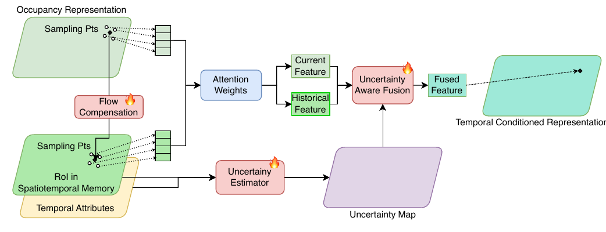

> **原图出处：** Leng et al., ICCV 2025, Figure 4，PDF p. 5 /
> proceedings p. 26573。[官方 PDF](https://openaccess.thecvf.com/content/ICCV2025/papers/Leng_Occupancy_Learning_with_Spatiotemporal_Memory_ICCV_2025_paper.pdf)。
> 仅作学术讲解所需的局部摘录，原图版权归原作者及其他权利人。

回到红色玩具车：上一帧它在 A，这一帧到了 B。若模型仍从 A 读取历史，
旧位置会留下“幽灵汽车”。Figure 4 从左到右做五件事：

1. **Flow compensation** 用预测 flow 调整历史 sampling position；
2. **Deformable attention** 在修正位置附近学习 offsets 和 weights；
3. **Uncertainty estimator** 读取类别状态、不确定性和新旧特征相似度；
4. **Gate** 调节当前分支与历史分支的混合比例；
5. 输出 temporal-conditioned representation。

**一句话记忆：** pose 先把街区找对，flow 再追踪街区里的移动物体，
uncertainty gate 最后决定旧地图值得信到什么程度。

## 2. 读公式：核心机制怎样表达

本节保留理解方法、指标和论文—源码差异不可缺少的式子。为了兼容 GitHub
iPad App，块级公式使用按内容紧裁的 2× 深浅色 PNG；正文变量恢复为标准数学
符号。每个公式都有中文读法和可复制的
[统一 TeX 源文件](../../assets/notes/2026-07-24-st-occ/formulas/source.tex)。
这些公式图按论文原符号重新排版，不冒充论文截图，也不改变代数含义。

读任何一条公式时，先回答五个问题：

1. 当前输入是什么？
2. 历史状态是什么？
3. 怎样找到同一个物理位置？
4. 怎样融合或计算？
5. 结果写到哪里，或用来度量什么？

### 2.1 Unified memory：先读，再写

#### Eq. (5)：按 pose 从场景地图读取历史并融合

**原文公式：** 论文 Eq. (5)，PDF p. 4 / proceedings p. 26572。

<p align="center"><picture><source media="(prefers-color-scheme: dark)" srcset="../../assets/notes/2026-07-24-st-occ/formulas/eq-05-unified-memory-read-dark.png">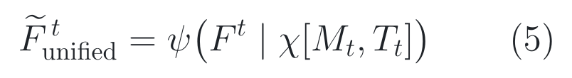</picture></p>

> **公式来源：** Leng et al., ICCV 2025, Eq. (5)，PDF p. 4 /
> proceedings p. 26572；本图按原符号重排。[官方 PDF](https://openaccess.thecvf.com/content/ICCV2025/papers/Leng_Occupancy_Learning_with_Spatiotemporal_Memory_ICCV_2025_paper.pdf) ·
> [可复制 TeX](../../assets/notes/2026-07-24-st-occ/formulas/source.tex#L5-L9)。

**纯文字读法：** 在时刻 *t*，先用车辆位姿 ***T***<sub>*t*</sub> 从场景记忆
***M***<sub>*t*</sub> 中取出当前位置的历史，再由融合函数 *ψ* 把它与当前
Occupancy feature ***F***<sup>*t*</sup> 合成新表示 ***F̃***<sub>unified</sub><sup>*t*</sup>。

符号逐个看：

- ***F***<sup>*t*</sup>：当前帧新观察产生的 Occupancy feature；
- ***M***<sub>*t*</sub>：此前积累的场景 memory；
- ***T***<sub>*t*</sub>：当前 ego pose；
- *χ*(·)：从 memory 采样或向 memory 写回的算子；
- *ψ*：时序融合函数；
- ***F̃***<sub>unified</sub><sup>*t*</sup>：融合后的当前 feature。

**容易误解：** 式中的竖线表示“在历史信息条件下融合”，这里不是在定义一个
概率条件分布。

#### Eq. (6)：把融合结果写回同一片场景区域

**原文公式：** 论文 Eq. (6)，PDF p. 4 / proceedings p. 26572。

<p align="center"><picture><source media="(prefers-color-scheme: dark)" srcset="../../assets/notes/2026-07-24-st-occ/formulas/eq-06-unified-memory-write-dark.png">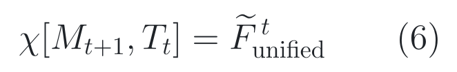</picture></p>

> **公式来源：** Leng et al., ICCV 2025, Eq. (6)，PDF p. 4 /
> proceedings p. 26572；本图按原符号重排。[官方 PDF](https://openaccess.thecvf.com/content/ICCV2025/papers/Leng_Occupancy_Learning_with_Spatiotemporal_Memory_ICCV_2025_paper.pdf) ·
> [可复制 TeX](../../assets/notes/2026-07-24-st-occ/formulas/source.tex#L11-L15)。

**纯文字读法：** 把刚得到的融合特征 ***F̃***<sub>unified</sub><sup>*t*</sup>
写进下一时刻记忆 ***M***<sub>*t*+1</sub> 的当前 RoI。

**积木例子：** 假设全局地图有 100×100 个平面格，本车当前只覆盖一个
20×20 的局部区域。Eq. (5) 从这 20×20 区域读取，Eq. (6) 再把新结果写回
同一个物理区域；模型不需要每帧重建整座城市。

**专业解释：** Eq. (5)–(6) 定义了“scene-addressed read → temporal fusion
→ localized write”的递推状态循环。公式没有展开离散坐标、插值、有效 mask、
重复 index 和 scene reset，这些都由实现负责。

**源码入口：**
[`update_global`](https://github.com/matthew-leng/ST-Occ/blob/1633f62e2e6677a5fa474905977acfeca4e7819e/mmdet3d/models/stocc/detectors/stocc.py#L246-L380)
负责坐标映射与读取；
[`update_global_single`](https://github.com/matthew-leng/ST-Occ/blob/1633f62e2e6677a5fa474905977acfeca4e7819e/mmdet3d/models/stocc/detectors/stocc.py#L383-L549)
完成融合与写回。

### 2.2 Memory 不是一张单层地图：它保存类别、可信度、运动和特征

先看体素 *p* 的 temporal attributes 定义。

**原文未编号公式：** 论文 Eq. (7) 前的定义，PDF p. 4 /
proceedings p. 26572。

<p align="center"><picture><source media="(prefers-color-scheme: dark)" srcset="../../assets/notes/2026-07-24-st-occ/formulas/eq-unnumbered-temporal-attributes-dark.png">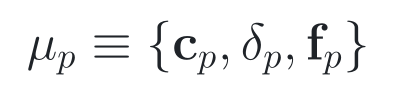</picture></p>

> **公式来源：** Leng et al., ICCV 2025，Eq. (7) 前的未编号定义，
> PDF p. 4 / proceedings p. 26572；本图按原符号重排。
> [官方 PDF](https://openaccess.thecvf.com/content/ICCV2025/papers/Leng_Occupancy_Learning_with_Spatiotemporal_Memory_ICCV_2025_paper.pdf) ·
> [可复制 TeX](../../assets/notes/2026-07-24-st-occ/formulas/source.tex#L17-L19)。

**纯文字读法：** 体素 *p* 的时序状态 *μ*<sub>*p*</sub>，由类别状态
***c***<sub>*p*</sub>、不确定性 *δ*<sub>*p*</sub> 和 Occupancy flow
***f***<sub>*p*</sub> 共同构成。

可以把 memory 想成一本多层透明地图册：

- ***c*** 是每个格子的“类别贴纸”；
- *δ* 是贴纸旁的“不确定性标签”；
- ***f*** 是格子上的“运动箭头”；
- ***V*** 是人不直接阅读、但网络继续计算需要的高维内部记录。

#### Eq. (7)：类别状态不是简单覆盖，而是衰减融合后再归一化

**原文公式：** 论文 Eq. (7)，PDF p. 4 / proceedings p. 26572。

<p align="center"><picture><source media="(prefers-color-scheme: dark)" srcset="../../assets/notes/2026-07-24-st-occ/formulas/eq-07-class-activation-update-dark.png">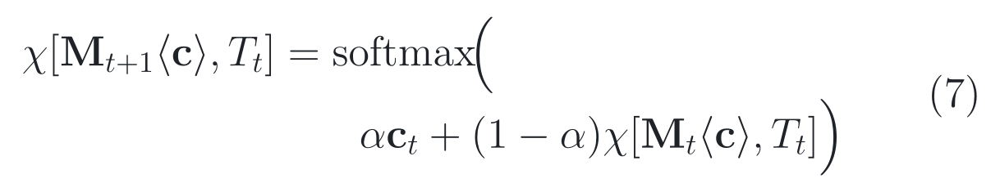</picture></p>

> **公式来源：** Leng et al., ICCV 2025, Eq. (7)，PDF p. 4 /
> proceedings p. 26572；本图按原符号重排。[官方 PDF](https://openaccess.thecvf.com/content/ICCV2025/papers/Leng_Occupancy_Learning_with_Spatiotemporal_Memory_ICCV_2025_paper.pdf) ·
> [可复制 TeX](../../assets/notes/2026-07-24-st-occ/formulas/source.tex#L21-L32)。

**纯文字读法：** 下一时刻 memory 的类别状态，等于“*α* × 当前类别激活，再加上
(1 − *α*) × 同位置历史类别状态”经过 softmax。

论文实现设置 *α* = 0.5。这意味着新旧 activation 在进入 softmax 前
各占一半，但**不等于**直接平均两个已经归一化的概率分布。

**玩具例子：** 当前观察更像 car，历史记忆更像 truck。Eq. (7) 先混合两组
class activation，再由 softmax 得到相对分布。若两边冲突很强，输出如何变化
还取决于完整 activation 数值，而不是只看“各 50%”这句话。

#### Eq. (8)：更新 uncertainty 和 flow

**原文公式：** 论文 Eq. (8)，PDF p. 4 / proceedings p. 26572。

<p align="center"><picture><source media="(prefers-color-scheme: dark)" srcset="../../assets/notes/2026-07-24-st-occ/formulas/eq-08-uncertainty-flow-write-dark.png">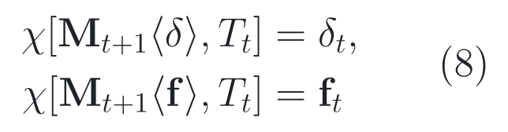</picture></p>

> **公式来源：** Leng et al., ICCV 2025, Eq. (8)，PDF p. 4 /
> proceedings p. 26572；本图按原符号重排。[官方 PDF](https://openaccess.thecvf.com/content/ICCV2025/papers/Leng_Occupancy_Learning_with_Spatiotemporal_Memory_ICCV_2025_paper.pdf) ·
> [可复制 TeX](../../assets/notes/2026-07-24-st-occ/formulas/source.tex#L34-L40)。

**纯文字读法：** 下一 memory 的 *δ* 槽写入当前 *δ*<sub>*t*</sub>，
***f*** 槽写入当前 Occupancy flow ***f***<sub>*t*</sub>。

#### Eq. (9)：更新融合后的 Occupancy representation

**原文公式：** 论文 Eq. (9)，PDF p. 4 / proceedings p. 26572。

<p align="center"><picture><source media="(prefers-color-scheme: dark)" srcset="../../assets/notes/2026-07-24-st-occ/formulas/eq-09-feature-memory-write-dark.png">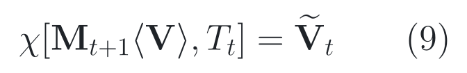</picture></p>

> **公式来源：** Leng et al., ICCV 2025, Eq. (9)，PDF p. 4 /
> proceedings p. 26572；本图按原符号重排。[官方 PDF](https://openaccess.thecvf.com/content/ICCV2025/papers/Leng_Occupancy_Learning_with_Spatiotemporal_Memory_ICCV_2025_paper.pdf) ·
> [可复制 TeX](../../assets/notes/2026-07-24-st-occ/formulas/source.tex#L42-L46)。

**纯文字读法：** 下一 memory 的 ***V*** 槽写入融合特征
***Ṽ***<sub>*t*</sub>。

**专业结论：** ST-Occ 的持久状态不是一个 feature tensor。重置、保存、
恢复或分析状态污染时，如果只处理 `global_feats`，就没有覆盖会影响未来计算的
全部字段。

> [!IMPORTANT]
> **[源码] 论文变量和发布代码变量不能直接画等号。** 论文中的 *δ* 是
> 跨类别平均的 log variance；代码先对 raw head 输出做 `softplus`，再取指数
> 得到 variance，跨类别求均值后还会在每个样本空间范围做 min–max
> normalization，才写入 `global_au`。进入 estimator 时又使用
> `1 - global_au`。所以 `global_au` 不是论文 *δ* 的逐值同义变量。
> 见
> [`occupancy_head_w_au.py`](https://github.com/matthew-leng/ST-Occ/blob/1633f62e2e6677a5fa474905977acfeca4e7819e/mmdet3d/models/stocc/heads/occupancy_head_w_au.py#L222-L296)
> 和
> [`uncertainty.py`](https://github.com/matthew-leng/ST-Occ/blob/1633f62e2e6677a5fa474905977acfeca4e7819e/mmdet3d/models/stocc/modules/uncertainty.py#L29-L46)。

### 2.3 Memory Attention：flow 决定地址，gate 决定混合

#### Eq. (10)：历史 ***H***<sub>*t*</sub> 就是按 pose 从 memory 读出的表示

**原文公式：** 论文 Eq. (10)，PDF p. 5 / proceedings p. 26573。

<p align="center"><picture><source media="(prefers-color-scheme: dark)" srcset="../../assets/notes/2026-07-24-st-occ/formulas/eq-10-memory-attention-dark.png">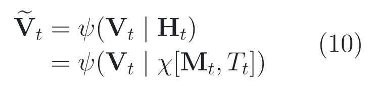</picture></p>

> **公式来源：** Leng et al., ICCV 2025, Eq. (10)，PDF p. 5 /
> proceedings p. 26573；本图按原符号重排。[官方 PDF](https://openaccess.thecvf.com/content/ICCV2025/papers/Leng_Occupancy_Learning_with_Spatiotemporal_Memory_ICCV_2025_paper.pdf) ·
> [可复制 TeX](../../assets/notes/2026-07-24-st-occ/formulas/source.tex#L48-L57)。

**纯文字读法：** 当前表示 ***V***<sub>*t*</sub> 以历史
***H***<sub>*t*</sub> 为条件，经 *ψ* 融合成 ***Ṽ***<sub>*t*</sub>；
其中历史不是一份固定的上一帧张量，而是按位姿 ***T***<sub>*t*</sub> 从场景
记忆 ***M***<sub>*t*</sub> 读取的当前 RoI。

#### Eq. (11)：gate 由多种证据共同预测

**原文公式：** 论文 Eq. (11)，PDF p. 5 / proceedings p. 26573。

<p align="center"><picture><source media="(prefers-color-scheme: dark)" srcset="../../assets/notes/2026-07-24-st-occ/formulas/eq-11-uncertainty-gate-dark.png">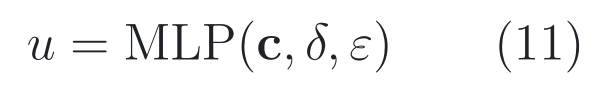</picture></p>

> **公式来源：** Leng et al., ICCV 2025, Eq. (11)，PDF p. 5 /
> proceedings p. 26573；本图按原符号重排。[官方 PDF](https://openaccess.thecvf.com/content/ICCV2025/papers/Leng_Occupancy_Learning_with_Spatiotemporal_Memory_ICCV_2025_paper.pdf) ·
> [可复制 TeX](../../assets/notes/2026-07-24-st-occ/formulas/source.tex#L59-L62)。

**纯文字读法：** 融合权重 *u* 由 MLP 根据类别状态 ***c***、不确定性
*δ* 和当前—历史 representation 的 cosine similarity *ε* 共同预测。

**容易误解：** 不能仅凭 Eq. (11) 断言“uncertainty 越高，*u* 必然越大”
或“必然越小”。*u* 是多输入 MLP 的输出，论文没有给出固定单调关系。

#### Eq. (12)：两条 deformable-attention 分支怎样融合

**原文公式：** 论文 Eq. (12)，PDF p. 5 / proceedings p. 26573。

<p align="center"><picture><source media="(prefers-color-scheme: dark)" srcset="../../assets/notes/2026-07-24-st-occ/formulas/eq-12-gated-deformable-attention-dark.png">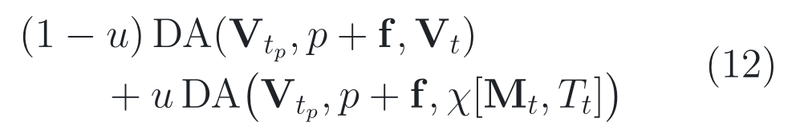</picture></p>

> **公式来源：** Leng et al., ICCV 2025, Eq. (12)，PDF p. 5 /
> proceedings p. 26573；本图按原符号重排。[官方 PDF](https://openaccess.thecvf.com/content/ICCV2025/papers/Leng_Occupancy_Learning_with_Spatiotemporal_Memory_ICCV_2025_paper.pdf) ·
> [可复制 TeX](../../assets/notes/2026-07-24-st-occ/formulas/source.tex#L64-L75)。

**纯文字读法：** 输出 = (1 − *u*) × 当前分支 DA + *u* × 历史分支 DA；
两条分支都在 *p* + ***f*** 处采样，其中 ***f*** 是 Occupancy flow。

**交通玩具例子：** 若论文公式里的 *u* = 0.8，纸面上历史分支占 0.8，
当前分支占 0.2。这个数值只解释公式，**不表示**某种具体 uncertainty 输入
必然产生 0.8。

**三句专业记忆：**

- *p* + ***f*** 回答“移动物体的历史现在大概在哪里”；
- deformable attention 回答“在附近哪些位置取样、各取多少”；
- *u* 回答“当前证据与历史证据怎样混合”。

> [!WARNING]
> **论文—源码差异：** **[论文]** Eq. (12) 把 *u* 写成历史分支权重。
> **[源码]** 默认 implicit 路径先令 `prev_weights = 1-u`，随后计算
> `history × prev_weights + current × (1-prev_weights)`；代入后变成
> `history × (1-u) + current × u`。这说明论文符号与代码变量至少不能
> 无条件逐字对应。它可能采用互补语义，也可能需要作者澄清。**[未核验]**
> 本仓库尚未加载 checkpoint 追踪中间张量，因此不能写成“确认把权重写反”
> 或“已证实 bug”。代码见
> [`encoder.py`](https://github.com/matthew-leng/ST-Occ/blob/1633f62e2e6677a5fa474905977acfeca4e7819e/mmdet3d/models/stocc/temporal/encoder.py#L347-L365)
> 与
> [`temporal_self_attention.py`](https://github.com/matthew-leng/ST-Occ/blob/1633f62e2e6677a5fa474905977acfeca4e7819e/mmdet3d/models/stocc/temporal/temporal_self_attention.py#L311-L319)。

### 2.4 mSTCV：稳定不等于正确

先看一个反例。某个静态 voxel 的真值连续两帧都是 `car`：

| 模型 | 历史预测 | 当前预测 | 是否变化 | 是否正确 |
|---|---:|---:|---:|---:|
| A | `truck` | `truck` | 否 | 两帧都错 |
| B | `car` | `truck` | 是 | 一帧对、一帧错 |

若只惩罚变化，A 看起来更“稳定”，但它是 **stable but wrong**。因此 mSTCV
必须与 mIoU 一起读。

#### Eq. (13)：先把 prediction 和 ground truth 写入场景 memory

**原文公式：** 论文 Eq. (13)，PDF p. 5 / proceedings p. 26573。

<p align="center"><picture><source media="(prefers-color-scheme: dark)" srcset="../../assets/notes/2026-07-24-st-occ/formulas/eq-13-prediction-gt-memory-write-dark.png">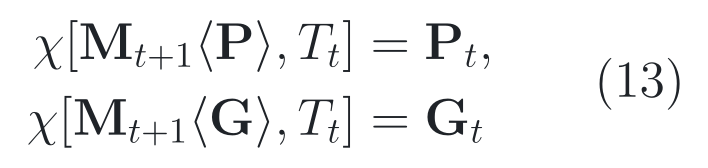</picture></p>

> **公式来源：** Leng et al., ICCV 2025, Eq. (13)，PDF p. 5 /
> proceedings p. 26573；本图按原符号重排。[官方 PDF](https://openaccess.thecvf.com/content/ICCV2025/papers/Leng_Occupancy_Learning_with_Spatiotemporal_Memory_ICCV_2025_paper.pdf) ·
> [可复制 TeX](../../assets/notes/2026-07-24-st-occ/formulas/source.tex#L77-L83)。

**纯文字读法：** 把当前预测 ***P***<sub>*t*</sub> 和真值
***G***<sub>*t*</sub> 分别写入下一 memory 的 ***P*** 槽与 ***G*** 槽，
以便在同一场景位置比较时间变化。

#### Eq. (14)：一帧中的 prediction flicker 比例

**原文公式：** 论文 Eq. (14)，PDF p. 5 / proceedings p. 26573。

<p align="center"><picture><source media="(prefers-color-scheme: dark)" srcset="../../assets/notes/2026-07-24-st-occ/formulas/eq-14-stcv-dark.png">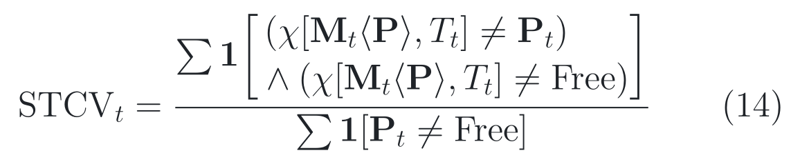</picture></p>

> **公式来源：** Leng et al., ICCV 2025, Eq. (14)，PDF p. 5 /
> proceedings p. 26573；本图按原符号重排。[官方 PDF](https://openaccess.thecvf.com/content/ICCV2025/papers/Leng_Occupancy_Learning_with_Spatiotemporal_Memory_ICCV_2025_paper.pdf) ·
> [可复制 TeX](../../assets/notes/2026-07-24-st-occ/formulas/source.tex#L85-L100)。

**先读分母：** 当前预测中非 `Free` 的 voxel 数。

**再读分子：** 历史 memory 中该场景位置的 prediction 与当前 prediction
不同，并且历史 prediction 不是 `Free` 的 voxel 数。

**纯文字读法：** *STCV*<sub>*t*</sub> 是“发生上述类别变化的体素数”与
“当前非 Free prediction 数”的比值。值越低，按论文定义发生的 temporal
flicker 越少。

**一个精确边界：** memory 保存的是该场景位置最近一次已写入的历史预测，
不保证比较对象一定来自紧邻上一帧。

式中的 **1**[condition] 表示 indicator function；原论文使用黑板粗体 1，
公式 PNG 为跨端字体兼容改用粗体 1，代数含义不变。

#### Eq. (15)：对序列求平均

**原文公式：** 论文 Eq. (15)，PDF p. 5 / proceedings p. 26573。

<p align="center"><picture><source media="(prefers-color-scheme: dark)" srcset="../../assets/notes/2026-07-24-st-occ/formulas/eq-15-mstcv-dark.png">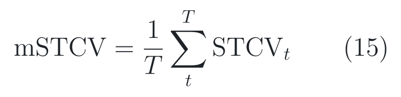</picture></p>

> **公式来源：** Leng et al., ICCV 2025, Eq. (15)，PDF p. 5 /
> proceedings p. 26573；本图按原符号重排。[官方 PDF](https://openaccess.thecvf.com/content/ICCV2025/papers/Leng_Occupancy_Learning_with_Spatiotemporal_Memory_ICCV_2025_paper.pdf) ·
> [可复制 TeX](../../assets/notes/2026-07-24-st-occ/formulas/source.tex#L102-L107)。

**纯文字读法：** mSTCV 是 *T* 帧 *STCV*<sub>*t*</sub> 的平均值。

可以把时序质量分成四个象限：

```text
正确且稳定       正确但闪烁
错误但稳定       错误且闪烁
```

mSTCV 主要观察“稳定/闪烁”这个轴，mIoU 主要观察“正确/错误”这个轴；可靠的
时序模型不能只报告其中一轴。

> [!IMPORTANT]
> **[源码] 发布评测口径不是 Eq. (14) 的逐字计算。** 模型侧分别累计
> prediction flicker 和 GT flicker；数据集评测最终使用
> `(prediction flicker - GT flicker) / GT non-free voxel count`，
> 再对帧平均。提供 speed map 时还排除速度大于 0.5 的动态 voxel。因此
> Table 2 的 12.18% → 8.68% 应称为“作者发布实现口径下的结果”，而不是
> 声称只凭 Eq. (14) 已经逐字复算。见
> [`stocc.py`](https://github.com/matthew-leng/ST-Occ/blob/1633f62e2e6677a5fa474905977acfeca4e7819e/mmdet3d/models/stocc/detectors/stocc.py#L850-L969)
> 和
> [`nuscenes_dataset.py`](https://github.com/matthew-leng/ST-Occ/blob/1633f62e2e6677a5fa474905977acfeca4e7819e/mmdet3d/datasets/nuscenes_dataset.py#L670-L714)。
>
> **[未核验]** 代码用 `previous != 0` 判断历史是否初始化，而合法 prediction
> 类别索引也包含 0。在真实 checkpoint 与序列数值追踪前，这只能列为潜在
> sentinel 冲突，不能称为已证实 bug。

### 2.5 训练损失：允许模型表达“不确定”，但不能无限逃避

#### Eq. (16)：基础 Occupancy loss 由哪些项组成

**原文公式：** 论文 Eq. (16)，PDF p. 6 / proceedings p. 26574。

<p align="center"><picture><source media="(prefers-color-scheme: dark)" srcset="../../assets/notes/2026-07-24-st-occ/formulas/eq-16-occupancy-loss-dark.png">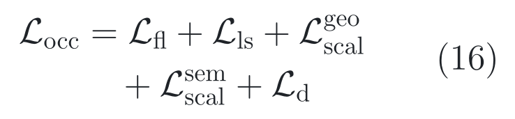</picture></p>

> **公式来源：** Leng et al., ICCV 2025, Eq. (16)，PDF p. 6 /
> proceedings p. 26574；本图按原符号重排。[官方 PDF](https://openaccess.thecvf.com/content/ICCV2025/papers/Leng_Occupancy_Learning_with_Spatiotemporal_Memory_ICCV_2025_paper.pdf) ·
> [可复制 TeX](../../assets/notes/2026-07-24-st-occ/formulas/source.tex#L109-L121)。

**纯文字读法：** Occupancy loss *L*<sub>occ</sub> 由 focal loss、
Lovász-Softmax loss、几何缩放、语义缩放和深度损失相加得到。

这些项分别鼓励类别预测、集合重叠、几何占用关系、语义关系和深度估计。
初学者不必先背下每一项；此处最重要的是：*L*<sub>occ</sub> 负责“预测什么”，
下面的 *L*<sub>nll</sub> 负责“允许模型怎样表达不确定”，
*L*<sub>of</sub> 负责“物体怎样移动”。

#### Eq. (17)：为什么模型不能把每道难题都说成“不确定”

**原文公式：** 论文 Eq. (17)，PDF p. 6 / proceedings p. 26574。

<p align="center"><picture><source media="(prefers-color-scheme: dark)" srcset="../../assets/notes/2026-07-24-st-occ/formulas/eq-17-uncertainty-nll-dark.png">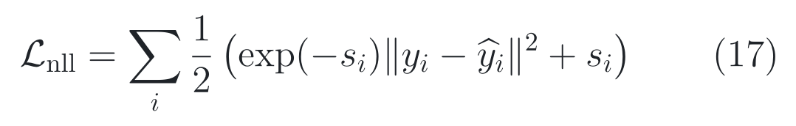</picture></p>

> **公式来源：** Leng et al., ICCV 2025, Eq. (17)，PDF p. 6 /
> proceedings p. 26574；本图按原符号重排。[官方 PDF](https://openaccess.thecvf.com/content/ICCV2025/papers/Leng_Occupancy_Learning_with_Spatiotemporal_Memory_ICCV_2025_paper.pdf) ·
> [可复制 TeX](../../assets/notes/2026-07-24-st-occ/formulas/source.tex#L123-L131)。

**分三步读：**

1. ‖*y*<sub>*i*</sub> − ŷ<sub>*i*</sub>‖<sup>2</sup> 是样本 *i* 的平方残差；
2. *s*<sub>*i*</sub> 是预测的 log variance，exp(−*s*<sub>*i*</sub>) 会给残差项降权；
3. 末尾的 + *s*<sub>*i*</sub> 又会惩罚无约束地扩大 uncertainty。

**学生类比：** 面对模糊路标，学生可以说“这题我不太确定”，老师会降低这道
错题的惩罚；但如果每道题都说“不确定”，额外的 *s*<sub>*i*</sub> 代价会让总分变差。

**数值直觉：** 先只看 Eq. (17) 圆括号内部：当 *s* = 0 时，残差因子为 1；
当 *s* = ln 4 时，残差因子变为四分之一，同时括号内增加 ln 4 的
不确定性代价。整条式子外面还有二分之一，因此完整 loss 中对应的残差系数
分别是二分之一和八分之一，不确定性代价是 (ln 4) / 2。这个例子只解释公式，
不是论文实验结果。

#### Eq. (18)：总损失

**原文公式：** 论文 Eq. (18)，PDF p. 6 / proceedings p. 26574。

<p align="center"><picture><source media="(prefers-color-scheme: dark)" srcset="../../assets/notes/2026-07-24-st-occ/formulas/eq-18-total-loss-dark.png">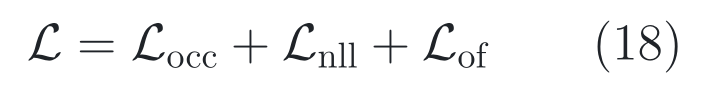</picture></p>

> **公式来源：** Leng et al., ICCV 2025, Eq. (18)，PDF p. 6 /
> proceedings p. 26574；本图按原符号重排。[官方 PDF](https://openaccess.thecvf.com/content/ICCV2025/papers/Leng_Occupancy_Learning_with_Spatiotemporal_Memory_ICCV_2025_paper.pdf) ·
> [可复制 TeX](../../assets/notes/2026-07-24-st-occ/formulas/source.tex#L133-L140)。

**纯文字读法：** 总损失 *L* 由 *L*<sub>occ</sub>、*L*<sub>nll</sub> 与
*L*<sub>of</sub> 相加；三部分分别对应 Occupancy 预测、不确定性学习和
Occupancy-flow L1 loss。

#### 发布代码实际采用的分类版本

**[源码] 简化结构式：** 以下两式从固定 commit 提取核心代数结构，不是论文
原式，也不是包含 mask 与数值保护的完整逐操作计算图。

<p align="center"><picture><source media="(prefers-color-scheme: dark)" srcset="../../assets/notes/2026-07-24-st-occ/formulas/source-code-variance-transform-dark.png">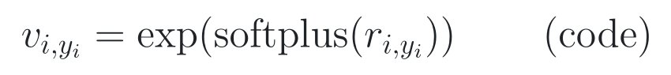</picture></p>

> **公式来源：** **[源码] 非论文原式。** ST-Occ commit `1633f62e`，
> `occupancy_head_w_au.py` L289–296。[固定源码](https://github.com/matthew-leng/ST-Occ/blob/1633f62e2e6677a5fa474905977acfeca4e7819e/mmdet3d/models/stocc/heads/occupancy_head_w_au.py#L289-L296) ·
> [可复制 TeX](../../assets/notes/2026-07-24-st-occ/formulas/source.tex#L142-L145)。

**纯文字读法：** 实际代码先对所有类别通道的原始 uncertainty 做 softplus
与指数变换，再按标签 *y*<sub>*i*</sub> 取出正确类别的 variance
*v*<sub>*i*,*yᵢ*</sub>；随后还会对源码张量 `v` 做数值 clamp。
公式图只保留与单个有效 voxel 损失直接相关的核心结构。

<p align="center"><picture><source media="(prefers-color-scheme: dark)" srcset="../../assets/notes/2026-07-24-st-occ/formulas/source-code-uncertainty-loss-dark.png">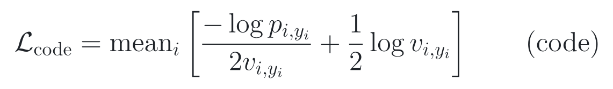</picture></p>

> **公式来源：** **[源码] 非论文原式。** ST-Occ commit `1633f62e`，
> `occupancy_head_w_au.py` L23–69 与 L289–296。
> [固定源码](https://github.com/matthew-leng/ST-Occ/blob/1633f62e2e6677a5fa474905977acfeca4e7819e/mmdet3d/models/stocc/heads/occupancy_head_w_au.py#L23-L69) ·
> [可复制 TeX](../../assets/notes/2026-07-24-st-occ/formulas/source.tex#L147-L155)。

**纯文字读法：** 代码 loss 对有效体素 *i* 求均值；数据项是“正确类别
负对数概率除以两倍 variance”，正则项是“二分之一 log variance”。

**公式为可读性省略的实现细节：** 代码只保留 `target != 255` 的有效 voxel，
并在取对数和相除前把 `p` clamp 到 `[1e-8, 1]`、把 `v` clamp 到
`[1e-6, 1e6]`。因此两张图表达的是核心 loss 结构，不应被称为所有数值下的
逐值等价式。

**严谨结论：** 论文 Eq. (17) 使用平方残差；发布代码使用正确类别的负对数
概率。两者都体现“数据项按 variance 降权 + log variance 正则”的思想，
但不能说代码逐字实现了 Eq. (17)。

## 3. 看结果：证据是否支持主张

### 3.1 先会读 mIoU：42.13 不是“准确率 42.13%”

对某一类别，IoU 是“预测区域与真值区域的交集”除以“两者并集”；mIoU 是对
多个语义类别的 IoU 求平均。因此正确表述是“mIoU 为 42.13”，不能写成
“所有 voxel 的准确率是 42.13%”。

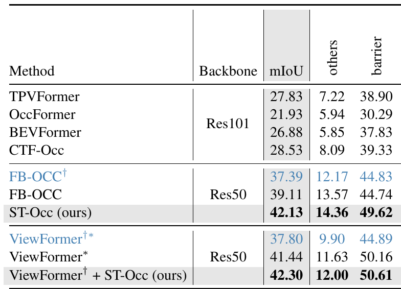

> **原图出处：** Leng et al., ICCV 2025, Table 1，PDF p. 6 /
> proceedings p. 26574。[官方 PDF](https://openaccess.thecvf.com/content/ICCV2025/papers/Leng_Occupancy_Learning_with_Spatiotemporal_Memory_ICCV_2025_paper.pdf)。
> 此处截取原表左侧主结果与少量相邻类别列；完整类别结果见官方 PDF。
> 原图版权归原作者及其他权利人。

按四步读这张表：

1. 找相同或明确对应的 backbone；
2. 分清 no-temporal、原 temporal 和 ST-Occ；
3. 计算**绝对 mIoU 点数差**，不要误写成相对百分比；
4. 看第二个 backbone 是否方向一致，再检查有没有跨域和多 seed。

三个决定结论的对照：

- FB-OCC：ST-Occ 42.13，原 temporal FB-OCC 39.11，绝对提高 **3.02**；
- FB-OCC：ST-Occ 42.13，no-temporal FB-OCC 37.39，提高 **4.74**；
- ViewFormer：ST-Occ 42.30，原 temporal ViewFormer 41.44，
  no-temporal ViewFormer 37.80。

**[论文] 支持：** 在作者的 Occ3D 设置中，ST-Occ 在两类基础架构上都带来
方向一致的收益；它不是只对单一 backbone 有效。

**[判断] 不支持：** 两组结果仍属于同一数据域和任务设置，没有恶劣天气、
传感器故障、跨域、随机种子方差或置信区间，不能写成“各种环境下都有效”或
“已经证明通用泛化”。

### 3.2 Table 2：时间更稳，但不要把“相对下降”说成“准确率提高”

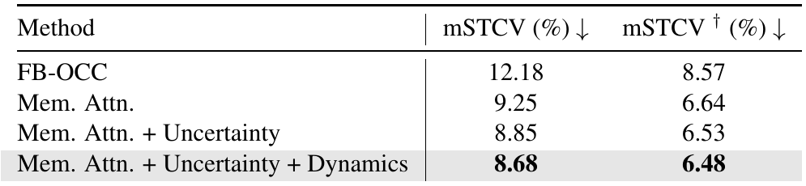

> **原图出处：** Leng et al., ICCV 2025, Table 2，PDF p. 7 /
> proceedings p. 26575。[官方 PDF](https://openaccess.thecvf.com/content/ICCV2025/papers/Leng_Occupancy_Learning_with_Spatiotemporal_Memory_ICCV_2025_paper.pdf)。
> 仅作学术讲解所需的局部摘录，原图版权归原作者及其他权利人。

FB-OCC 的 mSTCV 是 12.18%，完整 ST-Occ 是 8.68%：

- 绝对下降：12.18 − 8.68 = 3.50 个百分点；
- 相对下降：3.50 / 12.18 ≈ 28.7%。

正确说法是“mSTCV 相对下降约 28.7%”，不是“准确率提高 28.7%”。

表中的 mSTCV† 表示**不使用 voxel visibility mask** 的版本，带 dagger
与不带 dagger 的列口径不同，不能混读。

**[论文] 支持：** 作者发布口径下的时序不一致指标降低；结合发布代码，应
理解为相对 GT 变化校正后的 flicker 更少，而不是任意 voxel 的原始变化次数
都必然减少。

**[未核验]：** 数字来自作者 Table 2，本仓库尚未运行 checkpoint 独立复算；
而且发布代码口径与论文 Eq. (14) 的差异已在 2.4 节说明。

### 3.3 Table 3：24 ms、8.65 FPS 和 5.57 GB 是三个不同对象

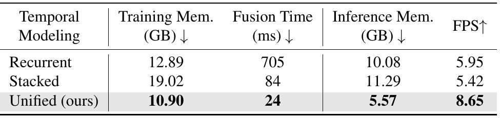

> **原图出处：** Leng et al., ICCV 2025, Table 3，PDF p. 7 /
> proceedings p. 26575。[官方 PDF](https://openaccess.thecvf.com/content/ICCV2025/papers/Leng_Occupancy_Learning_with_Spatiotemporal_Memory_ICCV_2025_paper.pdf)。
> 仅作学术讲解所需的局部摘录，原图版权归原作者及其他权利人。

- **Fusion time：** unified 24 ms，stacked 84 ms，recurrent 705 ms；
- **Inference memory：** unified 5.57 GB，stacked 11.29 GB，
  recurrent 10.08 GB；
- **整体 FPS：** unified 8.65，stacked 5.42，recurrent 5.95。

为什么 24 ms 不能直接换算成约 41.7 FPS？因为 24 ms 只表示时序 fusion
模块；整条系统还包含图像 backbone、view transformation、heads 和其他步骤。
同理，5.57 GB 是作者测得的 inference memory，不等于“单个 scene buffer
正好占 5.57 GB”。

**[论文] 支持：** 作者实现中的 unified 路线同时改善上述效率指标。

**[判断] 边界：** 表中没有完整硬件说明、重复次数、方差和详细 profiling；
这些数字适合支持该实现设置中的相对比较，不能外推为任意 GPU 上的固定性能。

### 3.4 Table 4：最大收益来自 memory 主体，小组件收益不能线性相加

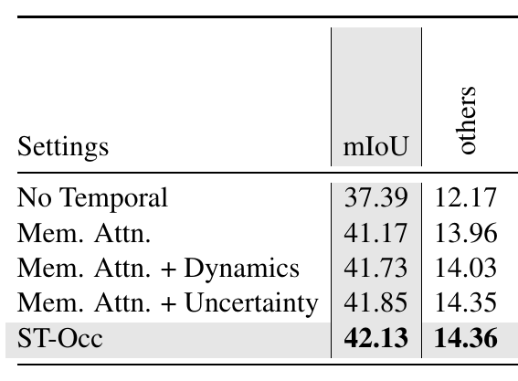

> **原图出处：** Leng et al., ICCV 2025, Table 4，PDF p. 8 /
> proceedings p. 26576。[官方 PDF](https://openaccess.thecvf.com/content/ICCV2025/papers/Leng_Occupancy_Learning_with_Spatiotemporal_Memory_ICCV_2025_paper.pdf)。
> 此处截取原表左侧设置、mIoU 与少量相邻类别列；完整类别结果见官方 PDF。
> 原图版权归原作者及其他权利人。

沿 mIoU 第一列逐层读：

- No Temporal → Memory Attention：37.39 → 41.17，增加 **3.78**；
- Memory Attention → +Dynamics：41.17 → 41.73，增加 **0.56**；
- Memory Attention → +Uncertainty：41.17 → 41.85，增加 **0.68**；
- Memory Attention → 两者都加：41.17 → 42.13，增加 **0.96**。

**[论文] 最有力的组件归因线索：** 最大增益来自 memory attention 主体，
flow 和 uncertainty 在其上提供较小、方向一致的补充。

**不要做线性归因：** 0.56 + 0.68 = 1.24，但两者同时加入的增益为 0.96。
模块之间可能有重叠或交互，不能把单独消融的增益当成互相独立、可以简单相加的
因果贡献。

**[判断] 统计边界：** 0.28–0.68 量级的小差异没有多 seed 方差或置信区间，
只能说“作者这组消融中方向为正”，不能说“统计显著有效”。

### 3.5 把证据分级，而不是给论文一个模糊总分

**Strong：**

- scene-centered unified memory 的结构主张；
- Occ3D 主结果和 no-temporal / temporal 对照；
- memory attention 是消融中的主要增益来源；
- 作者实现中 unified 路线的效率比较。

**Medium：**

- dynamics 与 uncertainty 的互补作用；
- mSTCV 改善代表作者口径下更少 flicker；
- 小组件收益与具体效率比例：作者实验提供了支持，但跨实现复现仍未核验。

**Weak / 未覆盖：**

- 跨域、恶劣天气和传感器故障；
- 故障结束后的恢复时间；
- uncertainty calibration；
- stable-but-wrong 的持续时间；
- predicted-flow 误差随历史长度是否累积；
- checkpoint 独立复现和多 seed 统计。

## 4. 对源码：公式如何落地

固定版本：
[`1633f62e2e6677a5fa474905977acfeca4e7819e`](https://github.com/matthew-leng/ST-Occ/commit/1633f62e2e6677a5fa474905977acfeca4e7819e)。

先按论文的信息流打开源码：

```text
多相机图像
→ 当前 voxel feature
→ scene buffer 读取当前 RoI
→ flow-conditioned temporal attention
→ uncertainty-aware fusion
→ scene buffer 写回
→ occupancy / uncertainty / flow heads
```

### 4.1 打开 memory 盒子：真实状态比 Figure 3 复杂

ST-Occ 类通过 `__init__`、
[`register_scene_buffer`](https://github.com/matthew-leng/ST-Occ/blob/1633f62e2e6677a5fa474905977acfeca4e7819e/mmdet3d/models/stocc/detectors/stocc.py#L212-L244)
和
[`update_global`](https://github.com/matthew-leng/ST-Occ/blob/1633f62e2e6677a5fa474905977acfeca4e7819e/mmdet3d/models/stocc/detectors/stocc.py#L246-L380)
等路径共同维护以下持久或跨帧对象；它们并非全部由单个函数创建：

- `global_feats`：scene-sized 80-channel feature；
- `global_valid_masks` 与 `global_vis_cnt`：哪些 voxel 有效、观察了多少次；
- `global_pred_distribs`：18 类历史分布；
- `global_au`：历史 uncertainty；
- `gt_flow`：测试路径中也保存 previous predicted flow；
- coordinate maps、scene names、scene shapes、bias 和 frame counter；
- mSTCV 评测使用的 global GT、prediction 和 mask buffers。

**初学者版：** 论文图里的一个 memory 盒子，打开后其实是一本多层地图册，
再加一组坐标、计数器和评测账本。

**专业版：** “持久存在”与“影响未来 prediction”不是完全相同的集合。
例如 evaluation buffer 会影响指标，但未必进入预测；做 state audit 时应明确
区分 prediction-relevant state 和 evaluation-only state。

### 4.2 读取与写回：`update_global` / `update_global_single`

- **论文对应：** Eq. (5)–(9)；
- **[源码] 实际行为：** `update_global` 根据 ego pose 计算当前 voxel 在
  scene grid 中的位置，经 round、clamp 和 `grid_sample` 读取；
  `update_global_single` 调 temporal encoder 后用 indexed write 更新对应区域；
- **需要留意：** 坐标离散、重复 index、scene reset 和 batch-slot 隔离都可能
  改变 stateful inference。

[打开 `update_global`](https://github.com/matthew-leng/ST-Occ/blob/1633f62e2e6677a5fa474905977acfeca4e7819e/mmdet3d/models/stocc/detectors/stocc.py#L246-L380) ·
[打开 `update_global_single`](https://github.com/matthew-leng/ST-Occ/blob/1633f62e2e6677a5fa474905977acfeca4e7819e/mmdet3d/models/stocc/detectors/stocc.py#L383-L549)

### 4.3 Flow 与 deformable attention：`VoxelFormerEncoder`

- **论文对应：** Figure 4 与 Eq. (12) 的 *p* + ***f***；
- **[源码] 实际行为：** predicted 或 GT flow 改变历史 sampling position，
  temporal attention 继续预测内容相关 offsets 和 weights；
- **需要留意：** flow error 不仅会影响当前采样，还可能改变写回 memory 的
  内容，进而影响后续帧。

[打开 temporal encoder](https://github.com/matthew-leng/ST-Occ/blob/1633f62e2e6677a5fa474905977acfeca4e7819e/mmdet3d/models/stocc/temporal/encoder.py#L229-L378) ·
[打开 temporal attention](https://github.com/matthew-leng/ST-Occ/blob/1633f62e2e6677a5fa474905977acfeca4e7819e/mmdet3d/models/stocc/temporal/temporal_self_attention.py#L142-L331)

### 4.4 Uncertainty gate 与 loss：论文思想、代码语义要分开

这里有三组不能无缝等同的对象：

1. **Uncertainty 表示。** 论文写平均 log variance *δ*；代码经过
   `softplus → exp → 类别均值 → 空间 min–max normalization` 得到
   `global_au`，estimator 又读 `1-global_au`；
2. **Gate 语义。** 论文 Eq. (12) 把 *u* 放在历史分支；默认代码路径整理后
   是 `history × (1-u) + current × u`；
3. **NLL 形式。** 论文是平方残差的高斯 NLL 风格；代码是正确类别负对数概率
   的 variance-weighted 分类版本。

**[判断] 严谨措辞：** 它们共享设计思想，但不是逐值、逐项、逐符号等价。
在 checkpoint 数值追踪前，最稳妥的结论是“变量语义有差异，需要复现时分别
报告”，而不是“代码写错”。

[打开 uncertainty estimator](https://github.com/matthew-leng/ST-Occ/blob/1633f62e2e6677a5fa474905977acfeca4e7819e/mmdet3d/models/stocc/modules/uncertainty.py#L7-L46) ·
[打开 variance head](https://github.com/matthew-leng/ST-Occ/blob/1633f62e2e6677a5fa474905977acfeca4e7819e/mmdet3d/models/stocc/heads/occupancy_head_w_au.py#L289-L296) ·
[打开 NLL](https://github.com/matthew-leng/ST-Occ/blob/1633f62e2e6677a5fa474905977acfeca4e7819e/mmdet3d/models/stocc/heads/occupancy_head_w_au.py#L23-L69)

### 4.5 序列训练与评测：sampler、curriculum、mSTCV

- **论文对应：** 流式训练、长历史与 Eq. (13)–(15)；
- **[源码] 实际行为：** sampler 让每个 batch position 顺序消费自己的
  scene；curriculum 在训练早期禁用 history；mSTCV 用 prediction flicker
  减 GT flicker，再除以 GT non-free voxel 数；
- **需要留意：** `global_frame_cnt` 看起来是模型级 scalar，而不是清晰的
  per-slot state。它在标准配置中是否实际造成 batch-slot coupling，需要运行时
  测试，不能从静态代码直接定性。

[打开 sequence sampler](https://github.com/matthew-leng/ST-Occ/blob/1633f62e2e6677a5fa474905977acfeca4e7819e/mmdet3d/datasets/samplers/infinite_group_each_sample_in_batch_sampler.py#L48-L124) ·
[打开 curriculum hook](https://github.com/matthew-leng/ST-Occ/blob/1633f62e2e6677a5fa474905977acfeca4e7819e/mmdet3d/core/hook/sequentialsontrol.py#L8-L42) ·
[打开 mSTCV](https://github.com/matthew-leng/ST-Occ/blob/1633f62e2e6677a5fa474905977acfeca4e7819e/mmdet3d/datasets/nuscenes_dataset.py#L670-L714)

### 4.6 状态规模：24.4 MiB、约 131 MiB 和 5.57 GB 不能混成一个数

先只估算当前局部 80-channel FP32 feature：

**[判断] 非原文公式：** 以下是配置量级换算，不是论文原始公式。

<p align="center"><picture><source media="(prefers-color-scheme: dark)" srcset="../../assets/notes/2026-07-24-st-occ/formulas/calculation-local-feature-memory-dark.png">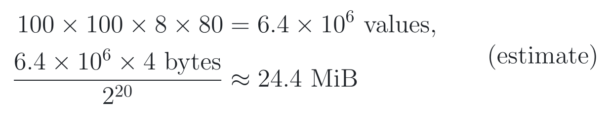</picture></p>

> **公式来源：** **[判断] 非论文原式。** `100×100×8×80` 来自固定配置，
> FP32 按 4 bytes 估算。[可复制 TeX](../../assets/notes/2026-07-24-st-occ/formulas/source.tex#L157-L165)。

**纯文字读法：** 100×100×8×80 = 640 万个值；乘 4 bytes 后约为
24.4 MiB。

补充材料 PDF p. 1 报告：完整 spatiotemporal memory 有 101 个 channel，
包括 80 feature、18 class activation、2 flow、1 uncertainty；在 nuScenes
20 秒序列中，平均相对空间增长 *Δ*<sub>mean</sub> = 3.25。按这些数做教学性粗估：

**[判断] 非原文公式：** 以下只估算 feature-like scene state 的量级。

<p align="center"><picture><source media="(prefers-color-scheme: dark)" srcset="../../assets/notes/2026-07-24-st-occ/formulas/calculation-scene-state-memory-dark.png">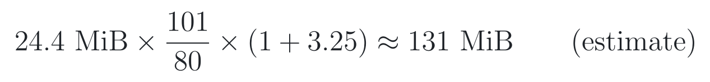</picture></p>

> **公式来源：** **[判断] 非论文原式。** 101 channels 与
> *Δ*<sub>mean</sub> = 3.25 来自补充材料 PDF p. 1；其余为本笔记换算。
> [官方 Supplement](https://openaccess.thecvf.com/content/ICCV2025/supplemental/Leng_Occupancy_Learning_with_ICCV_2025_supplemental.pdf) ·
> [可复制 TeX](../../assets/notes/2026-07-24-st-occ/formulas/source.tex#L167-L173)。

**纯文字读法：** 24.4 MiB × 101/80 × (1+3.25) ≈ 131 MiB。

三者的含义必须分开：

- **24.4 MiB：** 当前局部 80-channel feature 的笔记估算；
- **约 131 MiB：** 按补充材料平均空间增长粗估的主要 scene state；
- **5.57 GB：** Table 3 中作者报告的完整 inference memory 指标。

真实工作集还包含 validity/count、坐标、评测 buffers、激活和框架开销；
131 MiB 不是作者报告的峰值，也不是完整 GPU memory。

<details>
<summary><strong>展开：工程与复现风险清单</strong></summary>

- in-place/stateful：`detach_()`、indexed write、count 累加、类别分布递推；
- 内容相关路径：cosine similarity、uncertainty、attention weights、
  predicted flow；
- 确定性：5D `grid_sample`、duplicate index、dropout、scene reset；
- train/test gap：测试会把 predicted flow 保存进名为 `gt_flow` 的字段；
- sequence：模型级 frame counter 与 batch slot 的关系需要 runtime test；
- 版本：论文 26 epochs、README 模型表 28ep、发布配置名与设置 36e；
- 环境：旧 OpenMMLab / CUDA 依赖增加 checkpoint 复现成本；
- 许可：仓库无顶层 LICENSE；`setup.py` 声称 Apache-2.0，若干核心文件带
  NVIDIA Source Code License-NC 标头。

这些都是静态材料中可见的复现风险，不等于已经证明它们会改变官方结果。

</details>

## 5. 记结论：贡献、边界与开放问题

### 5.1 学完必须记住的三点

1. **[论文] 方法核心：** scene-centered unified memory 把长历史从显式
   dense frame queue 变成一份按真实场景位置寻址的递推状态；
2. **[论文] 最强证据：** Occ3D 主结果、no-temporal / temporal 对照、
   mSTCV、效率和消融共同支持该设计在作者设置中有效；
3. **[判断] 最大边界：** 单一数据域、缺少 seed 方差与故障恢复实验，而且
   gate、uncertainty loss 和 mSTCV 的发布代码口径都不能与论文公式逐字等同。

如果只能记一句话：

> ST-Occ 把多帧历史压进一张会持续读写的 3D 城市记忆；这提高了作者设置中的
> 时序融合效果，也让“错误是否会被写入并持续传播”成为必须额外评估的问题。

### 5.2 六条可以迁移的设计原则

#### 原则 1：历史的地址不一定是时间，也可以是世界位置

ST-Occ 提醒我们：若任务有稳定空间坐标，历史不一定按“第几帧”存，也可以按
“未来检索真正需要的物理地址”存。这一原则可迁移到长期地图、流式 3D 感知、
tracking 和动态地图更新，但具体收益仍需按任务验证。

#### 原则 2：把“在哪里读”和“信多少”拆开

pose / flow 决定 read address，uncertainty / similarity 决定 trust，
attention 决定邻域聚合。把这三类职责分开，能让 failure analysis 更清楚。

#### 原则 3：论文图中的 state 必须做源码级完整性审计

一个 memory 方框不等于一个 tensor。做 reset、snapshot、restore、故障恢复
或状态删除时，应先枚举所有 future-relevant persistent fields。

#### 原则 4：时间一致性必须与正确性、响应性一起报告

低 flicker 可能是 correct-stable，也可能是 wrong-stable。可靠评测应同时看
正确性、稳定性、对真实变化的响应和错误后的恢复。

#### 原则 5：训练时 oracle 辅助信息要检查 exposure gap

若训练时可用 GT flow、测试时递推 predicted flow，应检查误差是否随序列长度
放大。这个原则同样适用于 teacher forcing、自回归 world model 和 association。

#### 原则 6：效率要拆成模块时间、整体吞吐和状态规模

fusion time、FPS、inference memory 和持久 state size 描述不同对象。自己的
论文应分别报告，不能让一个数字代替整个系统成本故事。

### 5.3 论文目前没有回答的三个问题

下列问题由论文结构或源码自然引出，但“本文没有回答”不等于“学界没有答案”；
它们必须再做相邻文献检索和最小实验，才能成为创新主张。

#### 问题 1：错误历史会不会形成故障后效

- **已知：** ST-Occ 使用 persistent scene memory 和递推写回；
- **未知：** 相机冻结、黑屏或错位结束后，错误 memory 会持续影响几帧；
- **最小测试：** clean prefix → 1/3/5/10 帧故障 → clean suffix，同时测
  mIoU、state divergence 和恢复时间；
- **不能提前声称：** persistent memory 一定造成长期污染。

#### 问题 2：低 mSTCV 会不会掩盖 stable-but-wrong

- **已知：** 作者发布口径下 mSTCV 从 12.18% 降到 8.68%；
- **未知：** wrong-stable voxel 的比例和错误持续长度；
- **最小测试：** 统计 correct-stable、wrong-stable、correct-flicker、
  wrong-flicker 四类及持续时间；
- **不能提前声称：** 更稳定就一定更安全或更正确。

#### 问题 3：predicted-flow 误差会不会递推放大

- **[源码] 已知：** 训练与测试可使用不同 flow 来源，测试把预测 flow 留给
  后续时刻使用；
- **未知：** flow error 是否同时改变采样位置和写回内容，并随历史增长累积；
- **最小测试：** GT-flow、predicted-flow、no-flow 三组按连续运行帧数画
  mIoU、采样偏差和 state drift；
- **不能提前声称：** 静态代码风险已经在官方设置中造成实测退化。

### 5.4 五问自测

1. 为什么 ST-Occ 不等于“简单保存更多帧”？
2. Ego pose alignment 与 Occupancy flow 分别解决什么？
3. 为什么不能说 uncertainty 越高，Eq. (11) 的 *u* 就必然单调变化？
4. 为什么低 mSTCV 不能单独证明预测更正确？
5. 为什么 Figure 3 的一个 memory 方框，在源码里会变成多个持久字段？

如果能不看上文回答这五问，就已经掌握了论文的主结构、关键公式、证据边界和
最值得继续研究的问题。

<details>
<summary><strong>身份、材料、许可与复现状态</strong></summary>

- 标题：Occupancy Learning with Spatiotemporal Memory；
- 作者：Ziyang Leng, Jiawei Yang, Wenlong Yi, Bolei Zhou；
- Venue：ICCV 2025，pp. 26569–26578；
- 正式录用：[CVF proceedings](https://openaccess.thecvf.com/content/ICCV2025/html/Leng_Occupancy_Learning_with_Spatiotemporal_Memory_ICCV_2025_paper.html)；
- 材料：[Paper](https://openaccess.thecvf.com/content/ICCV2025/papers/Leng_Occupancy_Learning_with_Spatiotemporal_Memory_ICCV_2025_paper.pdf) ·
  [Supplement](https://openaccess.thecvf.com/content/ICCV2025/supplemental/Leng_Occupancy_Learning_with_ICCV_2025_supplemental.pdf) ·
  [arXiv:2508.04705](https://arxiv.org/abs/2508.04705)；
- 官方仓库：[matthew-leng/ST-Occ](https://github.com/matthew-leng/ST-Occ)；
- 精读 commit：`1633f62e2e6677a5fa474905977acfeca4e7819e`；
- **[判断] 许可待澄清：** 无顶层 LICENSE；`setup.py` 声称 Apache-2.0，
  若干核心文件带 NVIDIA Source Code License-NC 标头；
- Release：[v1.0](https://github.com/matthew-leng/ST-Occ/releases/tag/v1.0)；
- **[未核验] Epoch 冲突：** 论文写 26 epochs，README 模型表写 28ep，
  发布主配置名和设置为 36e；
- **[未核验] 结果：** checkpoint 尚未下载、hash 或运行。

建议最短复现顺序：固定 commit 和环境 → 生成 global PKL → 下载并 hash
checkpoint → 跑单序列 inference / mSTCV smoke test → 追踪 gate、flow 和
state buffer → 再决定是否投入完整训练。

</details>

> [!NOTE]
> 图表均为理解方法与证据所需的局部摘录，不包含整页 PDF；原图版权归原作者
> 及其他权利人。公式图由本仓库从论文或固定源码逐项转录并离线重排，TeX 源可
> 回查；公开笔记不记录未投稿方法的完整配方、私有结果或精确实验阈值。
