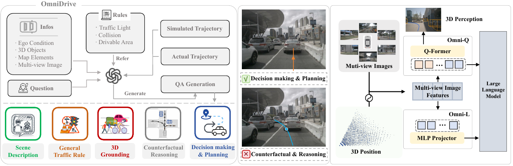
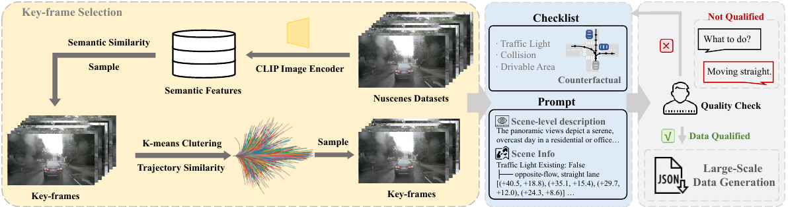
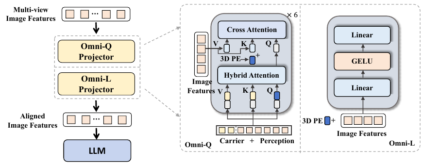
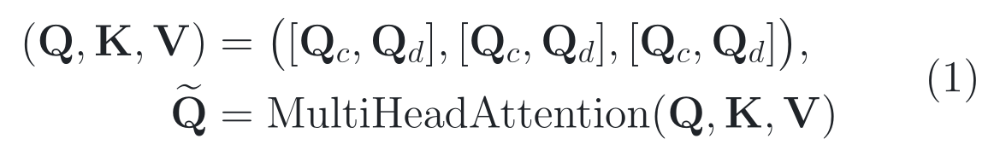
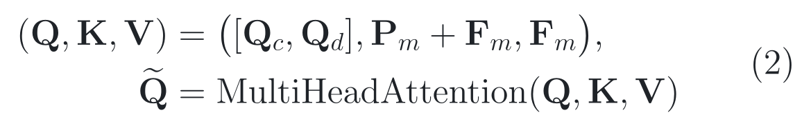
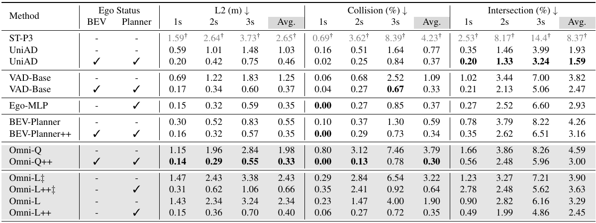
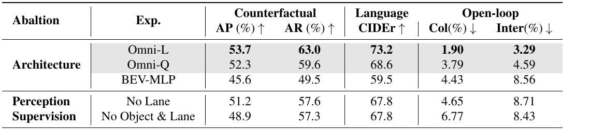

# 2026-07-25 — OmniDrive: A Holistic Vision-Language Dataset for Autonomous Driving with Counterfactual Reasoning

`CVPR 2025` · `正式录用` · `论文与官方源码已读` ·
`公开模型尚未在本仓库实际运行`

**主方向：** P11 · 大视觉模型、视觉-语言模型、大语言模型与视觉-语言-动作模型 ·
**模型输入：** 环视相机、语言；部分设置额外加入自车状态 ·
**训练监督与数据生成上下文：** 三维目标、车道/地图、轨迹 ·
**交叉标签：** 三维定位与指代、反事实推理、规划接口、数据生成、开放环评测

[▶ 从第一张图开始](#1-看图论文到底做了什么) ·
[返回首页](../../README.md) · [13 个感知方向](../../index/topics.md) ·
[全部精读](../../index/papers.md) ·
[CVF 录用页](https://openaccess.thecvf.com/content/CVPR2025/html/Wang_OmniDrive_A_Holistic_Vision-Language_Dataset_for_Autonomous_Driving_with_Counterfactual_CVPR_2025_paper.html) ·
[论文 PDF](https://openaccess.thecvf.com/content/CVPR2025/papers/Wang_OmniDrive_A_Holistic_Vision-Language_Dataset_for_Autonomous_Driving_with_Counterfactual_CVPR_2025_paper.pdf) ·
[代码 @ ced2073](https://github.com/NVlabs/OmniDrive/tree/ced207333cb18b69a232cbb9f82bf52089227f12) ·
[官方 v1.0 发布资产](https://github.com/NVlabs/OmniDrive/releases/tag/v1.0)

证据与行文标签：**[原文翻译]** 忠实翻译作者原文；**[笔记解释]** 帮助读者
建立直觉；**[论文]** 论文或正式 proceedings 直接支持；**[源码]** 固定
commit 直接支持；**[判断]** 本笔记基于证据的分析；**[未核验]** 尚未独立
运行、复算或向作者确认。译文中不混入笔记解释或判断。

## 0. 阅读起点：术语先导与摘要完整翻译

### 0.1 首次术语解释

**术语覆盖声明：** 摘要中的核心专业术语先在这里解释；正文后续第一次出现
的新术语仍会就地解释，之后全文保持相同中文名、英文名、缩写与符号。

- **视觉-语言模型（Vision-Language Model, VLM）**：把视觉输入与语言
  表示对齐，使模型能够围绕图像回答问题、生成描述或进行推理。
- **环视相机（surround cameras）**：安装在车辆不同方向、共同覆盖车身周围
  视野的多台相机；本文模型的主要视觉输入是六路 nuScenes 相机图像。
- **大语言模型智能体（Large Language Model Agent, LLM-agent）**：以大语言
  模型为推理核心、同时接收环境信息并输出解释、决策或动作的系统；本文讨论的
  agent 仍是驾驶模型框架，不等同于已经具备闭环安全能力的车辆。
- **端到端自动驾驶（end-to-end autonomous driving）**：以传感器信息为起点、
  以规划轨迹或控制量为终点进行联合学习；它可以包含可微的感知和规划模块，
  并不等于系统内部没有中间任务。
- **三维场景理解（3D scene understanding）**：不仅识别图像中的物体，还要
  理解物体、车道和本车在真实三维空间中的位置与几何关系。
- **反事实推理（counterfactual reasoning）**：针对没有真实执行的候选动作或
  轨迹，分析“如果这样做，可能产生什么结果”；本文主要检查碰撞、闯红灯和
  离开可行驶区域等后果。
- **合成数据标注（synthetic data annotation）**：由规则、仿真轨迹和生成模型
  辅助产生训练标签，而不是让人工逐条从零标注；“合成”不代表可以省去质检。
- **视觉-语言对齐（vision-language alignment）**：让视觉特征进入与语言
  token 可交互的表示空间，使 LLM 能够读取并表述场景信息。
- **三维定位与指代（3D grounding）**：把语言中的对象或关系落到具体三维
  目标、坐标或车道元素上，而不只生成听起来合理的描述。
- **开放环规划（open-loop planning）**：在已经录制的日志上预测本车轨迹，
  预测不会改变其他交通参与者的行为，也不会让环境对模型动作作出反馈。
- **自车状态（ego status）**：本车速度、历史运动、导航命令等非视觉状态；
  它能帮助规划，但也可能让模型绕过视觉理解而利用数据集捷径。
- **CIDEr（Consensus-based Image Description Evaluation）**：比较生成文本
  与参考描述中加权短语一致性的语言指标；分数高不自动等于三维感知正确。
- **AP / AR**：Table 5 把反事实任务的 Precision / Recall 汇总为 AP / AR；
  论文没有进一步给出跨类别聚合公式。本笔记只按表格上下文把它们理解为
  “平均精确率 / 平均召回率”，不把这一展开当作作者明确定义。
- **Omni-L 与 Omni-Q**：作者提出的两条基线框架；Omni-L 从成熟 VLM 出发
  注入三维信息，Omni-Q 从查询式三维感知模型出发连接语言模型。
- **查询向量（query）与视觉 token（visual token）**：query 是主动从特征中
  检索信息的可学习向量；visual token 是送入语言模型的一段视觉表示。本文的
  carrier query 携带语言模型要读取的信息，perception query 接受目标和地图
  等三维监督。
- **查询变换器（Querying Transformer, Q-Former）**：用一组可学习 query
  通过注意力从视觉特征中提取固定数量信息的模块，本文用于 Omni-Q。
- **多层感知机投影器（Multi-Layer Perceptron Projector, MLP projector）**：
  用小型全连接网络把视觉特征映射到 LLM hidden space，本文用于 Omni-L。
- **位置编码与交叉注意力（position encoding / cross-attention）**：前者把
  三维位置写入特征，后者让 query 作为查询端去读取多视角图像的键和值。
- **鸟瞰视图（Bird's-Eye View, BEV）**：从车辆上方俯视表示道路、目标与
  车道的统一坐标空间；它便于三维任务对齐，但不等于模型已经理解所有深度关系。
- **DriveLM 与 nuScenes**：前者是驾驶视觉问答基准，后者是多传感器自动驾驶
  数据集；本文分别用它们评测问答迁移和开放环规划。

### 0.2 摘要完整专业中文翻译

**原文锚点：** Abstract，PDF p. 1 / proceedings p. 22442。

<a id="abstract-a01"></a>
> **[原文翻译] Abstract · PDF p. 1 · A01**
>
> 视觉-语言模型（VLM）的进展，使自动驾驶领域越来越关注如何利用其强大的
> 推理能力。然而，要把这些能力从二维扩展到完整的三维理解，对于现实世界
> 应用至关重要。为应对这一挑战，我们提出 OmniDrive：一个整体性的视觉-
> 语言数据集，它通过反事实推理使智能体模型与三维驾驶任务对齐。该方法通过
> 评估潜在场景及其结果来增强决策能力，这与人类驾驶员考虑替代行动的方式
> 相似。我们基于反事实的合成数据标注流程能够生成大规模、高质量的数据集，
> 提供更稠密的监督信号，从而连接规划轨迹与基于语言的推理。进一步地，我们
> 探索了两种先进的 OmniDrive-Agent 框架，即 Omni-L 和 Omni-Q，用以比较
> 视觉-语言对齐与三维感知各自的重要性，并由此揭示设计有效 LLM 智能体的
> 关键认识。在 DriveLM 问答基准和 nuScenes 开放环规划上的显著改进，表明了
> 我们的数据集与方法的有效性。

**完整性声明：** 上述内容按原摘要唯一实质段落完整、未删减翻译；保留了
作者关于挑战、方法、数据生成、两种框架、评估目的与实验结论的论证顺序，
没有加入本笔记的评价或外推。

> [!TIP]
> **[笔记解释] 读完摘要再看这一句：** OmniDrive 不只问模型“眼前是什么”，
> 还给它一条假设轨迹，追问“如果这样开，会撞谁、压线还是闯红灯”。作者用
> 这类反事实问答训练两种 3D 驾驶 VLM，并报告 Omni-L 在无 ego status 时取得
> 53.7% 反事实 AP、73.2 CIDEr、1.90% collision 和 3.29% intersection；
> 但实验仍是 nuScenes 开放环评测，加入 ego status 后多个规划指标会出现巨大
> 跃升，而论文明确承认反事实模拟没有考虑其他交通参与者的响应。

**学习顺序：**
[0 摘要与术语](#0-阅读起点术语先导与摘要完整翻译) →
[1 看原图](#1-看图论文到底做了什么) →
[2 读原式](#2-读公式核心机制怎样表达) →
[3 看结果](#3-看结果证据是否支持主张) →
[4 对源码](#4-对源码公式如何落地) →
[5 记结论](#5-记结论贡献边界与开放问题)

**只有 10 分钟：** 先读
[1.1 的路口故事](#11-先讲人话它不是让模型背标准答案而是让模型试走岔路) →
[Figure 3 的两条模型路线](#14-同一批图像怎样送进大模型omni-l-与-omni-q) →
[Table 2 的 ego-status 对照](#33-先看一个危险现象加入-ego-status-后指标突然变得太好) →
[第 5 节的研究切口](#533-最值得继续研究的切口不是再拼一个模块而是验证反事实是否真的落地)。

> [!NOTE]
> “模型能说出合理理由”不等于“模型看对了三维场景”；“开放环轨迹误差更小”
> 不等于“闭环驾驶更安全”；“源码已读”也不等于“论文结果已复现”。
> 下文会把语言质量、3D 感知、规划指标和闭环安全分开讨论。

## 1. 看图：论文到底做了什么

### 1.1 先讲人话：它不是让模型背标准答案，而是让模型“试走岔路”

想象本车正接近一个路口：

```text
真实示范：保持车道，减速直行。
假设轨迹 A：突然加速并左转。
假设轨迹 B：继续直行，但越过道路边界。
假设轨迹 C：跟随示范轨迹安全通过。
```

普通模仿学习主要把“真实示范”当答案。问题是，一条安全轨迹只告诉模型
“司机最后怎么做”，没有系统解释其他选择为什么危险。

OmniDrive 的想法是给同一个场景增加很多“如果”：

- 如果沿轨迹 A 行驶，会不会与迎面车辆冲突？
- 如果沿轨迹 B 行驶，什么时候会离开可行驶区域？
- 哪个交通参与者真正限制了当前决策？
- 下一步该做什么，理由是否能落到具体对象、车道和交通规则？

这里的 **counterfactual reasoning（反事实推理）** 不是预测“世界必然会怎样”，
而是在给定一条没有真实执行的候选轨迹后，判断它可能违反哪些几何约束和
交通规则。它把稀疏的单条专家轨迹扩展成“安全选择 + 多种错误选择 + 错误原因”。

三个概念不要混在一起：

1. **3D Grounding** 回答“危险对象在哪里”；
2. **Counterfactual reasoning** 回答“如果这样走，会发生什么”；
3. **Planning** 回答“本车接下来应该怎样走”。

论文的故事性就在于把这三件事沿同一条候选轨迹连接起来。

### 1.2 一张图看全局：数据、任务和模型怎样串起来



> **原图出处：** Wang et al., CVPR 2025, Figure 1，PDF p. 1 /
> proceedings p. 22442。[官方 PDF](https://openaccess.thecvf.com/content/CVPR2025/papers/Wang_OmniDrive_A_Holistic_Vision-Language_Dataset_for_Autonomous_Driving_with_Counterfactual_CVPR_2025_paper.pdf)。
> 仅作学术讲解所需的局部摘录，原图版权归原作者及其他权利人。

从左到右分三段读：

**第一段：先把场景变成可检查的问题。** 输入包括多视角图像、3D 目标、
地图元素、自车条件、问题、真实轨迹和模拟轨迹。规则检查器关注红绿灯、
碰撞和可行驶区域，再生成问答。

**第二段：任务不只是一句 caption。** 数据覆盖场景描述、一般交通规则、
3D Grounding、反事实推理、决策与规划。最关键的中间桥梁是“候选轨迹”：
语言问题不再悬在空中，而是尽量绑定到一条具体空间路径。

**第三段：作者故意比较两种相反的建模偏好。**

- **Omni-Q** 从传统稀疏 3D perception query 出发，再把 carrier query
  送给大语言模型；
- **Omni-L** 从 LLaVA 式 VLM 出发，用 MLP 对齐多视角视觉 token 与语言。

**看完应能复述：** OmniDrive 用反事实轨迹生成更密集的驾驶问答，再比较
“先做强 3D 感知”与“先做强视觉—语言对齐”哪条路线更适合驾驶 VLM。

**这张图没有证明：** 生成的每个理由都真实、开放环规划能转化成闭环安全，
也没有证明 Omni-L 与 Omni-Q 的差异只来自 projector；两条路线的表征和
预训练方式也不同。

### 1.3 反事实问答怎样生产：先筛关键帧，再做规则检查，最后人工质检



> **原图出处：** Wang et al., CVPR 2025, Figure 2，PDF p. 3 /
> proceedings p. 22444。[官方 PDF](https://openaccess.thecvf.com/content/CVPR2025/papers/Wang_OmniDrive_A_Holistic_Vision-Language_Dataset_for_Autonomous_Driving_with_Counterfactual_CVPR_2025_paper.pdf)。
> 仅作学术讲解所需的局部摘录，原图版权归原作者及其他权利人。

Figure 2 的四步流程很像给“自动出题老师”加一套审核制度：

1. **选有信息量的帧。** 一路直行的相邻画面高度重复，作者同时按 CLIP
   语义相似度和轨迹相似度采样关键帧；
2. **构造不同驾驶行为。** 轨迹被归纳为停止、前进、左转、右转、掉头、
   加速、减速和匀速等类型；
3. **用可计算规则兜底。** 3D boxes、车道中心线和道路拓扑被用于检查
   目标碰撞、道路边界和红灯等条件；
4. **再让 GPT-4 组织语言并由人检查。** 作者先在选定关键帧上人工核验
   问答质量，并反复调整 checklist 和 prompt；当这套设计满足其泛化要求后，
   才启动大规模数据生成。论文没有公开逐条样本的通过率或退回规则。

论文还给出一个容易忽略的细节：未来 3 秒内，某个对象到轨迹的最小距离小于
10 米时，会被列为“close object”。这使问题能指向具体风险对象，而不是只让
模型泛泛地说“注意安全”。

> [!IMPORTANT]
> Checklist 能验证的主要是结构化规则；“人类在环”主要参与提示词、规则和
> 质量控制设计。它仍不等于每条生成答案都有独立的人类事实标注，更不等于
> GPT-4 的交通常识在所有地区、天气和罕见场景都可靠。

### 1.4 同一批图像怎样送进大模型：Omni-L 与 Omni-Q



> **原图出处：** Wang et al., CVPR 2025, Figure 3，PDF p. 5 /
> proceedings p. 22446。[官方 PDF](https://openaccess.thecvf.com/content/CVPR2025/papers/Wang_OmniDrive_A_Holistic_Vision-Language_Dataset_for_Autonomous_Driving_with_Counterfactual_CVPR_2025_paper.pdf)。
> 仅作学术讲解所需的局部摘录，原图版权归原作者及其他权利人。

**Omni-L：给成熟 VLM 加一副“三维眼镜”。**

- **视觉 token 从哪里来：** 展平多视角 patch，加入三维位置编码，再经过 MLP；
- **主要偏好：** 优先保持视觉—语言预训练空间。

**Omni-Q：给三维检测器加一位“语言翻译员”。**

- **视觉 token 从哪里来：** carrier query 与 detection/map query 先交互，
  再共同读取多视角特征；
- **主要偏好：** 优先保留稀疏三维几何与感知监督。

Omni-L 的位置编码权重被初始化为零，意图是在不立即破坏原有 VLM 对齐的
情况下逐步学习三维信息。Omni-Q 则让两类 query 先互相交流：

- carrier query 负责携带可送入 LLM 的视觉信息；
- perception query 继续承担目标和地图等 3D 监督；
- 随后的 cross-attention 再从多视角图像中取信息。

这不是简单的“一个有 3D、一个没有 3D”。更准确的说法是：

> Omni-Q 把 3D 感知 query 当作语言 token 的教师和邻居；Omni-L 尽量让
> 原有 VLM 视觉 token 保持熟悉的分布，再额外注入三维位置。

## 2. 读公式：核心机制怎样表达

论文真正不可替代的原式只有两条，恰好描述 Omni-Q 的两次 attention。
为兼容 GitHub iPad App，本节使用按内容紧裁的 2× 深浅色 PNG；正文变量用
标准数学符号，且每张公式图都链接到
[统一 TeX 源文件](../../assets/notes/2026-07-25-omnidrive/formulas/source.tex)。

### 2.1 原式 (1)：carrier query 与 perception query 先开一次“内部会议”

**原文公式：** 论文 Eq. (1)，PDF p. 5 / proceedings p. 22446。

<p align="center"><picture><source media="(prefers-color-scheme: dark)" srcset="../../assets/notes/2026-07-25-omnidrive/formulas/eq-01-query-self-attention-dark.png"></picture></p>

> **公式来源：** Wang et al., CVPR 2025, Eq. (1)，PDF p. 5 /
> proceedings p. 22446；本图按原符号重排。
> [官方 PDF](https://openaccess.thecvf.com/content/CVPR2025/papers/Wang_OmniDrive_A_Holistic_Vision-Language_Dataset_for_Autonomous_Driving_with_Counterfactual_CVPR_2025_paper.pdf) ·
> [可复制 TeX](../../assets/notes/2026-07-25-omnidrive/formulas/source.tex#L5-L17)。

**符号说明**

- ***Q***<sub>*c*</sub>：carrier queries，最终要把视觉信息携带给 LLM；
- ***Q***<sub>*d*</sub>：detection/perception queries，受目标与坐标等
  3D 感知任务监督；
- [·, ·]：沿 token 维拼接；
- ***Q***、***K***、***V***：attention 的 query、key、value；
- ***Q̃***：两类 token 交流后的表示。

**纯文字读法：** 把 carrier query 和 perception query 拼成同一串 token，
这串 token 同时作为 query、key 和 value 做一次 multi-head self-attention。
因此 carrier 能读取 detector 学到的三维结构，perception token 也处在同一个
交互空间中。

**玩具例子（教学示例，不是论文实验）：** 假设只有 2 个 carrier token 和
3 个 detection token，拼接后得到 5 个 token 的“会议桌”。其中一个 carrier
原本只看见“前方有视觉纹理”，attention 后可以从 detection token 得到
“该纹理对应 12 米外车辆”的结构化线索。

**专业解释：** 这一步的目标不是直接生成文本，而是建立语言载体与传统
3D query 之间的信息通道。论文为简洁省略了 position encoding；实现还需要
reference points、时序 memory、denoising mask 和 query mask。

**回到上面的图：** 对应 Figure 3 Omni-Q 中下方的 Hybrid Attention。

**落到源码：**
[StreamPETR head 构造 extra query、mask 并调用 transformer](https://github.com/NVlabs/OmniDrive/blob/ced207333cb18b69a232cbb9f82bf52089227f12/projects/mmdet3d_plugin/models/dense_heads/streampetr_head.py#L533-L562)。
固定提交中 `num_extra` 对应提供给 VLM 的 carrier tokens；当 `with_mask=True`
时，普通 perception query 被阻止反向读取 carrier token，但 carrier 仍可读取
perception query。

**公式省略了什么：** 论文写的是对称 self-attention 形式，源码却通过
attention mask 加入了方向性约束；此外源码还把时序 memory 送进 transformer，
所以实际信息流比两行公式更丰富。

### 2.2 原式 (2)：两类 query 再共同读取多视角图像

**原文公式：** 论文 Eq. (2)，PDF p. 5 / proceedings p. 22446。

<p align="center"><picture><source media="(prefers-color-scheme: dark)" srcset="../../assets/notes/2026-07-25-omnidrive/formulas/eq-02-image-cross-attention-dark.png"></picture></p>

> **公式来源：** Wang et al., CVPR 2025, Eq. (2)，PDF p. 5 /
> proceedings p. 22446；本图按原符号重排。
> [官方 PDF](https://openaccess.thecvf.com/content/CVPR2025/papers/Wang_OmniDrive_A_Holistic_Vision-Language_Dataset_for_Autonomous_Driving_with_Counterfactual_CVPR_2025_paper.pdf) ·
> [可复制 TeX](../../assets/notes/2026-07-25-omnidrive/formulas/source.tex#L19-L31)。

**符号说明**

- ***F***<sub>*m*</sub>：多视角图像特征；
- ***P***<sub>*m*</sub>：与图像特征对应的 3D position encoding；
- ***P***<sub>*m*</sub> + ***F***<sub>*m*</sub>：作为 key，回答“哪里有什么”；
- ***F***<sub>*m*</sub>：作为 value，提供真正要汇聚的视觉内容。

**纯文字读法：** carrier 与 perception queries 共同去查询多视角视觉特征；
视觉特征加上三维位置后作为 key，原视觉特征作为 value。attention 权重因而
同时受“外观像什么”和“它处于什么三维位置”影响。

**玩具例子（教学示例，不是论文实验）：** 前视相机和左前相机都拍到同一辆车。
如果只按纹理匹配，两个 patch 可能被当成两个对象；加入由相机内外参得到的
三维位置后，query 更有机会把它们理解为同一空间邻域中的证据。

**专业解释：** 这里的 3D encoding 不是最终检测框，而是把多视角 patch
映射到可供 cross-attention 区分的几何坐标。它提供几何先验，但不会自动解决
遮挡、深度歧义、外参误差或跨视角重复计数。

**回到上面的图：** 对应 Figure 3 Omni-Q 上方的 Cross Attention。

**落到源码：**
[Petr3D 根据采样位置和相机外参生成 3D position embedding](https://github.com/NVlabs/OmniDrive/blob/ced207333cb18b69a232cbb9f82bf52089227f12/projects/mmdet3d_plugin/models/detectors/petr3d.py#L230-L247)，
[StreamPETR head 展平多视角 feature 并把 feature、query position 和 position embedding 交给 transformer](https://github.com/NVlabs/OmniDrive/blob/ced207333cb18b69a232cbb9f82bf52089227f12/projects/mmdet3d_plugin/models/dense_heads/streampetr_head.py#L524-L550)。

**公式省略了什么：** 实现中还存在相机数量、空间分辨率、深度离散、
reference point、时序对齐、mask 和投影维度；公式表达的是核心角色分工，
不是可直接运行的完整 forward pass。

## 3. 看结果：证据是否支持主张

### 3.1 原文公开的实验配置

**原文锚点：** Experiment §4.1–4.2，PDF p. 5–6 / proceedings
p. 22446–22447；官方固定 commit 的 setup、训练文档与主配置。

- **数据集与任务。** **[论文]**（§4.2，PDF p. 6）OmniDrive 同时包含场景描述、开放环规划和
  反事实推理任务。迁移评测使用 DriveLM；论文报告该 benchmark 取自
  nuScenes 的 696 个场景、4,072 个样本和约 30 万个图像—问题对。
  **[源码]** [固定 SHA 主配置](https://github.com/NVlabs/OmniDrive/blob/ced207333cb18b69a232cbb9f82bf52089227f12/projects/configs/OmniDrive/mask_eva_lane_det_vlm.py#L170-L253)
  使用 `CustomNuScenesDataset`，训练集读取
  `nuscenes2d_ego_temporal_infos_train.pkl`，验证和测试均读取对应的
  `val.pkl`；setup 要求 nuScenes v1.0-trainval、作者发布的 VQA/description/
  conversation/keyword 数据及车道—目标关系文件。
- **传感器与空间范围。** **[源码]**
  [固定 SHA 输入配置](https://github.com/NVlabs/OmniDrive/blob/ced207333cb18b69a232cbb9f82bf52089227f12/projects/configs/OmniDrive/mask_eva_lane_det_vlm.py#L9-L32)
  只启用多视角相机，关闭 LiDAR 和
  Radar 输入；三维监督覆盖 *x*、*y* 方向各 −51.2 m 到 51.2 m，*z* 方向
  −5 m 到 3 m。这里的 `box_type_3d='LiDAR'` 表示三维框坐标类型，不表示模型
  使用 LiDAR 点云作为输入。
- **图像与文本预处理。** **[源码]**
  [固定 SHA 数据流水线](https://github.com/NVlabs/OmniDrive/blob/ced207333cb18b69a232cbb9f82bf52089227f12/projects/configs/OmniDrive/mask_eva_lane_det_vlm.py#L170-L253)
  记录原图配置为 1600 × 900；图像增强参数
  `final_dim=(320, 640)` 按 `(H, W)` 表示高 320、宽 640，随后多视角图像
  又由 `ResizeMultiview3D(img_scale=(640, 640))` 统一 resize 到 640 × 640、按给定
  mean/std 归一化并 pad 到 32 的倍数。VQA 分词器（tokenizer，把文本转换为
  模型 token ID）的最大长度为 2,048；
  测试配置默认只加载 `planning`，源码注释说明一次测试全部问题会很耗时。
- **模型与初始化。** **[论文]**（§3.3 与 §4.1，PDF p. 5–6）视觉编码器采用
  EVA-02-L，它通过掩码图像建模
  （masked image modeling，即遮住部分图像后学习恢复表征）蒸馏 CLIP，以提取
  与语言对齐的视觉特征。训练分为二维预训练
  和三维微调：前者初始化 Q-Former/MLP projector，后者加入运动规划、反事实
  推理等三维驾驶任务。**[源码]**
  [固定 SHA 模型配置](https://github.com/NVlabs/OmniDrive/blob/ced207333cb18b69a232cbb9f82bf52089227f12/projects/configs/OmniDrive/mask_eva_lane_det_vlm.py#L33-L85)
  使用 24 层、宽度 1,024 的 EVA
  ViT，启用 Flash Attention（高效注意力实现）、梯度检查点
  （gradient checkpointing，用计算换显存）和低秩适配
  （Low-Rank Adaptation, LoRA），并从
  `eva02_petr_proj.pth` 与 `pretrain_qformer/` 初始化。
- **论文方法与当前数据生成代码的版本边界。** **[论文]**（§2.1–2.3，
  PDF p. 2–4）把用于合成标注的
  生成模型写为 GPT-4。**[源码]** 固定 commit 的 `data_gen/desc.py`、
  `conversation.py` 和 `prompt_vision.py` 已使用 GPT-4o，且分别公开了
  temperature、top-p 和 max_tokens。它们是当前仓库脚本的事实，不能反推
  论文原始数据就是由 GPT-4o 生成；论文所用 GPT-4 的日期快照和完整调用参数
  仍未闭合。[固定 SHA 生成脚本](https://github.com/NVlabs/OmniDrive/blob/ced207333cb18b69a232cbb9f82bf52089227f12/data_gen/desc.py#L112-L144)。
- **Omni-L / Omni-Q 的实现边界。** **[论文]**（§3.1–3.3，PDF p. 4–5）
  给出两条框架及共同训练口径。
  **[源码]** 固定 commit 的公开主配置 `mask_eva_lane_det_vlm.py` 与
  `eva_base_tinyllama.py` 主要对应带 StreamPETR object/map heads 的
  Omni-Q 式查询架构；没有发现能够独立闭合论文 Omni-L 的完整配置与训练日志。
  因此，下文的 config 数字不能无条件套到 Omni-L。
  [固定 SHA 配置目录中的主配置](https://github.com/NVlabs/OmniDrive/blob/ced207333cb18b69a232cbb9f82bf52089227f12/projects/configs/OmniDrive/mask_eva_lane_det_vlm.py#L20-L85)。
- **论文报告的优化设置。** **[论文]**（§4.1，PDF p. 5–6）二维预训练的数据与 batch size、学习率
  和优化器沿用 LLaVA v1.5，本文没有在 PDF 中重新列出这些数值。三维微调使用
  AdamW、总 batch size 16；projector 学习率为 4e-4，视觉编码器和 LLM
  学习率均为 2e-5，并使用 cosine annealing。
- **固定源码配置的优化设置。** **[源码]**
  [固定 SHA 优化器配置](https://github.com/NVlabs/OmniDrive/blob/ced207333cb18b69a232cbb9f82bf52089227f12/projects/configs/OmniDrive/mask_eva_lane_det_vlm.py#L258-L295)
  按 8 GPU × 每卡 2 样本运行
  6 个 epoch，即每个 epoch 1,758 iteration、最多 10,548 iteration。带解耦
  权重衰减的 AdamW
  基础学习率为 1e-4、weight decay 为 1e-4，并通过 paramwise decay 为不同
  模块设置倍率；使用 500 iteration 线性预热（linear warmup）、余弦退火
  （cosine annealing）、动态 FP16 混合精度 loss scale 和最大范数 35 的
  梯度裁剪（gradient clipping）。论文按模块
  直接报告的学习率与 config 的“基础学习率 + 模块倍率”口径不同，复现时不能
  只抄其中一个数字。
- **环境与硬件。** **[源码]**
  [固定 SHA setup](https://github.com/NVlabs/OmniDrive/blob/ced207333cb18b69a232cbb9f82bf52089227f12/docs/setup.md#L3-L75)
  安装说明指定 Python 3.9、PyTorch 1.13.1 +
  CUDA 11.7、Flash-Attention 2.5.6、Transformers 4.31.0、MMCV 1.6.2、
  MMDetection 2.28.2、MMSegmentation 0.30.0 和 MMDetection3D
  v1.0.0rc6。**[源码]** 官方 v1.0 release 中的一次训练日志另行记录为
  8 × NVIDIA A100-SXM4-80GB、Python 3.8.10、CUDA Runtime 11.8、
  PyTorch 1.13.0a0、MMCV 1.6.0、MMDetection 2.28.2 和
  MMDetection3D 1.0.0rc6+；日志从训练开始到最后一次保存约 14 小时 10 分，
  随后的验证约 1 小时 30 分，后期训练条目的 `memory` 字段约 38,290 MB。
  这是一个官方发布运行，不等于论文所有 Table 2–5 结果都由这一运行产生，
  在没有进一步核验 MMCV 日志语义前，也不能把该字段直接当作每进程、每卡或
  完整系统的峰值显存，更不能据此推算能耗。
- **验证、随机性与模型检查点（checkpoint）。** **[源码]**
  [固定 SHA 运行配置](https://github.com/NVlabs/OmniDrive/blob/ced207333cb18b69a232cbb9f82bf52089227f12/projects/configs/OmniDrive/mask_eva_lane_det_vlm.py#L248-L295)
  在完整训练
  结束时执行一次 evaluation，每半个 epoch 保存 checkpoint，最多保留 3 个。
  官方 v1.0 日志记录 `seed=0`、`deterministic=False`；固定 config 本身没有
  把 seed 写成自包含参数，论文也没有报告独立重复、误差条、显著性检验或
  “最佳模型”的选择规则。因此一个公开 seed 的单次运行，仍不能把小幅表格
  差异自动解释为稳定的统计改进。
- **推理设置。** **[源码]**
  [固定 SHA 生成参数](https://github.com/NVlabs/OmniDrive/blob/ced207333cb18b69a232cbb9f82bf52089227f12/projects/mmdet3d_plugin/models/detectors/petr3d.py#L433-L454)
  使用控制随机性的 temperature 0.1、
  核采样阈值 top-p 0.75、1 个 beam，最多生成 320 个新 token；开放环规划
  先分布式生成结果，再运行 `evaluation/eval_planning.py`。官方 v1.0
  `extract_counter.py` 用 8 个并行进程调用 `gpt-3.5-turbo`，并公开
  temperature 0.7、top-p 0.9、max_tokens 2,000；但没有固定带日期的模型
  snapshot，也没有报告重复调用的一致性或随机性敏感性。本笔记没有执行这些
  云端调用或复算指标。
- **指标与公平对照。** **[论文]**（§4.2，PDF p. 6）描述任务使用 CIDEr；开放环规划使用 1/2/3
  秒 L2、碰撞率和道路边界相交率；反事实评测先由 GPT-3.5 抽取 safety、
  collision、red light、drivable area 等关键词，再计算各类 Precision 和
  Recall。Table 5 再以 AP / AR 汇总，但论文未进一步公开跨类别聚合公式，
  因而不能仅凭缩写断言其精确实现。DriveLM 综合分数由 GPT Score 0.4、
  Language Score 0.2、Match
  Score 0.2、Accuracy 0.2 加权。Table 2 的传统基线主要引用 BEV-Planner
  的统一复现结果，并分开比较是否输入 ego status。
- **公开权重与复现入口。** **[源码]**
  [固定 SHA setup 与下载入口](https://github.com/NVlabs/OmniDrive/blob/ced207333cb18b69a232cbb9f82bf52089227f12/docs/setup.md#L43-L75)
  提供二维 LLM 权重、视觉编码器加
  projector 权重、OmniDrive checkpoint、数据包和评测脚本。**[未核验]**
  “文件已公开”只说明具备复现入口；本仓库没有下载大权重、执行 CUDA forward
  或复算论文表格。

[环境、数据与预训练权重](https://github.com/NVlabs/OmniDrive/blob/ced207333cb18b69a232cbb9f82bf52089227f12/docs/setup.md#L3-L75) ·
[训练与开放环评测命令](https://github.com/NVlabs/OmniDrive/blob/ced207333cb18b69a232cbb9f82bf52089227f12/docs/training_inference..md#L1-L40) ·
[输入、模型与批量配置](https://github.com/NVlabs/OmniDrive/blob/ced207333cb18b69a232cbb9f82bf52089227f12/projects/configs/OmniDrive/mask_eva_lane_det_vlm.py#L9-L85) ·
[数据流水线与优化设置](https://github.com/NVlabs/OmniDrive/blob/ced207333cb18b69a232cbb9f82bf52089227f12/projects/configs/OmniDrive/mask_eva_lane_det_vlm.py#L170-L295) ·
[当前场景描述生成脚本](https://github.com/NVlabs/OmniDrive/blob/ced207333cb18b69a232cbb9f82bf52089227f12/data_gen/desc.py#L112-L144) ·
[当前多轮问答生成脚本](https://github.com/NVlabs/OmniDrive/blob/ced207333cb18b69a232cbb9f82bf52089227f12/data_gen/conversation.py#L105-L137) ·
[当前视觉提示生成脚本](https://github.com/NVlabs/OmniDrive/blob/ced207333cb18b69a232cbb9f82bf52089227f12/data_gen/prompt_vision.py#L195-L202) ·
[官方 v1.0 训练日志](https://github.com/NVlabs/OmniDrive/releases/download/v1.0/20250417_143029.log) ·
[官方 v1.0 发布页（含反事实抽取脚本）](https://github.com/NVlabs/OmniDrive/releases/tag/v1.0)

### 3.2 原文公开的实验流程

**原文锚点：** Method §3.3 与 Experiment §4.1–4.5，PDF p. 5–7 /
proceedings p. 22446–22448；官方固定 commit 的数据、训练和评测入口。

1. **数据准备。** **[论文]**（§2.1–2.3，PDF p. 2–4）作者先从真实轨迹和模拟候选轨迹生成场景描述、
   三维定位、交通规则、反事实与规划问答，再用 checklist 和人工参与的质量
   控制筛选。**[源码]** setup 下载 nuScenes 与作者信息文件，把 LiDAR 坐标系
   中的 GT 转到 ego 坐标系并加入车辆总线（CAN bus）状态与导航 command；
   训练 loader 再装载多视角
   图像、三维框、车道、VQA、description、conversation 和 keyword。论文
   数据生成口径是 GPT-4；固定 commit 的现行生成脚本是 GPT-4o，两者必须分别
   记录，不能把当前脚本版本当成原始数据生成过程的完整复刻。
   [固定 SHA 数据准备入口](https://github.com/NVlabs/OmniDrive/blob/ced207333cb18b69a232cbb9f82bf52089227f12/docs/setup.md#L43-L75)。
2. **二维预训练。** **[论文]**（§3.3，PDF p. 5）使用二维图像任务初始化 Omni-Q 的 Q-Former
   或 Omni-L 的 MLP projector；数据与优化策略沿用 LLaVA v1.5。论文没有在
   当前 PDF 中完整重复该阶段的数据混合、step 数和所有超参数，复现必须继续
   回查 LLaVA 设置与作者发布的 `pretrain_qformer` 权重；固定 commit 也没有
   提供可独立闭合 Omni-L 的完整训练配置与日志。
3. **三维微调。** **[论文]**（§3.3，PDF p. 5）在运动规划、反事实推理等三维驾驶任务上微调，
   两个阶段都只计算文本生成损失，不采用 BLIP-2 的 contrastive learning 和
   matching loss。**[源码]** 同一个 batch 中还计算三维目标与地图监督，再把
   object/map query 投影成视觉 token 插入 LLM 序列，联合优化感知与文本损失。
   [固定 SHA 联合训练入口](https://github.com/NVlabs/OmniDrive/blob/ced207333cb18b69a232cbb9f82bf52089227f12/projects/mmdet3d_plugin/models/detectors/petr3d.py#L277-L307)。
4. **保存与验证。** **[源码]**
   [固定 SHA checkpoint/evaluation 配置](https://github.com/NVlabs/OmniDrive/blob/ced207333cb18b69a232cbb9f82bf52089227f12/projects/configs/OmniDrive/mask_eva_lane_det_vlm.py#L248-L295)
   显示训练按 8 GPU 分布式执行，半个 epoch 保存一次
   checkpoint，最终 evaluation interval 对应完整 6 个 epoch；官方 v1.0
   日志的一次运行使用 seed 0 且 `deterministic=False`。**[未核验]** 公开材料
   没有形成“多随机种子训练 → 验证集选模 → 报告均值与方差”的闭环，论文也
   没有把该日志逐项对应到各张结果表。
5. **任务化推理。** **[源码]**
   [固定 SHA 测试配置](https://github.com/NVlabs/OmniDrive/blob/ced207333cb18b69a232cbb9f82bf52089227f12/projects/configs/OmniDrive/mask_eva_lane_det_vlm.py#L239-L253)
   让测试 loader 按 planning、conversation 或
   counterfactual 分开构造问题；默认 `planning` 模式进行自回归生成并把每个
   sample 的文本结果写入指定目录。不同任务不是一次统一前向后直接得到所有
   指标。
6. **最终评测。** **[论文/源码]**（§4.2，PDF p. 6；
   [固定 SHA 评测脚本](https://github.com/NVlabs/OmniDrive/blob/ced207333cb18b69a232cbb9f82bf52089227f12/evaluation/eval_planning.py)）开放环规划把生成轨迹送入
   `eval_planning.py` 计算 L2、碰撞和道路相交；反事实回答先由抽取脚本/GPT-3.5
   转成事故类别关键词，再与标签计算 Precision/Recall。发布脚本公开了
   `gpt-3.5-turbo`、temperature 0.7、top-p 0.9、max_tokens 2,000 和 8 个
   并行进程，但没有固定服务端模型快照或重复调用稳定性；DriveLM 则组合语言、
   几何匹配、选择题准确率和 GPT 评分。最后分别报告无 ego status 与加入
   ego status 的规划结果，检查模型是否利用状态捷径。
7. **迁移与消融。** **[论文]**（§4.4–4.6，PDF p. 6–7）Omni-L 在 DriveLM-only、加入 OmniDrive、
   加入 LLaVA665K、两者都加入四种预训练组合下比较；Omni-L、Omni-Q、
   BEV-MLP 以及移除 lane/object supervision 的版本用于区分语言基础能力、
   三维监督与架构选择的贡献。

**复现仍缺什么：** OmniDrive 自有数据的总问答数、各任务数量和训练/验证
分布没有像 DriveLM 迁移 benchmark 的 696 scenes / 4,072 samples / 约 30 万
图像—问题对那样清晰报告；还缺二维预训练的自包含数据混合、step 数和完整
超参数，论文原始 GPT-4 的日期快照与调用参数，人工质控人员与培训、抽查比例、
通过/拒绝规则及标注一致性，Omni-L 独立配置与日志，多随机种子统计，最佳
checkpoint 规则，官方 release 日志与各张论文表格的一一对应，以及
GPT-3.5 服务端模型快照与重复调用稳定性。闭环模拟器配置也尚未出现，因为论文
本身没有运行闭环实验。最短可审查流程应是“数据路径检查 → 单样本 loader →
token/shape 测试 → 单 batch loss → 小子集生成 → 官方 evaluator”，而不是
直接把公开 checkpoint 或一份官方日志当成所有结果均已复现。

### 3.3 先看一个危险现象：加入 ego status 后，指标突然变得“太好”



> **原图出处：** Wang et al., CVPR 2025, Table 2，PDF p. 6 /
> proceedings p. 22447。[官方 PDF](https://openaccess.thecvf.com/content/CVPR2025/papers/Wang_OmniDrive_A_Holistic_Vision-Language_Dataset_for_Autonomous_Driving_with_Counterfactual_CVPR_2025_paper.pdf)。
> 仅作学术讲解所需的局部摘录，原图版权归原作者及其他权利人。

先只看**不使用 ego status** 的 Omni-Q 与 Omni-L：

| 模型 | Avg. L2 ↓ | Avg. Collision ↓ | Avg. Intersection ↓ |
|---|---:|---:|---:|
| Omni-Q | 1.98 m | 3.79% | 4.59% |
| Omni-L | 2.34 m | **1.90%** | **3.29%** |

Omni-Q 的平均轨迹距离更小，但 Omni-L 的碰撞率和道路边界相交率更低。
这说明“更接近专家轨迹”和“几何上更安全”并非同一个指标。

再看加入 ego status / planner 的 “++” 版本：

| 模型 | Avg. L2 ↓ | Avg. Collision ↓ | Avg. Intersection ↓ |
|---|---:|---:|---:|
| Omni-Q++ | **0.33 m** | **0.30%** | 3.00% |
| Omni-L++ | 0.40 m | 0.35% | **2.45%** |

数字变好并不一定全来自视觉理解。论文自己指出，模型可能从自车状态中学习
专家轨迹的强先验，甚至绕过困难的视觉推理。开放环日志中“当前速度、历史动作、
高层命令”与未来轨迹高度相关，因此 ego status 可能成为 shortcut。

> [!WARNING]
> Table 2 证明“加入 ego status 与指标大幅改善同时发生”，并支持作者提出的
> 过拟合风险；它没有单独量化模型到底有多少预测来自图像、多少来自 ego status，
> 也没有证明低碰撞率能在交互式闭环中维持。

### 3.4 语言对齐与 3D 感知不是二选一：Table 5 给出了更细的证据



> **原图出处：** Wang et al., CVPR 2025, Table 5，PDF p. 8 /
> proceedings p. 22449。[官方 PDF](https://openaccess.thecvf.com/content/CVPR2025/papers/Wang_OmniDrive_A_Holistic_Vision-Language_Dataset_for_Autonomous_Driving_with_Counterfactual_CVPR_2025_paper.pdf)。
> 仅作学术讲解所需的局部摘录，原图版权归原作者及其他权利人。

从表中可以读出三层结论。

**第一层：Omni-L 的整体权衡最好。**

- 反事实 AP / AR：53.7 / 63.0；
- 语言 CIDEr：73.2；
- Collision / Intersection：1.90% / 3.29%。

**第二层：只把 BEV 接 MLP 并不够。** BEV-MLP 的反事实 AP 为 45.6，
CIDEr 为 59.5，Collision 为 4.43%。几何表示本身不会自然变成语言可用的
token；视觉—语言预训练分布和 projector 设计仍然重要。

**第三层：3D perception supervision 仍有明显价值。** 去掉 lane supervision
后，Collision 从 Omni-Q 的 3.79% 恶化到 4.65%；同时去掉 object 与 lane
supervision 后进一步到 6.77%。所以正确结论不是“VLM 可以抛弃 3D 感知”，
而是：

> 强语言对齐改善整体推理，但 object/lane supervision 仍然为碰撞与道路约束
> 提供可测的几何支撑；尚未解决的是怎样让两者在同一 token 空间中互不牺牲。

### 3.5 迁移证据与评测边界

**[论文] 迁移到 DriveLM。** Table 3 中，DriveLM 的综合 Score 从 0.53
提高到加入 OmniDrive 预训练后的 0.56；与 LLaVA665K 一起预训练时达到 0.58。

**[判断]** 这些结果提供了跨 benchmark 迁移的正面证据，但仍不能排除问题
模板、场景域或语言分布重合带来的贡献；增益也只来自相邻的驾驶 VQA 数据域。

**[论文] 反事实分类。** Table 4 中，Omni-L 在 “Safe” 上达到 72.1%
Precision / 58.0% Recall；Omni-Q 在 “Collision” 上达到 32.3% Precision /
72.6% Recall。后者与 3D perception supervision 更直接相关。

**[论文] 指标实现。** Counterfactual Precision / Recall 不是由连续物理仿真
直接算出，而是先让 GPT-3.5 从回答中抽取 safety、collision、red light 和
drivable area 等关键词，再与标签比较。DriveLM 还同时使用语言指标、匹配分数
和 ChatGPT Score。

**证据支持**

- **[论文]** 反事实训练数据在 DriveLM 和 nuScenes 开放环设置中带来增益；
- **[论文]** Omni-L 与 Omni-Q 暴露了语言对齐和 3D supervision 的不同优势；
- **[论文/源码]** 官方实现确实把目标 query、地图 query 和语言模型接在同一
  训练流程中。

**证据没有支持**

- **[未核验]** 本仓库尚未运行作者 checkpoint 或复算任何表格；
- **[判断]** 没有闭环交通参与者反馈，不能把开放环 collision 直接解释为
  真实事故概率；
- **[判断]** GPT-3.5 关键词抽取会把 evaluator 的语言判断引入指标；
- **[判断]** 论文没有完成跨城市、跨数据集、恶劣天气或传感器故障下的
  系统鲁棒性验证。

## 4. 对源码：公式如何落地

固定提交中的核心信息流是：

```text
多视角图像 + 相机标定 + 3D/object/lane 标签 + 驾驶问答
→ EVA visual encoder
→ 图像 feature 与 3D position embedding
→ object head / map head 产生 perception 与 carrier queries
→ 拼接 object、map 的 VLM tokens
→ 插入语言 prompt 的 image token 位置
→ LLM 文本损失或 autoregressive generation
```

### 4.1 数据不是一份普通 caption：`LoadAnnoatationVQA`

- **论文对应：** 场景描述、3D grounding、反事实、决策与规划问答；
- **源码行为：** 读取 description、VQA 与 conversation JSON，把问题和答案
  组织成多轮消息；还能根据 3D boxes、lane-object 关系和轨迹在线构造问题；
- **需要留意：** 训练 loader 会把规划轨迹放在问答序列前部，随后打乱其他
  问答；测试 loader 可单独选择 planning、conversation 或 counterfactual，
  说明不同任务的评测并非一次统一生成。

[训练问答读取与拼接](https://github.com/NVlabs/OmniDrive/blob/ced207333cb18b69a232cbb9f82bf52089227f12/projects/mmdet3d_plugin/datasets/pipelines/transform_3d.py#L470-L506) ·
[3D/lane 问答与规划轨迹 token 化](https://github.com/NVlabs/OmniDrive/blob/ced207333cb18b69a232cbb9f82bf52089227f12/projects/mmdet3d_plugin/datasets/pipelines/transform_3d.py#L580-L710) ·
[测试时反事实问题构造](https://github.com/NVlabs/OmniDrive/blob/ced207333cb18b69a232cbb9f82bf52089227f12/projects/mmdet3d_plugin/datasets/pipelines/transform_3d.py#L759-L825)

### 4.2 Omni-Q 的关键不是“多几个 query”，而是控制谁能看谁

- **论文对应：** Eq. (1) 的 hybrid attention 与 Eq. (2) 的 image
  cross-attention；
- **源码行为：** `num_extra` 创建 carrier queries；object 和 map head
  分别产生一组 VLM memory；`with_mask` 阻止普通 perception queries 读取
  carrier token，减少语言 token 对几何任务的反向干扰；
- **需要留意：** carrier 可以读取 perception query，信息通道是有方向的。
  论文简化式没有把这种 mask 结构显式写出。

[object head 的 carrier query、mask 与输出](https://github.com/NVlabs/OmniDrive/blob/ced207333cb18b69a232cbb9f82bf52089227f12/projects/mmdet3d_plugin/models/dense_heads/streampetr_head.py#L470-L478) ·
[map head 的 query 拼接与 mask](https://github.com/NVlabs/OmniDrive/blob/ced207333cb18b69a232cbb9f82bf52089227f12/projects/mmdet3d_plugin/models/dense_heads/petr_head_map.py#L402-L430)

### 4.3 目标、地图与语言怎样在一次训练中相遇

- **论文对应：** 用 3D perception supervision 帮助语言 agent；
- **源码行为：** `forward_pts_train` 分别计算 3D object loss 和 map loss，
  再把 `det_query` 与 `map_query` 沿 token 维拼接，作为 `images` 传给 LLM，
  最后加入 `vlm_loss`；
- **需要留意：** 源码变量名 `images` 在这里并不是原始 RGB 图，而是已经
  压缩、投影后的视觉 query tokens。

[Petr3D 联合 object、map 与 VLM loss](https://github.com/NVlabs/OmniDrive/blob/ced207333cb18b69a232cbb9f82bf52089227f12/projects/mmdet3d_plugin/models/detectors/petr3d.py#L277-L307)

### 4.4 VLM token 真正插入语言序列的位置

- **论文对应：** aligned image features 进入 LLM；
- **源码行为：** `prepare_inputs_labels_for_multimodal` 先把视觉 feature reshape
  成 LLM hidden size，再在特殊 image token 位置插入；这些视觉位置的 label
  设为 `IGNORE_INDEX`，不会要求视觉 token 自己预测文本词；
- **需要留意：** padding、position id、最大序列长度和视觉 token 数都会影响
  显存与训练稳定性。

[视觉 token 插入与 label mask](https://github.com/NVlabs/OmniDrive/blob/ced207333cb18b69a232cbb9f82bf52089227f12/projects/mmdet3d_plugin/models/dense_heads/llava_arch.py#L56-L138) ·
[LLM forward 与 next-token loss](https://github.com/NVlabs/OmniDrive/blob/ced207333cb18b69a232cbb9f82bf52089227f12/projects/mmdet3d_plugin/models/dense_heads/llava_llama.py#L83-L153)

### 4.5 推理、资源与复现风险

- **推理行为：** 固定提交中使用 temperature 0.1、top-p 0.75、单 beam，
  最多生成 320 个新 token；生成文本按 sample 保存；
- **论文训练口径：** 3D fine-tuning 使用 batch size 16，projector learning
  rate 为 4e-4，visual encoder 与 LLM 为 2e-5；
- **官方 config：** 8 GPU × 每卡 2 样本、EVA ViT 深度 24、1024 维 embedding、
  gradient checkpointing、Flash Attention 和动态 FP16 loss scale；
- **官方 v1.0 单次日志：** 8 × A100-SXM4-80GB，seed 0、
  `deterministic=False`，后期训练条目的 `memory` 字段约 38,290 MB；训练约
  14 小时 10 分后再验证约 1 小时 30 分。该日志没有被作者逐表绑定到论文结果，
  且该字段的统计语义尚未独立核验，所以只能作为资源量级证据，不能当作
  每卡峰值显存或 Table 2–5 的完整复现证明；
- **笔记本阶段：** 适合做数据 loader、单 batch shape、冻结 encoder 的小规模
  smoke test，不适合完整复现 OmniDrive 训练；
- **4×3090 阶段：** 可以尝试更小 per-GPU batch、gradient accumulation、
  LoRA 或仓库的 Tiny LLM 配置，但是否能严格复现需以实测峰值显存和吞吐为准；
- **License：** 仓库使用 NVIDIA License，明确限制为非商业研究或评估用途。

[官方 3D fine-tuning config](https://github.com/NVlabs/OmniDrive/blob/ced207333cb18b69a232cbb9f82bf52089227f12/projects/configs/OmniDrive/mask_eva_lane_det_vlm.py#L20-L66) ·
[优化器与 FP16 设置](https://github.com/NVlabs/OmniDrive/blob/ced207333cb18b69a232cbb9f82bf52089227f12/projects/configs/OmniDrive/mask_eva_lane_det_vlm.py#L258-L285) ·
[文本生成参数](https://github.com/NVlabs/OmniDrive/blob/ced207333cb18b69a232cbb9f82bf52089227f12/projects/mmdet3d_plugin/models/detectors/petr3d.py#L433-L454) ·
[NVIDIA License 的非商业限制](https://github.com/NVlabs/OmniDrive/blob/ced207333cb18b69a232cbb9f82bf52089227f12/LICENSE#L18-L21)

<details>
<summary><strong>展开完整源码审计与复现清单</strong></summary>

- 固定审计 commit：`ced207333cb18b69a232cbb9f82bf52089227f12`；
- 当前 commit 还包含论文发表后加入的 TensorRT 部署更新，论文核心训练代码仍
  位于 `projects/mmdet3d_plugin` 与 `projects/configs/OmniDrive`；
- 论文 §2 的原始生成模型口径是 GPT-4；固定 commit 的 `data_gen` 脚本使用
  GPT-4o。这是论文与现行代码的版本差异，不是可以相互替代的同一证据；
- 固定 commit 的公开主配置主要闭合 Omni-Q 式查询架构，没有发现 Omni-L
  独立完整配置与训练日志；
- tokenizer 最大长度在 detector 初始化中设为 2048；
- object head 与 map head 的 carrier tokens 最后被拼接，token 数会直接影响
  LLM 上下文长度和显存；
- config 的测试 `load_type` 默认只选 planning，并注明一次测试所有问题耗时很长；
- 官方数据、checkpoint 和 counterfactual evaluation 脚本需要另行下载；
- 本次只做 PDF、配置、核心 forward、数据 loader、LLM token 注入、生成路径和
  License 的静态审计，没有下载大权重，也没有执行 CUDA forward；
- 最小可行验证应依次为：数据路径检查 → 单样本 loader → 冻结视觉/LLM 的
  token shape test → 单 batch loss → 小子集生成 → 官方 evaluator。

</details>

## 5. 记结论：贡献、边界与开放问题

### 5.1 原文结论完整翻译

**原文锚点：** Conclusion §6，PDF p. 8 / proceedings p. 22449。

<a id="conclusion-c01"></a>
> **[原文翻译] Conclusion · PDF p. 8 · C01**
>
> 我们提出了 OmniDrive，这是一个旨在利用 LLM 智能体推进端到端自动驾驶的
> 整体框架。通过引入基于反事实的三维驾驶问答流水线，我们实现了可扩展的
> 高质量数据生成，并显著增强了决策能力。在 OmniDrive 上预训练的模型，在
> DriveLM 问答基准和 nuScenes 开放环规划上取得显著提升，凸显了我们数据集
> 的有效性与质量。此外，我们对 Omni-L 和 Omni-Q 两种先进框架的探索，为
> 有效 LLM 智能体的设计提供了有价值的认识，并强调了三维空间中视觉-语言
> 对齐的优势。通过把语言模型与三维环境理解相结合，这些框架展现出改善推理
> 与感知的潜力。

**完整性声明：** 上述内容是 §6 Conclusion 唯一实质结论段落的完整、未删减
翻译；保留了作者关于框架目标、数据流水线、两个 benchmark、两种架构和潜在
能力的表述强度，没有把“展现潜力”扩大为已经证明闭环安全。

### 5.2 原文局限与展望完整翻译

**原文锚点：** Experiment §4.6，PDF p. 7 / proceedings p. 22448；
Limitations（位于 §6 Conclusion 之后），PDF p. 8 / proceedings p. 22449。

<a id="outlook-o01"></a>
> **[原文翻译] Future Work · Experiment §4.6 / PDF p. 7 · O01**
>
> 这凸显出，未来需要进一步探索如何将传统三维感知栈与语言空间对齐，以提升
> 性能。

<a id="limitations-l01"></a>
> **[原文翻译] Limitations · PDF p. 8 · L01**
>
> 尽管反事实结果的模拟已经超越单条轨迹，但它尚未考虑其他智能体的反应。

<a id="outlook-o02"></a>
> **[原文翻译] Future Work within Limitations · PDF p. 8 · O02**
>
> 随着闭环规划模拟器研究的推进，我们计划利用闭环结果来提升方法的有效性。

**完整性声明：** L01 与 O02 是论文 Limitations 段落的完整、未删减翻译；
O01 是 Experiment §4.6 明确提出的另一项后续探索。三段均保留作者原有表述
强度，没有把“需要探索”改写为已经实现。

**原文缺失声明：** 论文没有单列 Future Work / Outlook 章节；本笔记不代写、
不补写作者没有提出的展望，只收录 §4.6 和 Limitations 中可定位的两项明确
展望。

### 5.3 笔记分析与研究启发

**[笔记解释]** 下面先把作者的贡献压缩成可复述的三点，再把论文已经承认的
局限扩展成可证伪的实验问题。这里不再属于原文翻译。

**[判断]** 所有研究切口都是基于公开论文和固定源码形成的分析，不代表作者
已经验证，也不代表学界此前无人研究；是否值得成为论文创新仍需后续查重与
最小实验筛选。

**[笔记解释]** O01 中“这凸显出”的“这”，指 §4.6 观察到的结果：Omni-Q
虽然受益于三维感知，但其基础语言能力较弱，反事实、语言和开放环综合表现
低于 Omni-L。这里补充的只是代词指向，不改变作者提出的未来研究方向。

#### 5.3.1 学完必须记住的三点

1. **[论文] 方法核心：** 用候选轨迹组织反事实问答，把 object、lane、规则、
   语言理由和规划监督连接到同一空间问题；
2. **[论文/源码] 最强证据：** Omni-L 在反事实、CIDEr 和无 ego-status 的
   collision/intersection 上取得最强整体结果，而移除 object/lane supervision
   会显著恶化几何安全指标；
3. **[判断] 最大缺口：** 当前反事实主要是对静态记录和规则做离线判断，
   没有验证其他 agent 会如何响应，也没有证明语言理由来自真实视觉因果证据。

#### 5.3.2 论文明确承认的限制：其他车辆不会“还手”

- **已观察事实：** 论文 Limitations 明确写明，反事实结果模拟尚未考虑其他
  agents 的反应，并把 closed-loop simulator 作为未来方向；
- **为什么仍是问题：** 本车向左并线时，后车可能减速、鸣笛、继续加速或变道；
  静态轨迹检查只能回答几何相交，不能回答交互后的真实风险；
- **最小区分测试：** 在同一批候选 ego trajectories 上，对比静态 replay
  标签与交互式 simulator rollout；按 agent reaction strength 分层报告
  collision calibration 和风险排序是否翻转；
- **什么结果会推翻这个方向：** 如果加入交互 rollout 后，风险排序、规划行为
  和跨场景泛化都没有改善，那么复杂的交互式反事实监督没有实际价值。

#### 5.3.3 最值得继续研究的切口：不是再拼一个模块，而是验证“反事实是否真的落地”

下面是从论文证据自然长出的研究假设，不是已经成立的论文结论：

> **Interaction-grounded counterfactual perception：** 给同一驾驶场景生成多条
> 候选 ego trajectory，让模型不仅输出自然语言后果，还必须预测会被影响的
> 3D object / occupancy 区域、时间到冲突、风险置信度，以及其他 agent 的
> 可能响应；再用可执行 simulator rollout 或可验证几何规则监督这些中间量。

这个切口有一条完整的因果链：

```text
候选动作
→ 哪些 3D 区域和交通参与者受影响
→ 其他参与者如何响应
→ 风险随时间怎样变化
→ 语言解释、风险评分和最终动作是否一致
```

它比“在 VLM 上再加 occupancy head”更有说服力，因为每个模块都对应一个
可以被单独推翻的问题：

1. 去掉交互响应，风险排序是否明显变差？
2. 去掉 3D grounding，语言是否仍然流畅但指错对象？
3. 打乱 ego status，模型是否仍根据图像和场景结构作答？
4. 在雨夜、遮挡或新城市中，置信度能否反映真实错误率？
5. 开放环提升能否转化为闭环 intervention success，而不只降低 L2？

**适合当前笔记本的早期验证：** 不训练完整 VLM，先在少量 nuScenes 场景上
构造候选轨迹，用现成 3D 标注做 collision / boundary oracle，验证“同一场景的
反事实风险排序”是否稳定、哪些标签容易互相矛盾。若这个最小数据闭环都不成立，
就不值得等到 4×3090 再做大模型训练。

#### 5.3.4 另外三个必须追问的问题

**视觉依赖。** 把图像置空、打乱视角、只保留 ego status 或只保留文本先验，
性能下降多少？如果下降很小，所谓 3D VLM 可能主要依赖 shortcut。

**评测器依赖。** 用 GPT-3.5 抽关键词会不会把委婉表达、否定句或条件句判错？
应同时报告规则解析、人工子集和不同 evaluator 的一致性。

**校准而非只看准确率。** 当图像被遮挡、相机掉帧或 3D grounding 不确定时，
模型能否拒答或提高风险区间？驾驶解释最危险的失败不是“说不流畅”，而是
“非常自信地解释了一个并不存在的对象”。

<details>
<summary><strong>身份、许可与证据账本</strong></summary>

- 正式身份：Wang et al., *OmniDrive: A Holistic Vision-Language Dataset for
  Autonomous Driving with Counterfactual Reasoning*, CVPR 2025,
  proceedings pp. 22442–22452；
- 权威录用来源：CVF Open Access 页面与正式 PDF；
- 对应有效 arXiv：[2405.01533v2](https://arxiv.org/abs/2405.01533)；
  [误重复提交 2504.04348](https://arxiv.org/abs/2504.04348) 已由作者撤回；
- DOI：10.1109/CVPR52734.2025.02090；
- 官方仓库：NVlabs/OmniDrive；
- 固定审计 commit：`ced207333cb18b69a232cbb9f82bf52089227f12`；
- License：NVIDIA License，非商业研究/评估用途；
- 已读源码：训练与测试 VQA loader、3D position embedding、object/map heads、
  carrier query mask、联合 loss、视觉 token 注入、LLM generation、训练 config；
- 已核验资产：论文 Figure 1–3、Table 2、Table 5、Eq. (1)–(2)；
- 尚未独立核验：模型检查点数值、日志 `memory` 字段对应的真实峰值显存语义、
  训练吞吐与能耗、官方 evaluator 重算、跨域与闭环性能；
- 公式资产：由可审查 TeX 生成 light/dark PNG pair，正文零 live MathJax。

</details>

> [!NOTE]
> 这篇论文最值得学习的不是“用了 LLM”，而是它用候选轨迹把数据生成、3D
> 感知、理由和规划放进同一个可追问故事；最值得警惕的也不是模型大小，而是
> 开放环 shortcut、静态反事实和语言评测器可能共同制造“看起来会推理”的假象。
