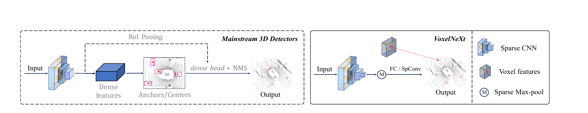
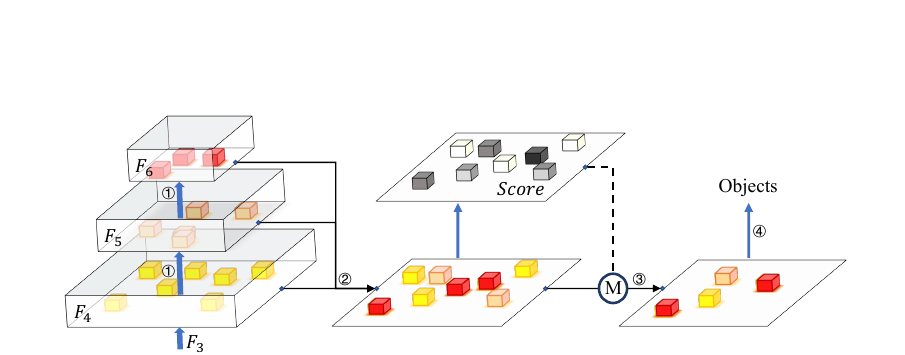
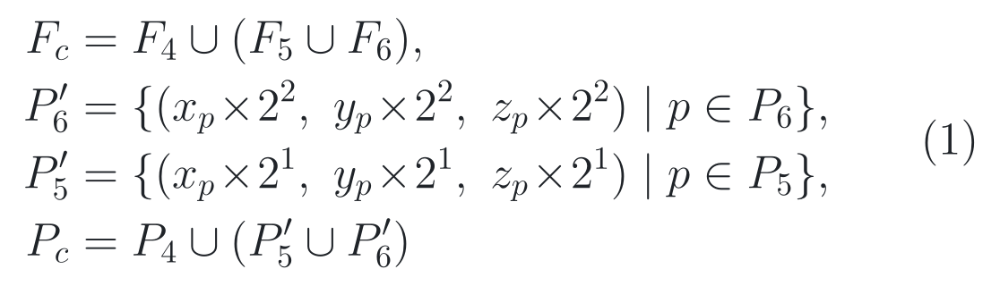
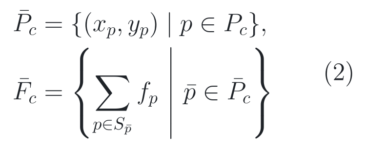
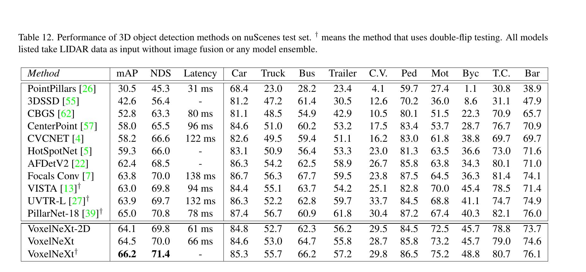
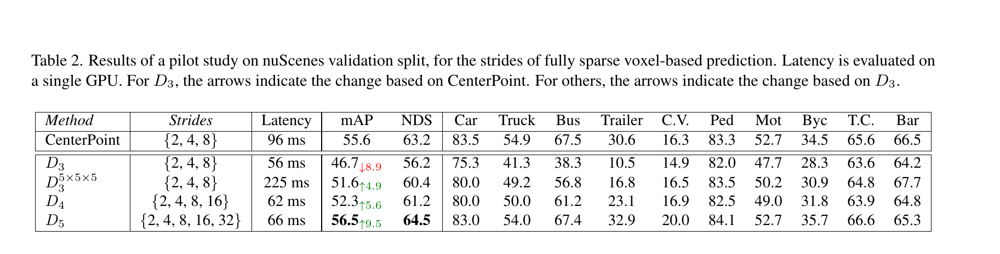
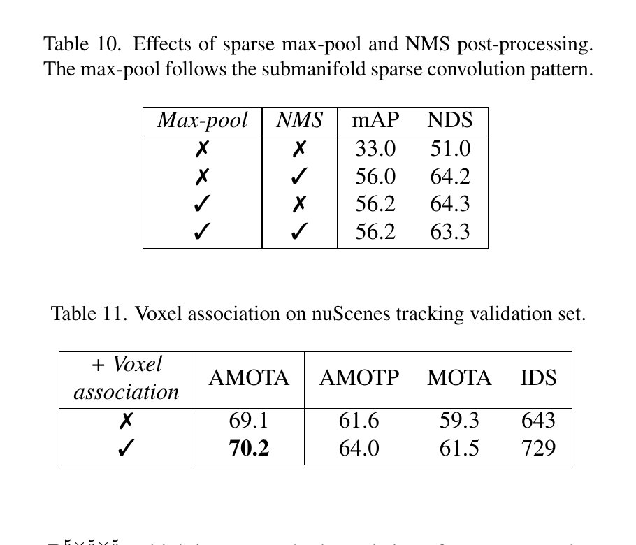

# 2026-07-26 — VoxelNeXt: Fully Sparse VoxelNet for 3D Object Detection and Tracking

`CVPR 2023` · `正式录用` · `论文、补充材料与官方源码已读` ·
`公开 checkpoint 尚未在本仓库实际运行`

**主方向：** P01 · 目标与交通参与者感知 ·
**输入模态：** LiDAR ·
**交叉标签：** 3D 目标检测、3D 多目标跟踪、稀疏卷积、体素表示、效率、后处理

[▶ 从摘要与术语开始](#0-阅读起点术语先导与摘要完整翻译) ·
[返回首页](../../README.md) · [13 个感知方向](../../index/topics.md) ·
[全部精读](../../index/papers.md) ·
[CVF 录用页](https://openaccess.thecvf.com/content/CVPR2023/html/Chen_VoxelNeXt_Fully_Sparse_VoxelNet_for_3D_Object_Detection_and_Tracking_CVPR_2023_paper.html) ·
[论文 PDF](https://openaccess.thecvf.com/content/CVPR2023/papers/Chen_VoxelNeXt_Fully_Sparse_VoxelNet_for_3D_Object_Detection_and_Tracking_CVPR_2023_paper.pdf) ·
[补充材料](https://openaccess.thecvf.com/content/CVPR2023/supplemental/Chen_VoxelNeXt_Fully_Sparse_CVPR_2023_supplemental.pdf) ·
[官方代码 @ b5b7d39](https://github.com/JIA-Lab-research/VoxelNeXt/tree/b5b7d393cd1d0ecbbaeaca365b453b488791035d)

证据与行文标签：**[原文翻译]** 忠实翻译作者原文；**[笔记解释]** 帮助读者
建立直觉；**[论文]** 论文或正式 proceedings 直接支持；**[源码]** 固定
commit 直接支持；**[判断]** 本笔记基于证据的分析；**[未核验]** 尚未独立
运行、复算或向作者确认。译文中不混入笔记解释或判断。

## 0. 阅读起点：术语先导与摘要完整翻译

### 0.1 首次术语解释

**术语覆盖声明：** 摘要中的核心专业术语先在这里解释；正文后续第一次出现
的新术语仍会就地解释，之后全文保持相同中文名、英文名、缩写与符号。

- **三维目标检测（3D object detection）**：从传感器观测中预测交通参与者
  的类别、三维位置、长宽高与朝向；本文还为 nuScenes 预测平面速度。
- **体素（voxel）**：把三维空间切成规则小格后得到的三维像素；非空体素聚合
  落入格内的 LiDAR 点，空体素不必真的存入稀疏张量。
- **手工代理（hand-crafted proxy）**：模型不是直接从观测位置输出目标，而是
  先在预设 anchor 或规则网格 center 上产生候选；本文试图省去这类中间载体。
- **锚框（anchor）与中心点（center）**：前者是预先定义的候选框模板，后者是
  稠密鸟瞰网格上的候选目标中心；它们都不是最终真实目标本身。
- **稀疏卷积神经网络（Sparse Convolutional Neural Network, Sparse CNN）**：
  只在非空位置及其必要邻域上计算的卷积网络，适合点云中“大量空间为空”的分布。
- **稀疏转稠密（sparse-to-dense conversion）**：把只保存非空位置的特征展开成
  完整规则网格；这便于使用普通卷积，却会为大量空位置分配计算和内存。
- **预测头（prediction head）**：把主干特征变成类别分数、三维框与速度等最终
  输出的网络末端；“稠密 head”会对整张网格逐点预测。
- **非极大值抑制（Non-Maximum Suppression, NMS）**：按分数保留框并删除与其
  高度重叠的重复框；它解决重复预测，不等于提高框本身的几何精度。
- **速度—精度折中（speed-accuracy trade-off）**：同一硬件和协议下延迟与指标
  的共同关系；FLOPs 更少不自动保证真实延迟按同一比例下降。
- **LiDAR（Light Detection and Ranging）**：用激光测距得到三维点云的传感器；
  本文核心实验只用 LiDAR，不使用相机融合。
- **多目标跟踪（Multi-Object Tracking, MOT）**：在连续帧中把同一交通参与者
  关联为一条轨迹；本文在检测框中心关联之外增加 query voxel 位置。
- **nuScenes、Waymo Open Dataset 与 Argoverse 2**：本文使用的三个大规模
  自动驾驶感知基准，数据划分、传感器和指标彼此不同，不能横向混算分数。
- **平均精确率（mean Average Precision, mAP）**：对类别和匹配阈值汇总的检测
  排名指标；它不是所有体素或所有目标的总体 accuracy，也不直接测闭环安全。
- **nuScenes Detection Score（NDS）**：把 nuScenes mAP 与位置、尺寸、朝向、
  速度和属性误差组合的检测总分；高 NDS 不等于跟踪身份稳定或规划安全。
- **平均多目标跟踪准确率（Average Multi-Object Tracking Accuracy, AMOTA）**：
  跨召回阈值汇总的跟踪准确率；仍需与定位误差和身份切换一起读。
- **VoxelNeXt**：作者提出的全稀疏体素检测与跟踪框架名称，保留原名，不另造译名。

### 0.2 摘要完整专业中文翻译

**原文锚点：** Abstract，PDF p. 1 / proceedings p. 21674。

<a id="abstract-a01"></a>
> **[原文翻译] Abstract · PDF p. 1 / proceedings p. 21674 · A01**
>
> 三维目标检测器通常依赖手工设计的代理，例如锚框或中心点，并把已经得到充分
> 研究的二维框架迁移到三维。因此，稀疏体素特征需要先被稠密化，再由稠密预测头
> 处理，这不可避免地带来额外计算开销。与此不同，本文提出 VoxelNeXt，用于全
> 稀疏三维目标检测。我们的核心认识，是直接基于稀疏体素特征预测目标，而不依赖
> 手工设计的代理。我们强大的稀疏卷积网络 VoxelNeXt 完全通过体素特征检测并
> 跟踪三维目标。该框架简洁且高效，不需要稀疏转稠密，也不需要 NMS 后处理。
> 我们的方法在 nuScenes 数据集上取得了优于其他主流检测器的速度—精度折中。
> 我们首次表明，全稀疏的体素表示能够在基于 LiDAR 的三维目标检测与跟踪中取得
> 良好效果。nuScenes、Waymo 和 Argoverse 2 基准上的广泛实验验证了我们方法
> 的有效性。在不添加繁杂技巧的情况下，我们的模型在 nuScenes 跟踪测试基准上
> 超过了当时所有已有的纯 LiDAR 方法。代码和模型已发布于
> github.com/dvlab-research/VoxelNeXt。

**完整性声明：** A01 按摘要唯一实质段落完整、未删减翻译；保留了作者关于
代理、稠密化开销、全稀疏设计、NMS、三数据集证据、跟踪排名和代码发布的全部
实质陈述。原文方法名有一次写作 “VoxelNext”，本文按标题与仓库统一为 VoxelNeXt。

> [!TIP]
> **[笔记解释] 读完摘要再看这一句：** VoxelNeXt 把“在整张 BEV 网格上等目标
> 中心”改成“只让真正存在的稀疏体素竞争输出框”；作者报告更好的检测速度—精度
> 折中，但固定源码默认配置仍使用 NMS、未启用空间剪枝，而且 checkpoint 尚未
> 在本仓库运行。

**学习顺序：**
[0 摘要与术语](#0-阅读起点术语先导与摘要完整翻译) →
[1 看原图](#1-看图论文到底做了什么) →
[2 读原式](#2-读公式核心机制怎样表达) →
[3 看结果](#3-看结果证据是否支持主张) →
[4 对源码](#4-对源码公式如何落地) →
[5 记结论](#5-记结论贡献边界与开放问题)

## 1. 看图：论文到底做了什么

### 1.1 30 秒路口故事：不要把整张停车场都当候选框

想象自车的 LiDAR 正扫过一个十字路口。远处货车只有车身边缘留下几十个点，
行人只有几根稀疏竖线，绝大多数三维格子为空。CenterPoint 一类方案先把稀疏
特征铺成完整鸟瞰图，再让每个网格位置回答“这里是不是目标中心”。这很像在一座
只有少数亮灯房间的大楼里，仍逐间敲门。

VoxelNeXt 改成另一种问法：已有非空体素中，谁最适合代表一个目标？被选中的
query voxel 再回归从自己到目标中心的偏移、框尺寸、朝向和速度。query voxel
是“实际承担预测的体素位置”，可能靠近目标边界，甚至在标注框外；它不是论文
预先规定的目标中心，也不是语言模型里的 query token。

### 1.2 Figure 2：先看主流管线与 VoxelNeXt 的分叉



> **原图出处：** Chen et al., CVPR 2023, Figure 2，PDF p. 2 /
> proceedings p. 21675。[官方 PDF](https://openaccess.thecvf.com/content/CVPR2023/papers/Chen_VoxelNeXt_Fully_Sparse_VoxelNet_for_3D_Object_Detection_and_Tracking_CVPR_2023_paper.pdf)。
> 仅作学术讲解所需的局部摘录，原图版权归原作者及其他权利人。

左边的主流路线是：稀疏主干 → 稠密 BEV 特征 → anchors/centers → 稠密 head →
NMS；两阶段模型还可能增加 RoI pooling，即从候选框区域抽取局部特征。右边的
VoxelNeXt 路线仍保留 Sparse CNN，却让非空体素经全连接层或稀疏卷积直接输出
目标，并以 sparse max-pool 只保留局部得分极大体素。

**图中没有证明：** sparse max-pool 在所有硬件上更快，也没有证明发布仓库的
默认命令真的不用 NMS。固定 SHA 的默认 nuScenes 配置选择 `VoxelNeXtHead`，
其推理函数会调用 `class_agnostic_nms`；只有替代的 `VoxelNeXtHeadMaxPool` 路线
使用作者定制的 spconv-plus。

### 1.3 Figure 4：四步把稀疏体素变成目标



> **原图出处：** Chen et al., CVPR 2023, Figure 4，PDF p. 3 /
> proceedings p. 21676。[官方 PDF](https://openaccess.thecvf.com/content/CVPR2023/papers/Chen_VoxelNeXt_Fully_Sparse_VoxelNet_for_3D_Object_Detection_and_Tracking_CVPR_2023_paper.pdf)。
> 仅作学术讲解所需的局部摘录，原图版权归原作者及其他权利人。

从左到右读四个圈号：① 在普通四阶段稀疏主干之后再下采样两次，扩大有效感受野；
② 把最后三层对齐到 stride 8，并沿高度求和得到稀疏二维位置；③ 对每类分数做
局部极大选择；④ 从被选体素回归三维框。**感受野（receptive field）** 是一个
输出位置能够汇集到的输入空间范围；它更大不自动代表细节更准，但大车若只看到
局部表面，确实更难直接回归完整框。

### 整体算法架构与创新设计

**原方法瓶颈：** **[论文]** 作者指出 CenterPoint 等主流 3D 检测器把稀疏
体素转成稠密 BEV，并在绝大多数近零位置运行稠密 head；另一方面，直接删掉
稠密 head 后，普通三阶段主干的感受野不足，尤其损害 Truck 和 Bus。来源：
论文 §1、§3.1，Figure 1、Table 2，PDF p. 1、3–5。

**主干网络与基线：** **[论文]** 直接基线是 CenterPoint；输入经 MeanVFE
体素特征编码器后进入六阶段 residual Sparse CNN，通道依次为 16、32、64、
128、128、128，最后接稀疏分类与框回归 heads。**[源码]** 默认 nuScenes
配置公开 10 sweeps、0.075 m × 0.075 m × 0.2 m 体素、128-channel head；
[固定 SHA 配置](https://github.com/JIA-Lab-research/VoxelNeXt/blob/b5b7d393cd1d0ecbbaeaca365b453b488791035d/tools/cfgs/nuscenes_models/cbgs_voxel0075_voxelnext.yaml#L1-L118)。

**继承与新增边界：** **[论文]** MeanVFE、residual Sparse CNN、focal loss、
CenterPoint 式框参数化和离线跟踪器属于继承组件；本文新增或替换的是额外两次
下采样及多层对齐、稀疏高度压缩、空间体素剪枝、query-voxel 选择、sparse
max-pool 去重和 query-voxel 关联。Waymo 的 IoU branch 与 VoxelNeXt-2D 是
迁移/变体，不应冒充默认主干创新。来源：论文 §3.1–§3.3，PDF p. 3–5；
[固定 SHA 模块注册](https://github.com/JIA-Lab-research/VoxelNeXt/blob/b5b7d393cd1d0ecbbaeaca365b453b488791035d/pcdet/models/backbones_3d/__init__.py#L1-L22)。

**端到端信息流：** **[论文]** 10-sweep LiDAR 点 → 0.075 m × 0.075 m ×
0.2 m 非空体素 → MeanVFE → stride 1/2/4/8/16/32 的六阶段 Sparse CNN →
把后三级坐标对齐到 stride 8 → 沿高度求和为稀疏二维特征 → 六组类别 heads
输出分数、中心偏移、高度、尺寸、朝向与速度 → max-pool 或 NMS 选框 → 离线
跟踪关联。108 m × 108 m 范围对应约 1440 × 1440 的平面体素网格，stride 8
输出的规则上限约 180 × 180，但只存非空位置。来源：论文 Figure 4 / §3，
PDF p. 3–5；Supplement §A，Supplement PDF p. 1。

**总体训练方式：** **[论文]** 检测器单阶段端到端训练：每个 GT 框把最近
稀疏体素设为正样本，focal loss 监督类别分数，L1 loss 监督中心偏移、高度、
尺寸、朝向和 nuScenes 速度；Waymo 另有 IoU loss。跟踪关联是检测后的离线
步骤，不参与检测骨干反向传播。训练与检测推理都看聚合后的 LiDAR sweeps，
没有 teacher forcing、跨帧神经记忆或 oracle future；双翻转只属于标 † 的测试
增强。来源：论文 §3.2–§4，PDF p. 4–8；
[固定 SHA loss 路径](https://github.com/JIA-Lab-research/VoxelNeXt/blob/b5b7d393cd1d0ecbbaeaca365b453b488791035d/pcdet/models/dense_heads/voxelnext_head.py#L248-L291)。

#### 创新模块 1：追加下采样与多尺度稀疏对齐

**位置与接口：** 位于普通 stride 8 稀疏骨干输出与高度压缩之间，把原有四阶段
主干扩展到 stride 16、32，并把后三阶段重新放回 stride 8 坐标系。

**输入：** stride 8 的 *F*<sub>4</sub>、stride 16 的 *F*<sub>5</sub>、
stride 32 的 *F*<sub>6</sub> 稀疏三维特征及对应整数体素坐标。

**内部变换：** 继续执行两次 stride-2 sparse convolution；随后把
*F*<sub>5</sub> 坐标乘 2、*F*<sub>6</sub> 坐标乘 4，与 *F*<sub>4</sub>
特征和坐标拼接，不增加额外参数化融合层。

**输出：** 一组对齐到 stride 8 语义、但同时带有更大感受野的稀疏三维特征
*F*<sub>*c*</sub> 及位置 *P*<sub>*c*</sub>，交给高度压缩。

**为什么这样设计：** **[论文]** 作者明确指出直接删除稠密 head 的 D3 对
大目标性能下降，原因是普通稀疏主干感受野不足；为了解决这一瓶颈，追加下采样以较少计算扩大感受野，
再无参数对齐回细一级坐标。来源：论文 §3.1、Figure 5，PDF p. 3。

**训练信号：** **[论文]** 模块没有独立辅助 loss；分类 focal loss 与框回归
L1 loss 通过下游 head 和拼接路径间接更新这些卷积层，没有 detach。来源：论文
§3.1–§3.2，PDF p. 3–5；**[源码]** [forward 路径 @ 固定 SHA](https://github.com/JIA-Lab-research/VoxelNeXt/blob/b5b7d393cd1d0ecbbaeaca365b453b488791035d/pcdet/models/backbones_3d/spconv_backbone_voxelnext.py#L166-L225)。

**作用与证据：** **[论文]** Table 2 的受控消融从 D3 移到 D5，即加入 stride
16 与 32 两级后，mAP 从 46.7 提高到 56.5、NDS 从 56.2 提高到 64.5，延迟
从 56 ms 增到 66 ms；作者表内把 mAP 变化标为 ↑9.5，按展示值直接相减为
9.8，故不把小数差异过度解释。来源：论文 Table 2，PDF p. 5。

**论文位置：** **[论文]** Figure 4–5、Eq. (1)、§3.1，PDF p. 3。

**源码入口：** **[源码]** [VoxelResBackBone8xVoxelNeXt.forward @ 固定 SHA](https://github.com/JIA-Lab-research/VoxelNeXt/blob/b5b7d393cd1d0ecbbaeaca365b453b488791035d/pcdet/models/backbones_3d/spconv_backbone_voxelnext.py#L166-L225)。

#### 创新模块 2：稀疏高度压缩

**位置与接口：** 位于对齐后的三维稀疏特征与二维稀疏预测 head 之间，替代
传统“先 dense 再把高度折进 channel”的 BEV 转换。

**输入：** 对齐后的 *F*<sub>*c*</sub>、三维位置 *P*<sub>*c*</sub>，其中
多个不同高度的体素可能共享相同平面坐标。

**内部变换：** 删除坐标中的高度索引；对相同 batch、*y*、*x* 位置执行
unique 分组，再把该柱内所有高度的 128 维特征逐元素求和。

**输出：** 仍只保存非空平面位置的二维 SparseConvTensor，随后经过 2D sparse
convolution 和共享 head 特征层。

**为什么这样设计：** **[论文]** 作者明确指出 dense 2D map 会增加显存和计算，
而检测所需的平面位置仍很稀疏；因此，沿高度求和可保留柱级证据并让后续 head 继续稀疏。
来源：论文 §3.1 “Sparse Height Compression”，PDF p. 4。

**训练信号：** **[论文]** 高度求和没有独立参数和 loss；所有被求和特征从同一
分类与回归损失接收间接梯度。来源：论文 Eq. (2)、§3.1–§3.2，PDF p. 4–5；
**[源码]** [bev_out @ 固定 SHA](https://github.com/JIA-Lab-research/VoxelNeXt/blob/b5b7d393cd1d0ecbbaeaca365b453b488791035d/pcdet/models/backbones_3d/spconv_backbone_voxelnext.py#L149-L164)。

**作用与证据：** **[论文]** Table 5 的受控比较把 3D head 替换为带高度压缩的
2D sparse head：延迟由 92 ms 降到 66 ms，mAP 由 56.3 变为 56.2，NDS 由
63.4 升到 64.3；这支持效率作用，但同时改变了 head 维度，不能单独证明“求和”
是唯一因果算子。来源：论文 Table 5，PDF p. 5。

**论文位置：** **[论文]** Figure 4、Eq. (2)、§3.1，PDF p. 3–4。

**源码入口：** **[源码]** [bev_out 与 shared_conv @ 固定 SHA](https://github.com/JIA-Lab-research/VoxelNeXt/blob/b5b7d393cd1d0ecbbaeaca365b453b488791035d/pcdet/models/backbones_3d/spconv_backbone_voxelnext.py#L149-L202)。

#### 创新模块 3：空间体素剪枝

**位置与接口：** 作用在前 3 个下采样层：重要体素允许按卷积核向邻域膨胀，
不重要体素只走受限路径，从而控制 active voxels 增长。

**输入：** 每层非空体素特征、离散坐标与默认 0.5 剪枝比例；论文重要度是
通道绝对特征幅值的平均排序。

**内部变换：** 逐 batch 计算幅值重要度并做 top-k 划分，只扩展排名较高的一半；
固定仓库的 SPS 变体先对平均绝对值做 sigmoid、乘回特征，再组合完整与受限卷积
路径。默认公开 nuScenes 配置没有选择该 SPS backbone。

**输出：** 坐标更少的下一级稀疏特征；其余网络接口与普通下采样保持一致。

**为什么这样设计：** **[论文]** 作者明确观察到大部分背景体素对预测贡献有限，
普通 sparse convolution 下采样却会把所有 active voxels 膨胀到卷积核邻域；只让
高幅值位置膨胀，是为了降低 FLOPs 而尽量保留目标证据。来源：论文 Figure 6、
§3.1 “Spatially Voxel Pruning”，PDF p. 4。

**训练信号：** **[论文]** 论文没有报告独立剪枝监督；幅值排序由检测特征产生。
**[源码]** SPS 变体的默认 `loss_mode=None`，因此无额外 focal/L1 剪枝 loss，
重要度乘回特征后只从检测损失获得间接梯度；top-k 索引本身不可微。来源：论文
§3.1，PDF p. 4；[固定 SHA SPS 路径](https://github.com/JIA-Lab-research/VoxelNeXt/blob/b5b7d393cd1d0ecbbaeaca365b453b488791035d/pcdet/models/backbones_3d/spconv_backbone_voxelnext_sps.py#L94-L226)。

**作用与证据：** **[论文]** Table 3 的受控消融从无剪枝替换为 0.5 ratio 后，
Sparse CNN FLOPs 从 83.8 G 降到 33.6 G，mAP 从 56.5 降到 56.2，NDS 从
64.5 降到 64.3；FLOPs 减少约 59.9%，但不是零精度代价。来源：论文 Table 3，
PDF p. 5。

**论文位置：** **[论文]** Figure 6、Table 3–4、§3.1，PDF p. 4–6。

**源码入口：** **[源码]** [VoxelResBackBone8xVoxelNeXtSPS @ 固定 SHA](https://github.com/JIA-Lab-research/VoxelNeXt/blob/b5b7d393cd1d0ecbbaeaca365b453b488791035d/pcdet/models/backbones_3d/spconv_backbone_voxelnext_sps.py#L94-L226)；默认配置未选中该类。

#### 创新模块 4：query-voxel 稀疏预测头

**位置与接口：** 接收高度压缩后的二维非空体素，替代 CenterPoint 的 dense
heatmap head、center proxy 与重复框 NMS 管线。

**输入：** 每个非空位置的 128 维特征、平面坐标、六组类别划分，以及训练时
GT 三维框与速度。

**内部变换：** 训练时为每个 GT 中心寻找最近 active voxel，画稀疏 Gaussian
分类目标；head 输出类别、中心偏移、中心高度、对数尺寸、正余弦朝向与速度。
理想论文路径按类做 sparse max-pool，固定默认路径则先 top-k decode 再做 NMS。

**输出：** 每个样本最多 500 个三维框、分数和类别；nuScenes 框还带二维速度。

**为什么这样设计：** **[论文]** 作者明确指出 LiDAR 点通常落在物体表面而非
中心，让实际非空体素直接回归框可以顺应数据分布；局部 max-pool 再删除重复响应，
避免在全空网格上计算。来源：论文 §3、§3.2，Figure 7、9，PDF p. 3–4。

**训练信号：** **[论文]** 稀疏分类分数由 focal loss 直接监督；被匹配的
query voxel 上，中心偏移、高度、尺寸、朝向与速度由加权 L1 loss 直接监督，
未匹配体素不接收 box regression 的直接梯度。来源：论文 §3.2，PDF p. 4–5；
**[源码]** [target 与 loss @ 固定 SHA](https://github.com/JIA-Lab-research/VoxelNeXt/blob/b5b7d393cd1d0ecbbaeaca365b453b488791035d/pcdet/models/dense_heads/voxelnext_head.py#L180-L291)。

**作用与证据：** **[论文]** Table 10 的受控比较显示：关闭 max-pool 且
关闭 NMS 时只有 33.0 mAP/51.0 NDS；启用 NMS 后 mAP/NDS 提高到
56.0/64.2，替换为只启用
max-pool 得 56.2/64.3；这支持 max-pool 可替代 NMS，但未报告多硬件延迟或
随机重复。来源：论文 Table 10，PDF p. 6。

**论文位置：** **[论文]** Figure 7、9、Table 6、7、10、§3.2，PDF p. 4–6。

**源码入口：** **[源码]** [VoxelNeXtHeadMaxPool @ 固定 SHA](https://github.com/JIA-Lab-research/VoxelNeXt/blob/b5b7d393cd1d0ecbbaeaca365b453b488791035d/pcdet/models/dense_heads/voxelnext_head_maxpool.py#L492-L559)；默认 NMS 路径另见 Section 4。

#### 创新模块 5：query-voxel 跟踪关联

**位置与接口：** 位于逐帧检测输出之后的离线 tracker 中，与既有预测框中心和
速度关联并行，增加产生该框的原始 query voxel 位置作为匹配线索。

**输入：** 相邻帧三维框、分数、预测速度、预测中心，以及回溯到输入点云尺度的
query-voxel 坐标。

**内部变换：** 分别计算中心运动预测与 query-voxel 位置的二维 L2 距离；作者
用额外 voxel association 纳入更多可匹配 tracklets，论文未给完整伪代码和阈值。

**输出：** 带跨帧 track identity 的三维轨迹及 nuScenes AMOTA、AMOTP、MOTA、
IDS 评测输入；它不写回检测网络形成预测记忆。

**为什么这样设计：** **[论文]** 作者明确指出预测框中心存在回归偏差，而同一
物体相邻帧的 query voxels 往往保持相似相对位置；为了在中心
不准时保留关联，作者增加实际观测位置，
作为第二种匹配线索。来源：论文 Figure 8、§3.3，PDF p. 4–5。

**训练信号：** **[论文]** 中心速度由检测 head 的 L1 loss 直接监督；
query-voxel association 本身是非学习的离线距离匹配，没有独立 loss，也没有
从 tracker 回传梯度。来源：论文 §3.2–§3.3，PDF p. 5。

**作用与证据：** **[论文]** Table 11 的受控比较加入 voxel association 前后，AMOTA
从 69.1 提高到 70.2、MOTA 从 59.3 提高到 61.5；但 AMOTP 从 61.6 变为 64.0、
IDS 从 643 增到 729，并非所有跟踪质量量都改善。来源：论文 Table 11，PDF p. 6。

**论文位置：** **[论文]** Figure 8、Table 11、§3.3，PDF p. 4–7。

**源码入口：** **[源码]** [固定 SHA README 的 tracking 结果入口](https://github.com/JIA-Lab-research/VoxelNeXt/blob/b5b7d393cd1d0ecbbaeaca365b453b488791035d/README.md#L31-L48)；该 commit 发布 detection 的 velocity head 和跟踪结果文件链接，但没有可执行的 query-voxel tracker，因此关联阈值与状态重置无法从代码闭合。

## 2. 读公式：核心机制怎样表达

### 原文公式 1：把 stride 16/32 特征放回 stride 8 坐标

**原文公式：** 论文 Eq. (1)，PDF p. 3 / proceedings p. 21676。

<p align="center"><picture><source media="(prefers-color-scheme: dark)" srcset="../../assets/notes/2026-07-26-voxelnext/formulas/eq-01-multiscale-sparse-alignment-dark.png"></picture></p>

> **公式来源：** Chen et al., CVPR 2023, Eq. (1)，PDF p. 3 /
> proceedings p. 21676；本图按原符号重排。[官方 PDF](https://openaccess.thecvf.com/content/CVPR2023/papers/Chen_VoxelNeXt_Fully_Sparse_VoxelNet_for_3D_Object_Detection_and_Tracking_CVPR_2023_paper.pdf) ·
> [可复制 TeX](../../assets/notes/2026-07-26-voxelnext/formulas/source.tex#L5-L13)。

**符号说明**

- *F*<sub>4</sub>、*F*<sub>5</sub>、*F*<sub>6</sub>：stride 8、16、32
  三个阶段的非空体素特征集合；
- *P*<sub>4</sub>、*P*<sub>5</sub>、*P*<sub>6</sub>：各阶段的三维整数坐标集合；
- *P*′<sub>5</sub>、*P*′<sub>6</sub>：分别乘 2、4 后映射到 stride 8 尺度的坐标；
- ∪：论文写作集合并；固定实现先拼接，随后到高度压缩才做平面坐标去重和求和。

**纯文字读法：** 合并后三阶段特征；把第五阶段每个三维坐标乘 2、第六阶段乘
4，使它们与第四阶段使用同一坐标单位，再合并三组位置。

**玩具例子：** 这是教学示例，不是论文实验。若 stride 16 的体素坐标是
(3, 4, 1)，映射后是 (6, 8, 2)；stride 32 的 (2, 1, 0) 映射后是
(8, 4, 0)。它们都可与 stride 8 的整数格地址一起存放。

**专业解释：** 粗层体素每走一步覆盖更大物理距离。乘 2 或 4 不是上采样出
新特征，而只是恢复统一索引单位；因此保留粗层的大感受野，同时避免 dense
interpolation。论文的集合记号没有规定同坐标冲突怎样归并。

**回到上面的图：** Figure 4 左侧 *F*<sub>4</sub>、*F*<sub>5</sub>、
*F*<sub>6</sub> 汇入圈号 ② 的箭头就是 Eq. (1)。

**落到源码：** [坐标乘 2/4 与特征拼接 @ 固定 SHA](https://github.com/JIA-Lab-research/VoxelNeXt/blob/b5b7d393cd1d0ecbbaeaca365b453b488791035d/pcdet/models/backbones_3d/spconv_backbone_voxelnext.py#L187-L199)

**公式省略了什么：** batch index 不缩放；实现会原地修改 *x*<sub>conv5</sub>
和 *x*<sub>conv6</sub> 的坐标，再用 `torch.cat` 拼接。它没有在此处按三维坐标
deduplicate，也没有可学习的跨尺度权重。

### 原文公式 2：把同一地面柱中的高度特征求和

**原文公式：** 论文 Eq. (2)，PDF p. 4 / proceedings p. 21677。

<p align="center"><picture><source media="(prefers-color-scheme: dark)" srcset="../../assets/notes/2026-07-26-voxelnext/formulas/eq-02-sparse-height-compression-dark.png"></picture></p>

> **公式来源：** Chen et al., CVPR 2023, Eq. (2)，PDF p. 4 /
> proceedings p. 21677；本图按原符号重排。[官方 PDF](https://openaccess.thecvf.com/content/CVPR2023/papers/Chen_VoxelNeXt_Fully_Sparse_VoxelNet_for_3D_Object_Detection_and_Tracking_CVPR_2023_paper.pdf) ·
> [可复制 TeX](../../assets/notes/2026-07-26-voxelnext/formulas/source.tex#L15-L21)。

**符号说明**

- *p* = (*x*<sub>*p*</sub>, *y*<sub>*p*</sub>, *z*<sub>*p*</sub>)：一个三维非空体素坐标；
- *p̄* = (*x*<sub>*p*</sub>, *y*<sub>*p*</sub>)：删去高度后的平面坐标；
- *S*<sub>*p̄*</sub>：所有与 *p̄* 共享 *x*、*y* 的三维体素；这是论文紧随 Eq. (2) 给出的正文定义；
- ***f***<sub>*p*</sub>：位置 *p* 的通道特征；*F̄*<sub>*c*</sub> 是柱内求和后的稀疏二维特征。

**纯文字读法：** 先把所有三维位置投到地平面；对每个仍非空的平面位置，把
该垂直柱中全部体素的特征向量逐通道相加。

**玩具例子：** 这是教学示例，不是论文实验。若同一 (*x*, *y*) 柱中两个高度
体素的一维简化特征分别是 2 和 5，高度压缩输出就是 7；相邻空柱仍不创建零值。

**专业解释：** 与把完整高度网格转成 dense feature map 不同，这一操作只对
真实存在的平面索引分组。代价是显式高度顺序消失，head 只能从求和后的通道模式
推断竖直结构；它不是无损三维表示。

**回到上面的图：** Figure 4 圈号 ② 后，立体体素变成带 Score 的平面稀疏点。

**落到源码：** [bev_out 的 unique 与 index_add_ @ 固定 SHA](https://github.com/JIA-Lab-research/VoxelNeXt/blob/b5b7d393cd1d0ecbbaeaca365b453b488791035d/pcdet/models/backbones_3d/spconv_backbone_voxelnext.py#L149-L164)

**公式省略了什么：** 源码按 batch、*y*、*x* 三列执行 `torch.unique`，并用
`index_add_` 聚合；通道固定为 128。相同平面位置先前来自不同尺度还是不同高度，
在这里都被加到一起，论文没有比较 sum、mean、max 的受控差异。

## 3. 看结果：证据是否支持主张

### 3.1 原文公开的实验配置

**原文锚点：** 主论文 §4，PDF p. 5–8；Supplement §A，Supplement PDF p. 1；
固定 SHA 配置、训练和评测入口。

- **数据集、版本与划分。** **[论文]** nuScenes 有 1,000 段序列，700/150/150
  用于 train/val/test；消融只用 1/4 train、在完整 val 评估，主结果用完整 train。
  Waymo 公开为 798 train、202 val；Argoverse 2 为 700 train、150 val。来源：
  Supplement §A，Supplement PDF p. 1。固定配置使用 `v1.0-trainval` 和 10-sweep
  info 文件。[数据配置 @ 固定 SHA](https://github.com/JIA-Lab-research/VoxelNeXt/blob/b5b7d393cd1d0ecbbaeaca365b453b488791035d/tools/cfgs/dataset_configs/nuscenes_dataset.yaml#L1-L18)
- **传感器、输入范围与预处理。** **[论文]** nuScenes 虽有相机，本文实验只用
  32-beam LiDAR；范围 *x*、*y* 均为 −54 m 至 54 m，*z* 为 −5 m 至 3 m，
  体素 0.075 m × 0.075 m × 0.2 m。**[源码]** 每体素最多 10 点，训练/测试最多
  120,000/160,000 非空体素，点特征为 *x*、*y*、*z*、intensity、timestamp。
  [固定 SHA 配置](https://github.com/JIA-Lab-research/VoxelNeXt/blob/b5b7d393cd1d0ecbbaeaca365b453b488791035d/tools/cfgs/nuscenes_models/cbgs_voxel0075_voxelnext.yaml#L4-L66)
- **硬件、软件与依赖。** **[论文]** Table 2 只写 latency 在单 GPU 测量，未公开
  GPU 型号、CPU、CUDA、计时 warm-up 或重复次数。**[源码]** 安装文档覆盖 Python
  3.6+、PyTorch 1.1–1.10、CUDA 9+ 与多个 spconv 版本，但没有锁定唯一环境；
  sparse max-pool 还依赖作者 spconv-plus。[安装文档 @ 固定 SHA](https://github.com/JIA-Lab-research/VoxelNeXt/blob/b5b7d393cd1d0ecbbaeaca365b453b488791035d/docs/INSTALL.md#L1-L38)
- **初始化或预训练权重。** **[未核验]** 论文和 nuScenes config 未公开主干预训练
  来源，也没有冻结项；官方 README 提供检测 checkpoint 下载，但本仓库未下载
  权重元数据、未运行推理。[checkpoint 入口 @ 固定 SHA](https://github.com/JIA-Lab-research/VoxelNeXt/blob/b5b7d393cd1d0ecbbaeaca365b453b488791035d/README.md#L23-L48)
- **优化器、学习率与 scheduler。** **[论文]** Supplement 写 Adam、初始学习率
  1e-3、cosine annealing 到 1e-4、weight decay 0.01。**[源码]** 默认 config 写
  `adam_onecycle`、LR 0.001、PCT_START 0.4、DIV_FACTOR 10；训练构建器实际使用
  OneCycle。二者并列，不把源码替论文补齐。[scheduler @ 固定 SHA](https://github.com/JIA-Lab-research/VoxelNeXt/blob/b5b7d393cd1d0ecbbaeaca365b453b488791035d/tools/train_utils/optimization/__init__.py#L39-L61)
- **batch size、轮数与增强。** **[论文]** Supplement §B、PDF p. 2 写
  nuScenes 总 batch 16、20 epochs；增强
  包括 *x*/*y* 翻转、±45° 全局旋转、0.9–1.1 缩放、0–0.5 translation noise
  与 GT sampling。**[源码]** per-GPU batch 4；配置未写 GPU 数，若复现总 batch
  16 需 4 GPU。提交模型最后 5 epochs 是否移除 GT sampling 只在 Supplement
  针对 test submission 说明。
- **梯度裁剪。** **[论文]** Supplement 写 norm 35；**[源码]** 默认配置
  `GRAD_NORM_CLIP: 10`，训练循环确实把该值传给 `clip_grad_norm_`。这是一项明确
  论文—源码配置差异，不凭静态阅读判断数值影响。[训练循环 @ 固定 SHA](https://github.com/JIA-Lab-research/VoxelNeXt/blob/b5b7d393cd1d0ecbbaeaca365b453b488791035d/tools/train_utils/train_utils.py#L52-L63)
- **随机种子、重复次数与选模。** **[未核验]** 原文未报告 seed、重复训练、方差、
  validation frequency 或 checkpoint 选择准则。源码 `--fix_random_seed` 默认关闭；
  开启才使用 666 加 rank，故不能把 666 写成论文默认。[train CLI @ 固定 SHA](https://github.com/JIA-Lab-research/VoxelNeXt/blob/b5b7d393cd1d0ecbbaeaca365b453b488791035d/tools/train.py#L24-L40)
- **推理、阈值与后处理。** **[源码]** 默认 config score threshold 0.1、每样本最多
  500、NMS threshold 0.2；论文主叙事的 sparse max-pool 属于另一个 config 和
  head。标 † 的 nuScenes 测试行使用 double-flip 测试增强，不能与无增强延迟
  直接合并比较。[默认后处理 @ 固定 SHA](https://github.com/JIA-Lab-research/VoxelNeXt/blob/b5b7d393cd1d0ecbbaeaca365b453b488791035d/tools/cfgs/nuscenes_models/cbgs_voxel0075_voxelnext.yaml#L120-L128)
- **指标与公平性。** **[论文]** Table 11–12、PDF p. 7 的 nuScenes 检测报告
  mAP、NDS 与五类 true-positive errors；跟踪报告 AMOTA、AMOTP、MOTA、IDS。
  Table 12 声明全部为纯 LiDAR、
  无模型集成，但部分方法带 † double-flip，延迟也有缺失。mAP 不是体素总体
  accuracy；NDS 不测跟踪 identity；低 IDS 也不等于检测框更准。
- **checkpoint 与最短入口。** **[源码]** README 给出预训练权重，并提供
  `bash scripts/dist_test.sh NUM_GPUS --cfg_file PATH_TO_CONFIG_FILE --ckpt PATH_TO_MODEL`。
  **[未核验]** 本笔记尚未运行 CUDA inference、nuScenes devkit 评测或跟踪脚本。
  [测试入口 @ 固定 SHA](https://github.com/JIA-Lab-research/VoxelNeXt/blob/b5b7d393cd1d0ecbbaeaca365b453b488791035d/README.md#L139-L145)

### 3.2 原文公开的实验流程

**原文锚点：** 主论文 §3–§4，PDF p. 3–8；Supplement §A，Supplement PDF
p. 1；固定 SHA 的数据、训练、推理与评测入口。

1. **数据准备：** **[论文/源码]** 下载 nuScenes v1.0-trainval，生成
   `nuscenes_infos_10sweeps_train.pkl`、val info 与 GT database；聚合至多 10
   sweeps，并按范围裁剪、shuffle、voxelize。来源：Supplement §A；
   [数据生成入口 @ 固定 SHA](https://github.com/JIA-Lab-research/VoxelNeXt/blob/b5b7d393cd1d0ecbbaeaca365b453b488791035d/docs/GETTING_STARTED.md#L35-L63)。
2. **训练阶段：** **[论文]** 20 epochs、总 batch 16、Adam 与增强；每个 GT
   中心匹配最近非空体素，联合优化稀疏 focal classification 和加权 L1 box
   regression。**[源码]** 默认走 OneCycle、clip 10、每 GPU batch 4；无冻结、
   teacher forcing 或跨帧 memory。[固定 SHA 配置](https://github.com/JIA-Lab-research/VoxelNeXt/blob/b5b7d393cd1d0ecbbaeaca365b453b488791035d/tools/cfgs/nuscenes_models/cbgs_voxel0075_voxelnext.yaml#L137-L156)
3. **验证与选模：** **[未核验]** 主论文 §4、PDF p. 6 的消融使用 1/4 train 和
   完整 val；原文未公开
   每轮验证频率、选取哪一 checkpoint、是否按 NDS 选模、随机 seed 或重复策略。
4. **检测推理与后处理：** **[源码]** 读取 checkpoint，MeanVFE → 六阶段 Sparse
   CNN → height compression → sparse head → decode；默认运行 NMS，替代 max-pool
   config 需要 spconv-plus。双翻转模型另用 four-way merge。[推理入口 @ 固定 SHA](https://github.com/JIA-Lab-research/VoxelNeXt/blob/b5b7d393cd1d0ecbbaeaca365b453b488791035d/tools/test.py#L58-L68)
5. **跟踪与最终评测：** **[论文]** 离线 tracker 用预测速度、中心与 query voxel
   关联，提交 nuScenes tracking server；**[未核验]** 固定官方仓库没有发布可执行
   association 实现和阈值。检测 val 由 nuScenes devkit 的 detection_cvpr_2019
   配置评测。[评测代码 @ 固定 SHA](https://github.com/JIA-Lab-research/VoxelNeXt/blob/b5b7d393cd1d0ecbbaeaca365b453b488791035d/pcdet/datasets/nuscenes/nuscenes_dataset.py#L153-L207)

**复现仍缺什么：** 精确硬件与计时协议、唯一软件锁文件、初始化说明、seed 与
重复实验、选模规则、论文主表对应的精确 config/checkpoint 映射、可执行跟踪器。
因此流程已能定位 detection 代码，但还不能把“源码已审”写成“结果已复现”。

### 3.3 主结果：检测速度与精度是否同时成立



> **原图出处：** Chen et al., CVPR 2023, Table 12，PDF p. 7 /
> proceedings p. 21680。[官方 PDF](https://openaccess.thecvf.com/content/CVPR2023/papers/Chen_VoxelNeXt_Fully_Sparse_VoxelNet_for_3D_Object_Detection_and_Tracking_CVPR_2023_paper.pdf)。
> 仅作学术讲解所需的局部摘录，原图版权归原作者及其他权利人。

**公平对照先说清：** Table 12 都是 LiDAR-only、无 ensemble，但 † 表示
double-flip 测试增强。最公平的直接比较是无 † 的 VoxelNeXt 与无 † 的
CenterPoint；VoxelNeXt† 与 PillarNet-18† 可比较增强后的精度，却没有 VoxelNeXt†
延迟。

- **[论文] 无增强主效应：** VoxelNeXt 为 64.5 mAP、70.0 NDS、66 ms；
  CenterPoint 为 58.0、65.5、96 ms。绝对变化是 +6.5 mAP、+4.5 NDS、−30 ms；
  相对 CenterPoint 分别约 +11.2%、+6.9%、−31.3%。
- **[论文] 增强行：** VoxelNeXt† 为 66.2 mAP、71.4 NDS；相比同样带 † 的
  PillarNet-18 绝对 +1.2 mAP、+0.6 NDS，但延迟未报，不能延续“更快”结论。
- **[判断] 外推边界：** 三个 benchmark 都支持跨数据集有效，但没有恶劣天气、
  传感器退化、域外城市、长尾安全事件或闭环决策实验。单一平均延迟也不告诉我们
  P95/P99、显存峰值和不同 sparse-kernel 实现的波动。

### 3.4 关键消融：真正救回直接稀疏预测的是哪一步



> **原图出处：** Chen et al., CVPR 2023, Table 2，PDF p. 5 /
> proceedings p. 21678。[官方 PDF](https://openaccess.thecvf.com/content/CVPR2023/papers/Chen_VoxelNeXt_Fully_Sparse_VoxelNet_for_3D_Object_Detection_and_Tracking_CVPR_2023_paper.pdf)。
> 仅作学术讲解所需的局部摘录，原图版权归原作者及其他权利人。

删掉 dense head 但保持三次下采样的 D3，mAP 从 CenterPoint 的 55.6 掉到 46.7；
这证明“稀疏”本身不是免费午餐。加大 5×5×5 kernel 能回到 51.6，却把延迟推到
225 ms。追加 stride 16 与 32 的 D5 达到 56.5 mAP、64.5 NDS、66 ms，说明
大感受野是直接从表面体素回归完整大车框的关键条件。

**主效应与小组件要分开：** Table 2 只控制下采样深度/大核；空间剪枝、height
compression、head kernel 与 max-pool 各有别表。不能把整模型相对 CenterPoint
的 +6.5 mAP 全部归给追加下采样。

### 3.5 去重与跟踪：平均总分提高不等于每项都更好



> **原图出处：** Chen et al., CVPR 2023, Table 10–11，PDF p. 6 /
> proceedings p. 21679。[官方 PDF](https://openaccess.thecvf.com/content/CVPR2023/papers/Chen_VoxelNeXt_Fully_Sparse_VoxelNet_for_3D_Object_Detection_and_Tracking_CVPR_2023_paper.pdf)。
> 仅作学术讲解所需的局部摘录，原图版权归原作者及其他权利人。

**证据支持什么：** 只用 sparse max-pool 的 56.2 mAP/64.3 NDS 与只用 NMS
的 56.0/64.2 基本相当；加入 voxel association 后 AMOTA +1.1、MOTA +2.2。
这分别支持“局部稀疏极大可替代框级 NMS”和“query voxel 提供额外关联线索”。

**证据没有支持什么：** 两种去重均未给置信区间和硬件延迟；tracking 消融中
AMOTP 数值 61.6 → 64.0、IDS 643 → 729，并未同时改善。更高 AMOTA 不等于
每条轨迹更准、更少换 ID，也不等于下游规划更安全。

## 4. 对源码：公式如何落地

```text
10-sweep points
→ voxelization / MeanVFE
→ six-stage Sparse CNN
→ F4/F5/F6 coordinate alignment
→ sparse height compression
→ class and box heads
→ default NMS or alternative sparse max-pool
→ detection output; offline tracking code not released
```

### 4.1 输入与调用链：`VoxelNeXt.forward`

- **论文对应：** Figure 4 的输入到六阶段 Sparse CNN；
- **[源码] 实际行为：** `Detector3DTemplate` 依配置依次构建 VFE、3D backbone、
  dense head；`VoxelNeXt.forward` 顺序执行 `module_list`。MeanVFE 对每个体素内
  最多 10 个点的五维特征求均值，不保存跨样本状态；
- **需要留意：** `batch_dict` 是一次 forward 的载体，不是跨帧 memory。
  10 sweeps 在数据层聚合，不能把它描述成时序递归网络。
- [打开 detector @ 固定 SHA](https://github.com/JIA-Lab-research/VoxelNeXt/blob/b5b7d393cd1d0ecbbaeaca365b453b488791035d/pcdet/models/detectors/voxelnext.py#L5-L45) ·
  [打开 MeanVFE](https://github.com/JIA-Lab-research/VoxelNeXt/blob/b5b7d393cd1d0ecbbaeaca365b453b488791035d/pcdet/models/backbones_3d/vfe/mean_vfe.py#L6-L31)

### 4.2 Eq. (1) 与 Eq. (2)：`forward` / `bev_out`

- **论文对应：** Eq. (1) 多尺度位置对齐、Eq. (2) 高度压缩；
- **[源码] 实际行为：** `x_conv5.indices[:, 1:] *= 2` 与 conv6 乘 4，随后
  features/indices 用 `torch.cat`；`bev_out` 删除 *z*，对 batch-*y*-*x* 做
  `torch.unique`，再以 `index_add_` 求和；
- **需要留意：** 论文集合并记号看似无重复，代码却先允许重复坐标，直到二维
  投影后才归并。这不是已证明的错误，但复现 Eq. (1) 时不能擅自在三维先去重。
- [打开固定 SHA 源码](https://github.com/JIA-Lab-research/VoxelNeXt/blob/b5b7d393cd1d0ecbbaeaca365b453b488791035d/pcdet/models/backbones_3d/spconv_backbone_voxelnext.py#L149-L202)

### 4.3 监督落点：`assign_target_of_single_head` / `get_loss`

- **论文对应：** 最近体素正样本、focal classification、L1 box regression；
- **[源码] 实际行为：** GT 中心先换算到 stride-8 坐标，再从当前 active
  `spatial_indices` 找平方距离最小者；heatmap 同时可围绕 GT center 距离和
  nearest-voxel 距离画 Gaussian。框 target 是中心相对该体素的 offset、真实
  *z*、log dimensions、cos/sin yaw 与速度；
- **梯度边界：** heatmap loss 直接训练所有 active voxel 的分类分数；regression
  只 gather 正样本 index。Waymo IoU score 分支对解码框使用 detach 计算一条
  IoU classification loss，同时另有不 detach 的 IoU regression loss；nuScenes
  默认不启用 IoU branch；
- **需要留意：** “不使用 center proxy”不等于训练完全不看 GT center；中心仍
  用于最近体素匹配和 offset target，区别是没有整张 dense center grid 作为代理。
- [打开 target @ 固定 SHA](https://github.com/JIA-Lab-research/VoxelNeXt/blob/b5b7d393cd1d0ecbbaeaca365b453b488791035d/pcdet/models/dense_heads/voxelnext_head.py#L180-L242) ·
  [打开 loss](https://github.com/JIA-Lab-research/VoxelNeXt/blob/b5b7d393cd1d0ecbbaeaca365b453b488791035d/pcdet/models/dense_heads/voxelnext_head.py#L248-L291)

### 4.4 推理分叉：默认 NMS 与替代 sparse max-pool

- **论文对应：** Figure 2、7 与 Table 10 主张无需 NMS；
- **[源码] 默认行为：** `cbgs_voxel0075_voxelnext.yaml` 选择 `VoxelNeXtHead`，
  decode 后在非 IoU branch 明确调用 `class_agnostic_nms`；README 也说没有
  spconv-plus 时默认使用 NMS；
- **[源码] 替代行为：** `cbgs_voxel0075_voxelnext_maxpool.yaml` 选择
  `VoxelNeXtHeadMaxPool`，对每类稀疏分数运行 `SparseMaxPool2d`，只保留与局部
  max 相等的位置；
- **需要留意：** 论文“无需 NMS”描述的是可用算法路径，不是发布仓库默认
  config 的事实。两条路径对应 checkpoint 和延迟是否完全可互换，尚未运行核验。
- [默认 NMS @ 固定 SHA](https://github.com/JIA-Lab-research/VoxelNeXt/blob/b5b7d393cd1d0ecbbaeaca365b453b488791035d/pcdet/models/dense_heads/voxelnext_head.py#L418-L488) ·
  [max-pool config](https://github.com/JIA-Lab-research/VoxelNeXt/blob/b5b7d393cd1d0ecbbaeaca365b453b488791035d/tools/cfgs/nuscenes_models/cbgs_voxel0075_voxelnext_maxpool.yaml#L69-L132)

### 4.5 发布口径差异与状态审计

- **空间剪枝：** 论文默认 0.5 ratio、前 3 个下采样层；固定默认配置使用普通
  `VoxelResBackBone8xVoxelNeXt`，不是仓库另有的 SPS 类；
- **head kernel：** Supplement 写 voxel selection 与 box regression 使用 3×3
  submanifold sparse convolution，Table 6 也显示 K3 更准；默认 config 却写
  `KERNEL_SIZE_HEAD: 1`，另有专门的 headkernel3 config；
- **训练超参：** 论文 cosine annealing、clip 35；源码默认 OneCycle、clip 10；
- **结果口径：** 论文 Table 1 val 为 60.0 mAP/67.1 NDS，README 同一默认 config
  表列 60.5/66.6。公开材料没有给出逐结果的 checkpoint hash 和完整运行日志；
- **跟踪：** detection head 输出速度，README 发布 tracking result 文件；固定
  commit 没有 query-voxel association 实现，无法审 reset、序列 slot、阈值或
  prediction error 如何跨帧传播；
- **prediction-relevant state：** 发布 detection 网络没有跨 forward 的预测状态；
  BatchNorm running statistics 是模型参数状态，但推理时不被当前序列写回；
- **evaluation-only state：** nuScenes evaluator 把整批预测写成 `results_nusc.json`
  并汇总 metrics，不回流后续预测。离线 tracker 若有 tracklets 会是预测相关状态，
  但实现未发布，不能静态审计。

<details>
<summary><strong>展开完整源码、许可与复现风险账本</strong></summary>

- 官方仓库当前所有者：JIA-Lab-research/VoxelNeXt；旧 dvlab-research URL 会重定向；
- 精读 commit：`b5b7d393cd1d0ecbbaeaca365b453b488791035d`；
- License：顶层 Apache License 2.0；仓库继承 OpenPCDet 与 spconv，实际部署仍需
  分别遵守数据集、checkpoint 与依赖许可；Waymo checkpoint 因 WOD 条款未发布；
- 依赖风险：支持范围写得很宽，缺少 lockfile、容器 digest 和唯一 spconv commit；
- CUDA 风险：稀疏卷积、NMS、points-in-boxes 与 max-pool 都依赖 GPU 扩展；
- 确定性风险：默认 seed 关闭、点顺序 shuffle、GT sampling、稀疏索引聚合与 GPU
  kernel 未给 deterministic 证明；
- checkpoint：nuScenes 检测权重有 Google Drive 入口；未下载、未校验 SHA256、
  未读取 optimizer/config metadata；
- 最短检测命令：`bash scripts/dist_test.sh 1 --cfg_file cfgs/nuscenes_models/cbgs_voxel0075_voxelnext.yaml --ckpt PATH_TO_MODEL`，需在 `tools` 目录运行；
- **[未核验]** 尚未完成 checkpoint inference、mAP/NDS 复算、不同 head/config
  交叉加载、sparse max-pool 延迟或 tracking server 复现。

</details>

## 5. 记结论：贡献、边界与开放问题

### 5.1 原文结论完整翻译

**原文锚点：** §5 Conclusion and Discussion 第一段，PDF p. 8 /
proceedings p. 21681。

<a id="conclusion-c01"></a>
> **[原文翻译] Conclusion · §5 / PDF p. 8 / proceedings p. 21681 · C01**
>
> 本文提出了一个用于三维目标检测与跟踪的全稀疏、基于体素的框架。它采用简单
> 技术，以很少的额外开销快速运行，并且无需 NMS 后处理，以一种简洁的方式工作。
> 我们首次表明，直接基于体素的预测是可行且有效的。因此，锚框或中心点以及稠密
> 预测头不再是必需的。VoxelNeXt 在大规模数据集 nuScenes、Waymo 和
> Argoverse 2 上取得了有前景的结果。凭借较高效率，它在三维目标检测中取得了
> 领先性能，并在 nuScenes 三维纯 LiDAR 跟踪基准上排名第一。

**完整性声明：** C01 已按 §5 第一段完整、未删减翻译全部总结性句子，保留
“可行且有效”“有前景”“领先”和“排名第一”的作者语气，没有扩大为普遍安全保证。

### 5.2 原文局限与展望完整翻译

**原文锚点：** §5 Conclusion and Discussion 的 Limitations 段，PDF p. 8 /
proceedings p. 21681；Supplement §D Discussions，Supplement PDF p. 2。

<a id="limitations-l01"></a>
> **[原文翻译] Limitations · within §5 Conclusion and Discussion / PDF p. 8 / proceedings p. 21681 · L01**
>
> FLOPs 与推理速度之间存在差距。延迟下降是明确的，但并没有像 Table 1 中
> FLOPs 的下降那样大，因为延迟取决于实现与设备。

<a id="limitations-l02"></a>
> **[原文翻译] Limitations / Discussion · Supplement §D Discussions / Supplement PDF p. 2 · L02**
>
> VoxelNeXt 依赖三维数据及其空间稀疏分布。它可能反映数据采集中的偏差，包括
> 那些会带来负面社会影响的偏差。

**完整性声明：** L01 完整覆盖主论文唯一明确标为 Limitations 的连续段落；
L02 完整覆盖补充材料 §D 中作者题为 “Boarder Impacts” 的两句原文，本笔记按
语义标为 Broader Impacts，但没有替作者扩写具体偏差类型。

**原文缺失声明：** 主论文 §5 与补充材料 §D 均没有独立 Future Work /
Outlook，也没有作者明确提出的未来研究句；本笔记不代写、不补写
作者没有提出的展望，下面的开放问题全部标为本笔记分析。

### 5.3 笔记分析与研究启发

**[笔记解释]** 这篇论文最值得带走的，不是“稀疏一定更好”，而是先找到 dense
代理真正承担的功能，再用感受野、监督匹配和局部去重逐项替代。

**[判断]** 下面的配置可追溯性、设备可迁移效率、中心监督边界和跟踪折中，是
本笔记根据公开材料提出的分析，不是作者已经证明的结论，也不能直接写成“学界
尚未解决”。

#### 5.3.1 学完必须记住的三点

1. **[论文] 方法核心：** 直接从非空体素预测框可省去 dense BEV head，但必须
   用额外下采样补回感受野，并用局部极大或 NMS 处理重复响应。
2. **[论文/源码] 最强证据：** Table 2 把 D3 的失败与 D5 的恢复连成因果链，
   Table 10 证明 max-pool 可替代 NMS；固定源码则表明公开默认路径仍是 NMS、
   普通 backbone 和 1×1 head。
3. **[判断] 最大边界：** 论文主张、默认 config、替代模块和 README checkpoint
   分数没有一一绑定；在数值复现前，只能说算法路径存在，不能说默认命令复现了
   论文“全稀疏、剪枝、无 NMS”的完整口径。

如果只能记一句话：

> VoxelNeXt 证明目标不必从预设中心格发声，边界体素也能回归完整三维框；但
> “稀疏”仍需要足够感受野、明确的正样本匹配和可靠去重，而且真实速度受实现支配。

#### 5.3.2 五条可以迁移的设计原则

##### 原则 1：删代理前，先列出代理偷偷承担的职责

dense center grid 同时提供规则覆盖、较大感受野和重复候选。VoxelNeXt 不是只
删 head，而是分别用 deeper sparse backbone、nearest active voxel target 与
max-pool 补回三项职责。做结构简化时，应逐项替代而不是一次性删除。

##### 原则 2：输出位置可以是证据位置，不必是语义中心

Table 7 中只有 9.9% 高质量预测来自 near-center query voxels，72.8% 靠近边界，
17.3% 甚至在框外。对稀疏传感器，选择“哪里有可靠证据”可能比强迫“哪里是对象
中心”更自然；但训练仍需中心决定匹配和 offset，不能误称完全 center-free。

##### 原则 3：FLOPs、kernel latency 与端到端延迟必须分报

剪枝把论文 Sparse CNN FLOPs 从 83.8 G 降到 33.6 G，作者仍在 Limitations
承认延迟没有同比下降。稀疏索引、内存访问、kernel launch 与硬件实现会成为新
瓶颈，部署论文应至少报告设备、batch、warm-up、P50/P95 与显存。

##### 原则 4：平均总分不能掩盖组件级反向变化

voxel association 提高 AMOTA，却伴随 AMOTP 数值和 IDS 增加。任何“跟踪更好”
结论都应展开 identity、定位、召回和错误持续时间，而不是只引用一个总分。

##### 原则 5：论文模块必须绑定实际发布 config 与 checkpoint

同一仓库同时有普通/SPS backbone、1×1/3×3 head、NMS/max-pool、普通/double-flip
等路线。没有 config digest、checkpoint hash 和命令日志，读者无法知道主表究竟
是哪组组合。发布时应把每一行结果映射到不可变配置与权重。

#### 5.3.3 论文目前没有回答的三个问题

下列问题由论文与源码差异自然引出，但“本文没有回答”不等于“学界没有答案”。

##### 问题 1：max-pool 的无 NMS 优势能否跨 sparse backend 保持

- **已知事实：** Table 10 中 max-pool 与 NMS 精度相当；官方实现要求 spconv-plus；
- **仍不知道：** 在相同 checkpoint、相同 top-k 和不同 GPU 上，max-pool 的
  P50/P95 延迟、显存和数值稳定性；
- **最小判别实验：** 固定输入顺序与 checkpoint，分别跑 NMS、max-pool 和二者
  同开，逐帧对齐框、分数、耗时和峰值显存；
- **推翻条件：** 若 max-pool 在主流 backend 上更慢或产生系统性重复/漏检，
  “无需 NMS 更高效”的部署性结论就不能外推。

##### 问题 2：空间剪枝是否对稀疏远距小目标公平

- **已知事实：** 0.5 剪枝大幅降 FLOPs，仅小幅降低平均 mAP/NDS；
- **仍不知道：** 远距行人、单点目标、雨雾缺点和低反射率目标是否更容易被低
  幅值规则剪掉；
- **最小判别实验：** 按距离、点数、类别和天气分桶，比较普通与 SPS backbone
  的 recall、被剪率与校准，并至少重复 3 seeds；
- **推翻条件：** 若总体 mAP 几乎不变但远距脆弱类 recall 显著下降，平均效率
  折中不能视为可靠感知折中。

##### 问题 3：query-voxel 关联为何提高 AMOTA 却增加 IDS

- **已知事实：** Table 11 的 AMOTA/MOTA 上升，IDS 由 643 增至 729；
- **仍不知道：** 额外匹配主要找回短轨迹，还是在拥挤/遮挡时引入错误身份交换；
- **最小判别实验：** 发布或重建 tracker，记录 center-only 与 center+voxel 的
  每次 gating 决策，按遮挡、目标距离、query 在框内外和速度误差分桶；
- **推翻条件：** 若增益只来自降低漏配而身份一致性持续恶化，就应把模块表述为
  recall—identity 折中，而非无条件更优的关联器。

<details>
<summary><strong>身份、材料、许可与复现状态</strong></summary>

- 标题：VoxelNeXt: Fully Sparse VoxelNet for 3D Object Detection and Tracking；
- 作者：Yukang Chen, Jianhui Liu, Xiangyu Zhang, Xiaojuan Qi, Jiaya Jia；
- Venue：CVPR 2023，pp. 21674–21683；
- 正式录用：[CVF proceedings](https://openaccess.thecvf.com/content/CVPR2023/html/Chen_VoxelNeXt_Fully_Sparse_VoxelNet_for_3D_Object_Detection_and_Tracking_CVPR_2023_paper.html)；
- DOI：10.1109/CVPR52729.2023.02076；arXiv:2303.11301；
- 官方仓库：[JIA-Lab-research/VoxelNeXt](https://github.com/JIA-Lab-research/VoxelNeXt)；
- 精读 commit：`b5b7d393cd1d0ecbbaeaca365b453b488791035d`；
- License：Apache-2.0；
- Checkpoint：nuScenes 与 Argoverse 2 检测权重公开；Waymo 权重因数据许可未公开；
- 已读源码：config、MeanVFE、detector call chain、普通/SPS backbone、height
  compression、target/loss、NMS/max-pool、scheduler、nuScenes evaluator；
- **[未核验] 结果：** 未运行 CUDA inference、训练、官方指标复算或跟踪提交。

</details>

> [!NOTE]
> 图表均为理解方法与证据所需的局部摘录，不包含整页 PDF；原图版权归原作者
> 及其他权利人。公式图由本仓库从论文原式转录并离线重排，TeX 源可回查；公开
> 笔记不记录未投稿方法的完整配方、私有结果或精确实验阈值。
