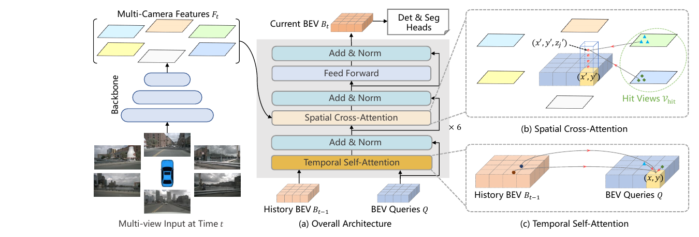
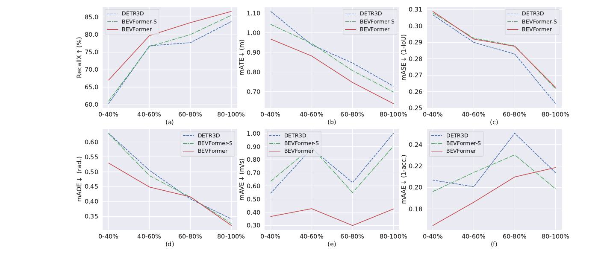
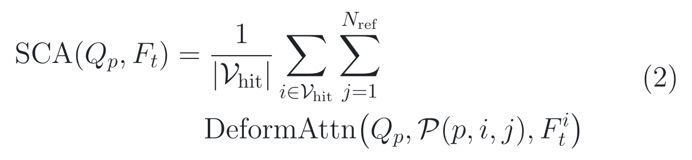
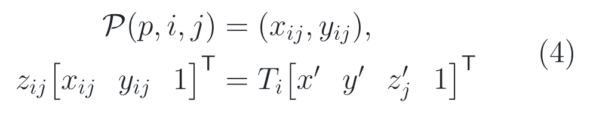
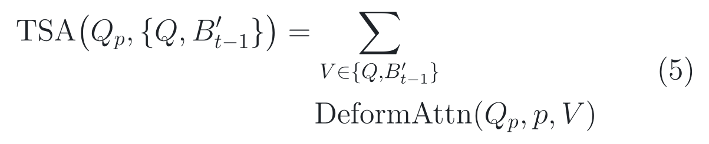
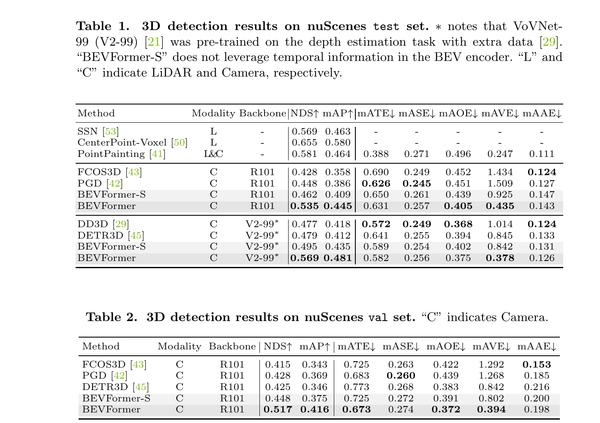
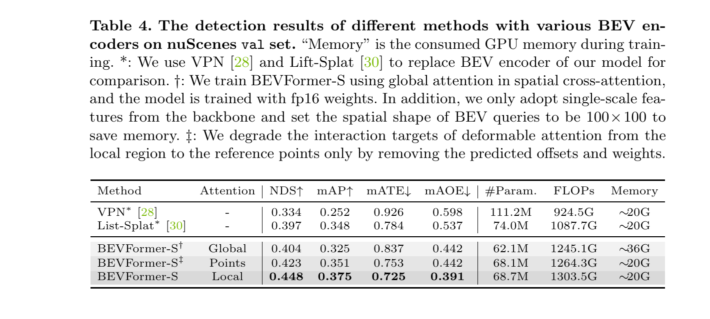
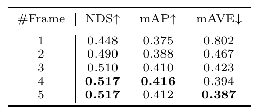
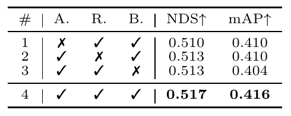

# 2026-07-27 — BEVFormer: Learning Bird’s-Eye-View Representation from Multi-Camera Images via Spatiotemporal Transformers

`ECCV 2022` · `正式录用` · `论文、补充材料与官方源码已读` ·
`公开 checkpoint 尚未在本仓库实际运行`

**主方向：** P03 · BEV 与统一场景表示 ·
**输入模态：** Surround Camera、Vehicle State ·
**交叉标签：** BEV、3D 目标检测、地图分割、空间交叉注意力、时序记忆、
可变形注意力、多任务感知、相机标定

[▶ 从摘要与术语开始](#0-阅读起点术语先导与摘要完整翻译) ·
[返回首页](../../README.md) · [13 个感知方向](../../index/topics.md) ·
[全部精读](../../index/papers.md) ·
[ECVA 录用页](https://www.ecva.net/papers/eccv_2022/papers_ECCV/html/694_ECCV_2022_paper.php) ·
[论文 PDF](https://www.ecva.net/papers/eccv_2022/papers_ECCV/papers/136690001.pdf) ·
[补充材料](https://www.ecva.net/papers/eccv_2022/papers_ECCV/papers/136690001-supp.pdf) ·
[官方代码 @ 66b65f3](https://github.com/fundamentalvision/BEVFormer/tree/66b65f3a1f58caf0507cb2a971b9c0e7f842376c)

证据与行文标签：**[原文翻译]** 忠实翻译作者原文；**[笔记解释]** 帮助读者
建立直觉；**[论文]** 论文、补充材料或正式 proceedings 直接支持；**[源码]**
固定 commit 直接支持；**[判断]** 本笔记基于证据的分析；**[未核验]** 尚未
独立运行、复算或向作者确认。译文中不混入笔记解释或判断。

## 0. 阅读起点：术语先导与摘要完整翻译

### 0.1 首次术语解释

**术语覆盖声明：** 摘要中的核心专业术语先在这里解释；正文后续第一次出现的
新术语仍会就地解释。全文锁定同一中文名、英文名、缩写和符号，不为行文变化
任意换译。

- **鸟瞰图（Bird’s-Eye View, BEV）**：以自车为中心、从上向下看的二维空间
  网格；它把不同相机的透视观测放进共同地面坐标，但不会自动恢复被遮挡真值。
- **统一表示（unified representation）**：同一组 BEV 特征可被检测、地图分割
  等不同任务头消费；“统一”指共享中间表示，不等于所有任务都同样受益。
- **三维目标检测（3D object detection）**：预测交通参与者的类别、三维中心、
  长宽高、朝向和速度；本文以 nuScenes 检测指标为核心证据。
- **地图分割（map segmentation）**：在 BEV 网格上预测车辆、道路、车道等语义
  mask；它是像素/网格级任务，不是 HD Map 定位，也不直接输出道路拓扑。
- **Transformer**：以注意力和前馈网络反复更新 token 或 query 的网络结构；
  BEVFormer 不把整幅图像做全局注意力，而采用稀疏采样控制成本。
- **BEV query（BEV 查询）**：与一个 BEV 网格位置绑定的可学习向量；它像一张
  “地址卡”，主动从历史 BEV 和命中相机中取证，不是最终三维检测框。
- **空间交叉注意力（Spatial Cross-Attention, SCA）**：让 BEV query 从多个
  相机特征的相关局部区域聚合空间信息的模块。
- **可变形注意力（deformable attention）**：围绕参考点学习少量采样偏移与
  权重，而不是让每个 query 与所有像素两两交互。
- **命中视图（hit views）**：某个三维参考点经相机投影后落在有效成像范围内的
  相机集合；没命中该位置的相机不参与对应 query 的空间聚合。
- **柱状参考点（pillar reference points）**：同一地面网格在多个预设高度上
  取的三维点，用于把二维 BEV 地址投影回各相机。
- **相机内参与外参（camera intrinsics and extrinsics）**：内参描述三维光线到
  像素的成像关系，外参描述相机与自车/传感器坐标间的位姿；两者偏差会移动参考点。
- **时序自注意力（Temporal Self-Attention, TSA）**：把对齐后的上一帧 BEV
  与当前 BEV query 一起稀疏采样和融合的模块。
- **历史 BEV（history BEV）**：上一时刻已经编码好的 BEV 特征。它是会影响
  下一帧预测的神经状态，不是仅供评测统计的缓存。
- **自车运动（ego-motion）**：自车在相邻时刻的平移与旋转；源码用 CAN bus
  位姿差对历史 BEV 的参考位置做 shift/rotate。
- **CAN bus（Controller Area Network bus）**：车辆内部状态总线；本文固定实现
  使用 18 维状态向量中的位姿/运动信息，因此输入不只是相机像素。
- **特征金字塔网络（Feature Pyramid Network, FPN）**：融合不同分辨率主干
  特征的 neck；默认固定配置输出四个 256 维尺度。
- **ResNet-101-DCN**：默认主干为 101 层残差网络，后两阶段使用可变形卷积；
  它是继承的图像 backbone，不是 BEVFormer 的原创模块。
- **Deformable DETR**：本文检测 head 的直接基础；BEVFormer 改为从单尺度
  BEV 特征解码三维框和速度，并采用无 NMS 的集合式输出。
- **非极大值抑制（Non-Maximum Suppression, NMS）**：删除重叠重复框的后处理；
  默认检测配置使用 `NMSFreeCoder`，保留置信度最高的 300 个解码框。
- **GridMask**：以规则网格遮挡部分图像的训练增强；源码默认以 0.7 概率启用。
- **nuScenes Detection Score（NDS）**：把 nuScenes mAP 与位置、尺寸、朝向、
  速度、属性误差组合的总分；高 NDS 不等于闭环安全。
- **平均精确率（mean Average Precision, mAP）**：nuScenes 按地面中心距离匹配
  后汇总类别与阈值的排名指标；它不是像素总体 accuracy。
- **平均速度误差（mean Average Velocity Error, mAVE）**：预测与真值平面速度
  的平均误差，越低越好；低 mAVE 也不能证明轨迹身份连续或未来预测正确。
- **交并比（Intersection over Union, IoU）**：预测区域与真值区域的交集面积
  除以并集面积；地图分割 IoU 与检测 mAP/NDS 不能混为同一能力。
- **BEVFormer**：作者提出的框架名，保留原名，不另造译名。

### 0.2 摘要完整专业中文翻译

**原文锚点：** Abstract，PDF p. 1 / proceedings p. 1。

<a id="abstract-a01"></a>
> **[原文翻译] Abstract · PDF p. 1 / proceedings p. 1 · A01**
>
> 基于多相机图像的三维目标检测和地图分割等三维视觉感知任务，是自动驾驶系统
> 不可或缺的组成部分。本文提出一个名为 BEVFormer 的新框架，它利用时空
> Transformer 学习统一的 BEV 表示，以支持多种自动驾驶感知任务。简而言之，
> BEVFormer 通过预先定义的网格状 BEV query 与空间和时间域交互，从而同时利用
> 空间信息与时序信息。为了聚合空间信息，我们设计了空间交叉注意力，使每个
> BEV query 从跨相机视图的感兴趣区域中提取空间特征。对于时序信息，我们提出
> 时序自注意力，以递归方式融合历史 BEV 信息。我们的方法在 nuScenes 测试集上
> 取得 56.9% 的 NDS，刷新了当时的最佳结果，比此前最佳方法高 9.0 个点，并达到
> 与基于 LiDAR 的基线相当的性能。代码发布于
> github.com/zhiqi-li/BEVFormer。

**完整性声明：** A01 按官方 ECVA PDF 的摘要唯一实质段落完整、未删减翻译，
保留了任务范围、统一表示、空间/时序两类机制、56.9% NDS、9.0 点比较、
LiDAR 对照与代码声明。ECVA HTML 另有一句关于速度估计和低可见目标召回的说明；
本节以可下载 camera-ready PDF 为翻译母本，该句的证据在 Section 3 单独核对。

> [!TIP]
> **[笔记解释] 读完摘要再看这一句：** 六路相机先被整理成一张会随时间更新的
> 自车中心地图，再由检测头读这张地图；真正的代价是强依赖标定与连续序列，且
> 固定公开提交只形成检测闭环，并没有发布论文展示的地图分割配置和 checkpoint。

**学习顺序：**
[0 摘要与术语](#0-阅读起点术语先导与摘要完整翻译) →
[1 看原图](#1-看图论文到底做了什么) →
[2 读原式](#2-读公式核心机制怎样表达) →
[3 看结果](#3-看结果证据是否支持主张) →
[4 对源码](#4-对源码公式如何落地) →
[5 记结论](#5-记结论贡献边界与开放问题)

## 1. 看图：论文到底做了什么

### 1.1 30 秒路口故事：六扇窗怎样拼成一张会记忆的地图

想象自车驶入环岛。前视相机只看到公交车正面，左前相机看到车身，后视相机已经
看不到它；公交车又被路牌短暂遮住。如果逐相机检测再合并，边界目标可能重复，
遮挡后速度也很难从单帧判断。

BEVFormer 给车周围 102.4 m × 102.4 m 的地面铺一张 200 × 200 网格，每格约
0.512 m。每个 BEV query 像固定地址的调查员：先问上一帧“这个地址刚才有什么”，
再把同一地面柱投影到六个相机，只向真正看见该柱的相机附近取少量像素证据。
六层 encoder 反复更新整张 BEV，最后 900 个 object queries 从图上读出三维框。

直觉必须立刻回到事实：BEV 网格不是几何真值，query 也不会凭空看穿遮挡。
空间路径依赖相机投影，时序路径依赖上一帧状态与自车运动；标定误差、状态错误或
序列截断都可能沿着同一条信息流进入当前预测。

### 1.2 Figure 2：先认清完整信息流



> **原图出处：** Li et al., ECCV 2022, Figure 2，PDF p. 5 /
> proceedings p. 5。[官方 PDF](https://www.ecva.net/papers/eccv_2022/papers_ECCV/papers/136690001.pdf)。
> 仅作学术讲解所需的局部摘录，原图版权归原作者及其他权利人。

从左到右读：同一时刻的多相机图像经 backbone/FPN 得到多尺度相机特征；中间的
每层 BEV encoder 先做时序自注意力，再做空间交叉注意力，最后经过前馈网络；
右上把 BEV 地面位置抬成多个高度点并投影到命中相机，右下让历史 BEV 和当前
BEV query 围绕相同地面参考位置交互。这个 encoder 堆叠 6 次才得到当前 BEV。

**图中没有证明：** 所有任务都因共享 BEV 同等受益，也没有证明图中的 Det &
Seg Heads 都存在于公开代码。固定提交默认配置 `use_map=False`，README 明确把
BEV segmentation code 和 checkpoints 留在未完成清单；公开可运行闭环是检测。

### 1.3 Figure 3：时序主要改善了什么



> **原图出处：** Li et al., ECCV 2022, Figure 3，PDF p. 13 /
> proceedings p. 13。[官方 PDF](https://www.ecva.net/papers/eccv_2022/papers_ECCV/papers/136690001.pdf)。
> 仅作学术讲解所需的局部摘录，原图版权归原作者及其他权利人。

红线 BEVFormer 相比绿色 BEVFormer-S 的主要优势集中在低可见目标召回、位置、
朝向和尤其速度误差；尺寸和属性并没有同样稳定的优势。图中 Recall@2 m 是在
最多 300 个框、地面中心距离 2 m 的匹配条件下计算，不等于所有遮挡目标都被
正确分类，更不等于遮挡后的轨迹身份没有断裂。

### 整体算法架构与创新设计

**原方法瓶颈：** **[论文]** 作者指出逐相机处理无法捕获跨相机信息，而依赖
深度/深度分布的 BEV 生成会累积深度误差；直接堆叠多时刻 BEV 又带来固定窗口、
额外计算与干扰。来源：论文 §1–§2，PDF p. 2–5。

**主干网络与基线：** **[论文/源码]** 默认检测路线是六路 900×1600 图像 →
ResNet-101-DCN backbone → 四尺度 FPN → 六层 BEV encoder → 基于 Deformable
DETR 的 900-query 三维检测 decoder；直接空间基线包括 VPN、Lift-Splat 与
不使用历史的 BEVFormer-S，检测基线是 DETR3D。来源：论文 §3.1、§4.2，
PDF p. 5–10；[固定 SHA 配置](https://github.com/fundamentalvision/BEVFormer/blob/66b65f3a1f58caf0507cb2a971b9c0e7f842376c/projects/configs/bevformer/bevformer_base.py#L39-L160)。

**继承与新增边界：** **[论文/源码]** ResNet、FPN、Transformer 的 Add & Norm /
FFN、Deformable DETR decoder、Panoptic SegFormer mask decoder、Hungarian
matching、focal loss 与 L1 loss 属于继承组件；本文新增/改造的是网格状 BEV
queries、面向多相机三维投影的 SCA、递归历史 BEV 的 TSA 及其统一 BEV encoder。
VoVNet-99 是测试表中的替代 backbone，不是论文原创。来源：论文 §3，PDF p. 5–8；
[固定 SHA 模块配置](https://github.com/fundamentalvision/BEVFormer/blob/66b65f3a1f58caf0507cb2a971b9c0e7f842376c/projects/configs/bevformer/bevformer_base.py#L72-L148)。

**端到端信息流：** **[论文/源码]** 六路 RGB 图像 → R101-DCN/FPN 的四尺度
256 维特征 → 200 × 200 个 BEV queries 与 200 × 200 历史 BEV → 每层 TSA →
SCA → FFN，重复 6 层 → 当前 40,000 × 256 BEV → 900 个 object queries 经 6 层
decoder → 10 类三维框、朝向和速度 → 最高分 300 框；训练/测试同时传入相机
标定与 18 维 CAN bus。来源：论文 Figure 2、§3.1–§3.5，PDF p. 5–8；
[固定 SHA shape 与 head](https://github.com/fundamentalvision/BEVFormer/blob/66b65f3a1f58caf0507cb2a971b9c0e7f842376c/projects/configs/bevformer/bevformer_base.py#L31-L148)。

**总体训练方式：** **[论文/源码]** 单阶段训练一个检测模型：从当前帧及之前
约 2 秒的窗口随机保留 4 帧，前三帧在 `torch.no_grad()` 与 eval mode 下递归生成
历史 BEV，只有最后一帧的 6 层检测分类/回归 losses 反向传播；R101 由 FCOS3D
checkpoint 初始化，stage 1 冻结，BN 不更新。推理按场景时间顺序保存上一帧 BEV，
训练与推理都不使用未来帧或真值状态，没有 teacher forcing，但训练历史帧被
detach，形成明显的截断反向传播。来源：论文 §3.6、Supplement §A.1，主 PDF
p. 8–9 / Supplement PDF p. 1；[固定 SHA 训练路径](https://github.com/fundamentalvision/BEVFormer/blob/66b65f3a1f58caf0507cb2a971b9c0e7f842376c/projects/mmdet3d_plugin/bevformer/detectors/bevformer.py#L158-L234)。

#### 创新模块 1：网格状 BEV queries

**位置与接口：** 位于 FPN 相机特征/历史 BEV 与两种注意力之间；每个 query
绑定一个自车中心 BEV 网格地址，并在六层 encoder 中被反复更新。

**输入：** 200 × 200 个 256 维可学习向量、同尺寸位置编码、18 维 CAN bus
嵌入，以及由配置给出的 102.4 m × 102.4 m 感知范围。

**内部变换：** 先把固定 query embedding 按 batch 复制，加入二维位置编码和
CAN bus embedding；TSA 在地面参考位置读历史，SCA 将同一地面格抬到四个高度
并读命中相机，FFN 再更新 query，六层依次细化。

**输出：** 当前时刻 40,000 × 256 的统一 BEV 特征，随后被检测 decoder 消费；
论文还把同一特征交给地图 mask decoder，但该路径未随固定提交发布。

**为什么这样设计：** **[论文] 作者明确动机：** 为了解决逐相机处理不能跨视图
交换信息、深度显式 BEV 又易累积误差的问题，作者让固定地面地址通过注意力自适应
查找空间和时序证据。来源：论文 §1、§3.1–§3.2，PDF p. 2–6。

**训练信号：** **[论文/源码]** BEV queries 没有单独真值；最后一帧检测 decoder
各层的 focal classification loss 与 L1 box loss，经共享 BEV encoder 间接更新
query embedding。地图分割监督只见于论文，固定配置没有 map loss。来源：论文
§3.5–§3.6，PDF p. 8；[固定 SHA loss](https://github.com/fundamentalvision/BEVFormer/blob/66b65f3a1f58caf0507cb2a971b9c0e7f842376c/projects/mmdet3d_plugin/bevformer/dense_heads/bevformer_head.py#L325-L480)。

**作用与证据：** **[未核验]** 原文未提供“移除网格状 BEV queries、其余设置
不变”的独立消融或受控对照；Table 5 改变 BEV 尺寸时还同时改变特征尺度或层数，
因此整套系统增益不能单独归因给 query 形式。来源：论文 Table 5、§4.5，PDF p. 14。

**论文位置：** **[论文]** Figure 2、§3.1–§3.2，PDF p. 5–6。

**源码入口：** **[源码]** [BEVFormerHead.forward @ 固定 SHA](https://github.com/fundamentalvision/BEVFormer/blob/66b65f3a1f58caf0507cb2a971b9c0e7f842376c/projects/mmdet3d_plugin/bevformer/dense_heads/bevformer_head.py#L118-L171)。

#### 创新模块 2：Spatial Cross-Attention

**位置与接口：** 每层 encoder 的 TSA 与 FFN 之间；它以当前 BEV query 为
query，以四尺度、六相机 FPN 特征为 key/value，并使用标定投影生成采样参考点。

**输入：** 40,000 个 BEV queries、四个归一化高度参考点、六相机 `lidar2img`
矩阵、有效视图 mask，以及展平的四尺度 256 维图像特征。

**内部变换：** 把归一化地面格还原到自车坐标；在 −5 m 到 3 m 之间取四个
高度；用相机矩阵投到像素并过滤深度非正或越界点；按相机重排命中 queries；
为每个 head 学习局部 offset/weight；把同一 query 的各命中相机输出求平均并残差相加。

**输出：** 融合跨相机局部证据的 40,000 × 256 BEV features，交给 FFN 和下一层。

**为什么这样设计：** **[论文] 作者明确动机：** 多相机像素规模使全局多头注意力
成本过高，因此作者用标定先限定感兴趣区域，再用 deformable attention 在参考点
周围自适应采样，以平衡感受野和内存。来源：论文 §3.3，PDF p. 6–7。

**训练信号：** **[论文/源码]** SCA 无独立 loss；当前帧检测 focal/L1 losses
经 decoder、BEV features、相机采样与 FPN 路径反向传播到 offset/weight 层和
图像 backbone。投影矩阵、可见 mask 不可学习，越界位置被 mask 阻断。来源：
论文 §3.3、§3.6，PDF p. 6–8；[固定 SHA 实现](https://github.com/fundamentalvision/BEVFormer/blob/66b65f3a1f58caf0507cb2a971b9c0e7f842376c/projects/mmdet3d_plugin/bevformer/modules/spatial_cross_attention.py#L76-L175)。

**作用与证据：** **[论文]** Table 4 的近似受控比较把 BEVFormer-S 的 point-only
注意力替换为可学习局部区域，干预条件是只替换空间采样方式：NDS 从 0.423 提高到 0.448，mAP 从 0.351 提高到
0.375，mATE 从 0.753 降到 0.725，训练显存都约 20 GB。Global 行同时改了 fp16、
单尺度与 100 × 100 BEV，不能与 Local 行做纯算子归因。来源：论文 Table 4、
§4.5，PDF p. 12。

**论文位置：** **[论文]** Figure 2(b)、Eq. (2)–(4)、§3.3，PDF p. 5–7。

**源码入口：** **[源码]** [SpatialCrossAttention.forward @ 固定 SHA](https://github.com/fundamentalvision/BEVFormer/blob/66b65f3a1f58caf0507cb2a971b9c0e7f842376c/projects/mmdet3d_plugin/bevformer/modules/spatial_cross_attention.py#L76-L175)。

#### 创新模块 3：Temporal Self-Attention

**位置与接口：** 每层 BEV encoder 的第一项运算；它在 SCA 读当前图像之前，
先融合对齐后的上一帧 BEV 与当前 BEV query。

**输入：** 当前 200 × 200 BEV queries、上一帧同尺寸 BEV、二维地面参考点、
相邻帧自车平移/旋转，以及当前 query 位置编码。

**内部变换：** 先按 CAN bus 的 yaw 旋转历史 BEV，并把平移换算成归一化 BEV
shift；把历史 BEV 与当前 query 堆成长度为 2 的 queue；用两者拼接结果共同预测
offset/weight；分别执行 deformable sampling，再对两路输出求均值、线性投影并残差相加。

**输出：** 含历史运动/遮挡线索的当前 BEV query；六层后写成新的 prediction-
relevant `prev_bev`，供下一时间戳读取。

**为什么这样设计：** **[论文] 作者明确动机：** 单帧难以估计速度和识别重遮挡
目标，而直接堆叠固定数量 BEV 会增加计算与干扰；作者因此借鉴 RNN，把上一帧
BEV 作为递归状态传到当前。来源：论文 §1、§3.4，PDF p. 2–3、7–8。

**训练信号：** **[论文/源码]** 只有当前最后一帧检测 losses 直接计算；此前
三帧在 `torch.no_grad()` 中产生历史 BEV，历史生成图被 detach。TSA 参数、当前
query 分支和对历史数值的读取仍由当前 loss 更新/使用，但 loss 不穿过历史生成
过程回传到前三帧图像。来源：论文 §3.6，PDF p. 8；[固定 SHA 历史生成](https://github.com/fundamentalvision/BEVFormer/blob/66b65f3a1f58caf0507cb2a971b9c0e7f842376c/projects/mmdet3d_plugin/bevformer/detectors/bevformer.py#L158-L234)。

**作用与证据：** **[论文]** Table 1 是在相同 R101 下加入 TSA 的受控比较
（BEVFormer-S →
BEVFormer）使 test NDS 0.462 → 0.535、mAP 0.409 → 0.445、mAVE 0.925 →
0.435，即 NDS 提高 7.3 点、mAP 提高 3.6 点而 mAVE 降低 0.490；Supplement
Table A3 关闭历史对齐时 NDS 0.517 → 0.510，关闭“历史+当前
共同预测 offsets/weights”时 0.517 → 0.513。来源：论文 Table 1、Figure 3，
PDF p. 10、13；Supplement Table A3，Supplement PDF p. 5。

**论文位置：** **[论文]** Figure 2(c)、Eq. (5)、§3.4、§3.6，PDF p. 5、7–8。

**源码入口：** **[源码]** [TemporalSelfAttention.forward @ 固定 SHA](https://github.com/fundamentalvision/BEVFormer/blob/66b65f3a1f58caf0507cb2a971b9c0e7f842376c/projects/mmdet3d_plugin/bevformer/modules/temporal_self_attention.py#L128-L272)。

## 2. 读公式：核心机制怎样表达

**变量身份图例：** **[领域惯用]** 表示语义角色在本领域常见，但不表示所有论文都使用同一个字母；**[本文定义]** 表示论文给该符号赋予了本文特定含义；**[源码/笔记重排]** 表示固定源码等价式或本笔记计算新增的符号。

### 原文公式 1：跨命中相机聚合局部证据

**原文公式：** 论文 Eq. (2)，PDF p. 6 / proceedings p. 6。

<p align="center"><picture><source media="(prefers-color-scheme: dark)" srcset="../../assets/notes/2026-07-27-bevformer/formulas/eq-02-spatial-cross-attention-dark.png"></picture></p>

> **公式来源：** Li et al., ECCV 2022, Eq. (2)，PDF p. 6 /
> proceedings p. 6；本图按原符号重排。
> [官方 PDF](https://www.ecva.net/papers/eccv_2022/papers_ECCV/papers/136690001.pdf) ·
> [可复制 TeX](../../assets/notes/2026-07-27-bevformer/formulas/source.tex#L5-L15)。

**先建立画面：** **[笔记解释]** 把一个 BEV 格想成竖在路面上的透明柱子：先问哪些相机真正看见这根柱，再沿四个高度点各取少量局部像素，最后汇总成该路面格的视觉证据。

**变量逐项解释与身份：** **[领域惯用]** *Q* 表示 query，*F* 表示 feature，*i/j* 是相机/高度索引，求和与平均是常见算子但字母不统一；**[本文定义]** SCA(*Q*<sub>*p*</sub>,*F*<sub>*t*</sub>) 是位置 *p* 的空间交叉注意力输出，𝒱<sub>hit</sub> 是有效投影相机集合，*N*<sub>ref</sub>=4 是柱上参考点数，𝒫(*p*,*i*,*j*) 是投影位置，*F*<sub>*t*</sub><sup>*i*</sup> 是第 *i* 相机特征，DeformAttn 是局部可变形采样；|𝒱<sub>hit</sub>| 是命中相机数。

**变量变化会怎样：** 某相机采样特征贡献增大时输出向它靠近；增加命中相机会同时增加分子证据和平均分母，故输出不必单调变大。无命中相机时必须由 mask/实现兜底，公式本身没有定义除以零行为。

**符号说明**

- *Q*<sub>*p*</sub>：地面网格位置 *p* 的 BEV query；
- *F*<sub>*t*</sub><sup>*i*</sup>：时刻 *t* 的第 *i* 个相机特征；
- 𝒱<sub>hit</sub>：三维参考点投影后有效的命中相机集合；
- *N*<sub>ref</sub>：同一地面格沿高度取的参考点数，论文与默认配置都是 4；
- 𝒫：把三维参考点投到指定相机二维平面的映射；
- DeformAttn：围绕参考位置学习 offset 和 weight 的可变形注意力。

**纯文字读法：** 对每个命中相机、每个柱状高度参考点做一次局部可变形采样，把
所有结果相加，再除以命中相机数，得到该 BEV 地址的空间证据。

**教学小例子：** **[笔记解释]** 这是教学示例，不是论文实验。若一个路口格只命中前视和左前视
两个相机；对四个高度点聚合后，前视贡献为 6、左前视贡献为 2，则公式输出为
(6 + 2) / 2 = 4。若第三个相机没有任何有效投影，它不应把平均值分母变成 3。

**专业解释：** Eq. (2) 先用几何把搜索空间从全图缩到少数 RoI，再让可学习偏移
处理投影误差或目标表面不完全落在参考点上的问题。几何负责“去哪里找”，注意力
负责“附近取什么、权重多大”。

**回到上面的图：** 对应 Figure 2(b) 的四个高度点、投影射线和绿色 Hit Views。

**落到源码：** [命中相机重排与 count 平均 @ 固定 SHA](https://github.com/fundamentalvision/BEVFormer/blob/66b65f3a1f58caf0507cb2a971b9c0e7f842376c/projects/mmdet3d_plugin/bevformer/modules/spatial_cross_attention.py#L134-L175)

**公式省略了什么：** 固定 base config 设 4 个高度 anchor，却给
`MSDeformableAttention3D` 总计 `num_points=8`；实现因此把每个 head 的 8 个
offset 分到四个高度，即每高度 2 个，而论文 §4.2 写“每个参考点 4 个采样点”。
这是一项 config—论文差异，未运行数值追踪，不能定性为 bug。公式还省略了
四尺度展平、越界 mask、相机/尺度 embedding、输出投影、dropout 与残差。

### 原文公式 2：把同一三维柱投影到第 i 个相机

**原文公式：** 论文 Eq. (4)，PDF p. 7 / proceedings p. 7。

<p align="center"><picture><source media="(prefers-color-scheme: dark)" srcset="../../assets/notes/2026-07-27-bevformer/formulas/eq-04-camera-projection-dark.png"></picture></p>

> **公式来源：** Li et al., ECCV 2022, Eq. (4)，PDF p. 7 /
> proceedings p. 7；本图按原符号重排。
> [官方 PDF](https://www.ecva.net/papers/eccv_2022/papers_ECCV/papers/136690001.pdf) ·
> [可复制 TeX](../../assets/notes/2026-07-27-bevformer/formulas/source.tex#L17-L24)。

**先建立画面：** **[笔记解释]** 像用相机把三维路标拍到照片上：先给三维点补一个齐次坐标 1，经过投影矩阵得到“带深度倍率”的位置，再除以深度倍率还原成二维坐标。

**变量逐项解释与身份：** **[领域惯用]** (*x*,*y*,*z*,1) 是齐次三维点，除以第三分量做透视除法，*T* 常表示投影矩阵；这些概念常见但矩阵方向和字母不统一；**[本文定义]** (*x*′,*y*′,*z*′<sub>*j*</sub>) 是 BEV 位置 *p* 的第 *j* 个柱状参考点，*T*<sub>*i*</sub> 是第 *i* 相机的 3×4 投影矩阵，(*x*<sub>ij</sub>,*y*<sub>ij</sub>) 是投影二维位置，*z*<sub>ij</sub> 是相机深度尺度。

**变量变化会怎样：** 齐次前两分量固定时，*z*<sub>ij</sub> 增大使二维坐标绝对值缩小；但实际三分量由同一矩阵共同生成，三维点移动时不能只看分母判断。*z*<sub>ij</sub>≤0 表示点不在相机前方，应被 mask。

**符号说明**

- (*x*′, *y*′, *z*′<sub>*j*</sub>)：第 *j* 个三维柱状参考点的自车坐标；
- *T*<sub>*i*</sub>：第 *i* 个相机的已知 3 × 4 投影矩阵；
- (*x*<sub>*ij*</sub>, *y*<sub>*ij*</sub>)：投影后的二维像素/归一化位置；
- *z*<sub>*ij*</sub>：齐次投影的深度尺度，必须为正才位于相机前方。

**纯文字读法：** 把三维点补一个齐次坐标 1，乘相机投影矩阵；再除以投影深度，
得到该点在第 *i* 个相机上的二维位置。

**教学小例子：** **[笔记解释]** 这是教学示例，不是论文实验或论文标定。如果矩阵乘法得到齐次向量
(20, 10, 5)，除以深度 5 后就是二维位置 (4, 2)。若深度为负，点在相机后方，
实现会把它从命中集合中屏蔽。

**专业解释：** 该式把 BEV 地址与相机像素建立可核验的几何桥。它不是学习出来
的深度分布，但仍需要标定和预设高度；因此“无显式深度估计”不等于“无几何先验”。

**回到上面的图：** 对应 Figure 2(b) 从蓝色柱体到多个相机平面的投影射线。

**落到源码：** [BEVFormerEncoder.point_sampling @ 固定 SHA](https://github.com/fundamentalvision/BEVFormer/blob/66b65f3a1f58caf0507cb2a971b9c0e7f842376c/projects/mmdet3d_plugin/bevformer/modules/encoder.py#L87-L149)

**公式省略了什么：** 实现把投影强制放在 FP32、暂时关闭 TF32，按图像宽高
归一化坐标，并对深度、四条图像边界做 mask；这些数值与有效性规则都不在 Eq. (4)。

### 原文公式 3：递归融合上一帧 BEV 与当前 query

**原文公式：** 论文 Eq. (5)，PDF p. 7 / proceedings p. 7。

<p align="center"><picture><source media="(prefers-color-scheme: dark)" srcset="../../assets/notes/2026-07-27-bevformer/formulas/eq-05-temporal-self-attention-dark.png"></picture></p>

> **公式来源：** Li et al., ECCV 2022, Eq. (5)，PDF p. 7 /
> proceedings p. 7；本图按原符号重排。
> [官方 PDF](https://www.ecva.net/papers/eccv_2022/papers_ECCV/papers/136690001.pdf) ·
> [可复制 TeX](../../assets/notes/2026-07-27-bevformer/formulas/source.tex#L26-L33)。

**先建立画面：** **[笔记解释]** 当前 BEV 像今天的路况底稿，对齐后的上一帧 BEV 像透明旧地图；时序注意力在同一地面位置附近分别取证，再把新旧两层叠成更新后的格子。

**变量逐项解释与身份：** **[领域惯用]** *Q* 是 query、*V* 是 value、*t* 是时间索引，语义常见但字母不强制；**[本文定义]** TSA(*Q*<sub>*p*</sub>,{*Q*,*B*′<sub>*t*−1</sub>}) 是位置 *p* 的时序自注意力，*B*′<sub>*t*−1</sub> 是按自车运动对齐的历史 BEV，*Q* 是当前全部 BEV queries，*V* 在两个分支依次取当前 query 与历史 BEV，DeformAttn 围绕参考点 *p* 学习采样。

**变量变化会怎样：** 历史分支清零或首帧无历史时，更新主要依赖当前 query；历史证据增强可能提升其贡献，但学习权重、残差和均值共同作用，不能把历史特征数值增大简单等同于输出同比增大。

**符号说明**

- *B*′<sub>*t*−1</sub>：按相邻时刻自车运动对齐到当前坐标的历史 BEV；
- *Q*：当前时刻全部 BEV queries；
- *p*：当前 query 的归一化地面参考位置；
- *V*：取值分支，依次为当前 query 或对齐后的历史 BEV。

**纯文字读法：** 对当前 query 分支和对齐后的历史 BEV 分支分别围绕地面位置
做可变形采样，再融合两路输出，得到时序更新后的当前 query。

**教学小例子：** **[笔记解释]** 这是教学示例，不是论文实验。某位置当前单帧只给出“公交车”证据
2，历史对齐后给出 8；论文抽象式写成两路相加得到 10。固定实现不是直接做这个
标量和，而是在各路内部学习采样权重，随后对两路 feature 求均值并残差相加。

**专业解释：** 自车对齐只消除静态世界因自车位姿变化产生的位移；真实车辆自身
还会移动，所以 TSA 仍需学习 offset。第一帧没有历史时，用两份当前 query 代替，
模块退化为没有历史信息的 self-attention。

**回到上面的图：** 对应 Figure 2(c) 从橙色 History BEV 和蓝色 BEV Queries
指向当前地面位置的两组箭头。

**落到源码：** [TemporalSelfAttention.forward @ 固定 SHA](https://github.com/fundamentalvision/BEVFormer/blob/66b65f3a1f58caf0507cb2a971b9c0e7f842376c/projects/mmdet3d_plugin/bevformer/modules/temporal_self_attention.py#L177-L272)

**公式省略了什么：** 固定实现以历史 BEV 与当前 query 的拼接共同预测 offset /
weight；attention 后明确对 queue 维求 mean，而不是按 Eq. (5) 字面无缩放求和；
随后还有 output projection、dropout 与 residual。该差异是实现展开与尺度选择，
没有 checkpoint 数值追踪时不应称为公式错误。

## 3. 看结果：证据是否支持主张

### 3.1 原文公开的实验配置

**原文锚点：** 主论文 §3.6、§4.1–§4.2，PDF p. 8–10；Supplement §A–§D，
Supplement PDF p. 1–5；固定 SHA 的 config、数据脚本和运行文档。

- **数据集、版本与划分。** **[论文]** 主实验使用 nuScenes：1,000 个约 20 秒
  scene，keyframe 2 Hz，六相机 360° 水平视野，10 类共 140 万三维框；论文只说
  遵循官方 train/val/test 与 Lift-Splat 的地图分割设置，没有在正文逐项列 scene
  数。Waymo 实验见补充材料：798 个训练序列、202 个验证序列，只取训练序列每
  第 5 帧并只检测 vehicle；来源：主论文 §4.1，PDF p. 9；Supplement §B，p. 2–3。
  **[源码]** 数据命令固定 `--version v1.0`，生成 temporal train/val PKL；
  [数据准备文档](https://github.com/fundamentalvision/BEVFormer/blob/66b65f3a1f58caf0507cb2a971b9c0e7f842376c/docs/prepare_dataset.md#L3-L40)。
- **传感器、输入范围、分辨率与预处理。** **[论文]** nuScenes 输入六路 RGB，
  默认 BEV 200 × 200，*x*/*y* 范围均为 −51.2 m 到 51.2 m，每格 0.512 m；FPN
  特征为输入的 1/16、1/32、1/64 及额外层，通道 256；4 个高度点均匀覆盖
  −5 m 到 3 m。来源：§4.2，PDF p. 9。**[源码]** 图像转 float、photometric
  distortion、BGR mean normalization、pad 至 32 的倍数；test `img_scale`
  1600 × 900、无 flip；[固定 SHA pipeline](https://github.com/fundamentalvision/BEVFormer/blob/66b65f3a1f58caf0507cb2a971b9c0e7f842376c/projects/configs/bevformer/bevformer_base.py#L162-L225)。
- **训练硬件、软件与依赖。** **[论文]** 仅 Table 5 报告延迟在 V100、输入
  900 × 1600、R101-DCN；训练 GPU 型号、训练时长和峰值显存未公开。来源：
  Table 5，PDF p. 14。**[源码]** 文档建议 Python 3.8、PyTorch 1.9.1 +
  CUDA 11.1、torchvision 0.10.1、mmcv-full 1.4.0、mmdet 2.14.0、
  mmsegmentation 0.14.1、mmdetection3d v0.17.1；[安装文档](https://github.com/fundamentalvision/BEVFormer/blob/66b65f3a1f58caf0507cb2a971b9c0e7f842376c/docs/install.md#L7-L65)。
- **初始化、冻结与预训练。** **[论文/源码]** R101-DCN 从 FCOS3D checkpoint
  初始化，VoVNet-99 从 DD3D 初始化；base config 冻结 ResNet stage 1，BN 参数
  不训练且 `norm_eval=True`，其余 encoder/head 训练。来源：论文 §4.2，PDF p. 9；
  [固定 SHA backbone](https://github.com/fundamentalvision/BEVFormer/blob/66b65f3a1f58caf0507cb2a971b9c0e7f842376c/projects/configs/bevformer/bevformer_base.py#L39-L61)。
- **优化器、学习率与 scheduler。** **[论文/源码]** AdamW，base learning rate
  2×10⁻⁴，backbone 乘 0.1，weight decay 1×10⁻²，cosine annealing；源码另有
  linear warmup 500 iterations、warmup ratio 1/3、minimum lr ratio 10⁻³、
  gradient clip L2 norm 35。来源：Supplement §A.1，p. 1；
  [固定 SHA optimizer](https://github.com/fundamentalvision/BEVFormer/blob/66b65f3a1f58caf0507cb2a971b9c0e7f842376c/projects/configs/bevformer/bevformer_base.py#L228-L248)。
- **batch size、epochs 与增强。** **[论文]** 24 epochs，每 GPU batch 1（一个
  sample 含六相机）；训练每个当前帧从此前约 2 秒序列随机组成总计 4 帧。
  **[源码]** 官方命令使用 8 GPUs，故按公开命令总 batch 为 8；数据实现从当前
  加此前 4 个 keyframe 的五帧窗口随机丢 1 帧；另启用 photometric distortion
  与概率 0.7 的 GridMask。来源：论文 §3.6、Supplement §A.1；
  [固定 SHA queue](https://github.com/fundamentalvision/BEVFormer/blob/66b65f3a1f58caf0507cb2a971b9c0e7f842376c/projects/mmdet3d_plugin/bevformer/datasets/nuscenes_dataset.py#L31-L55)。
- **随机种子、重复次数与选模。** **[源码]** `tools/train.py` 默认 seed 0，
  `dist_train.sh` 强制 `--deterministic`；evaluation 和 checkpoint interval 都为
  1 epoch。**[未核验]** 论文未报告重复次数、均值/方差或预注册选模规则，公开
  model zoo 给 epoch 24 checkpoint，不能据此推断作者做了多种子统计；
  [固定 SHA seed](https://github.com/fundamentalvision/BEVFormer/blob/66b65f3a1f58caf0507cb2a971b9c0e7f842376c/tools/train.py#L45-L59)。
- **监督、loss 与梯度。** **[论文/源码]** 900 object queries，Hungarian matching；
  focal classification loss weight 2.0、L1 box loss weight 0.25、IoU loss weight 0；
  每个 decoder layer 都有辅助分类/框损失。历史前三帧无梯度，只有最后一帧受
  直接监督；decoder 更新后的 reference points 在层间 detach。来源：Supplement
  §A.4，p. 2；[固定 SHA loss config](https://github.com/fundamentalvision/BEVFormer/blob/66b65f3a1f58caf0507cb2a971b9c0e7f842376c/projects/configs/bevformer/bevformer_base.py#L128-L160)。
- **推理、阈值与后处理。** **[论文]** 在线按时间顺序保存上一帧 BEV，无 NMS，
  保留置信度最高的 300 个框。**[源码]** `video_test_mode=True`；新 `scene_token`
  清空 `prev_bev`，相邻帧 CAN bus 改成 delta，再写回 BEV/位置/角度；`NMSFreeCoder`
  的 `max_num=300`，配置没有公开 score threshold。来源：论文 §3.5–§3.6、
  Supplement §A.4；[固定 SHA test state](https://github.com/fundamentalvision/BEVFormer/blob/66b65f3a1f58caf0507cb2a971b9c0e7f842376c/projects/mmdet3d_plugin/bevformer/detectors/bevformer.py#L236-L292)。
- **指标与基线公平性。** **[论文]** nuScenes mAP 用地面中心距离匹配；NDS 合并
  mAP 与 mATE/mASE/mAOE/mAVE/mAAE。BEVFormer-S 保持同架构但不读历史；
  VPN/Lift-Splat 替换 BEV encoder、保留 task heads，补充材料说明调整 backbone/
  head 以便公平。Global attention 行还改用 fp16、单尺度、100 × 100 BEV，不能
  当成纯 attention 公平比较。来源：§4.1–§4.5，PDF p. 9–12；Supplement §A.2。
- **checkpoint 与最短入口。** **[源码]** README 公布 base 24-epoch checkpoint
  与 51.7 NDS / 41.6 mAP 日志；训练和评测分别为 `dist_train.sh ... 8` 与
  `dist_test.sh ... checkpoint 8`。8-GPU evaluation 可能截断连续视频，文档称
  单 GPU 略高，但论文默认报告 8 GPU。**[未核验]** 本阅读仓库没有下载数据、
  checkpoint 或执行推理；[运行文档](https://github.com/fundamentalvision/BEVFormer/blob/66b65f3a1f58caf0507cb2a971b9c0e7f842376c/docs/getting_started.md#L1-L26)。

### 3.2 原文公开的实验流程

**原文锚点：** 主论文 §3.6、§4，PDF p. 8–14；Supplement §A–§D；固定 SHA
数据、训练、测试入口。

1. **数据准备：** **[论文/源码]** 下载 nuScenes v1.0 trainval/test 与 CAN bus
   expansion；运行 `tools/create_data.py` 生成 temporal train/val PKL。每个当前
   index 取此前 4 个 keyframe，随机打乱后丢一个，再与当前帧按时间排序成 4 帧；
   跨 scene 时 `prev_bev_exists=False` 并把 delta motion 清零。来源：论文 §3.6，
   PDF p. 8；[固定 SHA dataset](https://github.com/fundamentalvision/BEVFormer/blob/66b65f3a1f58caf0507cb2a971b9c0e7f842376c/projects/mmdet3d_plugin/bevformer/datasets/nuscenes_dataset.py#L25-L84)。
2. **训练前三帧：** **[源码]** 四帧图像先共享 backbone/FPN；模型切到 eval mode，
   在 `torch.no_grad()` 中按时间递归生成前三帧 BEV。若帧处于新 scene，则历史
   清空；这一阶段没有 detection loss，也不会把梯度传回历史图像。来源：
   [固定 SHA obtain_history_bev](https://github.com/fundamentalvision/BEVFormer/blob/66b65f3a1f58caf0507cb2a971b9c0e7f842376c/projects/mmdet3d_plugin/bevformer/detectors/bevformer.py#L158-L177)。
3. **训练当前帧：** **[论文/源码]** 恢复 train mode，以最后一个历史 BEV 为状态，
   编码当前六相机图像；每个 BEV layer 依次 TSA → norm → SCA → norm → FFN →
   norm；六层 BEV 后经六层检测 decoder，所有 decoder 层计算 focal/L1 losses。
   来源：论文 Figure 2、§3.6；[固定 SHA layer order](https://github.com/fundamentalvision/BEVFormer/blob/66b65f3a1f58caf0507cb2a971b9c0e7f842376c/projects/configs/bevformer/bevformer_base.py#L78-L127)。
4. **验证与选模：** **[源码]** 每 epoch 保存并验证一次；test loader 按时序运行。
   **[未核验]** 原文未公开“最佳 epoch”选择准则、独立重复实验或置信区间；公开
   model zoo 是 epoch 24。来源：[固定 SHA runtime](https://github.com/fundamentalvision/BEVFormer/blob/66b65f3a1f58caf0507cb2a971b9c0e7f842376c/projects/configs/bevformer/bevformer_base.py#L245-L257)。
5. **推理与状态写回：** **[源码]** 遇到新 scene 清空状态；读取上一帧 BEV、
   prev position/angle，计算 CAN bus delta；当前帧输出 `bev_embed` 与 300 个框；
   只把新的 BEV/位姿写回下一帧。bbox 结果不写回网络状态，属于输出而非记忆。
   来源：[固定 SHA forward_test](https://github.com/fundamentalvision/BEVFormer/blob/66b65f3a1f58caf0507cb2a971b9c0e7f842376c/projects/mmdet3d_plugin/bevformer/detectors/bevformer.py#L236-L281)。
6. **最终评测：** **[论文/源码]** 在 nuScenes val/test 协议下计算 mAP、五类 TP
   errors 与 NDS；测试集需生成官方 submission。多 GPU 会切断部分视频连续性，
   因而状态模型的设备数也是评测协议变量。来源：论文 §4.1–§4.3，PDF p. 9–10；
   [固定 SHA 运行说明](https://github.com/fundamentalvision/BEVFormer/blob/66b65f3a1f58caf0507cb2a971b9c0e7f842376c/docs/getting_started.md#L5-L16)。

**复现仍缺什么：** **[未核验]** 本阅读没有 nuScenes 授权数据、CAN bus expansion、
旧版 CUDA/OpenMMLab 环境和公开 checkpoint 的数值运行；论文的地图分割 head、
训练 config 与 checkpoint 不在固定提交。现有材料足以静态审计调用链，不足以写
“结果已复现”。

### 3.3 核心结果：先读完整原表



> **原图出处：** Li et al., ECCV 2022, Table 1–2，PDF p. 10 /
> proceedings p. 10。[官方 PDF](https://www.ecva.net/papers/eccv_2022/papers_ECCV/papers/136690001.pdf)。
> 仅作学术讲解所需的局部摘录，原图版权归原作者及其他权利人。

同 R101 的 test 受控行中，BEVFormer-S → BEVFormer 的 NDS 是 46.2 → 53.5，
绝对 +7.3 点、相对约 +15.8%；mAP 是 40.9 → 44.5，绝对 +3.6 点、相对约
+8.8%；mAVE 从 0.925 降到 0.435，绝对 −0.490 m/s、相对约 −53.0%。同
VoVNet-99 预训练条件下，BEVFormer 56.9 NDS 比 DETR3D 47.9 高 9.0 点，
但两者都使用带额外深度预训练的 V2-99，不能把全部差距只归给“无深度”。



> **原图出处：** Li et al., ECCV 2022, Table 4，PDF p. 12 /
> proceedings p. 12。[官方 PDF](https://www.ecva.net/papers/eccv_2022/papers_ECCV/papers/136690001.pdf)。
> 仅作学术讲解所需的局部摘录，原图版权归原作者及其他权利人。

Point-only → Local 是更接近单因素的比较：局部 offset/weight 使 NDS +2.5 点、
mAP +2.4 点，显存仍约 20 GB。Global 行不能直接与 Local 算纯 attention 差，
因为脚注同时切到 fp16、单尺度和 100 × 100 BEV；它的约 36 GB 至少说明该具体
global 配置昂贵，不足以证明所有 global attention 必然更差。



> **原图出处：** Li et al., ECCV 2022 Supplement, Table A2，
> Supplement PDF p. 5。[官方 PDF](https://www.ecva.net/papers/eccv_2022/papers_ECCV/papers/136690001.pdf) ·
> [官方补充材料](https://www.ecva.net/papers/eccv_2022/papers_ECCV/papers/136690001-supp.pdf)。
> 仅作学术讲解所需的局部摘录，原图版权归原作者及其他权利人。



> **原图出处：** Li et al., ECCV 2022 Supplement, Table A3，
> Supplement PDF p. 5。[官方 PDF](https://www.ecva.net/papers/eccv_2022/papers_ECCV/papers/136690001.pdf) ·
> [官方补充材料](https://www.ecva.net/papers/eccv_2022/papers_ECCV/papers/136690001-supp.pdf)。
> 仅作学术讲解所需的局部摘录，原图版权归原作者及其他权利人。

帧数 1 → 4 时，NDS 44.8 → 51.7，mAVE 0.802 → 0.394；第 5 帧没有继续提高
NDS，mAP 还从 41.6 降到 41.2。Table A3 表明历史对齐、随机 4/5 帧和“历史+
当前共同预测 offset/weight”各自只贡献 0.4–0.7 NDS 点；主效应来自整个时序路线，
小组件证据不能被夸成全部 7.3 NDS 点的来源。

### 3.4 证据支持什么

- **[论文]** 在匹配 backbone/heads 的静态与时序对照下，历史 BEV 显著改善
  nuScenes NDS，最大、最稳定的具体收益是速度误差与低可见目标召回。
- **[论文]** 基于标定约束的 local deformable SCA 比 point-only 采样更好，且
  在论文报告的设置中没有增加约 20 GB 的量级显存。
- **[论文]** 同一 BEV 可在实验中服务检测和地图分割；联合训练使 detection
  NDS 51.7 → 52.0、vehicle IoU 44.8 → 46.7，却让 road IoU 80.1 → 77.5、
  lane IoU 25.7 → 23.9，说明“统一”伴随 negative transfer。
- **[论文]** 计算—性能可以调节：Table 5 把 encoder 从 6 层减为 1 层时，
  BEVFormer 模块延迟 130 → 25 ms、NDS 51.7 → 50.1；但整机 FPS 仅 1.7 →
  2.1，因为 R101 backbone 本身约 391 ms。

### 3.5 证据没有支持什么

- **[判断]** 56.9 NDS 不证明模型在真实道路闭环更安全，也没有覆盖雨雪、夜间、
  相机失效、跨城市长期漂移或罕见开放集目标。
- **[判断]** 低可见分组的 recall 改善不等于遮挡对象的类别、身份和未来轨迹都
  正确；Figure 3 甚至显示尺寸/属性不是时序收益主项。
- **[判断]** 论文的“可与 LiDAR baseline 相当”只针对列出的 nuScenes 分数；
  Table 1 的 CenterPoint-Voxel 仍为 65.5 NDS，高于 56.9。
- **[未核验]** 没有多随机种子均值/方差，0.4–0.7 NDS 的小消融是否稳定未知。
- **[未核验]** checkpoint 未在本仓库运行，代码静态行为不能替代数值复现。
- **[判断]** 论文报告的地图分割证据不能转化为“公开源码可直接复现多任务”，
  因为固定提交未发布相应配置、head 闭环或 checkpoint。

## 4. 对源码：公式如何落地

```text
4-frame camera queue + calibration + CAN bus
→ shared R101-DCN / FPN
→ no-grad history BEV rollout
→ current TSA state read
→ SCA camera sampling
→ current BEV state write
→ 900-query 3D decoder
→ top-300 boxes
```

### 1. 数据队列与相邻运动：`prepare_train_data` / `union2one`

- **论文对应：** §3.6 的“四帧、过去约 2 秒、随机采样”。
- **源码行为：** 从当前 index 前 4 个 keyframe 中随机打乱并丢 1 个，再加当前帧；
  最终时间排序。`scene_token` 变化时阻止历史继承，CAN bus 改写为相邻帧 delta。
- **需要留意：** random sampling 由训练 seed 控制；窗口不是任意过去 2 秒，而是
  当前加紧邻四个 keyframe 的五选四。scene 边界可能重复 index 0，但
  `prev_bev_exists` 会 reset。
- [打开固定 SHA 源码](https://github.com/fundamentalvision/BEVFormer/blob/66b65f3a1f58caf0507cb2a971b9c0e7f842376c/projects/mmdet3d_plugin/bevformer/datasets/nuscenes_dataset.py#L25-L84)

### 2. 训练历史状态：`obtain_history_bev`

- **论文对应：** 前三时刻递归得到历史 BEV，最后一帧才计算 loss。
- **源码行为：** 模型临时 `eval()`，整段 `torch.no_grad()`；每帧调用 head 的
  `only_bev=True`，上一输出作为下一输入，最后恢复 `train()`。
- **需要留意：** `prev_bev` 是 prediction-relevant state，但历史生成路径被
  detach；前三帧 GridMask/BN/dropout 行为也因 eval mode 与最后一帧不同。这不是
  teacher forcing，却构成 train-time rollout 与 full backprop through time 的差异。
- [打开固定 SHA 源码](https://github.com/fundamentalvision/BEVFormer/blob/66b65f3a1f58caf0507cb2a971b9c0e7f842376c/projects/mmdet3d_plugin/bevformer/detectors/bevformer.py#L158-L234)

### 3. 状态对齐与六层调用：`get_bev_features` / `BEVFormerEncoder.forward`

- **论文对应：** 自车运动对齐、TSA → SCA → FFN，重复六层。
- **源码行为：** CAN bus 平移换算为 BEV shift，yaw 用 torchvision rotate 旋转
  历史 BEV，18 维 CAN bus 经 MLP 加到当前 queries；同一 `prev_bev` 被堆叠后
  传给每层，而当前 query 随层更新。
- **需要留意：** `scene_token`、`prev_pos`、`prev_angle` 不是 evaluation-only
  统计，它们控制 reset 和对齐，也会改变预测；结果框本身不写回状态。encoder
  line 196 的注释声称“保留 bug”，紧接的实现却使用注释所说的修正版 `clone()`；
  [判断] 未做数值追踪，本文只记录注释—实现不一致，不把它定性为 bug。
- [打开固定 SHA 源码](https://github.com/fundamentalvision/BEVFormer/blob/66b65f3a1f58caf0507cb2a971b9c0e7f842376c/projects/mmdet3d_plugin/bevformer/modules/transformer.py#L103-L200)

### 4. 两种稀疏注意力：`SpatialCrossAttention` / `TemporalSelfAttention`

- **论文对应：** Eq. (2) 的命中相机平均与 Eq. (5) 的历史/当前融合。
- **源码行为：** SCA 按有效 mask 为每个相机 re-batch query，deformable sampling
  后 scatter-add 回原地址，再按命中相机 count 除；TSA 用历史值和当前 query
  拼接预测两路 offset/weight，CUDA/CPU 路径后对 queue 维 mean。
- **需要留意：** SCA config 的总采样点数与论文“每高度 4 点”不一致；TSA 的
  mean、output projection、dropout、residual 都被论文抽象式省略。mask 会阻断
  越界相机路径；历史 BEV 数值可被读取，但其生成图没有梯度。
- [打开 SCA @ 固定 SHA](https://github.com/fundamentalvision/BEVFormer/blob/66b65f3a1f58caf0507cb2a971b9c0e7f842376c/projects/mmdet3d_plugin/bevformer/modules/spatial_cross_attention.py#L76-L175) ·
  [打开 TSA @ 固定 SHA](https://github.com/fundamentalvision/BEVFormer/blob/66b65f3a1f58caf0507cb2a971b9c0e7f842376c/projects/mmdet3d_plugin/bevformer/modules/temporal_self_attention.py#L177-L272)

### 5. 检测输出与状态写回：`BEVFormerHead` / `forward_test`

- **论文对应：** Deformable DETR 式 900 queries、10 类三维框/速度、无 NMS，
  在线保存当前 BEV 给下一帧。
- **源码行为：** 六个 decoder layer 分别输出 classification 与 10 维回归，逐层
  focal/L1 loss；`NMSFreeCoder` 解码最高分 300 框。测试以新 `bev_embed` 覆盖
  `prev_bev`，同时保存本帧绝对 position/angle 供下一帧求 delta。
- **需要留意：** decoder 的更新 reference points 层间 detach，后层不能通过
  reference 更新路径反传到前层位置；官方文档警告多 GPU eval 可能截断视频，
  因而相同 checkpoint 的状态连续性会随评测并行方式变化。
- [打开固定 SHA head](https://github.com/fundamentalvision/BEVFormer/blob/66b65f3a1f58caf0507cb2a971b9c0e7f842376c/projects/mmdet3d_plugin/bevformer/dense_heads/bevformer_head.py#L118-L213) ·
  [打开固定 SHA test state](https://github.com/fundamentalvision/BEVFormer/blob/66b65f3a1f58caf0507cb2a971b9c0e7f842376c/projects/mmdet3d_plugin/bevformer/detectors/bevformer.py#L236-L292)

<details>
<summary><strong>展开完整源码审计、身份、许可与复现风险</strong></summary>

- **官方身份：** ECVA PDF 指向旧入口 `zhiqi-li/BEVFormer`；当前有实际源码、
  README 与安装文档的公开维护仓库是 `fundamentalvision/BEVFormer`，固定 commit
  `66b65f3a1f58caf0507cb2a971b9c0e7f842376c`。
- **许可：** 仓库根目录为 Apache-2.0；本笔记只链接源码并引用必要行为，不复制
  第三方仓库。
- **checkpoint：** R101 base、small、tiny detection checkpoints 与日志公开；
  地图分割 code/checkpoint 在 README checklist 中未发布。
- **prediction-relevant state：** `prev_bev`、`scene_token`、`prev_pos`、
  `prev_angle`；前者直接参与 TSA，后三者控制 reset 和 ego-motion delta。
- **evaluation-only state：** 评测器收集的 bbox result list 不回写模型；不能把它
  与神经记忆混称“state”。
- **read / write / reset：** `forward_test` 读上一帧状态；`simple_test` 生成新 BEV；
  同一函数末尾写回；scene token 变化或 `video_test_mode=False` 时 reset。
- **train/test gap：** 训练每 sample 只展开 4 帧且前三帧 eval/no-grad；测试可递归
  整个 scene。训练 current frame 使用随机五选四历史，测试使用严格上一帧。
- **错误传播：** 历史预测错误可经 `prev_bev` 进入下一帧；没有显式置信门或状态
  校准。新 scene 会清空，但 scene 内错误不会自动 reset。
- **环境风险：** 依赖 PyTorch 1.9.1、CUDA 11.1 和旧 OpenMMLab 版本；无 lockfile，
  新 GPU/编译器上的可安装性未核验。
- **确定性：** 官方分布式训练脚本 seed 0 且 deterministic；CUDA deformable
  kernels、分布式归约与数据读取是否 bitwise deterministic 未实际运行核验。
- **最短训练命令：** `./tools/dist_train.sh ./projects/configs/bevformer/bevformer_base.py 8`。
- **最短评测命令：** `./tools/dist_test.sh ./projects/configs/bevformer/bevformer_base.py ./path/to/ckpts.pth 8`。
- **本仓库状态：** 只做论文、补充材料和固定源码静态审计；未下载数据/权重，
  未编译 CUDA op，未运行训练、推理或官方 evaluator。

</details>

## 5. 记结论：贡献、边界与开放问题

### 5.1 原文结论完整翻译

论文没有单独命名为 Conclusion 的章节；真实收束章节是 §5 “Discussion and
Conclusion”。以下按该真实章节的连续顺序翻译总结、Limitations 与 Broader
impacts，不把笔记批评冒充作者原文。

**原文缺失声明：** 论文没有独立 Conclusion；真实收束章节为 §5 Discussion and
Conclusion，本节忠实翻译其中承担结论作用的连续段落，不冒充、不改写为作者未
单列的 Conclusion。

**原文锚点：** §5 Discussion and Conclusion，PDF p. 13–14 /
proceedings p. 13–14。

<a id="conclusion-c01"></a>
> **[原文翻译] Discussion · §5 Discussion and Conclusion / PDF p. 13–14 · C01**
>
> 本文提出了 BEVFormer，用于从多相机输入生成鸟瞰图特征。BEVFormer 能够高效
> 聚合空间与时序信息，并生成强大的 BEV 特征，从而同时支持三维检测和地图分割
> 任务。

**完整性声明：** C01 已完整、未删减翻译 §5 中承担方法总结作用的唯一连续段落；
保留了输入、时空聚合、BEV 表示及两个任务范围，未加入源码缺失或笔记评价。

### 5.2 原文局限与展望完整翻译

**原文锚点：** §5 Limitations / Broader impacts，PDF p. 14 /
proceedings p. 14。

<a id="limitations-l01"></a>
> **[原文翻译] Limitations · §5 / PDF p. 14 · L01**
>
> 目前，基于相机的方法在效果和效率方面与基于 LiDAR 的方法仍存在一定差距。
> 对基于相机的方法而言，从二维信息中准确推断三维位置仍是一个长期挑战。

<a id="outlook-o01"></a>
> **[原文翻译] Outlook · §5 Broader impacts / PDF p. 14 · O01**
>
> BEVFormer 表明，利用多相机输入中的时空信息能够显著提高视觉感知模型的性能。
> BEVFormer 所展示的优势——例如更准确的速度估计和对低可见目标更高的召回率——
> 对构建更好、更安全的自动驾驶系统及更广泛应用至关重要。我们认为，BEVFormer
> 只是后续更强大视觉感知方法的一个基线，基于视觉的感知系统仍有巨大的潜力有待
> 探索。

**完整性声明：** L01 与 O01 按 §5 原始顺序完整、未删减翻译作者唯一明确标为
Limitations 和 Broader impacts 的连续段落；O01 保留作者的安全性与潜力表述，
不代表本笔记认同其证据已经覆盖闭环安全。

**原文缺失声明：** 论文没有独立 Future Work / Outlook 小节；O01 只翻译
Broader impacts 中作者明确面向后续工作的展望，本笔记不补写作者未提供的具体
研究计划，也不虚构作者观点。

### 5.3 笔记分析与研究启发

**[笔记解释]** 把全文压成一句可复述的话：BEVFormer 的关键不是“把六张图摊平”，
而是给每个地面地址两种受约束的检索方式——用标定去当前相机局部找证据，用
自车运动对齐去上一帧 BEV 找历史——再让同一地图服务下游任务。

**[判断]** 下列批评与实验建议是本笔记基于论文、补充材料和固定提交形成的分析，
不是作者已经证明的结论，也不自动代表学界没有后续工作解决这些问题。

#### 5.3.1 学完必须记住的三点

1. **[论文] 方法核心：** 网格状 BEV queries 是地址；SCA 用三维投影限定跨相机
   RoI，TSA 用历史 BEV 递归传递时序信息，六层后得到统一 BEV。
2. **[论文/源码] 最强证据：** 同 R101 的 BEVFormer-S → BEVFormer 使 test
   NDS +7.3 点、mAVE −0.490 m/s；源码真实实现无梯度历史 rollout、场景 reset
   和 prediction-relevant state 写回。
3. **[判断] 最大边界：** 公开固定提交只闭环检测，地图分割未发布；实验仍集中在
   nuScenes/Waymo、已知标定和开放环指标，多任务统一性与状态失效的工程证据不足。

#### 5.3.2 论文—源码最需要警惕的三处差异

- **地图分割闭环缺失。** **[论文]** Table 3 报告检测+地图分割；**[源码]** base
  config `use_map=False`，README checklist 未发布 segmentation code/checkpoint。
- **SCA 采样数不一致。** **[论文]** §4.2 写每个高度参考点、每个 head 周围 4 个
  sampling points；**[源码]** 4 个高度共享总计 8 offsets，即实现 reshape 后每高度
  2 个。未数值追踪，不称为 bug。
- **TSA 融合的实现展开。** **[论文]** Eq. (5) 写两路 DeformAttn 求和；**[源码]**
  两路分别采样后取 mean，再 projection/dropout/residual。论文给抽象机制，源码给
  可执行尺度与残差细节。

#### 5.3.3 仍未解决的问题

- **已观察事实：** 历史 BEV 改善低可见目标召回和速度，但训练历史被 detach，
  测试状态可跨整段 scene 传播；论文没有按序列长度报告误差积累。
- **仍不知道：** 长序列中，错误状态会被当前图像纠正、维持还是放大？相机外参
  偏移与错误历史同时出现时，两条路径是否相互补偿还是共同误导？
- **能区分解释的最小测试：** 在同一 checkpoint、同一 scene 上设置四组：完整
  状态、每 *k* 帧 reset、只扰动外参、外参扰动+历史 reset；按时间画 NDS/mAVE、
  低可见 recall 与 state feature drift。*k* 至少取 1、2、4、8 和不 reset。
- **什么结果会推翻假设：** 若外参扰动下长期状态从不比逐帧模型更差，且误差不随
  时间增长，则“状态放大标定错误”的假设被削弱；若频繁 reset 反而一致更优，则
  论文的递归长期依赖价值需要重估。
- **相邻工作边界：** 这是针对 BEVFormer 证据链的公开问题，不把“本文没做”写成
  “学界无人做”；需要另行检索后续 streaming BEV、robust calibration 与 state
  uncertainty 工作，才能判断领域现状。

#### 5.3.4 可迁移原则

1. **几何先缩小搜索空间，学习再处理残差。** 标定把全图搜索变成少数命中 RoI，
   deformable offsets 处理局部不确定性；这一“硬约束 + 软修正”可迁移到融合任务。
2. **状态模型必须把 read/write/reset 写清楚。** 只画“temporal attention”不足以
   审计真实系统；scene slot、detach、训练窗口与多 GPU 截断都改变预测。
3. **统一表示不保证正迁移。** Table 3 的 detection/vehicle 增益与 road/lane 下降
   同时存在；多任务论文必须逐任务报告，不应用一个总分抹平 negative transfer。
4. **方法图不是效果证据。** Figure 2 只说明数据流；SCA/TSA 的作用要分别回到
   Table 4、Table 1、Figure 3 与 Supplement Table A2/A3 的实际干预。

<details>
<summary><strong>身份、许可与证据账本</strong></summary>

- **Venue 与权威录用来源：** ECCV 2022；ECVA official paper page 与 ECCV 2022
  accepted papers list 均列出 BEVFormer。
- **DOI：** 10.1007/978-3-031-20077-9_1。
- **Paper / supplement：** ECVA camera-ready PDF 18 页；Supplement 8 页；全文
  文本层与所有页已检查，必要页面另做视觉渲染。
- **官方仓库与固定 commit：** `fundamentalvision/BEVFormer` @
  `66b65f3a1f58caf0507cb2a971b9c0e7f842376c`；191 个 tracked files。
- **License：** Apache-2.0。
- **Checkpoint：** R101 base detection checkpoint/log 公开；未在本阅读仓库运行。
- **已读源码：** base config、dataset queue、detector state、PerceptionTransformer、
  encoder、SCA、TSA、detection head/loss/coder、train/test scripts、安装和数据文档。
- **尚未运行或核验：** 数据转换、CUDA op 编译、checkpoint hash、训练/推理速度、
  nuScenes evaluator 分数、多 GPU 截断幅度、地图分割复现。
- **公开安全检查：** 未上传论文 PDF、源码、数据、checkpoint、密钥或本机路径；
  仓库只保存原创笔记、5 张必要局部图表与脚本生成的公式 pair。

</details>

> [!NOTE]
> 公开交付前仍需通过公式/索引/math lint/单元测试/npm audit/diff check，并在真实
> GitHub blob 页面检查桌面浅色/深色和 iPad 竖屏/横屏；这些发布检查与论文证据
> 审计是两套门禁，任何一套失败都不能写成“已完成并合并”。
