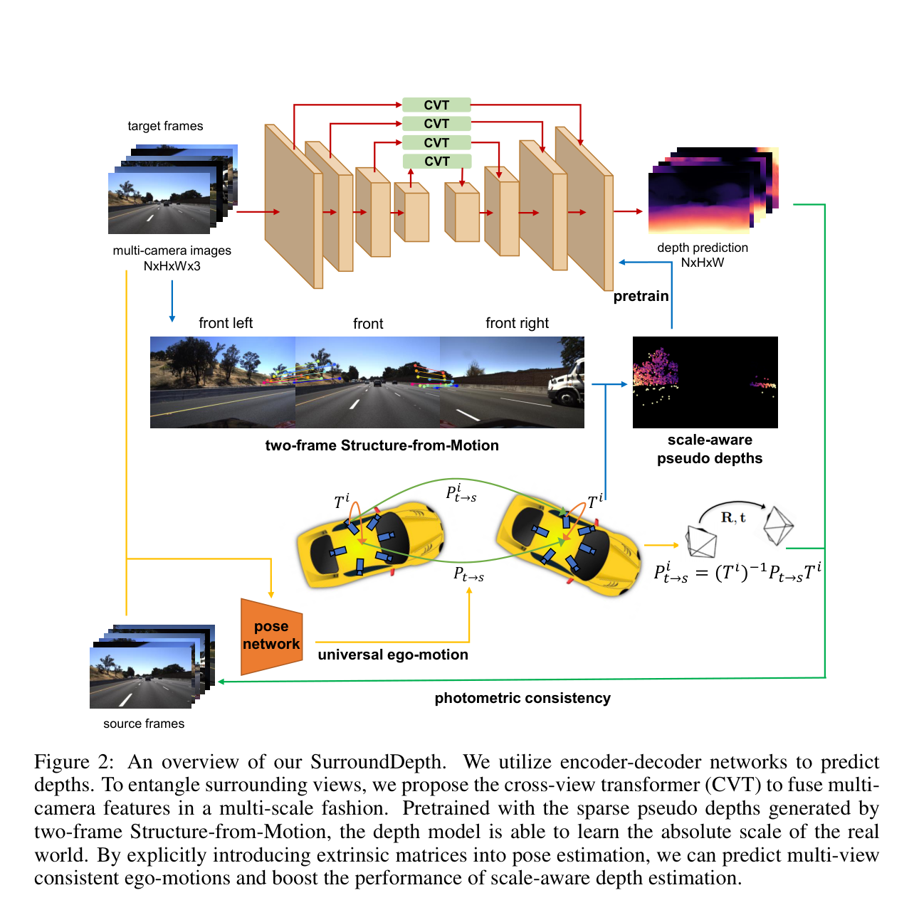
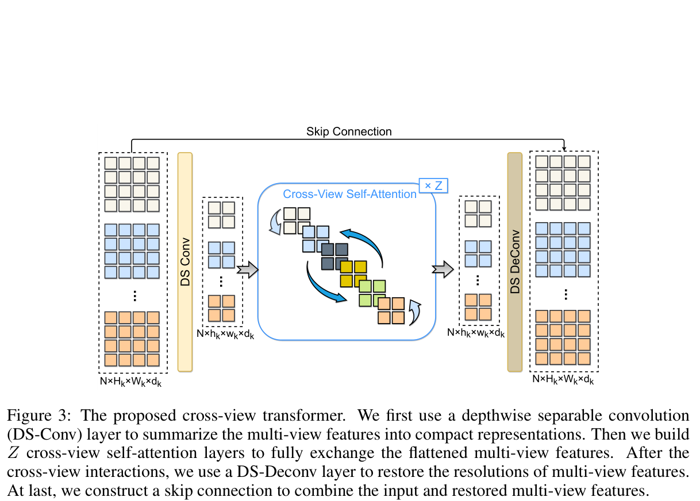
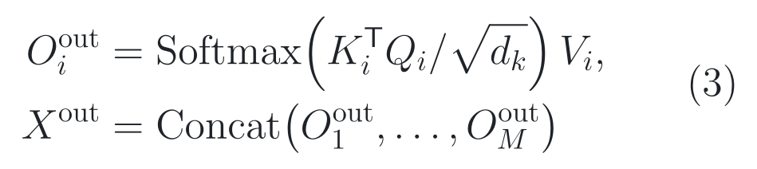
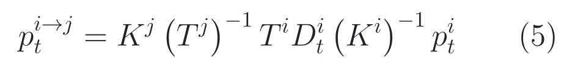
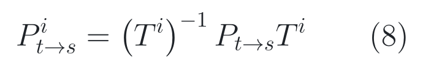
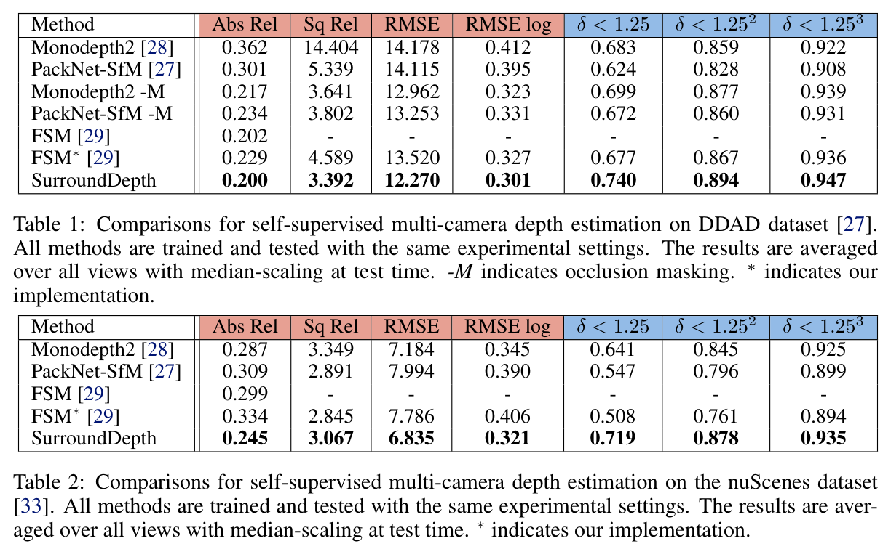
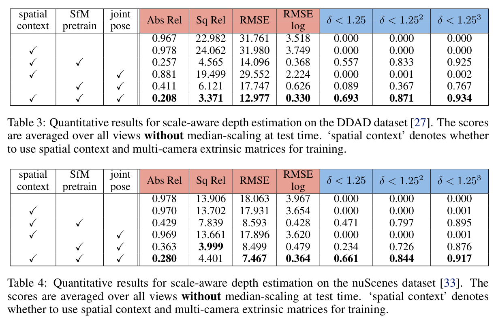
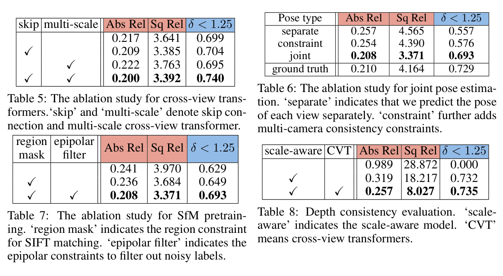

# 2026-07-28 — SurroundDepth: Entangling Surrounding Views for Self-Supervised Multi-Camera Depth Estimation

`CoRL 2022` · `Accepted` ·
`论文与补充材料已读 / 官方源码已读 / Checkpoint 未运行`

**主方向：** P02 · 稠密场景语义与几何 ·
**输入模态：** Surround Camera ·
**交叉标签：** 多相机深度估计、自监督学习、跨视图 Transformer、
Structure-from-Motion、尺度感知深度、相机标定、自车运动、多视图一致性

[▶ 从第一张图开始](#1-看图论文到底做了什么) ·
[返回首页](../../README.md) · [全部精读](../../index/papers.md) ·
[PMLR 正式录用页](https://proceedings.mlr.press/v205/wei23a.html) ·
[官方论文](https://proceedings.mlr.press/v205/wei23a/wei23a.pdf) ·
[官方补充材料](https://proceedings.mlr.press/v205/wei23a/wei23a-supp.pdf) ·
[官方代码 @ 固定 SHA](https://github.com/weiyithu/SurroundDepth/tree/22dfecfe8fca62a38d0f682ff7bf65b41aba3cac)

证据与行文标签：**[原文翻译]** 忠实中文译文；**[笔记解释]** 帮助理解的
通俗讲解；**[论文]** 作者材料直接支持；**[源码]** 固定 commit 直接支持；
**[判断]** 本笔记分析；**[未核验]** 尚未独立运行或确认。论文定义、源码实际
行为与本仓库是否完成数值复现始终分开。

## 0. 阅读起点：术语先导与摘要完整翻译

### 0.1 首次术语解释

**术语覆盖声明：** 摘要中的核心专业术语先在这里解释；摘要之后第一次出现的
新术语仍在正文首次出现处说明。全文锁定下列中文名、英文名、缩写与符号，不在
后文换译。

- **深度估计（Depth Estimation）**：为图像中的每个有效像素预测它到相机的
  距离；本文输出的是六路环视相机各自的稠密深度图。
- **激光雷达（Light Detection and Ranging, LiDAR）**：主动发射并接收激光来
  测量距离的传感器；本文训练不以稠密 LiDAR 深度为监督，但评测真值由 LiDAR
  点投影得到。
- **时间光度约束（Temporal Photometric Constraint）**：若场景近似静态且相机
  运动、深度预测正确，把相邻时刻图像重投影到目标时刻后，像素外观应当接近；
  本文用这种误差提供自监督。
- **自监督深度估计（Self-Supervised Depth Estimation）**：不用训练集稠密深度
  标签，而从相邻图像的几何与外观一致性构造训练信号。
- **单目图像（Monocular Image）**：来自一台相机的一幅图像；单目时间序列可以
  同时缩放深度和相机平移而保持重投影近似不变，因此天然存在尺度歧义。
- **环视相机（Surround Cameras）**：围绕车辆、共同覆盖近似 360° 视野的多台
  相机；本文在 DDAD 与 nuScenes 中均按六个视角处理。
- **深度图（Depth Map）**：与图像像素对齐的距离场；它不是三维目标框，也不直接
  表示语义类别或可通行性。
- **SurroundDepth**：作者为本文完整方法取的原名；它是同时处理六路图像、预测
  六张深度图的自监督模型，不自行翻译方法名。
- **跨视图 Transformer（Cross-View Transformer, CVT）**：作者新增的特征融合
  模块；它把六个相机在同一尺度的压缩特征展平成一个序列，以自注意力交换信息。
- **跨视图自注意力（Cross-View Self-Attention）**：让一个视角中的特征位置按
  内容选择全部视角中的特征作为上下文；“注意力高”表示权重大，不等于几何对应
  已被显式证明。
- **相机外参矩阵（Camera Extrinsic Matrix）**：描述相机坐标系与车体坐标系之间
  刚体变换的矩阵；本文用相机间已知基线把无单位的单目尺度锚到真实世界尺度。
- **运动恢复结构（Structure-from-Motion, SfM）**：由多幅图像中的特征对应与
  相机几何恢复三维结构和运动；本文用双帧 SfM 产生稀疏尺度感知伪深度。
- **尺度感知深度（Scale-Aware Depth）**：直接以真实距离单位输出、评测时不靠
  真值中位数校准尺度的深度；它仍可能有局部误差，并不等于“绝对准确”。
- **伪深度（Pseudo Depth）**：由 SfM 三角化自动生成、可能稀疏且含噪的训练目标，
  不是人工标注的稠密真值。
- **自车运动（Ego-Motion）**：车辆或相机从目标帧到源帧的相对位姿变化；本文先
  预测车体的统一运动，再用外参变换到每台相机。
- **DDAD 与 nuScenes**：本文采用的两个自动驾驶多传感器数据集原名；方法只使用
  环视图像和标定训练，LiDAR 投影深度只用于最终评测。

### 0.2 摘要完整专业中文翻译

**原文锚点：** Abstract，PDF p. 1 / PMLR proceedings p. 539。

<a id="abstract-a01"></a>
> **[原文翻译] Abstract · PDF p. 1 / proceedings p. 539 · A01**
>
> 从图像进行深度估计是自动驾驶三维感知的基础步骤，也是昂贵的 LiDAR 等深度
> 传感器的一种经济替代方案。时间光度约束使不依赖标签的自监督深度估计成为
> 可能，进一步促进了它的应用。然而，大多数现有方法仅依据每幅单目图像预测
> 深度，忽略了现代自动驾驶车辆通常配备的多路环视相机之间的相关性。本文提出
> SurroundDepth，将多个环视视图的信息纳入进来，以预测跨相机的深度图。具体
> 而言，我们使用一个联合网络处理所有环视视图，并提出跨视图 Transformer 来
> 有效融合多视图信息。我们应用跨视图自注意力，高效实现多相机特征图之间的
> 全局交互。不同于自监督单目深度估计，在给定多相机外参矩阵后，我们能够预测
> 真实世界尺度。为实现这一目标，我们采用双帧运动恢复结构，提取尺度感知伪深度
> 来预训练模型。此外，我们不再分别预测每台相机的自车运动，而是估计车辆的
> 统一自车运动，并将其变换到每个视图，以实现多视图自车运动一致性。实验中，
> 我们的方法在具有挑战性的多相机深度估计数据集 DDAD 和 nuScenes 上取得了
> 当时最先进的性能。代码已公开于作者给出的 GitHub 仓库。

**完整性声明：** A01 按官方 PDF 摘要唯一实质段落逐句完整翻译，保留了训练信号、
多相机瓶颈、三个方法组件、尺度条件、两个数据集和代码公开声明；没有用 TL;DR
替换作者摘要，也没有在译文中加入本笔记的源码差异判断。

> [!TIP]
> **[笔记解释] 读完摘要再看这一句：** SurroundDepth 让六个相机先在特征层互相
> “借视野”，再用 SfM 稀疏深度把距离尺校准、用统一车体运动维持六路姿态一致；
> 最强证据是两数据集和逐模块消融，最大边界是多视图深度一致性仍无理论保证。

**学习顺序：**
[0 摘要与术语](#0-阅读起点术语先导与摘要完整翻译) →
[1 看原图](#1-看图论文到底做了什么) →
[2 读原式](#2-读公式核心机制怎样表达) →
[3 看结果](#3-看结果证据是否支持主张) →
[4 对源码](#4-对源码公式如何落地) →
[5 记结论](#5-记结论贡献边界与开放问题)

## 1. 看图：论文到底做了什么

### 1.1 30 秒路口故事：六扇车窗怎样共用一把距离尺

**[笔记解释]** 想象车辆停在一个没有车道保护的丁字路口。前相机看见一辆横穿
车辆的车头，左前相机看见它的车身；若六台相机各自估深度，两路都可能因纹理少、
遮挡或单目尺度歧义而给出不一致距离。SurroundDepth 的第一步，是让同一层的六路
特征在 CVT 中全局交换，使前方模糊区域能借用左前视角的上下文。

第二个难点是“单位”。只看一段单目视频，把全部深度和相机平移同时乘以 2，重投影
仍可能几乎一样。六台相机之间的物理基线已知，本来提供了米制尺；但网络刚开始训练
时深度尺度很离谱，跨相机投影会直接落出图像，空间光度误差反而没有有效梯度。作者
因此先用 SfM 稀疏三角化结果预训练，把深度拉到大致真实尺度，再启用空间光度训练。

第三个难点是运动：车体只有一次刚体运动，却挂着六台朝向不同的相机。逐相机预测六
份运动可能互相矛盾。作者让姿态网络先平均六路末层特征，预测一份车体统一运动，再用
每台相机外参变换成局部运动。整篇论文可以记成一条因果链：**跨视图特征补上下文 →
SfM 预训练给尺度初值 → 统一位姿给时间监督一致坐标**。

### 1.2 Figure 2：完整方法有三条同时训练的路径



> **原图出处：** Wei et al., CoRL 2022, Figure 2, PDF p. 3 /
> PMLR proceedings p. 541。[官方 PDF](https://proceedings.mlr.press/v205/wei23a/wei23a.pdf)。
> 仅作学术讲解所需的局部摘录，原图版权归原作者及其他权利人。

**这张图按什么顺序看：**

1. 顶部红线是深度主路：六路目标帧进入共享编码器，多个尺度插入 CVT，再由共享
   解码器输出六张深度图；“共享”指同一组参数逐图提特征，不是先把原图拼接。
2. 中间蓝线是尺度初始化：相邻相机的双帧 SfM 匹配经过三角化，形成稀疏尺度感知
   伪深度，先预训练深度网络。
3. 底部黄线与绿线是时间自监督：姿态网络由六路图像预测车体统一运动，外参把它
   转到各相机坐标，再把源帧重建到目标帧计算光度误差。

**看完应能复述：** SurroundDepth 并不是一个仅靠 Transformer 的深度网络，而是
“跨视图特征融合 + 两阶段尺度训练 + 外参约束的联合位姿”三个组件共同组成的系统。

**这张图没有证明：** 结构图没有证明注意力找到了真实几何对应，也没有证明 SfM
伪标签无噪、预测深度对动态物体可靠，或跨相机深度在三维中严格一致；这些要回到
Tables 1–8 与作者 Limitations。

### 1.3 Figure 3：CVT 在每个尺度先压缩、再全局交互、最后还原



> **原图出处：** Wei et al., CoRL 2022, Figure 3, PDF p. 5 /
> PMLR proceedings p. 543。[官方 PDF](https://proceedings.mlr.press/v205/wei23a/wei23a.pdf)。
> 仅作学术讲解所需的局部摘录，原图版权归原作者及其他权利人。

**零基础读图：** 深度可分离卷积（Depthwise Separable Convolution, DS-Conv）先对
每个通道做空间卷积，再用 1×1 卷积混合通道，计算量通常低于标准卷积。这里它把
五个 ResNet 尺度都压到 DDAD 的 12×20 或 nuScenes 的 11×20；六路相机于是分别
形成 6×12×20 = 1,440 或 6×11×20 = 1,320 个 token。token 是 Transformer
处理的一条特征向量，不是图像像素或三维点。

**小数字教学例子：** 假设只有 2 台相机，每台压成 2×2 网格，展平后就是 8 个
token。前相机右边缘车辆的 query 可以给左前相机左边缘 token 更高权重；八层迭代
后再还原成两张 2×2 特征图。这个例子只解释信息流，不代表论文只用 8 个 token。

**专业边界：** 论文正文说为每个特征加入视角、行、列三种独特可学习位置编码；
固定源码的 `PositionEmbeddingSine` 实际只生成二维正弦行列编码，并把同一编码复制
到六个视角，没有独立的 view-wise embedding。这是可审查的论文—源码差异，尚未
通过 checkpoint 数值追踪判断影响。

### 整体算法架构与创新设计

**原方法瓶颈：** **[论文]** 作者指出，Monodepth2 一类自监督单目方法逐相机预测
深度与位姿，既忽略相邻环视图之间的重叠与互补信息，又因单目深度—平移共同缩放而
不能直接恢复真实尺度；初始尺度错误还会让跨相机投影落出图像，使空间光度监督失效。
来源：论文 §1、§3.1 与 §3.4，PDF p. 2–5 / proceedings p. 540–543。

**主干网络与基线：** **[论文] [源码]** 直接基线是 Monodepth2：默认深度主干为
ImageNet 预训练 ResNet34，输出五级特征；共享 U-Net 式深度解码器在四个尺度预测
视差，独立的双图 ResNet34 与 PoseDecoder 预测位姿。本文保留这些 backbone、
解码和光度自监督骨架，在五级 encoder skip 上插入 CVT，并增加 SfM 预训练与联合
位姿。来源：论文 §4.1，PDF p. 6；[固定 SHA 模型装配](https://github.com/weiyithu/SurroundDepth/blob/22dfecfe8fca62a38d0f682ff7bf65b41aba3cac/runer.py#L105-L144)。

**继承与新增边界：** **[论文] [源码]** 继承项包括 ResNet 编码器、Monodepth2
深度解码器、最小重投影、auto-masking、SSIM 与 L1 混合光度误差、边缘感知视差
平滑和翻转后处理；新增或替换项是五尺度 CVT、SIFT/外参三角化伪深度预训练、空间
光度项及六路特征平均后的统一位姿。没有证据把 ResNet、U-Net 或基础光度损失算作
本文原创。来源：论文 §2–§3，PDF p. 2–6；[固定 SHA 损失实现](https://github.com/weiyithu/SurroundDepth/blob/22dfecfe8fca62a38d0f682ff7bf65b41aba3cac/runer.py#L721-L859)。

**端到端信息流：** **[论文] [源码]** 六路当前 RGB 图像 → 共享 ResNet34 → 五级
特征分别重排为“一个分布式 batch 内的环视组 × 6 视角 × 通道 × 高 × 宽” → 每级
CVT 压到 12×20（DDAD）或 11×20（nuScenes）并做八层全局注意力 → 恢复原尺度并
与 encoder 特征相加 → 共享深度解码器输出四尺度视差 → 焦距归一化后成为六张深度
图；训练时另取前后相邻帧，经联合姿态网络得到车体运动并写成六个相机局部变换，
重建源图后计算损失。来源：Figure 2–3 与 §3.2–§3.5，PDF p. 3–6；
[固定 SHA CVT shape](https://github.com/weiyithu/SurroundDepth/blob/22dfecfe8fca62a38d0f682ff7bf65b41aba3cac/networks/transformer.py#L52-L68)。

**总体训练方式：** **[论文] [源码]** 尺度歧义模型单阶段训练；尺度感知模型先以
时间光度、平滑项和稀疏 SfM 深度做预训练，再载入“最佳”权重，以时间光度、空间
光度和平滑项微调。所有 encoder、CVT、depth head、pose encoder 与 pose head
都加入 Adam，没有冻结；训练与推理都只需环视图像和标定，但训练额外读取相邻帧，
SfM 阶段还读取离线匹配伪深度，推理只运行深度 encoder/decoder。来源：论文 §3.4、
§4.1 与补充材料 §A，PDF p. 5–7 / supplement p. 1；
[固定 SHA 三阶段配置](https://github.com/weiyithu/SurroundDepth/blob/22dfecfe8fca62a38d0f682ff7bf65b41aba3cac/README.md#L95-L111)。

#### 创新模块 1：Cross-View Transformer

**位置与接口：** 它替换 ResNet 五级特征到深度解码器之间原本直接传递的 skip
路径；同尺度六路特征先一起进入 CVT，再按相机拆回原 batch 排列供 decoder 使用。

**输入：** 第 *k* 级输入语义为环视组 × 6 × *d*<sub>*k*</sub> ×
*H*<sub>*k*</sub> × *W*<sub>*k*</sub>；固定配置的 DDAD 五级空间尺寸依次为
192×320、96×160、48×80、24×40、12×20。

**内部变换：** DS-Conv 以 16、8、4、2、1 的步幅把五级特征都压到 12×20，
六视角展平成 1,440-token 序列；每级连续执行八个“LayerNorm → 八头自注意力 →
残差 → LayerNorm → MLP → 残差”块，再以深度可分离反卷积还原空间分辨率。

**输出：** 恢复后的六路多尺度特征；启用 `skip=True` 时与原 encoder 特征逐元素
相加，再作为 U-Net 解码器的多尺度 skip 和最深层输入。

**为什么这样设计：** **[论文] 作者明确动机：** 为了让重叠或互补视角交换全局
上下文，同时避免直接对大特征图做二次复杂度注意力，作者先压缩分辨率、再注意力、
后还原，并以 skip 减少下采样信息损失。来源：论文 §3.3，PDF p. 4–5。

**训练信号：** **[论文] [源码]** CVT 没有单独标签；四尺度时间重投影、可选空间
重投影、SfM 稀疏深度和视差平滑损失均经 depth 输出直接向 CVT 与共享 encoder
回传梯度。来源：论文 §3.1–§3.4，PDF p. 3–5；
[固定 SHA 损失汇总](https://github.com/weiyithu/SurroundDepth/blob/22dfecfe8fca62a38d0f682ff7bf65b41aba3cac/runer.py#L737-L859)。

**作用与证据：** **[论文]** Table 5 的受控消融显示：相对不启用 skip 与多尺度
CVT 的 Abs Rel 0.217，加入 skip 后为 0.209（绝对下降 0.008，约 3.7%），只加入
多尺度反而为 0.222，二者同时加入才到 0.200（下降 0.017，约 7.8%）。因此证据
支持组件交互后的完整设计，不能把全部增益单独归给“多尺度”。来源：论文 Table 5，
§4.4，PDF p. 8。

**论文位置：** **[论文]** Figure 3、Eq. (3)–(4) 与 §3.3，PDF p. 4–5。

**源码入口：** **[源码]** [CVT 与 Self_Attention @ 固定 SHA](https://github.com/weiyithu/SurroundDepth/blob/22dfecfe8fca62a38d0f682ff7bf65b41aba3cac/networks/transformer.py#L14-L122)；[五尺度接入 DepthDecoder](https://github.com/weiyithu/SurroundDepth/blob/22dfecfe8fca62a38d0f682ff7bf65b41aba3cac/networks/depth_decoder.py#L56-L82)。

#### 创新模块 2：Scale-aware Structure-from-Motion Pretraining

**位置与接口：** 这是正式深度微调之前的离线伪标签生成与预训练阶段；SIFT
匹配脚本输出每个相机样本的稀疏深度、三角化角和两侧极线距离，dataset 再把它们
送入深度损失。

**输入：** 相邻相机的图像、相机内外参、预定义重叠区域、SIFT 对应点，以及当前
深度网络输出；它不读取训练集稠密 LiDAR 深度。

**内部变换：** 先把搜索限制在相邻视图各自约三分之一的重叠区域，再按基础矩阵
计算极线距离剔除外点，以已知相机基线三角化尺度深度；训练时继续筛掉负深度、
超过 200 m、三角化角过小或距离超过阈值的点，在预测深度上双线性采样并做 L1。

**输出：** 稀疏、带米制尺度的伪深度监督，以及一个把深度网络带入空间光度损失
有效工作区间的预训练 checkpoint；伪深度不会在第二阶段继续混入配置。

**为什么这样设计：** **[论文] 作者明确动机：** 初始深度尺度若远离真实值，按
外参跨相机投影会落出图像，空间光度损失不能教会网络尺度；小重叠与大视角变化又
会制造错误 SIFT 对应，因此需要区域约束和极线过滤。来源：论文 §3.4，PDF p. 5。

**训练信号：** **[论文] [源码]** 伪深度 L1 以 `match_spatial_weight=0.1`
直接训练 depth encoder、CVT 与 depth decoder；它不直接监督独立 pose encoder
或 pose head，后两者仍由时间光度重建获得梯度。来源：补充材料 §A，supplement
p. 1；[固定 SHA 稀疏深度损失](https://github.com/weiyithu/SurroundDepth/blob/22dfecfe8fca62a38d0f682ff7bf65b41aba3cac/runer.py#L695-L716)。

**作用与证据：** **[论文]** Table 7 的受控比较显示，加入 region mask 使
Abs Rel 从 0.241 降到 0.236（下降 0.005），再加入 epipolar filter 降到
0.208（继续下降 0.028）；Table 3 中，
空间上下文单独启用仍为 0.978，而加入 SfM 预训练后为 0.257，说明有效尺度初值
是该训练路线的关键干预。来源：论文 Table 3、Table 7 与 §4.3–§4.4，PDF p. 7–8。

**论文位置：** **[论文]** Figure 2、Eq. (5)–(6) 与 §3.4，PDF p. 3、5。

**源码入口：** **[源码]** [DDAD 匹配、极线过滤与三角化 @ 固定 SHA](https://github.com/weiyithu/SurroundDepth/blob/22dfecfe8fca62a38d0f682ff7bf65b41aba3cac/tools/match_ddad.py#L36-L146)；[预训练配置](https://github.com/weiyithu/SurroundDepth/blob/22dfecfe8fca62a38d0f682ff7bf65b41aba3cac/configs/ddad_scale_pretrain.txt#L1-L23)。

#### 创新模块 3：Joint Pose Estimation

**位置与接口：** 它位于双图 pose encoder 与相机重投影之间，用一份车体统一位姿
替代六份互不约束的相机位姿，再将统一位姿共轭变换到各相机坐标。

**输入：** 每个源—目标帧对在六台相机上的最深层 pose features，以及六台相机
相对车体的 4×4 外参矩阵；默认源帧为目标帧前一帧和后一帧。

**内部变换：** 分别编码六路图像对，把最深层特征重排成环视组 × 6 后沿视角求均值，
PoseDecoder 预测轴角与平移；随后把一份变换复制六次，并按每台相机外参执行坐标系
变换，供时间重投影使用。

**输出：** 每个相机从目标帧到源帧的局部变换矩阵；它只服务训练时的图像重建，
推理深度时不作为需要持续写回的状态。

**为什么这样设计：** **[论文] 作者明确动机：** 六台刚性安装的相机共享同一次
车体运动，逐相机预测会产生互相矛盾的监督；预测统一车体运动再用已知外参变换，
能在构造层面保持多视图位姿一致。来源：论文 §3.5，PDF p. 6。

**训练信号：** **[论文] [源码]** 联合位姿没有真值 pose loss，直接梯度来自前后
帧的时间光度重投影；空间光度项使用 dataset 提供的固定相机间变换，SfM 深度 L1
也只采样 depth，因此二者不直接训练 pose 分支。来源：论文 §3.1、§3.5，PDF
p. 3、6；[固定 SHA 位姿调用与变换](https://github.com/weiyithu/SurroundDepth/blob/22dfecfe8fca62a38d0f682ff7bf65b41aba3cac/runer.py#L517-L559)。

**作用与证据：** **[论文]** Table 6 的受控比较把 separate pose 替换为 joint
pose 后，Abs Rel 从 0.257 降至 0.208（绝对下降 0.049，约 19.1%）；只加入
consistency constraint 为 0.254。ground-truth pose 行为 0.210，说明结果接近而非
证明预测位姿本身更准确。来源：论文 Table 6 与 §4.4，PDF p. 8。

**论文位置：** **[论文]** Figure 2、Eq. (7)–(8) 与 §3.5，PDF p. 3、6。

**源码入口：** **[源码]** [PoseDecoder 的六视角均值 @ 固定 SHA](https://github.com/weiyithu/SurroundDepth/blob/22dfecfe8fca62a38d0f682ff7bf65b41aba3cac/networks/pose_decoder.py#L35-L58)；[车体到相机变换](https://github.com/weiyithu/SurroundDepth/blob/22dfecfe8fca62a38d0f682ff7bf65b41aba3cac/runer.py#L551-L559)。

## 2. 读公式：核心机制怎样表达

### 原文公式 1：六路压缩特征怎样交换信息

**原文公式：** 论文 Eq. (3)，PDF p. 4 / PMLR proceedings p. 542。

<p align="center"><picture><source media="(prefers-color-scheme: dark)" srcset="../../assets/notes/2026-07-28-surrounddepth/formulas/eq-03-cross-view-attention-dark.png"></picture></p>

> **公式来源：** Wei et al., CoRL 2022, Eq. (3)，PDF p. 4；本图按原符号重排。
> [官方 PDF](https://proceedings.mlr.press/v205/wei23a/wei23a.pdf) ·
> [可复制 TeX](../../assets/notes/2026-07-28-surrounddepth/formulas/source.tex#L5-L13)。

**符号说明**

- *Q*<sub>*i*</sub>、*K*<sub>*i*</sub>、*V*<sub>*i*</sub>：第 *i* 个注意力头的
  查询、键和值；它们来自同一条六视角展平序列。
- *d*<sub>*k*</sub>：每个注意力头的通道维数；平方根缩放避免点积随维数过大。
- *O*<sub>*i*</sub><sup>out</sup>：第 *i* 个头对值向量加权后的输出。
- *M*：注意力头数量；论文写一般符号，固定源码取 8。
- *X*<sup>out</sup>：把所有头沿通道拼接后的特征。

**纯文字读法：** 每个头先用查询与键的相似度产生归一化权重，再按权重汇总值，
最后把所有头的输出拼起来。

**玩具例子：** 只有两个 token 时，若前相机 token 对左前相机 token 的两个
Softmax 权重是 0.2 与 0.8，而值分别是 10 与 20，加权值就是 18。这个数只演示
注意力平均，不是论文特征值。

**专业解释：** Eq. (3) 表达内容选择，却没有显式外参、极线或相机邻接约束；
因此注意力可以学习跨视图相关性，但公式本身不保证选择的是同一三维点。论文排写
*K*<sup>T</sup>*Q*，固定源码按标准 token 行布局计算 *QK*<sup>T</sup>；两者可能
只是向量约定不同，未做数值等价追踪。

**回到上面的图：** 对应 Figure 3 中间蓝框“Cross-View Self-Attention × Z”。

**落到源码：** [Self_Attention.forward @ 固定 SHA](https://github.com/weiyithu/SurroundDepth/blob/22dfecfe8fca62a38d0f682ff7bf65b41aba3cac/networks/transformer.py#L105-L122)

**公式省略了什么：** 源码在注意力前后还有 LayerNorm、MLP 与残差；位置编码实际
为二维正弦编码且跨视角复制，未实现论文文字所述的独立可学习视角编码；注意力前后
还要做 DS-Conv 压缩和 DS-Deconv 还原。

### 原文公式 2：已知相机基线怎样把尺度带进投影

**原文公式：** 论文 Eq. (5)，PDF p. 5 / PMLR proceedings p. 543。

<p align="center"><picture><source media="(prefers-color-scheme: dark)" srcset="../../assets/notes/2026-07-28-surrounddepth/formulas/eq-05-spatial-reprojection-dark.png"></picture></p>

> **公式来源：** Wei et al., CoRL 2022, Eq. (5)，PDF p. 5；本图按原符号重排。
> [官方 PDF](https://proceedings.mlr.press/v205/wei23a/wei23a.pdf) ·
> [可复制 TeX](../../assets/notes/2026-07-28-surrounddepth/formulas/source.tex#L15-L19)。

**符号说明**

- *p*<sub>*t*</sub><sup>*i*→*j*</sup>：相机 *i* 的目标帧像素投到相机 *j*
  后的齐次像素位置。
- *K*<sup>*i*</sup>、*K*<sup>*j*</sup>：两台相机的内参，负责像素与相机射线互换。
- *T*<sup>*i*</sup>、*T*<sup>*j*</sup>：两台相机相对车体的外参；二者组合包含有
  物理单位的相机基线。
- *D*<sub>*t*</sub><sup>*i*</sup>：相机 *i* 在该像素预测的深度。

**纯文字读法：** 先把相机 *i* 的像素还原成射线，用预测深度放到三维，再由相机
*i* 变到车体、由车体变到相机 *j*，最后经相机 *j* 内参投回图像。

**玩具例子：** 两相机相距 1 m，某点初始预测 1000 m 时，视差近乎为零，投影可能
落不到真实重叠目标；若 SfM 先把它拉到约 10 m，1 m 基线会产生可见视差，空间
光度误差才可能提供有意义监督。数字仅说明尺度初值作用，不是论文样本。

**专业解释：** 单目时间重建中的深度和平移可共同缩放，Eq. (5) 的固定相机基线
不能随网络一起缩放，所以理论上提供米制尺度；但仅有公式还不够，错误初值会令有效
采样区域消失，这正是先做 SfM 预训练的原因。

**回到上面的图：** 对应 Figure 2 中相邻相机之间的蓝色 SfM/空间几何路径。

**落到源码：** [空间重投影 @ 固定 SHA](https://github.com/weiyithu/SurroundDepth/blob/22dfecfe8fca62a38d0f682ff7bf65b41aba3cac/runer.py#L643-L692)

**公式省略了什么：** 实现会按相机顺序循环移位、对越界采样补零，并以固定遮挡
mask 或全 1 mask 过滤；mask 采样结果被 `detach`，不会沿 mask 路径回传梯度。

### 原文公式 3：一份车体运动怎样变成六份相机运动

**原文公式：** 论文 Eq. (8)，PDF p. 6 / PMLR proceedings p. 544。

<p align="center"><picture><source media="(prefers-color-scheme: dark)" srcset="../../assets/notes/2026-07-28-surrounddepth/formulas/eq-08-joint-pose-transform-dark.png"></picture></p>

> **公式来源：** Wei et al., CoRL 2022, Eq. (8)，PDF p. 6；本图按原符号重排。
> [官方 PDF](https://proceedings.mlr.press/v205/wei23a/wei23a.pdf) ·
> [可复制 TeX](../../assets/notes/2026-07-28-surrounddepth/formulas/source.tex#L21-L25)。

**符号说明**

- *P*<sub>*t*→*s*</sub>：从目标时刻到源时刻的车体统一刚体运动。
- *P*<sub>*t*→*s*</sub><sup>*i*</sup>：同一运动在第 *i* 台相机坐标系中的表达。
- *T*<sup>*i*</sup>：第 *i* 台相机到车体坐标的外参；左乘逆矩阵、右乘原矩阵完成
  坐标系共轭变换。

**纯文字读法：** 先从相机 *i* 坐标回到车体坐标，应用统一车体运动，再变回相机
*i* 坐标；六个结果不同，但描述的是同一次物理运动。

**玩具例子：** 车辆直行 1 m 时，朝前相机主要看到沿光轴平移，朝左相机则主要
看到横向平移；不是车辆发生两次运动，而是同一运动在两个坐标系中的分量不同。

**专业解释：** 这种构造把一致性写进参数化，而不是额外惩罚六份独立预测之间的
差异；其准确性仍依赖外参和统一位姿预测本身。

**回到上面的图：** 对应 Figure 2 两辆黄色车之间的统一运动，以及向每台相机
局部位姿分叉的箭头。

**落到源码：** [predict_poses 中的外参共轭 @ 固定 SHA](https://github.com/weiyithu/SurroundDepth/blob/22dfecfe8fca62a38d0f682ff7bf65b41aba3cac/runer.py#L547-L559)

**公式省略了什么：** 源码先在 PoseDecoder 中把六路最深层特征求算术平均，再预测
轴角和平移；没有显式置信度加权，也没有外参扰动或相机失效分支。

## 3. 看结果：证据是否支持主张

### 3.1 原文公开的实验配置

**原文锚点：** 主论文 §4.1–§4.4，PDF p. 6–8 / proceedings p. 544–546；
补充材料 §A–§C，supplement p. 1–2；固定 SHA 的 config、dataset 与 runner。

- **数据集、版本与划分。** **[论文]** DDAD 使用六台同步相机；补充材料报告
  12,650 个训练 sample（75,900 张图）和 3,950 个验证 sample，同时把验证图数
  写为 15,800。后者与“每 sample 六图”的算术不一致，本文不替作者猜改。DDAD
  评测到 200 m、不裁图。nuScenes 为 `v1.0-trainval`，官方 700/150/150 个训练、
  验证、测试 sequence，源码训练前过滤静止帧。**[源码]** 固定 split 文件实际有
  DDAD 12,319/3,950、nuScenes 20,096/6,019 个训练/验证 anchor；DDAD 训练数
  与补充材料 12,650 不同，未公开剔除清单。来源：补充材料 §A，supplement p. 1；
  [固定 SHA DDAD split](https://github.com/weiyithu/SurroundDepth/blob/22dfecfe8fca62a38d0f682ff7bf65b41aba3cac/datasets/ddad/train.txt)。
- **传感器、输入范围、分辨率与预处理。** **[论文]** 训练输入为六路 RGB 环视，
  DDAD 缩放到 640×384，nuScenes 缩放到 640×352；训练不使用稠密 LiDAR 真值，
  评测深度由 LiDAR 点投影得到。**[源码]** 深度范围 DDAD 为 0.1–200 m、nuScenes
  为 0.1–80 m；预测深度乘当前焦距除以参考焦距 715.0873 或 500。DDAD 另读取
  手工自遮挡 mask。来源：论文 §4.1–§4.2，PDF p. 6–7；
  [固定 SHA DDAD config](https://github.com/weiyithu/SurroundDepth/blob/22dfecfe8fca62a38d0f682ff7bf65b41aba3cac/configs/ddad.txt#L1-L17)。
- **训练硬件、软件与关键依赖。** **[源码]** README 指定 Python 3.8、PyTorch
  1.8.1、torchvision 0.9.1、CUDA 11.4 和 RTX 3090；DDAD 示例以 8 个进程运行，
  作者说明 nuScenes 用 4 GPU 比 8 GPU 更好。`requirements.txt` 未列源码实际导入
  的 `timm`、`tensorboardX`、`IPython`、`matplotlib`、`joblib` 和 DDAD 的 `dgp`，
  因而一次安装命令并非完整环境闭环。来源：[固定 SHA README 环境与训练说明](https://github.com/weiyithu/SurroundDepth/blob/22dfecfe8fca62a38d0f682ff7bf65b41aba3cac/README.md#L34-L111)。
- **初始化或预训练权重。** **[论文] [源码]** 深度与 pose encoder 均为 ImageNet
  预训练 ResNet34，不冻结；尺度感知正式训练再载入 SfM 预训练阶段的 encoder、
  depth、pose encoder 与 pose 权重。`load_optimizer` 虽定义但主路径没有调用，
  微调阶段以新建 Adam 状态开始。来源：论文 §4.1，PDF p. 6；
  [固定 SHA 参数与加载路径](https://github.com/weiyithu/SurroundDepth/blob/22dfecfe8fca62a38d0f682ff7bf65b41aba3cac/runer.py#L105-L169)。
- **优化器、学习率与 scheduler。** **[论文]** 补充材料公开 Adam，β1=0.9、
  β2=0.999、初始学习率 1e-4。**[源码]** StepLR 每 15 epoch 乘 0.1；因此只有
  20-epoch DDAD 尺度歧义训练会在第 15 epoch 后衰减，10/5/2-epoch 阶段不会触发。
  来源：补充材料 §A，supplement p. 1；[固定 SHA 优化器](https://github.com/weiyithu/SurroundDepth/blob/22dfecfe8fca62a38d0f682ff7bf65b41aba3cac/runer.py#L167-L169)。
- **batch size、训练轮数与阶段。** **[源码]** 六份 config 均写 `batch_size=6`，
  runner 随后除以六，使每个 GPU 的 DataLoader batch 是 1 个环视 sample、即 6 张
  图；DDAD 的 8 GPU 全局为 8 个 sample/48 张图，nuScenes 的 4 GPU 为 4 个
  sample/24 张图。DDAD 尺度歧义 20 epoch，SfM 预训练 10、微调 10；nuScenes
  对应 5、5、2 epoch。来源：[固定 SHA batch 重排](https://github.com/weiyithu/SurroundDepth/blob/22dfecfe8fca62a38d0f682ff7bf65b41aba3cac/runer.py#L174-L206)。
- **增强。** **[源码]** 训练以 50% 门控启用 ColorJitter：亮度、对比度、饱和度
  0.8–1.2，色相 −0.1–0.1；对象在每次调用时重新采样参数，源码注释所称“同一
  augmentation”没有被显式固定。水平翻转也是 50%，但只在既不做 SfM 预训练也
  不启用 joint pose 时允许，所以尺度感知两阶段都关闭翻转。来源：[固定 SHA augmentation](https://github.com/weiyithu/SurroundDepth/blob/22dfecfe8fca62a38d0f682ff7bf65b41aba3cac/datasets/mono_dataset.py#L65-L84)。
- **随机种子、重复次数与模型选择。** **[未核验]** 论文、补充材料与 README 均
  未公开全局随机种子、独立重复次数、误差条或显著性检验。README 要求“选择最佳
  预训练模型”，但未给选择指标或 tie-break；固定源码也没有统一的 best-checkpoint
  管理器。来源：论文 §4 与补充材料 §A–C 均未公开上述确定性和选模细节。
- **训练损失。** **[论文] [源码]** 两个相邻时间帧提供最小光度重投影，SSIM
  权重 0.85、L1 权重 0.15；四尺度边缘感知视差平滑权重 1e-3。SfM 阶段加稀疏
  深度 L1，权重 0.1；微调阶段加空间光度项，DDAD 权重 0.075、nuScenes 0.06。
  auto-masking 从身份重投影与模型重投影中逐像素取较小值。来源：补充材料 §A，
  supplement p. 1；[固定 SHA 损失](https://github.com/weiyithu/SurroundDepth/blob/22dfecfe8fca62a38d0f682ff7bf65b41aba3cac/runer.py#L721-L859)。
- **推理、尺度与后处理。** **[源码]** `val` 对原图和水平翻转图各推理一次，并
  无条件调用翻转融合；随后对每个 checkpoint 同时计算两套指标：scale-ambiguous
  分支用每图真值/预测中位数之比校准，scale-aware 分支不校准，两者均裁剪到 config
  深度范围。论文 §4.2 明确 Tables 1–2 使用 median scaling，Tables 3–4 不使用。
  来源：论文 §4.2–§4.3，PDF p. 7；[固定 SHA val](https://github.com/weiyithu/SurroundDepth/blob/22dfecfe8fca62a38d0f682ff7bf65b41aba3cac/runer.py#L333-L419)。
- **指标定义。** **[论文]** Abs Rel 是逐像素绝对深度误差除以真值的平均，Sq Rel
  将误差平方后再除以真值，RMSE 是均方根距离误差，RMSE log 在对数深度上计算；
  δ < 1.25、1.25²、1.25³ 是预测/真值倍率误差落在阈值内的像素比例。前四项越低
  越好，δ 越高越好。Abs Rel 不是整体 accuracy；低跨视图误差也不保证对真值正确。
  来源：补充材料 §B，supplement p. 1–2。
- **基线公平性。** **[论文]** 作者以同一 ResNet34、输入分辨率和训练/评测设置
  重跑 Monodepth2、PackNet-SfM 与 FSM。FSM 未公开代码，所以 Table 1–2 同时列
  原论文可得值与作者重实现 `FSM*`；其预训练、评测和超参数无法完全核齐，跨方法
  公平性仍有来源不确定性。来源：论文 §4.1–§4.2，PDF p. 6–7。
- **checkpoint 与最短复现入口。** **[源码]** README 提供 DDAD/nuScenes 各自的
  scale-ambiguous、scale-aware 四个正式权重，以及两个 SfM 预训练权重；训练入口为
  `python -m torch.distributed.launch ... run.py --config configs/<type>.txt`，评测
  另加 `--eval_only --models_to_load depth encoder --load_weights_folder=<path>`。
  **[未核验]** 本仓库没有下载数据、伪标签或 checkpoint，也没有运行 CUDA 推理。
  来源：[固定 SHA README checkpoint 与命令](https://github.com/weiyithu/SurroundDepth/blob/22dfecfe8fca62a38d0f682ff7bf65b41aba3cac/README.md#L25-L118)。

### 3.2 原文公开的实验流程

**原文锚点：** Figure 2、主论文 §3.4–§4.3，PDF p. 3、5–8；补充材料 §A–§C，
supplement p. 1–2；固定 SHA 的 README、tools、configs 与 `runer.py`。

1. **数据准备：** **[论文] [源码]** 下载 DDAD 或 nuScenes，按公开 split 组织六路
   当前帧与前后相邻帧；运行 LiDAR 投影脚本只为验证集生成评测深度。尺度感知路线
   另在 Python 3.6 与旧版 OpenCV/SIFT 环境运行 `sift_*`、`match_*`，生成稀疏
   三角化伪深度；DDAD 还需外部 metadata 和作者自遮挡 mask。来源：补充材料 §A，
   supplement p. 1；[固定 SHA 数据说明](https://github.com/weiyithu/SurroundDepth/blob/22dfecfe8fca62a38d0f682ff7bf65b41aba3cac/README.md#L42-L94)。
2. **尺度歧义训练：** **[论文] [源码]** 从 ImageNet ResNet34 初始化，以六路联合
   CVT 深度网络、独立逐相机 pose 和时间光度/平滑损失训练；不启用 SfM、空间光度
   或 joint pose。DDAD 20 epoch，nuScenes 5 epoch。来源：论文 §4.1，PDF p. 6；
   [固定 SHA DDAD 配置](https://github.com/weiyithu/SurroundDepth/blob/22dfecfe8fca62a38d0f682ff7bf65b41aba3cac/configs/ddad.txt#L1-L17)。
3. **尺度感知预训练：** **[论文] [源码]** 启用 CVT、joint pose 与稀疏 SfM 深度
   L1，同时保留时间光度/平滑损失；不启用空间光度，因为此时目标正是先获得可用
   尺度。DDAD 10 epoch，nuScenes 5 epoch。来源：论文 §3.4，PDF p. 5；
   [固定 SHA 预训练配置](https://github.com/weiyithu/SurroundDepth/blob/22dfecfe8fca62a38d0f682ff7bf65b41aba3cac/configs/ddad_scale_pretrain.txt#L1-L23)。
4. **验证与选模：** **[未核验]** DDAD `eval_frequency=-1`，源码每个 epoch 末保存
   并验证；nuScenes 按 1000 step 验证。作者要求从预训练 checkpoint 中挑“最佳”，
   但原文未公开以 scale-aware 哪个指标、所有视角均值还是单视角作选择。来源：
   README Training 与论文 §4 均未公开选模判据；[固定 SHA 保存路径](https://github.com/weiyithu/SurroundDepth/blob/22dfecfe8fca62a38d0f682ff7bf65b41aba3cac/runer.py#L422-L468)。
5. **尺度感知微调：** **[论文] [源码]** 载入最佳 SfM 预训练模型，关闭伪深度 L1，
   开启空间光度损失并保留时间光度、平滑与 joint pose；优化器状态不续接。DDAD
   10 epoch，nuScenes 2 epoch。来源：补充材料 §C，supplement p. 2；
   [固定 SHA 微调配置](https://github.com/weiyithu/SurroundDepth/blob/22dfecfe8fca62a38d0f682ff7bf65b41aba3cac/configs/ddad_scale.txt#L1-L20)。
6. **推理与后处理：** **[源码]** 评测只载入 `encoder` 与 `depth`；原图/翻转图
   各前向一次并融合视差，按焦距归一化和深度范围裁剪。pose、相邻帧、SfM 匹配与
   LiDAR 真值都不进入部署前向。来源：[固定 SHA 评测前向](https://github.com/weiyithu/SurroundDepth/blob/22dfecfe8fca62a38d0f682ff7bf65b41aba3cac/runer.py#L333-L406)。
7. **最终评测：** **[论文] [源码]** 对六个 camera ID 分别累计七个指标，再做视角
   等权平均；Tables 1–2 使用每图 median scaling，Tables 3–4 直接评真实尺度。
   来源：论文 §4.2–§4.3，PDF p. 7；[固定 SHA 指标聚合](https://github.com/weiyithu/SurroundDepth/blob/22dfecfe8fca62a38d0f682ff7bf65b41aba3cac/runer.py#L282-L329)。

**复现仍缺什么：** **[未核验]** 缺完整依赖锁、可机器读取的数据 checksum、
DDAD 331 个训练 anchor 差异说明、模型选择规则、随机种子、重复实验和现代 CUDA
兼容声明。论文给出的是作者结果与可运行意图，不等于本仓库已经独立复现数值。

### 3.3 核心结果一：有中位数缩放时，跨视图能否改善相对深度



> **原图出处：** Wei et al., CoRL 2022, Table 1 与 Table 2, PDF p. 6 /
> PMLR proceedings p. 544。[官方 PDF](https://proceedings.mlr.press/v205/wei23a/wei23a.pdf)。
> 仅作学术讲解所需的局部摘录，原图版权归原作者及其他权利人。

**先看协议：** 两表都在测试时用每张图的真值中位数缩放预测，因此回答的是“深度
形状和相对远近是否更准”，不能证明模型单独恢复了米制距离。DDAD 的 `-M` 表示给
基线补同一遮挡 mask；`FSM*` 是作者重实现，不是 FSM 官方代码。

**DDAD 主效应：** 与同设置 Monodepth2-M 相比，SurroundDepth 的 Abs Rel 从
0.217 降到 0.200，绝对下降 0.017、相对约 7.8%；δ < 1.25 从 0.699 升到
0.740，绝对增加 0.041、相对约 5.9%。与表内原论文 FSM 的 0.202 相比，Abs Rel
只低 0.002、约 1.0%，所以“SOTA”在这一项的余量很小。

**nuScenes 主效应：** 相对 Monodepth2，Abs Rel 0.287 → 0.245，下降 0.042、
约 14.6%；δ < 1.25 0.641 → 0.719，增加 0.078。相对 FSM 原论文 Abs Rel
0.299，下降 0.054、约 18.1%。但 PackNet-SfM 的 Sq Rel 2.891 优于 3.067，
因此并非每个指标都达到表内最优。

**效率：** **[论文]** 单张 RTX 3090、一个六图 batch 的推理时间为 Monodepth2
0.028 s、PackNet-SfM 0.471 s、SurroundDepth 0.088 s；本文约为 Monodepth2 的
3.14 倍耗时，但约比 PackNet-SfM 快 5.35 倍。未报告显存、预处理、warm-up 或
方差，不能据此直接推断车端端到端 FPS。

### 3.4 核心结果二：不用真值缩放时，哪些组件真正让尺度可用



> **原图出处：** Wei et al., CoRL 2022, Table 3 与 Table 4, PDF p. 7 /
> PMLR proceedings p. 545。[官方 PDF](https://proceedings.mlr.press/v205/wei23a/wei23a.pdf)。
> 仅作学术讲解所需的局部摘录，原图版权归原作者及其他权利人。

**最重要的反例：** DDAD 中“只启用 spatial context”甚至是 0.978，几乎与没有
组件的 0.967 一样失效；nuScenes 也是 0.970 对 0.978。这直接支持作者的训练
瓶颈：外参有尺度，不等于从随机深度开始的空间光度损失会自动学出尺度。

**组件组合：** DDAD 中 spatial + SfM 为 0.257，再加入 joint pose 到 0.208，
绝对下降 0.049、相对约 19.1%。nuScenes 对应 0.429 → 0.280，下降 0.149、约
34.7%。然而 nuScenes 的 SfM + joint pose 行 Sq Rel 3.999 优于完整模型 4.401，
完整组合也不是每项指标最优，说明空间光度和不同误差分布之间仍有权衡。

**不要跨协议误读：** DDAD scale-aware 的 δ < 1.25 为 0.693，低于 Table 1
median-scaled 的 0.740；这不表示尺度感知一定更差，因为一个协议允许看真值校准
全图尺度，另一个不允许。正确结论是：完整组合在“不用真值调尺”的困难协议中得到
可用结果，而不是它在所有指标上超过可调尺模型。

### 3.5 核心结果三：逐模块消融支持到什么粒度



> **原图出处：** Wei et al., CoRL 2022, Table 5、Table 6、Table 7 与 Table 8,
> PDF p. 8 / PMLR proceedings p. 546。
> [官方 PDF](https://proceedings.mlr.press/v205/wei23a/wei23a.pdf)。仅作学术讲解
> 所需的局部摘录，原图版权归原作者及其他权利人。

- **CVT 结构不是简单相加。** Table 5 中只启用 multi-scale 的 0.222 比基线
  0.217 更差；skip + multi-scale 才到 0.200。证据支持交互后的完整卡片，不支持
  “多尺度单独必然提升”。
- **联合位姿胜过软约束。** Table 6 中 separate 0.257、额外 consistency loss
  0.254、joint 0.208；但 ground-truth pose 的 δ < 1.25 为 0.729，高于 joint
  的 0.693，而 Abs Rel 略差 0.210 对 0.208。作者据此推测真值 pose 有噪声，
  表格只说明深度指标混合，不直接测量 pose 真误差。
- **SfM 过滤有逐步证据。** Table 7 的 region mask 与 epipolar filter 分别把
  0.241 降到 0.236、再到 0.208；但没有报告剩余匹配数量、错误率或阈值敏感性。
- **一致不等于正确。** Table 8 中 scale-aware 使跨视图 Abs Rel 0.989 → 0.319，
  再加 CVT 到 0.257；δ 只从 0.732 到 0.735。它支持预测之间更协调，不能证明
  两张协调的深度都接近 LiDAR 真值。

### 3.6 证据支持什么

- **[论文]** 在相同 backbone、输入与作者重跑设置下，跨视图路径在 DDAD 与
  nuScenes 的多数相对深度指标优于逐相机 Monodepth2。
- **[论文]** 直接启用空间光度不能从错误初始尺度可靠收敛；SfM 尺度预训练是把
  网络带进有效区间的关键阶段。
- **[论文]** 把六路位姿特征在解码前联合，优于逐视角预测和后加一致性损失；
  Table 6 的归因粒度与模块相符。
- **[源码]** 固定 commit 确实实现了五尺度、每尺度八层、六视角全局注意力，
  稀疏伪深度 L1、空间光度与联合位姿也都能沿调用链落到损失。

### 3.7 证据没有支持什么

- **[判断]** 两个数据集都来自白天常规驾驶域，论文没有恶劣天气、夜间、相机缺失、
  外参漂移或跨城市域移测试，不能外推到鲁棒或安全退化能力。
- **[判断]** LiDAR 投影真值稀疏，平均像素指标不能证明细杆、远处行人、透明表面或
  动态物体边界适合下游避障；本文也没有接 3D detection、Occupancy 或规划评测。
- **[论文]** 作者明确承认跨视图一致性没有理论保证。更低 consistency error 不是
  概率校准、置信度估计，也不表示模型知道自己何时错。
- **[未核验]** 没有随机重复、误差条与显著性检验；DDAD 对 FSM 的 0.002 Abs Rel
  优势可能受实现、checkpoint 或单次训练波动影响。
- **[未核验]** 本仓库没有运行官方权重，无法确认公开 checkpoint 与论文 Tables
  1–8、当前依赖版本或固定 split 能逐项复现。

## 4. 对源码：公式如何落地

```text
run.py / config
→ Runer 装配 encoder、CVT depth decoder 与 pose branch
→ 六路当前帧预测四尺度 depth
→ 可选 SfM 稀疏深度或空间重投影
→ 前后帧经统一 pose 做时间重投影
→ 光度 + SfM + spatial + smoothness 损失
→ encoder/depth checkpoint 推理并做翻转融合
```

### 1. 入口与阶段开关：`MonodepthOptions` / `Runer.train`

- **论文对应：** 尺度歧义单阶段，以及尺度感知“预训练 → 选择权重 → 微调”两阶段。
- **源码行为：** `run.py` 只解析 config、构造 `Runer` 并调用 `train`；六份 config
  通过 `use_sfm_spatial`、`joint_pose`、`spatial` 三个布尔开关拼出路线。DDP/NCCL
  是强制初始化路径，`--no_cuda` 虽存在但没有让主流程绕开 CUDA。
- **需要留意：** `load_optimizer` 从未在入口调用，微调不是连同 Adam 动量续训；
  `save_frequency` 选项也不控制实际保存，真正由 `eval_frequency` 分支决定。
- [打开固定 SHA 入口](https://github.com/weiyithu/SurroundDepth/blob/22dfecfe8fca62a38d0f682ff7bf65b41aba3cac/run.py#L9-L18) ·
  [打开训练循环](https://github.com/weiyithu/SurroundDepth/blob/22dfecfe8fca62a38d0f682ff7bf65b41aba3cac/runer.py#L262-L280)

### 2. 五尺度跨视图深度：`ResnetEncoder` / `DepthDecoder` / `CVT`

- **论文对应：** Figure 2–3 与 Eq. (3)–(4)。
- **源码行为：** 当前六路图像沿 batch 维送入共享 ResNet34；DepthDecoder 每一级
  都按固定 6 视角 reshape，CVT 压到共同 12×20 或 11×20、执行八层注意力，再
  与输入相加。四个 `dispconv` head 输出 sigmoid 视差，`disp_to_depth` 映射到深度。
- **需要留意：** 视角数写死为 6；源码只有重复的二维正弦位置编码，而论文写三种
  独特可学习编码。源码导入 `timm`，但 requirements 未声明它。
- [打开固定 SHA 深度解码器](https://github.com/weiyithu/SurroundDepth/blob/22dfecfe8fca62a38d0f682ff7bf65b41aba3cac/networks/depth_decoder.py#L18-L84) ·
  [打开固定 SHA 注意力](https://github.com/weiyithu/SurroundDepth/blob/22dfecfe8fca62a38d0f682ff7bf65b41aba3cac/networks/transformer.py#L89-L122)

### 3. 尺度读入与写入：`match_ddad.py` / `depth_match_spatial`

- **论文对应：** Figure 2、Eq. (5)–(6) 与 SfM 预训练。
- **源码行为：** 离线脚本用外参形成基础矩阵、筛极线距离并三角化；dataset 读取
  每相机 pickle。训练再按原图坐标归一化，在预测 depth 上采样，按深度、角度和
  两侧距离 mask 筛选，以 L1 直接更新深度分支。
- **需要留意：** 损失处把最大深度写死为 200，而 nuScenes config 的评测上限是
  80；筛选阈值 DDAD=1、nuScenes=10，原文未做敏感性分析。若某样本筛后为空，
  `mean` 的数值行为也未由显式防护说明。
- [打开固定 SHA 三角化](https://github.com/weiyithu/SurroundDepth/blob/22dfecfe8fca62a38d0f682ff7bf65b41aba3cac/tools/match_ddad.py#L100-L146) ·
  [打开固定 SHA 伪深度 loss](https://github.com/weiyithu/SurroundDepth/blob/22dfecfe8fca62a38d0f682ff7bf65b41aba3cac/runer.py#L695-L716)

### 4. 统一位姿与梯度边界：`PoseDecoder.forward` / `predict_poses`

- **论文对应：** Eq. (7)–(8) 与 Joint Pose Estimation。
- **源码行为：** 每个前/后帧对各跑一次 pose encoder；当 `joint_pose=True`，最深层
  六视角特征先均值，PoseDecoder 输出一份轴角/平移，再复制六份并由外参共轭变换。
- **需要留意：** pose 是 training-only state，不会跨序列持久化，也没有 slot、
  reset 或递归错误传播；它与 ST-Occ/BEVFormer 的预测相关记忆不同。空间重投影用
  固定外参，不给 pose 分支梯度；SfM L1 也不直接训练 pose。
- [打开固定 SHA PoseDecoder](https://github.com/weiyithu/SurroundDepth/blob/22dfecfe8fca62a38d0f682ff7bf65b41aba3cac/networks/pose_decoder.py#L35-L58) ·
  [打开固定 SHA 坐标变换](https://github.com/weiyithu/SurroundDepth/blob/22dfecfe8fca62a38d0f682ff7bf65b41aba3cac/runer.py#L517-L559)

### 5. 评测双协议：`val` / `evaluation`

- **论文对应：** Tables 1–4 的 median-scaled 与 scale-aware 两套协议。
- **源码行为：** 同一预测先做原图/翻转融合；一支乘每图真值中位数比例，另一支
  保持原尺度。每个相机分别累计七个指标，主进程再对六路相机等权平均。
- **需要留意：** 翻转融合在 `val` 中无条件执行，不受 `--post_process` 选项控制；
  scale-ambiguous 评测直接读取真值调尺度，因此不能当成部署时可得步骤。`evaluation`
  用 shell `rm` 清日志目录，Windows 不可移植，但这不影响论文算法结论。
- [打开固定 SHA 验证流程](https://github.com/weiyithu/SurroundDepth/blob/22dfecfe8fca62a38d0f682ff7bf65b41aba3cac/runer.py#L333-L419) ·
  [打开固定 SHA 聚合指标](https://github.com/weiyithu/SurroundDepth/blob/22dfecfe8fca62a38d0f682ff7bf65b41aba3cac/runer.py#L282-L329)

<details>
<summary><strong>展开完整源码审计、环境和复现风险</strong></summary>

- **官方身份：** 论文 PDF 的代码脚注与 PMLR 页面均指向
  `weiyithu/SurroundDepth`；本笔记固定 `22dfecfe8fca62a38d0f682ff7bf65b41aba3cac`，
  是仓库 `main` 当前 HEAD，提交日期 2023-02-09。
- **调用链：** `run.py` → `MonodepthOptions.parse` → `Runer.__init__` →
  `run_epoch` → `process_batch` → `predict_poses` / `generate_images_pred` →
  `compute_losses` → `val` / `evaluation`。
- **状态张量：** 没有跨 batch 的 prediction-relevant memory；`outputs` 只在一个
  batch 内保存 depth、pose、重投影和 mask。评测 `.pkl` 是 evaluation-only state，
  不参与下一帧预测。
- **直接监督与间接梯度：** 时间光度同时训练 depth 与 pose；空间光度直接训练
  depth，不训练 pose；SfM L1 只在稀疏采样点直接训练 depth；平滑项直接作用视差。
  CVT 通过共享 depth 路径接收这些梯度，没有独立 attention loss。
- **训练/推理差异：** 训练需要前后帧和 pose；尺度感知预训练还需要离线 SfM
  匹配；推理只需要当前六路图像、内参焦距和 depth 网络。相机外参没有送进 CVT
  推理，只在训练 pose/空间几何路径使用。
- **依赖风险：** requirements 缺少多个实际 import；SfM README 另要求 Python
  3.6 与特定旧 OpenCV，主训练又要求 Python 3.8。DDAD 的 dgp 未固定 commit，
  nuScenes loader 保留一个未使用的作者机器路径插入。
- **确定性：** 没有全局 Python、NumPy、PyTorch 或 CUDA seed，也没有
  deterministic backend；只有分布式验证 sampler 的局部 generator 以 epoch 为种子。
- **checkpoint：** README 提供四个最终权重和两个 SfM 预训练权重，但无 hash；
  加载器只保留名称匹配的参数键，未报告缺失/多余参数汇总。
- **许可：** 根 `LICENSE` 声明 MIT；但 `run.py`、`runer.py`、dataset 与多个
  Monodepth2 派生文件的文件头仍明确写“仅限非商业使用”并称完整条款在 LICENSE，
  与根 MIT 文本冲突。**[判断]** 这是再利用范围的许可歧义，不应仅凭仓库徽标
  推断商用许可；需要权利人或法律意见澄清。
- **本仓库复现状态：** **[未核验]** 只完成静态论文—源码审计与资产核对；没有
  数据、GPU 环境、权重执行、训练或数值复现。

</details>

## 5. 记结论：贡献、边界与开放问题

### 5.1 原文结论完整翻译

**原文锚点：** §6 Conclusion，PDF p. 8 / PMLR proceedings p. 546。

<a id="conclusion-c01"></a>
> **[原文翻译] Conclusion · §6 / PDF p. 8 / proceedings p. 546 · C01**
>
> 本文提出 SurroundDepth，用于自监督多相机深度估计。我们方法的核心洞见是将
> 多相机信息交织起来，并联合处理所有环视视图。跨视图 Transformer 在多个尺度
> 上执行，以融合多视图特征。为了获得尺度感知深度预测，我们提出运动恢复结构
> 预训练和联合位姿估计，从而充分利用多相机外参矩阵。我们的方法在多相机深度
> 估计数据集上取得了当时最先进的性能。

**完整性声明：** C01 已按 §6 唯一连续实质段落完整、未删减翻译，保留方法范围、
核心洞见、三个组件和实验结论强度；没有加入后续源码差异或本笔记批评。

### 5.2 原文局限与展望完整翻译

**原文锚点：** §5 Limitations，PDF p. 8 / PMLR proceedings p. 546。原文把一条
局限与一条明确未来工作写在同一连续段落；以下按原句顺序分别设置 L01、O01，
两段合起来完整覆盖该原段落。

<a id="limitations-l01"></a>
> **[原文翻译] Limitations · §5 / PDF p. 8 / proceedings p. 546 · L01**
>
> 尽管所提出的 SurroundDepth 能够通过尺度感知训练策略和跨视图 Transformer
> 提升多视图深度一致性（如 Table 8 所示），我们的方法在理论上仍不能保证这种
> 一致性。

<a id="outlook-o01"></a>
> **[原文翻译] Future Work · §5 Limitations / PDF p. 8 / proceedings p. 546 · O01**
>
> 作为未来工作，我们将不再分别预测每个视图的深度图，而是直接预测三维空间的
> 体素 Occupancy。

**完整性声明：** L01 与 O01 依原文顺序完整、未删减翻译 §5 的唯一连续段落；拆分
只用于稳定区分作者局限和明确展望，没有改写因果或增添本笔记方案。

**原文缺失声明：** 论文有独立 Limitations 章节，但没有独立 Future Work / Outlook
章节；O01 仅翻译该 Limitations 段落中作者明确以 future work 提出的原句，本笔记
不代写作者没有提出的其他展望。

### 5.3 笔记分析与研究启发

**[笔记解释]** 把全文压成一句可复述的话：多相机真正带来的不只是更宽视野，还
提供了跨视图上下文、已知物理基线和共享车体运动；SurroundDepth 分别用 CVT、SfM
预训练和 joint pose 接住这三种信息。

**[判断]** 下列批评、差异与实验建议来自本笔记对公开论文、补充材料和固定源码的
审计，不是作者已证明的结论，也不自动表示学界没有相邻工作。

#### 5.3.1 学完必须记住的三点

1. **[论文] 方法核心：** 先让六视图多尺度特征全局交互，再以已知相机基线产生的
   SfM 伪深度解决尺度启动问题，最后用统一车体位姿构造一致的时间自监督。
2. **[论文] [源码] 最强证据：** 两数据集主结果、Tables 3–8 的失败行与逐组件
   干预互相闭环；源码也实现了 CVT、SfM L1、空间光度和 joint pose 四条路径。
3. **[判断] 最大缺口：** 作者最想得到的多视图深度一致性仍没有理论保证，实验也
   没有覆盖标定漂移、相机缺失、动态遮挡、恶劣条件与下游三维任务。

#### 5.3.2 论文—源码最需要警惕的五处差异

1. **位置编码：** 论文写视角/行/列三种独特可学习编码；源码只用二维正弦行列编码
   并跨六视角复制。
2. **注意力记号：** 论文 Eq. (3) 排作键转置乘查询；源码实际执行查询乘键转置。
   可能只是矩阵布局约定，未做数值追踪，不定性成 bug。
3. **划分数量：** 补充材料 DDAD 训练 sample 为 12,650；固定 split 为 12,319；
   论文没有公开两者差集。
4. **后处理开关：** 固定 `val` 总是跑翻转融合，不受命令行 `--post_process` 控制；
   公开结果是否完全依赖同一路径需要运行 checkpoint 才能确认。
5. **许可文本：** 根目录是 MIT，但大量 Monodepth2 派生文件头保留非商业限制；
   这影响复用决策，却不能由静态技术审计代替法律判断。

#### 5.3.3 仍未解决的问题

**问题一：固定源码没有相机身份编码，跨视图注意力靠什么稳定区分六个方向？**

- **已观察事实：** 论文明确写 view-wise、row-wise、column-wise 三种编码；固定
  `PositionEmbeddingSine` 只按二维网格生成相同编码并复制到所有视角。
- **仍不知道：** 相机顺序是否仅由图像内容隐式学习，还是 checkpoint/数据管道中
  另有本笔记未发现的身份线索；缺少身份编码对重叠边界与非重叠区域影响多大。
- **能区分解释的最小测试：** 保持 checkpoint 训练预算和其余结构不变，比对当前
  二维重复编码、增加六个可学习 camera ID、随机打乱 camera order 三组；分别报告
  单视角深度和跨视图 consistency。
- **什么会推翻假设：** 若 camera ID 与顺序扰动对所有指标和注意力对应都无稳定
  影响，就推翻“显式视角身份是当前性能关键来源”的假设。
- **相邻工作：** 本仓库的 [BEVFormer 精读](2026-07-27-bevformer.md) 展示另一种把
  camera geometry 显式送入跨视图采样的路线，可作为表示选择对照，但任务与指标不同。

**问题二：真实标定漂移会不会同时破坏尺度、位姿和空间重投影三条路径？**

- **已观察事实：** SfM 三角化、Eq. (5) 空间投影和 Eq. (8) 位姿变换都复用外参；
  论文没有校准扰动实验。
- **仍不知道：** 小角度/平移误差是渐进退化，还是在重叠窄、远距离区域触发突然
  失效；CVT 本身不读外参，能否部分补偿也未知。
- **能区分解释的最小测试：** 只在推理与空间训练路径分别注入 0.5°、1°、2° 旋转
  及 1、5、10 cm 平移扰动，分开报告米制深度、median-scaled 深度和跨视图一致性。
- **什么会推翻假设：** 若尺度感知 Abs Rel 在多随机方向扰动下保持在干净结果的
  统计波动范围内，就推翻“外参误差会经三条路径放大”的假设。
- **相邻工作：** 这是标定依赖的一般可靠性问题；本篇“没有做”不等于学界未研究，
  正式立项前仍需单独检索鲁棒多相机深度与在线标定文献。

#### 5.3.4 可迁移原则

- **物理尺度信号常需要课程式启动。** 一个损失在全局最优处带尺度，不表示它从
  随机初值就有有效梯度；先把状态带入有效盆地，再启用强几何约束，是可迁移设计。
- **把一致性写进参数化，通常比事后软惩罚更直接。** joint pose 用一份车体运动
  生成六份相机运动；Table 6 中后加 consistency loss 的改进很小。
- **模块消融要看交互项。** Table 5 的 multi-scale 单独变差、配合 skip 才最好，
  提醒读者不要把全模型提升拆成每个组件都独立正贡献。
- **评测调尺必须醒目标注。** median scaling 使用每个测试样本的真值，不是部署
  可用输入；相对深度与米制深度必须分表、分结论。

<details>
<summary><strong>身份、许可与证据账本</strong></summary>

- **Venue 与权威录用来源：** CoRL 2022；PMLR volume 205 正式页面标为
  Proceedings of The 6th Conference on Robot Learning，活动时间 2022-12-14 至
  2022-12-18，卷册于 2023 发布。
- **Paper：** `https://proceedings.mlr.press/v205/wei23a/wei23a.pdf`。
- **Supplement：** `https://proceedings.mlr.press/v205/wei23a/wei23a-supp.pdf`。
- **官方仓库与固定 commit：** `weiyithu/SurroundDepth` @
  `22dfecfe8fca62a38d0f682ff7bf65b41aba3cac`。
- **License：** 根文件 MIT；Monodepth2 派生文件头仍写非商业限制，存在文本冲突。
- **Checkpoint：** README 公开四个最终权重与两个 SfM 预训练权重，无 checksum。
- **已读源码：** 入口、六份 config、ResNet/DepthDecoder/CVT/PoseDecoder、dataset、
  SfM/SIFT 工具、重投影/损失、保存加载与双协议评测。
- **尚未运行或核验：** 数据下载、伪标签生成、GPU 环境、checkpoint、训练、数值
  重现、随机重复、现代 PyTorch/CUDA 兼容性和许可法律解释。

</details>

> [!NOTE]
> 本笔记只公开基于论文、补充材料与官方固定源码的原创讲解，以及理解所需的局部
> 图表和按原符号重排公式；没有上传 PDF、数据、权重或作者源码。发布前仍须运行
> 公式、索引、Markdown 数学、单元测试、依赖审计与真实 GitHub 多端渲染检查。
