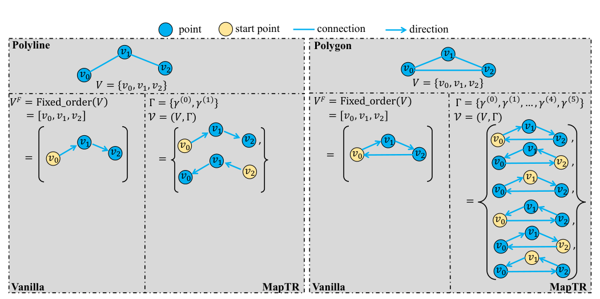
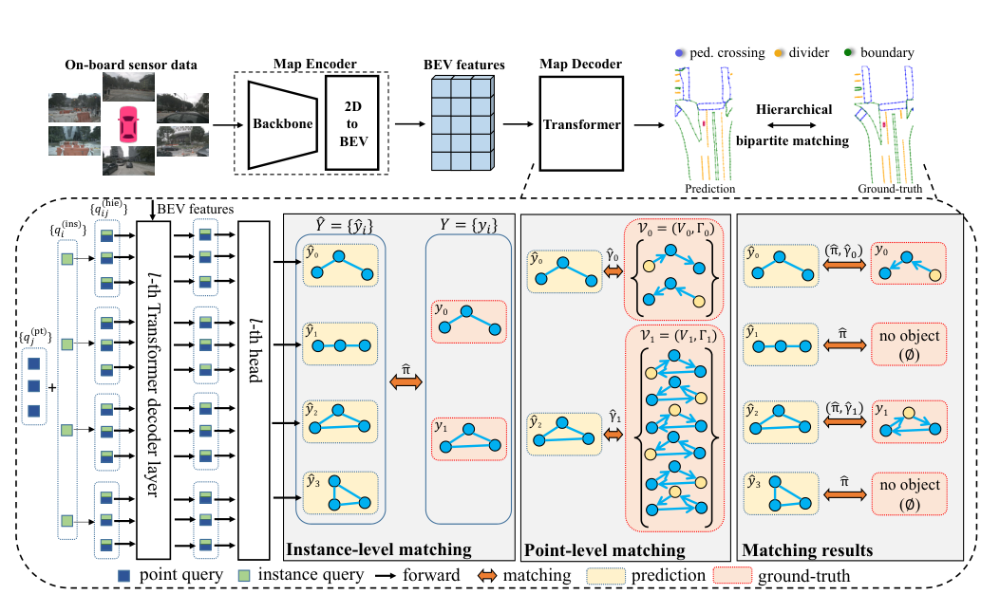
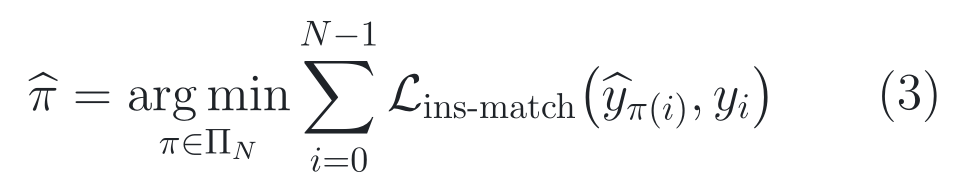
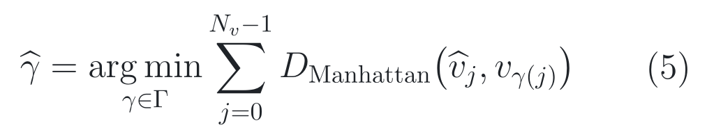
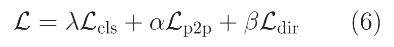
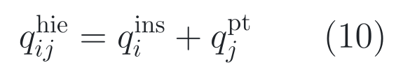
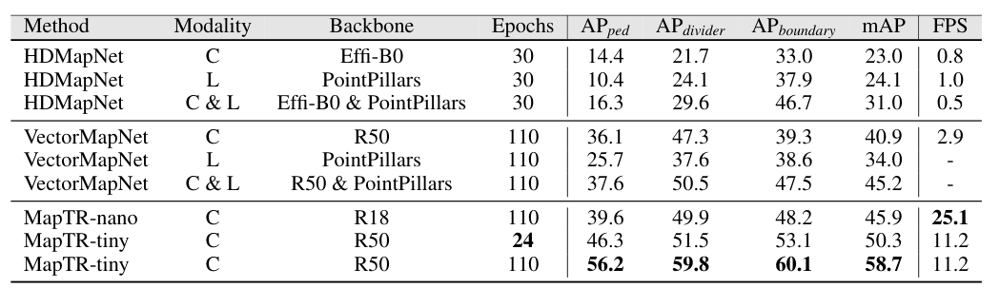
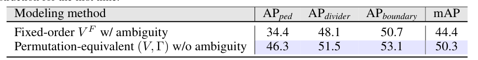

# 2026-07-29 — MapTR: Structured Modeling and Learning for Online Vectorized HD Map Construction

`ICLR 2023 Spotlight` · `Accepted` ·
`论文与附录已读 / 官方源码已审 / checkpoint、数据与数值结果未运行`

**主方向：** P07 · 道路结构、HD Map 与定位 ·
**输入模态：** Surround Camera、Vehicle State ·
**交叉标签：** Online HD Map、Vectorized Map、BEV、Transformer、
Hierarchical Matching、Permutation Equivariance、Camera Calibration、Efficient Inference

[▶ 从第一张图开始](#1-看图论文到底做了什么) ·
[返回首页](../../README.md) · [全部精读](../../index/papers.md) ·
[官方论文](https://openreview.net/pdf?id=k7p_YAO7yE) ·
[OpenReview 录用入口](https://openreview.net/forum?id=k7p_YAO7yE) ·
[官方代码 @ 固定 SHA](https://github.com/hustvl/MapTR/tree/a6872d8d9670bde17b4b01560f1221f88b443d55)

证据与行文标签：**[原文翻译]** 忠实中文译文；**[笔记解释]** 帮助理解的
通俗讲解；**[论文]** 作者材料直接支持；**[源码]** 固定 commit 直接支持；
**[判断]** 本笔记分析；**[未核验]** 尚未独立运行或确认。译文中不混入解释
或判断。

## 0. 阅读起点：术语先导与摘要完整翻译

### 0.1 首次术语解释

**术语覆盖声明：** 下列账本先锁定摘要中的核心术语；摘要之后第一次出现的新
术语仍在正文首现处解释。全文不为追求“换一种说法”而改变译名、缩写或符号。

- **高清地图（High-Definition Map, HD map）**：面向自动驾驶、精度和结构
  都高于普通导航地图的道路环境表示；本文关注在车端在线重建，而不是离线测绘。
- **在线矢量化高清地图构建（online vectorized HD map construction）**：
  从车辆当前传感器观测直接输出车道分隔线、人行横道和道路边界等带实例身份的
  点序列，而不是只输出一张像素栅格。
- **矢量地图元素（vectorized map element）**：一条折线或一个多边形实例；
  本文把它写成点集 *V* 与等价排列群 *Γ* 的组合。
- **排列等价建模（permutation-equivalent modeling）**：把“几何相同但起点
  或遍历方向不同”的点序列视为同一个形状，避免监督把任意标注顺序当成唯一答案。
- **层次查询嵌入（hierarchical query embedding）**：把实例级查询与点级查询
  相加，得到“第 *i* 个地图实例的第 *j* 个点”对应的查询。
- **层次二分图匹配（hierarchical bipartite matching）**：先匹配预测实例与
  GT 实例，再在已匹配实例内部选择点序列的最佳等价排列。
- **平均精度（Average Precision, AP）与 mean AP（mAP）**：AP 衡量一个类别
  在置信度排序下的精确率—召回率表现；本文先在三个 Chamfer 距离阈值上平均，
  再对三个地图类别平均得到 mAP。mAP 不是总体 accuracy，也不直接衡量道路拓扑。
- **MapTR**：作者提出的 Map Transformer 方法名，保留原名；它是在线矢量地图
  构建网络，不是离线地图数据库。

### 0.2 摘要完整专业中文翻译

**原文锚点：** Abstract，PDF p. 1。

<a id="abstract-a01"></a>
> **[原文翻译] Abstract · PDF p. 1 · A01**
>
> 高清地图为驾驶场景提供丰富而精确的环境信息，是自动驾驶系统进行规划的一项
> 基础且不可或缺的组成部分。我们提出 MapTR：一种用于高效在线矢量化高清地图
> 构建的结构化端到端 Transformer。我们提出统一的排列等价建模方法，即把地图
> 元素建模为一个点集以及一组等价排列；这种表示能够准确描述地图元素的形状，
> 并稳定学习过程。我们设计了层次查询嵌入方案，以灵活编码结构化地图信息，并
> 通过层次二分图匹配学习地图元素。在 nuScenes 数据集上，MapTR 仅使用相机输入，
> 就在现有矢量地图构建方法中取得最佳性能与效率。具体而言，MapTR-nano 在
> RTX 3090 上以 25.1 FPS 的实时速度运行，相比当时最先进的相机方法快 8 倍，
> 同时 mAP 高 5.0 点。即使与当时最先进的多模态方法相比，MapTR-nano 的 mAP
> 仍高 0.7 点，而 MapTR-tiny 的 mAP 高 13.5 点、推理速度快 3 倍。大量定性结果
> 表明，MapTR 在复杂且多样的驾驶场景中保持了稳定而鲁棒的地图构建质量。
> MapTR 对自动驾驶具有很高的应用价值。代码和更多演示见作者公开仓库。

**完整性声明：** 摘要只有一个实质段落；A01 已按全部句子完整、未删减翻译，
保留了 25.1 FPS、8 倍、5.0/0.7/13.5 mAP 与 3 倍等数字和比较范围。PDF 文本层
可完整抽取，无低置信 OCR 片段。

> [!TIP]
> **[笔记解释] 读完摘要再看这一句：** MapTR 最有价值的不是“又一个 BEV
> Transformer”，而是把地图形状的任意起点和方向从错误监督变成等价答案；最强
> 受控证据是替换固定顺序后 mAP 提高 5.9 点，最大边界是实验只覆盖 nuScenes
> 三类局部地图元素，且固定源码默认的多边形等价集合并不等同于论文 Eq. (2)。

**学习顺序：**
[0 摘要与术语](#0-阅读起点术语先导与摘要完整翻译) →
[1 看原图](#1-看图论文到底做了什么) →
[2 读原式](#2-读公式核心机制怎样表达) →
[3 看结果](#3-看结果证据是否支持主张) →
[4 对源码](#4-对源码公式如何落地) →
[5 记结论](#5-记结论贡献边界与开放问题)

## 1. 看图：论文到底做了什么

### 1.1 30 秒路口故事：同一条线为什么会被当成两个答案

**[笔记解释]** 想象车辆驶近一个夜间路口。人行横道是一个闭合多边形：从左上
角开始顺时针记录，或从右下角开始逆时针记录，几何形状都没有变。车道分隔线是
开放折线：从近处写到远处，或从远处写到近处，也还是同一条线。若训练标签只承认
其中一个顺序，模型即使画对几何，也会因“起点不对、方向不对”被惩罚。

MapTR 的核心主张是：先把这个监督歧义写进表示和匹配规则，再让 Transformer
并行输出一组地图实例及其点。它不是通过后处理猜测折线，而是在训练期就允许
同一几何的等价点序列竞争，选择代价最低者作为当前监督。

### 1.2 Figure 3：先看“几何相同、序列不同”



> **原图出处：** Liao et al., ICLR 2023, Figure 3，PDF p. 5。
> [官方 PDF](https://openreview.net/pdf?id=k7p_YAO7yE)。仅作学术讲解所需的
> 局部摘录，原图版权归原作者及其他权利人。

**按图阅读：**

1. 灰框上方蓝点只决定几何位置，黄色点表示被指定为“序列起点”的点；
2. Vanilla 固定一个顺序，等价几何会因为起点或方向不同而产生不同监督；
3. MapTR 为折线保留正向、反向两种排列，为多边形在论文定义中保留所有循环
   起点和两个方向；
4. 训练时不是把所有排列都回归一遍，而是在匹配阶段选出与预测最接近的那个。

**这张图没有证明：** 图示只定义了允许的目标集合，不能证明所有排列都同样容易
优化，也不能证明固定源码真的枚举了论文右侧全部方向；后者必须看数据管线。

### 1.3 Figure 4：把整条信息流读成一条纵向链



> **原图出处：** Liao et al., ICLR 2023, Figure 4，PDF p. 7。
> [官方 PDF](https://openreview.net/pdf?id=k7p_YAO7yE)。仅作学术讲解所需的
> 局部摘录，原图版权归原作者及其他权利人。

**[笔记解释]** 上半部分是推理路径：六路车载相机 → 图像 backbone →
二维到鸟瞰图（Bird’s-Eye View, BEV）变换 → BEV 特征 → Map Decoder →
地图实例类别与点坐标。下半部分主要是训练路径：实例查询与点查询相加 →
六层 decoder 逐层预测 → 先做实例级 Hungarian 匹配 → 再在每个正实例内选择
点级排列 → 把类别、点位置和边方向损失回传。

**看完应能复述：** MapTR 把“一个地图实例由多个有结构的点组成”同时写进 query、
目标表示和匹配规则，而不是只在输出后把独立点连线。

**这张图没有证明：** Figure 4 是架构图，不是模块效果证据；Map Encoder 的
GKT、ResNet 和 Deformable Attention 也不是本文原创。

### 整体算法架构与创新设计

**原方法瓶颈：** **[论文]** 作者指出两类直接瓶颈。第一，栅格 BEV 分割缺少
供预测与规划直接消费的实例级车道结构；第二，VectorMapNet 以自回归方式逐点
生成，推理慢，而把点序列改成并行回归又会遭遇折线方向与多边形起点的标注歧义。
来源：论文 §1，PDF p. 1–3；Figure 2–3 / §3.1，PDF p. 4–5。

**主干网络与基线：** **[论文/源码]** 直接对照是 VectorMapNet；MapTR 继承
DETR 式 encoder–decoder 与 Hungarian 匹配。论文默认 Map Encoder 使用 GKT
完成二维到 BEV 变换，Map Decoder 使用多头自注意力和 Deformable Attention。
固定 MapTR-tiny 配置实际为 ResNet-50 最后一阶段 → 单层 FPN（256 通道）→
一层带 Geometry Kernel Attention 的 BEVFormerEncoder → 六层 decoder →
三类实例分类头与 20 点坐标头。来源：论文 §1、§3.4，PDF p. 2–3、7–8；
[固定 SHA 配置](https://github.com/hustvl/MapTR/blob/a6872d8d9670bde17b4b01560f1221f88b443d55/projects/configs/maptr/maptr_tiny_r50_24e.py#L52-L191)。

**继承与新增边界：** **[论文/源码]** ResNet、FPN、GKT、BEVFormerEncoder、
DETR decoder、多头自注意力、Deformable Attention、Focal Loss 与 Hungarian
算法均为继承组件。本文新增或重组的是：地图元素的排列等价目标表示、实例/点
两级 query 因子化、实例后再选点排列的层次匹配，以及点到点与边方向监督。
GKT、IPM、LSS、Deformable Attention 和 Swin 只在迁移/替代实验中出现，不能
写成 MapTR 原创。来源：论文 §3.1–3.4，PDF p. 4–8；Table 4 / Appendix Table 9，
PDF p. 9、14；[固定 SHA 继承关系说明](https://github.com/hustvl/MapTR/blob/a6872d8d9670bde17b4b01560f1221f88b443d55/README.md#L153-L155)。

**端到端信息流：** **[论文/源码]** 六张 1600×900 图像在 MapTR-tiny 中缩放
为 0.5 倍并补齐到 32 的倍数；ResNet-50 与 FPN 产生单尺度 256 维特征；GKT
把它们映射到车辆坐标下 60 m × 30 m 的 BEV，固定配置为
200 × 100 × 256，即每格 0.3 m。50 个实例级 query 与 20 个共享点级 query
相加形成 1000 个层次 query；六层 decoder 每层先让 query 互相通信，再从 BEV
参考点附近取证。每个实例把 20 个点特征求均值送入三类分类头，同时每点输出
归一化二维坐标；推理端取最高的 50 个类别—实例分数并输出折线/多边形。
来源：论文 Figure 4 / §3.4 / Appendix A，PDF p. 7–8、13；
[固定 SHA 数据与 shape](https://github.com/hustvl/MapTR/blob/a6872d8d9670bde17b4b01560f1221f88b443d55/projects/configs/maptr/maptr_tiny_r50_24e.py#L12-L85)；
[固定 SHA query 与 head](https://github.com/hustvl/MapTR/blob/a6872d8d9670bde17b4b01560f1221f88b443d55/projects/mmdet3d_plugin/maptr/dense_heads/maptr_head.py#L203-L319)。

**总体训练方式：** **[论文/源码]** MapTR-tiny 单阶段训练 24 epochs，以
ImageNet ResNet-50 初始化；固定配置冻结第一阶段并让 BN 处于 eval。每个 decoder
层都独立执行匹配并接收分类、点位置与方向损失；固定权重分别为 2、5、0.005，
框 L1 与 GIoU 权重均为 0。query 的点坐标参考在层间迭代，但新参考点被
`detach`，所以下一层不会沿“参考点更新值”反传到上一层回归分支，不过每层自己的
辅助损失仍直接监督该层输出。默认 `queue_length=1` 且
`video_test_mode=False`，训练和测试都不读取上一帧预测 BEV；因此本论文默认
结果不是时序地图模型。来源：论文 §3.2–3.4 / Appendix A，PDF p. 5–8、13；
[固定 SHA 配置](https://github.com/hustvl/MapTR/blob/a6872d8d9670bde17b4b01560f1221f88b443d55/projects/configs/maptr/maptr_tiny_r50_24e.py#L50-L175)；
[层间 detach](https://github.com/hustvl/MapTR/blob/a6872d8d9670bde17b4b01560f1221f88b443d55/projects/mmdet3d_plugin/maptr/modules/decoder.py#L47-L81)；
[逐层损失](https://github.com/hustvl/MapTR/blob/a6872d8d9670bde17b4b01560f1221f88b443d55/projects/mmdet3d_plugin/maptr/dense_heads/maptr_head.py#L646-L737)。

#### 创新单元 1：Permutation-equivalent map-element target

**位置与接口：** 它位于地图标注几何与 matcher 之间，不是神经网络层；输入是
一个地图实例的折线/多边形，输出是供匹配器选择的一组等价点序列。

**输入：** **[论文/源码]** 论文输入为点集 *V* 和允许的排列群 *Γ*；源码输入为
nuScenes 地图裁剪后的 Shapely 几何、固定采样点数 20、局部车辆坐标范围与
`padding_value=-10000`。

**内部变换：** **[论文]** 折线允许正向和反向；闭合多边形在论文 Eq. (2) 中
允许每个起点配两种方向。**[源码]** 默认 `v2` 对折线生成正/反两个顺序，对
多边形只循环改变起点；若原始候选多于 19 个，还用 `np.random.choice` 抽取 19 个。

**输出：** 形状为“实例数 × 排列数 × 20 × 2”的 GT 候选张量；matcher 为每个
预测—GT 对选一个顺序。

**为什么这样设计：** **[论文] 作者明确动机：** 同一折线或多边形存在任意起点
和方向，固定唯一顺序会引入不必要的监督歧义并使训练不稳定。来源：论文 Figure 2–3 /
§3.1，PDF p. 4–5。

**训练信号：** **[论文/源码]** 该单元本身无可学习参数；它通过改变 matcher
选中的目标顺序，间接改变点位置与方向损失的监督。候选选择和 Hungarian 求解都
不传梯度，真正梯度从选中目标后的 `loss_pts`、`loss_dir` 回到 decoder、query
与图像/BEV 特征。来源：论文 §3.2–3.3，PDF p. 5–6；
[固定 SHA 目标生成](https://github.com/hustvl/MapTR/blob/a6872d8d9670bde17b4b01560f1221f88b443d55/projects/mmdet3d_plugin/datasets/nuscenes_map_dataset.py#L290-L345)。

**作用与证据：** **[论文]** Table 2 的受控消融在其余设置不变时，把固定顺序替换为排列
等价建模：mAP 从 44.4 提到 50.3（+5.9 点），人行横道 AP 从 34.4 提到 46.3
（+11.9 点）。干预条件是“固定唯一排列”对“等价排列集合”，因此它支持目标
表示整体有效，但没有把起点等价与方向等价分别拆开。来源：论文 Table 2 / §4.2，
PDF p. 8–9。

**论文位置：** **[论文]** Figure 2–3 / Eq. (1)–(2) / §3.1，PDF p. 4–5。

**源码入口：** **[源码]**
[`shift_fixed_num_sampled_points_v2` @ 固定 SHA](https://github.com/hustvl/MapTR/blob/a6872d8d9670bde17b4b01560f1221f88b443d55/projects/mmdet3d_plugin/datasets/nuscenes_map_dataset.py#L290-L345)。

#### 创新模块 2：Hierarchical query embedding

**位置与接口：** 位于 BEV encoder 与 Map Decoder 之间；它把“第几个实例”和
“实例里的第几个点”组合成 decoder 的输入 query。

**输入：** 50 个实例级 embedding 与 20 个共享点级 embedding；每个 embedding
在源码中含 256 维 query content 和 256 维 query position。

**内部变换：** 对每个实例—点组合逐元素相加，再展平为 1000 个 query；decoder
内部先做 query 间多头自注意力，再以二维参考点对 BEV 做可变形交叉注意力。

**输出：** 六层 decoder 的 1000 × 256 隐状态；每 20 个点归为一个地图实例。

**为什么这样设计：** **[论文] 作者明确动机：** 作者希望以一个可分解的结构
同时编码实例级和点级信息，使任意形状地图元素都能用统一并行 decoder 表达。
来源：论文 §3.4，PDF p. 7。

**训练信号：** **[论文/源码]** 分类头先在每个实例的 20 个点特征上求均值，
因此分类损失通过共享均值路径训练该实例全部点 query；点位置与方向损失直接
训练各点 query。点级 embedding 在 50 个实例间共享，会汇聚所有实例的梯度；
实例 embedding 在其 20 个点间共享。来源：论文 Eq. (10) / §3.4，PDF p. 7–8；
[固定 SHA query 相加与分类聚合](https://github.com/hustvl/MapTR/blob/a6872d8d9670bde17b4b01560f1221f88b443d55/projects/mmdet3d_plugin/maptr/dense_heads/maptr_head.py#L176-L188)。

**作用与证据：** **[未核验]** 原文未提供“层次 query 对平坦 1000 query”的
独立消融或受控对照，因此不能把整套系统增益单独归因给这种相加。Appendix
Table 5–7 只分别改变点数、实例数和 decoder 层数，不是 query 因子化消融。

**论文位置：** **[论文]** Figure 4 / Eq. (10) / §3.4，PDF p. 7。

**源码入口：** **[源码]**
[`instance_embedding` / `pts_embedding` @ 固定 SHA](https://github.com/hustvl/MapTR/blob/a6872d8d9670bde17b4b01560f1221f88b443d55/projects/mmdet3d_plugin/maptr/dense_heads/maptr_head.py#L176-L228)。

#### 创新单元 3：Hierarchical bipartite matching

**位置与接口：** 位于每层 decoder 的预测与损失之间；输入实例分类分数、预测
点集、GT 类别/框与全部候选点顺序，输出一对一实例分配和每个正样本的目标顺序。

**输入：** 固定配置中 50 个预测实例、每实例 20 个二维点、三个类别，以及
场景内 GT 地图实例及其候选排列。

**内部变换：** 源码先对每个预测—GT 对计算所有候选排列的有序点 L1 代价，
取最小代价及其顺序索引；再把该点代价与 Focal 分类代价相加，在 CPU 上运行
Hungarian assignment；最终用实例匹配和顺序索引抽取唯一点目标。

**输出：** 正/负实例索引、类别目标、点目标和监督 mask；未匹配 query 作为背景。

**为什么这样设计：** **[论文] 作者明确动机：** 地图学习同时具有集合级的实例
无序性与实例内部的点顺序等价性，必须按实例和点两个层级消除对应关系歧义。
来源：论文 §3.2，PDF p. 5–6。

**训练信号：** **[源码]** `torch.min` 选顺序、代价 `detach` 和 SciPy Hungarian
均阻断梯度；匹配只是离散选择。分类、点位置与方向损失对被选中的预测直接反传，
不是“匹配代价本身可微”。来源：
[固定 SHA matcher](https://github.com/hustvl/MapTR/blob/a6872d8d9670bde17b4b01560f1221f88b443d55/projects/mmdet3d_plugin/maptr/assigners/maptr_assigner.py#L148-L195)。

**作用与证据：** **[未核验]** 原文未提供“只做实例匹配、去掉点级排列选择”
的独立消融；Table 2 同时改变目标表示和可选匹配集合，整行 +5.9 mAP 不能再
单独归因给 matcher。

**论文位置：** **[论文]** Figure 4 / Eq. (3)–(5) / §3.2，PDF p. 5–6。

**源码入口：** **[源码]**
[`MapTRAssigner.assign` @ 固定 SHA](https://github.com/hustvl/MapTR/blob/a6872d8d9670bde17b4b01560f1221f88b443d55/projects/mmdet3d_plugin/maptr/assigners/maptr_assigner.py#L90-L195)。

#### 创新单元 4：Point2point loss 与 edge direction loss

**位置与接口：** 位于匹配后的监督端；点到点损失约束坐标，边方向损失约束相邻
点连成的局部方向，分类损失约束实例类别。

**输入：** matcher 选定的 20 点目标、decoder 的 20 点预测、正样本 mask 与三类
分类目标。

**内部变换：** 点坐标先归一化后计算 L1；方向分支把相邻点相减成边向量并计算
余弦方向损失；固定源码在六层 decoder 上重复这一整套监督。

**输出：** 每层的 `loss_cls`、`loss_pts`、`loss_dir`，以及权重为 0 的
`loss_bbox`、`loss_iou` 占位项。

**为什么这样设计：** **[论文] 作者明确动机：** 点到点损失只直接约束节点位置，
不足以显式表达相邻点连成的几何方向，因此作者增加边方向监督。来源：论文
§3.3 / Eq. (6)–(9)，PDF p. 6。

**训练信号：** **[论文/源码]** 类别、点位置、边方向都直接产生梯度；固定权重
为 2、5、0.005。边方向只施加在正实例的相邻点段上；匹配阶段的离散选择不接收
这些梯度。来源：
[固定 SHA loss 配置](https://github.com/hustvl/MapTR/blob/a6872d8d9670bde17b4b01560f1221f88b443d55/projects/configs/maptr/maptr_tiny_r50_24e.py#L165-L190)；
[固定 SHA loss 计算](https://github.com/hustvl/MapTR/blob/a6872d8d9670bde17b4b01560f1221f88b443d55/projects/mmdet3d_plugin/maptr/dense_heads/maptr_head.py#L565-L610)。

**作用与证据：** **[论文]** Table 3 的受控比较把方向损失权重 *β* 从 0 改为
0.005，mAP 从 48.2 提到 50.3（+2.1 点）；0.003 只有 49.1，0.01 又降到 48.3，
因此证据支持“适中方向监督有益”，不支持“权重越大越好”。来源：论文 Table 3 /
§4.2，PDF p. 9。

**论文位置：** **[论文]** Eq. (6)–(9) / §3.3，PDF p. 6。

**源码入口：** **[源码]**
[`loss_single` @ 固定 SHA](https://github.com/hustvl/MapTR/blob/a6872d8d9670bde17b4b01560f1221f88b443d55/projects/mmdet3d_plugin/maptr/dense_heads/maptr_head.py#L487-L610)。

## 2. 读公式：核心机制怎样表达

### 原文公式 1：先给预测实例安排 GT 身份

**原文公式：** 论文 Eq. (3)，PDF p. 5。

<p align="center"><picture><source media="(prefers-color-scheme: dark)" srcset="../../assets/notes/2026-07-29-maptr/formulas/eq-03-instance-matching-dark.png"></picture></p>

> **公式来源：** Liao et al., ICLR 2023, Eq. (3)，PDF p. 5；
> 本图按原符号重排。[官方 PDF](https://openreview.net/pdf?id=k7p_YAO7yE) ·
> [可复制 TeX](../../assets/notes/2026-07-29-maptr/formulas/source.tex#L5-L14)。

**符号说明**

- *N*：固定预测实例槽数量，设得大于一帧中常见地图元素数量；
- *Π*<sub>*N*</sub>：*N* 个槽位的所有排列；
- *ŷ*<sub>*π(i)*</sub>：排列 *π* 后与第 *i* 个 GT 比较的预测实例；
- *L*<sub>ins-match</sub>：包含类别与位置信息的成对实例匹配代价。

**纯文字读法：** 在所有“预测槽位怎样对应 GT 槽位”的排列中，找出总实例匹配
代价最小的一个排列。

**玩具例子：** **[笔记解释]** 假设有三个预测槽 A、B、C，两个 GT 是人行横道
和道路边界，第三个 GT 槽补成“无对象”。如果 A→人行横道、C→道路边界、B→无对象
的总代价为 1.2，而交换 A/C 后为 4.8，就选择前者。这个数字是教学示例，不是论文实验。

**专业解释：** 这一步消除“实例集合无序”问题，但尚未决定一个已匹配实例内部
应该用哪个起点和方向；内部顺序由下一条公式处理。

**回到上面的图：** Figure 4 下半部分蓝框 “Instance-level matching”。

**落到源码：** [`linear_sum_assignment` 前的总代价 @ 固定 SHA](https://github.com/hustvl/MapTR/blob/a6872d8d9670bde17b4b01560f1221f88b443d55/projects/mmdet3d_plugin/maptr/assigners/maptr_assigner.py#L148-L195)

**公式省略了什么：** 固定配置把 bbox L1 与 IoU 匹配权重设为 0，实际总成本
主要是权重 2 的分类代价与权重 5 的有序点 L1 代价；源码还会先在每个预测—GT
对的排列维度取最小值，再把该最小点代价送进 Hungarian。

### 原文公式 2：在一个实例内部挑最佳点顺序

**原文公式：** 论文 Eq. (5)，PDF p. 6。

<p align="center"><picture><source media="(prefers-color-scheme: dark)" srcset="../../assets/notes/2026-07-29-maptr/formulas/eq-05-point-matching-dark.png"></picture></p>

> **公式来源：** Liao et al., ICLR 2023, Eq. (5)，PDF p. 6；
> 本图按原符号重排。[官方 PDF](https://openreview.net/pdf?id=k7p_YAO7yE) ·
> [可复制 TeX](../../assets/notes/2026-07-29-maptr/formulas/source.tex#L16-L25)。

**符号说明**

- *Γ*：当前 GT 地图元素允许的等价排列集合；
- *N*<sub>*v*</sub>：每个地图元素的点数，MapTR-tiny 固定为 20；
- *v̂*<sub>*j*</sub>：第 *j* 个预测点；
- *v*<sub>*γ(j)*</sub>：排列 *γ* 下与它对应的 GT 点；
- *D*<sub>Manhattan</sub>：二维坐标逐轴绝对差之和。

**纯文字读法：** 把每个允许的 GT 点顺序都与预测比较，选择 20 个点曼哈顿距离
总和最小的那个顺序。

**玩具例子：** **[笔记解释]** 一条两端可交换的三点折线，预测顺序是
右—中—左。若 GT 正向左—中—右的总距离为 8，而反向右—中—左为 0，就选择
反向作为监督；模型不应因为几何正确但书写方向相反而被罚 8。数字仅用于教学。

**专业解释：** 这使监督目标依赖当前预测，是一种离散的 best-of-equivalent-target
选择。它解决标签顺序歧义，却也意味着目标切换可能让损失面不连续；论文 Figure 5
只展示整体收敛更稳定，没有报告目标切换频率。

**回到上面的图：** Figure 4 的红色候选排列列与 “Point-level matching”。

**落到源码：** [`pts_cost_ordered` / `order_index` @ 固定 SHA](https://github.com/hustvl/MapTR/blob/a6872d8d9670bde17b4b01560f1221f88b443d55/projects/mmdet3d_plugin/maptr/assigners/maptr_assigner.py#L158-L175)

**公式省略了什么：** 源码会把坐标按 30 m × 60 m 范围归一化；若预测/GT 点数
不同还会线性插值。固定默认 `v2` 没有实现论文 Eq. (2) 的反向多边形候选，因此
实际最小化的集合可能小于论文定义。

### 原文公式 3：三类训练信号怎样合成

**原文公式：** 论文 Eq. (6)，PDF p. 6。

<p align="center"><picture><source media="(prefers-color-scheme: dark)" srcset="../../assets/notes/2026-07-29-maptr/formulas/eq-06-training-objective-dark.png"></picture></p>

> **公式来源：** Liao et al., ICLR 2023, Eq. (6)，PDF p. 6；
> 本图按原符号重排。[官方 PDF](https://openreview.net/pdf?id=k7p_YAO7yE) ·
> [可复制 TeX](../../assets/notes/2026-07-29-maptr/formulas/source.tex#L27-L33)。

**符号说明**

- *L*<sub>cls</sub>：地图实例分类 Focal Loss；
- *L*<sub>p2p</sub>：匹配后逐点的 L1 位置损失；
- *L*<sub>dir</sub>：相邻边向量的余弦方向损失；
- *λ*、*α*、*β*：三项权重；论文/配置取 2、5、0.005。

**纯文字读法：** 总损失等于分类损失乘 2，加点位置损失乘 5，再加边方向损失乘
0.005。

**玩具例子：** **[笔记解释]** 若三项未经加权的损失分别为 0.4、0.1、2，
加权后是 0.8、0.5、0.01，总计 1.31。它说明小 *β* 不等于方向分支没有作用；
各损失的数值尺度不同。该例不是论文记录。

**专业解释：** 类别与点位置承担主要监督，方向项提供局部几何正则。Table 3 的
非单调结果说明 *β* 需要调节：0.005 最好，但 0.01 几乎退回无方向损失水平。

**回到上面的图：** Figure 4 的第 *l* 层 head 在完成两级匹配后接收这些损失。

**落到源码：** [固定权重与 loss 类型 @ 固定 SHA](https://github.com/hustvl/MapTR/blob/a6872d8d9670bde17b4b01560f1221f88b443d55/projects/configs/maptr/maptr_tiny_r50_24e.py#L165-L190)

**公式省略了什么：** 固定实现对六个 decoder 层全部施加同名辅助损失；论文
Eq. (6) 没把逐层求和、分布式正样本归一化、NaN 清理和点坐标归一化写入式子。

### 原文公式 4：一个 query 怎样同时知道实例与点身份

**原文公式：** 论文 Eq. (10)，PDF p. 7。

<p align="center"><picture><source media="(prefers-color-scheme: dark)" srcset="../../assets/notes/2026-07-29-maptr/formulas/eq-10-hierarchical-query-dark.png"></picture></p>

> **公式来源：** Liao et al., ICLR 2023, Eq. (10)，PDF p. 7；
> 本图按原符号重排。[官方 PDF](https://openreview.net/pdf?id=k7p_YAO7yE) ·
> [可复制 TeX](../../assets/notes/2026-07-29-maptr/formulas/source.tex#L35-L39)。

**符号说明**

- *q*<sup>ins</sup><sub>*i*</sub>：第 *i* 个地图实例的查询；
- *q*<sup>pt</sup><sub>*j*</sub>：所有实例共享的第 *j* 个点位查询；
- *q*<sup>hie</sup><sub>*ij*</sub>：送入 decoder 的层次查询。

**纯文字读法：** “第 *i* 个实例的第 *j* 个点”由实例身份向量与点位身份向量
逐元素相加得到。

**玩具例子：** **[笔记解释]** 两个实例 query 加三个点 query，会得到六个组合；
点 1 query 在两个实例间共享“这是第一个点”的角色，实例 A query 则在三个点间
共享“都属于实例 A”的角色。这个组合计数是教学示例。

**专业解释：** 这是参数因子化：无需为 50 × 20 个组合各学完全独立的位置
embedding，同时保留实例级与点级结构先验。但加法会把两个身份压进同一向量空间，
论文没有与拼接、独立 query 或分组 attention 做受控比较。

**回到上面的图：** Figure 4 左下角蓝色 point query 与绿色 instance query 的加号。

**落到源码：** [`pts_embeds + instance_embeds` @ 固定 SHA](https://github.com/hustvl/MapTR/blob/a6872d8d9670bde17b4b01560f1221f88b443d55/projects/mmdet3d_plugin/maptr/dense_heads/maptr_head.py#L223-L228)

**公式省略了什么：** 源码为两类 embedding 各存 512 维，其中一半作为 query
position、一半作为 query content；固定配置中的 `num_query=900` 最终被
50 × 20 = 1000 的重算值覆盖，真实 query 数是 1000。

## 3. 看结果：证据是否支持主张

### 3.1 原文公开的实验配置

**原文锚点：** 主论文 §4 Experiments，PDF p. 8–9；Appendix A–B，
PDF p. 13–15；固定 SHA 配置、安装和运行文档。

- **数据集、版本与划分。** **[论文]** nuScenes 含 1000 个约 20 秒场景，关键帧
  以 2 Hz 标注；论文在 val set 评测，但未逐项列出 train/val/test 场景数。
  **[源码]** 数据准备命令指定 nuScenes `v1.0`，生成
  `nuscenes_infos_temporal_train.pkl` 与 `..._val.pkl`；训练/验证读取这两个
  文件。来源：论文 §4，PDF p. 8；
  [固定 SHA 数据准备](https://github.com/hustvl/MapTR/blob/a6872d8d9670bde17b4b01560f1221f88b443d55/docs/prepare_dataset.md#L3-L42)。
- **类别与空间范围。** **[论文/源码]** 公平跟随前作，只评人行横道、车道分隔线、
  道路边界三类；车辆坐标中横向 *X* 为 −15 至 15 m，纵向 *Y* 为 −30 至 30 m。
  这不是完整 HD map 语义，也不含车道拓扑、交通灯或中心线。来源：论文 §4，
  PDF p. 8；[固定 SHA 类别与范围](https://github.com/hustvl/MapTR/blob/a6872d8d9670bde17b4b01560f1221f88b443d55/projects/configs/maptr/maptr_tiny_r50_24e.py#L12-L32)。
- **传感器、输入与预处理。** **[论文]** 每个样本含六路 RGB 相机，覆盖 360°
  水平视场，原始分辨率 1600×900；MapTR-tiny 缩放比例 0.5，并使用 color jitter。
  **[源码]** 还执行 `PhotoMetricDistortionMultiViewImage`、归一化、补齐到 32
  的倍数，以及概率 0.7 的 GridMask；这些额外增强没有在论文 Appendix A 逐项公开。
  来源：论文 §4 / Appendix A，PDF p. 8、13；
  [固定 SHA pipeline](https://github.com/hustvl/MapTR/blob/a6872d8d9670bde17b4b01560f1221f88b443d55/projects/configs/maptr/maptr_tiny_r50_24e.py#L198-L228)；
  [GridMask](https://github.com/hustvl/MapTR/blob/a6872d8d9670bde17b4b01560f1221f88b443d55/projects/mmdet3d_plugin/maptr/detectors/maptr.py#L46-L107)。
- **校准与车辆状态。** **[源码]** 相机内外参用于从相机到 BEV 的几何采样；
  metadata 还携带 CAN bus 向量。`queue_length=1` 时训练数据会把位置和最后一个
  航向角清零，但 Transformer 仍对完整 CAN bus 向量过 MLP；因此“论文表中 C
  代表相机模态”与“代码完全不使用车辆状态”不是同一陈述。来源：
  [固定 SHA metadata](https://github.com/hustvl/MapTR/blob/a6872d8d9670bde17b4b01560f1221f88b443d55/projects/mmdet3d_plugin/datasets/nuscenes_map_dataset.py#L1047-L1077)；
  [CAN bus embedding](https://github.com/hustvl/MapTR/blob/a6872d8d9670bde17b4b01560f1221f88b443d55/projects/mmdet3d_plugin/maptr/modules/transformer.py#L133-L173)。
- **硬件、软件与关键依赖。** **[论文]** 训练用 8 张 RTX 3090，FPS 也在 RTX 3090
  测量。**[源码]** 安装文档固定 Python 3.8、PyTorch 1.9.1 + CUDA 11.1、
  torchvision 0.10.1、mmcv-full 1.4.0、mmdet 2.14.0、mmseg 0.14.1，并需编译
  Geometry Kernel Attention 自定义算子。来源：论文 §4 / Table 1，PDF p. 8–9；
  [固定 SHA 安装文档](https://github.com/hustvl/MapTR/blob/a6872d8d9670bde17b4b01560f1221f88b443d55/docs/install.md#L7-L60)。
- **初始化或预训练权重。** **[源码]** MapTR-tiny 从公开
  `resnet50-19c8e357.pth` 初始化，冻结 ResNet 第一阶段，并固定 BN 统计；
  论文没有说明这些冻结细节。来源：
  [固定 SHA backbone 配置](https://github.com/hustvl/MapTR/blob/a6872d8d9670bde17b4b01560f1221f88b443d55/projects/configs/maptr/maptr_tiny_r50_24e.py#L52-L73)；
  [权重下载](https://github.com/hustvl/MapTR/blob/a6872d8d9670bde17b4b01560f1221f88b443d55/docs/install.md#L63-L70)。
- **优化器、学习率与 scheduler。** **[论文/源码]** AdamW，基础学习率
  0.0006，backbone 倍率 0.1，cosine annealing；源码补充 weight decay 0.01、
  500 iterations 线性 warmup、最小学习率比例 0.001、梯度范数裁剪 35。
  来源：论文 §4 / Appendix A，PDF p. 8、13；
  [固定 SHA optimizer](https://github.com/hustvl/MapTR/blob/a6872d8d9670bde17b4b01560f1221f88b443d55/projects/configs/maptr/maptr_tiny_r50_24e.py#L279-L301)。
- **batch size、训练轮数与精度。** **[论文/源码]** 总 batch size 32、24 epochs；
  源码每 GPU 4 样本、8 GPU 正好为 32，启用 FP16 固定 loss scale 512。所有主文
  消融基于 24-epoch MapTR-tiny。来源：论文 §4 / Appendix A，PDF p. 8、13；
  [固定 SHA batch 与 FP16](https://github.com/hustvl/MapTR/blob/a6872d8d9670bde17b4b01560f1221f88b443d55/projects/configs/maptr/maptr_tiny_r50_24e.py#L231-L310)。
- **随机种子、重复次数与模型选择。** **[源码]** `tools/train.py` 默认 seed 0，
  只有显式传 `--deterministic` 才设置确定性选项。**[未核验]** 论文未公开重复
  次数、方差或显著性检验；配置每 2 epochs 验证、每 epoch 存 checkpoint，但未
  公布论文表格采用 last/best/EMA 哪一种选模标准。来源：
  [固定 SHA seed](https://github.com/hustvl/MapTR/blob/a6872d8d9670bde17b4b01560f1221f88b443d55/tools/train.py#L33-L59)；
  [固定 SHA 验证与存档](https://github.com/hustvl/MapTR/blob/a6872d8d9670bde17b4b01560f1221f88b443d55/projects/configs/maptr/maptr_tiny_r50_24e.py#L296-L310)。
- **推理、阈值与后处理。** **[源码]** 默认无跨帧状态，无 test-time flip；
  最后一层 50 个实例 × 3 类的 sigmoid 分数展平后取 top 50，`score_threshold`
  为 None，不做 NMS，再按输出范围过滤。来源：
  [固定 SHA coder 配置](https://github.com/hustvl/MapTR/blob/a6872d8d9670bde17b4b01560f1221f88b443d55/projects/configs/maptr/maptr_tiny_r50_24e.py#L151-L158)；
  [固定 SHA decode](https://github.com/hustvl/MapTR/blob/a6872d8d9670bde17b4b01560f1221f88b443d55/projects/mmdet3d_plugin/core/bbox/coders/nms_free_coder.py#L195-L261)。
- **指标与公平设置。** **[论文]** 用 Chamfer 距离阈值 0.5、1.0、1.5 判定匹配，
  三个阈值的 AP 平均，再对三类平均为 mAP。Table 1 的其他方法 AP 取自
  VectorMapNet 论文；VectorMapNet-C 的 FPS 由其作者在 RTX 3090 测量，其余 FPS
  在同一台 RTX 3090 上测。训练轮数、backbone 和模态并未全部对齐，不能把每行
  差异解释成单一模块因果。来源：论文 §4 / Table 1，PDF p. 8–9。
- **checkpoint 与最短入口。** **[源码]** README 提供 MapTR-tiny R50 24e
  checkpoint 与 log，训练命令为
  `./tools/dist_train.sh ./projects/configs/maptr/maptr_tiny_r50_24e.py 8`，
  评测命令需再给 checkpoint。**[未核验]** 本仓库未下载权重、未准备 nuScenes、
  未编译 CUDA 算子、未运行任何数值复现。来源：
  [固定 SHA checkpoint 行](https://github.com/hustvl/MapTR/blob/a6872d8d9670bde17b4b01560f1221f88b443d55/README.md#L63-L78)；
  [固定 SHA 运行命令](https://github.com/hustvl/MapTR/blob/a6872d8d9670bde17b4b01560f1221f88b443d55/docs/train_eval.md#L5-L15)。

### 3.2 原文公开的实验流程

**原文锚点：** 主论文 §3–4，PDF p. 4–9；Appendix A–B，PDF p. 13–15；
固定 SHA 数据、训练、推理与评测入口。

1. **数据准备：** **[论文/源码]** 下载 nuScenes v1.0 full 与 CAN bus expansion，
   运行作者转换脚本生成 train/val temporal info；每帧从本车附近 30 m × 60 m
   范围裁出三类地图几何，按 20 点重采样并生成可选顺序。来源：论文 §4 /
   Appendix A，PDF p. 8、13；[固定 SHA 准备命令](https://github.com/hustvl/MapTR/blob/a6872d8d9670bde17b4b01560f1221f88b443d55/docs/prepare_dataset.md#L3-L42)。
2. **训练阶段：** **[论文/源码]** 六路图像经缩放、颜色扰动、GridMask、归一化
   和 padding；R50/FPN/GKT 生成 BEV；50 × 20 层次 query 经六层 decoder 逐层
   预测。每层先为每个预测—GT 对选择最低点顺序，再做 Hungarian 实例分配，随后
   计算分类、点位置与边方向损失。24 epochs、8 GPU、总 batch 32。来源：
   [固定 SHA 训练调用](https://github.com/hustvl/MapTR/blob/a6872d8d9670bde17b4b01560f1221f88b443d55/projects/mmdet3d_plugin/maptr/detectors/maptr.py#L226-L285)；
   [固定 SHA matcher/loss](https://github.com/hustvl/MapTR/blob/a6872d8d9670bde17b4b01560f1221f88b443d55/projects/mmdet3d_plugin/maptr/dense_heads/maptr_head.py#L349-L430)。
3. **验证与选模：** **[源码]** 每 2 epochs 在 val 上按 Chamfer metric 评估，
   每 epoch 保存 checkpoint。**[未核验]** 原文未公开最终选用哪个 checkpoint、
   是否以 mAP 选模、是否重复训练或报告均值/方差。
4. **推理与后处理：** **[源码]** 单帧六相机输入走相同 encoder/decoder，只取
   最后一层；按 top 50 分数和空间范围过滤，直接输出类别、分数与 20 点坐标，
   不做 NMS，也不使用上一帧 BEV。来源：
   [固定 SHA 推理调用链](https://github.com/hustvl/MapTR/blob/a6872d8d9670bde17b4b01560f1221f88b443d55/projects/mmdet3d_plugin/maptr/detectors/maptr.py#L287-L375)。
5. **最终评测：** **[源码]** 把预测写成 `nuscmap_results.json`，按类别以
   Chamfer 阈值 0.5、1.0、1.5 计算 AP，并对阈值和类别求平均。来源：
   [固定 SHA evaluator](https://github.com/hustvl/MapTR/blob/a6872d8d9670bde17b4b01560f1221f88b443d55/projects/mmdet3d_plugin/datasets/nuscenes_map_dataset.py#L1367-L1428)。

**复现仍缺什么：** **[未核验]** nuScenes 数据与许可访问、约 10–15 GB 级别
显存/多卡条件、旧版 CUDA/OpenMMLab 兼容环境、作者 checkpoint 下载完整性、
预处理生成物哈希和一次端到端数值对齐都未在本阅读仓库独立确认。

### 3.3 核心结果：先读主表，再读能归因的消融



> **原图出处：** Liao et al., ICLR 2023, Table 1，PDF p. 9。
> [官方 PDF](https://openreview.net/pdf?id=k7p_YAO7yE)。仅作学术讲解所需的
> 局部摘录，原图版权归原作者及其他权利人。

**公平对照先读清：**

- MapTR-nano 对 VectorMapNet-C 都是相机输入与 110 epochs，但 backbone 分别是
  R18 与 R50；nano 的 45.9 mAP 比 40.9 高 5.0 绝对点，约为 12.2% 相对提升；
  25.1 FPS 对 2.9 FPS 是约 8.7 倍。
- MapTR-tiny 110e 的 58.7 mAP 比 VectorMapNet-C 40.9 高 17.8 点；但更大的模型
  和方法整体同时改变，不能把 17.8 点单独归给排列等价建模。
- 摘要所说“比多模态方法高 13.5 mAP”对应 MapTR-tiny 58.7 对
  VectorMapNet Camera+LiDAR 45.2；它支持相机版 MapTR 的总体优势，不代表
  LiDAR 没有价值。Table 10 中同一 MapTR 框架加入 LiDAR 又从 50.3 提到 62.5。
- 固定 SHA README 把 paper results 与 repo results 分开：公开 24e checkpoint
  报 50.0 mAP / 15.1 FPS，而论文表是 50.3 / 11.2；110e 为 59.3 / 15.1，
  而论文表是 58.7 / 11.2。**[判断]** 这说明公开仓库结果不能无条件当成论文
  表格的逐字复现，具体差异来源需运行日志与配置追踪。



> **原图出处：** Liao et al., ICLR 2023, Table 2，PDF p. 9。
> [官方 PDF](https://openreview.net/pdf?id=k7p_YAO7yE)。仅作学术讲解所需的
> 局部摘录，原图版权归原作者及其他权利人。

**模块级主效应：**

- 固定顺序 44.4 mAP → 排列等价 50.3，+5.9 绝对点，约 +13.3% 相对；
- 人行横道 34.4 → 46.3，+11.9 点，约 +34.6% 相对，是最强增益；
- 分隔线 48.1 → 51.5，+3.4 点；道路边界 50.7 → 53.1，+2.4 点。

**[论文]** 这个类别分布与瓶颈一致：闭合人行横道有更多起点/方向歧义，增益最大。
但 Table 2 只比较整个目标建模方案，没有单独拆出“仅起点等价”“仅方向等价”
或“候选数量控制”，所以不能断言 11.9 点全部来自某一种排列。

### 3.4 其余决定边界的结果

- **边方向损失：** Table 3 中 *β*=0 时 48.2 mAP，*β*=0.005 时 50.3，
  +2.1 点；*β*=0.01 时仅 48.3。证据支持适中边监督，不支持单调收益。
- **2D-to-BEV 替代：** Table 4 的 IPM/LSS/Deformable Attention/GKT 为
  46.2/49.5/49.7/50.3 mAP，FPS 为 11.7/10.0/11.2/11.2。GKT 相对
  Deformable Attention 只高 0.6 点且速度相同；“兼容多种 encoder”比
  “GKT 是绝对关键创新”更符合证据。
- **容量与效率：** Appendix Table 5 的点数 10/20/40 对应 48.0/50.3/50.0 mAP；
  20 点是折中而非越多越好。Table 7 的 decoder 层数 1/2/3/6/8 对应
  29.1/42.4/44.0/50.3/47.6，8 层反而下降。
- **标定噪声：** Appendix Table 11 中平移噪声标准差 0.1 m 时 mAP 49.0，
  比无噪声 50.3 低 1.3；0.5 m 时降至 34.0。Table 12 中旋转噪声标准差
  0.02 rad 时降至 42.0，损失 8.3 点；所以作者正文的“仍保持 comparable”
  不应被扩写为对大标定漂移安全。
- **统计边界：** 全文没有随机种子重复、误差条或置信区间；0.6–2.1 点的小组件
  差异是否稳定，不能由单次表格独立判断。

### 3.5 证据支持什么

- **[论文]** 在 nuScenes 三类局部矢量地图评测上，MapTR 的总体速度—精度折中
  显著优于表中 HDMapNet/VectorMapNet。
- **[论文]** 固定顺序换成排列等价目标带来 5.9 mAP，且歧义最多的人行横道
  增益最大；这是论文最可信的模块级因果证据。
- **[论文]** 中等边方向权重、20 点、50 实例和六层 decoder 是受控实验支持的
  有效配置区间。

### 3.6 证据没有支持什么

- **[判断]** mAP 不是完整道路拓扑正确率；一条点集很接近但连接关系错误的地图，
  仍可能在 Chamfer 阈值下得分较高。
- **[判断]** 晴天/雨天/夜间可视化不是按天气分组的定量鲁棒性证据。
- **[未核验]** 论文没有跨城市、跨数据集、地图变更、道路施工或长期在线更新实验。
- **[未核验]** 没有闭环预测/规划结果证明更高矢量地图 mAP 必然改善驾驶安全。
- **[未核验]** 本阅读没有运行 checkpoint，所有论文—源码差异均为静态审计，
  不把未追踪的差异定性为数值 bug。

## 4. 对源码：公式如何落地

```text
six surround-camera images + calibration/meta
→ MapTR.extract_img_feat
→ ResNet-50 + one-level FPN
→ MapTRPerceptionTransformer.get_bev_features
→ 200 × 100 × 256 BEV
→ instance_embedding + pts_embedding
→ six-layer MapTRDecoder
→ class scores + 50 × 20 points
→ training: MapTRAssigner → per-layer losses
→ test: MapTRNMSFreeCoder → top-50 vectors → Chamfer AP
```

### 1. GT 等价顺序：`shift_fixed_num_sampled_points_v2`

- **论文对应：** Figure 3 / Eq. (1)–(2) 的折线正反向与多边形循环起点/双向排列。
- **源码行为：** 折线重采样后生成正向和反向；多边形按原方向循环起点，但
  `v2` 没有生成反向循环。候选多于 19 时随机无放回抽 19 个，少于 19 则用
  −10000 padding。
- **需要留意：** 论文 Eq. (2) 的 2 × *N*<sub>*v*</sub> 双向多边形集合与
  默认源码 `v2` 不同；`v3` 才有反向循环分支。随机抽取也使实际候选集合随
  采样变化，虽然训练 CLI 默认 seed 0，论文未报告这个细节。
- [打开固定 SHA 源码](https://github.com/hustvl/MapTR/blob/a6872d8d9670bde17b4b01560f1221f88b443d55/projects/mmdet3d_plugin/datasets/nuscenes_map_dataset.py#L290-L380)

### 2. 图像到 BEV：`extract_img_feat` / `attn_bev_encode`

- **论文对应：** §3.4 Map Encoder；R50/FPN 提特征，GKT 把六相机特征投到统一 BEV。
- **源码行为：** 六相机先合并 batch 维过 backbone/FPN，再恢复为
  batch × camera × channel × height × width；BEV encoder 加相机/层 embedding、
  几何参考点与 CAN bus embedding，并调用一层 Geometry Kernel Attention。
- **需要留意：** 默认配置虽含 `TemporalSelfAttention`，但 `queue_length=1`
  且推理关闭 video state；`prev_bev=None` 时 encoder 只构造重复的当前参考点，
  不读取前帧预测。这是“复用时序架构代码”，不是论文默认结果含历史。
- [打开固定 SHA 源码](https://github.com/hustvl/MapTR/blob/a6872d8d9670bde17b4b01560f1221f88b443d55/projects/mmdet3d_plugin/maptr/modules/transformer.py#L119-L210)

### 3. 层次 query 与参考点：`MapTRHead.forward` / `MapTRDecoder.forward`

- **论文对应：** Eq. (10) 的实例 query 加点 query，以及每点预测二维参考点。
- **源码行为：** 50 × 20 相加并展平为 1000 query；每层对点特征做坐标回归，
  对 20 点特征求均值做实例分类。参考点经回归更新后在层间 `detach`，六层输出
  全部保留用于辅助监督。
- **需要留意：** 配置文件的 `num_query=900` 是遗留值；head 随后用
  `num_vec * num_pts_per_vec` 重设为 1000。论文没有公开 reference update 的
  detach，也没有 query 因子化独立消融。
- [打开固定 SHA 源码](https://github.com/hustvl/MapTR/blob/a6872d8d9670bde17b4b01560f1221f88b443d55/projects/mmdet3d_plugin/maptr/dense_heads/maptr_head.py#L115-L188)

### 4. 两级匹配与真实梯度：`MapTRAssigner.assign` / `loss_single`

- **论文对应：** Eq. (3)–(9) 的实例匹配、点顺序选择与三项损失。
- **源码行为：** 每层分别计算“预测—GT—排列”点 L1，先沿排列维取最小，再与
  分类成本相加做 CPU Hungarian；选定目标后计算 Focal、点 L1 和相邻边余弦损失。
- **需要留意：** Hungarian 与顺序索引是离散且 detach 的；损失不直接训练
  “选择器”。源码方向分支用相邻差分，不显式执行论文 Eq. (9) 的 modulo 回环；
  闭合多边形 GT 通过首尾重合的采样序列表示，开放折线则没有人为闭合边。
- [打开固定 SHA 源码](https://github.com/hustvl/MapTR/blob/a6872d8d9670bde17b4b01560f1221f88b443d55/projects/mmdet3d_plugin/maptr/assigners/maptr_assigner.py#L148-L195)

### 5. 无 NMS 输出与评测状态：`MapTRNMSFreeCoder` / `evaluate`

- **论文对应：** 单次并行预测固定大小实例集合，并以 Chamfer AP 评测。
- **源码行为：** 只取最后 decoder 层，50 × 3 类分数展平取 top 50，无分数阈值、
  无 NMS；结果写 JSON 后，以 0.5/1.0/1.5 三个 Chamfer 阈值计算 AP。
- **需要留意：** 默认没有 prediction-relevant 时序状态。`prev_frame_info`
  结构虽存在，但 `video_test_mode=False` 每帧清空 `prev_bev`。另有
  `map_ann_file` 与格式化 JSON，它们是 evaluation-only state，只影响评测缓存，
  不进入模型预测。
- [打开固定 SHA 源码](https://github.com/hustvl/MapTR/blob/a6872d8d9670bde17b4b01560f1221f88b443d55/projects/mmdet3d_plugin/core/bbox/coders/nms_free_coder.py#L195-L282)

<details>
<summary><strong>展开完整源码审计、环境和复现风险</strong></summary>

- **官方身份：** 作者论文与 OpenReview PDF 都指向 `hustvl/MapTR`；固定提交为
  `a6872d8d9670bde17b4b01560f1221f88b443d55`。
- **许可证：** 根仓库为 MIT；内嵌 `mmdetection3d/` 另带 Apache-2.0。复用或
  分发时应同时保留对应通知，不能只看根 LICENSE。
- **prediction-relevant state：** 默认无跨帧状态；开启 temporal 配置后才会
  读写 `prev_bev`、scene token、位置与航向。
- **evaluation-only state：** GT map JSON、预测 JSON、阈值循环与 AP 汇总；
  它们不反馈给模型。
- **in-place / 随机行为：** 图像 GridMask、光度扰动与多边形候选抽样含随机性；
  CLI 默认 seed 0，但 deterministic flag 默认关闭。
- **训练与测试差异：** 训练六层都匹配和受监督；测试只解码最后一层。训练
  `union2one` 把首帧位置/最后航向清零；测试函数也在无历史时清零相同字段。
- **论文—源码差异 1：** 论文多边形等价集合含双向；固定默认 `v2` 只循环单向。
- **论文—源码差异 2：** 论文只公开 color jitter；配置另含 GridMask 和完整
  photo distortion pipeline。
- **论文—源码差异 3：** 论文没有写六层辅助监督、层间参考点 detach、BN 固定
  与 warmup/grad clip；源码补足这些执行细节。
- **论文—公开 checkpoint 差异：** 固定 README 的 repo mAP/FPS 与论文表略有
  不同，不能把下载 checkpoint 结果预设为论文数字。
- **环境债务：** Python 3.8、Torch 1.9.1/CUDA 11.1、mmcv-full 1.4.0 与自定义
  CUDA 算子属于旧栈；现代 GPU/驱动可能需要容器或补丁。
- **checkpoint / 数据：** 作者公开了 Google Drive checkpoint 与日志；本阅读
  未下载、未校验哈希，nuScenes 也未准备。
- **最短复现命令：** `./tools/dist_test_map.sh ./projects/configs/maptr/maptr_tiny_r50_24e.py ./path/to/ckpts.pth 8`。
- **复现状态：** `Audited` 仅表示固定 SHA 静态源码已读；不表示训练、推理、
  benchmark 或论文数值已复现。

</details>

## 5. 记结论：贡献、边界与开放问题

### 5.1 原文结论完整翻译

**原文锚点：** `5 Conclusion`，PDF p. 9。

<a id="conclusion-c01"></a>
> **[原文翻译] Conclusion · `5 Conclusion` / PDF p. 9 · C01**
>
> MapTR 是一个用于高效在线矢量化高清地图构建的结构化端到端框架。它采用简洁的
> encoder–decoder Transformer 架构，并基于所提出的排列等价建模，通过层次
> 二分图匹配来学习地图元素。大量实验表明，所提出的方法能够在具有挑战性的
> nuScenes 数据集上精确感知任意形状的地图元素。我们希望 MapTR 能够作为自动
> 驾驶系统的基础模块，并推动下游任务（例如运动预测与规划）的发展。

**完整性声明：** 原文 Conclusion 只有一个实质段落；C01 已完整、未删减翻译。
“任意形状”保留作者原始主张强度，但本笔记的证据分析将其限制在论文实际评测的
三类、局部范围和 nuScenes 域内。

### 5.2 原文局限与展望完整翻译

**原文锚点：** 已检查 `5 Conclusion` 与 Appendix A–C，PDF p. 9、13–18。

**原文缺失声明：** 论文没有独立 Limitations 或 Discussion
章节，也没有作者明确列举的局限段落；已检查 `5 Conclusion` 与 Appendix A–C，
本笔记不代写、不补写作者没有承认的局限，也不把后续源码审计冒充作者观点。

<a id="outlook-o01"></a>
> **[原文翻译] Outlook · `5 Conclusion` 中的明确展望句 / PDF p. 9 · O01**
>
> 我们希望 MapTR 能够作为自动驾驶系统的基础模块，并推动下游任务（例如运动
> 预测与规划）的发展。

**完整性声明：** 原文没有独立 Future Work / Outlook。O01 是 Conclusion 最后
一句明确的未来导向表述，已完整翻译；为保持 C01 连续段落完整性，该句在 5.1 中
也随原段落出现。本节不补写作者未提出的未来工作。

### 5.3 笔记分析与研究启发

**[笔记解释]** 把 MapTR 记成一种“先修正监督对象，再设计网络”的方法：作者先
问清楚什么答案应当算同一个几何，再让 query、matcher 与 loss 服从这个定义。

**[判断]** 以下批评、研究切口与反证实验是本笔记分析，不是作者已证明的结论，
也不自动代表学界没有相邻工作。

#### 5.3.1 学完必须记住的三点

1. **[论文] 方法核心：** 地图元素不是唯一点序列，而是点集与等价排列群；先消除
   标签起点/方向歧义，才适合并行 set prediction。
2. **[论文/源码] 最强证据：** 固定顺序换成排列等价目标，mAP +5.9、人行横道
   AP +11.9；固定源码把这个思想落在 GT 候选、顺序最小化、Hungarian 和点/边
   损失的完整调用链中。
3. **[判断] 最大缺口：** 论文指标只验证局部几何相似度；拓扑连通性、跨域地图
   变化、闭环下游价值与固定源码未完整枚举双向多边形都没有闭环。

#### 5.3.2 论文—源码最需要警惕的四处差异

1. **多边形等价集合：** 论文 Eq. (2) 为双向 × 全起点；默认 `v2` 只做单向循环，
   候选过多还随机抽样。
2. **训练细节：** GridMask、六层辅助损失、参考点 detach、冻结第一阶段、
   warmup 与 grad clip 主要由源码公开，论文公式未表达。
3. **query 数：** 配置写 900，但 head 根据 50 × 20 重设为 1000；真实执行以
   源码为准。
4. **公开结果：** README 的 checkpoint mAP/FPS 与论文 Table 1 略有差异；
   “代码可运行”不等于“该 checkpoint 已复现论文原数字”。

#### 5.3.3 仍未解决的问题

- **问题一：反向多边形候选是否真的必要？**
  - **已观察事实：** 论文定义包含双向，固定默认 `v2` 不含反向。
  - **为什么仍是问题：** Table 2 没拆开起点等价与方向等价，无法判断哪部分
    贡献最大，也不知道源码差异是否影响结果。
  - **能区分解释的最小测试：** 固定数据、seed、checkpoint 初始化和所有配置，
    只比较 `v2` 与包含反向的 `v3`；按人行横道/边界/分隔线分别报告 mAP、目标
    顺序切换率和训练曲线。
  - **推翻条件：** 若 `v3` 在多次重复中既不改善多边形类别，也不降低收敛方差，
    “反向候选是关键缺失”这一假设应被否定。
- **问题二：更高 Chamfer mAP 是否意味着拓扑更可用？**
  - **已观察事实：** 评测只比较三类实例的点集距离。
  - **为什么仍是问题：** 车道连接、分叉、方向、可通行关系与断裂会直接影响预测
    和规划，但相近点集不保证图结构正确。
  - **能区分解释的最小测试：** 在同一预测上同时计算 Chamfer AP、端点连接 F1、
    拓扑路径可达率和下游 motion prediction 指标；对断裂/错误连接做定向扰动。
  - **推翻条件：** 若拓扑扰动显著降低下游表现而 Chamfer AP 近乎不变，就推翻
    “当前 mAP 足以代表下游地图质量”的假设。
- **问题三：标定误差应当被当成输入不确定性还是训练增强？**
  - **已观察事实：** MapTR Table 11–12、BEVFormer 与 SurroundDepth 的调用链都
    依赖相机几何；MapTR 在 0.5 m 平移或 0.02 rad 旋转噪声下明显退化。
  - **为什么仍是问题：** 只测静态高斯噪声不能回答慢漂移、单相机异常、在线恢复
    与模型置信度是否可靠。
  - **能区分解释的最小测试：** 分别施加全相机共同偏移、单相机偏移、慢漂移和
    瞬时跳变，同时记录地图 mAP、拓扑指标、置信校准和故障恢复时间。
  - **推翻条件：** 若显式不确定性/增强并未改善最坏相机故障或恢复阶段，就应
    否定“训练扰动足以解决部署标定风险”的解释。

#### 5.3.4 可迁移原则

- **先定义等价类，再选 loss。** 当标签含任意起点、方向、旋转或排列时，固定
  单一序列会把表示选择误当成任务误差。
- **结构先验应贯穿表示—query—matching—loss。** 只在其中一层加入“层次”名义，
  未必能消除其他层的歧义。
- **离散 matching 不接收梯度。** 研究者需要分别检查“谁选择目标”和“谁被 loss
  直接训练”，避免把同一 batch 中的损失误写成对 matcher 的直接监督。
- **效率数字必须绑定硬件、batch、checkpoint 和实现版本。** 论文与 README
  的 FPS 差异已经说明，脱离执行条件比较“实时”很危险。

<details>
<summary><strong>身份、许可与证据账本</strong></summary>

- **Venue 与权威录用来源：** ICLR 2023；OpenReview 官方 PDF 顶部标明
  “Published as a conference paper at ICLR 2023”，作者官方仓库标明 Spotlight。
  当前环境访问 OpenReview forum/API 遭 403 challenge，因此未直接读取 decision
  note 正文；录用入口仍登记为官方 forum。
- **Paper / supplement：** OpenReview accepted PDF；作者 arXiv v2 共 18 页，
  主文、References 与 Appendix A–C 已读。没有独立 supplementary PDF；训练细节
  与额外消融就在同一 PDF Appendix。
- **官方仓库与固定 commit：** `hustvl/MapTR` @
  `a6872d8d9670bde17b4b01560f1221f88b443d55`。
- **License：** 根 MIT；vendored `mmdetection3d` Apache-2.0。
- **Checkpoint：** README 公开 Google Drive 权重与日志；未下载、未哈希核验。
- **已读源码：** MapTR config、dataset/GT order、detector、transformer、
  decoder、head、assigner、loss、coder、evaluator、train/test、install/docs。
- **尚未运行或核验：** 数据转换、CUDA 编译、训练、推理、FPS、显存、checkpoint
  数值与论文表格复现。

</details>

> [!NOTE]
> 本笔记只公开基于论文、附录和作者官方固定源码的原创解读、必要局部图表与公式
> 重排资产；未上传第三方 PDF、checkpoint、数据或大型源码。`Audited` 不等于
> `Reproduced`。
