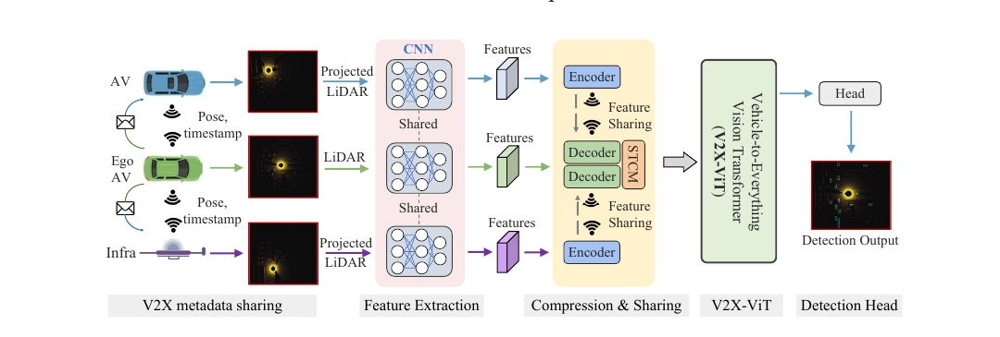
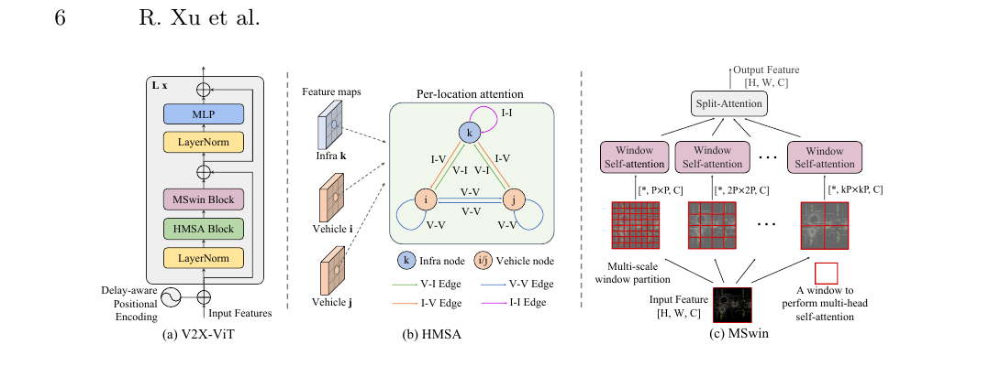
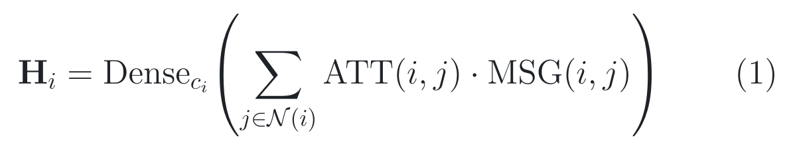
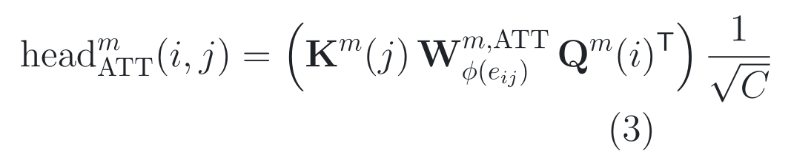
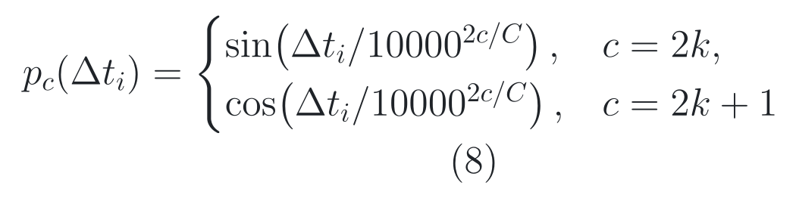
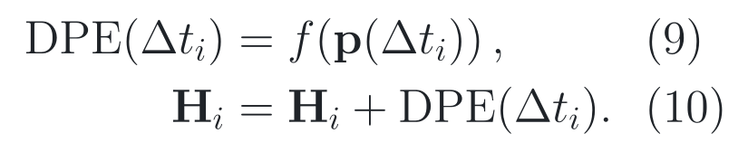
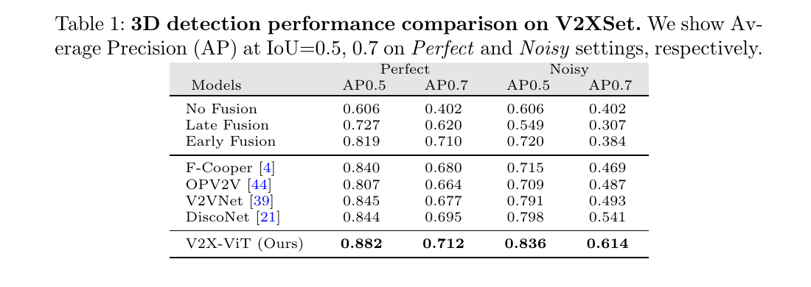
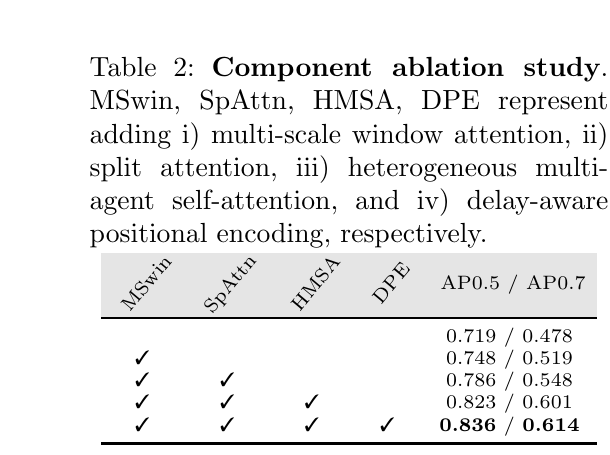

# 2026-08-02 — V2X-ViT: Vehicle-to-Everything Cooperative Perception with Vision Transformer

`ECCV 2022` · `Accepted` ·
`论文与补充材料已读 / 官方源码已审 / checkpoint、数据与数值结果未运行`

**主方向：** P08 · 协同感知 ·
**输入模态：** LiDAR、V2X、Vehicle State ·
**交叉标签：** Cooperative Perception、Feature-level Fusion、
Heterogeneous Attention、Pose Error、Communication Latency、Transformer、
Simulation、3D Object Detection

[▶ 从第一张图开始](#1-看图论文到底做了什么) ·
[返回首页](../../README.md) · [全部精读](../../index/papers.md) ·
[官方论文](https://www.ecva.net/papers/eccv_2022/papers_ECCV/papers/136990106.pdf) ·
[ECCV 录用入口](https://www.ecva.net/papers/eccv_2022/papers_ECCV/html/4589_ECCV_2022_paper.php) ·
[补充材料](https://www.ecva.net/papers/eccv_2022/papers_ECCV/papers/136990106-supp.pdf) ·
[官方代码 @ 固定 SHA](https://github.com/DerrickXuNu/v2x-vit/tree/f0e6c13f41e916548b2d8aba61e42a18ce980416)

证据与行文标签：**[原文翻译]** 忠实中文译文；**[笔记解释]** 帮助理解的
通俗讲解；**[论文]** 作者材料直接支持；**[源码]** 固定 commit 直接支持；
**[判断]** 本笔记分析；**[未核验]** 尚未独立运行或确认。译文中不混入解释
或判断。

## 0. 阅读起点：术语先导与摘要完整翻译

### 0.1 首次术语解释

**术语覆盖声明：** 下列账本先锁定摘要和方法中的核心术语；摘要之后第一次出现
的新术语仍在正文首现处解释。同一概念全文固定译名，方法名、模型名、数据集名
和作者自定义缩写保留原名。

- **车联万物（Vehicle-to-Everything, V2X）**：车辆与其他车辆、路侧基础设施
  等节点交换信息；本文实际研究车辆—车辆与车辆—路侧 LiDAR 特征协作。
- **协同感知（cooperative perception）**：多个空间视角共同提供观测或特征，
  让 ego 车辆看到单车遮挡或远距离稀疏区域；它不等于协同规划。
- **ego 车辆（ego vehicle）**：当前接收邻居信息并输出检测结果的目标车辆。
- **路侧基础设施（infrastructure, infra）**：装在交通灯杆或路灯杆上的感知节点；
  本文用负 ID 标识，其 32 线 LiDAR 安装高度与车载节点不同。
- **中间特征融合（intermediate feature fusion）**：各节点先独立提取神经网络
  特征，再传输和融合；它位于共享原始点云的 early fusion 与共享框结果的 late
  fusion 之间。
- **异构多智能体自注意力（Heterogeneous Multi-Agent Self-Attention, HMSA）**：
  按车辆/基础设施节点类型和四类有向边，使用不同投影与关系矩阵的跨节点注意力。
- **多尺度窗口注意力（Multi-Scale Window Attention, MSwin）**：在同一节点的
  BEV 特征上并行使用 4×4、8×8、16×16 窗口，再自适应融合各尺度分支。
- **时空校正模块（Spatial-Temporal Correction Module, STCM）**：用 ego 的历史
  位姿到当前位姿之差，对延迟到达的邻居 BEV 特征做仿射 warp；它处理全局刚体
  错位，不直接预测动态目标在延迟期间的运动。
- **延迟感知位置编码（Delay-aware Positional Encoding, DPE）**：把离散通信
  延迟编码成通道向量并加到每个节点特征上，给融合网络提供时间差条件。
- **PointPillar**：把点云离散为垂直柱体、散射成二维伪图像再用卷积提特征的
  3D 检测 backbone；它是继承组件，不是 V2X-ViT 的原创。
- **平均精度（Average Precision, AP）**：按置信度排序汇总精确率—召回率；
  本文报告 BEV 框 IoU 为 0.5 和 0.7 时的 AP。AP 不是总体 accuracy，也不直接
  证明跟踪、规划或闭环安全。
- **V2XSet**：作者用 CARLA 与 OpenCDA 构造的仿真 V2X 数据集，包含车辆与
  路侧节点、位姿噪声和传输延迟；保留原名。

### 0.2 摘要完整专业中文翻译

**原文锚点：** Abstract，PDF p. 1 / proceedings p. 107。

<a id="abstract-a01"></a>
> **[原文翻译] Abstract · PDF p. 1 / proceedings p. 107 · A01**
>
> 本文研究如何应用车联万物（V2X）通信来提升自动驾驶车辆的感知性能。我们
> 提出一个采用新型视觉 Transformer 的鲁棒 V2X 协同感知框架。具体而言，
> 我们构建了一个名为 V2X-ViT 的整体式注意力模型，用于有效融合道路上各类
> 智能体（即车辆与基础设施）的信息。V2X-ViT 由异构多智能体自注意力层与
> 多尺度窗口自注意力层交替构成，分别捕获智能体之间的交互与每个智能体内部的
> 空间关系。这些关键模块被统一到同一 Transformer 架构中，以处理常见 V2X
> 挑战，包括异步信息共享、位姿误差以及 V2X 组件的异构性。为了验证该方法，
> 我们使用 CARLA 与 OpenCDA 构建了一个大规模 V2X 感知数据集。大量实验结果
> 表明，V2X-ViT 在 3D 目标检测上取得了新的当时最佳性能，并且即使在严苛的
> 噪声环境中也保持鲁棒表现。代码已公开在作者仓库。

**完整性声明：** 摘要只有一个实质段落；A01 已按全部句子完整、未删减翻译，
保留了“道路上智能体”“异步、位姿误差、异构性”“仿真数据集”和“严苛噪声”
等限定范围。PDF 文本层可完整抽取，无低置信 OCR 片段。

> [!TIP]
> **[笔记解释] 读完摘要再看这一句：** V2X-ViT 先把延迟邻居特征 warp 到
> 当前 ego 坐标，再用类型感知的跨节点注意力与多尺度空间注意力融合；最强模块
> 证据是 Table 2 中加入 HMSA 后 AP@0.7 从 0.548 到 0.601，最大边界是全部主结果
> 来自单一仿真数据集，且固定源码的 ego 与噪声采样行为并不完全等同于论文描述。

**学习顺序：**
[0 摘要与术语](#0-阅读起点术语先导与摘要完整翻译) →
[1 看原图](#1-看图论文到底做了什么) →
[2 读原式](#2-读公式核心机制怎样表达) →
[3 看结果](#3-看结果证据是否支持主张) →
[4 对源码](#4-对源码公式如何落地) →
[5 记结论](#5-记结论贡献边界与开放问题)

## 1. 看图：论文到底做了什么

### 1.1 30 秒路口故事：被公交车挡住的车，谁能看见

**[笔记解释]** 想象 ego 车辆驶进拥挤十字路口，右前方公交车挡住了一辆横向
来车。ego 的 LiDAR 几乎没有打到它；另一辆车只看见一部分，路侧杆上的 LiDAR
却从高处看得完整。最直接的办法是把三份点云都发给 ego，但带宽大、到达时间不同，
而 GPS 位姿也有误差。若把错位特征逐像素硬相加，额外视角可能从帮助变成重影。

V2X-ViT 的故事是：各节点先把点云投到“延迟时刻的 ego 坐标”，独立提取并压缩
BEV 特征；接收端再按 ego 位姿变化做 STCM warp，用 DPE 告诉网络每份特征有多旧，
随后 HMSA 在同一空间位置比较不同节点，MSwin 在每个节点内部补充多尺度空间上下文，
最后只取 ego 槽位的融合特征做车辆 3D 检测。

### 1.2 Figure 2：系统不只是一个 Transformer



> **原图出处：** Xu et al., ECCV 2022, Figure 2，PDF p. 3 / proceedings p. 109。
> [官方 PDF](https://www.ecva.net/papers/eccv_2022/papers_ECCV/papers/136990106.pdf)。
> 仅作学术讲解所需的局部摘录，原图版权归原作者及其他权利人。

**按图阅读：**

1. 车辆与路侧节点先共享位姿、时间戳和节点类型，而不是直接假定所有观测同步；
2. 非 ego 点云先投影到 ego 的坐标范围，再各自进入共享 PointPillar；
3. encoder/decoder 表示传输前压缩与接收后恢复，STCM 进一步校正延迟造成的 ego
   坐标变化；
4. V2X-ViT 融合的是中间 BEV 特征，不是原始点云或已经输出的框；
5. 检测 head 只消费融合后的 ego 特征，输出车辆类别置信度和 3D anchor 残差。

**这张图没有证明：** 系统图没有证明通信链路真实可用，也没有给出丢包、恶意节点、
真实 GPS 漂移或端到端无线延迟实测；图中的压缩卷积类型还需要固定源码核对。

### 1.3 Figure 3：把融合拆成“跨节点”和“节点内”两轴



> **原图出处：** Xu et al., ECCV 2022, Figure 3，PDF p. 6 / proceedings p. 112。
> [官方 PDF](https://www.ecva.net/papers/eccv_2022/papers_ECCV/papers/136990106.pdf)。
> 仅作学术讲解所需的局部摘录，原图版权归原作者及其他权利人。

**[笔记解释]** 左图表示每层先做 HMSA，再做 MSwin 与 MLP，并用残差连接；
中图的关键不是“用了 attention”，而是车辆与基础设施拥有不同 Q/K/V 投影，
V→V、V→I、I→V、I→I 四种有向边各有关系矩阵；右图则在每个节点自己的
BEV 上并行开不同窗口，最后用 split attention 自适应选择尺度。

**看完应能复述：** HMSA 解决“谁的同一位置证据更可信”，MSwin 解决“该位置
附近多大范围的上下文有用”；二者顺序串联，不能把整套增益归给任一单算子。

**这张图没有证明：** Figure 3 是结构证据，不是效果证据。HMSA、MSwin 与 DPE
的归因必须回到 Table 2、Table 3 和 Figure 5 的受控干预。

### 整体算法架构与创新设计

**原方法瓶颈：** **[论文]** 作者指出单车视角受遮挡和远距离稀疏观测限制；
既有 V2V 中间融合又把车辆与路侧节点当作同质来源，并容易受异步、位姿误差和
异构传感器配置影响。简单 early/late fusion 还分别承担高带宽或缺少上下文的
代价。来源：论文 §1、§2，PDF p. 1–5 / proceedings p. 107–111。

**主干网络与基线：** **[论文/源码]** 所有主比较共用 anchor-based PointPillar
backbone，No Fusion 是只用 ego LiDAR 的直接 baseline；early fusion 汇总原始点云，
late fusion 汇总框再 NMS，OPV2V、F-Cooper、V2VNet、DiscoNet 是中间融合对照。
固定实现为 PillarVFE → scatter → 三阶段 BEV backbone → 384 通道多尺度拼接 →
stride-2 shrink 到 256 通道 → V2X-ViT → 1×1 分类/回归 heads。来源：论文 §3.1、
§4.2，PDF p. 5–6、9–10；[固定 SHA 配置](https://github.com/DerrickXuNu/v2x-vit/blob/f0e6c13f41e916548b2d8aba61e42a18ce980416/v2xvit/hypes_yaml/point_pillar_v2xvit.yaml#L78-L147)。

**继承与新增边界：** **[论文/源码]** PointPillar、spatial transformer 式
仿射采样、LayerNorm、MLP、focal loss、smooth L1、split attention 与 sinusoidal
encoding 均为继承组件。本文新增或重组的是：类型化的 HMSA、并行多尺度的 MSwin、
delay-conditioned DPE，以及把 STCM、HMSA、MSwin 与通信噪声统一到 V2X
中间融合系统。V2XSet 数据集也是贡献，但不是网络模块。来源：论文贡献列表 / §3，
PDF p. 3、5–9；补充材料 §2，PDF p. 3–6。

**端到端信息流：** **[论文/源码]** 每个样本最多 *M*=5 个节点；每节点输入
为带强度的 LiDAR 点，经 0.4 m × 0.4 m × 4 m voxelization 与 PointPillar 得到
BEV。补充材料公开的 Transformer 输入为 *M* × 176 × 48 × 256；源码另把归一化
ego 速度、离散延迟、infra 标志三个通道拼入，再在 encoder 内拆出。STCM 把非 ego
特征从延迟 ego 帧 warp 到当前 ego 帧，DPE 加入延迟条件；三层 encoder 每层按
HMSA → MSwin → MLP 更新。最终只取槽位 0，输出 176 × 48 × 2 个类别 logits 与
176 × 48 × 14 个回归量，对应两个 yaw anchors。来源：补充材料 Table T2 / Eq. (14)，
PDF p. 5–6；[固定 SHA 前向路径](https://github.com/DerrickXuNu/v2x-vit/blob/f0e6c13f41e916548b2d8aba61e42a18ce980416/v2xvit/models/point_pillar_transformer.py#L71-L121)。

**总体训练方式：** **[论文/源码]** 论文写先在 Perfect Setting 训练，再固定
backbone 在 Noisy Setting 微调，Adam 初始学习率 0.001、每 10 epochs 衰减 0.1，
Tesla V100 上训练 10<sup>5</sup> iterations。固定默认 YAML 则是 batch 2、60 epochs、
milestones 15/50、`compression=0`、`backbone_fix=false`、无 async/定位噪声；README
要求手动分成“完美/无压缩 → 完美/32× 压缩 1–2 epochs → noisy”三阶段。所有可学习
模块都只经 anchor 分类 focal loss 与 box smooth L1 间接或直接接收梯度，没有
HMSA、MSwin 或 DPE 的独立辅助损失。来源：论文 §4.2，PDF p. 10；
[固定 SHA 训练配置](https://github.com/DerrickXuNu/v2x-vit/blob/f0e6c13f41e916548b2d8aba61e42a18ce980416/v2xvit/hypes_yaml/point_pillar_v2xvit.yaml#L18-L24)；
[固定 SHA README 阶段说明](https://github.com/DerrickXuNu/v2x-vit/blob/f0e6c13f41e916548b2d8aba61e42a18ce980416/README.md#L118-L138)。

#### 创新模块 1：Heterogeneous Multi-Agent Self-Attention（HMSA）

**位置与接口：** 位于每个 V2X-ViT block 的第一段；STCM/DPE 之后、MSwin
之前。它跨节点融合同一个 BEV cell，而不在空间邻域内移动证据。

**输入：** *B* × *M* × *H* × *W* × 256 的对齐特征、节点有效/ROI mask，
以及车辆或基础设施类型。默认 8 heads、每 head 32 维；四种边类型由目标节点类型
与来源节点类型组合得到。

**内部变换：** 先按节点类型分别计算 Q/K/V；再按有向边类型选择 attention 关系
矩阵与 message 关系矩阵；对所有来源节点做 mask 后 softmax；以权重汇总关系变换
后的 value，拼接 heads，并按目标节点类型做输出投影。

**输出：** 与输入同 shape 的跨节点消息，经 dropout 后与原特征残差相加，继续送入
MSwin。无跨 batch 或跨时间的持久状态。

**为什么这样设计：** **[论文] 作者明确动机：** 路侧 LiDAR 的安装高度、视角、
噪声与车载 LiDAR 不同，把所有节点和连接当成同一种关系会丢失 V2X 异构性；
作者因此为节点与有向边显式分型。来源：论文 §3.2，PDF p. 7–8 / proceedings
p. 113–114。

**训练信号：** **[论文/源码]** HMSA 没有直接监督；ego 槽位的 focal 分类损失与
smooth L1 回归损失经后续 MSwin、MLP 和 head 反传，间接训练类型化 Q/K/V、
关系矩阵和输出投影。无效节点/warp 后 ROI 由 mask 填为负无穷，softmax 后不传
消息；这会阻断对应来源路径，但其他有效节点与 residual 路径仍有梯度。来源：
[固定 SHA HMSA](https://github.com/DerrickXuNu/v2x-vit/blob/f0e6c13f41e916548b2d8aba61e42a18ce980416/v2xvit/models/sub_modules/hmsa.py#L110-L151)；
[固定 SHA loss](https://github.com/DerrickXuNu/v2x-vit/blob/f0e6c13f41e916548b2d8aba61e42a18ce980416/v2xvit/loss/point_pillar_loss.py#L68-L141)。

**作用与证据：** **[论文]** Table 2 在其余已加入组件不变时，由
MSwin+SpAttn 的 0.548 AP@0.7 加入 HMSA 到 0.601，提升 0.053 绝对点，约
9.7% 相对。这是逐项加入组件的消融；干预条件是“同质多节点 attention”对“加入节点/边类型参数”；它支持
HMSA 在 V2XSet Noisy Setting 中有效。作者正文写 HMSA 增加 6.6%，与表中相邻行
的 5.3 绝对点并非同一数值口径，本笔记以原表逐行差值为准。来源：论文 Table 2 /
§4.5，PDF p. 12、14。

**论文位置：** **[论文]** Figure 3b / Eq. (1)–(7) / §3.2，PDF p. 6–8。

**源码入口：** **[源码]**
[`HGTCavAttention` @ 固定 SHA](https://github.com/DerrickXuNu/v2x-vit/blob/f0e6c13f41e916548b2d8aba61e42a18ce980416/v2xvit/models/sub_modules/hmsa.py#L7-L151)。

#### 创新模块 2：Multi-Scale Window Attention（MSwin）

**位置与接口：** 位于同一 block 的 HMSA 之后、MLP 之前；对每个节点独立做
空间 attention，不跨节点。

**输入：** *B* × *M* × 176 × 48 × 256 特征。默认三个分支分别使用 4×4、
8×8、16×16 非重叠窗口，heads 为 16/8/4，使每个分支内部维度仍为 256。

**内部变换：** 每个分支按自己的窗口切分 BEV，做带二维相对位置 bias 的局部
多头 self-attention；三个输出由 split attention 依据内容加权融合。源码不做
Swin 式 cyclic shift，要求空间尺寸能被各窗口大小整除。

**输出：** 每节点同 shape 的多尺度空间特征，经 residual 写回；它不改变坐标系
或节点数。

**为什么这样设计：** **[论文] 作者明确动机：** 小窗口保留局部细节，大窗口能在
定位误差把目标移出原 cell 时扩大取证范围；并行多尺度希望在高分辨率下保持对
*H*×*W* 线性的复杂度。来源：论文 §3.2，PDF p. 8；补充材料 §2.2，PDF p. 3–5。

**训练信号：** **[论文/源码]** 只有最终检测损失经 shared residual path 间接训练
各窗口 Q/K/V、相对位置 bias 与 split-attention 权重；没有显式定位误差回归损失。
所有节点分支都可经 HMSA 与最后 ego 输出获得梯度，但若节点被 mask 或其消息未被
ego 路径利用，梯度会相应减弱。来源：
[固定 SHA MSwin](https://github.com/DerrickXuNu/v2x-vit/blob/f0e6c13f41e916548b2d8aba61e42a18ce980416/v2xvit/models/sub_modules/mswin.py#L19-L120)。

**作用与证据：** **[论文]** Table 2 从 homogeneous attention baseline 的
0.478 AP@0.7 加入 MSwin 到 0.519，+0.041 绝对点。Figure 5b 又在不同位置/航向
噪声下做受控比较：单小窗、大小两窗和三窗中，三窗曲线总体最高；干预条件同时改变窗口分支
数量与尺度，支持多尺度组合，不单独证明某个 16×16 分支。来源：论文 Table 2 /
Figure 5b / §4.5，PDF p. 12、14。

**论文位置：** **[论文]** Figure 3c / §3.2，PDF p. 6、8；补充材料 Eq. (2)–(9) /
§2.2，PDF p. 3–5。

**源码入口：** **[源码]**
[`PyramidWindowAttention` @ 固定 SHA](https://github.com/DerrickXuNu/v2x-vit/blob/f0e6c13f41e916548b2d8aba61e42a18ce980416/v2xvit/models/sub_modules/mswin.py#L83-L120)。

#### 创新模块 3：Delay-Aware Positional Encoding（DPE）

**位置与接口：** 以每个节点的离散延迟为条件，把 256 维时间向量广播到所有
BEV cells；论文叙事把它放在 STCM 后、Transformer 前，固定源码实际先加 RTE
再执行 STTF warp。

**输入：** 每节点整数 delay index、通道数 256 与 max length 100；默认
`RTE_ratio=2`，源码注释把 index 1 解释为 50 ms 单位，从而用 2 表示 100 ms。

**内部变换：** 用正弦/余弦初始化 embedding，经一个线性层映射后加到特征。
固定源码还除以 √256，并把延迟转为整数再索引；这比论文连续 *Δt* 公式多了
量化、范围与幅值约束。

**输出：** 与原特征同 shape 的 delay-conditioned 特征。DPE 不预测未来目标位置，
也不保存历史 hidden state。

**为什么这样设计：** **[论文] 作者明确动机：** STCM 只能用 ego 位姿修正全局
刚体错位，动态目标在传输延迟中的局部运动仍未补偿；DPE 让融合网络知道每份特征
有多旧。来源：论文 §3.2，PDF p. 8–9。

**训练信号：** **[论文/源码]** DPE 没有 delay regression 或对齐辅助 loss；
embedding 与线性层只从最终 ego 检测损失间接学习。`prior_encoding` 中的速度通道
被送入模型但固定 forward 没有消费；真正用于 DPE 的只有 delay index。来源：
[固定 SHA DPE 与调用](https://github.com/DerrickXuNu/v2x-vit/blob/f0e6c13f41e916548b2d8aba61e42a18ce980416/v2xvit/models/sub_modules/v2xvit_basic.py#L35-L80)；
[固定 SHA encoder](https://github.com/DerrickXuNu/v2x-vit/blob/f0e6c13f41e916548b2d8aba61e42a18ce980416/v2xvit/models/sub_modules/v2xvit_basic.py#L159-L176)。

**作用与证据：** **[论文]** Table 3 在 100/200/300/400 ms 下，加入 DPE 的
AP@0.7 分别从 0.639/0.558/0.496/0.458 提到 0.650/0.572/0.514/0.478，绝对提升
0.011/0.014/0.018/0.020；这是有无 DPE 的受控比较，延迟越大，表内增益越大。它支持固定离散延迟范围内的
条件编码，不证明 DPE 完成运动补偿或对未见通信分布校准。来源：论文 Table 3 /
§4.5，PDF p. 12、14。

**论文位置：** **[论文]** Eq. (8)–(10) / §3.2，PDF p. 9。

**源码入口：** **[源码]**
[`RelTemporalEncoding` @ 固定 SHA](https://github.com/DerrickXuNu/v2x-vit/blob/f0e6c13f41e916548b2d8aba61e42a18ce980416/v2xvit/models/sub_modules/v2xvit_basic.py#L35-L80)。

## 2. 读公式：核心机制怎样表达

### 原文公式 1：同一位置先按邻居权重聚合

**原文公式：** 论文 Eq. (1)，PDF p. 7 / proceedings p. 113。

<p align="center"><picture><source media="(prefers-color-scheme: dark)" srcset="../../assets/notes/2026-08-02-v2x-vit/formulas/eq-01-hmsa-aggregation-dark.png"></picture></p>

> **公式来源：** Xu et al., ECCV 2022, Eq. (1)，PDF p. 7；本图按原符号重排。
> [官方 PDF](https://www.ecva.net/papers/eccv_2022/papers_ECCV/papers/136990106.pdf) ·
> [可复制 TeX](../../assets/notes/2026-08-02-v2x-vit/formulas/source.tex#L5-L12)。

**符号说明**

- **H**<sub>*i*</sub>：目标节点 *i* 更新后的同位置特征；
- *c*<sub>*i*</sub>：目标节点是车辆还是基础设施；
- *N*(*i*)：能给目标节点 *i* 发消息的邻居集合；
- ATT(*i*,*j*)：来源 *j* 对目标 *i* 的归一化注意力；
- MSG(*i*,*j*)：按来源节点类型和有向边类型变换后的消息。

**纯文字读法：** 对目标节点 *i*，把每个邻居 *j* 的消息乘以对应注意力并求和，
再用目标节点类型专属的线性层合并多头信息。

**教学小例子：** 同一 BEV cell 有 ego、另一辆车和路侧节点三份证据，注意力为
0.2、0.1、0.7；若路侧消息表示“该 cell 有车辆”的强特征，聚合主要继承路侧证据。
这只是教学示例，不是论文实验，也不表示注意力权重等于因果重要性。

**专业解释：** Eq. (1) 把“按谁加权”和“传什么消息”分开；节点类型影响 Q/K/V
和最终投影，边类型影响 ATT 与 MSG。类型只是离散先验，不能表达同类传感器内部的
连续质量差异。

**回到上面的图：** 对应 Figure 3b 中以节点 *i* 为中心的四类有向边。

**落到源码：** [`HGTCavAttention.forward` @ 固定 SHA](https://github.com/DerrickXuNu/v2x-vit/blob/f0e6c13f41e916548b2d8aba61e42a18ce980416/v2xvit/models/sub_modules/hmsa.py#L110-L151)

**公式省略了什么：** batch、head、176×48 空间维、ROI mask、dropout、residual
和只输出 ego 槽位都未写入 Eq. (1)；源码 softmax 前对无效来源填负无穷。

### 原文公式 2：边类型怎样进入注意力分数

**原文公式：** 论文 Eq. (3)，PDF p. 7 / proceedings p. 113。

<p align="center"><picture><source media="(prefers-color-scheme: dark)" srcset="../../assets/notes/2026-08-02-v2x-vit/formulas/eq-03-relation-aware-attention-dark.png"></picture></p>

> **公式来源：** Xu et al., ECCV 2022, Eq. (3)，PDF p. 7；本图按原符号重排。
> [官方 PDF](https://www.ecva.net/papers/eccv_2022/papers_ECCV/papers/136990106.pdf) ·
> [可复制 TeX](../../assets/notes/2026-08-02-v2x-vit/formulas/source.tex#L14-L24)。

**符号说明**

- **K**<sup>*m*</sup>(*j*)：来源节点 *j* 的第 *m* 个 key；
- **Q**<sup>*m*</sup>(*i*)：目标节点 *i* 的第 *m* 个 query；
- *ϕ*(*e*<sub>*ij*</sub>)：V→V、V→I、I→V、I→I 中的一种边类型；
- **W**：该边类型与 attention head 专属的关系矩阵；
- *C*：论文使用的通道记号。

**纯文字读法：** 先用有向边类型矩阵变换来源 key 与目标 query 的匹配关系，
做点积后再按通道尺度归一化。

**教学小例子：** 同一个路侧 key 分别发给车辆和另一个路侧节点时，会选 I→V
或 I→I 两套不同矩阵，因此即使原始 key 相同，匹配分数也可不同。

**专业解释：** 这比仅给 type embedding 更强：关系矩阵可以改变特征维之间的
双线性交互，但参数与计算随类型对和 heads 增长。

**回到上面的图：** 对应 Figure 3b 四种颜色的边。

**落到源码：** [`relation_att` 与 `att_map` @ 固定 SHA](https://github.com/DerrickXuNu/v2x-vit/blob/f0e6c13f41e916548b2d8aba61e42a18ce980416/v2xvit/models/sub_modules/hmsa.py#L30-L37)

**公式省略了什么：** 论文写除以 √*C*；固定配置特征维 256，而源码实际用
每 head 维 32 的负二分之一次方作为 scale。**[判断]** 这可能只是论文 *C* 指代
每头维度的记号歧义，也可能是实现细化；未经数值追踪不定性为 bug。

### 原文公式 3：把延迟变成通道相位

**原文公式：** 论文 Eq. (8)，PDF p. 9 / proceedings p. 115。

<p align="center"><picture><source media="(prefers-color-scheme: dark)" srcset="../../assets/notes/2026-08-02-v2x-vit/formulas/eq-08-delay-sinusoid-dark.png"></picture></p>

> **公式来源：** Xu et al., ECCV 2022, Eq. (8)，PDF p. 9；本图按原符号重排。
> [官方 PDF](https://www.ecva.net/papers/eccv_2022/papers_ECCV/papers/136990106.pdf) ·
> [可复制 TeX](../../assets/notes/2026-08-02-v2x-vit/formulas/source.tex#L26-L36)。

**符号说明**

- *Δt*<sub>*i*</sub>：节点 *i* 的通信/观测延迟；
- *p*<sub>*c*</sub>：第 *c* 个延迟编码通道；
- *C*：总通道数；
- *k*：偶/奇通道的整数索引。

**纯文字读法：** 延迟相同但通道不同，会以不同频率映射为正弦或余弦值。

**教学小例子：** 100 ms 和 400 ms 会得到不同 256 维相位向量；线性层可据此
学习“越旧的邻居证据应怎样调整”。它不会自动把移动目标推到未来位置。

**专业解释：** 多频率编码让模型在有限训练延迟上获得有结构的条件向量；是否能
外推到未见延迟，仍取决于量化方式、训练分布和后续线性层。

**回到上面的图：** 对应 Figure 3a 左下角进入 block 的 DPE 支路。

**落到源码：** [`RelTemporalEncoding.__init__` @ 固定 SHA](https://github.com/DerrickXuNu/v2x-vit/blob/f0e6c13f41e916548b2d8aba61e42a18ce980416/v2xvit/models/sub_modules/v2xvit_basic.py#L35-L61)

**公式省略了什么：** 源码把 delay 量化为整数 index，乘 `RTE_ratio`，限制在
100 个 embedding 槽位，并额外除以 √256；论文 Eq. (8) 没写这些范围与单位。

### 原文公式 4：DPE 如何写回特征

**原文公式：** 论文 Eq. (9)–(10)，PDF p. 9 / proceedings p. 115。

<p align="center"><picture><source media="(prefers-color-scheme: dark)" srcset="../../assets/notes/2026-08-02-v2x-vit/formulas/eq-09-10-delay-update-dark.png"></picture></p>

> **公式来源：** Xu et al., ECCV 2022, Eq. (9)–(10)，PDF p. 9；本图按原符号重排。
> [官方 PDF](https://www.ecva.net/papers/eccv_2022/papers_ECCV/papers/136990106.pdf) ·
> [可复制 TeX](../../assets/notes/2026-08-02-v2x-vit/formulas/source.tex#L38-L45)。

**符号说明**

- *f*：可学习线性投影；
- **p**(*Δt*<sub>*i*</sub>)：完整延迟向量；
- **H**<sub>*i*</sub>：节点 *i* 的 BEV 特征。

**纯文字读法：** 先线性变换延迟向量，再把它广播相加到该节点的全部空间位置。

**教学小例子：** 对 176×48 个 cells，同一节点都加相同 256 维延迟向量；空间位置
不变，变化的是通道条件。

**专业解释：** 这是 feature conditioning，不是显式 motion model。局部运动仍要
由后续 attention 从训练数据中间接学习。

**回到上面的图：** DPE 与输入特征在 Figure 3a 相加后进入层堆栈。

**落到源码：** [`RTE.forward` / `V2XTEncoder.forward` @ 固定 SHA](https://github.com/DerrickXuNu/v2x-vit/blob/f0e6c13f41e916548b2d8aba61e42a18ce980416/v2xvit/models/sub_modules/v2xvit_basic.py#L73-L80)

**公式省略了什么：** 固定源码顺序是先 RTE、再 STTF，而补充材料 Eq. (14) 把
STCM 与 DPE 写成同一输入合成式；边界 warp 后的广播向量是否完全保持需看 sampling
mask。该顺序差异未经运行，不冒充数值错误。

## 3. 看结果：证据是否支持主张

### 3.1 原文公开的实验配置

**原文锚点：** 主论文 §4.1–4.2，PDF p. 9–10 / proceedings p. 115–116；
补充材料 §1–4，PDF p. 1–9；固定 SHA config、README 与运行脚本。

- **数据集、版本与划分。** **[论文]** V2XSet 由 CARLA 与 OpenCDA 生成，
  含 11,447 frames / 33,081 agent samples，train/validation/test 为
  6,694/1,920/2,833；55 个场景、8 个 CARLA towns、5 类道路，每场景最多 25 s。
  来源：论文 §4.1，PDF p. 9；补充材料 §3，PDF p. 5–7。
- **传感器、输入与范围。** **[论文]** 每节点 32 线 LiDAR、120 m 数据范围、10 Hz；
  评测 *x* 为 [−140,140] m、*y* 为 [−40,40] m，通信半径 70 m。路侧 LiDAR
  安装约 14 英尺高。来源：论文 §4.2，PDF p. 9–10；补充材料 §3，PDF p. 5–6。
- **预处理与 shape。** **[论文/源码]** 论文说 PointPillar 水平 voxel 为 0.4 m；
  固定配置实际 voxel 为 [0.4,0.4,4]，点云范围 [−140.8,−38.4,−3,140.8,38.4,1]，
  每 voxel 最多 32 点；Transformer 输入 *M*×176×48×256。增强为 x 翻转、
  ±45° 旋转与 0.95–1.05 缩放。来源：补充材料 Table T2，PDF p. 6；
  [固定 SHA config](https://github.com/DerrickXuNu/v2x-vit/blob/f0e6c13f41e916548b2d8aba61e42a18ce980416/v2xvit/hypes_yaml/point_pillar_v2xvit.yaml#L28-L54)。
- **硬件、软件与依赖。** **[论文]** 训练硬件为 Tesla V100；Table 4 推理也在 V100。
  **[源码]** README 建议 Python 3.7、PyTorch ≥1.8.1、CUDA 11.3、spconv 2.0，
  并编译 Cython/CUDA NMS；固定 requirements 未锁版本。GPU 数量、训练时长、
  显存与精确驱动未公开。来源：论文 §4.2 / Table 4，PDF p. 10、12；
  [固定 SHA 安装](https://github.com/DerrickXuNu/v2x-vit/blob/f0e6c13f41e916548b2d8aba61e42a18ce980416/README.md#L25-L45)。
- **初始化与冻结。** **[论文]** 先 Perfect，再固定 backbone 在 Noisy 微调。
  **[源码]** 默认 `backbone_fix=false`；README 才要求继续训练时手动修改 checkpoint
  目录中的 config。未公开 ImageNet 或其他预训练权重，PointPillar 是否从随机初始化
  开始未明确说明。来源：论文 §4.2，PDF p. 10；固定 config lines 78–85。
- **优化器、学习率与 scheduler。** **[论文]** Adam、初始 0.001、每 10 epochs
  ×0.1。**[源码]** Adam eps 10<sup>−10</sup>、weight decay 10<sup>−4</sup>，
  MultiStepLR 在 epoch 15 与 50 ×0.1。二者冲突并列，不用领域惯例补齐。
  来源：[固定 SHA optimizer](https://github.com/DerrickXuNu/v2x-vit/blob/f0e6c13f41e916548b2d8aba61e42a18ce980416/v2xvit/hypes_yaml/point_pillar_v2xvit.yaml#L151-L162)。
- **batch、轮数/steps 与增强。** **[论文]** 10<sup>5</sup> iterations，未给 batch。
  **[源码]** batch 2、60 epochs、8 workers、drop-last；增强见上。单卡/多卡、
  累积梯度与 steps 对 epoch 的换算未公开。来源：论文 §4.2，PDF p. 10；
  [固定 SHA train loader](https://github.com/DerrickXuNu/v2x-vit/blob/f0e6c13f41e916548b2d8aba61e42a18ce980416/v2xvit/tools/train.py#L31-L49)。
- **随机种子、重复次数与选模。** **[论文]** 未公开随机种子、重复次数、误差条或
  置信区间。**[源码]** `seed=25` 只控制定位噪声；训练 DataLoader shuffle 没有
  global seed。每 epoch 验证平均 loss 并保存，但没有 best-model 选择；恢复/推理
  自动加载目录中最大 epoch。来源：[固定 SHA 训练循环](https://github.com/DerrickXuNu/v2x-vit/blob/f0e6c13f41e916548b2d8aba61e42a18ce980416/v2xvit/tools/train.py#L84-L150)。
- **Noisy Setting。** **[论文]** 位置/航向高斯标准差 0.2 m/0.2°，延迟 100 ms。
  **[源码]** 公开 inference 示例用 `async_mode=sim` 固定 100 ms；定位函数每次调用
  都重置 seed 25，因此同一配置下每帧/节点得到相关甚至相同的噪声向量，而不是
  独立抽样。只给非 ego 节点加噪，roll/pitch 保持不变。来源：论文 §4.2，PDF p. 9；
  [固定 SHA noise](https://github.com/DerrickXuNu/v2x-vit/blob/f0e6c13f41e916548b2d8aba61e42a18ce980416/v2xvit/data_utils/datasets/basedataset.py#L325-L379)。
- **推理阈值与后处理。** **[源码]** batch 1，sigmoid 分数阈值 0.27，rotated NMS
  阈值 0.15，最多 100 GT objects；论文未公开这些值。推理输出 AP@0.3/0.5/0.7，
  主表只报告后两者。来源：[固定 SHA postprocess](https://github.com/DerrickXuNu/v2x-vit/blob/f0e6c13f41e916548b2d8aba61e42a18ce980416/v2xvit/data_utils/post_processor/voxel_postprocessor.py#L231-L328)。
- **指标与公平性。** **[论文/源码]** AP 基于 BEV rotated-box IoU；目标集合只含
  至少被任一连接节点的一束 LiDAR 命中的车辆。所有中间融合 baseline 共用
  PointPillar，且 V2V 方法也接收 infrastructure，但不区分类型。AP 不是 3D IoU、
  全场景 accuracy 或安全率。来源：论文 §4.2，PDF p. 10；
  [固定 SHA VOC AP](https://github.com/DerrickXuNu/v2x-vit/blob/f0e6c13f41e916548b2d8aba61e42a18ce980416/v2xvit/utils/eval_utils.py#L13-L129)。
- **checkpoint 与最短入口。** **[源码]** README 公开 Google Drive checkpoint；
  最短命令为 `python v2xvit/tools/inference.py --model_dir <CHECKPOINT_FOLDER> --fusion_method intermediate`。
  **[未核验]** 本笔记未下载 checkpoint、未核哈希、未准备 V2XSet，也未运行推理。
  来源：[固定 SHA README](https://github.com/DerrickXuNu/v2x-vit/blob/f0e6c13f41e916548b2d8aba61e42a18ce980416/README.md#L85-L113)。

### 3.2 原文公开的实验流程

**原文锚点：** 主论文 §3–4，PDF p. 5–14；补充材料 §1–4；固定 SHA 数据、
训练、推理与评测入口。

1. **数据准备：** **[论文/源码]** 下载 V2XSet train/validate/test；每 index 读取
   当前 ego 与邻居的当前/延迟帧，按通信半径筛节点，给非 ego 位姿加噪，投影点云
   到延迟 ego 坐标并 voxelize。论文说训练随机选择 ego；固定源码实际把每个 scenario
   排序后的第一个非 infrastructure ID 永久标为 ego。来源：论文 §4.2，PDF p. 10；
   [固定 SHA ego 选择](https://github.com/DerrickXuNu/v2x-vit/blob/f0e6c13f41e916548b2d8aba61e42a18ce980416/v2xvit/data_utils/datasets/basedataset.py#L115-L170)。
2. **Perfect 训练：** **[论文/源码]** 关闭 async 与定位误差，以 PointPillar +
   V2X-ViT 训练 anchor 分类与回归；README 先用 `compression=0`，收敛后再启用 32×
   压缩 1–2 epochs。固定默认 YAML 只直接描述这一阶段。来源：论文 §4.2，PDF p. 10；
   [固定 SHA README](https://github.com/DerrickXuNu/v2x-vit/blob/f0e6c13f41e916548b2d8aba61e42a18ce980416/README.md#L118-L134)。
3. **Noisy 微调：** **[论文]** 固定 backbone，加入 0.2 m/0.2° 与 100 ms。
   **[源码]** README 建议 `async_mode=real`、额外 200 或 300 ms、定位噪声 0.2，
   与主表的 fixed 100 ms inference config 不同；是否冻结取决于手动设置
   `backbone_fix`。没有脚本自动强制三阶段一致。来源：论文 §4.2，PDF p. 10；
   [固定 SHA README](https://github.com/DerrickXuNu/v2x-vit/blob/f0e6c13f41e916548b2d8aba61e42a18ce980416/README.md#L130-L134)。
4. **验证与选模：** **[源码]** 每个 epoch 计算 validation mean loss，每个 epoch
   保存 `net_epochN.pth`；没有按 AP 选模或 early stopping。**[未核验]** 论文没有
   报告最终选择了哪一 epoch、多少重复或哪一 seed。来源：
   [固定 SHA train](https://github.com/DerrickXuNu/v2x-vit/blob/f0e6c13f41e916548b2d8aba61e42a18ce980416/v2xvit/tools/train.py#L86-L149)。
5. **推理与后处理：** **[源码]** 读取最大 epoch checkpoint；每个测试 frame 独立
   构造当前/延迟特征，STTF/RTE/HMSA/MSwin 只在该 batch 内运行；score threshold
   与 rotated NMS 后得到框。没有 prediction-relevant 跨帧 hidden state。来源：
   [固定 SHA inference](https://github.com/DerrickXuNu/v2x-vit/blob/f0e6c13f41e916548b2d8aba61e42a18ce980416/v2xvit/tools/inference.py#L54-L188)。
6. **最终评测：** **[论文/源码]** 按置信度排序，分别在 BEV IoU 0.5/0.7 计算
   VOC-style AP；累加器 `result_stat` 是 evaluation-only state，不进入下一帧预测。
   来源：论文 §4.2，PDF p. 10；[固定 SHA evaluation](https://github.com/DerrickXuNu/v2x-vit/blob/f0e6c13f41e916548b2d8aba61e42a18ce980416/v2xvit/utils/eval_utils.py#L13-L143)。

**复现仍缺什么：** checkpoint 文件哈希、精确训练阶段 config、论文 scheduler 与
源码 scheduler 的取舍、真实 ego 随机策略、独立噪声序列、GPU 数量/时长和多次重复。
这些缺口使“可执行入口”不能被写成“论文数值已独立复现”。

### 3.3 核心主结果



> **原图出处：** Xu et al., ECCV 2022, Table 1，PDF p. 10 / proceedings p. 116。
> [官方 PDF](https://www.ecva.net/papers/eccv_2022/papers_ECCV/papers/136990106.pdf)。
> 仅作学术讲解所需的局部摘录，原图版权归原作者及其他权利人。

**公平对照先读清：**

- No Fusion 的 AP@0.7 为 0.402；V2X-ViT 在 Noisy Setting 为 0.614，+0.212
  绝对点，约 +52.7% 相对。这个增益包含“额外视角可见目标”和“融合机制”两部分，
  不能只归因给 Transformer。
- 最强中间融合 baseline DiscoNet 在 noisy 为 0.541，V2X-ViT 高 0.073 绝对点，
  约 +13.5% 相对；在 perfect 只高 0.017，说明优势主要出现在作者构造的噪声协议。
- V2X-ViT 从 perfect 0.712 到 noisy 0.614，仍下降 0.098 绝对点、约 13.8% 相对；
  “鲁棒”不等于“不受噪声影响”。
- Early Fusion 从 0.710 到 0.384，下降 0.326；Late Fusion 从 0.620 到 0.307，
  下降 0.313。二者在 noisy 下低于 No Fusion，但其通信量、对齐与后处理接口不同，
  不能把差距只解释为“early/late 理论上更差”。

### 3.4 模块级主效应



> **原图出处：** Xu et al., ECCV 2022, Table 2，PDF p. 12 / proceedings p. 118。
> [官方 PDF](https://www.ecva.net/papers/eccv_2022/papers_ECCV/papers/136990106.pdf)。
> 仅作学术讲解所需的局部摘录，原图版权归原作者及其他权利人。

**逐行干预：**

- homogeneous multi-agent attention baseline：AP@0.7 0.478；
- 加 MSwin：0.519，+0.041；
- 再加 split attention：0.548，+0.029；
- 再加 HMSA：0.601，+0.053，是表中最大相邻行增益；
- 再加 DPE：0.614，+0.013。

**[判断]** 这是 progressive ablation：每行只比上一行多一个组件，因此相邻差值
具有模块级意义；但顺序固定，不能回答“若先加 HMSA、没有 MSwin 时还增益多少”，
也没有多 seed 方差。作者正文对 HMSA 的“6.6%”与相邻表格 5.3 绝对点不一致，
本笔记不擅自推断其口径。

### 3.5 其余决定边界的结果

- **定位误差：** Figure 4 在位置标准差 0–0.5 m、航向标准差 0–1° 上画曲线；
  V2X-ViT 总体最高，但最大噪声下仍明显下降。Figure 5b 只支持多尺度窗口组合比
  单小窗更稳，不证明真实 GPS 长尾漂移。
- **固定延迟：** Table 3 显示 DPE 在 100–400 ms 提升 0.011–0.020 AP@0.7；
  400 ms 时完整模型仍只有 0.478，接近 No Fusion 0.402，不是延迟免疫。
- **节点数：** Figure 5a 从 1 到 4 个节点增益逐渐饱和；补充材料据此讨论只选
  少量邻居。它没有给出更大规模路口、网络拥塞或节点选择误差。
- **通信量：** Figure 5c 把传输率设 27 Mbps，并将 0–200 ms uniform idle time
  与 feature size/v 相加；32× 与 128× 压缩仍有竞争力。固定源码的 compressor
  使用 3×3 conv，而论文 §3.1 写一系列 1×1 conv；该静态差异未数值追踪。
- **动态目标：** 补充 Table T3 中 V2X-ViT 在低/中/高速车辆上均最高，但
  高速组 AP@0.7 只有 0.488；DPE 不能被描述为完整运动补偿。
- **统计边界：** 主文与补充材料均没有随机重复、误差条、显著性检验或置信区间。

### 3.6 证据支持什么

- **[论文]** 在 V2XSet 的 PointPillar 公平 backbone 与作者 noisy protocol 下，
  V2X-ViT 明显优于表中 early、late 和四种中间融合 baseline。
- **[论文]** progressive Table 2 支持 MSwin、split attention、HMSA、DPE 在固定
  组合顺序中都有正增益，HMSA 的相邻行增益最大。
- **[论文]** 多尺度窗口、DPE 与压缩率实验分别给出定位误差、固定延迟和带宽条件下
  的受控证据。

### 3.7 证据没有支持什么

- **[判断]** 仿真高斯位姿噪声和离散 delay 不能代表真实丢包、时钟漂移、长尾
  GPS 故障、恶意消息或通信拥塞。
- **[判断]** AP 只评车辆 BEV 框；它不等于全类别 3D 感知、轨迹连续性、风险校准、
  闭环规划收益或安全提升。
- **[未核验]** 没有真实 V2X 数据、跨 simulator、跨城市或 zero-shot 域迁移结果。
- **[未核验]** 没有和参数量/计算量完全匹配的 homogeneous attention 对照；
  HMSA 增益可能同时包含关系参数容量增加。
- **[未核验]** 本阅读未运行 checkpoint；所有论文—源码差异均为静态审计，
  不把未追踪差异定性为数值 bug。

## 4. 对源码：公式如何落地

```text
current/delayed LiDAR + pose/timestamp/type
→ IntermediateFusionDataset
→ delayed-ego-frame point projection + voxelization
→ shared PointPillar + BEV backbone + shrink/compressor
→ regroup to B × M × 176 × 48 × 256
→ RTE(DPE) → STTF warp + ROI mask
→ three × [HMSA → MSwin → MLP]
→ take ego slot 0
→ 1×1 cls/reg heads
→ score threshold + rotated NMS
→ VOC-style BEV AP accumulator
```

### 1. 样本、ego 与噪声：`BaseDataset.retrieve_base_data`

- **论文对应：** §4.2 的训练随机 ego、测试固定 ego，以及位置/航向高斯噪声与
  100 ms delay。
- **源码行为：** scenario 内按 ID 排序，把第一个非 infrastructure 节点永久标为
  ego；训练和测试走同一标记。`async_mode=sim` 返回固定帧延迟；定位噪声只加给
  非 ego，且 `add_loc_noise` 每次先 `np.random.seed(25)` 再采样。
- **需要留意：** 论文的“训练随机 AV”在固定源码中没有对应调用；每次重置 seed
  使噪声跨节点/帧高度相关，而不是独立高斯样本。这个行为改变噪声协议，但未经
  重新评测不能断言主表会升或降。
- [打开固定 SHA 源码](https://github.com/DerrickXuNu/v2x-vit/blob/f0e6c13f41e916548b2d8aba61e42a18ce980416/v2xvit/data_utils/datasets/basedataset.py#L115-L170)

### 2. 点云到传输特征：`PointPillarTransformer.forward`

- **论文对应：** Figure 2 的共享 PointPillar、压缩/恢复与 256 通道 BEV。
- **源码行为：** PillarVFE、scatter、BEV backbone 后 shrink；当 compression>0
  才调用 compressor。固定默认为 0；compressor 实际用一个 3×3 encoder 和两个
  3×3 decoder conv，而不是论文写的 1×1 conv 序列。
- **需要留意：** 默认 config 不能直接代表论文 32× 主结果；README 要求在继续
  训练阶段手改 compression。encoder 与 decoder 在一个进程内顺序执行，源码没有
  真正序列化、网络传输、量化或丢包实现。
- [打开固定 SHA 源码](https://github.com/DerrickXuNu/v2x-vit/blob/f0e6c13f41e916548b2d8aba61e42a18ce980416/v2xvit/models/point_pillar_transformer.py#L71-L121)

### 3. 时空校正与 delay 条件：`V2XTEncoder.forward`

- **论文对应：** STCM 将 delayed ego frame warp 到 current ego frame；DPE 编码
  邻居 delay。
- **源码行为：** 从拼入的 velocity/delay/infra 三通道中只取 delay 做 RTE；先加
  RTE，再对非 ego 特征 grid-sample warp；随后结合节点 mask 与 rotated ROI mask。
- **需要留意：** `prior_feed` 被定义但 forward 未调用，velocity 也未用于预测；
  DPE 的执行顺序与论文/补充公式叙事不同。STTF 不学习 pose，而是相信输入矩阵；
  错误矩阵会直接把特征 warp 到错误 cell。
- [打开固定 SHA 源码](https://github.com/DerrickXuNu/v2x-vit/blob/f0e6c13f41e916548b2d8aba61e42a18ce980416/v2xvit/models/sub_modules/v2xvit_basic.py#L123-L179)

### 4. 类型化跨节点融合：`HGTCavAttention.forward`

- **论文对应：** Eq. (1)–(7) 的 node-type Q/K/V、edge-type ATT/MSG 与同位置聚合。
- **源码行为：** Python 循环按每个 batch/agent 选择车辆或 infra 线性层，再构造
  *M*×*M* 关系矩阵；einsum 计算类型化 logits/message，mask 后 softmax，输出再按
  目标类型投影。关系矩阵用 Xavier uniform 初始化。
- **需要留意：** 类型只看二值 `infra`，同为车辆的不同 LiDAR、标定质量或可信度
  不可区分；计算随节点对平方增长。公式写 √*C*，源码按 √32 缩放。
- [打开固定 SHA 源码](https://github.com/DerrickXuNu/v2x-vit/blob/f0e6c13f41e916548b2d8aba61e42a18ce980416/v2xvit/models/sub_modules/hmsa.py#L7-L151)

### 5. 输出、损失与评测状态：`PointPillarLoss` / `inference.py`

- **论文对应：** focal 分类、smooth L1 box 回归与 AP@0.5/0.7。
- **源码行为：** encoder 最终只保留 `output[:,0]`；分类 α=0.25、γ=2，回归权重 2，
  yaw 用 sine difference；推理 sigmoid threshold 0.27、rotated NMS 0.15。AP 累加器
  保存 TP/FP/GT，最后写 `eval.yaml`。
- **需要留意：** 所有网络模块共享最终检测梯度，没有独立模块 loss。模型没有
  prediction-relevant 跨帧状态；`result_stat`、可视化窗口和 `eval.yaml` 是
  evaluation-only state。每个 dataset index 的 delay 帧由文件选择构造，不会把
  上一帧预测写回下一帧。
- [打开固定 SHA loss](https://github.com/DerrickXuNu/v2x-vit/blob/f0e6c13f41e916548b2d8aba61e42a18ce980416/v2xvit/loss/point_pillar_loss.py#L68-L141)

<details>
<summary><strong>展开完整源码审计、环境和复现风险</strong></summary>

- **官方身份：** ECCV 页面和论文都链接 `DerrickXuNu/v2x-vit`；固定提交为
  `f0e6c13f41e916548b2d8aba61e42a18ce980416`。
- **许可证：** 根仓库 MIT，copyright 2022 Runsheng Xu；公开笔记只摘必要图表，
  不再分发源码、数据或 checkpoint。
- **prediction-relevant state：** 无持久跨帧 hidden state；当前/延迟文件、pose、
  delay/type prior 和 ROI mask 只在单次样本前向内生效。
- **evaluation-only state：** TP/FP/GT 列表、AP 曲线数据、可视化对象与 `eval.yaml`；
  它们不反馈模型。
- **in-place / 随机行为：** DataLoader shuffle 与点云 shuffle 未设 global seed；
  定位噪声函数反复重置 NumPy seed；real async 模式另使用 NumPy uniform。
- **训练与测试差异：** train batch 2、shuffle/drop-last；test batch 1。训练/测试
  ego 在论文不同，但源码都固定第一辆车。验证用 loss，最终评测用 AP。
- **论文—源码差异 1：** 论文说训练随机 ego；源码固定 ego。
- **论文—源码差异 2：** 论文高斯噪声叙事暗示采样；源码每次重置 seed，噪声相关。
- **论文—源码差异 3：** 论文 1×1 压缩 conv；源码 3×3 encoder/decoder conv。
- **论文—源码差异 4：** 论文每 10 epochs 衰减；config milestones 15/50。
- **论文—源码差异 5：** 论文 DPE 连续公式与 STCM 后叙事；源码离散 lookup 且
  在 STTF 前加 RTE。
- **环境债务：** Python 3.7、旧 PyTorch/CUDA、spconv 2.0 和自编译 NMS；仓库已
  明确停止更新，后续功能迁移到 OpenCOOD。现代 GPU/驱动可能需要容器或补丁。
- **checkpoint / 数据：** Box 上公开 V2XSet，Google Drive 公开 checkpoint；
  本阅读未下载、未校验文件哈希。
- **最短复现命令：** `python v2xvit/tools/inference.py --model_dir <CHECKPOINT_FOLDER> --fusion_method intermediate`。
- **复现状态：** `Audited` 仅表示固定 SHA 静态源码已读；不表示编译、训练、
  推理、通信链路或论文数值已复现。

</details>

## 5. 记结论：贡献、边界与开放问题

### 5.1 原文结论完整翻译

**原文锚点：** `5 Conclusion`，PDF p. 14 / proceedings p. 120。

<a id="conclusion-c01"></a>
> **[原文翻译] Conclusion · `5 Conclusion` / PDF p. 14 · C01**
>
> 本文提出了一种用于 V2X 感知的新型视觉 Transformer（V2X-ViT）。其关键组件
> 是两个新的注意力模块，即 HMSA 与 MSwin，分别用于捕获异构的智能体间交互和
> 多尺度的智能体内空间关系。为了评估该方法，我们构建了一个新的大规模 V2X
> 感知数据集 V2XSet。大量实验表明，V2X-ViT 能够在完美设置和噪声设置下显著
> 提升协同 3D 目标检测性能。本工作聚焦于基于 LiDAR 的协同 3D 车辆检测，仅限于
> 单一传感器模态和车辆检测任务。我们未来的工作将面向用于联合 V2X 感知与预测的
> 多传感器融合。

**完整性声明：** `5 Conclusion` 的第一个实质段落已完整、未删减翻译，包含作者
对方法、数据集、实验、单模态/单任务限制和未来工作的全部连续表述。

### 5.2 原文局限与展望完整翻译

**原文锚点：** `Broader impacts and limitations`，PDF p. 14 / proceedings p. 120；
`5 Conclusion` 最后两句，PDF p. 14。

<a id="limitations-l01"></a>
> **[原文翻译] Limitations · `Broader impacts and limitations` / PDF p. 14 · L01**
>
> 所提出的模型可以通过采用一种新型视觉 Transformer 引入 V2X 通信，从而部署
> 于提升自动驾驶系统的性能与鲁棒性。然而，对于在仿真数据集上训练的模型，数据
> 偏差和向真实场景泛化能力是已知问题。此外，尽管我们的通信方案设计选择（即一开始
> 就把 LiDAR 投影到其他节点）具有精度优势（详见补充材料），其可扩展性有限。
> 另外，在数据采集与共享期间可能出现新的隐私与对抗鲁棒性问题，而这些问题尚未
> 得到足够关注。本工作为未来研究自动驾驶视觉学习系统中的公平性、隐私和鲁棒性
> 提供了基础。

<a id="outlook-o01"></a>
> **[原文翻译] Future Work · `5 Conclusion` 中的明确展望句 / PDF p. 14 · O01**
>
> 我们未来的工作将面向用于联合 V2X 感知与预测的多传感器融合。

**完整性声明：** 作者的 `Broader impacts and limitations` 只有一个实质段落，
L01 已完整翻译；论文没有独立 Future Work / Outlook，O01 是 Conclusion 中明确
的唯一未来工作句，已完整翻译。为保持 C01 连续段落完整性，该句在 5.1 中也随
原段落出现。

**原文缺失声明：** 论文没有独立 `Limitations` 标题，但真实存在
`Broader impacts and limitations`，本节按原章节名翻译，不把本笔记发现的源码
差异冒充作者承认的局限。论文没有独立 Future Work / Outlook，本节不补写作者
未提出的未来工作。

### 5.3 笔记分析与研究启发

**[笔记解释]** 把 V2X-ViT 记成一个“先对齐、再分两轴融合”的系统：STCM/DPE
处理观测时空条件，HMSA 在同 cell 跨节点取证，MSwin 在每节点的空间邻域取证。

**[判断]** 以下批评、研究切口与反证实验是本笔记分析，不是作者已经证明的结论，
也不自动代表学界没有相邻工作。

#### 5.3.1 学完必须记住的三点

1. **[论文] 方法核心：** 把节点/边异构性与多尺度空间关系拆成 HMSA、MSwin
   两个正交 attention 轴，并用 STCM/DPE 提供位姿与延迟条件。
2. **[论文/源码] 最强证据：** Table 2 中加入 HMSA 后 AP@0.7 从 0.548 到 0.601；
   固定源码完整落到 type-specific Q/K/V、四类关系矩阵、mask 与 ego-only head。
3. **[判断] 最大缺口：** 所有主结果来自 V2XSet 仿真；固定源码的 ego、噪声、
   压缩和 scheduler 行为与论文不完全一致，真实通信/真实域价值没有闭环。

#### 5.3.2 论文—源码最需要警惕的五处差异

1. **ego 策略：** 论文训练随机选择 AV，源码训练/测试都固定第一辆非 infra 车。
2. **定位噪声：** 论文描述高斯采样，源码每次重置 seed，跨样本噪声相关。
3. **压缩算子：** 论文写 1×1 conv，源码是 3×3 编解码 conv，默认还关闭压缩。
4. **训练日程：** 论文每 10 epochs 衰减并固定 backbone；默认 config 为 15/50
   milestones 与 `backbone_fix=false`，README 依赖手工阶段切换。
5. **DPE 语义：** 论文用连续延迟公式，源码整数 lookup、固定比例、上限 100，
   并在 STTF 之前加入；速度 prior 未被消费。

#### 5.3.3 仍未解决的问题

- **问题一：HMSA 学到的是异构关系，还是额外参数容量？**
  - **已观察事实：** Table 2 加 HMSA 后 +0.053 AP@0.7，但没有参数量匹配对照。
  - **为什么仍是问题：** 更多 type-specific 线性层与四类关系矩阵本身就增加容量。
  - **能区分解释的最小测试：** 比较 HMSA、同参数量 homogeneous attention、
    随机 type label 和真实 type label；固定数据/seed，至少五次重复并报告均值方差。
  - **推翻条件：** 若参数匹配 homogeneous 或随机 type 与真实 HMSA 无显著差异，
    就推翻“类型语义是主要增益来源”的假设。
- **问题二：独立噪声与相关噪声会不会改变鲁棒性排序？**
  - **已观察事实：** 论文协议写高斯噪声，固定源码每次重置同一 seed。
  - **为什么仍是问题：** 常量偏差、逐节点独立噪声、慢漂移和突发跳变对 warp 与
    attention 的难度不同。
  - **能区分解释的最小测试：** 用相同方差分别生成固定 bias、每节点独立、随时间
    相关漂移和长尾跳变，复跑所有 baseline 与 V2X-ViT。
  - **推翻条件：** 若 V2X-ViT 只在固定 bias 下领先，而在独立/漂移噪声中优势消失，
    就推翻“对一般位姿噪声鲁棒”的外推。
- **问题三：更多协作者何时从增益变成风险？**
  - **已观察事实：** Figure 5a 到四个节点趋于饱和，HMSA 计算随节点对平方增长。
  - **为什么仍是问题：** 现实中还存在带宽争用、丢包、错误类型与恶意节点。
  - **能区分解释的最小测试：** 固定 ego 场景，逐步加入边际可见性低、延迟高或
    被扰动的节点；比较全接入、质量门控与 top-*k* 选择的 AP、校准、延迟和最坏样本。
  - **推翻条件：** 若无门控全接入在坏节点下持续优于选择策略，才可否定“节点选择
    是必要安全接口”的假设。

#### 5.3.4 可迁移原则

- **先把几何对齐与语义融合分开。** attention 不应被迫同时学习大刚体坐标误差
  和内容关系；但显式 warp 的误差也必须进入压力测试。
- **异构性应落到节点和有向边。** “A 发给 B”与“B 发给 A”可能不是同一关系；
  只给节点加 type embedding 会遗漏方向性。
- **同位置跨源与单源空间上下文是两种注意力轴。** 因子化能保持高分辨率并限制
  计算，但前提是坐标对齐足够好。
- **鲁棒性数字必须绑定噪声生成器。** 方差相同不代表相关结构、时间结构和长尾相同；
  固定 seed 位置尤其需要审计。
- **可迁移不等于可直接上线。** 从仿真 AP 到真实 V2X 还缺通信、安全、隐私、
  时钟、标定与故障降级证据。

<details>
<summary><strong>身份、许可与证据账本</strong></summary>

- **Venue 与权威录用来源：** ECCV 2022；ECVA 官方 proceedings 页面与 Springer
  LNCS 13699 chapter，DOI `10.1007/978-3-031-19842-7_7`。
- **Paper / supplement：** ECVA accepted PDF 共 17 页；补充材料共 15 页；主文
  §1–5、References 与补充 §1–4 已读。
- **官方仓库与固定 commit：** `DerrickXuNu/v2x-vit` @
  `f0e6c13f41e916548b2d8aba61e42a18ce980416`。
- **License：** MIT。
- **Checkpoint：** README 公开 Google Drive 目录；未下载、未哈希核验。
- **已读源码：** config、README、dataset、noise/pose、preprocess、PointPillar、
  compressor、STTF/RTE、HMSA、MSwin、split attention、loss、train/inference、
  postprocess、AP evaluator。
- **尚未运行或核验：** V2XSet 下载、CUDA/Cython 编译、训练、推理、checkpoint
  数值、V100 延迟、传输量和论文表格复现。

</details>

> [!NOTE]
> 本笔记只公开基于论文、补充材料和作者官方固定源码的原创解读、必要局部图表与
> 公式重排资产；未上传第三方 PDF、数据、checkpoint 或大型源码。`Audited`
> 不等于 `Reproduced`。
