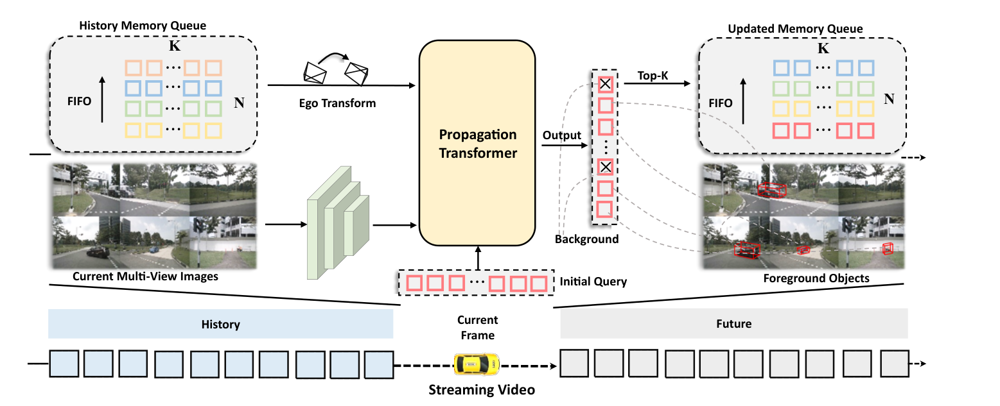
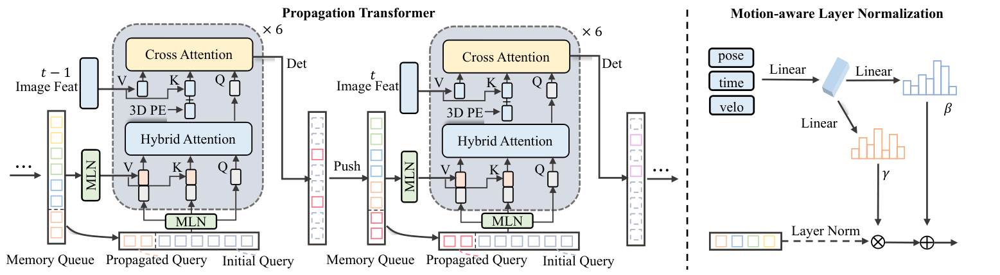
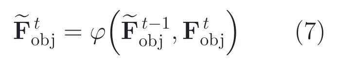
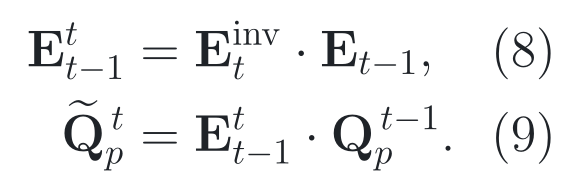
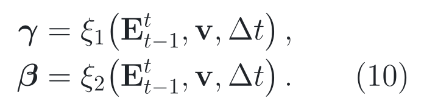
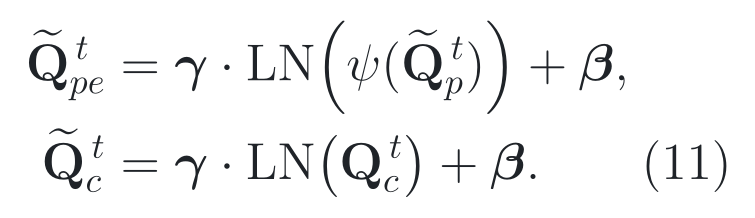
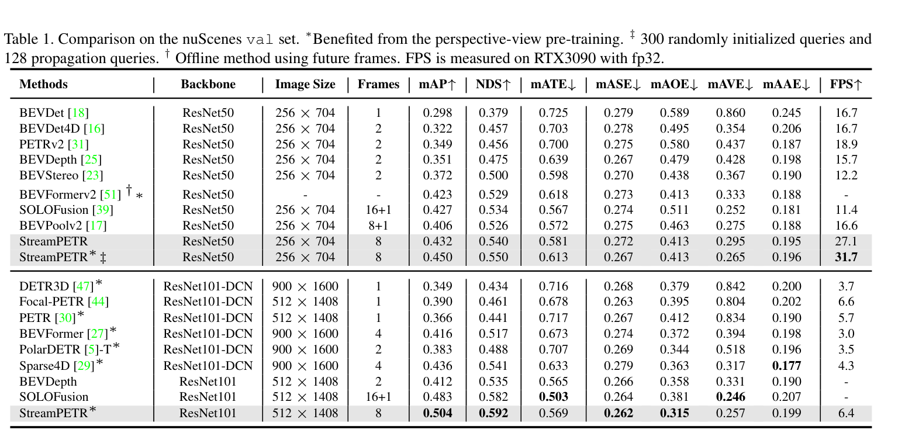
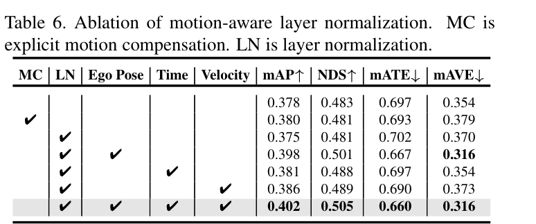
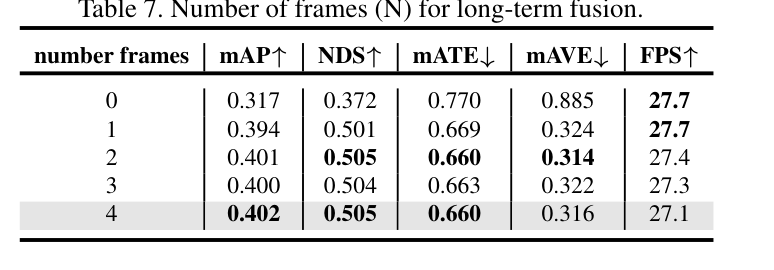

# 2026-08-03 — Exploring Object-Centric Temporal Modeling for Efficient Multi-View 3D Object Detection

`ICCV 2023` · `Accepted` ·
`论文已读 / 官方补充材料未提供 / 固定源码已审 / checkpoint 与结果未运行`

**主方向：** P05 · 时序与预测性感知 ·
**输入模态：** Surround Camera · Vehicle State ·
**交叉标签：** Temporal Modeling、Streaming Perception、3D Object Detection、
Object Query、Memory Queue、Motion-Aware Normalization、Transformer、3D Tracking

[▶ 从第一张图开始](#1-看图论文到底做了什么) ·
[返回首页](../../README.md) · [全部精读](../../index/papers.md) ·
[官方论文](https://openaccess.thecvf.com/content/ICCV2023/papers/Wang_Exploring_Object-Centric_Temporal_Modeling_for_Efficient_Multi-View_3D_Object_Detection_ICCV_2023_paper.pdf) ·
[CVF 正式录用页](https://openaccess.thecvf.com/content/ICCV2023/html/Wang_Exploring_Object-Centric_Temporal_Modeling_for_Efficient_Multi-View_3D_Object_Detection_ICCV_2023_paper.html) ·
[官方代码 @ 95f64702306ccdb7a78889578b2a55b5deb35b2a](https://github.com/exiawsh/StreamPETR/tree/95f64702306ccdb7a78889578b2a55b5deb35b2a)

证据与行文标签：**[原文翻译]** 忠实中文译文；**[笔记解释]** 帮助理解的
通俗讲解；**[论文]** 作者材料直接支持；**[源码]** 固定 commit 直接支持；
**[判断]** 本笔记分析；**[未核验]** 尚未独立运行或确认。译文中不混入解释
或判断。

## 0. 阅读起点：术语先导与摘要完整翻译

### 0.1 首次术语解释

**术语覆盖声明：** 摘要中的核心专业术语先在这里解释；摘要之后第一次出现的
新术语仍在正文首次出现处就地解释。后文锁定同一中文名、英文名、缩写与符号，
方法名、模型名、数据集名及作者自定义名保留原名。

- **长序列建模（long-sequence modeling）**：让当前预测利用多帧历史，而不是
  只把相邻两帧做一次局部融合；本文以在线对象查询记忆承载历史。
- **多视角 3D 目标检测（multi-view 3D object detection）**：从车身周围多台
  相机的同步图像中预测车辆坐标系下的三维类别、位置、尺寸、朝向与速度。
- **稀疏对象查询（sparse object query）**：数量远少于像素或 BEV 网格的可学习
  向量；每个查询竞争表示一个候选对象及其三维参考点。
- **对象中心时序机制（object-centric temporal mechanism）**：只传播高置信
  对象查询及其状态，而不是保存并重算多帧稠密图像或 BEV 特征。
- **在线推理（online inference）**：第 *t* 帧只读当前及过去信息，逐帧更新状态，
  不读取未来帧；这不等于模型在真实车端已经达到端到端实时部署。
- **运动感知层归一化（motion-aware layer normalization, MLN）**：先对对象
  特征做层归一化，再由姿态、时间差和速度生成逐通道缩放与偏移。
- **nuScenes 检测分数（nuScenes Detection Score, NDS）**：综合 mAP 与平移、
  尺寸、朝向、速度、属性误差的检测指标；NDS 不是单纯分类准确率。
- **平均多目标跟踪准确率（Average Multi-Object Tracking Accuracy, AMOTA）**：
  对召回阈值积分的跟踪综合指标；它同时受检测和关联影响，不是纯检测 mAP。
- **每秒帧数（frames per second, FPS）**：在指定硬件、精度、batch 与计时范围下
  的吞吐；跨论文 FPS 只有协议一致时才可直接比较。
- **StreamPETR**：作者给长序列、多视角、对象中心在线 3D 检测框架取的原名，
  不是通用术语；它建立在 PETR 系列稀疏查询检测器之上。

### 0.2 摘要完整专业中文翻译

**原文锚点：** Abstract，PDF p. 1 / proceedings p. 3621。

<a id="abstract-a01"></a>
> **[原文翻译] Abstract · PDF p. 1 · A01**
>
> 本文提出一个名为 StreamPETR 的长序列建模框架，用于多视角 3D 目标检测。
> 在 PETR 系列稀疏查询设计的基础上，我们系统地构建了一种对象中心时序机制。
> 该模型以在线方式运行，长期历史信息通过对象查询逐帧传播。此外，我们引入
> 运动感知层归一化来建模对象的运动。与单帧基线相比，StreamPETR 仅增加可忽略
> 的计算成本便取得显著性能提升。在标准 nuScenes 基准上，它是首个达到与基于
> LiDAR 的方法相当性能的在线多视角方法，取得 67.6% NDS 与 65.3% AMOTA。
> 轻量版本达到 45.0% mAP 和 31.7 FPS，较当时最先进方法 SOLOFusion 高 2.3%
> mAP，速度快 1.8 倍。代码已经公开于作者 GitHub 仓库。

**完整性声明：** 原摘要只有一个实质段落；A01 已按全部九个句子完整、未删减
翻译，保留 online、negligible、first、comparable、数字、指标和比较对象等限定。
官方 PDF 文本层可完整抽取，没有低置信 OCR 片段。

> [!TIP]
> **[笔记解释] 读完摘要再看这一句：** StreamPETR 像值夜班的交通记录员，
> 每帧只把最值得继续跟踪的 256 张“对象卡片”放回记忆；最强证据是一次历史写入
> 就让 R50 的 mAP 从 0.317 到 0.394，但这些卡片在源码里完全 detach，因而不是
> 跨帧反向传播训练出来的循环状态。

**学习顺序：**
[0 摘要与术语](#0-阅读起点术语先导与摘要完整翻译) →
[1 看原图](#1-看图论文到底做了什么) →
[2 读原式](#2-读公式核心机制怎样表达) →
[3 看结果](#3-看结果证据是否支持主张) →
[4 对源码](#4-对源码公式如何落地) →
[5 记结论](#5-记结论贡献边界与开放问题)

## 1. 看图：论文到底做了什么

**30 秒交通故事。** 夜雨中，前车短暂遮住一名正横穿马路的行人。单帧检测器
在遮挡帧可能把人忘掉；保存八帧稠密 BEV 又像把八张城市地图全铺在桌上，移动
对象的位置会错开，计算也重。StreamPETR 的选择是：每帧从 900 个查询中挑出
256 个高分对象，把特征、三维中心、速度、时间与自车姿态作为一张对象卡片写入
队列。下一帧先把旧中心换算到当前自车坐标系，再让当前查询向这些卡片取证。



> **原图出处：** Wang et al., ICCV 2023, Figure 3，PDF p. 3 / proceedings p. 3623。[官方 PDF](https://openaccess.thecvf.com/content/ICCV2023/papers/Wang_Exploring_Object-Centric_Temporal_Modeling_for_Efficient_Multi-View_3D_Object_Detection_ICCV_2023_paper.pdf)。仅作学术讲解所需的局部摘录，原图版权归原作者及其他权利人。

### 这张图按什么顺序看

1. **当前证据：** 六视角图像 *I*<sub>*t*</sub> 经二维骨干网络与颈部网络得到
   多尺度图像特征；Focal Head 还提供训练期二维辅助监督和候选特征选择。
2. **历史证据：** 固定实现维护最多 1,024 个对象槽，即四组每帧 256 个 top-K
   对象；每槽同时保存内容查询、三维中心、速度、时间差与自车位姿。
3. **先对齐再取证：** 历史中心先由自车位姿变换到当前坐标系，MLN 再用运动
   元数据调制内容与位置特征；混合注意力把当前查询和历史记忆放入同一取证集合。
4. **预测与写回：** 六层 decoder 输出分类、三维框和速度；按最高类别分数取
   256 个槽，detach 后前插到 FIFO（先进先出）队列，为下一帧使用。

**看完应能复述：** 当前图像只负责提供新证据，对象查询记忆负责跨帧保留假设，
姿态变换与 MLN 负责让旧假设进入当前帧，top-K 写回闭合在线状态循环。

**这张图没有证明：** 架构图不能证明长期记忆一定正确、运动条件每一项都有效、
远距假阳性得到抑制，也不能证明公开 checkpoint 在本仓库环境中可复现论文数字。



> **原图出处：** Wang et al., ICCV 2023, Figure 4，PDF p. 4 / proceedings p. 3624。[官方 PDF](https://openaccess.thecvf.com/content/ICCV2023/papers/Wang_Exploring_Object-Centric_Temporal_Modeling_for_Efficient_Multi-View_3D_Object_Detection_ICCV_2023_paper.pdf)。仅作学术讲解所需的局部摘录，原图版权归原作者及其他权利人。

### 整体算法架构与创新设计

**原方法瓶颈：** **[论文]** 作者把既有时序相机 3D 检测分成两类：稠密 BEV
方法需要对历史特征做 ego-motion warp，却难以校正独立运动对象的空间错位；
透视视角方法让查询重复访问多帧图像特征，长序列的存储与交叉注意力成本随帧数
增长。来源：论文 §1、Figure 1，PDF p. 1–2。

**主干网络与基线：** **[论文/源码]** 直接单帧基线是 PETR/Focal-PETR：默认
ResNet-50 图像主干输出 stage 3、4 特征，CPFPN 统一为 256 通道，Focal Head 给
二维辅助监督，900 个稀疏查询经六层 PETR decoder 输出 10 类三维框。StreamPETR
的滑窗配置把 900 拆为 644 个当前查询和 256 个传播查询；V2-99、ViT-L 只用于
规模迁移，不是本文原创 backbone。来源：论文 §3、§5.2，PDF p. 2、5；
[固定 SHA 配置](https://github.com/exiawsh/StreamPETR/blob/95f64702306ccdb7a78889578b2a55b5deb35b2a/projects/configs/StreamPETR/stream_petr_r50_flash_704_bs1_8key_2grad_24e.py#L30-L132)。

**继承与新增边界：** **[论文/源码]** 继承项包括 PETR 的图像到三维位置编码、
稀疏查询、Hungarian 匹配、分类/三维框 heads，以及 Focal-PETR 的二维辅助 head；
本文新增或替换的是对象查询 FIFO 记忆、跨帧自车坐标变换、传播查询、混合注意力
和 MLN。nuImages/DD3D/Objects365/COCO 预训练、V2-99 与 ViT-L 是实验资源，不能
记作 StreamPETR 的结构创新。来源：论文 §3–4、Figure 3–4，PDF p. 2–4；
[固定 SHA head](https://github.com/exiawsh/StreamPETR/blob/95f64702306ccdb7a78889578b2a55b5deb35b2a/projects/mmdet3d_plugin/models/dense_heads/streampetr_head.py#L312-L449)。

**端到端信息流：** **[论文/源码]** 六台相机的 *B*×6×3×256×704 图像 →
ResNet-50/CPFPN 的 256 通道多尺度透视特征 → 644 个当前查询 + 最近 256 个传播
查询 → MLN 条件化的内容/位置特征 → 当前 900 查询向自身及其余 768 个历史槽做
混合自注意力 → 向当前图像 token 做交叉注意力 → 分类与 10 维框/速度输出 →
按类别分数 top-256，保存为内容、三维中心、二维速度、时间差、4×4 位姿并前插
到 1,024 槽 FIFO。中心坐标在当前自车坐标系读出、在全局系写回。来源：论文
Figure 3–4、§4.1–4.2，PDF p. 3–4；[固定 SHA 时序对齐](https://github.com/exiawsh/StreamPETR/blob/95f64702306ccdb7a78889578b2a55b5deb35b2a/projects/mmdet3d_plugin/models/dense_heads/streampetr_head.py#L319-L449)。

**总体训练方式：** **[论文/源码]** 论文主结果使用 8 帧滑窗、随机跳过 1 帧；
固定滑窗配置只让最后 2 帧的 backbone/head 建图并返回 loss，前 6 帧以无梯度方式
构造历史。对象中心、内容和速度在每次写回时 detach，所以不存在跨帧反向传播。
损失包括 3D focal 分类、L1 框回归、去噪查询，以及仅训练期的二维质量 focal、
中心度、二维框、GIoU 和中心投影损失。推理同样只读过去，但改为一次一帧，并按
scene token 清空状态。来源：论文 §5.2，PDF p. 5；
[固定 SHA 训练循环](https://github.com/exiawsh/StreamPETR/blob/95f64702306ccdb7a78889578b2a55b5deb35b2a/projects/mmdet3d_plugin/models/detectors/petr3d.py#L104-L136)。

#### 创新模块 1：对象查询记忆队列

**位置与接口：** 位于上一帧 decoder 输出与下一帧传播 Transformer 之间；它把
检测候选变成可持久状态，并在场景切换时整体 reset。

**输入：** 每个 decoder 查询的最高类别概率、内容特征、三维参考中心、预测二维
速度、当前时间戳与自车 4×4 位姿；固定配置每帧候选 900 个。

**内部变换：** 先按每查询最高类别分数取 top-256，再分别 gather 内容、中心、
速度、时间和位姿；内容、中心、速度 detach，中心和位姿变到全局系，最后前插旧
队列，下一次读取时截断到 1,024 槽并换回当前自车系。

**输出：** 最多四帧、每帧 256 槽的对象状态，供最近 256 槽直接成为传播查询，
其余 768 槽成为混合注意力的历史 key/value。

**为什么这样设计：** **[论文] 作者明确动机：** 为避免稠密 BEV 历史的存储、
计算和运动对象错位，作者用稀疏高置信对象作为长期历史载体，从而让成本主要随
对象数而非图像/BEV 空间增长。来源：论文 §1、§4.1，PDF p. 1–3。

**训练信号：** **[源码]** 队列选择和坐标更新没有独立 loss；当前 decoder 的
3D 分类/框 loss 经读取路径训练共享 decoder 与 MLN，但历史内容、中心和速度在
`post_update_memory` 被 detach，梯度不会回到生成旧槽的帧。来源：
[固定 SHA 写回](https://github.com/exiawsh/StreamPETR/blob/95f64702306ccdb7a78889578b2a55b5deb35b2a/projects/mmdet3d_plugin/models/dense_heads/streampetr_head.py#L345-L374)。

**作用与证据：** **[论文]** Table 7 的受控消融把 memory frames 从 0 加到 1，
mAP 由 0.317 到 0.394，增加 0.077 绝对点、约 24.3% 相对；NDS 由 0.372 到
0.501，增加 0.129 绝对点、约 34.7% 相对，表中 FPS 都为 27.7。再从 2 帧增加
到 4 帧时 mAP 仅 0.401→0.402、NDS 均为 0.505，说明收益迅速饱和。来源：论文
Table 7、§5.3，PDF p. 8。

**论文位置：** **[论文]** Figure 3、§4.1、Table 7，PDF p. 3、8。

**源码入口：** **[源码]** [状态 reset、读取与 top-K FIFO 写回 @ 固定 SHA](https://github.com/exiawsh/StreamPETR/blob/95f64702306ccdb7a78889578b2a55b5deb35b2a/projects/mmdet3d_plugin/models/dense_heads/streampetr_head.py#L312-L374)。

#### 创新模块 2：传播查询与混合注意力

**位置与接口：** 位于 MLN 时序对齐之后、当前图像交叉注意力之前；它把最近历史
槽加入当前 query 轴，并把更老历史槽加入 self-attention 的 key/value 轴。

**输入：** 644 个当前查询、最新 256 个传播查询、其余最多 768 个历史内容及其
位置编码；所有特征默认 256 维。

**内部变换：** 最新 256 个历史槽先拼到当前查询，形成 900 个待更新查询；每层
self-attention 的 key/value 再拼接这 900 个查询与剩余历史槽，随后 900 个查询
对当前多视角图像特征做 cross-attention，经过 FFN 后逐层细化。

**输出：** 只输出当前 900 个更新查询，不为额外历史 key/value 产生新预测；
最终分类/框 heads 读取每层 decoder 输出。

**为什么这样设计：** **[论文] 作者明确动机：** 作者希望用对象查询逐帧传递
长期信息，同时仍让当前帧图像纠正历史假设；混合注意力负责对象间时序交互，
图像交叉注意力负责从当前观测取证。来源：论文 §4.2、Figure 4，PDF p. 3–4。

**训练信号：** **[源码]** 当前 900 个输出通过 3D 分类与框回归直接受监督；
传播查询可接收当前帧 loss 的梯度，但作为输入的历史槽已经 detach，因此梯度
到读取边界为止。额外历史 key/value 仅经共享注意力参数间接受训。来源：
[固定 SHA 混合注意力](https://github.com/exiawsh/StreamPETR/blob/95f64702306ccdb7a78889578b2a55b5deb35b2a/projects/mmdet3d_plugin/models/utils/petr_transformer.py#L706-L741)。

**作用与证据：** **[论文]** Table 8 在 object-centric fusion 已启用时加入
propagated query，mAP 从 0.395 到 0.402，增加 0.007 绝对点；NDS 从 0.496 到
0.505，增加 0.009，FPS 都为 27.1。这是有无传播查询的受控比较，但不能把整个
对象记忆的提升都归给传播查询。来源：论文 Table 8、§5.3，PDF p. 8。

**论文位置：** **[论文]** Figure 4、Eq. (7)、§4.2、Table 8，PDF p. 3–4、8。

**源码入口：** **[源码]** [传播查询拼接与历史 key/value 分流 @ 固定 SHA](https://github.com/exiawsh/StreamPETR/blob/95f64702306ccdb7a78889578b2a55b5deb35b2a/projects/mmdet3d_plugin/models/dense_heads/streampetr_head.py#L420-L449)。

#### 创新模块 3：Motion-Aware Layer Normalization（MLN）

**位置与接口：** 位于历史状态坐标变换之后、传播/混合注意力之前；同一条件化
单元分别作用于内容特征和三维位置编码，也作用于零运动的当前查询。

**输入：** 256 维内容或位置特征，以及二维速度、标量时间差和 3×4 自车变换
拼成的 15 维运动元数据；源码先用 NeRF-style 正弦位置编码扩展成 180 维条件。

**内部变换：** 特征先做无可学习仿射的 LayerNorm；条件经 180→256 线性层与
ReLU，再由两个 256→256 线性层分别产生逐通道缩放 γ 与偏移 β，最后执行
归一化特征的通道缩放和偏移。γ 初始化为 1、β 初始化为 0，使模块初始为恒等调制。

**输出：** shape 不变的 256 维运动条件内容和位置特征，供传播查询与混合注意力
计算；它不直接移动三维中心，显式中心变换由自车位姿矩阵完成。

**为什么这样设计：** **[论文] 作者明确动机：** 作者指出仅凭内容和位置查询
难以表达自车运动、对象速度与时间间隔，显式补偿又受速度精度限制，因此用运动
元数据条件化归一化特征，以隐式方式建模对象运动。来源：论文 §4.3，PDF p. 4。

**训练信号：** **[源码]** MLN 没有独立监督；当前帧 decoder 的分类与框 loss
经注意力直接训练 MLN 参数。历史特征与速度在队列写回时 detach，所以 loss 不会
跨帧回传到旧预测；当前 query 的条件为零速度、零时间和单位位姿。来源：
[固定 SHA MLN 调用](https://github.com/exiawsh/StreamPETR/blob/95f64702306ccdb7a78889578b2a55b5deb35b2a/projects/mmdet3d_plugin/models/dense_heads/streampetr_head.py#L428-L439)。

**作用与证据：** **[论文]** Table 6 的受控消融从无 MLN baseline 加入完整
ego pose + time + velocity MLN，mAP 0.378→0.402，增加 0.024 绝对点、约
6.35% 相对；NDS 0.483→0.505，增加 0.022、约 4.55% 相对。只加入 ego pose
已到 0.398/0.501；再加 time 与 velocity 仅各再到 0.402/0.505，不能把完整增益
分别归给时间或速度。来源：论文 Table 6、§5.3，PDF p. 8。

**论文位置：** **[论文]** Figure 4、Eq. (10)–(11)、§4.3、Table 6，PDF p. 4、8。

**源码入口：** **[源码]** [MLN 定义与恒等初始化 @ 固定 SHA](https://github.com/exiawsh/StreamPETR/blob/95f64702306ccdb7a78889578b2a55b5deb35b2a/projects/mmdet3d_plugin/models/utils/misc.py#L154-L188)。

## 2. 读公式：核心机制怎样表达

### 原文公式 1：对象查询递推

**原文公式：** 论文 Eq. (7)，PDF p. 3。

<p align="center"><picture><source media="(prefers-color-scheme: dark)" srcset="../../assets/notes/2026-08-03-streampetr/formulas/eq-07-object-recurrence-dark.png"></picture></p>

> **公式来源：** Wang et al., ICCV 2023, Eq. (7)，PDF p. 3；本图按原符号重排。[官方 PDF](https://openaccess.thecvf.com/content/ICCV2023/papers/Wang_Exploring_Object-Centric_Temporal_Modeling_for_Efficient_Multi-View_3D_Object_Detection_ICCV_2023_paper.pdf) · [可复制 TeX](../../assets/notes/2026-08-03-streampetr/formulas/source.tex#L5-L12)。

**符号说明**

- ***F̃***<sub>obj</sub><sup>*t*</sup>：时刻 *t* 经时序增强后的对象特征；
- ***F***<sub>obj</sub><sup>*t*</sup>：当前帧由图像证据形成的对象特征；
- *φ*：论文抽象的传播 Transformer 更新函数。

**纯文字读法：** 当前增强对象特征等于更新函数对“上一帧增强对象特征”和
“当前帧对象特征”的联合处理结果。

**玩具例子：** 假设旧对象卡片认为前车在 20 米处、当前图像只给到一个模糊新
查询；*φ* 可以先从旧卡片维持“有车”假设，再用当前图像把中心修到 19 米。
这是教学示例，不是论文实验，也不是式子定义的数值运算。

**专业解释：** Eq. (7) 只声明递推依赖，没有把记忆长度、top-K、注意力 mask、
坐标变换或梯度边界展开；真正实现不是一个标准 RNN cell。

**回到上面的图：** 对应 Figure 3 中从 object memory → propagation transformer →
预测 → top-K object memory 的闭环。

**落到源码：** [历史读取、decoder 与写回 @ 固定 SHA](https://github.com/exiawsh/StreamPETR/blob/95f64702306ccdb7a78889578b2a55b5deb35b2a/projects/mmdet3d_plugin/models/dense_heads/streampetr_head.py#L566-L606)

**公式省略了什么：** 固定实现用 644+256 个当前/传播查询、余下 768 个历史
key/value、六层 decoder 和完全 detach 的 top-256 写回；因此 Eq. (7) 不能被读成
对任意长历史做端到端反向传播。

### 原文公式 2：自车运动坐标对齐

**原文公式：** 论文 Eq. (8)–(9)，PDF p. 4。

<p align="center"><picture><source media="(prefers-color-scheme: dark)" srcset="../../assets/notes/2026-08-03-streampetr/formulas/eq-08-09-ego-alignment-dark.png"></picture></p>

> **公式来源：** Wang et al., ICCV 2023, Eq. (8)–(9)，PDF p. 4；本图按原符号重排。[官方 PDF](https://openaccess.thecvf.com/content/ICCV2023/papers/Wang_Exploring_Object-Centric_Temporal_Modeling_for_Efficient_Multi-View_3D_Object_Detection_ICCV_2023_paper.pdf) · [可复制 TeX](../../assets/notes/2026-08-03-streampetr/formulas/source.tex#L14-L23)。

**符号说明**

- ***E***<sub>*t*</sub><sup>inv</sup>：当前帧自车位姿矩阵的逆；
- ***E***<sub>*t*−1</sub>：历史帧自车位姿；
- ***E***<sup>*t*</sup><sub>*t*−1</sub>：从历史自车系到当前自车系的相对变换；
- ***Q***<sub>*p*</sub><sup>*t*−1</sup>：历史查询的三维中心；
- ***Q̃***<sub>*p*</sub><sup>*t*</sup>：换到当前自车系的历史中心。

**纯文字读法：** 先用当前位姿的逆乘历史位姿得到历史到当前的坐标变换，再用
该变换作用于历史对象中心。

**玩具例子：** 如果自车在两帧间前进 1 米，而一辆静止路边车原先位于自车前方
10 米，忽略旋转时其当前相对距离应约为 9 米。这只是教学数字，真实式子使用齐次
4×4 变换并同时处理旋转和平移。

**专业解释：** 这一步只补偿自车运动；独立运动对象还需要速度、时间和后续图像
证据。把它叫“完整运动补偿”会夸大式子能力。

**回到上面的图：** 对应 Figure 3 记忆队列右侧的 ego pose transform 箭头。

**落到源码：** [历史中心与位姿换到当前坐标系 @ 固定 SHA](https://github.com/exiawsh/StreamPETR/blob/95f64702306ccdb7a78889578b2a55b5deb35b2a/projects/mmdet3d_plugin/models/dense_heads/streampetr_head.py#L329-L337)

**公式省略了什么：** 源码保存时先把当前中心转到全局系，读取时再乘当前逆位姿；
`prev_exists` 为 0 会把整组记忆乘零，首帧还用不可学习 pseudo reference points
填充传播槽。

### 原文公式 3：运动条件生成仿射参数

**原文公式：** 论文 Eq. (10)，PDF p. 4。

<p align="center"><picture><source media="(prefers-color-scheme: dark)" srcset="../../assets/notes/2026-08-03-streampetr/formulas/eq-10-motion-affine-dark.png"></picture></p>

> **公式来源：** Wang et al., ICCV 2023, Eq. (10)，PDF p. 4；本图按原符号重排。[官方 PDF](https://openaccess.thecvf.com/content/ICCV2023/papers/Wang_Exploring_Object-Centric_Temporal_Modeling_for_Efficient_Multi-View_3D_Object_Detection_ICCV_2023_paper.pdf) · [可复制 TeX](../../assets/notes/2026-08-03-streampetr/formulas/source.tex#L25-L33)。

**符号说明**

- *γ*、*β*：分别为 256 维逐通道缩放与偏移；
- ***v***：对象的二维预测速度；
- Δ*t*：历史槽到当前帧的时间差；
- *ξ*<sub>1</sub>、*ξ*<sub>2</sub>：从运动元数据到仿射参数的可学习映射。

**纯文字读法：** 同一组相对位姿、速度和时间差分别经两个映射，得到控制特征
每个通道的缩放值与偏移值。

**玩具例子：** 若一个归一化通道值为 0.5，条件网络给出 γ=1.2、β=−0.1，
调制后为 0.5；这个一维示例只解释仿射操作，不代表论文 learned weights。

**专业解释：** 软条件化不要求速度精确到足以直接移动中心，却也不能保证抵抗
错误速度；网络可能主要依赖姿态，Table 6 正显示 ego pose 提供大部分增益。

**回到上面的图：** 对应 Figure 4 右侧 MLN 的 motion information → MLP → γ/β。

**落到源码：** [180 维条件编码与 MLN 调用 @ 固定 SHA](https://github.com/exiawsh/StreamPETR/blob/95f64702306ccdb7a78889578b2a55b5deb35b2a/projects/mmdet3d_plugin/models/dense_heads/streampetr_head.py#L428-L436)

**公式省略了什么：** 源码把二维速度、1 维时间和 3×4 位姿共 15 个数做
NeRF-style 编码成 180 维；当前查询用零速度、零时间和单位位姿作为条件。

### 原文公式 4：MLN 调制内容与位置

**原文公式：** 论文 Eq. (11)，PDF p. 4。

<p align="center"><picture><source media="(prefers-color-scheme: dark)" srcset="../../assets/notes/2026-08-03-streampetr/formulas/eq-11-motion-aware-features-dark.png"></picture></p>

> **公式来源：** Wang et al., ICCV 2023, Eq. (11)，PDF p. 4；本图按原符号重排。[官方 PDF](https://openaccess.thecvf.com/content/ICCV2023/papers/Wang_Exploring_Object-Centric_Temporal_Modeling_for_Efficient_Multi-View_3D_Object_Detection_ICCV_2023_paper.pdf) · [可复制 TeX](../../assets/notes/2026-08-03-streampetr/formulas/source.tex#L35-L47)。

**符号说明**

- *ψ*(***Q̃***<sub>*p*</sub><sup>*t*</sup>)：对齐后三维中心的位置编码；
- ***Q***<sub>*c*</sub><sup>*t*</sup>：历史对象的内容查询；
- LN：沿特征通道计算的层归一化；
- ***Q̃***<sub>*pe*</sub><sup>*t*</sup>、***Q̃***<sub>*c*</sub><sup>*t*</sup>：运动调制后的
  位置与内容特征。

**纯文字读法：** 先分别归一化位置编码和内容查询，再用同一运动条件生成的 γ、β
逐通道缩放并平移两类特征。

**玩具例子：** 两张内容向量尺度不同的对象卡片经 LN 后都落在可比较范围；若其中
一张来自更久以前，条件网络可以用更大的 Δ*t* 调整某些通道。它不是把“久”必然
映成“低权重”，具体含义由下游检测 loss 学习。

**专业解释：** MLN 改变的是注意力所见表示，不是一个显式 Kalman 更新，也没有
输出概率不确定性。逐通道仿射只能表达条件化特征重标定，无法替代复杂几何搜索。

**回到上面的图：** 对应 Figure 4 中 MLN 同时输出 motion-aware query content
与 positional embedding 的两条箭头。

**落到源码：** [LayerNorm、γ/β 与恒等初始化 @ 固定 SHA](https://github.com/exiawsh/StreamPETR/blob/95f64702306ccdb7a78889578b2a55b5deb35b2a/projects/mmdet3d_plugin/models/utils/misc.py#L154-L188)

**公式省略了什么：** 源码 LayerNorm 关闭自身 affine，条件先经 180→256+ReLU，
再由两个 256→256 线性层产生 γ/β；γ 权重、β 权重为零，偏置分别初始化为 1/0。

## 3. 看结果：证据是否支持主张

### 3.1 原文公开的实验配置

**原文锚点：** 主论文 §5.1–5.5，PDF p. 4–8 / proceedings p. 3624–3628；
CVF 页面未提供独立 supplemental 链接；固定 SHA 的 config、运行文档与脚本。

- **数据集与划分：** **[论文]** nuScenes 有 1,000 个约 20 秒场景，关键帧 2 Hz，
  六相机覆盖 360°，评 10 类；按官方 train/val/test 划分。Waymo 实验用相机约
  230° 视野、75 米范围和 20% 训练数据。来源：论文 §5.1、§5.4，PDF p. 4、8。
- **传感器、输入与范围：** **[论文/源码]** 仅用环视相机，论文主设置为
  256×704 或 320×800；固定 R50 滑窗配置使用 256×704，检测范围约为
  *x,y*=±51.2 米、*z*=−5 到 3 米。来源：论文 §5.2，PDF p. 5；
  [固定 SHA 配置](https://github.com/exiawsh/StreamPETR/blob/95f64702306ccdb7a78889578b2a55b5deb35b2a/projects/configs/StreamPETR/stream_petr_r50_flash_704_bs1_8key_2grad_24e.py#L9-L29)。
- **预处理与增强：** **[论文/源码]** 论文称沿用 PETR；源码随机 resize 0.38–0.55、
  水平翻转、自车系旋转约 ±22.5°、尺度 0.95–1.05、标准化、32 倍 pad，并在模型
  中启用 GridMask。来源：论文 §5.2，PDF p. 5；
  [固定 SHA pipeline](https://github.com/exiawsh/StreamPETR/blob/95f64702306ccdb7a78889578b2a55b5deb35b2a/projects/configs/StreamPETR/stream_petr_r50_flash_704_bs1_8key_2grad_24e.py#L153-L180)。
- **硬件、软件与依赖：** **[源码]** setup 指定 Python 3.8、CUDA 11.2、PyTorch
  1.9、MMDetection3D 1.0.0rc6，并为主配置使用 flash-attention 0.2.2；README
  称训练时间在 8×2080 Ti 上、FPS 在 RTX 3090、batch 1、FP32 且不用 flash
  attention 测得。GPU 训练显存峰值原文未公开。来源：
  [固定 SHA setup](https://github.com/exiawsh/StreamPETR/blob/95f64702306ccdb7a78889578b2a55b5deb35b2a/docs/setup.md#L1-L40)。
- **初始化与冻结：** **[论文/源码]** R50/R101 用 ImageNet 与 nuImages，V2-99
  用 DD3D，ViT-L 用 Objects365/COCO；滑窗 R50 config 从 torchvision R50
  初始化，backbone 不冻结但其学习率乘 0.25，BatchNorm 参数不训练。来源：论文
  §5.2，PDF p. 5；[固定 SHA 配置](https://github.com/exiawsh/StreamPETR/blob/95f64702306ccdb7a78889578b2a55b5deb35b2a/projects/configs/StreamPETR/stream_petr_r50_flash_704_bs1_8key_2grad_24e.py#L36-L46)。
- **优化器、学习率与 scheduler：** **[论文/源码]** 论文报告 AdamW、batch 16、
  基础学习率 4e-4、cosine；论文结果用固定滑窗 config 实际为 8 GPU×1、全局
  batch 8、基础学习率 2e-4、权重衰减 0.01、500 iter 线性 warmup、cosine 到
  1e-3 倍，backbone 再乘 0.25。两者按线性缩放一致但数值配置不同。来源：论文
  §5.2，PDF p. 5；[固定 SHA optimizer](https://github.com/exiawsh/StreamPETR/blob/95f64702306ccdb7a78889578b2a55b5deb35b2a/projects/configs/StreamPETR/stream_petr_r50_flash_704_bs1_8key_2grad_24e.py#L227-L250)。
- **帧采样、轮数与损失：** **[论文/源码]** 消融训练 24 epochs、主比较 60、
  ViT-L 24；只用 keyframes，不用 CBGS，训练随机跳一帧。滑窗配置取 8 帧且
  `random_length=1`，只有最后 2 帧产生 loss；3D focal 权重 2、框 L1 0.25，
  另有去噪与二维辅助 losses。来源：论文 §5.2，PDF p. 5；
  [固定 SHA 配置](https://github.com/exiawsh/StreamPETR/blob/95f64702306ccdb7a78889578b2a55b5deb35b2a/projects/configs/StreamPETR/stream_petr_r50_flash_704_bs1_8key_2grad_24e.py#L21-L132)。
- **随机性、重复与选模：** **[未核验]** 论文未公开随机种子、独立重复次数、
  方差或显著性检验。训练入口默认 seed 为 0、deterministic 关闭；滑窗 config
  只在 epoch 24 评估，checkpoint 每 epoch 保存且只保留 3 个，论文/源码未说明
  从多次运行中选最佳模型。来源：论文 §5.2–5.4，PDF p. 5–8；
  [固定 SHA checkpoint 配置](https://github.com/exiawsh/StreamPETR/blob/95f64702306ccdb7a78889578b2a55b5deb35b2a/projects/configs/StreamPETR/stream_petr_r50_flash_704_bs1_8key_2grad_24e.py#L246-L252)。
- **推理、阈值与后处理：** **[源码]** 推理 batch 为 1，scene token 变化即 reset，
  每调用一帧并更新状态；NMSFreeCoder 对展平的 query×class sigmoid 分数取 top-300，
  固定配置没有 score threshold 或 NMS，只按中心范围过滤。来源：
  [固定 SHA 推理状态](https://github.com/exiawsh/StreamPETR/blob/95f64702306ccdb7a78889578b2a55b5deb35b2a/projects/mmdet3d_plugin/models/detectors/petr3d.py#L293-L320)、
  [固定 SHA coder](https://github.com/exiawsh/StreamPETR/blob/95f64702306ccdb7a78889578b2a55b5deb35b2a/projects/mmdet3d_plugin/core/bbox/coders/nms_free_coder.py#L39-L89)。
- **指标与公平性：** **[论文]** 报告 nuScenes mAP、NDS、mATE/mASE/mAOE/mAVE/mAAE、
  FPS，以及跟踪 AMOTA/AMOTP/Recall/IDS。mAP 不等于总体 accuracy；低 mAVE
  只说明速度误差较小，不证明框类别正确；AMOTA 还包含下游关联。部分 Table 1
  方法的预训练、查询数、分辨率不同，不能把差值全归给时序机制。来源：论文
  Table 1–4、§5.2–5.4，PDF p. 5–8。
- **checkpoint 与运行入口：** **[源码/未核验]** README 提供模型与 log；论文
  结果来自滑窗配方，但默认训练文档命令指向额外的 streaming config。作者说明
  streaming 约省 4×训练小时，却有“滑窗 60 epochs≈流式 90 epochs”的收敛差异。
  本笔记未下载 checkpoint、未运行数据准备、训练、前向或评测。来源：
  [固定 SHA 训练文档](https://github.com/exiawsh/StreamPETR/blob/95f64702306ccdb7a78889578b2a55b5deb35b2a/docs/training_inference.md#L1-L42)。

### 3.2 原文公开的实验流程

**原文锚点：** 主论文 §4、§5.1–5.4，PDF p. 2–8；官方 CVF 页面未提供独立
supplement；固定 SHA 数据、训练、推理和评测入口。

1. **数据准备与预处理：** **[论文/源码]** 按 nuScenes 官方划分生成 temporal
   infos，逐关键帧加载六相机、标注、内外参、时间戳和 ego pose，再做 resize、
   翻转、全局旋转缩放、标准化与 pad。来源：论文 §5.1–5.2，PDF p. 4–5；
   [固定 SHA pipeline](https://github.com/exiawsh/StreamPETR/blob/95f64702306ccdb7a78889578b2a55b5deb35b2a/projects/configs/StreamPETR/stream_petr_r50_flash_704_bs1_8key_2grad_24e.py#L147-L180)。
2. **训练与优化：** **[论文/源码]** 从预训练 backbone 初始化，8 帧滑窗随机跳
   1 帧；前 6 帧无梯度建立 detached memory，最后 2 帧回传二维辅助、3D 分类、
   框回归与去噪 losses；AdamW+warmup+cosine 训练 24 或 60 epochs。来源：论文
   §5.2，PDF p. 5；[固定 SHA 训练循环](https://github.com/exiawsh/StreamPETR/blob/95f64702306ccdb7a78889578b2a55b5deb35b2a/projects/mmdet3d_plugin/models/detectors/petr3d.py#L104-L136)。
3. **checkpoint 保存、验证与选模：** **[源码/未核验]** 固定滑窗配置每 epoch
   保存、最多保留 3 个，只在第 24 epoch 验证；论文未公开随机重复、early stopping
   或最佳 checkpoint 选择规则。来源：[固定 SHA runtime](https://github.com/exiawsh/StreamPETR/blob/95f64702306ccdb7a78889578b2a55b5deb35b2a/projects/configs/StreamPETR/stream_petr_r50_flash_704_bs1_8key_2grad_24e.py#L246-L252)。
4. **在线推理与后处理：** **[源码]** 场景首帧清空五类 prediction-relevant
   memory；之后逐帧提取图像特征、读历史、解码、top-K 写回，再由 NMS-free coder
   取 top-300 并按中心范围过滤。来源：[固定 SHA inference](https://github.com/exiawsh/StreamPETR/blob/95f64702306ccdb7a78889578b2a55b5deb35b2a/projects/mmdet3d_plugin/models/detectors/petr3d.py#L293-L320)。
5. **最终检测、跟踪与迁移评测：** **[论文/源码]** nuScenes val/test 用官方检测
   指标；test 结果提交服务器。跟踪把检测 JSON 交给下游 tracker 评 AMOTA/AMOTP；
   Waymo 用相机子集与 20% 训练数据报告 LET-mAP/mAPH/mAPL。来源：论文 §5.2–5.4，
   PDF p. 5–8；[固定 SHA 跟踪命令](https://github.com/exiawsh/StreamPETR/blob/95f64702306ccdb7a78889578b2a55b5deb35b2a/docs/training_inference.md#L12-L26)。

**复现仍缺什么：** **[未核验]** 没有独立 supplement、论文结果 checkpoint 的
文件哈希、随机重复/方差、完整训练硬件时长与滑窗主结果逐项命令闭环；本仓库没有
下载 nuScenes/Waymo、checkpoint 或老版本 CUDA 栈，也没有数值追踪静态差异。

### 3.3 核心结果



> **原图出处：** Wang et al., ICCV 2023, Table 1，PDF p. 5 / proceedings p. 3625。[官方 PDF](https://openaccess.thecvf.com/content/ICCV2023/papers/Wang_Exploring_Object-Centric_Temporal_Modeling_for_Efficient_Multi-View_3D_Object_Detection_ICCV_2023_paper.pdf)。仅作学术讲解所需的局部摘录，原图版权归原作者及其他权利人。

**先看公平对照。** R50、R101、V2-99 的预训练、图像尺寸、查询数和训练轮数并非
完全一致。最接近的轻量对照中，StreamPETR R50、8 frames、nuImages 预训练为
0.450 mAP / 0.550 NDS / 31.7 FPS；SOLOFusion 为 0.427 / 0.534 / 11.4 FPS，
即 +0.023 mAP（约 +5.39% 相对）、+0.016 NDS（约 +3.00% 相对）、约 2.78×
表中 FPS。摘要写 1.8× faster，来自作者采用的口径，不能用这里的简单商替代。



> **原图出处：** Wang et al., ICCV 2023, Table 6，PDF p. 8 / proceedings p. 3628。[官方 PDF](https://openaccess.thecvf.com/content/ICCV2023/papers/Wang_Exploring_Object-Centric_Temporal_Modeling_for_Efficient_Multi-View_3D_Object_Detection_ICCV_2023_paper.pdf)。仅作学术讲解所需的局部摘录，原图版权归原作者及其他权利人。

**MLN 主效应与小组件。** 无 MLN 为 0.378 mAP / 0.483 NDS；完整 MLN 为
0.402 / 0.505，分别 +0.024、+0.022。ego-only 已到 0.398 / 0.501，说明表内
大部分增益来自 ego pose 条件；time 和 velocity 在 ego-only 上合计再 +0.004 /
+0.004。显式 motion compensation 只到 0.380 / 0.481，普通 LN 为 0.375 /
0.481，但表格没有多 seed 方差，不能据此断言任何 0.004 差值稳定。



> **原图出处：** Wang et al., ICCV 2023, Table 7，PDF p. 8 / proceedings p. 3628。[官方 PDF](https://openaccess.thecvf.com/content/ICCV2023/papers/Wang_Exploring_Object-Centric_Temporal_Modeling_for_Efficient_Multi-View_3D_Object_Detection_ICCV_2023_paper.pdf)。仅作学术讲解所需的局部摘录，原图版权归原作者及其他权利人。

**记忆不是越长越好。** 0→1 帧带来最大跃升；1→2 帧再 +0.007 mAP、+0.004
NDS；2→4 帧只有 +0.001 mAP、NDS 不变，FPS 27.4→27.1。这个曲线支持“一点
历史很值”，不支持“更长历史持续增长”，也没有测试几十秒长记忆。

### 三个必须看的对照

1. **最强主结果：** **[论文]** nuScenes test 的 ViT-L StreamPETR 达到 0.620
   mAP / 0.676 NDS；跟踪 AMOTA 0.653、AMOTP 0.876。它们证明系统上限，不是
   R50 单模块的公平消融。
2. **关键模块消融：** **[论文]** Table 6、7、8 分别控制 MLN 条件、记忆帧数和
   object/perspective/propagated query，能支撑模块粒度归因；最大单次跃升来自
   memory 0→1。
3. **迁移与效率：** **[论文]** Waymo 20% 数据上，保存间隔 τ=1 与 τ=5 的
   LET-mAP 为 0.551/0.553，接近但非完全相同；固定 nuScenes head 源码每次调用
   都写回，未找到独立 τ 开关，不能把 Waymo 采样设置直接套到该 config。

### 证据支持

- **[论文]** 对象中心历史在 nuScenes 相机 3D 检测上比单帧基线有大幅受控增益，
  且前两帧历史贡献最大；
- **[论文]** MLN 优于无 MLN、普通 LN 和表内显式运动补偿，ego pose 是主要条件；
- **[论文]** 在作者硬件与协议下，R50 轻量模型保持接近单帧的 FPS，并在 Waymo
  20% 数据设置下有跨数据集证据；
- **[源码]** 固定实现确有完整的状态读、坐标变换、MLN、传播查询、混合注意力、
  top-K detach 写回与 scene reset 链路。

### 证据没有支持

- **[未核验]** 没有多 seed、置信区间或统计检验，不能断言 0.004 等小增益稳定；
- **[判断]** NDS/mAP 较高不等于概率校准、低事故风险或远距对象安全；
- **[论文]** 作者 §5.5 明确展示远处对象假阳性，因而平均指标不能消除长尾失败；
- **[未核验]** 跟踪用下游关联器，AMOTA 不证明 StreamPETR 自身学习了端到端
  identity association；
- **[未核验]** 本笔记没有运行 checkpoint，源码已审不等于结果已复现；
- **[判断]** 表内在线 FPS 不自动覆盖数据传输、车端编译、功耗、抖动与最坏时延。

## 4. 对源码：公式如何落地

```text
six-camera frame
→ ResNet-50 + CPFPN + Focal Head
→ pre_update_memory: reset / current-coordinate read
→ temporal_alignment: MLN + 256 propagated queries
→ hybrid self-attention + current-image cross-attention
→ class / box / velocity heads
→ post_update_memory: top-256 detach + global-coordinate FIFO write
```

### 1. 状态读与 reset：`pre_update_memory`

- **论文对应：** Figure 3 与 Eq. (8)–(9) 的历史记忆读取和自车坐标对齐。
- **源码行为：** 五个 prediction-relevant state 是 `memory_embedding`、
  `memory_reference_point`、`memory_timestamp`、`memory_egopose`、`memory_velo`；
  `prev_exists` 乘零清空场景，中心/位姿从全局系换到当前自车系。
- **需要留意：** 这些都影响后续预测，不是 evaluation-only state；检测器在
  `scene_token` 变化时 reset。若数据顺序或 token 错，旧场景状态会污染新场景。
- [打开固定 SHA 状态读取](https://github.com/exiawsh/StreamPETR/blob/95f64702306ccdb7a78889578b2a55b5deb35b2a/projects/mmdet3d_plugin/models/dense_heads/streampetr_head.py#L312-L343)

### 2. 运动条件化：`temporal_alignment` 与 `MLN`

- **论文对应：** Figure 4 与 Eq. (10)–(11) 的运动元数据条件化。
- **源码行为：** 当前查询使用零速度/时间与单位位姿；历史查询使用保存的速度、
  时间和 3×4 位姿，15 维元数据经正弦编码到 180 维，再调制 256 维内容/位置。
- **需要留意：** MLN 不直接改三维中心，也不产生置信度；它读到的历史速度来自
  旧预测且已 detach，错误可能沿状态链继续影响注意力。
- [打开固定 SHA MLN](https://github.com/exiawsh/StreamPETR/blob/95f64702306ccdb7a78889578b2a55b5deb35b2a/projects/mmdet3d_plugin/models/utils/misc.py#L154-L188)

### 3. 历史取证：`PETRTemporalDecoderLayer._forward`

- **论文对应：** Figure 4 中 Hybrid Attention 与 Image Cross-Attention。
- **源码行为：** 最新 256 历史槽先成为当前 query；余下历史只拼到 self-attention
  key/value。随后所有当前 query 只向当前帧图像 memory 做 cross-attention。
- **需要留意：** 论文 Eq. (7) 把更新抽象成 *φ*，没有暴露“最新历史是 query、
  更老历史仅是 key/value”的不对称；实现只输出当前 query，不更新旧 key/value。
- [打开固定 SHA decoder](https://github.com/exiawsh/StreamPETR/blob/95f64702306ccdb7a78889578b2a55b5deb35b2a/projects/mmdet3d_plugin/models/utils/petr_transformer.py#L706-L741)

### 4. 状态写回：`post_update_memory`

- **论文对应：** Figure 3 的 top-K object memory update。
- **源码行为：** 用每查询最大类别 sigmoid 分数取 top-256；中心、内容、速度显式
  detach，时间置零，中心与位姿转回全局系，再前插 FIFO。
- **需要留意：** top-K 不是类别均衡选择，也没有不确定性或 track identity；
  假阳性可被高分写入并在后续帧传播。静态审计没有数值追踪其错误累积率。
- [打开固定 SHA 写回](https://github.com/exiawsh/StreamPETR/blob/95f64702306ccdb7a78889578b2a55b5deb35b2a/projects/mmdet3d_plugin/models/dense_heads/streampetr_head.py#L345-L374)

### 5. 训练/推理状态差：`obtain_history_memory` 与 `simple_test_pts`

- **论文对应：** §5.2 的滑窗训练与在线推理。
- **源码行为：** 训练 8 帧中前 6 帧无梯度、末 2 帧算 loss；推理每次只处理一帧，
  scene token 决定 reset。二者都只读过去，均没有未来帧 teacher forcing。
- **需要留意：** 训练一次 batch 内有 8 帧，推理则依赖跨调用状态和严格序列顺序；
  batch 1 假设、漏帧、重排或并行场景 slot 都是部署风险。
- [打开固定 SHA 训练循环](https://github.com/exiawsh/StreamPETR/blob/95f64702306ccdb7a78889578b2a55b5deb35b2a/projects/mmdet3d_plugin/models/detectors/petr3d.py#L104-L136)

<details>
<summary><strong>展开完整源码审计、环境和复现风险</strong></summary>

- **官方身份：** 作者摘要链接与 CVF 论文均指向 `exiawsh/StreamPETR`；审计固定
  commit 为 `95f64702306ccdb7a78889578b2a55b5deb35b2a`，审计时也是远端 main。
- **许可证：** 根目录 `LICENSE` 为 Apache-2.0，版权声明 Megvii Inc. 2023；
  本仓库只保存原创笔记和必要论文局部裁图，不复制大型源码、权重或 PDF。
- **状态更新：** 五类预测状态都由 head 原地替换；没有检测 evaluator 专用的
  evaluation-only state。下游 nuScenes tracker 另有自己的关联状态，不属于检测 head。
- **训练梯度：** 历史帧构造、队列写回均被 no-grad/detach 阻断；当前帧 loss 能
  训练读取历史的共享 decoder/MLN，但不能回到产生旧查询的计算图。
- **配方差异：** 论文写 batch 16 / 4e-4；结果用滑窗固定配置是 8×1 / 2e-4。
  README 默认文档还提供 streaming config，它约省 4×小时但收敛更慢。两种配方
  不能混用 checkpoint 与训练预算后仍声称严格复现。
- **保存间隔：** 论文 Waymo Table 4 报 τ=1/5；本次在固定 nuScenes head/config
  没找到显式 τ 参数，每次 head 调用都会写回。它可能由数据采样控制，未公开闭环。
- **后处理：** top-300 query-class 分数、中心范围过滤、无 NMS、默认无分数阈值；
  “NMS-free”不等于没有任何选择或过滤。
- **依赖风险：** Python 3.8、CUDA 11.2、Torch 1.9、MMCV/MMDet3D rc 与旧版
  flash-attention 对现代 GPU/驱动不友好，复现可能需要容器或兼容补丁。
- **checkpoint / 数据：** 官方 release 提供模型、log 与数据准备说明；本阅读未
  下载或校验权重哈希，也未获得 nuScenes/Waymo 数据。
- **最短公开入口：** 训练文档给出分布式训练、测试、跟踪和 benchmark 命令；
  但文档默认训练配置是 streaming，不是论文滑窗主结果配置。
- **复现状态：** `Audited` 只表示论文与固定 SHA 静态源码已审；未编译、未运行
  前向、训练、checkpoint、跟踪或论文消融，不把“源码已读”写成“结果已复现”。

</details>

## 5. 记结论：贡献、边界与开放问题

### 5.1 原文结论完整翻译

**原文锚点：** `6. Conclusion`，PDF p. 8–9 / proceedings p. 3628–3629。

<a id="conclusion-c01"></a>
> **[原文翻译] Conclusion · `6. Conclusion` / PDF p. 8–9 · C01**
>
> 本文提出 StreamPETR，一种有效的长序列 3D 目标检测器。不同于先前工作，
> 本方法探索了一种对象中心范式，通过对象查询逐帧传播时序信息。此外，我们采用
> 运动感知层归一化来引入运动信息。StreamPETR 在仅增加可忽略存储与计算成本的
> 情况下取得了领先的性能提升。它是首个达到与基于 LiDAR 的方法相当性能的在线
> 多视角方法。我们希望 StreamPETR 能为社区的长序列建模提供一些新见解。

**完整性声明：** `6. Conclusion` 只有一个实质段落；C01 已按跨 PDF p. 8–9 的
全部六句完整、未删减翻译，保留作者对“有效”“可忽略”“首个”“相当”的原始
主张强度以及最后的希望式语气。

### 5.2 原文局限与展望完整翻译

**原文锚点：** `5.5 Failure Cases`，PDF p. 8 / proceedings p. 3628；
`6. Conclusion`，PDF p. 8–9。论文没有独立 Limitations 或 Future Work / Outlook。

<a id="limitations-l01"></a>
> **[原文翻译] Limitations · `5.5 Failure Cases` / PDF p. 8 · L01**
>
> 我们展示了图像中出现大量远处对象的情况。如第一行所示，模型会生成许多假阳性。
> 这是基于相机的方法中的常见现象，并且会造成大量假阳性。幸运的是，这些假阳性
> 是可容忍的，因为在复杂城市环境中，它们对真阳性几乎没有影响。

**完整性声明：** 作者没有独立 Limitations；L01 完整翻译了真实 `5.5 Failure
Cases` 的唯一连续文字段落，包括远处对象、大量假阳性以及作者“可容忍”的判断。
`6. Conclusion` 没有额外明确局限或未来工作句。

**原文缺失声明：** （Limitations）论文没有独立 Limitations；本节按真实
`5.5 Failure Cases` 翻译作者明确讨论的失败，不代写、不补写作者未承认的局限。

**原文缺失声明：** （Future Work）论文没有独立 Future Work / Outlook，已检查
`5.5 Failure Cases` 与 `6. Conclusion`，没有作者明确提出的未来工作；本节不代写、
不补写、不虚构 O01 或作者未提出的展望。

### 5.3 笔记分析与研究启发

**[笔记解释]** 把 StreamPETR 记成一个“对象级事件日志”：图像产生新证据，
历史对象卡片提供连续性，MLN 把卡片的运动元数据变成特征调制，混合注意力完成
新旧取证，top-K detach 写回阻止显存随时间爆炸。

**[判断]** 以下批评、研究切口和可证伪实验是本笔记分析，不是作者已经证明的
结论，也不自动代表学界没有相邻工作。

#### 5.3.1 学完必须记住的三点

1. **[论文] 方法核心：** 不保存稠密历史图，而把高置信对象查询、中心、速度、
   时间和位姿作为在线稀疏隐状态，逐帧读写。
2. **[论文/源码] 最强证据：** Table 7 的 memory 0→1 帧让 mAP 0.317→0.394、
   NDS 0.372→0.501；固定源码确实以 top-256 detach FIFO 实现该闭环。
3. **[判断] 最大缺口：** 历史由模型自己打分、自己写回却没有不确定性或跨帧
   梯度；远距假阳性、状态陈旧和配方差异会形成指标均值看不见的错误累积风险。

#### 5.3.2 论文—源码最需要警惕的四处边界

1. **训练配方：** 论文 batch 16 / 4e-4，滑窗固定配置实际全局 batch 8 / 2e-4；
   默认流式配方又与论文结果滑窗配方不同。
2. **递推语义：** Eq. (7) 看似一般递推，源码把最近 256 槽当 query、更老 768
   槽只当 key/value，所有写回内容/中心/速度都 detach。
3. **保存间隔：** 论文 Waymo 使用 τ，固定 nuScenes head 每次调用写回，未找到
   显式 τ 开关，不能假定同一实现覆盖全部表格协议。
4. **失败强度：** 作者把远距假阳性称为可容忍，但没有按距离、天气、遮挡或最坏
   场景量化；“几乎不影响真阳性”也不等于安全成本可忽略。

#### 5.3.3 可迁移原则：先把时序状态当接口，再谈时序网络

- **已观察事实：** 稀疏对象状态能用很小 FPS 代价取得大幅平均精度增益，但收益
  在 1–2 帧后饱和；MLN 的主贡献主要来自 ego pose。
- **仍不知道：** 提升究竟来自真实长期身份连续性、短期再检测提示，还是更大的
  有效 query 集；错误状态在远距与遮挡场景会传播多久也没有量化。
- **最小判别实验：** 固定 backbone、head、900 query 和训练预算，做五组：无
  memory、正确顺序 memory、帧顺序打乱、中心/内容分别清零、带置信度衰减与 reset
  的 memory；按距离和遮挡分桶，至少五个 seeds 报 mAP/NDS、假阳性存活时间、
  calibration 与最坏 5% 场景。
- **什么结果会推翻假设：** 若帧顺序打乱或只增加同数目的随机查询与正确 memory
  同样好，则“对象状态提供时序连续性”并非主要原因；若显式短窗匹配更稳且同速，
  长期 FIFO 的迁移价值就应被降级。
- **相邻工作边界：** “这篇没有量化错误累积”不等于学界未研究时序置信度；后续
  应另行检索 state uncertainty、query denoising 与 streaming robustness，而不是
  把本笔记问题直接宣称为 novelty。

<details>
<summary><strong>身份、许可与证据账本</strong></summary>

- **Venue 与权威录用来源：** ICCV 2023；CVF open access 正式页面与 proceedings
  页码 3621–3631 已核验，publication status 记为 Accepted。
- **Paper / supplement：** 官方 CVF PDF 已逐页阅读；CVF 页面仅列 paper/arXiv，
  未提供独立 supplemental 链接。
- **官方仓库与固定 commit：** `exiawsh/StreamPETR` @
  `95f64702306ccdb7a78889578b2a55b5deb35b2a`。
- **License：** Apache-2.0，Megvii Inc. 2023。
- **Checkpoint：** 官方 release 有模型和 log 链接；未下载、未校验哈希、未运行。
- **已读源码：** R50 滑窗/流式配置、数据 pipeline、Petr3D 训练/推理、
  StreamPETRHead、MLN、temporal decoder、NMSFreeCoder、训练/评测文档。
- **尚未运行或核验：** nuScenes/Waymo 数据生成、CUDA/flash-attention 编译、
  checkpoint 前向、训练、检测/跟踪评测、论文数字与静态差异的数值影响。

</details>

> [!NOTE]
> 发布前已按仓库门禁检查公式 light/dark pair、TeX block/manifest、原图出处邻接、
> 零 live MathJax、索引一致性及公开 GitHub 页面；`Audited` 永远只表示固定源码
> 静态审计，不代表结果已复现。
