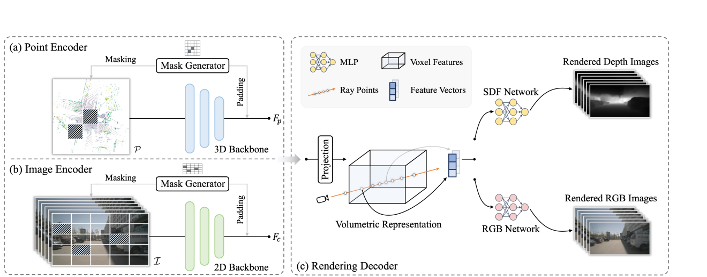
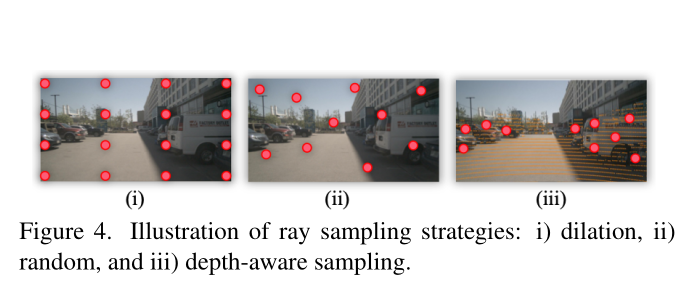
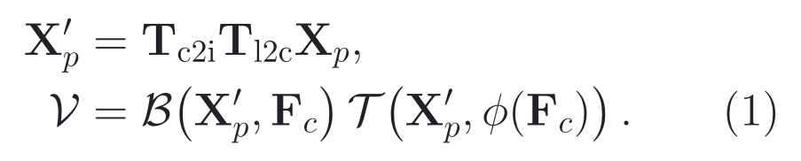
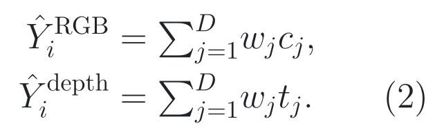
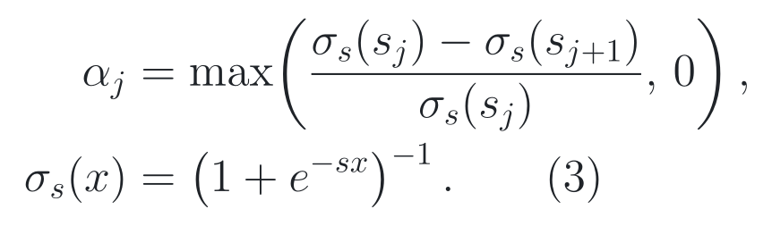
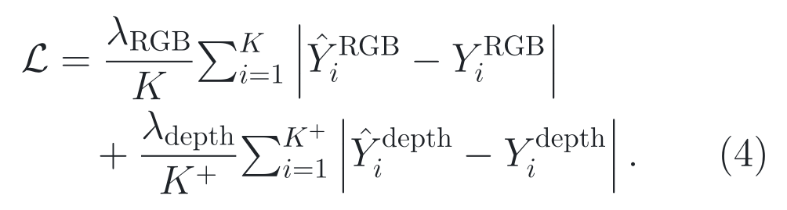
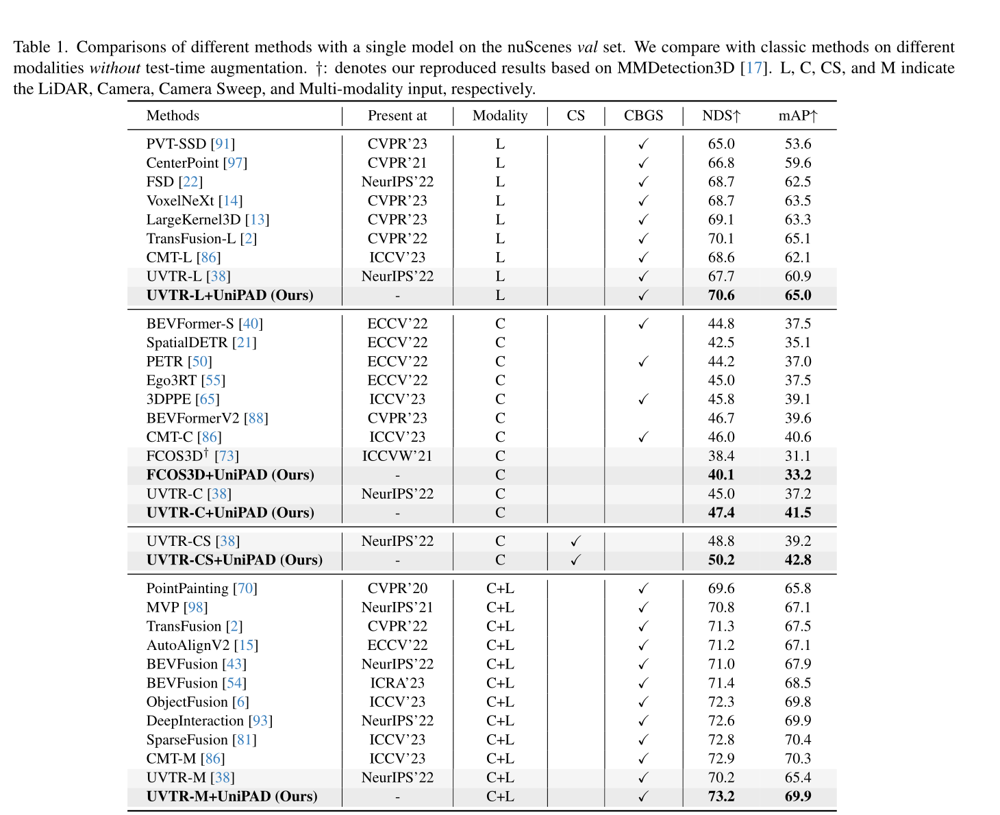
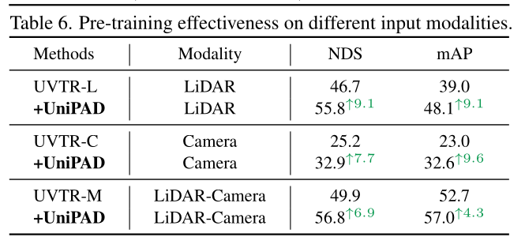
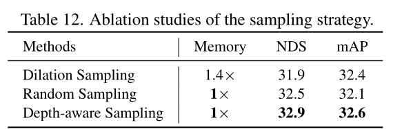

# 2026-08-04 — UniPAD: A Universal Pre-training Paradigm for Autonomous Driving

`CVPR 2024` · `Accepted` · `论文、补充材料与源码已读 / Checkpoint 未运行`

**主方向：** P10 · 数据中心学习与基础预训练  
**输入模态：** Surround Camera · LiDAR  
**交叉标签：** 自监督学习、预训练、可微渲染、体积表示、深度感知采样、3D 目标检测、3D 语义分割、多模态学习

[▶ 从第一张图开始](#1-看图论文到底做了什么) ·
[返回首页](../../README.md) · [全部精读](../../index/papers.md) ·
[官方论文](https://openaccess.thecvf.com/content/CVPR2024/papers/Yang_UniPAD_A_Universal_Pre-training_Paradigm_for_Autonomous_Driving_CVPR_2024_paper.pdf) ·
[官方代码 @ 3d24add15f887a4c5b7b54cb3a6b4a812c24ca52](https://github.com/Nightmare-n/UniPAD/tree/3d24add15f887a4c5b7b54cb3a6b4a812c24ca52)

证据与行文标签：**[原文翻译]** 忠实中文译文；**[笔记解释]** 帮助理解的通俗讲解；**[论文]** 作者材料直接支持；**[源码]** 固定 commit 直接支持；**[判断]** 本笔记分析；**[未核验]** 尚未独立运行或确认。译文中不混入解释或判断。

## 0. 阅读起点：术语先导与摘要完整翻译

### 0.1 首次术语解释

**术语覆盖声明：** 以下先解释摘要中的核心专业术语；摘要之后第一次出现的新术语仍在正文就地解释。方法名、模型名和数据集名保留原名，后文固定使用这里的中文名、英文名、缩写与语义。

- **自动驾驶感知（autonomous driving perception）**：车辆用传感器估计周围物体、道路和三维空间结构的过程；本文只研究感知表示的预训练与下游检测、分割，不研究规划或控制。
- **特征学习（feature learning）**：从数据中学习可供下游任务复用的中间表示；本文目标是让相机和 LiDAR 编码器在标注较少时仍学到有用的三维特征。
- **自监督学习（self-supervised learning, SSL）**：从数据本身构造监督信号而不依赖人工类别标签；UniPAD 用被遮挡场景的颜色与深度重建作为预训练目标。
- **三维体积可微渲染（3D volumetric differentiable rendering）**：沿相机射线在三维体积中采样，并以可求梯度的方式合成像素颜色和深度；重建误差可反向传播到三维表示和编码器。
- **隐式三维表示（implicit 3D representation）**：不直接保存显式网格表面，而用神经网络在任意三维位置查询几何量和外观；本文查询有符号距离、颜色及渲染权重。
- **连续形状（continuous shape）**：几何不只落在离散体素中心，而能通过位置查询和插值描述体素之间的表面。
- **复杂二维外观（complex 2D appearance）**：相机图像中随视角、材质和光照变化的 RGB 颜色；UniPAD 在几何之外也重建它。
- **LiDAR（Light Detection and Ranging，激光雷达）**：通过激光测距产生稀疏三维点；本文既把它作为输入模态，也把投影后的深度用作相机预训练监督。
- **相机–LiDAR 融合（camera–LiDAR fusion）**：联合相机外观和点云几何进行感知；摘要中的 fusion 指下游输入模态，不等于预训练完全不使用跨传感器监督。
- **nuScenes Detection Score（NDS）**：nuScenes 将检测精度和若干定位、尺度、朝向、速度、属性误差组合得到的综合分数；NDS 不是总体 accuracy，也不能直接代表闭环驾驶安全。
- **平均交并比（mean Intersection over Union, mIoU）**：逐类别计算预测区域与真值区域的交集除以并集，再对类别取平均；mIoU 不是逐点总体 accuracy，少数类和多数类的权重不同。
- **UniPAD（A Universal Pre-training Paradigm for Autonomous Driving）**：作者提出的预训练范式名称；“Universal”指它在本文测试的相机、LiDAR、融合和若干下游架构间共享三维渲染接口，不是对所有传感器、数据域或任务的普适保证。

### 0.2 摘要完整专业中文翻译

**原文锚点：** Abstract，PDF p. 1 / proceedings p. 15238。

> **[原文翻译] Abstract · PDF p. 1 / proceedings p. 15238 · A01**
>
> 有效的特征学习对于自动驾驶感知至关重要。然而，现有三维自监督学习方法大多直接改造二维方法，未能充分利用三维数据中的独特性质。本文提出 UniPAD，一种基于自监督三维体积可微渲染的通用自动驾驶预训练范式。通过利用隐式三维表示，UniPAD 能够重建连续形状和复杂二维外观。该范式无缝整合二维和三维表示，并可被直接用于各种自动驾驶任务。大量实验表明，UniPAD 分别将基于 LiDAR、基于相机和融合基线的 NDS 提升了 9.1、7.7 和 6.9 个点。此外，UniPAD 在 nuScenes 验证集上取得了领先结果：三维目标检测达到 73.2 NDS，语义分割达到 79.4 mIoU，超过了先前方法。

**完整性声明：** 上述 A01 按原摘要唯一实质段落逐句完整翻译，保留了转折、因果、模态范围、数值、指标和验证集限定；官方 PDF 文本清晰，无抽取不明处。9.1、7.7、6.9 个 NDS 来自低数据消融设置，完整数据主结果的增益较小，详见 Section 3；这句是证据定位，不改写摘要。

> [!TIP]
> **[笔记解释] 读完摘要再看这一句：** UniPAD 把相机和点云先变成统一三维体积，再靠渲染颜色与深度来预训练编码器；它在 nuScenes 低数据实验中很强，但相机预训练仍借助 LiDAR 深度，且尚无跨数据域或闭环安全证据。

**学习顺序：**
[0 摘要与术语](#0-阅读起点术语先导与摘要完整翻译) →
[1 看原图](#1-看图论文到底做了什么) →
[2 读原式](#2-读公式核心机制怎样表达) →
[3 看结果](#3-看结果证据是否支持主张) →
[4 对源码](#4-对源码公式如何落地) →
[5 记结论](#5-记结论贡献边界与开放问题)

## 1. 看图：论文到底做了什么

### 30 秒故事

想象一辆车驶近路口：相机看见红色车身和交通灯，LiDAR 给出稀疏的距离点。普通掩码预训练会让网络补回被遮挡的图像块或体素，但“补一个离散格子”不一定迫使它理解连续路面、车辆表面与视角之间的关系。UniPAD 的做法是先遮住部分输入，再要求编码器构成一个可从相机视角重新渲染颜色和深度的三维体积。若体积几何错了，射线合成的深度就错；若语义外观弱，RGB 也重建不好。这样，监督目标不再是孤立格子，而是“这个三维场景能否解释实际观测”。

> **原图出处：** Yang et al., CVPR 2024, Figure 2，PDF p. 3 / proceedings p. 15240。[官方 PDF](https://openaccess.thecvf.com/content/CVPR2024/papers/Yang_UniPAD_A_Universal_Pre-training_Paradigm_for_Autonomous_Driving_CVPR_2024_paper.pdf)。仅作学术讲解所需的局部摘录，原图版权归原作者及其他权利人。

### 这张图按什么顺序看

1. 左侧先选输入：点云 *P* 或多视角图像 *I*；Block Masking 按空间块隐藏一部分观测。
2. 中间经过模态特定编码器：点云使用 VoxelNet，图像使用 ConvNeXt 与特征金字塔网络；两条路径都被投到稠密三维体积。
3. 右侧对穿过该体积的相机射线采样，几何网络预测有符号距离，颜色网络预测 RGB，再合成深度与颜色。
4. 训练只比较渲染结果和传感器观测；下游检测时移除渲染解码器，把已预训练的编码器、特征金字塔和视图变换权重交给检测器。

**看完应能复述：** UniPAD 用“遮挡输入 → 统一三维体积 → 沿射线渲染 → 颜色和深度重建”的信息流，把不同模态的预训练目标对齐到三维场景解释能力。

### 整体算法架构与创新设计

**原方法瓶颈：** [论文] §1 与 §3.1，PDF pp. 1–3 指出现有三维自监督学习多由二维对比学习或掩码自编码迁移而来：对比学习依赖正负样本构造且训练开销大；对稀疏点云做离散体素重建难以表达连续表面；对整个稠密体积均匀渲染又会带来不可接受的内存开销。

**主干网络与基线：** [论文] 默认相机主干是 ConvNeXt-S，点云主干是 VoxelNet；模态特定的特征金字塔网络（Feature Pyramid Network, FPN）把不同尺度特征汇总。主要三维检测直接基线是 UVTR，分割基线是 SpUNet（§4.1–§4.2，PDF pp. 5–6）。UVTR、ConvNeXt、VoxelNet、FPN、NeuS 和 MMDetection3D 都是继承组件，不是本文原创。

**继承与新增边界：** [论文][源码] UniPAD 新增的是把块状遮挡、模态到体积的适配投影、基于有符号距离函数的体积渲染预训练，以及深度感知射线采样组织成统一范式（§3.1–§3.4，PDF pp. 3–5）。块状遮挡借鉴 MAE/GD-MAE，NeuS 渲染与 SDFStudio 实现被复用；基础编码器本身的能力不能写成 UniPAD 的创新。替换 ConvNeXt-S、SECOND 或不同视图变换只用于可迁移性实验，不是默认主干。

**端到端信息流：** [论文][源码] 六路环视图像的默认公开预训练配置输入单帧图像，同时加载最多十帧累积 LiDAR sweep 生成深度监督；图像经 32 像素块、0.3 遮挡率和 ConvNeXt-S/FPN 后，以 LiDAR 坐标系体素中心投影到各相机并汇聚为 180 × 180 × 5 的体积。点云路径用 0.075 m × 0.075 m × 0.2 m 输入体素、8 体素块和 0.8 遮挡率，经 VoxelNet/SECOND/FPN 形成同类体积。投影卷积把通道压到 32；每视角选择 512 条射线，每条射线共取 96 个样本点；SDF 与 RGB 网络合成颜色和深度。预训练后渲染头被丢弃，编码器、FPN 和视图变换进入检测或分割 heads（Figure 2、§3.1–§4.1，PDF pp. 3–5；[固定相机配置](https://github.com/Nightmare-n/UniPAD/blob/3d24add15f887a4c5b7b54cb3a6b4a812c24ca52/projects/configs/unipad/uvtr_cam_vs0.075_pretrain.py)）。三维目标检测 head 输出 10 类、最多保留 300 个框。这里的 sweep 是输入聚合，不是递归预测状态。

**总体训练方式：** [论文][源码] 先做 12 epochs 自监督预训练，再把权重装入下游模型进行微调；相机最终配置的 ConvNeXt-S 由 ImageNet-1K 权重初始化且第一 stage 冻结，点云编码器按公开配置训练。预训练对相机随机遮挡、对点云移除被遮挡的稀疏体素；主要 RGB 与有效深度 L1 损失共同训练渲染投影、SDF/RGB 网络，并通过可微采样间接训练可见的编码器特征。相机预训练时 LiDAR 深度是监督信息，因此训练所见模态多于下游“camera-only”输入。射线索引选择不可微；冻结 stage 不接收梯度（§3.1–§4.1，PDF pp. 3–5；[固定训练脚本](https://github.com/Nightmare-n/UniPAD/blob/3d24add15f887a4c5b7b54cb3a6b4a812c24ca52/tools/dist_train_ssl.sh#L13-L26)）。源码训练脚本默认四卡且使用 `--no-validate`，随后微调；论文和源码都未给重复试验或方差。

#### 创新单元 1：块状遮挡输入

**位置与接口：** 位于图像或点云数据进入模态编码器之前；上游是传感器输入，下游是 ConvNeXt-S 或稀疏点云编码器。

**输入：** 图像特征网格或稀疏体素坐标；相机默认 32 像素块、0.3 遮挡率，点云默认 8 体素块、0.8 遮挡率。

**内部变换：** 相机路径随机保留固定数量的空间块并把隐藏位置置零；点云路径生成块级 mask 后直接移除隐藏体素。固定配置中 `learnable=False`，因此没有可学习 mask token。

**输出：** 只含可见上下文、并保留空间布局的图像或点云特征；后续渲染要求它们解释未直接观察的场景区域。

**为什么这样设计：** [论文] 作者明确动机见 §3.1，PDF p. 3：从输入中移除部分信息可阻止网络只复制观测，并迫使编码器学习上下文和整体场景表示。

**训练信号：** [源码] 该单元无独立分类损失。渲染 RGB/深度误差通过共享编码器参数间接训练可见块；被移除或置零的输入本身不接收梯度，冻结的相机第一 stage 也不更新（[MaskConvNeXt.forward](https://github.com/Nightmare-n/UniPAD/blob/3d24add15f887a4c5b7b54cb3a6b4a812c24ca52/projects/mmdet3d_plugin/models/backbones/mask_convnext.py#L216-L247)）。

**作用与证据：** [论文] 补充材料 Table 1，PDF p. 2 的受控对照在相同 depth-aware 采样和 RGB-only 条件下加入 mask，使 NDS 从 26.7 到 27.9，增加 1.2 点；在 RGB+depth 条件下从 31.7 到 32.9，同样增加 1.2 点。这是有无 mask 的直接干预，但仅有单次 nuScenes 低数据设置，不能推出任意遮挡率都有效。

**论文位置：** [论文] §3.1，PDF p. 3；Supplementary Table 1，PDF p. 2。

**源码入口：** [源码] [图像遮挡](https://github.com/Nightmare-n/UniPAD/blob/3d24add15f887a4c5b7b54cb3a6b4a812c24ca52/projects/mmdet3d_plugin/models/backbones/mask_convnext.py#L216-L247) 与 [点云遮挡](https://github.com/Nightmare-n/UniPAD/blob/3d24add15f887a4c5b7b54cb3a6b4a812c24ca52/projects/mmdet3d_plugin/models/middle_encoders/mask_sparse_encoder_hd.py#L112-L143)，固定仓库 Nightmare-n/UniPAD @ `3d24add15f887a4c5b7b54cb3a6b4a812c24ca52`。

#### 创新单元 2：统一三维体积与模态投影

**位置与接口：** 位于模态编码器/FPN 之后、渲染解码器之前；把二维图像特征或稀疏点云特征转换为 LiDAR 坐标系中的稠密体积。

**输入：** 多尺度图像特征及标定矩阵，或点云编码特征；最终相机配置的空间范围约为横纵各 −54 m 到 54 m、高度 −5 m 到 3 m。

**内部变换：** 点云路径用三维卷积与 FPN 填充体积；相机路径把每个三维体素中心投影到各相机平面，双线性采图像特征，并结合预测的离散深度分布汇聚多视角证据；随后三维卷积把体积投影为 32 通道渲染特征。

**输出：** 180 × 180 × 5 × 32 的默认渲染体积；每个连续查询点再通过三线性插值得到局部特征。

**为什么这样设计：** [论文] 作者明确动机见 §3.2，PDF pp. 3–4：统一体积让二维与三维编码器都能连接同一个三维渲染目标，并使连续位置可通过插值查询。

**训练信号：** [源码] RGB/深度损失直接训练渲染投影卷积，并经视图变换和插值间接训练可见图像/点云特征。标定矩阵、体素坐标和离散射线选择不是可学习变量（[Uni3DViewTrans.forward](https://github.com/Nightmare-n/UniPAD/blob/3d24add15f887a4c5b7b54cb3a6b4a812c24ca52/projects/mmdet3d_plugin/models/utils/uni3d_viewtrans.py#L139-L244)）。

**作用与证据：** [论文] Table 13，PDF p. 8 的受控比较以 projection 为干预：完整预训练并微调 projection 得 32.9 NDS / 32.6 mAP；相比完整设置，移除微调阶段的 projection 更新后降至 30.2 / 29.7，NDS 下降 2.7 点；预训练时不训练 projection 为 31.1 / 30.5；预训练和微调共享 projection 为 32.1 / 32.0。Table 5 还显示不同视图变换上均有 5.2–6.3 NDS 增益。证据支持“适配层要在两个阶段正确交接”，不把全部系统收益单独归因给一个卷积。

**论文位置：** [论文] Figure 2 与 §3.2，PDF pp. 3–4；Table 5，PDF p. 7；Table 13，PDF p. 8。

**源码入口：** [源码] [Uni3DViewTrans](https://github.com/Nightmare-n/UniPAD/blob/3d24add15f887a4c5b7b54cb3a6b4a812c24ca52/projects/mmdet3d_plugin/models/utils/uni3d_viewtrans.py#L123-L244)，固定仓库 Nightmare-n/UniPAD @ `3d24add15f887a4c5b7b54cb3a6b4a812c24ca52`。

#### 创新单元 3：基于有符号距离函数的渲染预训练

**位置与接口：** 位于统一三维体积之后；上游提供射线采样点的体积特征，下游输出每条射线的 RGB 和深度预测。

**输入：** 射线原点、方向、96 个深度位置、三线性插值特征和视角方向。**有符号距离函数（Signed Distance Function, SDF）** 表示查询点到最近表面的带符号距离，零等值面对应表面。

**内部变换：** 六层口径的 SDF 多层感知机预测几何与隐特征，四层口径的 RGB 多层感知机结合视角、表面法向和几何特征预测颜色；NeuS 把相邻样本的 SDF 转成透明度，再沿射线进行加权合成。

**输出：** 渲染 RGB、渲染深度以及训练期几何中间量；渲染头只服务预训练，不进入下游部署。

**为什么这样设计：** [论文] 作者明确动机见 §3.3，PDF p. 4：连续隐式表面可比离散体素目标更细致地编码三维几何，颜色分支又让相机外观成为监督。

**训练信号：** [源码] RGB L1 对所有采样射线直接监督颜色合成；深度 L1 只对深度真值大于零的射线生效。两者直接训练渲染头与体积投影，并通过可微插值间接训练未冻结编码器（[BaseSurfaceModel.loss](https://github.com/Nightmare-n/UniPAD/blob/3d24add15f887a4c5b7b54cb3a6b4a812c24ca52/projects/mmdet3d_plugin/models/render_utils/models/base_surface_model.py#L120-L138)）。

**作用与证据：** [论文] Supplementary Table 1，PDF p. 2 的受控对照显示：在 depth-aware、无 mask 设置中，仅 RGB 渲染由 25.2 NDS 基线提升到 26.7；加入 depth loss 后到 31.7。Table 11，PDF p. 8 在同一完整设置比较渲染器，NeuS 为 32.9 / 32.6，略高于 VolSDF 的 32.8 / 32.4 与 UniSurf 的 32.5 / 32.1。前者是训练目标受控干预，后者只支持渲染器选择的小差异。

**论文位置：** [论文] §3.3 与 Eq. (2)–(4)，PDF pp. 4–5；Table 11，PDF p. 8；Supplementary Table 1，PDF p. 2。

**源码入口：** [源码] [NeuS 前向](https://github.com/Nightmare-n/UniPAD/blob/3d24add15f887a4c5b7b54cb3a6b4a812c24ca52/projects/mmdet3d_plugin/models/render_utils/models/neus.py#L34-L53) 与 [SDF/RGB 字段](https://github.com/Nightmare-n/UniPAD/blob/3d24add15f887a4c5b7b54cb3a6b4a812c24ca52/projects/mmdet3d_plugin/models/render_utils/fields/sdf_field.py#L151-L275)，固定仓库 Nightmare-n/UniPAD @ `3d24add15f887a4c5b7b54cb3a6b4a812c24ca52`。

#### 创新单元 4：深度感知射线采样

**位置与接口：** 位于渲染前的数据选择环节；上游是投影到相机平面的 LiDAR 点与图像，下游是固定预算的射线集合。

**输入：** LiDAR 三维点、相机标定、图像边界和每视角 512 条射线预算；固定源码还使用 3–50 m 的平面半径过滤。

**内部变换：** 先把 LiDAR 点投影到各相机，保留边界内且满足距离过滤的像素；若候选超过预算则无放回抽样，若不足则从跳过顶部 40% 区域、步长为 4 的图像网格补足。补入的射线没有有效深度，只参与 RGB 损失。

**输出：** 每视角 512 个像素坐标、对应 RGB，以及有效时的深度；后续每条射线取 72 个均匀样本和 24 个重要性样本。

**为什么这样设计：** [论文] 作者明确动机见 §3.4，PDF pp. 4–5：均匀稠密渲染昂贵，随机采样又可能把预算花在缺少几何监督的位置；优先使用有 LiDAR 深度的像素可提高监督密度。

**训练信号：** [源码] 采样本身由离散索引与 NumPy 随机选择完成，不接收梯度；被选择的 RGB 监督全部射线，深度损失只通过有效深度 mask 作用于有 LiDAR 投影的射线（[采样实现](https://github.com/Nightmare-n/UniPAD/blob/3d24add15f887a4c5b7b54cb3a6b4a812c24ca52/projects/mmdet3d_plugin/models/dense_heads/render_head.py#L152-L298)）。

**作用与证据：** [论文] Table 12，PDF p. 8 的受控比较在同一低数据设置直接替换采样策略：depth-aware 为 1× memory、32.9 NDS / 32.6 mAP；random 为 1×、32.5 / 32.1；dilation 为 1.4×、31.9 / 32.4。它支持相对随机采样增加 0.4 NDS / 0.5 mAP，同时不增加表中内存倍率；没有训练时间、FLOPs、方差或安全收益证据。

**论文位置：** [论文] Figure 4 与 §3.4，PDF pp. 4–5；Table 12，PDF p. 8。

**源码入口：** [源码] [RenderHead.sample_rays](https://github.com/Nightmare-n/UniPAD/blob/3d24add15f887a4c5b7b54cb3a6b4a812c24ca52/projects/mmdet3d_plugin/models/dense_heads/render_head.py#L152-L298)，固定仓库 Nightmare-n/UniPAD @ `3d24add15f887a4c5b7b54cb3a6b4a812c24ca52`。

> **原图出处：** Yang et al., CVPR 2024, Figure 4，PDF p. 5 / proceedings p. 15242。[官方 PDF](https://openaccess.thecvf.com/content/CVPR2024/papers/Yang_UniPAD_A_Universal_Pre-training_Paradigm_for_Autonomous_Driving_CVPR_2024_paper.pdf)。仅作学术讲解所需的局部摘录，原图版权归原作者及其他权利人。

**[笔记解释] 图与模块的对应：** 灰色网格是所有可能射线，红点是实际花费渲染预算的位置。深度感知采样把大部分预算放在 LiDAR 能给几何真值的像素；固定源码为保证凑满 512 条还加入 RGB-only 网格回退，因此实际实现不是“所有射线都有深度”的纯净版本。

## 2. 读公式：核心机制怎样表达

**变量身份图例：** **[领域惯用]** 表示语义角色在本领域常见，但不表示所有论文都使用同一个字母；**[本文定义]** 表示论文给该符号赋予了本文特定含义；**[源码/笔记重排]** 表示固定源码等价式或本笔记计算新增的符号。

### Eq. (1)：从模态特征形成统一体积

**原文公式：** 论文 Eq. (1)，PDF p. 4 / proceedings p. 15241。

<picture><source media="(prefers-color-scheme: dark)" srcset="../../assets/notes/2026-08-04-unipad/formulas/eq-01-view-transform-dark.png"></picture>

> **公式来源：** Yang et al., CVPR 2024, Eq. (1)，PDF p. 4 / proceedings p. 15241。[官方 PDF](https://openaccess.thecvf.com/content/CVPR2024/papers/Yang_UniPAD_A_Universal_Pre-training_Paradigm_for_Autonomous_Driving_CVPR_2024_paper.pdf)。公式图按原符号重排，原式版权归原作者及其他权利人；可复制 TeX 见 [source.tex](../../assets/notes/2026-08-04-unipad/formulas/source.tex#L5-L14)。

**先建立画面：** **[笔记解释]** 把三维体素当成空仓位：先拿仓位的三维地址去相机图或点云特征里找邻近货物，再按距离和深度可信度称重，最后把货物放回这个仓位。

**变量逐项解释与身份：** **[领域惯用]** *p* 是空间点索引、*m* 是模态索引，角色常见但字母可换；**[本文定义]** *X**p* 是三维查询点，***T***c2i 与 ***T***l2c 依次完成相机到图像、LiDAR 到相机的坐标变换，***F****c* 是相机编码特征；**[本文定义]** 𝓑 是双线性采样、𝒯 是深度缩放、*φ* 产生深度分布，𝒱 是写入点 *p* 的体积特征。矩阵 shape 随齐次坐标约定变化，实际坐标系须以标定链为准。

**变量变化会怎样：** 投影点靠近某个特征格时该格插值权重增大；深度概率降低会同比压低写入体积的相机特征。点投到图像外或深度无效时应被 mask，而不是产生可解释的负贡献。

**符号说明：** ***F****m* 是模态 *m* 的编码特征；*X**p* 是三维查询点；***T****m* 把查询点映射到相应模态坐标；***B****m* 是双线性或三线性插值；***S****m* 是模态相关的缩放函数；***V****p* 是点 *p* 的体积特征。

**纯文字读法：** 先把三维点转换到相机像素或点云特征坐标，在邻近格点插值得到特征，再用模态相关权重缩放，得到该三维位置的统一特征。

**教学小例子：** [笔记解释] 一辆车表面点投影到图像的四个相邻特征格，双线性权重若为 0.4、0.3、0.2、0.1，就把四个格的特征按这四个比例加权；若深度分布认为该体素只对应 0.6 概率，再乘 0.6 后写入体积。数值仅用于解释运算，不是论文实验。

**专业解释：** 公式刻意把相机和 LiDAR 抽象为同一个接口，但二者的 ***T***、***B*** 和 ***S*** 并不相同。这个抽象支持共享渲染任务，不证明两种模态的统计性质已经完全对齐。

**图对应：** Figure 2 中 “Modality-specific FPN → Dense Voxel Representation → Projection” 就是该式在流水线中的位置。

**固定源码映射：** [源码] [Uni3DViewTrans.forward](https://github.com/Nightmare-n/UniPAD/blob/3d24add15f887a4c5b7b54cb3a6b4a812c24ca52/projects/mmdet3d_plugin/models/utils/uni3d_viewtrans.py#L139-L244) 显式构造体素网格、投影到相机、采图像特征和离散深度概率，再跨相机求和。

**公式省略的实现细节：** 固定源码的相机路径不是单一缩放函数，而是学习深度分布后做 grid sampling；构造函数还直接把参考体素送到 CUDA，设备可移植性需要运行时复核。

### Eq. (2)：沿射线合成颜色与深度

**原文公式：** 论文 Eq. (2)，PDF p. 4 / proceedings p. 15241。

<picture><source media="(prefers-color-scheme: dark)" srcset="../../assets/notes/2026-08-04-unipad/formulas/eq-02-volume-rendering-dark.png"></picture>

> **公式来源：** Yang et al., CVPR 2024, Eq. (2)，PDF p. 4 / proceedings p. 15241。[官方 PDF](https://openaccess.thecvf.com/content/CVPR2024/papers/Yang_UniPAD_A_Universal_Pre-training_Paradigm_for_Autonomous_Driving_CVPR_2024_paper.pdf)。公式图按原符号重排，原式版权归原作者及其他权利人；可复制 TeX 见 [source.tex](../../assets/notes/2026-08-04-unipad/formulas/source.tex#L16-L24)。

**先建立画面：** **[笔记解释]** 想象沿像素射线摆了一串半透明彩色玻璃片：每片既有颜色也离相机不同远，最终像素是这些玻璃片按“真正看得见多少”混色并加权测距。

**变量逐项解释与身份：** **[领域惯用]** *i* 常作射线/像素索引、*j* 常作沿射线采样点索引，求和表示累积，但字母不统一；**[本文定义]** *w**j* 是第 *j* 点的可见贡献权重，***c****j* 是 RGB 向量，*t**j* 是沿射线距离；**[本文定义]** Ŷ*i*RGB 与 Ŷ*i*depth 是第 *i* 条射线的渲染颜色和深度，*D* 是采样点数量。这里 *D* 的字面可与 depth 缩写相撞，语义须靠上下标辨认。

**变量变化会怎样：** 在权重归一的教学条件下，某个 *w**j* 增大，输出颜色和深度都会向该点的 ***c****j*、*t**j* 靠近；若权重和小于 1，剩余质量由背景处理，不能直接当普通平均。

**符号说明：** *w**j* 是第 *j* 个采样点对该像素的贡献权重；***c****j* 是颜色；*t**j* 是沿射线距离；***C*** 与 *D* 分别是合成颜色和深度；*D* 个采样点中的这个 *D* 是数量符号，不是右侧深度变量的语义。

**纯文字读法：** 把射线上各点的颜色和距离分别按可见性权重求和，得到一个像素的颜色与深度。

**教学小例子：** [笔记解释] 若两个表面候选权重为 0.7 和 0.3，深度为 8 m 与 12 m，则渲染深度是 9.2 m；颜色也用同样权重混合。这是教学示例，不是论文实验，也不代表真实射线只有两个点。

**专业解释：** 同一权重同时约束外观与几何，使体积不能分别用两个互不相干的位置解释 RGB 和深度。权重是否集中到真实表面，则依赖后续 SDF 到透明度的转换。

**图对应：** Figure 2 右侧 “Rendering Decoder → Color / Depth” 对应该式。

**固定源码映射：** [源码] [NeuSModel.sample_and_forward_field](https://github.com/Nightmare-n/UniPAD/blob/3d24add15f887a4c5b7b54cb3a6b4a812c24ca52/projects/mmdet3d_plugin/models/render_utils/models/neus.py#L34-L53) 得到权重；[BaseSurfaceModel](https://github.com/Nightmare-n/UniPAD/blob/3d24add15f887a4c5b7b54cb3a6b4a812c24ca52/projects/mmdet3d_plugin/models/render_utils/models/base_surface_model.py#L55-L109) 完成颜色和深度合成。

**公式省略的实现细节：** 固定配置先均匀采 72 点，再按重要性补 24 点；背景合成、样本有效性和批处理维度均未写入论文简式。

### Eq. (3)：把 SDF 变成不透明度

**原文公式：** 论文 Eq. (3)，PDF p. 4 / proceedings p. 15241。

<picture><source media="(prefers-color-scheme: dark)" srcset="../../assets/notes/2026-08-04-unipad/formulas/eq-03-opacity-dark.png"></picture>

> **公式来源：** Yang et al., CVPR 2024, Eq. (3)，PDF p. 4 / proceedings p. 15241。[官方 PDF](https://openaccess.thecvf.com/content/CVPR2024/papers/Yang_UniPAD_A_Universal_Pre-training_Paradigm_for_Autonomous_Driving_CVPR_2024_paper.pdf)。公式图按原符号重排，原式版权归原作者及其他权利人；可复制 TeX 见 [source.tex](../../assets/notes/2026-08-04-unipad/formulas/source.tex#L26-L36)。

**先建立画面：** **[笔记解释]** 沿射线走路时，SDF 像路牌告诉你离物体表面还有多远；相邻路牌跨过表面时，系统把那一小段变成“有多像挡住视线的玻璃片”。

**变量逐项解释与身份：** **[领域惯用]** *j* 是射线采样序号，*exp*、max 与逻辑函数是通用算子但记法可变；**[本文定义]** *s**j*、*s**j*+1 是相邻位置的有符号距离，*s* 还是控制逻辑函数陡峭度的参数，二者靠上下文区分；**[本文定义]** *σ**s* 是逻辑映射，*α**j* 是该段不透明度。后续 *T**j* 与 *w**j* 分别是前缀透射率和最终贡献权重，虽未写进这张原式图，却是本文紧邻定义。

**变量变化会怎样：** 当逻辑值从当前位置到下一位置下降更多时，*α**j* 增大；分母很小会放大比例，因此实现需数值保护。max 把负值截成 0，表示不允许“负遮挡”。

**符号说明：** *s**j* 是第 *j* 个位置的 SDF；Φ*s* 是带可学习锐度的逻辑函数；*α**j* 是该段不透明度；*T**j* 是到达该段前尚未被遮挡的透射率；*w**j* 是最终权重。

**纯文字读法：** 比较相邻位置的表面概率下降量，把它归一化成不透明度，再乘此前所有位置都透明的概率，得到当前点真正可见的贡献。

**教学小例子：** [笔记解释] 若相邻逻辑值为 0.8 与 0.5，则该段未截断不透明度为 0.375；若此前透射率只有 0.6，最终权重就是 0.225。这是教学示例，不是论文实验，数值只解释公式。

**专业解释：** 透射率的前缀乘积体现遮挡顺序：远处点即使像表面，也会被近处高不透明度压低。max 运算把负不透明度截为零。

**图对应：** Figure 2 的 SDF Network 先给几何，RGB Network 给颜色，二者通过该权重在 Rendering Decoder 汇合。

**固定源码映射：** [源码] [SDFField.get_alpha](https://github.com/Nightmare-n/UniPAD/blob/3d24add15f887a4c5b7b54cb3a6b4a812c24ca52/projects/mmdet3d_plugin/models/render_utils/fields/sdf_field.py#L151-L175) 计算 alpha，[NeuSModel](https://github.com/Nightmare-n/UniPAD/blob/3d24add15f887a4c5b7b54cb3a6b4a812c24ca52/projects/mmdet3d_plugin/models/render_utils/models/neus.py#L34-L53) 再转为射线权重。

**公式省略的实现细节：** 源码使用 SDF 梯度、射线方向余弦、前后估计 SDF 和可学习逆方差，比论文展示的相邻 *s**j* 简式更具体；这是实现展开，不能在未数值追踪前定性为公式错误。

### Eq. (4)：颜色与有效深度的联合预训练损失

**原文公式：** 论文 Eq. (4)，PDF p. 5 / proceedings p. 15242。

<picture><source media="(prefers-color-scheme: dark)" srcset="../../assets/notes/2026-08-04-unipad/formulas/eq-04-pretraining-loss-dark.png"></picture>

> **公式来源：** Yang et al., CVPR 2024, Eq. (4)，PDF p. 5 / proceedings p. 15242。[官方 PDF](https://openaccess.thecvf.com/content/CVPR2024/papers/Yang_UniPAD_A_Universal_Pre-training_Paradigm_for_Autonomous_Driving_CVPR_2024_paper.pdf)。公式图按原符号重排，原式版权归原作者及其他权利人；可复制 TeX 见 [source.tex](../../assets/notes/2026-08-04-unipad/formulas/source.tex#L38-L50)。

**先建立画面：** **[笔记解释]** 把预训练看成批改两份作业：每条射线都有“颜色题”，只有 LiDAR 真正量到深度的射线才有“距离题”；两份平均错多少再按权重合成总分。

**变量逐项解释与身份：** **[领域惯用]** 𝓛 表示损失、*i* 是样本索引、帽号表示预测、无帽号表示观测，均为常见语义而非统一字母；**[本文定义]** *K* 是颜色射线数，*K*+ 是有有效深度真值的射线数；Ŷ*i*RGB/depth 与 *Y**i*RGB/depth 分别是预测和真值；**[本文定义]** *λ*RGB、*λ*depth 是两项无量纲权重，绝对值符号表示 L1 误差。颜色和米制深度量纲不同，权重相同不代表梯度相同。

**变量变化会怎样：** 任一平均绝对误差或其 *λ* 增大都会线性抬高总损失；*K*+ 只改变深度平均的样本集合与分母，不能理解成“深度标签越少，损失必然越小”。

**符号说明：** *K* 是采样射线总数；*K*+ 是有有效深度真值的射线数；***C*** 与 *D* 是渲染颜色和深度；上标 gt 是观测真值；*λ*rgb 与 *λ*depth 是损失权重，论文和固定配置均设为 10。

**纯文字读法：** 所有射线都算颜色绝对误差；只有投影 LiDAR 提供有效深度的射线才算深度绝对误差；两项分别取平均后乘权重相加。

**教学小例子：** [笔记解释] 若平均颜色绝对误差为 0.1、有效射线平均深度误差为 0.2，两个权重都是 10，总损失为 3。这是教学示例，不是论文实验。若没有有效深度，源码的 mask 会阻断对应深度监督；这个退化条件需要运行时注意。

**专业解释：** 分母分开使稀疏深度不会因为无深度的 RGB-only 回退射线而被直接稀释，但有效深度覆盖区域决定几何梯度的空间偏置。颜色和深度量纲不同，权重 10 不表示两项实际梯度相等。

**图对应：** Figure 2 的 Color 与 Depth 输出分别连接该式两项；Figure 4 决定哪些像素进入 *K*+。

**固定源码映射：** [源码] [BaseSurfaceModel.loss](https://github.com/Nightmare-n/UniPAD/blob/3d24add15f887a4c5b7b54cb3a6b4a812c24ca52/projects/mmdet3d_plugin/models/render_utils/models/base_surface_model.py#L120-L138) 对 RGB 全部求 L1，对 `depth_gt > 0` 的位置求深度 L1；固定配置把两项权重设为 10。

**公式省略的实现细节：** 代码库保留 free-space、SDF 与 eikonal 等其他损失接口，但当天核对的主配置未启用相应权重；不能因为函数存在就声称它们训练了本文模型。

## 3. 看结果：证据是否支持主张

### 原文公开的实验配置

**原文锚点：** Experiments §4.1–§4.4，PDF pp. 5–8 / proceedings pp. 15242–15245；源码配置固定于[官方 commit 3d24add15f887a4c5b7b54cb3a6b4a812c24ca52](https://github.com/Nightmare-n/UniPAD/tree/3d24add15f887a4c5b7b54cb3a6b4a812c24ca52)。

- **数据集与划分：** [论文] nuScenes 含 700/150/150 个训练/验证/测试场景；检测和分割均基于该数据集。论文未报告跨数据集验证（§4.1，PDF p. 5）。
- **传感器与输入：** [论文] 使用六路环视相机和 LiDAR。图像原始输入为 1600 × 900；点云输入体素为 0.075 m × 0.075 m × 0.2 m（§4.1，PDF p. 5）。**[源码]** [最终相机预训练配置](https://github.com/Nightmare-n/UniPAD/blob/3d24add15f887a4c5b7b54cb3a6b4a812c24ca52/projects/configs/unipad/uvtr_cam_vs0.075_pretrain.py) 还加载最多十帧 LiDAR sweep 形成深度监督，因此“camera-only”描述的是下游输入，不是预训练监督来源。
- **预处理：** [论文] 报告随机尺度和旋转；相机 block size 32、mask ratio 0.3，点云 block size 8、mask ratio 0.8（§4.1，PDF p. 5）。**[源码]** [固定点云配置](https://github.com/Nightmare-n/UniPAD/blob/3d24add15f887a4c5b7b54cb3a6b4a812c24ca52/projects/configs/unipad/uvtr_lidar_vs0.075_pretrain.py) 明确旋转约 ±0.3925 rad、缩放 0.95–1.05；固定相机配置未看到同等旋转/缩放管线，二者并列而不猜补。
- **硬件与软件：** [论文] 四张 NVIDIA A100（§4.1，PDF p. 5）。**[源码]** [固定 README](https://github.com/Nightmare-n/UniPAD/blob/3d24add15f887a4c5b7b54cb3a6b4a812c24ca52/README.md#L88-L112) 规定 Python 3.7、PyTorch 1.7.1、CUDA 11、MMCV 1.3.8、MMDetection 2.14.0、MMSegmentation 0.14.1、MMDetection3D 0.17.3、NumPy 1.19.5，并依赖自定义 CUDA 算子。原文未公开 A100 显存规格、驱动和 cuDNN 版本。
- **初始化与冻结：** [源码] [最终相机预训练配置](https://github.com/Nightmare-n/UniPAD/blob/3d24add15f887a4c5b7b54cb3a6b4a812c24ca52/projects/configs/unipad/uvtr_cam_vs0.075_pretrain.py) 的 ConvNeXt-S 从 ImageNet-1K checkpoint 初始化并冻结第一 stage；论文只写使用 ConvNeXt-S（§4.1，PDF p. 5），未在主实验段完整披露该冻结细节。点云路径未发现对应的外部预训练初始化声明。
- **优化器、学习率与 scheduler：** [论文] AdamW；点云初始学习率 2e−5，相机初始学习率 1e−4；12 epochs（§4.1，PDF p. 5）。原文未公开 betas、weight decay、warm-up 和 scheduler。**[源码]** [相机消融配置](https://github.com/Nightmare-n/UniPAD/blob/3d24add15f887a4c5b7b54cb3a6b4a812c24ca52/projects/configs/unipad/uvtr_cam_vs0.1_pretrain.py) 的 head 学习率 2e−4、backbone multiplier 0.1 即 2e−5，cosine policy、500 iter warm-up；启动脚本未传 `--autoscale-lr`，与论文相机 1e−4 存在冲突。点云配置为 AdamW 2e−5 与 cyclic policy。
- **batch size、训练长度与增强：** [论文] 未公开 batch size；低数据消融相机微调 12 epochs、使用 50% 图像，点云微调 20 epochs、使用 20% 点云，不用 CBGS 或 cut-and-paste（§4.1–§4.2，PDF pp. 5–6）。**[源码]** [相机配置](https://github.com/Nightmare-n/UniPAD/blob/3d24add15f887a4c5b7b54cb3a6b4a812c24ca52/projects/configs/unipad/uvtr_cam_vs0.1_pretrain.py) 为每卡 1、四卡全局 4；点云为每卡 4、四卡全局 16。预训练均 12 epochs；最终相机下游配置训练 24 epochs。
- **随机种子与重复次数：** [论文] 原文未公开随机种子、重复次数、标准差或置信区间（Experiments，PDF pp. 5–8）。**[源码]** [训练入口](https://github.com/Nightmare-n/UniPAD/blob/3d24add15f887a4c5b7b54cb3a6b4a812c24ca52/extra_tools/train.py) 默认 seed 0，只有显式参数才启用 deterministic；NumPy 射线抽样与自定义 CUDA 算子仍需独立确定性审计。
- **验证、选模与 checkpoint：** [论文] 原文未公开预训练期验证、早停和最优 checkpoint 规则（Experiments，PDF pp. 5–8）。**[源码]** [预训练脚本](https://github.com/Nightmare-n/UniPAD/blob/3d24add15f887a4c5b7b54cb3a6b4a812c24ca52/tools/dist_train_ssl.sh#L13-L26) 使用 `--no-validate`；测试示例直接加载下游 `epoch_24.pth`，更像最后 epoch 而非验证选模。官方发布 checkpoint 是否与固定配置逐字对应尚 **[未核验]**。
- **推理、阈值与后处理：** [源码] [最终相机配置](https://github.com/Nightmare-n/UniPAD/blob/3d24add15f887a4c5b7b54cb3a6b4a812c24ca52/projects/configs/unipad/final_uvtr_cam_vs0.075_finetune.py) 使用 900 个 object queries、10 类目标和 Hungarian matching；NMS-free coder 最多保留 300 个预测。论文 Table 1 的完整配置不用 test-time augmentation（§4.2，PDF p. 6）。论文未公开所有置信度阈值与部署时延设置。
- **指标：** [论文] 检测报告 NDS 与 mAP，语义分割报告 mIoU（§4.1，PDF p. 5）。NDS 是 nuScenes 组合指标，不是 accuracy；mAP 不等于召回率或安全性；mIoU 不等于总体逐点 accuracy。
- **基线公平性：** [论文] UniPAD 与直接 UVTR/SpUNet 基线共享相应下游结构；低数据消融明确取消 CBGS 和 cut-and-paste（§4.1–§4.2，PDF pp. 5–6）。外部方法来自各自论文，训练数据、初始化和增强未必完全相同，因此跨论文排名弱于同表内的直接有无 UniPAD 比较。
- **运行入口与独立复现：** [源码] [README 训练入口](https://github.com/Nightmare-n/UniPAD/blob/3d24add15f887a4c5b7b54cb3a6b4a812c24ca52/README.md#L134-L163) 提供四卡预训练与紧接的消融微调，但最终相机测试指向另一套 0.075 配置，没有给出完全对应的最终训练命令。**[未核验]** 本阅读仓库没有下载数据、checkpoint、编译 CUDA 算子、训练、推理或数值复现。

### 原文公开的实验流程

**原文锚点：** Method §3.1–§3.4 与 Experiments §4.1–§4.4，PDF pp. 3–8 / proceedings pp. 15240–15245。

1. **数据准备：** [论文] 按 nuScenes 官方划分读取六相机图像和 LiDAR；低数据实验抽取 50% 图像或 20% 点云（§4.1，PDF p. 5）。**[源码]** [最终相机预训练配置](https://github.com/Nightmare-n/UniPAD/blob/3d24add15f887a4c5b7b54cb3a6b4a812c24ca52/projects/configs/unipad/uvtr_cam_vs0.075_pretrain.py) 同时读取累积 LiDAR sweep 并投影有效深度。
2. **自监督预训练：** [论文] 对相机或点云做块状遮挡，生成三维体积，从每视角采 512 条射线、每条 96 点，以 RGB 和深度重建训练 12 epochs（§3.1–§4.1，PDF pp. 3–5）。**[源码]** [训练脚本](https://github.com/Nightmare-n/UniPAD/blob/3d24add15f887a4c5b7b54cb3a6b4a812c24ca52/tools/dist_train_ssl.sh#L13-L26) 关闭预训练验证。
3. **权重交接与 checkpoint：** [论文] 把编码器、FPN 和视图变换参数迁移到下游，移除渲染解码器（§3.1，PDF p. 3）。**[源码]** [相机 fine-tune 配置](https://github.com/Nightmare-n/UniPAD/blob/3d24add15f887a4c5b7b54cb3a6b4a812c24ca52/projects/configs/unipad/final_uvtr_cam_vs0.075_finetune.py) 从预训练 `epoch_12.pth` 加载；融合配置从分别训练的相机/点云权重合并 checkpoint 初始化。
4. **下游训练与选模：** [论文] 完整数据或低数据设置微调检测/分割（§4.1–§4.2，PDF pp. 5–6）。**[未核验]** 原文没有提供统一选模流程、重复次数或验证频率；[固定测试脚本](https://github.com/Nightmare-n/UniPAD/blob/3d24add15f887a4c5b7b54cb3a6b4a812c24ca52/tools/dist_test.sh#L17-L22) 样例偏向使用最终 epoch。
5. **推理与后处理：** [源码] [最终相机配置](https://github.com/Nightmare-n/UniPAD/blob/3d24add15f887a4c5b7b54cb3a6b4a812c24ca52/projects/configs/unipad/final_uvtr_cam_vs0.075_finetune.py) 让检测 head 对 queries 解码，NMS-free coder 在后中心范围内按分数保留最多 300 个框；论文 Table 1 的完整主表不使用 TTA（§4.2，PDF p. 6）。渲染头不参与下游推理。
6. **最终评测：** [论文] 在 nuScenes validation/test 上计算 NDS、mAP 或 mIoU，与直接基线和已发表方法比较（§4.2，PDF p. 6）。没有闭环驾驶、恶劣天气分层、跨城市、标定扰动或跨数据集最终评测。

### 核心结果

> **原图出处：** Yang et al., CVPR 2024, Table 1，PDF p. 6 / proceedings p. 15243。[官方 PDF](https://openaccess.thecvf.com/content/CVPR2024/papers/Yang_UniPAD_A_Universal_Pre-training_Paradigm_for_Autonomous_Driving_CVPR_2024_paper.pdf)。仅作学术讲解所需的局部摘录，原图版权归原作者及其他权利人。

**完整数据主效应：** [论文] 同一 UVTR 变体内比较，UVTR-L 从 67.7 NDS / 60.9 mAP 到 70.6 / 65.0，绝对增加 2.9 / 4.1 点，NDS 相对增加约 4.3%；UVTR-C 从 45.0 / 37.2 到 47.4 / 41.5，增加 2.4 / 4.3 点；UVTR-CS 从 48.8 / 39.2 到 50.2 / 42.8，增加 1.4 / 3.6 点；多模态 UVTR-M 从 70.2 / 65.4 到 73.2 / 69.9，增加 3.0 / 4.5 点。

**怎样公平地读：** 最可信的是同 backbone、同下游设置的 baseline 与 “+ UniPAD” 成对比较。和其他论文的最高分比较会混入 backbone、训练数据、增强和提交设置差异。73.2 NDS 是多模态完整配置结果，不等于 UniPAD 单个模块贡献 73.2。

> **原图出处：** Yang et al., CVPR 2024, Table 6，PDF p. 7 / proceedings p. 15244。[官方 PDF](https://openaccess.thecvf.com/content/CVPR2024/papers/Yang_UniPAD_A_Universal_Pre-training_Paradigm_for_Autonomous_Driving_CVPR_2024_paper.pdf)。仅作学术讲解所需的局部摘录，原图版权归原作者及其他权利人。

**摘要大数字的位置：** [论文] 9.1、7.7、6.9 NDS 来自 Table 6 的低数据消融：UVTR-L 46.7 → 55.8，UVTR-C 25.2 → 32.9，UVTR-M 49.9 → 56.8。相对增幅约为 19.5%、30.6%、13.8%，但相对百分比会因低基线放大。它们不能替代 Table 1 的完整数据增益。LiDAR mAP 从 39.0 到 48.1；相机从 23.0 到 32.6；融合从 52.7 到 57.0。

**分割结果：** [论文] Table 2 中 SpUNet validation mIoU 从 73.3 到 79.4，增加 6.1 点；test 为 81.1。作者据此证明表示能迁移到点级语义分割，但只有 nuScenes 一个分割域。

> **原图出处：** Yang et al., CVPR 2024, Table 12，PDF p. 8 / proceedings p. 15245。[官方 PDF](https://openaccess.thecvf.com/content/CVPR2024/papers/Yang_UniPAD_A_Universal_Pre-training_Paradigm_for_Autonomous_Driving_CVPR_2024_paper.pdf)。仅作学术讲解所需的局部摘录，原图版权归原作者及其他权利人。

**小组件怎样读：** [论文] 在相同 1× memory 下，depth-aware 相比 random 增加 0.4 NDS 与 0.5 mAP；相比 dilation 增加 1.0 NDS、0.2 mAP且表中 memory 从 1.4× 降到 1×。这是模块级受控证据，但没有方差，0.2–0.5 点的小差异可能对随机性敏感。

**证据支持什么：**

- 在 nuScenes、UVTR/SpUNet 与作者测试的相机、LiDAR、融合设置中，渲染预训练比直接训练具有稳定正向点估计；低标注设置提升尤其大。
- 补充材料的有无 mask、有无 depth loss 对照，以及主文 Table 12 的采样替换，为若干设计单元提供了比整模型主表更细的归因。
- Table 13 表明预训练/微调阶段的 projection 交接方式显著影响结果，说明“共享接口”不是无需适配的即插即用口号。

**证据没有支持什么：**

- 没有重复实验、误差条或显著性检验，不能确认小于 1 点的消融差异稳定。
- 只有 nuScenes，不能外推到新城市、传感器布局、雨雾夜间、标定误差或没有同步 LiDAR 的相机数据。
- 没有闭环规划、碰撞率、校准、不确定性、实时性或能耗评测；NDS/mAP/mIoU 的提高不等于系统更安全。
- Table 12 的 Memory 只证明作者口径下的相对显存倍率；没有证明训练更快、FLOPs 更低或推理更快。渲染头虽在下游被丢弃，预训练成本仍存在。
- 多个组件同时改变时，整模型增益不能全部归给 SDF、mask、采样或 projection 任意一个单元。

## 4. 对源码：公式如何落地

**源码身份：** 官方仓库 [Nightmare-n/UniPAD](https://github.com/Nightmare-n/UniPAD)，审计固定到完整 commit [`3d24add15f887a4c5b7b54cb3a6b4a812c24ca52`](https://github.com/Nightmare-n/UniPAD/tree/3d24add15f887a4c5b7b54cb3a6b4a812c24ca52)。以下只陈述这个快照的静态行为；**[未核验]** 未安装依赖、编译算子、下载数据/checkpoint、执行训练或复现论文数字。

### 模块卡 1：训练入口与阶段编排

**调用链：** [源码] `extra_tools/train.py` 读取配置并构建数据集/模型 → `UVTRSSL.forward_train` → 特征提取 → `forward_pts_train` → `RenderHead`。README 的 `dist_train_ssl.sh` 固定 4 GPU，先训练 `uvtr_cam_vs0.1_pretrain.py` 12 epochs，再立即微调 ablation 配置。

**真实行为：** 预训练命令带 `--no-validate`；README 测试命令却使用 `final_uvtr_cam_vs0.075_finetune.py` 和 `epoch_24.pth`，没有给出与其完全匹配的最终训练命令。训练文档和最终测试文档不是一条可直接逐命令复现的闭环。

**入口：** [训练脚本](https://github.com/Nightmare-n/UniPAD/blob/3d24add15f887a4c5b7b54cb3a6b4a812c24ca52/tools/dist_train_ssl.sh#L13-L26)；[测试脚本](https://github.com/Nightmare-n/UniPAD/blob/3d24add15f887a4c5b7b54cb3a6b4a812c24ca52/tools/dist_test.sh#L17-L22)；[UVTRSSL](https://github.com/Nightmare-n/UniPAD/blob/3d24add15f887a4c5b7b54cb3a6b4a812c24ca52/projects/mmdet3d_plugin/models/detectors/uvtr_ssl.py#L154-L230)。

### 模块卡 2：遮挡编码与体积构建

**调用链：** `MaskConvNeXt` 或 `MaskSparseEncoderHD` 生成并应用 block mask → 模态 FPN → `Uni3DViewTrans` 或点云三维 FPN → `RenderHead.projection`。

**梯度核对：** mask token 在固定配置中不可学习；相机隐藏格置零，点云隐藏体素被移除。RGB/深度损失经共享参数间接训练可见上下文，但不会直接给离散 mask 选择梯度。ConvNeXt 第一 stage 冻结，因此损失不能更新它。

**论文—源码差异：** 论文默认体积写 180 × 180 × 5，README 的 ablation 相机预训练配置实际是 128 × 128 × 5；最终 0.075 配置才是 180 × 180 × 5。不能把不同配置的 shape 混为一个运行。

**入口：** [图像遮挡](https://github.com/Nightmare-n/UniPAD/blob/3d24add15f887a4c5b7b54cb3a6b4a812c24ca52/projects/mmdet3d_plugin/models/backbones/mask_convnext.py#L216-L247)；[点云遮挡](https://github.com/Nightmare-n/UniPAD/blob/3d24add15f887a4c5b7b54cb3a6b4a812c24ca52/projects/mmdet3d_plugin/models/middle_encoders/mask_sparse_encoder_hd.py#L112-L143)；[视图变换](https://github.com/Nightmare-n/UniPAD/blob/3d24add15f887a4c5b7b54cb3a6b4a812c24ca52/projects/mmdet3d_plugin/models/utils/uni3d_viewtrans.py#L123-L244)。

### 模块卡 3：射线选择与监督覆盖

**调用链：** `RenderHead.sample_rays` 过滤点云 → 投影到每个相机 → 随机选择最多 512 个深度像素 → 从图像网格补齐不足部分 → 打包 RGB、深度、像素坐标和相机射线。

**真实状态与随机性：** 选择用 `np.random.choice`，受训练进程的 NumPy seed 影响；候选顺序、分布式进程和自定义算子仍可能造成差异。深度小于等于零的回退射线只参与 RGB loss。

**论文—源码差异：** 论文把 depth-aware 描述为选择投影 LiDAR 且深度满足阈值的像素；源码具体先按 LiDAR 平面半径 3–50 m 与图像边界筛选，数量不足时还从跳过图像顶部 40% 的网格补齐。这个 hybrid fallback 是论文简图没有展开的行为，不在未运行前判为 bug。

**入口：** [RenderHead.sample_rays](https://github.com/Nightmare-n/UniPAD/blob/3d24add15f887a4c5b7b54cb3a6b4a812c24ca52/projects/mmdet3d_plugin/models/dense_heads/render_head.py#L152-L298)。源码内还留有图像增强后 `img2lidar/img2cam` 一致性的 TODO，标定与增强组合应作为复现风险。

### 模块卡 4：NeuS 前向与损失

**调用链：** `RenderHead.forward` 构建射线 bundle → NeuS 采样 72 + 24 个点 → `SDFField` 查询 SDF/梯度/RGB → alpha 转权重 → 合成颜色与深度 → `BaseSurfaceModel.loss`。

**直接与间接监督：** RGB L1 直接作用于所有渲染射线，depth L1 只直接作用于 `depth_gt > 0` 的射线；它们直接训练 SDF/RGB MLP 和 projection，经三线性插值、视图变换、FPN 间接训练未冻结编码器。射线选择、标定和 mask 索引无梯度。

**公式核对：** Eq. (2) 的加权合成与 Eq. (4) 的两项 L1 可找到直接对应；Eq. (3) 在源码中展开为带 SDF 梯度、方向余弦和可学习逆方差的 NeuS alpha 估计。静态差异需要数值追踪才能判断是否等价于论文简写。

**入口：** [RenderHead.forward](https://github.com/Nightmare-n/UniPAD/blob/3d24add15f887a4c5b7b54cb3a6b4a812c24ca52/projects/mmdet3d_plugin/models/dense_heads/render_head.py#L300-L462)；[NeuS](https://github.com/Nightmare-n/UniPAD/blob/3d24add15f887a4c5b7b54cb3a6b4a812c24ca52/projects/mmdet3d_plugin/models/render_utils/models/neus.py#L34-L53)；[SDFField](https://github.com/Nightmare-n/UniPAD/blob/3d24add15f887a4c5b7b54cb3a6b4a812c24ca52/projects/mmdet3d_plugin/models/render_utils/fields/sdf_field.py#L151-L275)；[loss](https://github.com/Nightmare-n/UniPAD/blob/3d24add15f887a4c5b7b54cb3a6b4a812c24ca52/projects/mmdet3d_plugin/models/render_utils/models/base_surface_model.py#L120-L138)。

### 模块卡 5：预训练权重交接与下游输出

**调用链：** 预训练 checkpoint → 下游 UVTR 或 SpUNet 初始化 → 检测/分割微调 → NMS-free 解码或点级分类。渲染头不进入下游前向。

**融合路径：** [源码] 最终 fusion 配置加载一个注释为“合并 LiDAR 与 camera 权重”的 checkpoint，再训练融合检测器；这不同于相机与 LiDAR 在同一个渲染任务中端到端联合预训练。

**状态审计：** 本文预训练是单场景样本前向，没有 prediction-relevant recurrent state。累积 LiDAR sweeps 是输入，不是会跨 batch 写回的记忆。optimizer、随机数与 checkpoint 是训练状态；`UVTRSSL.simple_test` 写出的样本文件属于评估/可视化状态，不应被误认成预测记忆。没有序列 slot、reset 或时序误差传播路径可审计。

**入口：** [最终相机配置](https://github.com/Nightmare-n/UniPAD/blob/3d24add15f887a4c5b7b54cb3a6b4a812c24ca52/projects/configs/unipad/final_uvtr_cam_vs0.075_finetune.py)；[最终融合配置](https://github.com/Nightmare-n/UniPAD/blob/3d24add15f887a4c5b7b54cb3a6b4a812c24ca52/projects/configs/unipad/final_uvtr_fusion_vs0.075_finetune.py)；[UVTR 检测器](https://github.com/Nightmare-n/UniPAD/blob/3d24add15f887a4c5b7b54cb3a6b4a812c24ca52/projects/mmdet3d_plugin/models/detectors/uvtr.py)。

### 复现、许可与工程风险账本

- **许可：** [源码] 根目录为 Apache License 2.0；多个文件保留 OpenMMLab 版权头。公开阅读笔记不复制其源码。仓库未见额外 NOTICE；再分发二进制或改动版前应单独复核依赖许可。
- **环境风险：** 固定版本栈较旧，并依赖 SmoothSampler、voxel pooling 等自定义 CUDA 算子；现代 PyTorch/CUDA 兼容性未核验。
- **数据风险：** nuScenes 路径、权限和多 sweep 数据准备是外部依赖；相机预训练需 LiDAR 深度监督，不能在只有图像的数据集上原样运行。
- **确定性风险：** 默认 seed 0 不等于严格确定性；NumPy 抽样、多 GPU、稀疏卷积和自定义 CUDA 算子均需重复试验。
- **配置风险：** README ablation 入口、论文默认 180 体积和最终 0.075 配置并非同一文件；相机论文学习率 1e−4 与脚本实际 head 学习率 2e−4 冲突。
- **独立复现状态：** **[未核验]** 仅做静态论文—源码审计，未声称结果已复现，也未把静态不一致定性成 bug。

## 5. 记结论：贡献、边界与开放问题

### 原文结论完整翻译

**原文锚点：** Conclusion，PDF p. 8 / proceedings p. 15245。

> **[原文翻译] Conclusion · PDF p. 8 / proceedings p. 15245 · C01**
>
> 本文提出 UniPAD，这是一种创新的自监督学习范式，在多种自动驾驶任务上表现出色。通过巧妙地改造 NeRF，我们引入了一个统一渲染解码器，把二维和三维模态无缝整合起来。这种适应性在弥合二维与三维模态差距方面显示出很大前景，并且可以通过采用其他领域的进展来促进表示学习。例如，可以借助额外的语义监督把语义知识注入点云，其中可将 Segment Anything Model（SAM）等模型的输出用作监督目标。

**Conclusion 完整性声明：** C01 是作者唯一 Conclusion 连续段落的完整翻译，未删减作者的总结和其中关于语义监督/SAM 的前瞻性例子。

### 原文局限与展望完整翻译

**原文锚点：** Limitations，PDF p. 8 / proceedings p. 15245。

> **[原文翻译] Limitations · PDF p. 8 / proceedings p. 15245 · L01**
>
> 仍然存在一些局限。为了在统一表示中处理点云和图像，UniPAD 将点云或图像特征显式转换为体积表示；随着体素分辨率提高，这会导致内存用量增加。

**Limitations 完整性声明：** L01 是作者唯一 Limitations 连续段落的完整翻译，未删减体积表示与内存增长的限定关系。

**原文缺失声明：** 原文没有独立 Future Work 或 Outlook，也没有独立 Discussion；因此本节不补写、不虚构作者未提供的展望。C01 中关于语义监督/SAM 的句子属于作者 Conclusion，已在上一节随原段完整翻译。

### 笔记分析与研究启发

**[笔记解释] 一句话结论：** [判断] UniPAD 最有价值的不是“又一个预训练模型”，而是把不同模态都约束到一个可验证的三维观测接口；但它用 LiDAR 深度换取相机几何监督，内存和跨域依赖决定了这个接口并不免费。

**贡献：**

1. [论文] 把连续 SDF 渲染目标系统地接到相机、LiDAR 与融合下游，在 nuScenes 完整数据和低数据设置都取得正增益。
2. [论文] 通过 RGB、深度、mask、renderer、projection 与 sampling 的多组受控比较，部分拆开了系统增益来源，而不只给最高分。
3. [源码] 官方实现公开了训练配置、渲染调用链与下游交接，允许审计真实梯度覆盖和论文简式的展开。

**最大边界：** [判断] “Universal”目前只在一个数据集、有限传感器与架构组合上成立；相机预训练依赖 LiDAR 投影深度，公开证据未覆盖纯图像预训练、跨域泛化、标定扰动、恶劣天气、时序状态或闭环安全。作者明确承认体积分辨率带来内存增长。

**可迁移原则：** [判断] 当输入模态不同但能共享一个物理可检验的输出时，先统一“监督接口”比强行统一 encoder 更自然；同时应把监督密度、选择偏差和投影适配层作为独立变量做受控实验。

### 5.3 开放问题与最小判别实验

**已知事实：** [论文][源码] depth-aware sampling 优先有 LiDAR 投影的像素，并在 Table 12 相比随机采样获得 0.4 NDS / 0.5 mAP；固定实现会用 RGB-only 网格射线补足预算。

**仍不知道：** [未核验] 增益究竟来自更高的有效深度密度、特定 nuScenes LiDAR 可见性先验，还是 hybrid fallback 带来的空间分布；也不知道它对传感器轻微失配是否稳定。

**最小判别实验：** [判断] 固定 backbone、总射线数、有效深度射线数、显存和训练步数，比较随机、原 depth-aware、按距离/类别分层的 depth-aware 三组；在同一模型上加入 0、0.25、0.5、1.0 像素投影扰动，并跨一个不同 LiDAR 布局的数据集重复至少三个种子。分别报告有效深度覆盖、NDS/mAP 均值与方差、训练显存和耗时。

**什么结果会推翻假设：** [判断] 若在有效深度数量严格匹配后 depth-aware 的优势消失，或轻微标定扰动使其稳定劣于随机采样，就会推翻“几何引导位置本身提供可迁移收益”的假设；剩余收益更可能只是监督数量或特定数据分布效应。

### 5.4 阅读身份与公开边界

- **录用身份：** [CVPR 2024 官方 proceedings 页面](https://openaccess.thecvf.com/content/CVPR2024/html/Yang_UniPAD_A_Universal_Pre-training_Paradigm_for_Autonomous_Driving_CVPR_2024_paper.html)，正式 Accepted；DOI `10.1109/CVPR52733.2024.01443`。
- **源码身份：** 官方作者仓库 Nightmare-n/UniPAD，固定 commit `3d24add15f887a4c5b7b54cb3a6b4a812c24ca52`，Apache-2.0。
- **公开材料范围：** 本文只使用官方论文、补充材料和公开源码；本地只保存理解所需的局部图表裁图与按原符号重排的公式资产，不保存第三方 PDF、checkpoint、数据或大型源码。
- **复现声明：** **[未核验]** 本仓库没有独立复现实验结果；“源码已读”只表示固定 SHA 的静态调用链和配置已审计。
