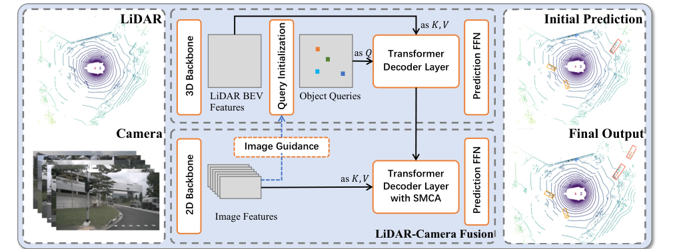
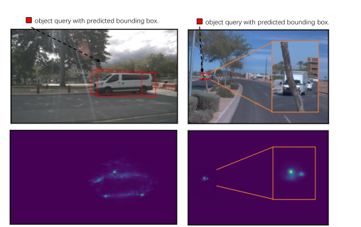
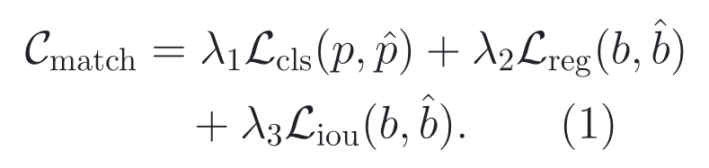
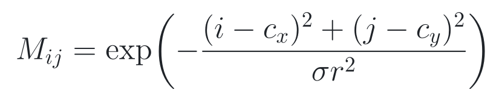
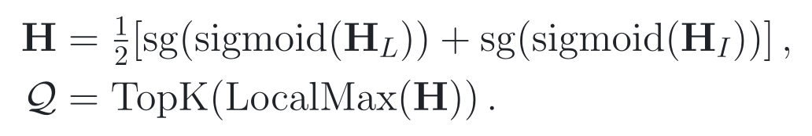
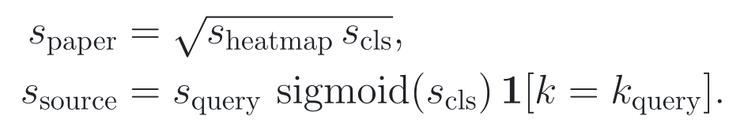
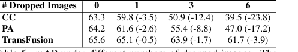
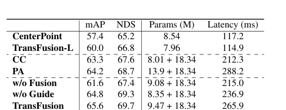

# 2026-08-05 — TransFusion: Robust LiDAR-Camera Fusion for 3D Object Detection with Transformers

**CVPR 2022** · **Accepted** · **论文、补充材料与源码已读 / Checkpoint 未运行**

**主方向：** P06 · 传感器与多模态融合

**输入模态：** Surround Camera · LiDAR

**交叉标签：** LiDAR-Camera Fusion、3D Object Detection、Soft Association、Transformer Decoder、Object Query、Sensor Misalignment、Missing Camera、Multi-Modal Robustness

[▶ 从第一张图开始](#1-看图论文到底做了什么) ·
[返回首页](../../README.md) · [全部精读](../../index/papers.md) ·
[官方论文](https://openaccess.thecvf.com/content/CVPR2022/papers/Bai_TransFusion_Robust_LiDAR-Camera_Fusion_for_3D_Object_Detection_With_Transformers_CVPR_2022_paper.pdf) ·
[官方补充材料](https://openaccess.thecvf.com/content/CVPR2022/supplemental/Bai_TransFusion_Robust_LiDAR-Camera_CVPR_2022_supplemental.pdf) ·
[官方代码 @ 73c596f7bd3460c17cbcc58dd9bcc5a0896774a8](https://github.com/XuyangBai/TransFusion/tree/73c596f7bd3460c17cbcc58dd9bcc5a0896774a8)

证据与行文标签：**[原文翻译]** 忠实中文译文；**[笔记解释]** 帮助理解的通俗讲解；**[论文]** 作者材料直接支持；**[源码]** 固定 commit 直接支持；**[判断]** 本笔记分析；**[未核验]** 尚未独立运行或确认。译文中不混入解释或判断。

## 0. 阅读起点：术语先导与摘要完整翻译

### 0.1 首次术语解释

**术语覆盖声明：** 以下先解释摘要中的核心专业术语；摘要之后第一次出现的新术语仍在正文就地解释。方法名、模型名与数据集名保留原名，后文固定使用这里的中文名、英文名、缩写与本文语义。

- **三维目标检测（3D object detection）**：从传感器观测中预测物体类别、三维中心、长宽高、朝向及可选速度；本文不预测规划轨迹或控制量。
- **激光雷达（Light Detection and Ranging, LiDAR）**：通过激光测距产生稀疏三维点。它擅长提供几何和距离，但远处、小物体可能只有少量点。
- **相机-LiDAR 融合（LiDAR-camera fusion）**：联合相机的稠密外观与 LiDAR 的三维几何做感知；本文在 nuScenes 使用六路相机与十帧累积点云。
- **较差图像条件（inferior image conditions）**：作者对夜间、图像缺失、图像退化或传感器错位等情况的统称；它不是一个统一的真实故障分布。
- **硬关联（hard association）**：用标定矩阵把每个 LiDAR 点固定投影到某个图像像素，再只取该像素特征；投影错位时，错误配对会直接进入融合。
- **软关联（soft association）**：让注意力在一片候选图像区域内按内容分配权重，而不是把一个点锁死到一个像素；本文仍用标定选择相机和中心附近区域，并非完全不依赖标定。
- **标定矩阵（calibration matrix）**：把 LiDAR 坐标转换到相机坐标和像素平面的几何变换；本文用它投影初始三维框的中心与角点。
- **对象查询（object query）**：检测 head 中代表一个候选物体的稀疏向量，携带位置、类别与实例特征，并由解码器更新成一个三维框。
- **Transformer 解码器（Transformer decoder）**：让稀疏查询先在查询之间做自注意力，再从稠密特征中做交叉注意力取证的网络层。
- **鸟瞰图（Bird's-Eye View, BEV）**：以自车为中心俯视地面的二维栅格；三维点经体素骨干压到 BEV 后，相同类别的物体在米制空间中尺度更稳定。
- **空间调制交叉注意力（Spatially Modulated Cross Attention, SMCA）**：以投影框中心和尺度构造高斯空间权重，限制查询优先查看对应图像区域。
- **非极大值抑制（Non-Maximum Suppression, NMS）**：删除相互重叠的重复检测框的后处理；TransFusion 用一对一匹配训练，默认配置把 NMS 关闭。
- **平均精度均值（mean Average Precision, mAP）**：先按类别和匹配阈值计算精度-召回，再取平均；nuScenes 的匹配以 BEV 中心距离为准。mAP 不是总体 accuracy，也不直接代表闭环安全。
- **nuScenes Detection Score（NDS）**：综合 mAP 与平移、尺度、朝向、速度和属性误差的 nuScenes 指标；NDS 上升不等于所有错误类型都同时改善。
- **TransFusion**：作者提出的模型名；它把输入相关查询初始化、LiDAR 解码、图像引导查询初始化和 SMCA 图像融合串成两阶段检测 head。

### 0.2 摘要完整专业中文翻译

**原文锚点：** Abstract，PDF p. 1 / proceedings p. 1090。

> **[原文翻译] Abstract · PDF p. 1 / proceedings p. 1090 · A01**
>
> LiDAR 与相机是自动驾驶三维目标检测中的两种重要传感器。尽管传感器融合在这一领域越来越普及，但针对较差图像条件的鲁棒性，例如不良光照和传感器错位，仍缺乏充分研究。现有融合方法很容易受到这些条件影响，这主要源于由标定矩阵建立的 LiDAR 点与图像像素之间的硬关联。

> **[原文翻译] Abstract · PDF p. 1 / proceedings p. 1090 · A02**
>
> 本文提出 TransFusion，一种采用软关联机制处理较差图像条件的鲁棒 LiDAR-相机融合方案。具体而言，TransFusion 由卷积主干网络和一个基于 Transformer 解码器的检测 head 构成。解码器第一层利用一组稀疏对象查询，仅从 LiDAR 点云预测初始边界框；第二个解码层则利用空间关系和上下文关系，自适应地将对象查询与有用图像特征融合。Transformer 的注意力机制使模型能够自适应决定应从图像的哪里取得什么信息，从而形成鲁棒且有效的融合策略。本文还设计了图像引导查询初始化策略，以处理点云中难以检测的物体。TransFusion 在大规模数据集上取得了当时领先的结果。本文通过大量实验展示其对退化图像质量与标定误差的鲁棒性。作者还把该方法扩展到三维跟踪任务，并在 nuScenes 跟踪排行榜上取得第一名，从而展示其有效性与泛化能力。

**完整性声明：** 上述 A01-A02 按摘要的两个实质段落逐句完整翻译，保留了因果、限定、比较、任务范围与榜单主张；官方 PDF 文本清晰，无抽取不明处。“鲁棒”“领先”和“泛化能力”是作者原摘要用语，具体支持范围在 Section 3 分解。

> [!TIP]
> **[笔记解释] 读完摘要再看这一句：** TransFusion 先让 LiDAR 独立给出可回退的三维框，再让每个框在图像局部软取证；它在合成丢图和错位实验中退化较慢，但固定源码依赖冻结的旧栈与未公开 checkpoint，且鲁棒证据不覆盖真实失同步、旋转标定漂移或闭环安全。

**学习顺序：**
[0 摘要与术语](#0-阅读起点术语先导与摘要完整翻译) →
[1 看原图](#1-看图论文到底做了什么) →
[2 读原式](#2-读公式核心机制怎样表达) →
[3 看结果](#3-看结果证据是否支持主张) →
[4 对源码](#4-对源码公式如何落地) →
[5 记结论](#5-记结论贡献边界与开放问题)

## 1. 看图：论文到底做了什么

### 30 秒故事

夜里经过一个路口时，LiDAR 在远处骑行者身上可能只打到两三个点，相机却还能看见轮廓；但若把这几个点硬投影到图像，几十厘米的标定偏差就可能让它们落到背景。TransFusion 先用 LiDAR 独立提出 200 个候选：即使相机坏了，仍有一个能工作的初始框。随后每个候选被投影到某路相机，注意力在框周围的一片区域内按内容找图像证据，而不是只取一个像素。相机能提供语义时就修正类别和框；候选不在任何相机视野内时，固定源码直接保留 LiDAR 初始预测。

> **原图出处：** Bai et al., CVPR 2022, Figure 2，PDF p. 3 / proceedings p. 1092。[官方 PDF](https://openaccess.thecvf.com/content/CVPR2022/papers/Bai_TransFusion_Robust_LiDAR-Camera_Fusion_for_3D_Object_Detection_With_Transformers_CVPR_2022_paper.pdf)。仅作学术讲解所需的局部摘录，原图版权归原作者及其他权利人。

### 这张图按什么顺序看

1. 左上从 LiDAR 进入三维主干，得到 BEV 特征；类别热力图从整个 BEV 选出稀疏查询。
2. 上路解码器把查询与 LiDAR BEV 交叉注意力融合，输出初始三维框。
3. 左下相机主干产生六路图像特征；一条虚线 Image Guidance 分支把图像压到 BEV，帮助补充查询候选。
4. 下路解码器把初始查询投影到对应图像，通过 SMCA 在框附近软取证，再用最终 prediction head 输出框。
5. 固定源码没有跨帧预测状态；十帧 LiDAR sweep 是输入拼接，不是会读写的循环记忆。

**看完应能复述：** TransFusion 把“能独立工作的 LiDAR 检测”放在前面，把相机作为可选择、可回退的第二阶段证据源。

**这张图没有证明：** 方法图本身不证明真实传感器故障鲁棒性、跨域泛化、时延收益或安全性；这些只能由受控实验支持。

### 整体算法架构与创新设计

**原方法瓶颈：** [论文] §1 与 §3.4，PDF pp. 1-4 指出点级融合把稀疏 LiDAR 点与单个像素硬绑定：远处物体只有少量点时，大量高分辨率图像证据未被使用；标定或时间错位又会把点投到错误像素；直接拼接还无法根据图像质量决定是否相信相机。作者把目标明确为由内容注意力建立软关联，并保留 LiDAR-only 退路。

**主干网络与基线：** [论文] 默认三维主干为 VoxelNet，直接 LiDAR 基线是第一阶段模型 TransFusion-L；论文主文写相机主干为在 CenterNet 单目三维检测上预训练并冻结的 DLA34。固定融合配置实际启用 ResNet50 加特征金字塔网络（Feature Pyramid Network, FPN），把多尺度图像特征统一成 256 通道，再投影为 128 通道 head 特征；DLA34 配置只保留为注释。三维侧是 HardSimpleVFE、SparseEncoder、SECOND 与 SECONDFPN，合并后 512 通道，再由共享卷积投影为 128 通道。CC 与 PA 是作者在相同 TransFusion-L 上构造的硬拼接与 PointAugmenting 融合基线。来源：论文 §4-§5.2，PDF pp. 5-7；[固定融合配置](https://github.com/XuyangBai/TransFusion/blob/73c596f7bd3460c17cbcc58dd9bcc5a0896774a8/configs/transfusion_nusc_voxel_LC.py#L128-L217)。

**继承与新增边界：** [论文][源码] VoxelNet、SECOND、SECONDFPN、ResNet50/FPN、DETR 式解码器、CenterPoint 热力图、SMCA 思想、匈牙利匹配和 focal/L1/IoU 损失都来自既有工作。本文新增或重组的是：输入相关且类别感知的 BEV 查询初始化；先 LiDAR 后图像的顺序解码结构；以初始三维框生成局部高斯 mask 的图像软关联；以及把压缩图像列投到 BEV 后参与查询候选选择。不能把基础骨干的表征能力、标准多头注意力或一对一匹配写成 TransFusion 独创。来源：论文 §2-§3.6，PDF pp. 2-5；[固定 head 组装](https://github.com/XuyangBai/TransFusion/blob/73c596f7bd3460c17cbcc58dd9bcc5a0896774a8/mmdet3d/models/dense_heads/transfusion_head.py#L594-L745)。

**端到端信息流：** [论文][源码] nuScenes 一帧输入为六张 448 × 800 图像与当前帧加前十个 sweep 的点云。点云范围在固定配置中为横纵各 -54 m 到 54 m、高度 -5 m 到 3 m，体素大小 0.075 m × 0.075 m × 0.2 m；1440 × 1440 体素平面经 8 倍下采样形成 180 × 180 BEV。512 通道 LiDAR neck 输出压成 128 通道；类别热力图经过 3 × 3 局部极大值筛选，从十类共选 200 个位置，取对应 BEV 特征并加类别嵌入。第一层解码器输出 200 个初始框。六路图像的 256 通道 FPN 特征压成 128 通道；图像引导路径沿高度 max-pool 成列序列，并依次让每一路相机更新 BEV；融合路径把初始框中心与角点投到图像，在局部高斯 mask 内做交叉注意力。最终 head 输出类别、中心、高度、长宽高、朝向与速度。候选不在图像内时输出被替换回第一阶段结果。来源：Figure 2、§3.2-§4，PDF pp. 3-5；[forward_single](https://github.com/XuyangBai/TransFusion/blob/73c596f7bd3460c17cbcc58dd9bcc5a0896774a8/mmdet3d/models/dense_heads/transfusion_head.py#L797-L1017)。

**总体训练方式：** [论文][源码] 训练分两阶段。第一阶段只用 LiDAR，训练三维主干、输入相关查询和第一解码器 20 epochs；copy-and-paste 在最后 5 epochs 需按 README 手工停止再恢复，以实现 fade。第二阶段从第一阶段 checkpoint 继续 6 epochs，固定融合配置同时冻结 LiDAR 组件与图像 backbone/neck，只训练图像引导 BEV、图像热力图、SMCA 解码器和最终 head。最终分类与框损失只作用于投影到至少一张图像的查询；图像热力图有直接 focal loss。用于 top-K 的 LiDAR 与图像热力图都先 sigmoid 再 detach，第一阶段查询特征、位置、框与角点投影也 detach，因此最终融合损失不会反传到 LiDAR 解码器，也不会穿过离散 top-K。推理与训练都用六路图像和十 sweep 点云，但推理默认无 NMS、无测试时增强；官方线上提交把查询数由 200 调到 300。论文与源码都未公开随机种子、重复次数或方差。来源：论文 §3.5-§4，PDF pp. 4-5；Supplement §B，PDF pp. 1-2；[冻结与阶段配置](https://github.com/XuyangBai/TransFusion/blob/73c596f7bd3460c17cbcc58dd9bcc5a0896774a8/configs/transfusion_nusc_voxel_LC.py#L246-L271)。

#### 创新模块 1：输入相关、类别感知的查询初始化

**位置与接口：** 位于 LiDAR BEV 特征与第一层 Transformer 解码器之间，替代输入无关的可学习查询位置。

**输入：** 128 × 180 × 180 的 LiDAR head 特征、十类密集中心热力图、3 × 3 局部极大值规则和 200 个查询预算；坐标是 LiDAR BEV 特征格。

**内部变换：** 先对每类热力图找局部峰值，行人与交通锥例外使用 1 × 1 局部核；再在“类别 × 空间”展平维度取全局 top-200。查询位置取相应 BEV 格中心，查询特征从 LiDAR BEV gather，并加上所选类别 one-hot 经过 1 × 1 卷积形成的类别嵌入。

**输出：** 200 个带二维 BEV 位置、类别先验和实例特征的对象查询，交给第一层解码器预测初始三维框。

**为什么这样设计：** [论文] 作者明确动机见 §3.2，PDF pp. 3-4：输入无关查询需要多层解码器逐步移动到物体中心；BEV 中同类别具有较稳定的米制尺度，中心热力图可让查询从候选物体附近起步，类别嵌入则为关系建模和属性回归提供先验。

**训练信号：** [论文][源码] 密集热力图由 penalty-reduced focal loss 直接监督；所选查询的分类和正匹配框由 focal loss 与 L1 loss 监督。top-K 索引来自 detached 热力图，不可微；查询 gather 后的特征仍可把第一阶段损失传回 LiDAR head。来源：论文 §3.5，PDF p. 5；[查询选择](https://github.com/XuyangBai/TransFusion/blob/73c596f7bd3460c17cbcc58dd9bcc5a0896774a8/mmdet3d/models/dense_heads/transfusion_head.py#L838-L897)。

**作用与证据：** [论文] Table 6 的受控比较在同样 1 层、12 epochs 下，移除输入相关初始化并改为可学习位置，mAP 从 60.0 降至 24.0、NDS 从 66.8 降至 33.8；保留输入相关初始化但移除类别感知，mAP 为 54.3、NDS 为 63.9，即类别嵌入带来 5.7 mAP 与 2.9 NDS 的提升。该表支持本配置的查询初始化，不证明所有 dense-to-sparse 查询都需要同样类别先验。来源：论文 Table 6 / §5.3，PDF p. 8。

**论文位置：** [论文] Figure 2 / §3.2 / Table 6，PDF pp. 3-4、8。

**源码入口：** [源码] [TransFusionHead 查询初始化 @ 固定 SHA](https://github.com/XuyangBai/TransFusion/blob/73c596f7bd3460c17cbcc58dd9bcc5a0896774a8/mmdet3d/models/dense_heads/transfusion_head.py#L838-L897)，官方仓库 XuyangBai/TransFusion @ 73c596f7bd3460c17cbcc58dd9bcc5a0896774a8。

#### 创新模块 2：SMCA 图像软关联融合

**位置与接口：** 位于第一层 LiDAR 解码器和最终预测 head 之间；上游是 detached 的初始查询与框，下游是融合后的类别和框参数。

**输入：** 200 个初始查询、初始三维框、六路 128 通道图像特征、LiDAR-to-image 标定矩阵、图像 resize/crop/flip 元数据和各图像位置编码。

**内部变换：** 固定源码先把框中心和八个角点投到每路图像，判断中心是否位于有效图像范围；由投影中心和角点包围范围得到半径，再把像素距离转成高斯 mask 的对数，作为加性 attention mask。查询先做自注意力，再在相应图像的所有特征位置上做被高斯调制的交叉注意力，最后与 detached 的 LiDAR 查询特征拼接，由 prediction head 回归最终框。若一个查询落在多路相机重叠区，循环中较后的视图会覆盖先前写入的图像查询特征；若不在任何图像中，所有最终属性复制第一阶段预测。

**输出：** 每个在相机视野内的查询得到 128 通道图像融合特征，并与 128 通道 LiDAR 查询拼成 256 通道送入最终 head；视野外查询保持 LiDAR-only 输出。

**为什么这样设计：** [论文] 作者明确动机见 §3.4，PDF pp. 4-5：硬投影只取少数像素且对标定误差敏感；软注意力可以在候选区域内根据上下文决定“从哪里取、取什么”，高斯空间先验又避免完全跨图搜索导致训练缓慢和无关背景干扰。

**训练信号：** [源码] 最终分类 focal loss 与正匹配框 L1 loss直接训练图像解码器和最终 head，但只对 on-the-image 查询生效。初始查询特征、查询中心、框尺寸、角点投影和 LiDAR特征在进入图像融合前均 detach；冻结图像 backbone/neck 也不更新。因此最终损失不会直接训练 LiDAR 主干或初始解码器，只训练融合层。来源：[投影与 SMCA](https://github.com/XuyangBai/TransFusion/blob/73c596f7bd3460c17cbcc58dd9bcc5a0896774a8/mmdet3d/models/dense_heads/transfusion_head.py#L912-L1010)；[loss mask](https://github.com/XuyangBai/TransFusion/blob/73c596f7bd3460c17cbcc58dd9bcc5a0896774a8/mmdet3d/models/dense_heads/transfusion_head.py#L1230-L1279)。

**作用与证据：** [论文] Table 7 的相邻受控消融从 TransFusion-L 60.0 mAP / 66.8 NDS 加入“无图像引导、只有特征融合”后为 64.8 / 69.3，即 +4.8 mAP / +2.5 NDS；完整模型相对 w/o Fusion 为 +4.0 mAP / +2.3 NDS。Figure 5 的受控比较把平移误差从 0 m 变为 1 m 时，TransFusion 从 65.60 降到 65.11，仅降 0.49 mAP；PA 与 CC 分别下降约 2.33 与 2.84。证据支持该合成平移设置下的相对鲁棒性，不支持任意旋转、时延或真实重标定故障。来源：论文 Table 7 / Figure 5 / §5.2-§5.3，PDF pp. 7-8。

**论文位置：** [论文] Figure 3 / §3.4 / Figure 5 / Table 7，PDF pp. 4、7-8。

**源码入口：** [源码] [SMCA 解码与回退 @ 固定 SHA](https://github.com/XuyangBai/TransFusion/blob/73c596f7bd3460c17cbcc58dd9bcc5a0896774a8/mmdet3d/models/dense_heads/transfusion_head.py#L902-L1010)，官方仓库 XuyangBai/TransFusion @ 73c596f7bd3460c17cbcc58dd9bcc5a0896774a8。

#### 创新模块 3：Image-Guided Query Initialization

**位置与接口：** 它旁接在图像 FPN 与 LiDAR 查询选择之间，不负责最终框融合，而是改变哪些 BEV 位置有资格成为初始查询。

**输入：** 六路图像特征、LiDAR BEV 特征、相机视图顺序和十类 LiDAR 密集热力图。固定配置的图像特征先由 256 通道投影到 128 通道。

**内部变换：** 每路图像沿高度维 max-pool，得到“通道 × 图像列”的序列；六个 cross-only 解码层按固定视图顺序，依次用每路列特征更新整张 LiDAR BEV。更新后的 BEV 预测图像引导热力图；它与 LiDAR 热力图的 sigmoid 概率逐点平均，再做局部峰值筛选和全类别 top-200。

**输出：** 由相机与 LiDAR 共同决定的查询索引；被选查询的特征仍从原始 LiDAR BEV gather，再加类别嵌入，不直接从图像 BEV 取查询特征。

**为什么这样设计：** [论文] 作者明确动机见 §3.6，PDF p. 5：只用 LiDAR 选择查询可能漏掉点云稀疏的小物体；这里仅需图像提供“哪里可能有物体”的提示，因此把高度压成列可降低计算。

**训练信号：** [源码] 图像引导热力图有直接 Gaussian focal loss，可训练按视图投影的 BEV 和 heatmap head；LiDAR 热力图在第二阶段来自冻结分支。用于平均、局部峰值与 top-K 的两张概率图均 detach，因此最终查询分类与框损失不会通过选择索引反传给图像引导路径。来源：[图像到 BEV 与 detached 查询选择](https://github.com/XuyangBai/TransFusion/blob/73c596f7bd3460c17cbcc58dd9bcc5a0896774a8/mmdet3d/models/dense_heads/transfusion_head.py#L816-L873)。

**作用与证据：** [论文] Table 7 的受控消融中，只加入图像引导、去掉最终图像融合的 w/o Fusion 为 61.6 mAP / 67.4 NDS，相对 TransFusion-L 的 60.0 / 66.8 增加 1.6 / 0.6；完整模型相对 w/o Guide 的 64.8 / 69.3 增加 0.8 / 0.4。作者没有报告随机种子或方差，这个小增益不能推出在所有稀疏度下都稳定。来源：论文 Table 7 / §5.3，PDF p. 8。

**论文位置：** [论文] Figure 4 / §3.6 / Table 7，PDF pp. 5、8。

**源码入口：** [源码] [图像引导查询初始化 @ 固定 SHA](https://github.com/XuyangBai/TransFusion/blob/73c596f7bd3460c17cbcc58dd9bcc5a0896774a8/mmdet3d/models/dense_heads/transfusion_head.py#L816-L873)，官方仓库 XuyangBai/TransFusion @ 73c596f7bd3460c17cbcc58dd9bcc5a0896774a8。

> **原图出处：** Bai et al., CVPR 2022, Figure 3，PDF p. 4 / proceedings p. 1093。[官方 PDF](https://openaccess.thecvf.com/content/CVPR2022/papers/Bai_TransFusion_Robust_LiDAR-Camera_Fusion_for_3D_Object_Detection_With_Transformers_CVPR_2022_paper.pdf)。仅作学术讲解所需的局部摘录，原图版权归原作者及其他权利人。

**[笔记解释] 图与模块的对应：** 红框是初始查询投影，下面的亮区是注意力实际取证的位置。亮区不只覆盖 LiDAR 投影点，因此能利用稠密图像；但这是挑选案例的可视化，不是精度或鲁棒性统计。

> **原图出处：** Bai et al., CVPR 2022, Figure 4，PDF p. 5 / proceedings p. 1094。[官方 PDF](https://openaccess.thecvf.com/content/CVPR2022/papers/Bai_TransFusion_Robust_LiDAR-Camera_Fusion_for_3D_Object_Detection_With_Transformers_CVPR_2022_paper.pdf)。仅作学术讲解所需的局部摘录，原图版权归原作者及其他权利人。

**[笔记解释] 最容易误读的地方：** 图中 “Fused BEV Features” 只为查询候选热力图服务；固定源码选出索引后，查询内容从原始 LiDAR BEV gather。因此这条支路更像相机提供候选位置提示，不是把相机特征直接写进所有初始查询。

## 2. 读公式：核心机制怎样表达

### Eq. (1)：一对一匹配代价

**原文公式：** 论文 Eq. (1)，PDF p. 5 / proceedings p. 1094。

<picture><source media="(prefers-color-scheme: dark)" srcset="../../assets/notes/2026-08-05-transfusion/formulas/eq-01-matching-cost-dark.png"></picture>

> **公式来源：** Bai et al., CVPR 2022, Eq. (1)，PDF p. 5 / proceedings p. 1094；本图按原符号重排。[官方 PDF](https://openaccess.thecvf.com/content/CVPR2022/papers/Bai_TransFusion_Robust_LiDAR-Camera_Fusion_for_3D_Object_Detection_With_Transformers_CVPR_2022_paper.pdf) · [可复制 TeX](../../assets/notes/2026-08-05-transfusion/formulas/source.tex#L5-L13)。

**符号说明：** ***C***match 是预测与真值配对代价；*p* 与 *p̂* 是类别真值和预测；*b* 与 *b̂* 是真值框与预测框；***L***cls 是分类代价，***L***reg 是归一化 BEV 中心 L1 代价，***L***iou 是三维 IoU 代价；*λ*1、*λ*2、*λ*3 是权重。

**纯文字读法：** 每个“预测查询-真值框”配对都计算分类错误、中心距离和框重叠三项代价，按权重相加；匈牙利算法选择全局一对一、总成本最低的匹配。

**教学小例子：** [笔记解释] 两个候选都靠近同一辆车时，候选 A 的三项加权代价若为 0.20，候选 B 为 0.35，一对一匹配只把更合适的 A 分给这辆车，B 作为未匹配负样本。数值只是解释，不是论文实验。

**专业解释：** 一对一分配让网络学习“一个目标对应一个高分查询”，为关闭 NMS 提供训练条件。它不保证不会重复框；补充材料 Table 10 只显示在该实现和 nuScenes 上，关闭 NMS 几乎不改变 TransFusion mAP。

**图对应：** Figure 2 的两个 prediction head 都由论文所述相同匹配与损失训练；固定融合配置实际只把最终 head 放入返回损失路径。

**固定源码映射：** [源码] [HungarianAssigner3D](https://github.com/XuyangBai/TransFusion/blob/73c596f7bd3460c17cbcc58dd9bcc5a0896774a8/mmdet3d/core/bbox/assigners/hungarian_assigner.py#L93-L139) 实现分类、BEV L1 与 IoU cost 后在 CPU 调用线性分配；[配置权重](https://github.com/XuyangBai/TransFusion/blob/73c596f7bd3460c17cbcc58dd9bcc5a0896774a8/configs/transfusion_nusc_voxel_LC.py#L219-L232) 为 0.15、0.25、0.25。

**公式省略的实现细节：** 固定配置的分类 cost 是 focal-loss cost，不是主文文字所称普通 binary cross entropy；IoU cost 用于匹配，但最终 IoU loss 分支在配置与 head 中被注释，框训练主要是 L1。

### 原文未编号公式：SMCA 高斯空间权重

**原文未编号公式：** 论文 §3.4，PDF p. 4 / proceedings p. 1093。

<picture><source media="(prefers-color-scheme: dark)" srcset="../../assets/notes/2026-08-05-transfusion/formulas/eq-unnum-smca-mask-dark.png"></picture>

> **公式来源：** Bai et al., CVPR 2022, §3.4 未编号公式，PDF p. 4 / proceedings p. 1093；本图按原符号重排。[官方 PDF](https://openaccess.thecvf.com/content/CVPR2022/papers/Bai_TransFusion_Robust_LiDAR-Camera_Fusion_for_3D_Object_Detection_With_Transformers_CVPR_2022_paper.pdf) · [可复制 TeX](../../assets/notes/2026-08-05-transfusion/formulas/source.tex#L15-L20)。

**符号说明：** *M*ij 是图像特征格 (*i*, *j*) 的空间权重；(*c*x, *c*y) 是初始三维框中心投影到图像的位置；*r* 是投影八角点最小外接圆半径；*σ* 是论文中的带宽超参数。

**纯文字读法：** 离投影框中心越近的图像位置权重越接近 1；距离按框尺度归一后增大，权重指数下降。

**教学小例子：** [笔记解释] 若某位置归一化后的平方距离为 0、1、4，权重分别约为 1、0.37、0.018；大框允许更宽搜索，小框让注意力更集中。这里只演示指数衰减。

**专业解释：** 高斯 mask 是软先验，不是把框外位置绝对裁掉。固定源码先得到普通多头注意力 logits，再把高斯权重取对数作为加性 mask；很小的权重接近负无穷。

**图对应：** Figure 3 下排亮区是内容注意力与空间先验共同作用后的结果；Figure 2 下路的 SMCA decoder 就是该式位置。

**固定源码映射：** [源码] [半径、标准差和 log-mask](https://github.com/XuyangBai/TransFusion/blob/73c596f7bd3460c17cbcc58dd9bcc5a0896774a8/mmdet3d/models/dense_heads/transfusion_head.py#L987-L1002)。

**公式省略的实现细节：** 固定源码把 *σ* 设为 (2*r* + 1) / 6，并使用标准高斯分母 2*σ*²；这是对论文“*σr*²”带宽写法的实现参数化，未做数值追踪前不把它定性成错误。中心与半径都来自 detached 初始框。

### [源码] 非论文原式：detached 图像引导查询选择

**[源码] 非论文原式：** 固定源码 forward_single，非论文编号公式。

<picture><source media="(prefers-color-scheme: dark)" srcset="../../assets/notes/2026-08-05-transfusion/formulas/src-query-heatmap-dark.png"></picture>

> **公式来源：** **[源码]** 本图是固定 commit 对查询选择的等价重排，不是论文原式。[forward_single @ 73c596f7bd3460c17cbcc58dd9bcc5a0896774a8](https://github.com/XuyangBai/TransFusion/blob/73c596f7bd3460c17cbcc58dd9bcc5a0896774a8/mmdet3d/models/dense_heads/transfusion_head.py#L838-L873) · [可复制 TeX](../../assets/notes/2026-08-05-transfusion/formulas/source.tex#L22-L32)。

**符号说明：** ***H***L 与 ***H***I 是 LiDAR 和图像引导 logits；sigmoid 把它们变成概率；sg 表示停止梯度；LocalMax 是类别内局部峰值筛选；TopK 跨类别和空间取 200 个索引；***Q*** 是查询索引集合。

**纯文字读法：** 两张概率图各自停止梯度后等权平均，只保留局部峰值，再从全部类别与位置里挑最高的 200 个查询。

**教学小例子：** [笔记解释] 某格 LiDAR 概率 0.2、图像概率 0.8，平均为 0.5；邻格若为 0.6，则前者被局部峰值规则淘汰。即使最终检测损失很大，它也不能穿过 top-K 直接调整这两个概率。

**专业解释：** 图像引导 heatmap 仍有自己的 dense focal loss，因此不是“没有梯度”；准确说法是查询选择路径不可微，最终 query loss 不直接监督哪些位置被选。

**图对应：** Figure 4 的 Fused BEV Features → Query Initialization 对应这一选择过程。

**固定源码映射：** [源码] 同上；dense heatmap loss 位于 [loss](https://github.com/XuyangBai/TransFusion/blob/73c596f7bd3460c17cbcc58dd9bcc5a0896774a8/mmdet3d/models/dense_heads/transfusion_head.py#L1230-L1244)。

**公式省略的实现细节：** 行人与交通锥跳过 3 × 3 峰值抑制；top-K 在十类和 180 × 180 空间展平后统一排序。所选特征从 LiDAR BEV gather，不从图像引导 BEV gather。

### [源码] 非论文原式：最终分数合成差异

**[源码] 非论文原式：** 论文 §4 Testing 的文字规则与固定源码 get_bboxes 的对照，非论文编号公式。

<picture><source media="(prefers-color-scheme: dark)" srcset="../../assets/notes/2026-08-05-transfusion/formulas/src-score-composition-dark.png"></picture>

> **公式来源：** **[判断]** **[源码]** 第一行是论文 §4 Testing 文字的数学重述，第二行是固定源码等价重排；二者都不是论文排版原式。[官方 PDF p. 6](https://openaccess.thecvf.com/content/CVPR2022/papers/Bai_TransFusion_Robust_LiDAR-Camera_Fusion_for_3D_Object_Detection_With_Transformers_CVPR_2022_paper.pdf) · [get_bboxes](https://github.com/XuyangBai/TransFusion/blob/73c596f7bd3460c17cbcc58dd9bcc5a0896774a8/mmdet3d/models/dense_heads/transfusion_head.py#L1294-L1311) · [可复制 TeX](../../assets/notes/2026-08-05-transfusion/formulas/source.tex#L34-L43)。

**符号说明：** *s*heatmap 是查询初始化热力图分数；*s*cls 是最终分类 logit 或概率；*s*query 是固定源码保存的查询热力图分数；指示函数只保留查询初始化时所属类别 *k*query。

**纯文字读法：** 论文文字称两分数取几何平均；固定源码则把最终 sigmoid 分类概率、查询热力图分数和类别 one-hot 直接相乘，没有平方根。

**教学小例子：** [笔记解释] 两个分数都是 0.5 时，几何平均为 0.5，直接乘积为 0.25；排序未必改变，但阈值与校准会改变。若两个候选分数比例不同，排序也可能变化。

**专业解释：** 这是可定位的静态论文-源码差异，不足以在未运行前宣称 benchmark 数值受损。固定配置 score threshold 为 0，因此主要风险是分数标度、排序与下游校准，而不是立即删框。

**图对应：** Figure 2 最右侧 Final Output 的置信度在解码框之前经过该合成。

**固定源码映射：** [源码] [get_bboxes](https://github.com/XuyangBai/TransFusion/blob/73c596f7bd3460c17cbcc58dd9bcc5a0896774a8/mmdet3d/models/dense_heads/transfusion_head.py#L1294-L1311)。

**公式省略的实现细节：** query score 来自 LiDAR 与图像热力图 detached 平均后的所选位置；固定源码再乘类别 one-hot，因此最终 head 不能把查询改判成另一初始类别。

## 3. 看结果：证据是否支持主张

### 3.1 原文公开的实验配置

**原文锚点：** 主论文 §4-§5，PDF pp. 5-8；Supplement §B-§H，PDF pp. 1-3；固定 SHA 配置、README 与运行入口。

- **数据集、版本与划分。** [论文] nuScenes 使用 700/150/150 个 scene 的 train/val/test，并含十类检测；Waymo 使用 798 个训练 scene 与 202 个验证 scene，评三类。论文没有写 nuScenes 数据版本字符串；固定代码路径要求本地 nuScenes 元数据。来源：主论文 §5，PDF pp. 6-7。
- **传感器与输入。** [论文] nuScenes 每帧一份点云和六张覆盖 360° 的标定图像；Supplement §B 明确把前十个 LiDAR sweep 变换到当前帧，训练和推理都使用。Waymo 只用单 sweep，五相机约覆盖 250°。来源：主论文 §5，PDF pp. 6-7；Supplement §B，PDF pp. 1-2。
- **范围、体素与图像。** [论文] 主文给 nuScenes 体素 0.075 m × 0.075 m × 0.2 m、图像 448 × 800；Supplement 写横纵范围约 -51.2 m 到 51.2 m。 [源码] 固定配置实际为 -54 m 到 54 m、-5 m 到 3 m，网格 1440 × 1440 × 40；论文与源码范围并列保留，未运行数值对齐。[固定配置](https://github.com/XuyangBai/TransFusion/blob/73c596f7bd3460c17cbcc58dd9bcc5a0896774a8/configs/transfusion_nusc_voxel_LC.py#L1-L89)。
- **主干与初始化。** [论文] 三维骨干是 VoxelNet；主文相机骨干是 CenterNet 单目三维检测预训练的 DLA34，训练时冻结。 [源码] 固定融合配置启用 ResNet50/FPN、冻结 image backbone/neck，并从外部路径 checkpoints/fusion_voxel0075_R50.pth 加载；DLA34 只在注释中。README 说明不同 2D 预训练来源，但不发布训练好的 TransFusion 权重。来源：主论文 §4，PDF p. 5；[固定配置](https://github.com/XuyangBai/TransFusion/blob/73c596f7bd3460c17cbcc58dd9bcc5a0896774a8/configs/transfusion_nusc_voxel_LC.py#L128-L179)。
- **硬件与软件。** [论文/源码] Supplement 与 configs/nuscenes.md 报告 8 张 Tesla V100、PyTorch 1.7.0、CUDA 10.1、cuDNN 7.6；README 还要求 mmdet 2.10.0、mmcv 1.2.4。训练时长、CPU、内存和操作系统未公开。来源：Supplement §B，PDF pp. 1-2；[固定运行文档](https://github.com/XuyangBai/TransFusion/blob/73c596f7bd3460c17cbcc58dd9bcc5a0896774a8/configs/nuscenes.md#L3-L10)。
- **优化器与学习率。** [论文/源码] AdamW，weight decay 0.01，one-cycle/cyclic 调度，固定 config 基础学习率 0.0001、峰值倍率 10，即论文报告的最大 0.001；动量从 0.85 到 0.95，L2 gradient clipping 为 0.1。来源：Supplement §B，PDF p. 2；[固定调度配置](https://github.com/XuyangBai/TransFusion/blob/73c596f7bd3460c17cbcc58dd9bcc5a0896774a8/configs/transfusion_nusc_voxel_LC.py#L246-L257)。
- **batch 与训练轮数。** [论文] 8 卡总 batch 16，即每卡 2；LiDAR 第一阶段 20 epochs，融合第二阶段 6 epochs。验证集消融为加快迭代把第一阶段减为 12 epochs并移除 fade；这些结果不能与完整 test 配方混作同一训练预算。来源：主论文 §4 与 §5.2，PDF pp. 5、7；Supplement §B，PDF p. 2。
- **增强。** [论文] 第一阶段采用随机 X/Y 翻转、0.9-1.1 缩放、约 ±π/8 旋转与 copy-and-paste，最后 5 epochs 关闭 copy-and-paste。 [源码] LiDAR 配置还含平移标准差 0.5；融合配置把 GlobalRotScaleTrans 与 RandomFlip3D 注释掉，只保留点过滤、shuffle、图像 resize/normalize/pad，符合两阶段“更灵活增强只放前段”的动机。来源：Supplement §B，PDF pp. 1-2；[固定融合数据管线](https://github.com/XuyangBai/TransFusion/blob/73c596f7bd3460c17cbcc58dd9bcc5a0896774a8/configs/transfusion_nusc_voxel_LC.py#L15-L81)。
- **损失与分配。** [论文/源码] dense heatmap、分类、框回归损失权重为 1.0、1.0、0.25；匈牙利 cost 权重为 0.15、0.25、0.25。分类对正负查询生效，框回归只对正匹配查询生效；融合阶段又以 on-the-image mask 阻断视野外查询损失。来源：主论文 Eq. (1) / §3.5，PDF p. 5；[固定 loss 配置](https://github.com/XuyangBai/TransFusion/blob/73c596f7bd3460c17cbcc58dd9bcc5a0896774a8/configs/transfusion_nusc_voxel_LC.py#L214-L232)。
- **随机性与选模。** [未核验] 论文、补充材料和固定配置未公开随机种子、独立重复次数、方差、early stopping 或按何种 validation 指标选最终 checkpoint。固定配置每 epoch 保存并每 epoch评估，但 README 没指定挑选规则。
- **推理、阈值与后处理。** [论文/源码] 无测试时增强、默认 200 queries，线上提交用 300；score threshold 为 0，post-center-range 过滤有效范围，nms_type 为 None。主文称热力图与分类分数做几何平均，固定源码实际直接相乘并限制到初始查询类别。来源：主论文 §4 Testing，PDF p. 6；Supplement §G，PDF p. 3；[固定测试配置](https://github.com/XuyangBai/TransFusion/blob/73c596f7bd3460c17cbcc58dd9bcc5a0896774a8/configs/transfusion_nusc_voxel_LC.py#L233-L244)。
- **指标与公平性。** [论文] nuScenes mAP 按 0.5/1/2/4 m 中心距离跨十类平均；NDS 再合并五类 TP 误差。Waymo mAP/mAPH 基于车辆 0.7 IoU、行人与骑行者 0.5 IoU并分 LEVEL 1/2。Table 1 明示 CenterPoint 与 PointAugmenting 使用 double-flip，而 TransFusion 不使用 TTA；FusionPainting 取官网优于论文的结果，比较并非所有训练数据和推理增强完全一致。来源：主论文 §5 / Table 1，PDF pp. 6-7。
- **checkpoint 与入口。** [源码] 官方仓库给配置与训练/测试脚本，但因 Huawei IAS BU 政策不发布 pretrained model；固定融合 config 的 load path 不能由仓库独立满足。[未核验] 本笔记未下载 nuScenes、外部 2D 权重或第一阶段 checkpoint，也未编译旧 CUDA 算子、训练、推理或数值复现。来源：[官方 README](https://github.com/XuyangBai/TransFusion/blob/73c596f7bd3460c17cbcc58dd9bcc5a0896774a8/README.md#L27-L62)。

### 3.2 原文公开的实验流程

**原文锚点：** 主论文 §3.5-§5，PDF pp. 5-8；Supplement §B，PDF pp. 1-2；固定 SHA 数据、训练、推理与评测入口。

1. **数据准备：** [论文/源码] 安装旧版 MMDetection3D 环境，按官方脚本生成 nuScenes 元数据和 ground-truth database；将十 sweep 变换到当前 LiDAR 坐标，六路图像按 448 × 800 输入并保留标定。README 警告新版 MMDetection3D 的坐标系重构会改变 yaw 与长宽定义，错误元数据会导致 mAOE/mASE 异常。[数据文档](https://github.com/XuyangBai/TransFusion/blob/73c596f7bd3460c17cbcc58dd9bcc5a0896774a8/docs/data_preparation.md)。
2. **第一阶段训练：** [论文/源码] 用 transfusion_nusc_voxel_L.py 训练 TransFusion-L 20 epochs；按项目说明在第 15 epoch 手工停止，移除 copy-and-paste 后恢复 5 epochs，实现 fade。密集热力图选 200 查询，第一解码器预测初始框并用匈牙利分配、分类和框回归训练。来源：主论文 §4，PDF p. 5；[固定 LiDAR 配置](https://github.com/XuyangBai/TransFusion/blob/73c596f7bd3460c17cbcc58dd9bcc5a0896774a8/configs/transfusion_nusc_voxel_L.py#L150-L268)。
3. **第二阶段训练：** [论文/源码] 把第一阶段权重放到固定融合配置指定的 load_from 路径，另加载冻结的 ResNet50/FPN 图像预训练权重；训练图像引导 BEV、图像 heatmap、SMCA 与最终 head 6 epochs。固定 config 设 freeze_lidar_components=True，模型内部再让 freeze_img=True。[固定融合配置](https://github.com/XuyangBai/TransFusion/blob/73c596f7bd3460c17cbcc58dd9bcc5a0896774a8/configs/transfusion_nusc_voxel_LC.py#L128-L271)。
4. **验证与选模：** [未核验] 原文未公开用 mAP、NDS 或最后一轮选模，也没有公开 seed 或重复试验；固定配置每 epoch 评估并保存。消融另用 12-epoch 第一阶段且无 fade，不能假设和 test checkpoint 同一统计分布。来源：主论文 §5.2，PDF p. 7；[固定评估与保存配置](https://github.com/XuyangBai/TransFusion/blob/73c596f7bd3460c17cbcc58dd9bcc5a0896774a8/configs/transfusion_nusc_voxel_LC.py#L8-L9)。
5. **推理与后处理：** [源码] tools/test.py 载入配置与外部 checkpoint，六路相机和十 sweep 经 detector → head；top-K 查询、LiDAR初始框、图像投影与 SMCA 后，将视野外查询回退成第一阶段结果。最终分数直接相乘，解码后不做 NMS。[推理入口](https://github.com/XuyangBai/TransFusion/blob/73c596f7bd3460c17cbcc58dd9bcc5a0896774a8/tools/test.py)。
6. **最终评测：** [论文] validation 消融在本地 nuScenes evaluator 上报告 mAP/NDS，test detection 与 tracking 提交官方服务器；Waymo只报告 validation。检测结果再用 CenterPoint 的 tracking-by-detection 逻辑得到跟踪榜单结果，跟踪器不是本文新模块。来源：主论文 §5.1-§5.3，PDF pp. 6-8。

**复现仍缺什么：** 官方不发布 TransFusion checkpoint；固定 R50 配置需要未随仓库提供的第一阶段权重和图像预训练权重；依赖 PyTorch 1.7/CUDA 10.1/mmcv 1.2.4 并包含 CUDA/C++ operators；README 明示坐标系版本风险。静态源码审计不等于结果已复现。

### 3.3 核心结果

> **原图出处：** Bai et al., CVPR 2022, Table 5，PDF p. 7 / proceedings p. 1096。[官方 PDF](https://openaccess.thecvf.com/content/CVPR2022/papers/Bai_TransFusion_Robust_LiDAR-Camera_Fusion_for_3D_Object_Detection_With_Transformers_CVPR_2022_paper.pdf)。仅作学术讲解所需的局部摘录，原图版权归原作者及其他权利人。

**先读表：** 0 路丢失时 TransFusion 为 65.6 mAP；六路全丢后仍有 61.7，下降 3.9 个绝对点，约 5.9% 相对。CC 从 63.3 降到 39.5，下降 23.8 点；PA 从 64.2 降到 47.0，下降 17.2 点。实验是在推理时把整路图像特征置零，不是重新训练缺模态模型，也不是随机像素噪声、网络延迟或真实相机黑屏日志。

> **原图出处：** Bai et al., CVPR 2022, Table 7，PDF p. 8 / proceedings p. 1097。[官方 PDF](https://openaccess.thecvf.com/content/CVPR2022/papers/Bai_TransFusion_Robust_LiDAR-Camera_Fusion_for_3D_Object_Detection_With_Transformers_CVPR_2022_paper.pdf)。仅作学术讲解所需的局部摘录，原图版权归原作者及其他权利人。

### 三个必须看的对照

1. **主结果与最强 baseline：** [论文] nuScenes test 的 Table 1 中，TransFusion 为 68.9 mAP / 71.7 NDS，TransFusion-L 为 65.5 / 70.2，即 +3.4 mAP（约 +5.2% 相对）和 +1.5 NDS（约 +2.1% 相对）；最强 FusionPainting 为 68.1 / 71.6，完整模型只领先 +0.8 mAP / +0.1 NDS。领先幅度在不同指标上非常不均匀。
2. **关键模块消融：** [论文] Table 7 的“融合 only”相对 LiDAR 基线为 +4.8 mAP / +2.5 NDS；“图像引导 only”为 +1.6 / +0.6；完整模型相对 w/o Guide 为 +0.8 / +0.4。多个组件同时变化时，不能把完整模型的全部 +5.6 mAP 都归给 SMCA 或图像引导之一。
3. **效率与距离：** [论文] Table 7 中 TransFusion-L 为 114.9 ms，完整模型为 265.9 ms，约 2.31 倍时延；Table 8 的融合增益随距离由 <15 m 的 +5.1 mAP，增至 15-30 m 的 +7.4 和 >30 m 的 +8.4。远距收益与更高时延同时存在，论文未报告 FLOPs、能耗、端到端吞吐或异步 pipeline 的实测。

### 证据支持

- **[论文] 软关联在作者构造的退化下更平缓。** Table 5 的整路丢图与 Figure 5 的 0-1 m 平移偏差都显示 TransFusion 比 CC/PA 下降更少；这和先 LiDAR、后可选图像的结构相符。
- **[论文] 图像主要补语义与稀疏远距物体。** Table 8 的远距增益更大；Supplement §H 又显示点云更密、类别更粗的 Waymo 上总增益只有约 +0.6 LEVEL-2 mAPH，说明融合价值受 LiDAR密度和标签粒度限制。
- **[论文] 输入相关查询是强主效应。** Table 6 在同层数和训练轮数下从可学习位置改为 heatmap 初始化，mAP 24.0 → 60.0、NDS 33.8 → 66.8；这比后续图像引导的 +1.6 mAP 大得多。
- **[论文] 一对一分配可在本设置中免 NMS。** Supplement Table 10 中 TransFusion 有/无 NMS 为 65.58/65.60 mAP，TransFusion-L 为 59.95/59.98；同一复现的 CenterPoint 则 57.41 → 45.70。

### 证据没有支持

- **[判断] 没有真实故障分布。** 丢图是把 feature 置零，标定误差只有相机到 LiDAR 变换的随机平移；未测试旋转、时间不同步、rolling shutter、脏污、曝光饱和、部分视野遮挡或传感器欺骗。
- **[判断] “软关联”不是无标定。** 固定源码仍用标定选择相机、投影框中心和角点，并要求中心落在图像内；偏差太大把查询投到错误相机或图外时，注意力没有全局搜索保障。
- **[未核验] 没有不确定性或校准证据。** 论文不报告 ECE、风险-覆盖、故障检测 AUROC 或置信度随模态缺失的校准；源码分数合成又与论文文字不同。
- **[判断] 没有训练稳定性的统计保证。** 所有消融看起来是单次结果，未给 seed、重复次数或误差条；图像引导的 +0.8 到 +1.6 mAP 是否超过运行方差未知。
- **[判断] 没有闭环或部署安全结论。** mAP/NDS、跟踪榜单和单机时延不等于制动距离、碰撞率、故障覆盖或实时预算；265.9 ms 的测量也没有端到端并行 pipeline。
- **[未核验] 本仓库没有数值复现。** 未运行数据、checkpoint、CUDA operator、训练、推理或 evaluator；所有“源码行为”均是固定 commit 静态审计。

## 4. 对源码：公式如何落地

数据流：

LiDAR 十 sweep + 六路图像 → VoxelNet/SECOND/SECONDFPN 与冻结 ResNet50/FPN → detached 平均热力图选择 200 个查询 → LiDAR 解码器给初始框 → detached 框投影与 SMCA 图像融合 → on-image 最终 head / off-image LiDAR 回退 → 分数直接相乘、范围过滤、无 NMS。

### 1. 输入与冻结边界：TransFusionDetector

- **论文对应：** 两个卷积 backbone 先独立提取 LiDAR BEV 和图像特征。
- **源码行为：** extract_img_feat 把 batch 与六视图合并后跑 ResNet50/FPN；extract_pts_feat 完成 voxelize → VFE → SparseEncoder → SECOND → SECONDFPN。构造时 freeze_img=True 会把图像 backbone/neck 参数设为不需梯度；配置另用 freeze_lidar_components=True 冻结 LiDAR。
- **需要留意：** 论文主文写 DLA34，但固定融合配置启用 R50/FPN；图像和 LiDAR backbone 都冻结，第二阶段不是全网络联合微调。这里没有 prediction-relevant temporal state，十 sweep 只是数据管线输入。
- [打开固定 SHA detector](https://github.com/XuyangBai/TransFusion/blob/73c596f7bd3460c17cbcc58dd9bcc5a0896774a8/mmdet3d/models/detectors/transfusion.py#L18-L72)

### 2. 候选生成：forward_single 的 heatmap 与 top-K

- **论文对应：** 输入相关、类别感知查询，以及图像引导查询初始化。
- **源码行为：** 六路图像沿高度 max-pool 后按固定相机顺序依次更新 BEV；LiDAR 与图像 heatmap 的 detached sigmoid 概率等权平均，局部峰值后跨十类 top-200。查询特征从 LiDAR BEV gather，再加类别 embedding。
- **需要留意：** 图像引导 BEV 的直接梯度来自 dense heatmap loss，而不是 top-K 后的最终 query loss；相机视图是顺序更新，不是对六路结果做对称池化。图像引导只改变“选哪里”，不把图像内容直接作为初始查询内容。
- [打开固定 SHA 查询路径](https://github.com/XuyangBai/TransFusion/blob/73c596f7bd3460c17cbcc58dd9bcc5a0896774a8/mmdet3d/models/dense_heads/transfusion_head.py#L797-L897)

### 3. 图像软取证与回退：SMCA 分支

- **论文对应：** 初始三维框选择相关相机区域，SMCA 软关联图像特征并输出最终框。
- **源码行为：** 初始 query feature、中心、框属性和投影几何都 detach；每路相机用中心和八角点生成高斯 log-mask。落在图像内的 query 由图像 decoder 更新并与 LiDAR query 拼接；视野外所有属性逐项复制 first_res_layer。
- **需要留意：** 一个查询若出现在重叠相机中，循环后写入覆盖先写入；on_the_image_mask 只表示“至少一张图像有效”。最终 loss 把视野外 query 权重清零，因此第二阶段不再训练其 LiDAR 回退输出。论文示意没有暴露这些梯度与覆盖细节。
- [打开固定 SHA SMCA 路径](https://github.com/XuyangBai/TransFusion/blob/73c596f7bd3460c17cbcc58dd9bcc5a0896774a8/mmdet3d/models/dense_heads/transfusion_head.py#L902-L1017)

### 4. 分配、损失与输出：loss / get_bboxes

- **论文对应：** 两个解码层均使用一对一匹配、分类与框损失；测试时合并 heatmap 与分类分数且不用 NMS。
- **源码行为：** 固定融合前向只返回最终融合层；dense image heatmap 有 Gaussian focal loss，on-image query 有 focal 分类与加权 L1 回归。get_bboxes 将最终 sigmoid 类别分数、query heatmap 分数与类别 one-hot 直接相乘，再解码、范围过滤；nms_type=None 时原样返回。
- **需要留意：** 论文说“几何平均”，源码无平方根；IoU 参与 assignment cost 但 IoU loss 被注释。类别 one-hot 锁定初始 query 类别，最终 head 不能跨类改判。静态差异尚未数值追踪，不能写成已确认 bug。
- [打开固定 SHA loss](https://github.com/XuyangBai/TransFusion/blob/73c596f7bd3460c17cbcc58dd9bcc5a0896774a8/mmdet3d/models/dense_heads/transfusion_head.py#L1217-L1283) · [打开固定 SHA decode](https://github.com/XuyangBai/TransFusion/blob/73c596f7bd3460c17cbcc58dd9bcc5a0896774a8/mmdet3d/models/dense_heads/transfusion_head.py#L1285-L1376)

<strong>展开完整源码审计、环境和复现风险</strong>

- **仓库身份：** 作者官方 XuyangBai/TransFusion，默认 master，固定 commit 73c596f7bd3460c17cbcc58dd9bcc5a0896774a8。
- **License：** 根目录 Apache-2.0；仓库内嵌 MMDetection3D 代码与 CUDA/C++ operators，复用时仍需保留许可和通知。
- **入口调用链：** tools/train.py 或 tools/test.py → TransFusionDetector.forward_train/simple_test → extract_feat → TransFusionHead.forward_single → loss/get_bboxes。
- **prediction-relevant state：** 无跨帧可写状态、无 reset 或序列 slot；self.query_labels、on_the_image_mask 与缓存的位置网格是本次 forward 的辅助成员。多 batch 或并发复用是否安全未独立压力测试。
- **evaluation-only state：** get_bboxes 临时构造类别 NMS task；固定配置 nms_type=None，因此默认不执行 NMS。
- **in-place 与 detach：** top-K 概率、第一阶段中心/框/速度、LiDAR query feature 全部 detach；最终输出对视野外位置用布尔索引原位复制第一阶段值。没有跨帧 BPTT。
- **论文-源码 shape：** Supplement 报告 hidden dimension 256；固定配置图像 FPN 输出 256、LiDAR neck 输出 512，但 head shared conv 后实际 hidden_channel=128。源码 docstring 仍写 128 × 128 BEV，而配置推导是 180 × 180；按配置和 create_2D_grid 审计，不把旧注释当真实 shape。
- **论文-源码 backbone：** 主文 DLA34，固定 config R50/FPN；论文 supplement Table 12 确实把 R50 instance segmentation特征列为更强候选，但未明确固定公开 config 对应哪一个 leaderboard checkpoint。
- **论文-源码范围：** Supplement 文字横纵约 ±51.2 m；固定 config ±54 m。需用官方 checkpoint 和数据元数据做数值对齐才能确定报告结果对应范围。
- **checkpoint：** README 明确因政策不发布 pretrained models；仓库链接是检测/跟踪结果文件，不是可加载训练权重。固定 load_from 路径需要用户自行准备第一阶段与 R50 权重。
- **依赖风险：** PyTorch 1.7.0、CUDA 10.1、cuDNN 7.6、mmdet 2.10.0、mmcv 1.2.4；新 MMDetection3D 坐标重构会影响 yaw、长宽和 mAOE/mASE。当前环境未编译或运行。
- **确定性风险：** 未公开 seed、重复次数；数据采样、copy-paste、随机变换、CBGS 与 GPU 算子都可能引入方差。fade 需手工停训恢复，自动化复现容易走错阶段。
- **最短复现入口：** 先按 docs/data_preparation.md 构造 nuScenes，再用 tools/dist_train.sh 训练 LiDAR 配置；手工执行 fade；将所得权重与图像预训练权重放入融合 config 指定路径，再训练 6 epochs，最后 tools/dist_test.sh 评估。由于 checkpoint 缺失，这不是开箱即跑闭环。
- **本笔记复现状态：** [未核验] 未下载数据、权重或结果 JSON，未编译算子，未运行 forward、训练、推理或 evaluator。

## 5. 记结论：贡献、边界与开放问题

### 5.1 原文结论完整翻译

**原文锚点：** Conclusion，PDF p. 8 / proceedings p. 1097。

> **[原文翻译] Conclusion · PDF p. 8 / proceedings p. 1097 · C01**
>
> 本文设计了一种有效且鲁棒的、基于 Transformer 的 LiDAR-相机三维检测框架，它以软关联机制自适应地决定应从图像的哪里取得什么信息。TransFusion 在 nuScenes 检测与跟踪排行榜上取得了当时新的领先结果，并在 Waymo 检测基准上取得了有竞争力的结果。大量消融实验展示了该方法在较差图像条件下的鲁棒性。作者希望本工作能够推动对驾驶场景感知中 LiDAR-相机融合的进一步研究，并推动基于软关联的融合策略应用到其他任务，例如三维分割。

**完整性声明：** 上述 C01 是主论文独立 Conclusion 的唯一实质段落，已逐句完整、未删减翻译；致谢不属于结论，未并入译文。

### 5.2 原文局限与展望完整翻译

**原文锚点：** 主论文 §5.1 Waymo Results，PDF p. 7；Supplement §F 与 §H，PDF p. 3。

> **[原文翻译] Limitations / Discussion · Supplement §F Discussions of the 2D Network · PDF p. 3 · L01**
>
> 当前多模态检测模型通常采用在不同任务上预训练的二维网络 CNN 特征，例如分割或检测，并使用不同分辨率，例如 ResNet 或 DLA 的不同层级。现有工作尚未分析哪类图像特征对三维检测模型最有用，而使用不合适的图像特征可能阻碍多模态检测系统充分释放潜力。作者认为，其方法的顺序设计提供了灵活、可直接替换组件的实验基础，可用于探索不同图像特征的影响。因此，作者固定三维主干与第一解码层，仅用不同图像特征执行第二阶段训练，以研究这个问题。

> **[原文翻译] Limitations / Discussion · Supplement §F Discussions of the 2D Network · PDF p. 3 · L02**
>
> 从 Table 12 可见，二维实例分割模型的图像特征相较检测模型带来最大的性能提升。对于特征金字塔的不同层级，level 0、即步幅 4 的特征图带来略大的性能增益。作者推测，该层级的图像特征包含更多细粒度信息，这对于区分小物体或远处物体很重要。level 1、即步幅 8，以及 level 2、即步幅 16 的图像特征能以更小的特征图分辨率带来相近增益；而 level 3、即步幅 32 的特征，相较 level 0 因分辨率较低导致 mAP 下降 1.2 个点。

> **[原文翻译] Limitations / Discussion · Supplement §H Discussions on Waymo · PDF p. 3 · L03**
>
> TransFusion 在 Waymo 上相对 TransFusion-L 带来的性能增益小于在 nuScenes 上的增益。作者推测这主要有两个原因。第一，如 Table 1 所示，在 nuScenes 上，相比 TransFusion-L，TransFusion 对 bicycle、motorcycle 和 construction vehicle 的 mAP 提升最大，分别为 8.7、5.4 和 4.9 个点。由于几何歧义，仅用 LiDAR 信息很难区分上述三类物体，因此图像语义信息对更准确分类尤为重要。然而，Waymo 的类别划分更粗，只有 vehicle、pedestrian 和 cyclist，这在一定程度上掩盖了图像信息带来的提升。第二，Waymo 的 LiDAR 点云比 nuScenes 密得多。因此 TransFusion-L 的边界框预测已经具有准确定位，从而压缩了图像融合进一步改进的空间。

> **[原文翻译] Future Work / Outlook · §5.1 Waymo Results · PDF p. 7 / proceedings p. 1096 · O01**
>
> 作者在 Waymo 验证集上报告了三类目标的性能。图像融合分别将行人与骑行者的 mAPH 提升约 0.3 个点和 1.5 个点。作者推测，图像组件带来的提升相对较小有两个原因：其一，Waymo 的粗粒度类别中，图像语义的影响可能较弱；其二，Waymo 点云比 nuScenes 更密，因此第一解码层的初始边界框已经具有较准确的位置。作者指出，CenterPoint 借助多帧输入和第二阶段细化模块可取得更好性能；这些组件与本文方法正交，作者把构建更强的 Waymo 版 TransFusion 留作未来工作。PointAugmenting 的性能优于本文方法，但它依赖 CenterPoint 为相机视场之外的区域提供预测，以实现全区域检测，这使系统灵活性较低。

**完整性声明：** 已完整翻译 Supplement §F 的两个连续实质段落、§H 的完整讨论及主论文 §5.1 含明确 future work 的连续 Waymo 段落；保留作者“推测”“可能”“留作未来工作”的语气。

**原文缺失声明（Limitations）：** 主论文与补充材料没有独立 Limitations 章节，也没有统一列举作者承认的局限；这里按真实章节名翻译 Supplement 的 Discussions，不把本笔记发现冒充作者自述局限。

**原文缺失声明（Future Work）：** 论文没有独立 Future Work / Outlook 章节；O01 来自主论文 §5.1 明确写出的未来工作连续段落，Conclusion 的跨任务期望已在 C01 完整翻译，不另造作者未写的研究路线。

### 5.3 笔记分析与研究启发

**[笔记解释]** 作者的结论可以压缩成一个可迁移原则：强模态先给出可独立工作的候选与回退，弱或不稳定模态只在候选附近做内容自适应的增量取证；但要同时审计候选遗漏、标定依赖、梯度边界和分数校准。

**[判断]** 以下批评、研究切口与反证实验是本笔记分析，不是作者已证明结论，也不自动表示学界没有相邻工作。

#### 5.3.1 学完必须记住的三点

1. **[论文] 方法核心：** TransFusion 的“鲁棒”不是相机从此无关，而是顺序结构让 LiDAR 先完成一次检测，再把相机变成局部、可回退的证据源；软关联缓解的是点到像素的脆弱硬绑定。
2. **[论文/源码] 最强证据：** 六路全丢时 TransFusion 只降 3.9 mAP，而 CC/PA 降 23.8/17.2；1 m 合成平移只降约 0.49。固定源码确实对视野外查询逐属性回退到第一阶段，但最终融合梯度与 top-K 均有明确 detach 边界。
3. **[判断] 最大缺口：** 鲁棒实验没有覆盖真实时延、旋转误差、部分污染和置信度校准；图像引导查询仍可能在 LiDAR 漏检时帮助召回，却没有故障感知开关，且最终分数实现与论文文字不一致。

#### 5.3.2 仍未解决的问题

- **已观察事实：** 固定源码平均两张 detached heatmap 选 query；最终 SMCA 只处理已选 query，并由投影中心决定有效相机。
- **为什么仍是问题：** 若 LiDAR 与图像都在同一危险目标上低分，top-K 前就会漏掉，后续软关联无从补救；若图像错误地把背景推入 top-K，最终类别又被初始类别 one-hot 锁定。
- **能区分解释的最小测试：** 在同一 validation 子集构造四类干预：只降 LiDAR 密度、只加图像曝光退化、两者同时退化、再叠加旋转或时间偏差；逐阶段记录 top-K recall、on-image 比例、最终 AP、ECE 与风险-覆盖曲线，并比较平均 heatmap、可靠性门控 heatmap 和 LiDAR-only query。
- **推翻假设的结果：** 若图像引导在联合退化下不能提高 top-K recall，或提升 recall 却显著恶化 ECE/误报，便推翻“等权相机提示是安全增量”的迁移假设；若取消类别 one-hot 锁定能在不增加重复框的前提下恢复跨类错误，则说明当前稳定性来自过强限制。
- **相邻工作边界：** “这篇没做”不等于学界未解决；后续 BEVFusion、鲁棒多模态 benchmark、缺模态训练和不确定性融合应另行检索，再决定研究空缺。

<strong>身份、许可与证据账本</strong>

- **Venue 与权威录用来源：** CVPR 2022；[CVF 官方 proceedings 页面](https://openaccess.thecvf.com/content/CVPR2022/html/Bai_TransFusion_Robust_LiDAR-Camera_Fusion_for_3D_Object_Detection_With_Transformers_CVPR_2022_paper.html)；DOI 10.1109/CVPR52688.2022.00116。
- **Paper / supplement：** 官方主论文 10 页、官方补充材料 5 页，均逐页阅读并渲染检查。
- **官方仓库与固定 commit：** XuyangBai/TransFusion @ 73c596f7bd3460c17cbcc58dd9bcc5a0896774a8。
- **License：** Apache-2.0。
- **Checkpoint：** 官方 README 明确不发布 pretrained models；只提供配置与结果文件链接。
- **已读源码：** detector、TransFusionHead、TransformerDecoderLayer、HungarianAssigner3D、bbox coder、nuScenes/Waymo 配置、训练/测试入口、数据与模型文档。
- **尚未运行或核验：** nuScenes/Waymo 数据、外部 2D 权重、第一阶段 checkpoint、CUDA operator、forward、训练、推理、tracking、数值复现、并发状态安全和分数差异的实测影响。

> [!NOTE]
> 本笔记只公开基于正式论文、补充材料和作者官方源码的原创教学分析；未上传第三方 PDF、完整页面、数据、checkpoint 或大型源码。图表只保留理解方法与证据所必需的局部裁切；公式资产由同一 fragment-only TeX 通过仓库脚本生成。
