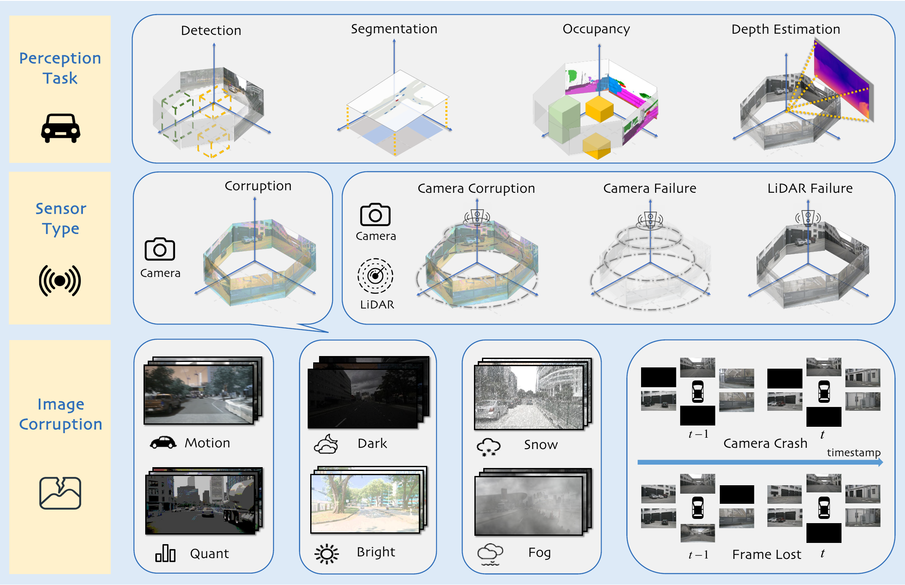
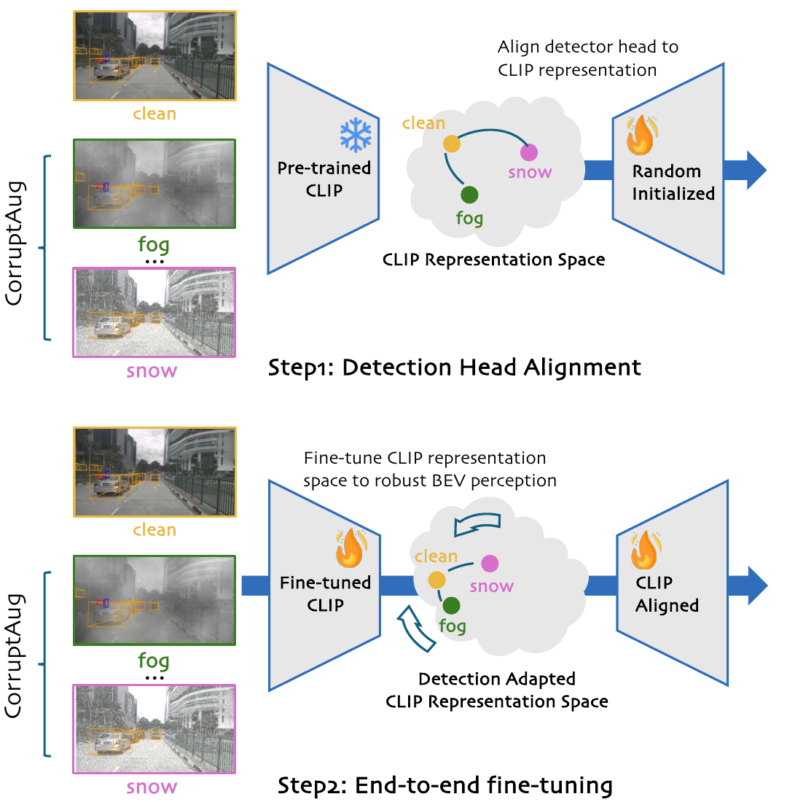
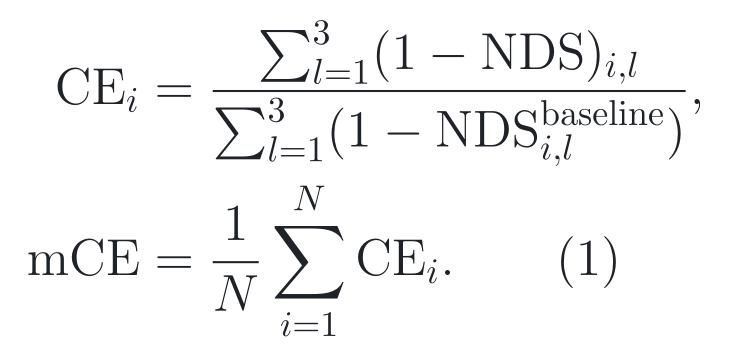
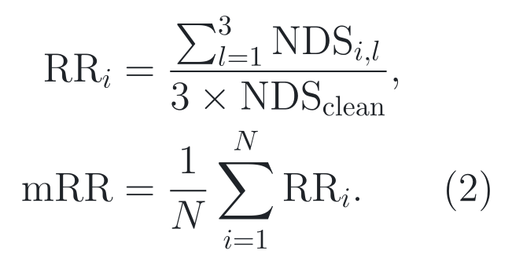
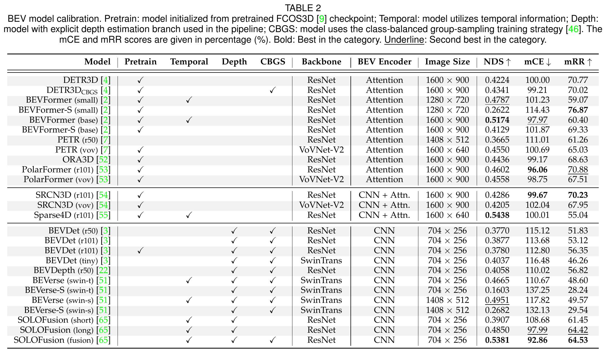
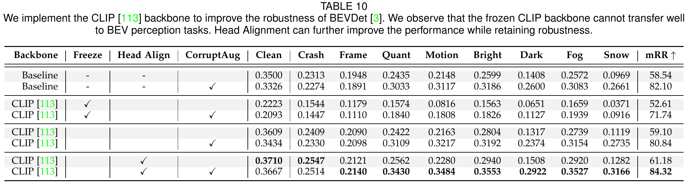

# 2026-08-06 — Benchmarking and Improving Bird’s Eye View Perception Robustness in Autonomous Driving

`IEEE TPAMI 2025` · `Accepted` · `论文与作者版 PDF 已读 / 固定源码已审 / checkpoint 未运行`

**主方向：** P09 · 鲁棒、开放世界与可信感知 ·
**输入模态：** Surround Camera · LiDAR ·
**交叉标签：** BEV、自然腐蚀、传感器失效、3D 目标检测、地图分割、深度估计、语义 Occupancy、CLIP

[▶ 从第一张图开始](#1-看图论文到底做了什么) ·
[返回首页](../../README.md) · [全部精读](../../index/papers.md) ·
[官方录用页](https://ieeexplore.ieee.org/document/10857618) ·
[作者版 PDF](https://arxiv.org/pdf/2405.17426) ·
[官方代码 @ 3a32edaba9434dc27791bd25a1168951d091bd89](https://github.com/worldbench/RoboBEV/tree/3a32edaba9434dc27791bd25a1168951d091bd89)

证据与行文标签：**[原文翻译]** 忠实中文译文；**[笔记解释]** 帮助理解的通俗讲解；**[论文]** 作者材料直接支持；**[源码]** 固定 commit 直接支持；**[判断]** 本笔记分析；**[未核验]** 尚未独立运行或确认。译文中不混入解释或判断。

## 0. 阅读起点：术语先导与摘要完整翻译

### 0.1 首次术语解释

**术语覆盖声明：** 摘要中的核心专业术语先在这里解释；摘要之后第一次出现的新术语仍在正文首次出现处解释，后文锁定相同中文名、英文名、缩写与符号。

- **鸟瞰图表示（Bird’s-Eye-View representation, BEV）**：把多相机或激光雷达观测统一到车辆周围的俯视坐标平面或体素空间；本文评价的是采用这类表示的感知模型，而不是一种单一网络。
- **域内（in-distribution, ID）与分布外（out-of-distribution, OOD）**：ID 指与训练、标准测试分布相近的输入；OOD 指天气、成像、时序或传感器状态发生偏移的输入。本文的 OOD 主要是合成自然腐蚀和传感器失效，不等于所有真实道路未知情况。
- **鲁棒性（robustness）**：模型在输入分布偏移或传感器退化时维持任务性能的能力；本文同时比较绝对性能和相对保持率。
- **自然腐蚀（natural corruption）**：用亮度、暗光、雾、雪、运动模糊、颜色量化、相机掉线和丢帧模拟的输入退化；它是可重复压力测试，不是对真实天气物理过程的完整仿真。
- **传感器失效（sensor failure）**：相机或激光雷达输入部分或全部不可用；本文多模态实验中的“LiDAR failure”保留前方视场点云，并非处处无点。
- **三维目标检测（3D object detection）**：预测道路参与者的类别与三维框；本文以 nuScenes Detection Score（NDS）等离线指标评价。
- **地图分割（map segmentation）**：在 BEV 网格上预测道路结构类别；这里不是在线构建完整 HD Map。
- **多相机深度估计（multi-camera depth estimation）**：从环视图像预测深度；深度误差与三维检测是否正确相关，但二者不是同一指标。
- **语义 Occupancy 预测（semantic occupancy prediction）**：在三维体素中预测占用与语义类别；方法名和任务名保留 Occupancy 原词。
- **对比语言—图像预训练（Contrastive Language–Image Pre-training, CLIP）**：在大规模图文对上预训练的视觉—语言模型；本文只使用其视觉主干探索鲁棒 BEV 检测，不执行语言推理。
- **平均腐蚀误差（mean Corruption Error, mCE）**：以 DETR3D 为参照，比较不同腐蚀和三个强度下的 NDS 误差，越低越好。
- **平均韧性率（mean Resilience Rate, mRR）**：把每个模型的腐蚀 NDS 除以自身干净 NDS 后平均，越高表示保留比例越大；高 mRR 不保证高绝对精度。
- **RoboBEV / nuScenes-C**：RoboBEV 是作者提出的评测与分析套件；nuScenes-C 是从 nuScenes 验证图像构造的腐蚀集，方法名和数据集名保留原名。

### 0.2 摘要完整专业中文翻译

**原文锚点：** Abstract，作者版 PDF p. 1。

<a id="abstract-a01"></a>
> **[原文翻译] Abstract · PDF p. 1 · A01**
>
> 近年来，鸟瞰图（BEV）表示在车载三维感知方面展现出显著潜力。然而，尽管这些方法在标准基准上取得了令人印象深刻的结果，其在多变条件下的鲁棒性仍缺乏充分评估。在本研究中，我们提出 RoboBEV，一套用于评价 BEV 算法韧性的广泛基准。该套件纳入多种相机腐蚀类型，并对每种类型考察三个严重程度。我们的基准还考虑了多模态模型使用过程中完整传感器失效的影响。通过 RoboBEV，我们评估了 33 个最先进的基于 BEV 的感知模型，覆盖检测、地图分割、深度估计和 Occupancy 预测等任务。分析表明，模型在域内数据集上的性能与其应对分布外挑战的韧性之间存在明显相关性。实验结果还突出表明，预训练和无显式深度的 BEV 变换等策略能够有效增强对分布外数据的鲁棒性。此外，我们观察到，利用更广泛的时序信息会显著提高模型鲁棒性。基于这些观察，我们设计了一种基于 CLIP 模型的有效鲁棒性增强策略。本研究所得见解为开发能够将准确性与真实世界鲁棒性无缝结合的未来 BEV 模型铺平道路。基准工具包与模型 checkpoint 已公开于作者仓库。

**完整性声明：** 上文按原摘要唯一实质段落完整翻译，覆盖全部比较、限定、任务范围和公开材料声明；没有删减或以 TL;DR 替代，也没有抽取不清内容。

> [!TIP]
> **[笔记解释] 读完摘要再看这一句：** RoboBEV 最有价值的不是再造一个更高 NDS 的检测器，而是把 33 个 BEV 模型放进同一组腐蚀与失效压力测试，证明“干净集更准”与“退化后保留比例更高”是两件事；但它没有覆盖全部真实 OOD，也没有在公开固定源码中给出 CLIP 两阶段训练配方。

### 0.3 为什么今天值得读

**新近性与录用：** **[论文]** publication status 为 **Accepted**；论文于 2025 年正式发表于 IEEE Transactions on Pattern Analysis and Machine Intelligence，第 47 卷第 5 期，页码 3878–3894，DOI 为 10.1109/TPAMI.2025.3535960；[IEEE 录用页](https://ieeexplore.ieee.org/document/10857618)与作者版 PDF 的题名、作者和结论一致。

**影响与社区信号：** **[判断]** 截至 2026-08-06，OpenAlex 记录 11 次引用；[官方 GitHub](https://github.com/worldbench/RoboBEV)显示约 426 Star、41 Fork，并延伸为 RoboDrive Challenge 的公开工具链。这些是采用与注意力信号，不等于论文数字已被本仓库复现，也不证明每个评测实现没有风险。

**作者与团队脉络：** **[论文/判断]** 论文 affiliation 覆盖 UC Irvine、NUS / CNRS@CREATE、NTU S-Lab 与上海人工智能实验室；[Shaoyuan Xie 官方主页](https://daniel-xsy.github.io/)还列出 RoboDepth、相机三维检测对抗鲁棒性等连续工作。团队脉络帮助发现候选；团队或机构声誉不等于论文质量，也不替代方法质量、受控证据或固定源码审计。

**覆盖与研究价值：** **[判断]** 当前 13 类覆盖表中 P09 尚未有精读，最长未读；这篇补上“自然腐蚀—传感器失效—相对鲁棒性—失效边界”的基本坐标系。读完后应改变一个研究判断：只报干净 NDS，或只报归一化保留率，都不足以判断一个 BEV 模型在退化输入下是否更可靠。

**候选对照：** **[判断]** 本轮同时核验了 [UniScene（CVPR 2025）](https://openaccess.thecvf.com/content/CVPR2025/html/Li_UniScene_Unified_Occupancy-centric_Driving_Scene_Generation_CVPR_2025_paper.html)与 [EfficientOCF（CVPR 2025）](https://openaccess.thecvf.com/content/CVPR2025/html/Xu_Spatiotemporal_Decoupling_for_Efficient_Vision-Based_Occupancy_Forecasting_CVPR_2025_paper.html)。按新近性与录用质量、感知与覆盖、影响信号、团队脉络、材料与源码、研究决策价值六项，RoboBEV 为 9.5/10，UniScene 为 8.7/10，EfficientOCF 为 7.7/10；今天先读 RoboBEV，是因为它同时填补 P09 空缺、提供四任务受控分析和可固定的公开评测链，而不是因为机构或 Star 更高。

### 0.4 问题背景与前置工作

**30 秒问题背景：** **[笔记解释]** 想象夜间高架出口：前车溅起水雾，一路相机因线缆抖动间歇黑屏，激光雷达前向点还在。标准验证集上的 BEV 检测器也许很准，但图像退化会先污染透视特征，再经视角变换写入车辆坐标下的 BEV，最后让三维框、地图或占用结果一起偏移。这个故事只建立“错误怎样沿信息流传播”的直觉，不等于真实道路安全证据；RoboBEV 测的是离线任务性能，不测车辆闭环行为。

**任务与评价对象：** **[论文]** 六路环视图像，或环视图像与 LiDAR → 各模型自己的图像主干、视角变换、BEV encoder 与 prediction heads → 三维框、BEV 地图、深度或三维 Occupancy → 在 nuScenes 验证协议及其腐蚀版本上计算 NDS、mAP、mIoU、深度误差等。来源：论文 Figure 1、§4–§5，PDF p. 2、5–11。NDS 不是总体 accuracy，mRR 不是“预测正确概率”，离线下降也不是闭环事故率。

**关键前置算法：** **[论文/笔记解释]** 第一，BEV 表示把多视角信息统一到车辆坐标，便于不同 heads 消费，但投影或显式深度估计会成为输入腐蚀的传播接口。第二，[BEVFormer](https://www.ecva.net/papers/eccv_2022/papers_ECCV/html/694_ECCV_2022_paper.php)代表用时空注意力形成 BEV 的路线；时间信息能补帧，也可能累积旧错误。第三，[DETR3D](https://proceedings.mlr.press/v164/wang22b.html)用三维查询采样多视图特征，并被本文选作 mCE 参照；参照模型改变会改变 mCE 数值。第四，[ImageNet-C](https://openreview.net/forum?id=HJz6tiCqYm)式 common-corruption 评测把干净输入系统性退化，但二维分类协议不能直接回答多传感器、时序与三维任务的失效。

**相关论文路线：**

- **ImageNet-C → 3D-C → RoboBEV：** [3D-C 官方 CVPR 2023 页面](https://openaccess.thecvf.com/content/CVPR2023/html/Dong_Benchmarking_Robustness_of_3D_Object_Detection_to_Common_Corruptions_CVPR_2023_paper.html)把 27 类相机/LiDAR common corruptions 引入 KITTI、nuScenes 和 Waymo 三维检测；本文 RoboBEV 更集中比较 BEV 表示，并扩到地图、深度、Occupancy 和时序掉帧。3D-C 已覆盖多模态腐蚀，因此不能把“3D 感知腐蚀基准”当作本文独有首创。
- **BEVFusion → MetaBEV ↔ RoboBEV：** [MetaBEV 官方 ICCV 2023 PDF](https://openaccess.thecvf.com/content/ICCV2023/papers/Ge_MetaBEV_Solving_Sensor_Failures_for_3D_Detection_and_Map_Segmentation_ICCV_2023_paper.pdf)直接训练模型应对缺相机或缺 LiDAR；本文 RoboBEV 主要做跨模型诊断，并用有限传感器失效协议比较既有模型。前者回答“怎样训练更抗缺模态”，本文回答“哪些设计在同一压力测试下怎样失效”。

**本文接在哪里：** **[判断]** 既有路线已证明 common corruption 和缺失模态会伤害三维感知；仍卡在不同 BEV 设计、任务和相对/绝对指标缺少统一对照。RoboBEV 新增的是一套四任务基准、跨 33 模型分析和一个 CLIP 适配实验；各模型的 ResNet、VoVNet、Swin、BEV encoder 与 prediction heads 都是继承能力，真实联合天气、开放集未知目标与闭环风险仍未解决。

**资料使用边界：** **[判断]** 本次使用 OpenAlex、GitHub 元数据和搜索结果做候选召回与影响排序；所有录用、方法、数字、页码和源码行为均回到原论文、IEEE 页面、作者版 PDF、官方项目以及固定 40 位 commit。解析帖子、视频和聚合榜单不作为最终证据。

**学习顺序：** [0 摘要与术语](#0-阅读起点术语先导与摘要完整翻译) → [1 看原图](#1-看图论文到底做了什么) → [2 读原式](#2-读公式核心机制怎样表达) → [3 看结果](#3-看结果证据是否支持主张) → [4 对源码](#4-对源码公式如何落地) → [5 记结论](#5-记结论贡献边界与开放问题)

## 1. 看图：论文到底做了什么



> **原图出处：** Xie et al., IEEE TPAMI 2025, Figure 1，PDF p. 2。[官方 PDF](https://arxiv.org/pdf/2405.17426)。仅作学术讲解所需的局部摘录，原图版权归原作者及其他权利人。

### 这张图按什么顺序看

1. 顶行先看评测输出：三维检测、地图分割、Occupancy 和深度估计不是同一个任务，也不能用一个指标混排。
2. 中行再看输入状态：相机腐蚀、相机失效和 LiDAR 失效对应不同信息缺口。
3. 底行最后看八类相机退化：Motion、Dark、Snow、Quant、Bright、Fog 是空间/成像腐蚀；Camera Crash 与 Frame Lost 还改变多视角和时序信息可用性。

**看完应能复述：** RoboBEV 固定数据与腐蚀协议，把已有 BEV 模型的输入替换为三个强度的退化版本，再用各任务原指标和 mCE/mRR 比较绝对性能与保持比例。

**这张图没有证明：** Figure 1 是方法/基准结构图，不能证明任何模型更鲁棒、CLIP 训练有效或合成腐蚀等价于真实天气。

### 整体算法架构与创新设计

**原方法瓶颈：** **[论文]** 标准 nuScenes 排名只能回答干净分布下谁更准，不能分离“模型本来精度高”与“模型遇到腐蚀时掉得少”；常见 BEV 工作还分散在检测、分割、深度和 Occupancy，传感器掉线与时序掉帧协议不统一。来源：论文 §1、§4，PDF p. 1–5。

**主干网络与基线：** **[论文/源码]** 这是一篇基准与分析论文，没有单一默认 backbone、neck 或 prediction head。Table 2 覆盖 ResNet、VoVNet-V2、Swin，Attention、CNN 与混合 BEV encoder，以及各模型原有 heads；mCE 的直接参照固定为 DETR3D。CLIP 受控实验则以 BEVDet 为任务框架，用预训练 CLIP 视觉 backbone 替换原图像 backbone。固定仓库的[模型结果与基线清单](https://github.com/worldbench/RoboBEV/blob/3a32edaba9434dc27791bd25a1168951d091bd89/README.md#L219-L312)与论文 Table 2 一致。

**继承与新增边界：** **[论文/源码]** 继承的是 33 个模型各自的 backbone、视角变换、BEV encoder、heads、公开 checkpoint 与 nuScenes evaluator；新增的是 nuScenes-C 数据构造、腐蚀/失效协议、mCE/mRR 双指标和两阶段 CLIP 适配实验。固定仓库还 vendoring 多个模型代码库，不能把这些基础模型能力记作 RoboBEV 原创。来源：论文 §4–§6，PDF p. 5–14；[固定仓库树](https://github.com/worldbench/RoboBEV/tree/3a32edaba9434dc27791bd25a1168951d091bd89/zoo)。

**端到端信息流：** **[论文]** nuScenes 验证集六路、1600 × 900 原始图像 → 选定腐蚀类型与 easy / moderate / hard 强度 → 把退化图像按原多相机顺序送入被测模型 → 模型自己的 backbone / view transform / BEV encoder → 检测、地图、深度或 Occupancy head → 原任务指标 → 按腐蚀与强度汇总 mCE/mRR。多模态失效实验另把相机置零，或只保留 LiDAR 前方 −45° 到 45° 视场。来源：Figure 1、Table 1、§4.1–§4.3，PDF p. 2、5。

**总体训练方式：** **[论文/源码]** 主 benchmark 以公开 config/checkpoint 做推理，不统一重训全部 33 模型；BEVDet-R101、PolarFormer-VoV 与 SRCN3D-VoV 为受控条件重实现，VoV 模型为避开 DD3D trainval 泄漏，改以 DDAD15M 上的 FCOS3D 深度预训练初始化后在 nuScenes train 上微调。CLIP 实验为两阶段：先冻结 CLIP backbone，仅用带腐蚀增强的输入训练随机初始化检测 head；再解冻并端到端微调。作者未公开统一硬件、优化器、学习率、batch size、epochs、随机种子或重复次数；固定仓库也未随 Figure 4 公开对应 CLIP 训练 config。来源：论文 §5.1、§5.5.2，PDF p. 5–6、10–11。

#### 创新单元 1：nuScenes-C 多强度腐蚀与失效协议

**位置与接口：** 位于原 nuScenes 图像文件和既有模型数据加载器之间；不改变模型 heads，而是替换读取路径或直接生成腐蚀图像。

**输入：** 六路相机图像，shape 为每张 1600 × 900 × 3；腐蚀类型、easy / mid / hard 级别；多模态失效实验还读取相机或 LiDAR 输入。

**内部变换：** 先反归一化到 0–255 像素，再逐 batch、逐相机施加 brightness、dark、fog、snow、motion blur 或 color quantization；Camera Crash 把选中视角置零，Frame Lost 以强度相关概率把帧置零；最后按腐蚀/强度/相机子目录写盘。固定实现的真实执行顺序见[腐蚀算子](https://github.com/worldbench/RoboBEV/blob/3a32edaba9434dc27791bd25a1168951d091bd89/corruptions/project/mmdet3d_plugin/corruptions.py#L47-L68)与[生成循环](https://github.com/worldbench/RoboBEV/blob/3a32edaba9434dc27791bd25a1168951d091bd89/corruptions/tools/generate_dataset.py#L89-L121)。

**输出：** 866,736 张腐蚀图像组成的 nuScenes-C 目录；评测时由每个模型原 pipeline 消费，模型输出仍是自己的三维框、地图、深度或 Occupancy。

**为什么这样设计：** **[论文] 作者明确动机：** 作者要覆盖外部环境、成像/传感器和时序三类自然退化，并为每类设置三个强度，以观察模型退化曲线而非单点。来源：论文 §1、§4.1–§4.2，PDF p. 1–5。

**训练信号：** **[论文/源码]** 该单元本身无需训练；主 benchmark 只改变输入。腐蚀增强仅用于 §5.5 的独立鲁棒性增强实验，不能与 benchmark 测试集混为常规训练数据。

**作用与证据：** **[论文]** Table 1 给出八类腐蚀的三档参数；Table 2 的受控比较干预是“同一 DETR3D checkpoint 的 clean 输入 → 指定腐蚀与三个强度后取均值”，clean NDS 为 0.4224，Dark 为 0.2786（绝对下降 0.1438），Snow 为 0.1913（绝对下降 0.2311）。这支持压力测试造成性能退化；它不证明每类合成退化都逼真。来源：Table 1–2，PDF p. 5–6。

**论文位置：** **[论文]** Figure 1、Table 1、§4.1–§4.2，PDF p. 2、5。

**源码入口：** **[源码]** [CameraCrash / FrameLost @ 固定 SHA](https://github.com/worldbench/RoboBEV/blob/3a32edaba9434dc27791bd25a1168951d091bd89/corruptions/project/mmdet3d_plugin/corruptions.py#L244-L321)；[严重度配置 @ 固定 SHA](https://github.com/worldbench/RoboBEV/blob/3a32edaba9434dc27791bd25a1168951d091bd89/corruptions/project/config/nuscenes_c.py#L53-L60)。

#### 创新单元 2：绝对误差 mCE 与相对保持率 mRR 双指标

**位置与接口：** 位于各任务 evaluator 输出之后；它不改变预测，只把 clean 与三档腐蚀结果汇总成模型间可比的两个视角。

**输入：** 每个模型的 clean NDS、每一腐蚀类型在三个强度下的 NDS，以及 DETR3D 参照结果。

**内部变换：** mCE 先把 NDS 变成误差并除以 DETR3D 同条件误差，再跨腐蚀平均；mRR 先除以模型自身 clean NDS，再跨强度与腐蚀平均。

**输出：** 越低越好的 mCE 与越高越好的 mRR，分别回答“相对参照的绝对腐蚀误差有多大”和“自身干净能力保留多少”。

**为什么这样设计：** **[论文] 作者明确动机：** 作者指出 clean 精度与腐蚀后绝对性能相关，但相对鲁棒性不会随 clean 精度单调增加，因此需要同时看 baseline-relative error 与 self-normalized retention。来源：论文 §4.3、§5.2.1，PDF p. 5–6。

**训练信号：** **[论文/源码]** 两个指标是 evaluation-only state，不参与梯度、不训练任何 query 或 backbone；固定评测脚本只收集 NDS/mAP 等原始指标并按强度平均。来源：论文 Eq. (1)–(2)、§4.3，PDF p. 5；[固定结果解析](https://github.com/worldbench/RoboBEV/blob/3a32edaba9434dc27791bd25a1168951d091bd89/corruptions/tools/analysis_tools/parse_results.py#L7-L65)。

**作用与证据：** **[论文]** Table 2 是同一 nuScenes-C 协议下的受控比较：相比 PolarFormer-R101 的 clean NDS 0.4602、mRR 70.88，Sparse4D clean NDS 为 0.5438，却只有 55.04 mRR。前者 clean 高 0.0836、相对约 18.2%，后者 mRR 高 15.84 点、相对约 28.8%，直接说明两个维度不能互相替代。来源：Table 2，PDF p. 6。

**论文位置：** **[论文]** Eq. (1)–(2)、Table 2、§4.3，PDF p. 5–6。

**源码入口：** **[源码]** [README 指标定义与固定结果 @ 固定 SHA](https://github.com/worldbench/RoboBEV/blob/3a32edaba9434dc27791bd25a1168951d091bd89/README.md#L219-L253)；[原始 metric 聚合 @ 固定 SHA](https://github.com/worldbench/RoboBEV/blob/3a32edaba9434dc27791bd25a1168951d091bd89/corruptions/tools/analysis_tools/parse_results.py#L7-L65)。

#### 创新单元 3：Two-Stage CLIP Detection-Head Alignment

**位置与接口：** 用 CLIP 视觉 encoder 替换 BEVDet 的图像 backbone，BEV view transform 与 detection head 接在其后；先只调整 head，再解冻 backbone。

**输入：** clean 与 corruption-augmented 环视图像；论文 Figure 4 没有公开 CLIP 具体变体、特征层、通道 shape 或所有增强采样比例。

**内部变换：** 第一步冻结预训练 CLIP，随机初始化 detection head，并让带腐蚀样本的检测损失只更新 head，使下游 head 适配 CLIP 表示；第二步解冻 CLIP，与已对齐 head 端到端微调。

**输出：** 用于 BEVDet 三维检测的适配后图像特征与检测预测；没有跨帧 prediction-relevant state 写回。

**为什么这样设计：** **[论文] 作者明确动机：** 冻结 CLIP 直接接随机 head 的 clean 与 OOD 表现都差，而随机 head 端到端微调只带来有限鲁棒收益；作者因此先对齐 head，避免一开始就由随机任务头牵动预训练表示。来源：论文 §5.5.2、Figure 4，PDF p. 10–11。

**训练信号：** **[论文]** 第一步中三维检测损失直接训练 detection head，冻结操作阻断 CLIP 参数梯度；第二步同一任务损失经 head 反传到 CLIP 与 head。论文未公开各损失权重、detach 位置、优化器或冻结时长，不能再扩写为更具体机制。来源：论文 Figure 4、§5.5.2，PDF p. 10–11。

**作用与证据：** **[论文]** Table 10 的受控比较干预是“端到端 CLIP → 加入 head align 后再端到端”：无腐蚀增强时 clean NDS 从 0.3609 到 0.3710，mRR 从 59.10 到 61.18、提升 2.08 点；有腐蚀增强时 clean NDS 从 0.3434 到 0.3667，mRR 从 80.84 到 84.32、提升 3.48 点。它支持阶段顺序在该 BEVDet/nuScenes-C 设置中有效，不支持所有 CLIP、所有 BEV 模型或真实道路都提升。来源：论文 Table 10、§5.5.2，PDF p. 11。

**论文位置：** **[论文]** Figure 4、Table 10、§5.5.2，PDF p. 10–11。

**源码入口：** **[源码]** [固定 README @ 3a32edaba9434dc27791bd25a1168951d091bd89](https://github.com/worldbench/RoboBEV/blob/3a32edaba9434dc27791bd25a1168951d091bd89/README.md#L219-L335)与[官方固定仓库树](https://github.com/worldbench/RoboBEV/tree/3a32edaba9434dc27791bd25a1168951d091bd89)可审计；该固定树中与 CLIP 命中的文件只有 vendored MMDetection3D 通用 `clip_sigmoid.py`，Figure 4 / Table 10 对应 trainer、config 与 checkpoint 不在该固定树。本卡训练机制因此以论文证据为准，不能声称源码已复现。



> **原图出处：** Xie et al., IEEE TPAMI 2025, Figure 4，PDF p. 10。[官方 PDF](https://arxiv.org/pdf/2405.17426)。仅作学术讲解所需的局部摘录，原图版权归原作者及其他权利人。

**[笔记解释] 用一句因果链收束：** 标准榜单看不见退化差异 → nuScenes-C 把退化变成受控输入 → mCE/mRR 分离绝对与相对鲁棒性 → 跨模型分析发现预训练、深度变换和时序是关键轴 → 两阶段 CLIP 实验只对其中“预训练表示怎样迁入 BEV”做了一个受控干预。

## 2. 读公式：核心机制怎样表达

**变量身份图例：** **[领域惯用]** 表示语义角色在本领域常见，但不表示所有论文都使用同一个字母；**[本文定义]** 表示论文给该符号赋予了本文特定含义；**[源码/笔记重排]** 表示固定源码等价式或本笔记计算新增的符号。

### 原文公式 1：平均腐蚀误差 mCE

**原文公式：** 论文 Eq. (1)，PDF p. 5。

<p align="center"><picture><source media="(prefers-color-scheme: dark)" srcset="../../assets/notes/2026-08-06-robobev/formulas/eq-01-mce-dark.png"></picture></p>

> **公式来源：** Xie et al., IEEE TPAMI 2025, Eq. (1)，PDF p. 5；本图按原符号重排。[官方 PDF](https://arxiv.org/pdf/2405.17426) · [可复制 TeX](../../assets/notes/2026-08-06-robobev/formulas/source.tex#L4-L13)。

**先建立画面：** **[笔记解释]** 把每种天气想成三段越来越陡的湿滑坡道：先统计候选车手三段各丢了多少分，再除以同一坡道上 DETR3D 丢掉的分数；最后对所有坡道取平均。

**变量逐项解释与身份：** **[领域惯用]** *i* 表示腐蚀类型索引、*l* 表示严重度索引、求和符号表示遍历集合，这些语义角色常见但字母不强制；**[本文定义]** NDS<sub>*i,l*</sub> 是候选模型在第 *i* 类、第 *l* 档腐蚀下的 nuScenes Detection Score，值域通常为 0–1、无物理单位；NDS<sup>baseline</sup><sub>*i,l*</sub> 是 DETR3D 同条件分数；CE<sub>*i*</sub> 是该腐蚀的相对误差；*N* 是腐蚀类型数；3 是每类严重度数量；mCE 是跨 *N* 类平均结果。所有量只在评测阶段读取，不可学习。

**变量变化会怎样：** 在其他量暂时不变时，候选 NDS 下降会增大分子并抬高 CE；参照 NDS 下降会增大分母、反而压低 CE，因此 mCE 依赖所选 baseline。增加一种高 CE 腐蚀会抬高 mCE。不同任务、不同 baseline 或不同腐蚀集合下的 mCE 不能直接混比。

**纯文字读法：** 对每种腐蚀，把候选模型在三个强度上的一减 NDS 相加，再除以 DETR3D 在相同三个强度上的一减 NDS 之和，得到该腐蚀 CE；最后对全部腐蚀 CE 求平均得到 mCE。

**教学小例子：** **[笔记解释]** 若候选在某种雾的三个强度下 NDS 为 0.8、0.7、0.6，误差和为 0.9；DETR3D 为 0.7、0.6、0.5，误差和为 1.2，则该雾的 CE 为 0.75。若另一腐蚀 CE 为 0.90，两类平均 mCE 为 0.825。这是教学示例，不是论文实验；它只说明“相对参照少掉分”怎样进入指标。

**符号说明：** mCE 越低越好；100% 对应与 DETR3D 总误差相当，低于 100% 表示相对更小的腐蚀误差。

**专业解释：** mCE 保留较多绝对性能信息，因为它没有除以候选自己的 clean 分数，但它把评价锚定到 DETR3D；参照改变，数值尺度也会改变。

**回到上面的图：** Figure 1 的每类腐蚀和三档强度先产生 NDS，再进入本式；它不是网络内部 loss。

**落到源码：** [固定 README 的 mCE 定义与结果](https://github.com/worldbench/RoboBEV/blob/3a32edaba9434dc27791bd25a1168951d091bd89/README.md#L219-L253)。

**公式省略了什么：** 固定 `parse_results.py` 公开了 NDS 等原始指标的收集和强度平均，但本次审到的固定路径没有独立 mCE 计算函数；论文还没有给跨随机腐蚀生成的重复次数或置信区间。

### 原文公式 2：平均韧性率 mRR

**原文公式：** 论文 Eq. (2)，PDF p. 5。

<p align="center"><picture><source media="(prefers-color-scheme: dark)" srcset="../../assets/notes/2026-08-06-robobev/formulas/eq-02-mrr-dark.png"></picture></p>

> **公式来源：** Xie et al., IEEE TPAMI 2025, Eq. (2)，PDF p. 5；本图按原符号重排。[官方 PDF](https://arxiv.org/pdf/2405.17426) · [可复制 TeX](../../assets/notes/2026-08-06-robobev/formulas/source.tex#L15-L24)。

**先建立画面：** **[笔记解释]** 这次不和别的车手比，而问自己“下雨后还保留平时几成功力”：三个强度的成绩相加，除以三次干净成绩，再对所有腐蚀平均。

**变量逐项解释与身份：** **[领域惯用]** *i*、*l* 与求和仍分别承担腐蚀、强度和遍历角色，语义惯用但字母不强制；**[本文定义]** NDS<sub>*i,l*</sub> 是同一候选模型在腐蚀 *i*、强度 *l* 下的 NDS；NDS<sub>clean</sub> 是该模型干净验证集 NDS；RR<sub>*i*</sub> 是第 *i* 类腐蚀的保持比例；*N* 是腐蚀类型数；3 是强度数量；mRR 是所有 RR 的平均。它们均为 evaluation-only，不参与训练。

**变量变化会怎样：** 在 clean NDS 和其他量不变时，任一腐蚀 NDS 增大都会提高 RR；在腐蚀 NDS 固定时，clean NDS 增大反而会降低 RR，所以弱模型可能有较高保持率。若 clean NDS 接近零，比例会不稳定；论文被测模型的 clean NDS 均非零。

**纯文字读法：** 对每种腐蚀，把模型三个严重度的 NDS 相加，除以三倍的同一模型 clean NDS，得到该腐蚀的韧性率；再对全部腐蚀求平均得到 mRR。

**教学小例子：** **[笔记解释]** 一个模型 clean NDS 为 0.50，某腐蚀三档为 0.40、0.30、0.20，则 RR 是 0.90 除以 1.50，即 0.60；若另一腐蚀 RR 为 0.80，两类平均 mRR 为 0.70。这是教学示例，不是论文实验；70% 只表示保留比例，不表示 70% 的目标检测正确。

**符号说明：** mRR 越高越好，论文以百分数报告；它与模型自身 clean 分数绑定。

**专业解释：** mRR 对“从自己的起点掉了多少”更敏感，适合发现高 clean 模型在 OOD 下相对退化过快；但它会掩盖低起点，必须与 clean NDS 和 mCE 并读。

**回到上面的图：** Figure 1 的同一模型分别走 clean 和 corruption 两条输入路径，本式计算两条路径的性能比。

**落到源码：** [固定 README 的 mRR 定义与结果](https://github.com/worldbench/RoboBEV/blob/3a32edaba9434dc27791bd25a1168951d091bd89/README.md#L219-L253)。

**公式省略了什么：** 公式没有编码 corruption realism、类别长尾、错误相关性、时间连续性或闭环代价；不同模型的阈值、后处理和 checkpoint 来源仍可能影响分数。

## 3. 看结果：证据是否支持主张

### 3.0 数据集与实验设计总览

**数据集与任务：** **[论文]** train 状态：受控重实现和 CLIP 实验使用 nuScenes train，主 benchmark 的公共 checkpoint 沿各来源模型训练集；val 状态：nuScenes-C 由 nuScenes validation 图像构造，共 866,736 张 1600 × 900 图像，每种腐蚀三个强度；test 状态：原文未使用或公开 hidden test 标签/test server 提交。检测实验使用 nuScenes 的 10 类三维检测与 NDS/mAP，地图分割、深度、语义 Occupancy 分别沿被测模型的公开 validation 协议；固定 config 指向 `nuscenes_infos_temporal_val.pkl`。来源：论文 §4.1、§5.1，PDF p. 5–6。

**传感器与输入：** **[论文/源码]** 相机任务读六路 surround camera；多模态任务还读 LiDAR。Camera failure 把相机像素置零；所谓 LiDAR failure 只保留 −45° 到 45° 前向视场点，因为完全移除 LiDAR 会使被测融合模型 NDS 接近零。固定通用生成 config 是 camera-only、1600 × 900、batch 1、16 workers；具体模型仍使用各自分辨率和 pipeline。来源：§4.1、Table 2，PDF p. 5–6；[固定 config](https://github.com/worldbench/RoboBEV/blob/3a32edaba9434dc27791bd25a1168951d091bd89/corruptions/project/config/nuscenes_c.py#L1-L50)。

**实验分组：**

- **主 benchmark：** 30 个 camera-only 模型在八类、三档 nuScenes-C 上做三维检测；另有地图、深度、Occupancy，总计 33 个 BEV 模型。
- **设计轴分析：** 按预训练、时序、显式深度、CBGS、backbone 和 BEV encoder 分组；这多为跨模型相关分析，不全是单变量消融。
- **多模态失效：** camera corruption、camera failure 和有限前向 LiDAR failure，比较 BEVFusion、TransFusion 等。
- **真实域偏移：** Day → Night、Dry → Rain 的域迁移实验，用来检查合成腐蚀增强是否有方向一致的收益。
- **鲁棒性增强：** corruption augmentation 与 CLIP 三种适配策略；Table 10 是最清晰的阶段顺序受控比较。
- **效率/部署：** **[未核验]** 原文未提供统一 FLOPs、墙钟时延、显存、硬件功耗或部署失败率对照。

**训练—验证—测试路线：** **[论文/源码]** nuScenes val 图像 → 固定脚本生成腐蚀目录 → 读取公开或受控重训 checkpoint → 对 clean 与每类 easy / mid / hard 顺序推理 → 原 nuScenes evaluator 得到 NDS/mAP 等 → 汇总 mCE/mRR。CLIP 另走 nuScenes train 上的 head alignment → 端到端微调 → clean/nuScenes-C val。作者流程与固定源码均未形成从 CLIP 训练到 Table 10 checkpoint 的完整闭环；本仓库未运行。

**指标与回答的问题：** **[论文/笔记解释]** NDS 越高越好，综合 mAP 与平移、尺度、朝向、速度、属性误差；mCE 越低表示相对 DETR3D 的腐蚀误差更小；mRR 越高表示相对自己的 clean 能力保留更多；深度误差越低越好，地图/Occupancy mIoU 越高越好。NDS 上升不等于每类误差都改善，mIoU 不是总体 accuracy，mRR 高不等于绝对检测可靠，更不等于闭环安全。

**一眼看懂实验结论：** **[判断]** 最强模块级证据是 Table 10：保持 BEVDet 任务框架和 CLIP backbone 时，加入“先 head align”使 corruption-augmented 设置的 clean NDS 从 0.3434 到 0.3667，mRR 从 80.84 到 84.32。最大边界是该结果只来自一个 CLIP/BEVDet 设置，训练细节和 checkpoint 未公开，且训练直接使用 benchmark 腐蚀会削弱其作为模型中心独立测试的意义。

### 3.1 原文公开的实验配置

**原文锚点：** 论文 §4–§6，PDF p. 5–14；固定 SHA 的 README、corruption config 与运行脚本。

- **数据集、版本与 train/val/test 划分。** **[论文]** nuScenes-C 从 nuScenes validation 构造；域迁移用 Day/Night 与 Dry/Rain 子集。作者没有报告 hidden test 提交或完整子集样本数。来源：论文 §4.1、§5.4，PDF p. 5、9。
- **传感器、输入范围、分辨率与预处理。** **[论文/源码]** 原始图像 1600 × 900；Table 2 中具体模型还使用 1280 × 720、1408 × 512、704 × 256 等输入。固定生成器先用 config 的 mean/std 反归一化到 0–255，再执行腐蚀并写 uint8；LiDAR failure 仅保留前向 ±45° 点。来源：论文 §4.1、Table 2，PDF p. 5–6；[固定生成器](https://github.com/worldbench/RoboBEV/blob/3a32edaba9434dc27791bd25a1168951d091bd89/corruptions/project/mmdet3d_plugin/corruptions.py#L47-L68)。
- **训练硬件、软件与关键依赖。** **[源码]** 作者称基于 MMDetection3D；固定仓库安装文档含多套 vendored 环境。**[未核验]** 论文未公开 GPU 型号、训练时长、CUDA/cuDNN 精确组合，且本仓库未安装这些旧版本依赖。来源：论文 §5.1，PDF p. 6；[固定安装文档](https://github.com/worldbench/RoboBEV/blob/3a32edaba9434dc27791bd25a1168951d091bd89/docs/INSTALL.md)。
- **初始化或预训练权重。** **[论文/源码]** 尽可能使用官方公共 checkpoint；受控 VoVNet-V2 重实现用 DDAD15M 上的 FCOS3D depth checkpoint 初始化，再在 nuScenes train 微调；CLIP 用预训练视觉 backbone，第一阶段冻结。来源：论文 §5.1、§5.5.2，PDF p. 6、10–11；[固定 model zoo](https://github.com/worldbench/RoboBEV/blob/3a32edaba9434dc27791bd25a1168951d091bd89/README.md#L151-L217)。
- **优化器、学习率与 scheduler。** **[未核验]** 论文 §5.1、§5.5.2（PDF p. 6、10–11）与固定 CLIP 路径均未公开统一值；不同 zoo 模型保留各自 config，不能猜成同一训练配方。
- **batch size、训练轮数/steps 与增强。** **[源码]** 通用 corruption 生成器 batch 为 1；固定 robust test 由模型 config 决定推理 batch。**[未核验]** CLIP 两阶段的 batch、epochs/steps、增强概率和阶段长度在论文 §5.5.2（PDF p. 10–11）未公开；[固定生成 config](https://github.com/worldbench/RoboBEV/blob/3a32edaba9434dc27791bd25a1168951d091bd89/corruptions/project/config/nuscenes_c.py#L42-L50)。
- **随机种子、重复次数与模型选择。** **[源码/未核验]** `robust_test.py` 默认 seed 0 并可请求 deterministic；`generate_dataset.py` 虽声明 `--seed 0`，却没有把它传给 NumPy/Torch 随机状态。论文 §5（PDF p. 5–11）未公开腐蚀生成重复次数、CLIP 重复训练、置信区间、验证频率或选模标准；[固定参数解析](https://github.com/worldbench/RoboBEV/blob/3a32edaba9434dc27791bd25a1168951d091bd89/corruptions/tools/generate_dataset.py#L14-L31)。
- **推理设置、阈值与后处理。** **[源码]** 固定脚本逐 corruption、逐 easy/mid/hard 修改数据 pipeline 的首个 transform，然后调用 MMDetection3D `multi_gpu_test` 与 dataset evaluator；每个模型的阈值和后处理来自其 vendored config，论文未统一。来源：[固定推理入口](https://github.com/worldbench/RoboBEV/blob/3a32edaba9434dc27791bd25a1168951d091bd89/corruptions/tools/robust_test.py#L240-L277)。
- **指标定义与基线公平设置。** **[论文]** mCE 以 DETR3D 为 baseline；mRR 以模型自身 clean NDS 归一。作者尽量用原 config/checkpoint，并对三种模型做最小修改重实现，但 33 个模型仍存在输入分辨率、预训练、CBGS 和架构差异，Table 2 是校准分析，不是所有轴的单变量因果实验。来源：论文 §4.3、§5.1，PDF p. 5–6。
- **checkpoint 与最短复现入口。** **[源码]** [数据准备](https://github.com/worldbench/RoboBEV/blob/3a32edaba9434dc27791bd25a1168951d091bd89/docs/DATA_PREPARE.md)、[corruption README](https://github.com/worldbench/RoboBEV/blob/3a32edaba9434dc27791bd25a1168951d091bd89/corruptions/README.md)与[评测入口](https://github.com/worldbench/RoboBEV/blob/3a32edaba9434dc27791bd25a1168951d091bd89/corruptions/tools/robust_test.py#L108-L281)公开；**[未核验]** 本仓库没有下载数据或 checkpoint，也没有运行生成、训练或评测。

### 3.2 原文公开的实验流程

**原文锚点：** 论文 §4.1–§5.5，PDF p. 5–11；固定 SHA 数据生成、加载、推理和评测入口。

1. **数据准备：** **[论文/源码]** 从 nuScenes val 读取六视图图像，按八类、三档生成 nuScenes-C，并保存为 corruption / severity / camera-folder / filename；来源：§4.1–§4.2，PDF p. 5；[固定生成器](https://github.com/worldbench/RoboBEV/blob/3a32edaba9434dc27791bd25a1168951d091bd89/corruptions/tools/generate_dataset.py#L89-L121)。
2. **训练阶段：** **[论文]** 主 benchmark 复用公共 checkpoint；受控模型按 §5.1 重训；CLIP 先冻结 backbone 训练 head，再端到端微调。固定仓库没有公开 CLIP 阶段 config，因此 loss、冻结时长和梯度细节止于论文 Figure 4。
3. **验证与选模：** **[未核验]** 原文未公开 CLIP 的验证频率、best checkpoint 规则、随机种子和重复次数；主 benchmark 的 checkpoint 主要来自公开模型 zoo。
4. **推理与后处理：** **[源码]** 固定 `robust_test.py` 构建模型并载入 checkpoint，按腐蚀和强度替换 pipeline 输入，运行 `multi_gpu_test`，再调用各 dataset evaluator；来源：[固定入口](https://github.com/worldbench/RoboBEV/blob/3a32edaba9434dc27791bd25a1168951d091bd89/corruptions/tools/robust_test.py#L123-L277)。
5. **最终评测：** **[论文/源码]** 收集 NDS、mAP、mATE、mASE、mAOE、mAVE、mAAE，跨三档求平均，并按论文 Eq. (1)–(2)汇总 mCE/mRR；来源：§4.3，PDF p. 5；[固定结果解析](https://github.com/worldbench/RoboBEV/blob/3a32edaba9434dc27791bd25a1168951d091bd89/corruptions/tools/analysis_tools/parse_results.py#L7-L65)。

**复现仍缺什么：** CLIP 具体 backbone、特征接口、训练 config、checkpoint、optimizer/scheduler、阶段长度、随机种子与选择规则；若不补齐这些，Table 10 只能视为论文报告结果，不能独立重跑。

### 3.3 核心结果



> **原图出处：** Xie et al., IEEE TPAMI 2025, Table 2，PDF p. 6。[官方 PDF](https://arxiv.org/pdf/2405.17426)。仅作学术讲解所需的局部摘录，原图版权归原作者及其他权利人。

**公平对照先读：** Table 2 把不同公开模型放进相同 nuScenes-C 数据协议，但 backbone、分辨率、预训练和训练配方并不完全匹配；它最适合看相关结构与反例，不适合把任意两行差值都解释为单个模块因果效应。

**绝对点数与相对百分比：** Sparse4D clean NDS 0.5438，比 PolarFormer-R101 的 0.4602 高 0.0836，约高 18.2%；但其 mRR 55.04，比 70.88 低 15.84 点，约低 22.3%。这正是 clean 与 self-normalized robustness 排序反转的反例。



> **原图出处：** Xie et al., IEEE TPAMI 2025, Table 10，PDF p. 11。[官方 PDF](https://arxiv.org/pdf/2405.17426)。仅作学术讲解所需的局部摘录，原图版权归原作者及其他权利人。

### 三个必须看的对照

1. **最强 baseline 反例：** 冻结 CLIP 直接接任务头只有 0.2223 clean NDS、52.61 mRR，均低于 BEVDet baseline 的 0.3500 与 58.54；大规模预训练不等于零适配就可迁移。
2. **关键阶段消融：** 无腐蚀增强时，head alignment 相对 CLIP 端到端微调提升 0.0101 NDS（约 2.8%）和 2.08 mRR 点（约 3.5%）；有增强时提升 0.0233 NDS（约 6.8%）和 3.48 mRR 点（约 4.3%）。
3. **鲁棒增强边界：** baseline 加腐蚀增强后 clean NDS 从 0.3500 降到 0.3326，但 mRR 从 58.54 升到 82.10；它换取更高保持率，却把 benchmark corruption 直接放进训练，不能再把结果解读为对未知腐蚀的纯模型泛化。

### 证据支持

- **[论文]** 所有被测相机 BEV 模型在 nuScenes-C 上都有性能下降；clean NDS 与腐蚀后绝对 NDS 总体相关，但 mRR 不随 clean 单调上升。
- **[论文]** 预训练、无显式深度的 view transformation 与更长时序在论文跨模型/受控分析中通常更鲁棒；证据粒度从受控重实现到相关分析不等，不能统一称为模块消融。
- **[论文]** Table 10 支持“两阶段 head alignment”在作者的 CLIP-BEVDet 实验里优于直接端到端微调；Dark、Fog、Snow 在带增强设置下还分别比端到端 CLIP 高 23.1%、11.8%、15.8% NDS。
- **[论文]** Day → Night 的腐蚀增强 NDS 从 0.0854 到 0.1245，绝对 +0.0391、相对约 +45.8%；Dry → Rain 从 0.3203 到 0.3302，绝对 +0.0099、相对约 +3.1%，说明合成增强的真实域收益高度依场景而异。

### 证据没有支持

- **[判断]** 33 模型规模不等于 33 个严格同配方实验；跨行相关不能把总增益单独归因给预训练、时序、深度或 backbone。
- **[判断]** 合成雾雪、相机黑屏和前向 LiDAR 截断不覆盖真实天气的多传感器耦合、污渍、标定漂移、时钟偏差、开放集目标或闭环恢复策略。
- **[未核验]** 没有随机种子重复、置信区间和统一硬件，不能判断 0.01 左右 NDS 差值的统计稳定性或部署代价。
- **[未核验]** 本仓库没有运行数据生成、checkpoint 或指标脚本；表中数字是论文报告，不是本仓库复现。

## 4. 对源码：公式如何落地

```text
nuScenes validation images
→ generate_dataset.py applies a selected corruption
→ nuScenes-C files are written by type and severity
→ custom_loading.py redirects original camera paths
→ robust_test.py loops over corruption and severity
→ the vendored model predicts
→ the dataset evaluator and parse_results.py record metrics
```

### 1. 数据生成：`CORRUPTIONS` 与 `generate_dataset.main`

- **论文对应：** Figure 1、Table 1 的八类、三档输入构造。
- **源码行为：** `generate_dataset.py` 固定 batch 1，逐类型、逐 easy/mid/hard、逐样本调用 registry 算子；`BaseCorruption` 反归一化、CPU/NumPy 逐相机处理并写 uint8 文件。
- **需要留意：** **[源码]** 命令行虽然有 `--seed`，主函数未调用随机种子设置；CameraCrash 的 `np.random.choice` 默认允许重复抽取，因此 severity 为 2/4/5 时“实际唯一黑屏相机数”可能小于名义数量。这里只报告静态行为与确定性风险，不把未数值追踪的差异定性为 bug。
- [打开固定 SHA 源码](https://github.com/worldbench/RoboBEV/blob/3a32edaba9434dc27791bd25a1168951d091bd89/corruptions/tools/generate_dataset.py#L14-L121)

### 2. 腐蚀读入：`Custom_LoadMultiViewImageFromFiles`

- **论文对应：** 同一 checkpoint 在 clean 与 corruption 路径间切换。
- **源码行为：** loader 取原相机文件的 camera subfolder 与 filename，重定向到 corruption root / type / severity，然后按 RGB 堆成 H × W × C × views，再拆回 view list。
- **需要留意：** 这条路径不在线生成腐蚀；目录、相机子文件夹和严重度字符串必须和生成器完全匹配。模型自身 resize、normalize 与后处理仍由 vendored pipeline 决定。
- [打开固定 SHA 源码](https://github.com/worldbench/RoboBEV/blob/3a32edaba9434dc27791bd25a1168951d091bd89/corruptions/project/mmdet3d_plugin/datasets/pipelines/custom_loading.py#L107-L187)

### 3. 逐条件推理：`robust_test.main`

- **论文对应：** 每个模型遍历八类、三档并用原 evaluator 得到 NDS/mAP。
- **源码行为：** 构建 test dataset/model，载入 checkpoint；外层遍历 corruption，内层遍历 severity，并直接修改 `data_loader.dataset.pipeline.transforms[0]` 的 corruption/severity 后执行 `multi_gpu_test`。
- **需要留意：** `--seed` 在此会调用 MMDetection 的 seed 设置，但默认不启用 CUDNN deterministic；循环复用同一模型实例。对有 prediction-relevant 时序记忆的 vendored 模型，是否按场景与每次完整数据遍历正确 reset 取决于模型实现，本次未逐个模型动态验证，不能把 evaluator 日志状态误当成预测状态。
- [打开固定 SHA 源码](https://github.com/worldbench/RoboBEV/blob/3a32edaba9434dc27791bd25a1168951d091bd89/corruptions/tools/robust_test.py#L181-L277)

### 4. 原指标汇总：`collect_metric` 与 `collect_average_metric`

- **论文对应：** 读取 NDS、mAP 与五类 True Positive Error，并对三个强度求均值。
- **源码行为：** 先判断 evaluator 返回的是 pts 或 img 前缀，再记录 NDS、mAP、mATE、mASE、mAOE、mAVE、mAAE；平均函数对列表逐项算术平均。
- **需要留意：** 固定文件没有实现论文 Eq. (1)–(2) 的 baseline normalization/self-normalization；mCE/mRR 的数值发布在 README 与结果页。要独立复核还需把 clean、DETR3D baseline 和所有 corruption log 接起来。
- [打开固定 SHA 源码](https://github.com/worldbench/RoboBEV/blob/3a32edaba9434dc27791bd25a1168951d091bd89/corruptions/tools/analysis_tools/parse_results.py#L7-L65)

### 5. CLIP 两阶段训练：公开树中的缺口

- **论文对应：** Figure 4、Table 10 的冻结 backbone、head alignment、端到端微调。
- **源码行为：** **[源码]** 在固定仓库树检索 `CLIP` 只见 vendored MMDetection3D 的通用 sigmoid utility，没有论文两阶段 trainer、BEVDet-CLIP config 或 Table 10 checkpoint。
- **需要留意：** 论文训练信号和阶段顺序可读，但学习率、冻结轮数、初始化接口、参数组与真实梯度路径无法从固定源码落地；这正是“论文已读、源码局部已审、结果未复现”的边界。
- [打开固定 SHA 仓库树](https://github.com/worldbench/RoboBEV/tree/3a32edaba9434dc27791bd25a1168951d091bd89)

<details>
<summary><strong>展开完整源码审计、环境和复现风险</strong></summary>

- **仓库身份：** 官方项目 README 从作者主页/论文链接到 `worldbench/RoboBEV`；固定 commit 为 `3a32edaba9434dc27791bd25a1168951d091bd89`。
- **prediction-relevant state：** 各 vendored temporal model 自己的 BEV/query history；RoboBEV wrapper 没有统一 reset API，本次未对 33 个实现逐一动态跟踪。
- **evaluation-only state：** 当前 corruption、severity、日志累计和原指标字典；它们不应进入模型预测。
- **in-place 更新：** `robust_test.py` 原位改 data pipeline 首 transform 的 corruption/severity；模型实例跨条件复用。
- **训练与测试差异：** 主 benchmark 通常只测试 corruption；Table 9–10 的增强实验在训练中见到同类 corruption。作者明确警告后者不适合作为未来模型在 RoboBEV 上的独立 robustness assessment。
- **环境与依赖：** 多个模型 zoo 被复制到一个仓库，各自依赖与许可证可能不同；固定 source 包含环境特定绝对路径的 sample config，本笔记不复印该路径。
- **checkpoint / config：** README 提供大量结果与 checkpoint 入口；CLIP Table 10 配方缺失。部分模型重实现为避免 DD3D trainval leakage，初始化来源与原仓库不同。
- **确定性：** 生成脚本的 `--seed` 未实际设 seed；CameraCrash、FrameLost、LowLight 等含 NumPy 随机过程。单次静态配置不足以保证可重复腐蚀实例。
- **License：** README 声明 CC BY-NC-SA 4.0，并提醒具体操作可能另有许可证；但其指向的 `docs/LICENSE.md` 在固定树中不存在，GitHub API 也未识别根许可证。商业或衍生复用需逐组件人工复核，不能把整库当 MIT/Apache。
- **最短复现命令：** README/文档要求先准备 nuScenes 与 nuScenes-C，再按各 zoo 模型 config/checkpoint 运行 `robust_test.py`；**[未核验]** 本仓库未执行。

</details>

## 5. 记结论：贡献、边界与开放问题

### 5.1 原文结论完整翻译

**原文锚点：** §7 Conclusion，作者版 PDF p. 14。

<a id="conclusion-c01"></a>
> **[原文翻译] Conclusion · §7 / PDF p. 14 · C01**
>
> 在本研究中，我们提出了 RoboBEV 基准；它通过纳入八种不同自然腐蚀的全面集合，构建了 nuScenes-C 数据集。该基准为评价鸟瞰图（BEV）感知模型的分布外鲁棒性提供了严格的测试平台。此外，我们把分析扩展到多模态感知框架中的传感器失效，从而为 BEV 感知鲁棒性提供更整体的视角。通过广泛实验，我们仔细研究了影响 BEV 感知模型鲁棒性的多种因素。研究结果阐明了不同模型在不同条件下的关键脆弱点与优势。基于这些观察，我们提出利用预训练 CLIP backbone 进一步提升模型鲁棒性。通过揭示这些方面，我们希望为研究社区提供有价值的见解，以指导开发更鲁棒、面向未来的 BEV 感知系统。

**完整性声明：** 上文完整翻译 §7 Conclusion 唯一实质结论段落，未删减、未把后续 Potential Limitation 混入 C01，也未加入笔记评价。

### 5.2 原文局限与展望完整翻译

**原文锚点：** §7 Potential Limitation，作者版 PDF p. 14。

<a id="limitations-l01"></a>
> **[原文翻译] Limitations / Discussion · §7 Potential Limitation / PDF p. 14 · L01**
>
> 尽管我们的基准引入了多种彼此不同的数据腐蚀，但由于真实世界应用具有不可预测的复杂性，它们无法覆盖所有分布外场景。此外，我们主要分析模型间的粗粒度设计（例如深度估计），因为识别细粒度网络设计之间的权衡相当困难。再者，我们没有纳入相机与 LiDAR 上的联合腐蚀，而这对一些真实世界场景至关重要，例如 Table 5 所示的雪和雾天气情形。

**完整性声明：** 上文完整翻译作者标记为 Potential Limitation 的唯一连续段落，保留三项局限及其例子。

**原文缺失声明：** （Limitations）论文没有独立编号的 Limitations 章节，但在 §7 以 “Potential Limitation” 明确给出一段；本节按真实标签翻译，不代写、不补写作者没有承认的局限，也不把笔记发现冒充作者承认。

**原文缺失声明：** （Future Work）已检查 §6 Analysis and Discussion 与 §7 Conclusion / Potential Limitation；原文没有独立 Future Work / Outlook，也没有可单独锚定的明确展望段落。本笔记不代写、不补写作者没有提出的未来工作，因此不伪造 O01。

### 5.3 笔记分析与研究启发

**[笔记解释]** 把作者结论压回可操作知识时，最重要的是区分三层：RoboBEV 定义了什么测试、结果观察到什么相关/受控效应、我们还需要什么实验才能谈可靠性。

**[判断]** 下面的批评、研究切口和反证实验是本笔记分析，不是作者已经证明的结论，也不自动代表学界没有相邻工作。

#### 5.3.1 学完必须记住的三点

1. **[论文] 方法核心：** 一组有强度轴的腐蚀/失效输入，加一对不能互相替代的 mCE/mRR 指标，才让“绝对性能”和“相对保持率”同时可见。
2. **[论文/源码] 最强证据：** Table 10 的 head-alignment 干预最接近模块级证据；固定源码完整支持 corruption 生成、路径重定向、逐条件推理和原指标记录，却不支持 CLIP 训练闭环。
3. **[判断] 最大缺口：** 当前测试没有把联合多传感器、时间相关退化与经校准的失效告警放进同一个协议，也没有证明离线鲁棒分数能转化为闭环风险下降。

#### 5.3.2 仍未解决的问题

- **已观察事实：** Table 5/6 显示融合模型对相机退化较稳，却会在 LiDAR 大范围缺失时大幅下降；Figure 11 显示时序模型的速度误差仍会随腐蚀放大。
- **为什么仍是问题：** 一个高 NDS/mRR 的系统如果不知道自己何时处在联合失效中，规划端仍缺少可用风险信号；反之，泛化良好的 uncertainty score 也不自动修复预测。
- **能区分解释的最小测试：** 固定同一公开融合 detector 和 checkpoint，只改变 corruption 组合与是否加入一个校准 head；用三次种子报告 NDS/mAP、长尾类别、Expected Calibration Error、failure-detection AUROC、时序状态稳定性与时延。若校准 head 只在见过的单腐蚀上有效，或不优于温度缩放/ensemble 回滚基线，就推翻迁移假设。
- **相邻工作：** 3D-C 覆盖相机/LiDAR common corruption，MetaBEV 与 ProFusion3D 覆盖缺模态鲁棒融合，ICLR 2025 的 BEV uncertainty benchmark 覆盖分割错误/OOD 像素检测；所以宽泛的“鲁棒多传感器 BEV”已经被覆盖。

#### 5.3.3 开放问题的相邻工作检索

**待核查主张：** **[判断]** 问题轴是“联合相机/LiDAR与时序退化下如何识别预测失效”，机制轴是“BEV 预测旁路的校准置信度/不确定性”，洞见轴是“把性能保持率与可用风险信号分离”，场景轴是“公开 nuScenes-C/多传感器序列而非闭环真实道路”。

**检索日期与范围：** 2026-08-06；检查 CVF、ECVA、PMLR、OpenReview、IEEE、arXiv、OpenAlex、Semantic Scholar 类索引、官方 GitHub/项目与作者页，重点覆盖 2022–2026 正式论文；OpenAlex 的一条 P12 候选查询超时，但 P09 三路检索、官方页面和最近全文均可用，未把超时源当作空白证据。

**三路检索式：** 机制词：`uncertainty calibration risk prediction BEV corruption autonomous driving`；问题词：`joint camera LiDAR corruption robustness sensor failure 3D detection`；同义词/邻域词：`OOD failure detection confidence BEV segmentation nuScenes-C temporal sensor dropout`。

**最接近已有工作：**

- [Benchmarking Robustness of 3D Object Detection to Common Corruptions，CVPR 2023](https://openaccess.thecvf.com/content/CVPR2023/html/Dong_Benchmarking_Robustness_of_3D_Object_Detection_to_Common_Corruptions_CVPR_2023_paper.html)：问题与场景高度重合，机制是更广的 27 类相机/LiDAR腐蚀；不以校准失效信号为主。
- [MetaBEV，ICCV 2023](https://openaccess.thecvf.com/content/ICCV2023/papers/Ge_MetaBEV_Solving_Sensor_Failures_for_3D_Detection_and_Map_Segmentation_ICCV_2023_paper.pdf)：问题与机制覆盖缺模态训练和动态融合；不等于联合自然腐蚀加时序校准协议。
- [Progressive Multi-Modal Fusion for Robust 3D Object Detection，CoRL 2024 / PMLR 2025](https://proceedings.mlr.press/v270/mohan25a.html)：问题和场景覆盖相机/LiDAR鲁棒融合与 sensor failure，机制不是 failure-confidence calibration。
- [Predictive Uncertainty Quantification for BEV Segmentation，ICLR 2025](https://openreview.net/forum?id=k3y0oyK7sn)：机制和洞见覆盖 BEV segmentation 的 misclassification、OOD pixel 与 calibration；任务、输入失效和时间状态不同。
- [Exploring Adversarial Robustness of Multi-sensor Perception Systems，CoRL 2021 / PMLR 2022](https://proceedings.mlr.press/v164/tu22a.html)：覆盖物理一致的多传感器攻击和融合脆弱性，但威胁模型是 adversarial object，不是 common corruption 与校准告警。

**覆盖判断：** **[部分覆盖]**。问题、机制、洞见和场景四轴均已有强相邻工作，宽泛主张必须撤回；只有“联合多传感器 + 时序退化 + 校准失效信号 + 未见腐蚀评测”的交集仍需更窄实验核查。

**可保留的差异：** 不设计新大模型，只在同一 fusion detector 上加一个最小风险 head，并把单腐蚀、联合腐蚀、连续掉帧和未见腐蚀分开；匹配数据、backbone、训练与推理预算，同时报告性能和校准。任何已有工作若已在同协议做完这四项，或最小接入不优于温度缩放/ensemble，就撤回差异。

**公开表述边界：** 截至 2026-08-06，在上述来源、三路检索式和五篇最近全文核对范围内，本次检索把该主张判为部分覆盖；本次检索不等于学界无人做过，本笔记不使用“绝对首次”或“确定空白”。形成具体新方法或投稿前必须重做更广 prior-art 与源码碰撞核查。

<details>
<summary><strong>身份、许可与证据账本</strong></summary>

- **Venue 与权威录用来源：** IEEE TPAMI 2025；[IEEE document 10857618](https://ieeexplore.ieee.org/document/10857618)。
- **Paper / supplement：** [作者版 PDF arXiv:2405.17426v2](https://arxiv.org/pdf/2405.17426)；未发现独立 supplemental 文件，作者版正文含扩展表图与局限。
- **官方仓库与固定 commit：** [worldbench/RoboBEV @ 3a32edaba9434dc27791bd25a1168951d091bd89](https://github.com/worldbench/RoboBEV/tree/3a32edaba9434dc27791bd25a1168951d091bd89)。
- **License：** README 声明 CC BY-NC-SA 4.0，且警告子操作可能另有许可；链接的 `docs/LICENSE.md` 在固定树缺失，需逐组件复核。
- **Checkpoint：** README/model zoo 公开多个既有模型 checkpoint 入口；CLIP Table 10 checkpoint 未随固定树公开。
- **已读源码：** root/corruptions README、nuScenes-C config、corruption operators、generation、custom loader、robust test、result parser、固定 tree 与 license link。
- **尚未运行或核验：** 数据下载、腐蚀生成、模型推理、CLIP 两阶段训练、mCE/mRR 数值复算、时序 state reset、所有 checkpoint 与公开结果一致性。

</details>

> [!NOTE]
> 本文公式均由同一 fragment-only TeX 源生成 2× light/dark PNG；原图均来自同一作者版 PDF 的必要局部。发布前仍需通过仓库全部公式、索引、架构、背景、实验总览、数学 lint、单元测试、依赖审计和 GitHub 多端公开页面验收。
