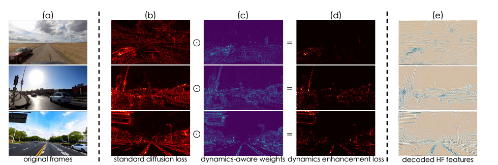
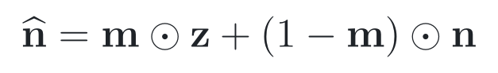
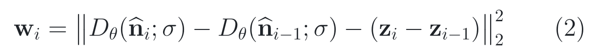
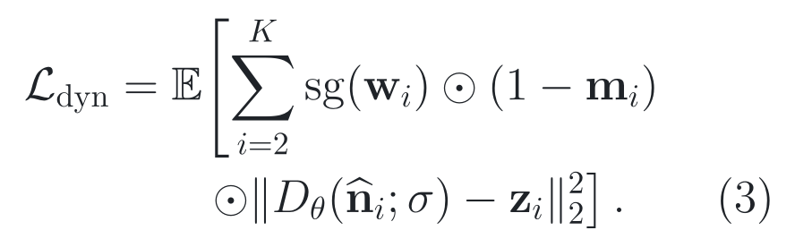
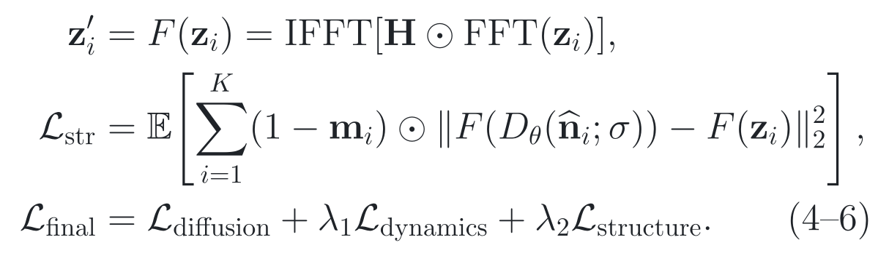
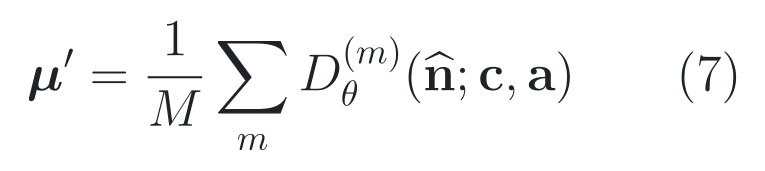
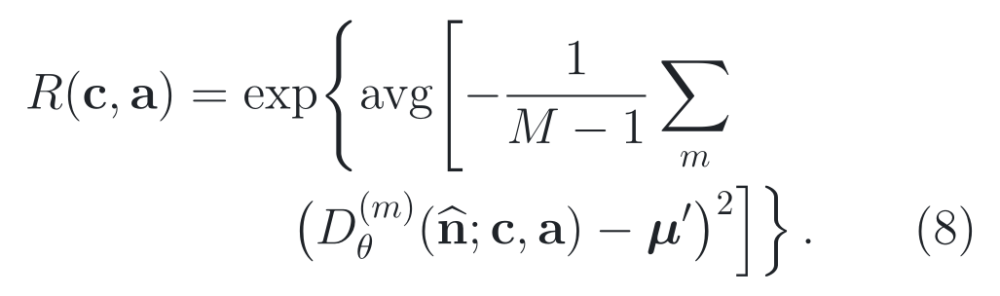
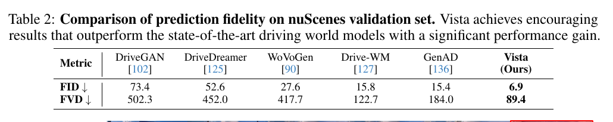
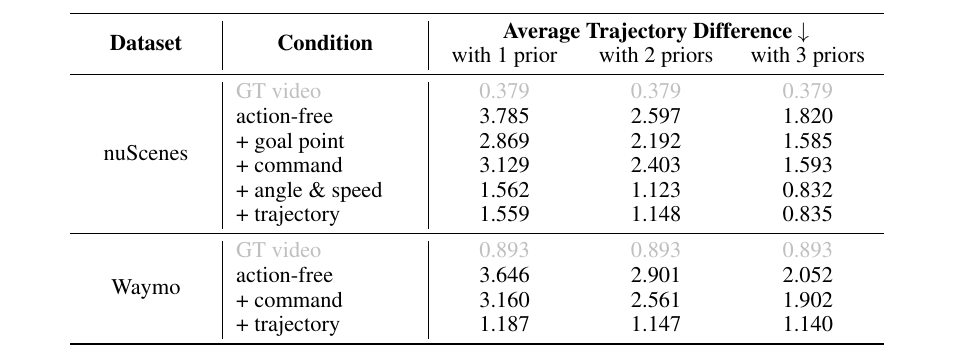

# 2026-08-07 — Vista: A Generalizable Driving World Model with High Fidelity and Versatile Controllability

`NeurIPS 2024` · `Accepted` ·
`论文、附录与固定源码已读 / checkpoint 未运行`

**主方向：** P12 · 世界模型与生成式 3D/4D 建模 ·
**输入模态：** Monocular Camera · Vehicle State ·
**交叉标签：** 世界模型、视频扩散、未来预测、动作条件、长时滚动、不确定性、奖励建模、基础模型

[▶ 从第一张图开始](#1-看图论文到底做了什么) ·
[返回首页](../../README.md) · [全部精读](../../index/papers.md) ·
[官方论文](https://proceedings.neurips.cc/paper_files/paper/2024/file/a6a066fb44f2fe0d36cf740c873b8890-Paper-Conference.pdf) ·
[官方代码 @ cc9821b4253ca7987c32757613d2fc2448fa9f5d](https://github.com/OpenDriveLab/Vista/tree/cc9821b4253ca7987c32757613d2fc2448fa9f5d)

证据与行文标签：**[原文翻译]** 忠实中文译文；**[笔记解释]** 帮助理解的通俗讲解；**[论文]** 作者材料直接支持；**[源码]** 固定 commit 直接支持；**[判断]** 本笔记分析；**[未核验]** 尚未独立运行或确认。译文中不混入解释或判断。

## 0. 阅读起点：术语先导与摘要完整翻译

### 0.1 首次术语解释

**术语覆盖声明：** 摘要中的核心专业术语先在这里解释；摘要之后第一次出现的新术语仍在正文首次出现处解释，后文锁定相同中文名、英文名、缩写与符号。

- **世界模型（World Model, WM）**：从历史观测和候选动作预测可能未来的模型；Vista 输出前视视频，不直接输出安全控制结论。
- **视频扩散模型（Video Diffusion Model, VDM）**：从噪声逐步去噪为视频的生成模型；本文在 Stable Video Diffusion 的潜在空间工作。
- **潜变量（Latent）**：由变分自编码器把像素压缩成的张量；Vista 的去噪、历史帧替换和奖励方差都在该空间计算。
- **动态先验（Dynamic Prior）**：本文把最多三帧历史图像的干净潜变量注入待预测序列，用它们提供位置、速度和加速度线索。
- **潜变量替换（Latent Replacement）**：本文的训练与滚动接口；mask 为真时，用历史帧的干净 latent 覆盖相应噪声 latent，并跳过这些已观测帧的预测损失。
- **动作可控性（Action Controllability）**：用 command、goal point、trajectory、steering angle 和 speed 约束所生成未来；这些条件粒度不同，不能互换。
- **条件方差（Conditional Variance）**：固定同一场景和动作，多次从不同随机噪声生成时的潜变量离散程度；本文把它变成奖励代理。
- **FID（Fréchet Inception Distance）与 FVD（Fréchet Video Distance）**：分别衡量图像/视频特征分布距离，越低越好；它们不是像素正确率、几何正确率或闭环安全率。
- **Vista**：作者定义的前视驾驶视频世界模型名称，保留原名，不翻译成通用名词。

### 0.2 摘要完整专业中文翻译

**原文锚点：** Abstract，PDF p. 1 / NeurIPS proceedings paper p. 1。

> **[原文翻译] Abstract · PDF p. 1 · A01**
>
> 世界模型能够预见不同动作的结果，因此有望提升自动驾驶系统的泛化能力。然而，现有驾驶世界模型在对未见场景的泛化、关键细节的保真度以及动作可控性方面仍然受限。本文提出 Vista：一种兼具高保真度与多样化可控性的通用驾驶世界模型。基于对现有方法的系统诊断，我们引入若干关键要素来解决这些限制。为在高分辨率下准确预测真实世界动态，我们提出两项新损失，以促进对运动实例与结构信息的学习。我们还设计了一种有效的潜变量替换方法，把历史帧作为先验注入，以实现连贯的长时滚动预测。为获得动作可控性，我们通过一种高效学习策略，纳入从高层意图（command、goal point）到低层机动（trajectory、angle 和 speed）的一组多样化控制。经过大规模训练后，Vista 的能力能够无缝泛化到不同场景。多数据集上的广泛实验表明，Vista 在超过 70% 的比较中优于最先进的通用视频生成器，并相对表现最佳的驾驶世界模型将 FID 改善 55%、FVD 改善 27%。此外，我们首次利用 Vista 自身的能力，在不访问真实动作的情况下建立可泛化的真实世界动作评估奖励。

**完整性声明：** 上文按原摘要唯一实质段落逐句完整翻译，保留未见场景、比较范围、动作层级、70%、55%、27% 及“不访问 ground-truth actions”等限定；没有删减、TL;DR 或抽取不清内容。

> [!TIP]
> **[笔记解释] 读完摘要再看这一句：** Vista 把“最近三帧当作显式状态”接到 SVD，并用动作 adapter 控制未来；nuScenes FID/FVD 很强，但奖励只验证了离线排序趋势，尚未证明闭环安全。

### 0.3 为什么今天值得读

**新近性与录用：** **[论文]** Vista 被 NeurIPS 2024 主会正式收录，官方 proceedings 同时提供题名、作者、摘要、PDF 与 supplemental source；不是 workshop，也不把 arXiv 预印本当录用证据。[NeurIPS 录用页](https://proceedings.neurips.cc/paper_files/paper/2024/hash/a6a066fb44f2fe0d36cf740c873b8890-Abstract-Conference.html)。

**影响与社区信号：** **[判断]** 截至 2026-08-07，[官方 GitHub](https://github.com/OpenDriveLab/Vista)约有 890 Star、60 Fork，并公开训练、采样、奖励入口和模型链接；这些只说明注意力与可访问性，不等于结果被本仓库复现。后续 HERMES、WoTE 等正式论文把世界模型继续推向 3D 理解和轨迹评价，说明问题仍活跃，但后续采用也不能反证本文每项机制有效。

**作者与团队脉络：** **[论文/判断]** 论文 affiliation 覆盖 HKUST、上海人工智能实验室 OpenDriveLab、图宾根大学 / Tübingen AI Center 与香港大学；[OpenDriveLab 官方组织](https://github.com/OpenDriveLab)还公开 ViDAR 等驾驶生成/预测工作。团队连续贡献帮助候选召回；团队或机构声誉不等于论文质量，也不替代正式录用、方法质量、受控证据与固定源码审计。

**覆盖与研究价值：** **[判断]** 当前 13 类精读中 P12 尚为空、且是最长未读方向之一。Vista 让读者同时核查视频世界模型的历史状态、动作接口、生成指标、奖励代理和 teacher-forcing 差距；它补的是“世界模型怎样落成可审计时序程序”，不是把生成视频自动等同于感知或规划能力。

**候选对照：** **[判断]** 六维评分为：Vista 9.7/10、[HERMES（ICCV 2025）](https://openaccess.thecvf.com/content/ICCV2025/html/Zhou_HERMES_A_Unified_Self-Driving_World_Model_for_Simultaneous_3D_Scene_ICCV_2025_paper.html) 9.2/10、[ViDAR（CVPR 2024 Highlight）](https://openaccess.thecvf.com/content/CVPR2024/html/Yang_ViDAR_Visual_Point_Cloud_Forecasting_Enables_Scalable_Autonomous_Driving_CVPR_2024_paper.html) 9.0/10、[DriveDreamer（ECCV 2024）](https://www.ecva.net/papers/eccv_2024/papers_ECCV/html/6480_ECCV_2024_paper.php) 8.8/10、MaskGWM（CVPR 2025）7.8/10。今天先读 Vista，是因为它直接填补 P12、正式录用与官方训练/采样/奖励源码完整、模块接口可核，而不是因为 Star 更高；HERMES 留作“3D 理解—生成统一”的后续对照。

### 0.4 问题背景与前置工作

**30 秒问题背景：** **[笔记解释]** 想象自车在陌生城市接近被货车遮挡的十字路口。只有当前一帧，模型看见“货车在画面中央”，却不知道它是停着、减速还是刚横穿；若历史状态读错，未来视频中的货车运动会错，再把错误未来当动作奖励时，错误会继续传到动作排序。这个故事只建立“观测不足 → 未来错误 → 奖励错误”的直觉，不等于真实道路安全证据。

**任务与评价对象：** **[论文]** 前视 RGB 历史帧 + 至多一种 vehicle-state/action condition → 预测未来 25 帧、10 Hz、576×1024 的前视视频 → 用 FID/FVD、人工二选一偏好、IDM 反推轨迹差及奖励—轨迹扰动关系评测。来源：§2–§4、Figure 2–3，PDF p. 2–9。更低 FVD 不等于每个物体轨迹正确，更不等于规划闭环安全。

**关键前置算法：** **[论文/笔记解释]** 第一，[Stable Video Diffusion（SVD）](https://openaccess.thecvf.com/content/CVPR2024/html/Blattmann_Stable_Video_Diffusion_Scaling_Latent_Video_Diffusion_Models_to_Large_Datasets_CVPR_2024_paper.html)提供 frozen VAE、图像条件和时空 UNet；Vista 继承其 25 帧 latent diffusion，但 SVD 第一帧不严格等于条件帧、也没有驾驶动作接口。第二，[Drive-WM](https://proceedings.neurips.cc/paper_files/paper/2023/hash/3d127090aa72e9f7ec80d0a64efb1706-Abstract-Conference.html)把可控视频世界模型用于规划，并依赖外部检测器形成奖励；外部 detector 的训练域成为泛化瓶颈。第三，[GenAD](https://openaccess.thecvf.com/content/CVPR2024/html/Yang_Generative_AI_for_Autonomous_Driving_CVPR_2024_paper.html)以驾驶视频生成学习表征并有 trajectory-conditioned 扩展，但本文指出其控制泛化没有在未见域验证。

**相关论文路线：**

- **SVD → Vista：** [官方论文](https://openaccess.thecvf.com/content/CVPR2024/papers/Blattmann_Stable_Video_Diffusion_Scaling_Latent_Video_Diffusion_Models_to_Large_Datasets_CVPR_2024_paper.pdf)。SVD 提供图像到视频 backbone；本文 Vista 继承该 backbone，并替换条件 latent、加驾驶损失和 action adapters。SVD 本身不回答长时滚动的状态写回。
- **Drive-WM → Vista：** [官方论文](https://proceedings.neurips.cc/paper_files/paper/2023/file/3d127090aa72e9f7ec80d0a64efb1706-Paper-Conference.pdf)。Drive-WM 提供“候选动作 → 生成未来 → 奖励”的应用链；Vista 用生成方差替换外部感知器，但没有闭环比较两种奖励。
- **OccWorld ↔ Vista：** [官方论文](https://www.ecva.net/papers/eccv_2024/papers_ECCV/papers/02024.pdf)。OccWorld 在 3D occupancy token 中预测场景与 ego motion；Vista 在前视像素 latent 中追求视觉保真和多动作接口。前者更几何化，后者更易看但不是 3D 状态。
- **HERMES ↔ Vista：** [官方论文](https://openaccess.thecvf.com/content/ICCV2025/papers/Zhou_HERMES_A_Unified_Self-Driving_World_Model_for_Simultaneous_3D_Scene_ICCV_2025_paper.pdf)。HERMES 把多视图压成 BEV，并统一未来点云生成和场景理解；它是 Vista 之后对“只有前视生成、缺 3D 理解”的直接推进。

**本文接在哪里：** **[判断]** SVD 已解决大规模图像到视频生成，Drive-WM 已展示动作—未来—奖励框架；仍卡在未见域、细节、长滚动和多粒度动作。Vista 只新增历史 latent replacement、两项辅助损失、统一 action cross-attention adapter / LoRA 训练和方差奖励；VAE、OpenCLIP 条件、时空 UNet 和扩散采样是继承能力。3D 几何、环视闭环、可校准安全奖励仍未解决。

**资料使用边界：** **[判断]** 本次用 OpenAlex、arXiv、检索结果和 GitHub 元数据做候选召回；Crossref 一次查询超时，OpenAlex 三路批量查询也出现部分超时，但 NeurIPS/CVF/ECVA 官方正文、supplemental source、官方项目和固定 commit 均已取得。解析帖子、视频和聚合站只用于发现材料与改进讲解顺序，不作为最终证据；录用、方法、数字与源码行为等事实回到原论文、官方 proceedings、补充材料和固定 40 位 commit 源码。

**学习顺序：** [0 摘要与术语](#0-阅读起点术语先导与摘要完整翻译) → [1 看原图](#1-看图论文到底做了什么) → [2 读原式](#2-读公式核心机制怎样表达) → [3 看结果](#3-看结果证据是否支持主张) → [4 对源码](#4-对源码公式如何落地) → [5 记结论](#5-记结论贡献边界与开放问题)

## 1. 看图：论文到底做了什么

> **原图出处：** Gao et al., NeurIPS 2024, Figure 3，PDF p. 4。[官方 PDF](https://proceedings.neurips.cc/paper_files/paper/2024/file/a6a066fb44f2fe0d36cf740c873b8890-Paper-Conference.pdf)。仅作学术讲解所需的局部摘录，原图版权归原作者及其他权利人。

### 这张图按什么顺序看

1. 左侧从噪声序列中找蓝框：历史帧的 clean latent 替换对应噪声位置；
2. 中间看 Vista：动作先投影到统一条件，再进入 diffusion UNet；
3. 上方虚线回路把上一段最后三帧写回下一段，形成显式滚动状态；
4. 右侧区分第一阶段视频训练和第二阶段冻结 base、训练 LoRA/action projections。

**看完应能复述：** Vista 不是一个带隐式永续记忆的黑盒；它每次生成 25 帧，把最多三帧历史 latent 明确读入，并把最后三帧写回下一轮。

**这张图没有证明：** Figure 3 是结构图，不能证明三帧一定最优、动作服从真实车辆动力学、生成奖励能替代安全 evaluator，或低分辨率 LoRA 训练没有质量代价。

### 整体算法架构与创新设计

**原方法瓶颈：** **[论文]** SVD 的首个预测帧不严格复现条件图，因此多次滚动会在接缝处改变内容；单帧条件还缺速度/加速度，标准 diffusion loss 被大面积静态背景主导，高分辨率运动目标边缘会变糊，且 SVD 没有驾驶动作接口。来源：§2–§3.2，PDF p. 2–5。

**主干网络与基线：** **[论文/源码]** 直接 baseline 是 Stable Video Diffusion。默认 backbone 是 frozen first-stage VAE + OpenCLIP image conditioner + 约 1.6B 参数时空 UNet；没有传统 detection neck/head，UNet 是预测主体，VAE decoder 是像素输出 head。总模型约 2.5B 参数。固定 [inference config](https://github.com/OpenDriveLab/Vista/blob/cc9821b4253ca7987c32757613d2fc2448fa9f5d/configs/inference/vista.yaml#L1-L180)给 25 帧、latent scale 0.18215、动作 embedder 与 sampler。

**继承与新增边界：** **[论文/源码]** 继承 SVD 的 VAE、OpenCLIP 条件、spatial/temporal UNet blocks、EDM-style continuous noise 与 classifier-free guidance；新增 clean latent replacement、condition-time embedding、动态/结构损失、五类 action Fourier embedding、zero-init action K/V projections、attention LoRA、两阶段动作训练、三帧显式滚动和 conditional-variance reward。替代 backbone 只在论文讨论中出现，不是默认实现。来源：§2–§3.3，PDF p. 2–6；[固定 UNet 配置](https://github.com/OpenDriveLab/Vista/blob/cc9821b4253ca7987c32757613d2fc2448fa9f5d/configs/training/vista_phase2_stage1.yaml#L1-L175)。

**端到端信息流：** **[论文/源码]** 单目前视 RGB、25 帧、10 Hz → crop/resize 到 576×1024 → frozen VAE 编码为每帧 4×72×128 latent → 0–3 帧 clean latent 按 mask 写入噪声序列 → 25 帧 condition-time embedding 区分已观测与待预测 → 时空 UNet 去噪；第二阶段把 command 1、trajectory 8、speed 4、angle 4、goal 2 共 19 个标量槽分别映成 128 维 Fourier embedding，再拼成 2432 维动作上下文，经 zero-init K/V adapter 写入 cross-attention → VAE 解码未来前视帧 → 若继续滚动，最后三帧 latent 成为下一轮 prediction-relevant state。所有坐标中 trajectory 是 ego-frame 米制 2D 位移，goal 是初始图像归一化坐标，angle 归一化至 −1 到 1，speed 单位 km/h。来源：Figure 3、§3.1–§3.2，PDF p. 3–5；[动作配置](https://github.com/OpenDriveLab/Vista/blob/cc9821b4253ca7987c32757613d2fc2448fa9f5d/configs/training/vista_phase2_stage1.yaml#L118-L161)。

**总体训练方式：** **[论文/源码]** 第一阶段从 SVD 初始化，在 OpenDV-YouTube 过滤后的 1735 小时视频上训练 20K iterations，随机选 0/1/2/3 个 clean condition frames，使用 diffusion + dynamics + structure 三项损失；第二阶段先 320×576 训练 action adapters/LoRA 120K iterations，再 576×1024 微调 10K iterations，OpenDV 与 nuScenes 以 1:1 取样，每个样本只激活一种 action，其余置零。VAE 始终冻结；固定 optimizer 在 phase 1 给 spatial layers 0.1 倍学习率，在 phase 2 只收名字含 `adapter` 的参数。训练条件帧来自 ground truth latent，长滚动推理条件帧来自模型自身输出，存在 teacher-forcing 式 exposure gap；源码没有把生成 latent 跨 scene slot 持久保存，单个 `do_sample` 调用结束即 reset。来源：Appendix C，PDF p. 21–24；[optimizer](https://github.com/OpenDriveLab/Vista/blob/cc9821b4253ca7987c32757613d2fc2448fa9f5d/vwm/models/diffusion.py#L260-L291)。

#### 创新单元 1：Dynamic-Prior Latent Replacement

**位置与接口：** 位于 VAE latent 与 UNet denoiser 之间；训练时修改噪声强度和 denoiser 输入，滚动时修改下一 clip 的条件 mask 与 latent。

**输入：** 25 帧 clean latent、同 shape 噪声、0–3 帧 mask；576×1024 时单帧 latent 为 4×72×128，mask 按帧广播。

**内部变换：** 随机选 condition indices → 对这些帧把 noise sigma 置零 → clean latent 替换 noisy latent → 复制出的 condition-time embedding 标出观察帧 → denoiser 前向 → 把这些帧预测覆盖回输入并从 loss 排除；滚动时取上一 clip 最后三帧作为下一轮 latent priors。

**输出：** 当前 25 帧去噪 latent，以及供下一次调用读取的最后三帧 prediction-relevant state；reward ensemble 的多样本张量是 evaluation-only state，不与这里混同。

**为什么这样设计：** **[论文] 作者明确动机：** 单帧只有位置，连续三帧可提供位置、速度、加速度线索；latent replacement 还保证观察帧与原图一致，使 clip 可以连接。来源：§3.1，PDF p. 3–4。

**训练信号：** **[论文/源码]** condition frames 的 loss 被 mask 掉；未观察帧接收 diffusion、dynamics、structure 梯度。condition latent 是输入，不由该 loss 直接优化；动态权重在 fixed source 中 detach。来源：Eq. (1)–(6)，PDF p. 3–5；[loss forward](https://github.com/OpenDriveLab/Vista/blob/cc9821b4253ca7987c32757613d2fc2448fa9f5d/vwm/modules/diffusionmodules/loss.py#L69-L120)。

**作用与证据：** **[论文]** Table 3 的受控比较干预是 1/2/3 个 priors：nuScenes action-free trajectory difference 从 3.785 到 2.597/1.820，下降 1.965；Waymo 从 3.646 到 2.901/2.052，下降 1.594；Figure 11 给同一场景的定性对应。它支持“更多 priors 与更一致运动相关”，但没有把 latent replacement 与 concat、cross-attention 等替代注入做独立数字对照，因此不能把全部差值只归因给“replace”算子。来源：Table 3、Figure 11、§4.4，PDF p. 9–10。

**论文位置：** **[论文]** Figure 3、Figure 11、Table 3、§3.1/§4.4，PDF p. 4、9–10。

**源码入口：** **[源码]** [training replacement @ 固定 SHA](https://github.com/OpenDriveLab/Vista/blob/cc9821b4253ca7987c32757613d2fc2448fa9f5d/vwm/modules/diffusionmodules/loss.py#L69-L100)；[rollout state write/read @ 固定 SHA](https://github.com/OpenDriveLab/Vista/blob/cc9821b4253ca7987c32757613d2fc2448fa9f5d/vwm/sample_utils.py#L285-L375)。

#### 创新单元 2：Dynamics Enhancement Loss

**位置与接口：** 位于 UNet 输出与 base diffusion loss 之间，是训练期逐 latent 元素的 reweighting 单元，不新增推理层。

**输入：** 相邻预测 latent、相邻 ground-truth latent、condition mask 与 EDM loss weight。

**内部变换：** 先比较预测帧差与真实帧差 → 在每个 clip 内归一化 discrepancy → stop-gradient → 用它放大后一个时刻的 base reconstruction error；固定实现还加 1，确保所有位置保留基础权重。

**输出：** 标量 dynamics-weighted training loss；没有推理输出或跨帧状态。

**为什么这样设计：** **[论文] 作者明确动机：** 驾驶画面大部分是远处静态背景，运动前景面积小且更随机，均匀 diffusion loss 难以集中在关键运动区域。来源：§3.1，PDF p. 4。

**训练信号：** **[论文/源码]** 预测—真实 latent 的平方误差直接训练 UNet；权重本身经 stop-gradient，不让模型通过改变权重路径逃避误差。fixed source 的 phase 2 optimizer 只让 LoRA/action adapters 接收由该 loss 经共享 attention 传来的间接梯度。来源：Eq. (2)–(3)，PDF p. 4；[固定实现](https://github.com/OpenDriveLab/Vista/blob/cc9821b4253ca7987c32757613d2fc2448fa9f5d/vwm/modules/diffusionmodules/loss.py#L102-L120)。

**作用与证据：** **[论文]** Figure 12 的受控比较干预是从“two-loss variant”移除 dynamics loss，作者展示前车停滞和转弯背景运动变差的定性样例。**[未核验]** 原文未提供该单元的独立消融或受控对照数值，也未报告重复统计，因此不能把整套系统增益单独归因给它。来源：Figure 12、§4.4，PDF p. 9。

**论文位置：** **[论文]** Eq. (2)–(3)、Figure 4、Figure 12、§3.1/§4.4，PDF p. 4–5、9。

**源码入口：** **[源码]** [dynamics discrepancy / detach @ 固定 SHA](https://github.com/OpenDriveLab/Vista/blob/cc9821b4253ca7987c32757613d2fc2448fa9f5d/vwm/modules/diffusionmodules/loss.py#L102-L120)。

#### 创新单元 3：Structure Preservation Loss

**位置与接口：** 与 dynamics loss 并联在训练 objective；把预测与真实 latent 各自经过 2D Fourier high-pass filter，再比较高频误差。

**输入：** 每帧 4 通道 prediction/target latent、condition mask、EDM loss weight；Fourier 变换独立作用于各通道空间轴。

**内部变换：** 2D FFT → fftshift → 中心低频圆域乘零 → inverse shift/IFFT → 预测与真实 high-frequency latent 作平方误差 → 乘 λ₂=0.1 加到总 loss。fixed source 的 filter threshold 默认 *d**s*=0.25，并在 CUDA 上逐像素构 mask。

**输出：** 标量 structure loss；不在推理时增加算子。

**为什么这样设计：** **[论文] 作者明确动机：** 高分辨率运动预测容易过平滑或破坏车辆轮廓，边缘与纹理主要落在高频成分，因此作者显式监督 high-frequency latent。来源：§3.1，PDF p. 5。

**训练信号：** **[论文/源码]** 高频 prediction-target 误差直接反传到 UNet/可训练 adapter；FFT 可微，condition frames 被 mask。它与 dynamics loss 共享参数，但不是对每个 action slot 的直接监督。来源：Eq. (4)–(6)，PDF p. 5；[fourier filter](https://github.com/OpenDriveLab/Vista/blob/cc9821b4253ca7987c32757613d2fc2448fa9f5d/vwm/modules/diffusionmodules/util.py#L20-L44)。

**作用与证据：** **[论文]** Figure 12 的受控比较干预为移除 structure loss，保留时运动物体轮廓更清楚。**[未核验]** 原文未提供该单元的独立消融或受控对照数值，也未报告频率阈值敏感性或真实几何边缘指标，因此不能把整套系统增益单独归因给该项。来源：Figure 12、§4.4，PDF p. 9。

**论文位置：** **[论文]** Eq. (4)–(6)、Figure 4、Figure 12、§3.1/§4.4，PDF p. 5、9。

**源码入口：** **[源码]** [high-frequency loss @ 固定 SHA](https://github.com/OpenDriveLab/Vista/blob/cc9821b4253ca7987c32757613d2fc2448fa9f5d/vwm/modules/diffusionmodules/loss.py#L114-L120)；[filter @ 固定 SHA](https://github.com/OpenDriveLab/Vista/blob/cc9821b4253ca7987c32757613d2fc2448fa9f5d/vwm/modules/diffusionmodules/util.py#L20-L44)。

#### 创新模块 4：Unified Action Cross-Attention Adapter

**位置与接口：** action Fourier embedding 拼到原 image context 后；每个 UNet cross-attention block 保留原 K/V projection，并旁接 zero-init action K/V projections 和 rank-16 LoRA。

**输入：** 19 个标量槽 × 128 维 embedding；command 1、trajectory 8、speed 4、angle 4、goal 2。每个训练样本只激活一种 action，其余槽为零。

**内部变换：** 数值序列做 Fourier embedding → 拼成 2432 维 context → action K/V adapter 映到 attention inner dimension并加到原 K/V → LoRA 同时修正 Q/K/V/out → attention 输出回到 UNet residual stream。

**输出：** action-conditioned denoising feature；VAE 解码后体现为与候选动作更一致的未来视频。

**为什么这样设计：** **[论文] 作者明确动机：** 五类动作异构、组合标注昂贵；zero-init projection 允许从预训练状态渐进学习，LoRA 让低分辨率阶段适应动作又尽量保持高保真 base weights。来源：§3.2，PDF p. 5–6。

**训练信号：** **[论文/源码]** Eq. (6) 的 video reconstruction losses 经共享 attention 间接训练 active action adapter/LoRA；inactive action 输入为零且 15% classifier-free dropout 会 mask 条件。phase 2 optimizer 只纳入名字含 `adapter` 的参数，frozen base 不更新；不是每个样本的 loss 都直接监督五种 action。来源：Appendix C、PDF p. 23–24；[optimizer filter](https://github.com/OpenDriveLab/Vista/blob/cc9821b4253ca7987c32757613d2fc2448fa9f5d/vwm/models/diffusion.py#L276-L291)。

**作用与证据：** **[论文]** Table 5 的受控比较在相同 trajectory 条件下启用/关闭 action independence：有 A.I. 时四个 command subset FVD 为 130.7/230.8/345.7/118.9，无 A.I. 为 138.8/232.9/368.2/132.3，四组均下降；Table 3 还显示 angle+speed 与 trajectory 的 trajectory difference 明显低于 action-free。它支持独立激活动作的训练约束，不分离 LoRA、Fourier embedding 与 zero-init K/V 的各自贡献。来源：Table 3、Table 5、Appendix D，PDF p. 10、23。

**论文位置：** **[论文]** Figure 3、Table 3、Table 5、§3.2、Appendix D，PDF p. 4–6、10、23。

**源码入口：** **[源码]** [LoRA/action K/V @ 固定 SHA](https://github.com/OpenDriveLab/Vista/blob/cc9821b4253ca7987c32757613d2fc2448fa9f5d/vwm/modules/attention.py#L295-L353)；[19-slot config @ 固定 SHA](https://github.com/OpenDriveLab/Vista/blob/cc9821b4253ca7987c32757613d2fc2448fa9f5d/configs/training/vista_phase2_stage1.yaml#L118-L161)。

#### 创新单元 5：Conditional-Variance Reward

**位置与接口：** evaluation-only；位于 sampler 输出 latent 与 action ranking 之间，不参与 Vista 训练。

**输入：** 同一 condition frame、同一 action、M=5 个随机噪声起点；固定源码每个样本只做 10 个 denoise steps。

**内部变换：** 对同一条件独立采样 5 次 → 求逐 latent 平均与样本方差 → 跨 clip latent 求平均 → 对负方差取指数。

**输出：** 0 到 1 的标量 reward；较一致的多次预测得分较高。它不是碰撞概率、轨迹正确概率或经校准风险。

**为什么这样设计：** **[论文] 作者明确动机：** 作者认为 OOD/不利 action 会增加条件生成多样性；用模型自身方差可避开特定数据集训练的外部 detector。来源：§3.3，PDF p. 6。

**训练信号：** **[论文/源码]** 无梯度、无参数更新；样本 ensemble 和均值只在 reward call 内读取，结束后释放。固定 source 使用分母 M−1，并对 latent 维度求 mean 后指数化。来源：§3.3，PDF p. 6；[reward implementation @ 固定 SHA](https://github.com/OpenDriveLab/Vista/blob/cc9821b4253ca7987c32757613d2fc2448fa9f5d/vwm/reward_utils.py#L285-L341)。

**作用与证据：** **[论文]** Figure 10 的受控比较干预是从低 L2 误差到高 L2 误差逐级加入轨迹扰动；在 1500 个 Waymo case 上，reward 随误差增加总体下降。Table 4 中，Waymo ground-truth command 的平均 reward 为 0.892，优于 random command 的 0.878，绝对差为 0.014 点。它支持离线相关性，不证明 reward 对合理多模态未来、碰撞或闭环收益已校准。来源：Figure 10、Table 4、§4.3/Appendix C.6，PDF p. 9、23。

**论文位置：** **[论文]** Eq. (7)–(8)、Figure 10、Table 4、§3.3/§4.3、Appendix C.6，PDF p. 6、9、23。

**源码入口：** **[源码]** [reward ensemble @ 固定 SHA](https://github.com/OpenDriveLab/Vista/blob/cc9821b4253ca7987c32757613d2fc2448fa9f5d/vwm/reward_utils.py#L285-L341)。

> **原图出处：** Gao et al., NeurIPS 2024, Figure 4，PDF p. 5。[官方 PDF](https://proceedings.neurips.cc/paper_files/paper/2024/file/a6a066fb44f2fe0d36cf740c873b8890-Paper-Conference.pdf)。仅作学术讲解所需的局部摘录，原图版权归原作者及其他权利人。

**图—模块闭环：** 左侧原帧经 latent 编码后，标准 loss 广泛分布；dynamics-aware weights 把差分不一致区域放大，structure branch 则在频域强调边缘。Figure 4 只说明作者希望 loss 关注哪里，真正效果证据只能看 Figure 12 的受控移除，而且仍是定性证据。

## 2. 读公式：核心机制怎样表达

**变量身份图例：** **[领域惯用]** 表示语义角色在本领域常见，但不表示所有论文都使用同一个字母；**[本文定义]** 表示论文给该符号赋予了本文特定含义；**[源码/笔记重排]** 表示固定源码等价式或本笔记计算新增的符号。

### 原文公式 1：历史 latent 替换

**原文未编号公式：** 论文 §3.1，PDF p. 4。

<picture><source media="(prefers-color-scheme: dark)" srcset="../../assets/notes/2026-08-07-vista/formulas/eq-01-latent-replacement-dark.png"></picture>

> **公式来源：** Gao et al., NeurIPS 2024, §3.1 未编号式，PDF p. 4；本图按原符号重排。[官方 PDF](https://proceedings.neurips.cc/paper_files/paper/2024/file/a6a066fb44f2fe0d36cf740c873b8890-Paper-Conference.pdf) · [可复制 TeX](../../assets/notes/2026-08-07-vista/formulas/source.tex#L4-L6)。

**先建立画面：** **[笔记解释]** 把 25 个胶片格想成一排：已看见的历史格不再蒙噪声，直接把清晰底片放回；未来格仍保留噪声，交给模型冲洗。

**变量逐项解释与身份：** **[本文定义]** **n̂** 是替换后的 noisy latent 序列，shape 与 **z**、**n** 相同；**m** 是按帧取 0/1、再广播到通道和空间维的 condition mask，1 表示已观察帧；**z** 是 frozen VAE 从真实 RGB 编出的 clean latent，576×1024 时单帧为 4×72×128；**n** 是加入扩散噪声后的 latent；1 是与 mask 同语义的常数；⊙ 是逐元素乘法。它们在 train forward 读入，**m**、**z**、**n** 都不可学习。

**变量变化会怎样：** 在其他量不变时，某帧 **m** 从 0 改为 1，**n̂** 立即等于该帧 **z**；从 1 改为 0，**n̂** 回到 **n**。mask 越多并不保证未来越准，因为历史可能来自已有生成误差；mask 越界不是连续“更强条件”，fixed source 只接受离散帧索引。

**纯文字读法：** 对每个 latent 位置，mask 为 1 就取 clean latent，mask 为 0 就取 noisy latent；两部分相加得到 denoiser 的实际输入。

**教学小例子：** **[笔记解释]** 把一个位置简化成标量：历史 latent 为 8、noisy latent 为 2。mask=1 时结果是 1×8+0×2=8；mask=0 时是 0×8+1×2=2。这是教学示例，不是论文实验；它只说明“已观察格直接替换”。

**专业解释：** 这是 hard conditioning/inpainting 式接口；它把观察帧的数值一致性从“学出来”改成“结构上保证”，同时免去这些帧的预测任务。

**回到上面的图：** Figure 3 左侧蓝框 `replace` 箭头就是 **m** 选择 **z** 的位置。

**落到源码：** [sigma mask 与 clean overwrite @ 固定 SHA](https://github.com/OpenDriveLab/Vista/blob/cc9821b4253ca7987c32757613d2fc2448fa9f5d/vwm/modules/diffusionmodules/loss.py#L69-L100)。

**公式省略了什么：** 原式没显示 condition indices 以 1:2:4:8 权重随机选 0/1/2/3 帧、condition-time embedding、loss mask，也没显示推理时历史 latent 是模型生成而非 ground truth。

### 原文公式 2：动态差异权重

**原文公式：** 论文 Eq. (2)，PDF p. 4。

<picture><source media="(prefers-color-scheme: dark)" srcset="../../assets/notes/2026-08-07-vista/formulas/eq-02-dynamics-weight-dark.png"></picture>

> **公式来源：** Gao et al., NeurIPS 2024, Eq. (2)，PDF p. 4；本图按原符号重排。[官方 PDF](https://proceedings.neurips.cc/paper_files/paper/2024/file/a6a066fb44f2fe0d36cf740c873b8890-Paper-Conference.pdf) · [可复制 TeX](../../assets/notes/2026-08-07-vista/formulas/source.tex#L8-L14)。

**先建立画面：** **[笔记解释]** 想象先画两支“运动箭头”：一支来自模型相邻两帧，一支来自真实相邻两帧；两支箭头差得越多，该位置就被贴上越醒目的返工标签。

**变量逐项解释与身份：** **[领域惯用]** *i* 表示帧索引，字母不强制；二范数表示平方和距离的语义在机器学习中常见。**[本文定义]** **w***i* 是第 *i* 帧对应的 dynamics-aware weight，原文 shape 为 *C*×*H*×*W*；*D*θ 是可学习 UNet denoiser；θ 是其参数；**n̂***i*、**n̂***i−1* 是当前与前一帧替换后的 noisy latent；σ 是同次 diffusion noise level；**z***i*、**z***i−1* 是 clean target latent。减号先构造时间差，再比较两种差；平方二范数产生非负误差。

**变量变化会怎样：** 在真实差分与其他量固定时，预测差分更接近真实差分会让 **w***i* 降到 0；偏差变大会使权重非负增大。若预测和真实都静止，权重为 0；若两者一起等量变化，不能只看单帧数值判断权重。fixed source 随后 clip 内归一化，所以绝对放大所有差值不等于最终权重同比放大。

**纯文字读法：** 用当前预测减前一预测得到预测运动，用当前真实 latent 减前一真实 latent 得到真实运动，再对两者之差取逐位置平方距离，作为第 *i* 帧动态权重。

**教学小例子：** **[笔记解释]** 一维情况下，真实位置从 3 到 5，运动量是 2；预测从 3 到 4，运动量是 1，差为 −1、平方权重为 1。若预测也到 5，权重为 0。这是教学示例，不是论文实验；它对应路口车辆“少移动了一格”的返工强度。

**专业解释：** 该权重衡量 motion residual，而非运动幅度本身；真实快速移动但预测同样正确时不会被额外惩罚。

**回到上面的图：** Figure 4(c) 的亮区对应预测运动和真实运动不一致的 latent 位置。

**落到源码：** [相邻差分、归一化与加一 @ 固定 SHA](https://github.com/OpenDriveLab/Vista/blob/cc9821b4253ca7987c32757613d2fc2448fa9f5d/vwm/modules/diffusionmodules/loss.py#L102-L113)。

**公式省略了什么：** fixed source 用 `F.normalize` 默认维度做归一化，再形成 1+weight；论文式本身没有写出这个“保底 1”，也没有公开归一化的精确维度。

### 原文公式 3：动态增强损失

**原文公式：** 论文 Eq. (3)，PDF p. 4。

<picture><source media="(prefers-color-scheme: dark)" srcset="../../assets/notes/2026-08-07-vista/formulas/eq-03-dynamics-loss-dark.png"></picture>

> **公式来源：** Gao et al., NeurIPS 2024, Eq. (3)，PDF p. 4；本图按原符号重排。[官方 PDF](https://proceedings.neurips.cc/paper_files/paper/2024/file/a6a066fb44f2fe0d36cf740c873b8890-Paper-Conference.pdf) · [可复制 TeX](../../assets/notes/2026-08-07-vista/formulas/source.tex#L16-L25)。

**先建立画面：** **[笔记解释]** 上一式贴好返工标签后，这一式让工人优先修“运动错得多”的未来格；已经作为历史输入的格子不再重复评分。

**变量逐项解释与身份：** **[领域惯用]** 𝔼 表示对训练样本、噪声和 mask 取期望；Σ 从 *i*=2 到 *K* 表示第二帧到第 *K* 帧求和，这些语义常见但符号不强制。**[本文定义]** *K*=25；𝓛dyn 是 dynamics loss；sg 是 stop-gradient 算子；**w***i* 来自 Eq. (2)；**m***i* 是 condition mask；*D*θ(**n̂***i*;σ) 是第 *i* 帧 predicted clean latent；**z***i* 是 target；⊙ 为逐元素乘；平方二范数产生去噪误差。θ 可学习，其他符号在本式中不可学习。

**变量变化会怎样：** 在其他量固定时，**w***i* 增大或 prediction error 增大会抬高该项；**m***i*=1 会把已观察帧项置零；sg 取消不会改变前向数值，却会新增经权重计算回传的耦合梯度。由于权重与误差相乘，二者同时变化时不能只看一个变量判断总 loss。

**纯文字读法：** 对每个未观察的后续帧，把停止梯度后的动态差异权重乘到该帧预测—真实 latent 的平方误差上，再跨帧求和并对训练采样取平均。

**教学小例子：** **[笔记解释]** 某未来格 prediction error 为 2，平方为 4；动态权重为 3、mask=0，则贡献 12。若该格是历史输入，mask=1，贡献变 0。这是教学示例，不是论文实验；它只演示“运动错处多算账”。

**专业解释：** stop-gradient 把 **w** 当采样到的难度系数，而不是另一个可被模型主动压低的目标；这有利于解释梯度所有权。

**回到上面的图：** Figure 4(b) 的均匀 base loss 乘 Figure 4(c) 的权重，得到 Figure 4(d) 的动态聚焦 loss。

**落到源码：** [aux weight 与 detach @ 固定 SHA](https://github.com/OpenDriveLab/Vista/blob/cc9821b4253ca7987c32757613d2fc2448fa9f5d/vwm/modules/diffusionmodules/loss.py#L102-L120)。

**公式省略了什么：** fixed source 实际以 1+normalized weight 乘包含 EDM noise weight 的 base loss，并把第一帧 weight 设为 1；静态差异不等于 bug，需数值追踪和 checkpoint 复算后才能判断影响。

### 原文公式 4：高频结构与最终目标

**原文公式：** 论文 Eq. (4)–(6)，PDF p. 5。

<picture><source media="(prefers-color-scheme: dark)" srcset="../../assets/notes/2026-08-07-vista/formulas/eq-04-structure-objective-dark.png"></picture>

> **公式来源：** Gao et al., NeurIPS 2024, Eq. (4)–(6)，PDF p. 5；本图按原符号重排。[官方 PDF](https://proceedings.neurips.cc/paper_files/paper/2024/file/a6a066fb44f2fe0d36cf740c873b8890-Paper-Conference.pdf) · [可复制 TeX](../../assets/notes/2026-08-07-vista/formulas/source.tex#L27-L39)。

**先建立画面：** **[笔记解释]** 动态 loss 关注“车有没有动对”，高频支路再拿一张只保留轮廓和纹理的描边纸，比较预测描边与真实描边；最后把基础还原、运动和描边三张成绩单相加。

**变量逐项解释与身份：** **[领域惯用]** FFT/IFFT 是二维离散 Fourier 变换/逆变换，Σ、𝔼、二范数语义常见但符号不强制。**[本文定义]** **z′***i* 是 **z***i* 的 high-frequency latent；*F* 是本文 high-pass pipeline；**H** 是理想二维高通 mask；𝓛str、𝓛diffusion、𝓛dynamics、𝓛final 分别是结构、基础扩散、动态和总损失；λ₁=1.0、λ₂=0.1；*K*=25；**m***i* 为 observation mask；*D*θ、**n̂**、σ、**z** 与前式同义。FFT/IFFT 按每个 latent channel 的空间轴计算，不改变帧索引。

**变量变化会怎样：** 在其他量固定时，预测高频更接近真实会降低 𝓛str；把 **H** 全置零会让高频项恒为 0，失去结构监督；λ₂ 置零等价于移除结构项。高频误差变小不保证物体几何正确，因为噪声纹理也可能增加高频；三项同时耦合时不能只看一个 loss 判断 FID/FVD。

**纯文字读法：** 先把每个 target latent 做 FFT、用高通 mask 去掉低频、再 IFFT 得到结构特征；对未观察帧比较预测与真实结构特征的平方误差；总目标等于基础 diffusion loss 加 λ₁ 倍 dynamics loss，再加 λ₂ 倍 structure loss。

**教学小例子：** **[笔记解释]** 若 base、dynamic、structure 三项分别为 4、2、10，λ₁=1、λ₂=0.1，则总 loss 为 4+2+1=7；若 λ₂=0，变成 6。这是教学示例，不是论文实验；它说明很大的结构误差只按 0.1 权重进入总账。

**专业解释：** 该支路直接在 latent 频域监督，不等同于像素 edge detector；它只主张保留高频统计，不编码物体类别、车道拓扑或 3D 几何。

**回到上面的图：** Figure 4(e) 的 decoded HF features 对应 *F* 提取的成分；Figure 12 右侧才是移除该 loss 的定性效果。

**落到源码：** [FFT mask @ 固定 SHA](https://github.com/OpenDriveLab/Vista/blob/cc9821b4253ca7987c32757613d2fc2448fa9f5d/vwm/modules/diffusionmodules/util.py#L20-L44)；[λ₂ high-frequency term @ 固定 SHA](https://github.com/OpenDriveLab/Vista/blob/cc9821b4253ca7987c32757613d2fc2448fa9f5d/vwm/modules/diffusionmodules/loss.py#L114-L120)。

**公式省略了什么：** fixed filter 以中心圆域和 *d**s*=0.25 截低频、mask 直接 `.cuda()`，没有 device-agnostic 创建；论文没报告阈值敏感性。config 把 `additional_loss_weight` 设为 0.1，对应 λ₂。

### 原文公式 5：奖励 ensemble 均值

**原文公式：** 论文 Eq. (7)，PDF p. 6。

<picture><source media="(prefers-color-scheme: dark)" srcset="../../assets/notes/2026-08-07-vista/formulas/eq-05-reward-mean-dark.png"></picture>

> **公式来源：** Gao et al., NeurIPS 2024, Eq. (7)，PDF p. 6；本图按原符号重排。[官方 PDF](https://proceedings.neurips.cc/paper_files/paper/2024/file/a6a066fb44f2fe0d36cf740c873b8890-Paper-Conference.pdf) · [可复制 TeX](../../assets/notes/2026-08-07-vista/formulas/source.tex#L41-L44)。

**先建立画面：** **[笔记解释]** 对同一个“现在 + 候选动作”让模型做五次梦；先把五个未来 latent 的每个格子取平均，得到中心梦境。

**变量逐项解释与身份：** **[领域惯用]** *m* 是样本索引、Σ 和 1/*M* 表示算术平均，角色常见但字母不强制。**[本文定义]** **μ′** 是 ensemble mean latent；*M* 是重复去噪次数，论文/源码评测取 5；*D*θ(*m*) 表示第 *m* 个随机噪声起点经过同一参数 θ 的 denoiser 输出，不是五套模型；**n̂** 是当前 noisy latent；**c** 是相同 condition frame；**a** 是相同 action。所有量在 reward evaluation 读入，不可学习。

**变量变化会怎样：** 固定前四个样本时，第五个 latent 增大，均值向它移动 1/5；所有样本相同则均值等于任一输出；*M* 增大通常降低 Monte Carlo 均值噪声，但计算量增加，不能保证奖励更校准。

**纯文字读法：** 在同一条件帧和同一动作下，从不同随机噪声生成 *M* 个预测 latent，把它们逐元素相加后除以 *M*，得到样本均值。

**教学小例子：** **[笔记解释]** 五次一维预测为 4、5、5、6、5，均值是 25/5=5。这是教学示例，不是论文实验；它把五个可能的“车位”汇成中心位置。

**专业解释：** 上标 (*m*) 表示 stochastic sample identity，而不是 time、head 或 checkpoint identity；这一点决定它测的是 aleatoric/采样离散代理。

**回到上面的图：** Figure 3 没画 reward ensemble；它复用同一 Vista 与条件，在 evaluation branch 中重复调用 sampler。

**落到源码：** [stack samples 与 mean @ 固定 SHA](https://github.com/OpenDriveLab/Vista/blob/cc9821b4253ca7987c32757613d2fc2448fa9f5d/vwm/reward_utils.py#L285-L337)。

**公式省略了什么：** fixed reward 只做 10 denoise steps 而非完整 50-step video sampling；mean 仍在 latent 空间，未解码为像素或物体轨迹。

### 原文公式 6：负条件方差奖励

**原文公式：** 论文 Eq. (8)，PDF p. 6。

<picture><source media="(prefers-color-scheme: dark)" srcset="../../assets/notes/2026-08-07-vista/formulas/eq-06-variance-reward-dark.png"></picture>

> **公式来源：** Gao et al., NeurIPS 2024, Eq. (8)，PDF p. 6；本图按原符号重排。[官方 PDF](https://proceedings.neurips.cc/paper_files/paper/2024/file/a6a066fb44f2fe0d36cf740c873b8890-Paper-Conference.pdf) · [可复制 TeX](../../assets/notes/2026-08-07-vista/formulas/source.tex#L46-L54)。

**先建立画面：** **[笔记解释]** 五个梦若在每个格子都很接近，模型给候选动作高分；五个梦四散，方差账单变大，负号和指数把分数压低。

**变量逐项解释与身份：** **[领域惯用]** exp 是自然指数，Σ 与 (*M*−1) 构成无偏样本方差形式，平方保证非负；这些运算常见但符号不强制。**[本文定义]** *R*(**c**,**a**) 是 condition/action 的 scalar reward；avg 对 video clip 中全部 latent 值求平均；*M*=5；*D*θ(*m*)、**n̂**、**c**、**a**、**μ′** 与 Eq. (7) 同义。reward 范围为大于 0 且不超过 1；无单位、不可学习。

**变量变化会怎样：** 在均值与其他样本暂时固定时，任一样本离均值更远会增大方差并降低 reward；所有输出相同则方差 0、reward=1；*M*=1 会使分母为 0，因此需要至少两个样本。对合理的多模态未来，方差也可能大，所以不能只看 reward 判断动作错误。

**纯文字读法：** 计算每次预测 latent 与 ensemble 均值的平方差，跨 *M* 次求和后除以 *M*−1，再对整段 latent 取平均；给这个方差加负号并取指数，得到动作奖励。

**教学小例子：** **[笔记解释]** 若两次一维预测是 4 和 6，均值 5，平方差和为 2，除以 1 仍为 2，reward 约为 0.135；若都是 5，reward 为 1。这是教学示例，不是论文实验；它说明“预测分歧大 → 分数低”，不代表 0.135 是碰撞概率。

**专业解释：** 指数保证非负并压缩尺度，但没有做 calibration；不同模型、latent scale、采样步数或 ensemble size 的 reward 不能直接横比。

**回到上面的图：** Figure 10 把横轴轨迹扰动增大、纵轴 reward 下降作为经验验证；Figure 3 的动作接口提供相同 **a**。

**落到源码：** [样本方差与指数 @ 固定 SHA](https://github.com/OpenDriveLab/Vista/blob/cc9821b4253ca7987c32757613d2fc2448fa9f5d/vwm/reward_utils.py#L328-L341)。

**公式省略了什么：** 没有 ground-truth action、collision label、车辆动力学或 closed-loop return；fixed source 的随机性、half precision 和 10-step sampler 都会改变离散度，论文没有给 seed variance 或 calibration curve。

## 3. 看结果：证据是否支持主张

### 3.0 数据集与实验设计总览

**数据集与任务：** **[论文]** OpenDV-YouTube：作者从公开集合手工去除 15 小时无关内容，剩约 1735 小时，作为 phase 1 与 phase 2 的无动作训练数据；原文未公开 train/val 文件数与逐视频列表。nuScenes：train 在 phase 2 提供动作，validation 过滤出 5369 个有效样本做 FID/FVD，另取 537 个样本做 action/prior trajectory difference；hidden test 未用。Waymo：未参与训练，取 537 个样本做 zero-shot action/prior 评测、1500 个 case 做 reward 扰动；精确版本/segment 清单原文未公开。CODA：只进入人工评测，版本与划分原文未公开。人工评测从 OpenDV-val、nuScenes、Waymo、CODA 共取 60 scenes。来源：§4.1–§4.4、Appendix C.2/C.5，PDF p. 7–10、21–22。

**传感器与输入：** **[论文/源码]** 全部模型输入为单目前视 RGB；nuScenes 的 command、ego trajectory、steering angle、speed、projected goal point只在 phase 2 条件端使用。clip 为 25 帧、10 Hz；nuScenes 原始 12 Hz 被当作 10 Hz，作者称未观察到负面影响但没给独立数值。训练先按最短边缩放、再中心裁剪；phase 2 stage 1 为 320×576，其他主训练/推理为 576×1024。trajectory 是 ego coordinate 米制 2D 位移；没有 LiDAR、surround-view 或 map 输入。来源：§3.2、Appendix C.2/C.3，PDF p. 5–6、21–22；[dataset config](https://github.com/OpenDriveLab/Vista/blob/cc9821b4253ca7987c32757613d2fc2448fa9f5d/configs/training/vista_phase2_stage1.yaml#L253-L277)。

**实验分组：**

- **主 benchmark：** nuScenes FID/FVD 与三种通用视频生成器的人工偏好；回答保真与跨域感知质量。
- **动作控制：** nuScenes/Waymo 按 command subset 计算 FVD，并用 inverse dynamics model（IDM）把视频反推 trajectory 后算差；回答动作条件是否改变未来。
- **模块消融：** Table 3 控制 priors 数量，Table 5 控制 action independence；Figure 12 分别移除两项 loss，但只有定性图。
- **泛化：** OpenDV-val、Waymo、CODA 未见域的人评/定性与 Waymo action/reward；没有完整 benchmark test server。
- **效率/部署：** phase 2 低分辨率吞吐声称 3.5×；reward 只用 10 steps，Figure 14 探索 5 steps。没有端到端 latency、功耗、显存或车载硬件结果。
- **鲁棒/安全：** 原文没有天气、传感器故障、闭环 collision 或安全校准组；reward 的 L2 轨迹扰动不是闭环安全实验。

**训练—验证—测试路线：** **[论文/源码]** OpenDV 过滤与 25-frame clip → SVD 初始化，phase 1 全分辨率训练 UNet 与三项 loss → phase 2 低分辨率仅训练 action adapters/LoRA，再高分辨率短训 → 作者未公开独立 validation/最佳 checkpoint 规则，fixed trainer 每 epoch 全存 → sampler 读取指定 checkpoint，首轮 1 帧条件、后续 3 个生成 latent 条件 → 50-step sampling / overlap decode → FID/FVD、人评、IDM trajectory difference 或 5×10-step reward。论文公开的 iteration 数与 fixed YAML 的 `max_epochs: 100` 不是同一停止条件；本仓库未运行任一步。

**指标与回答的问题：** **[论文/笔记解释]** FID/FVD 越低，分别回答生成帧/视频特征分布与真实分布有多近；2AFC preference 越高，回答受试者在配对样本中更偏好谁；trajectory difference 越低，回答 IDM 反推轨迹与 ground truth 的 L2 距离；reward 越高，回答同一条件多次 latent prediction 是否更集中。FID/FVD 不等于像素或几何 accuracy，trajectory difference 依赖 IDM，低方差不等于预测正确，人评偏好不等于闭环安全。

**一眼看懂实验结论：** **[判断]** 最强编号主结果是 Table 2：Vista 在作者统一预处理的 nuScenes validation 上 FID 6.9、FVD 89.4；相对此前最优 15.4/122.7，分别降低 8.5（55.2%）和 33.3（27.1%）。最强模块级数字是 Table 3 的 prior-count 干预，但它不能把收益单独归给 replacement operator。最大边界是此前 driving world models 不公开，作者只能引用论文数字而非同一代码/同一 checkpoint 重跑；指标和奖励也没有闭环安全验证。

### 3.1 原文公开的实验配置

**原文锚点：** §4、Appendix C–D，PDF p. 7–10、21–25；固定 SHA training configs、trainer、sampler 与 README。

- **数据集、版本与 train/val/test 划分。** **[论文]** OpenDV-YouTube 过滤后约 1735 小时；nuScenes train 用于动作训练、validation 过滤 5369 个 FID/FVD 样本，两个 537-sample action/prior 子集；Waymo 537/1500 sample 子集；CODA/OpenDV-val 只做人评。具体 scene token、Waymo release、CODA version、hidden test 均原文未公开。来源：§4.1–§4.3、Appendix C.2/C.5，PDF p. 7–9、21–22。
- **传感器与输入。** **[论文]** 单目前视 RGB，25 帧、10 Hz；phase 2 加 vehicle-state/action，非 surround camera。nuScenes 12 Hz 被当 10 Hz；这一近似没有独立误差表。来源：§3.2、Appendix C.2，PDF p. 5、21。
- **预处理。** **[论文/源码]** FID 将预测帧 crop/resize 到 256×448；FVD 用全部 25 帧并降到 224×224。训练先 resize 最短边再 center crop；fixed dataset normalization 到 −1 到 1。没有 TTA。来源：§4.1、Appendix C.2，PDF p. 7、21；[固定 dataset pipeline](https://github.com/OpenDriveLab/Vista/blob/cc9821b4253ca7987c32757613d2fc2448fa9f5d/vwm/data/dataset.py#L1-L220)。
- **硬件与软件。** **[论文]** phase 1：128×A100、8 天；phase 2：8×A100、10 天。**[源码]** PyTorch Lightning + DeepSpeed stage 2 + xFormers；fixed YAML 默认 `devices: 0,1` 只是本地示例，与论文节点数不一致。**[未核验]** CUDA、PyTorch、driver 版本原文未锁定。来源：Appendix C.3，PDF p. 22；[phase 1 trainer config](https://github.com/OpenDriveLab/Vista/blob/cc9821b4253ca7987c32757613d2fc2448fa9f5d/configs/training/vista_phase1.yaml#L236-L247)。
- **初始化与冻结。** **[论文/源码]** SVD pretrained weights 初始化；frozen first-stage VAE。phase 1 训练 diffusion UNet，spatial layers 学习率为 temporal layers 0.1×；phase 2 freeze base UNet，只优化 rank-16 attention LoRA 和 zero-init action K/V projections。来源：§2、§3.2、Appendix C.1/C.3，PDF p. 2、5–6、21–22；[optimizer](https://github.com/OpenDriveLab/Vista/blob/cc9821b4253ca7987c32757613d2fc2448fa9f5d/vwm/models/diffusion.py#L260-L291)。
- **优化器。** **[论文/源码]** AdamW；phase 1 lr 1e−5，phase 2 lr 5e−5。fixed source 没有显式 weight decay 参数，使用 PyTorch AdamW 默认值；该默认行为不是论文明确报告。来源：Appendix C.3，PDF p. 22；[phase 1 learning rate](https://github.com/OpenDriveLab/Vista/blob/cc9821b4253ca7987c32757613d2fc2448fa9f5d/configs/training/vista_phase1.yaml#L1-L3)。
- **scheduler。** **[源码]** `LambdaLinearScheduler`，1000 warm-up steps，从 1e−6 factor 升到 1，极长 cycle；**[未核验]** 论文正文未报告 scheduler。来源：[固定 phase 1 scheduler](https://github.com/OpenDriveLab/Vista/blob/cc9821b4253ca7987c32757613d2fc2448fa9f5d/configs/training/vista_phase1.yaml#L158-L165)。
- **batch size。** **[论文]** phase 1 global batch 256、gradient accumulation 2；phase 2 global batch 8。fixed YAML per-device batch 1、phase 1 accumulation 2、phase 2 accumulation 1；需由命令行 nodes/devices 扩展到论文规模。来源：Appendix C.3，PDF p. 22；[phase 1 data/trainer](https://github.com/OpenDriveLab/Vista/blob/cc9821b4253ca7987c32757613d2fc2448fa9f5d/configs/training/vista_phase1.yaml#L208-L247)。
- **epochs / steps。** **[论文]** phase 1 20K iterations；phase 2 120K low-resolution + 10K high-resolution。**[源码]** YAML 是 `max_epochs: 100`，训练文档要求观察效果后手动停止，没有公开精确 `max_steps` override；冲突并列，不静默等同。来源：Appendix C.3，PDF p. 22；[fixed phase 2 trainer](https://github.com/OpenDriveLab/Vista/blob/cc9821b4253ca7987c32757613d2fc2448fa9f5d/configs/training/vista_phase2_stage1.yaml#L283-L294)。
- **增强与采样。** **[论文/源码]** phase 1 condition-count 概率为 1/15、2/15、4/15、8/15；offset noise 0.02；phase 2 每种 action UCG/dropout 0.15，OpenDV:nuScenes=1:1，nuScenes 按 command balance。**[未核验]** 除 resize/crop 外原文未公开颜色或几何增强。来源：§3.1–§3.2、Appendix C.2/C.3，PDF p. 3–6、21–22；[condition config](https://github.com/OpenDriveLab/Vista/blob/cc9821b4253ca7987c32757613d2fc2448fa9f5d/configs/training/vista_phase2_stage1.yaml#L118-L161)。
- **随机种子与重复次数。** **[未核验]** 论文 §4 与 Appendix C（PDF p. 7–10、21–24）未公开训练/评测 seed、重复次数、均值/方差。**[源码]** CLI default seed=23 并调用 `seed_everything(..., workers=True)`；不能据此声称论文 checkpoint 就用 23。[固定 CLI](https://github.com/OpenDriveLab/Vista/blob/cc9821b4253ca7987c32757613d2fc2448fa9f5d/train.py#L121-L127)。
- **选模与 checkpoint。** **[论文]** 公开 Hugging Face checkpoint，但未说明最佳模型指标。**[源码]** default ModelCheckpoint 每 epoch 保存、`save_top_k=-1`、无 monitor；README 警告旧权重曾有 EMA merge error，必须取 current model。没有 GitHub release 固定二进制 hash。来源：Appendix C.3，PDF p. 22；[checkpoint callback](https://github.com/OpenDriveLab/Vista/blob/cc9821b4253ca7987c32757613d2fc2448fa9f5d/train.py#L703-L717)；[README warning](https://github.com/OpenDriveLab/Vista/blob/cc9821b4253ca7987c32757613d2fc2448fa9f5d/README.md#L35-L45)。
- **推理。** **[论文/源码]** Appendix 称 50 DDIM steps、σmax=700、triangular classifier-free guidance 1→2.5→1，长滚动 overlap 3 帧。fixed config 实例化 `EulerEDMSampler`；这是命名/实现差异，尚未数值判定。来源：Appendix C.4，PDF p. 22；[sampler config](https://github.com/OpenDriveLab/Vista/blob/cc9821b4253ca7987c32757613d2fc2448fa9f5d/configs/inference/vista.yaml#L181-L231)。
- **阈值与后处理。** **[论文/源码]** 视频生成无 detection threshold/NMS。长滚动重叠 3 帧在解码时平均；FID/FVD 按指定 resize。reward 默认 M=5、10 denoise steps，无归一化。来源：§3.3/§4.1、Appendix C.4/C.6，PDF p. 6–7、22–23；[reward config path](https://github.com/OpenDriveLab/Vista/blob/cc9821b4253ca7987c32757613d2fc2448fa9f5d/vwm/reward_utils.py#L285-L341)。
- **指标与公平性。** **[论文]** FID/FVD 越低；人评比较相同 60 scenes。driving WM 不公开，Table 2 取各论文报告数字，训练数据、采样器、分辨率和预处理未必全匹配；通用 video generators 使用官方 checkpoint 和 prompt “realistic drive view”，不 finetune。来源：§4.1、Appendix C.5，PDF p. 7–8、22。
- **运行入口与复现状态。** **[源码]** `train.py`、`samples.py`、`rewards.py` 与三份 training YAML；checkpoint 链接可访问。**[未核验]** 本仓库只做静态审计，未安装 Vista 环境、下载模型、训练、采样或复算指标。来源：[固定 README 运行入口](https://github.com/OpenDriveLab/Vista/blob/cc9821b4253ca7987c32757613d2fc2448fa9f5d/README.md#L47-L140)。

### 3.2 原文公开的实验流程

**原文锚点：** Appendix C.2–C.7，PDF p. 21–24；fixed SHA README、configs 与 sampling utilities。

1. **数据准备：** **[论文]** 去除 OpenDV 15 小时无关视频，25-frame/10-Hz 采样；phase 2 混合 nuScenes train 并按 command balance。**[源码]** dataset sampler 把 subset probability 设为 0.5/0.5。**[未核验]** 原始过滤名单和全部 metadata 未公开。来源：Appendix C.2，PDF p. 21；[fixed data config](https://github.com/OpenDriveLab/Vista/blob/cc9821b4253ca7987c32757613d2fc2448fa9f5d/configs/training/vista_phase2_stage1.yaml#L253-L277)。
2. **phase 1 训练：** **[论文]** SVD 初始化，128 A100、20K iterations、8 天；随机选择 0–3 个 clean priors，优化 Eq. (1)/(3)/(5) 组合。**[源码]** time/spatial parameter groups、EMA、DeepSpeed stage 2、warmup 1000、clip norm 0.3。来源：Appendix C.3，PDF p. 22；[phase 1 config](https://github.com/OpenDriveLab/Vista/blob/cc9821b4253ca7987c32757613d2fc2448fa9f5d/configs/training/vista_phase1.yaml#L1-L247)。
3. **phase 2 训练：** **[论文]** 先 320×576、120K iterations，再 576×1024、10K；8 A100、10 天，base frozen、LoRA/action adapters 可训。**[源码]** 只纳入 `adapter` 参数，其他 action 模态输入置零；**[未核验]** 未公开精确 paper checkpoint stop command。来源：Appendix C.3，PDF p. 22；[phase 2 config](https://github.com/OpenDriveLab/Vista/blob/cc9821b4253ca7987c32757613d2fc2448fa9f5d/configs/training/vista_phase2_stage1.yaml#L1-L294)。
4. **验证/选模：** **[未核验]** 原文 Appendix C（PDF p. 21–24）未公开 phase 内 validation 频率或最佳 checkpoint 规则。**[源码]** `validation_step` 被注释，checkpoint 每 epoch 保存，不按指标选择；日志图不是正式选模证据。[checkpoint callback](https://github.com/OpenDriveLab/Vista/blob/cc9821b4253ca7987c32757613d2fc2448fa9f5d/train.py#L703-L717)。
5. **短视频推理：** **[论文/源码]** 一张 initial frame + action → 50-step latent sampling → VAE decode 25 frames；triangular CFG 随时间变化。fixed implementation 使用 EulerEDMSampler，不是类名为 DDIM 的 sampler。来源：Appendix C.4，PDF p. 22；[fixed inference config](https://github.com/OpenDriveLab/Vista/blob/cc9821b4253ca7987c32757613d2fc2448fa9f5d/configs/inference/vista.yaml#L181-L231)。
6. **长滚动/状态写回：** **[源码]** 首轮 mask 第一帧；下一轮把上一 clip 最后三个 latent 写入 prediction indices，condition image guidance 只取倒数第三帧；新 clip 只追加第 4 帧以后输出，decode 时 overlap 3 帧平均。状态局限在单次 sample，不跨 scene slot。来源：[fixed rollout](https://github.com/OpenDriveLab/Vista/blob/cc9821b4253ca7987c32757613d2fc2448fa9f5d/vwm/sample_utils.py#L285-L375)。
7. **最终评测：** **[论文]** nuScenes 5369 clips → FID/FVD；60 scenes → 33 人、2640 answers；537-sample action/prior → IDM trajectory difference；1500 Waymo actions → reward/L2 trend。**[未核验]** 本仓库没有复算任一数字。来源：§4.1–§4.3、Appendix C.5/C.6，PDF p. 7–9、22–23。

**复现仍缺什么：** OpenDV 过滤清单、各 validation scene token、论文 checkpoint 的 binary hash、论文实际 seed、software/container lock、精确 stop commands、选模规则、训练重复统计、人评人口学与置信区间。没有这些，不应把“官方代码可运行”写成“论文结果可完全复现”。

### 3.3 核心结果

> **原图出处：** Gao et al., NeurIPS 2024, Table 2，PDF p. 7。[官方 PDF](https://proceedings.neurips.cc/paper_files/paper/2024/file/a6a066fb44f2fe0d36cf740c873b8890-Paper-Conference.pdf)。仅作学术讲解所需的局部摘录，原图版权归原作者及其他权利人。

**公平对照先读：** 作者统一了 Vista 的 FID/FVD 输入尺寸，但明确说其它 driving world model 不公开，所以引用其论文数字；训练数据、采样步数和生成分辨率不能确认完全相同。该表适合看 paper-reported frontier，不足以形成同代码受控 leaderboard。

**绝对点数与相对百分比：** FID 从此前最佳 GenAD 15.4 降到 6.9，绝对 −8.5、相对降低约 55.2%；FVD 从此前最佳 Drive-WM 122.7 降到 89.4，绝对 −33.3、相对降低约 27.1%。摘要的 55%/27% 与表中四舍五入一致。

**主效应与小组件：** Table 2 只比较整模型，不能分解 latent replacement、两项 loss、数据规模、SVD base 或 sampler 的贡献；模块归因必须回到 Table 3、Table 5、Figure 12。

> **原图出处：** Gao et al., NeurIPS 2024, Table 3，PDF p. 10。[官方 PDF](https://proceedings.neurips.cc/paper_files/paper/2024/file/a6a066fb44f2fe0d36cf740c873b8890-Paper-Conference.pdf)。仅作学术讲解所需的局部摘录，原图版权归原作者及其他权利人。

**prior-count 对照：** nuScenes action-free 从 1 prior 的 3.785 到 3 priors 的 1.820，绝对 −1.965、相对降低约 51.9%；Waymo 从 3.646 到 2.052，绝对 −1.594、相对降低约 43.7%。相同 IDM/protocol 下方向一致，但只有一个 537-sample subset、没有置信区间。

**action 对照：** nuScenes 3 priors 时 angle+speed 为 0.832、trajectory 为 0.835，远低于 action-free 1.820；Waymo trajectory 从 1 prior 1.187 到 3 priors 1.140，只改善 0.047，说明强低层 action 已解释大部分 ego motion，更多视觉 priors 的边际随条件改变。

**人工与奖励证据：** 33 人、2640 个回答中，Vista 相对 I2VGen-XL/DynamiCrafter/SVD 的视觉偏好为 96.67%/93.33%/78.18%，运动合理性为 93.33%/84.85%/72.73%；没有置信区间。Figure 10 显示 reward 随 trajectory perturbation L2 变大而总体下降，Table 4 ground-truth command 0.892 对 random 0.878，差 0.014；效应存在但小，不能称为安全分类器。

### 证据支持

- Vista 在作者报告的 nuScenes protocol 下显著降低 FID/FVD，并在人评中多数被偏好。
- 同一模型下增加 1→3 个动态 priors 与较低 trajectory difference 一致，在 nuScenes/Waymo 都成立。
- 多粒度 action 能改变未来，低层 trajectory/angle+speed 的 IDM 一致性最强。
- fixed source 确实实现 clean latent overwrite、condition-time embedding、19-slot action adapters、LoRA-only phase 2、三帧状态写回和 5-sample reward。

### 证据没有支持

- 不支持“低 FVD = 3D 物理正确、每个小目标正确或闭环安全”。
- 不支持把整模型 55%/27% 分给任一 loss 或 replacement；两项 loss 只有定性独立消融。
- 不支持 reward 是校准概率、能区分所有合理多模态未来与危险动作，或优于闭环 evaluator。
- 不支持 surround-view、多传感器、恶劣天气、传感器失效、极端长时滚动或车载实时部署。
- 不支持本仓库已复现；所有运行结论均标为未核验。

## 4. 对源码：公式如何落地

**审计身份：** 官方仓库 [OpenDriveLab/Vista](https://github.com/OpenDriveLab/Vista)，固定 40 位 commit `cc9821b4253ca7987c32757613d2fc2448fa9f5d`，Apache-2.0；commit 只固定代码身份，不固定 Hugging Face checkpoint 二进制。本仓库审阅 343 个固定 tree blobs、training/inference configs、README 与调用链，未运行模型。

**调用链总览：** `train.py` → `DiffusionEngine.training_step` → VAE encode → `StandardDiffusionLoss._forward/get_loss` → `VideoUNet.forward` / attention adapters → optimizer；推理为 `samples.py` → `do_sample` → sampler → overlap decode；reward 为 `rewards.py` → `compute_reward` → 多次 sampler → sample variance。

### 1. 训练输入与 latent replacement

`DiffusionEngine.training_step` 先把 25 帧展平、VAE encode，再把 latent/condition 送入 loss；`StandardDiffusionLoss._forward` 对每个 clip 以 1:2:4:8 权重选 0/1/2/3 个 condition choices，把对应 σ 置零。denoiser 后又用 clean input 覆盖 condition-frame prediction，保证这些帧不贡献误差。[encode/train @ 固定 SHA](https://github.com/OpenDriveLab/Vista/blob/cc9821b4253ca7987c32757613d2fc2448fa9f5d/vwm/models/diffusion.py#L183-L220)；[replacement @ 固定 SHA](https://github.com/OpenDriveLab/Vista/blob/cc9821b4253ca7987c32757613d2fc2448fa9f5d/vwm/modules/diffusionmodules/loss.py#L69-L100)。

**prediction-relevant state：** condition mask 与 clean/generated latent 会改变当前预测；condition-time embedding 另有 copied stack。**evaluation-only state：** logging frames、reward ensemble mean/variance 不写回训练或下一 scene。

### 2. 两项辅助 loss 的真实梯度

`get_loss` 先构相邻 prediction/target 差，`F.normalize` 后加 1、prepend 第一帧 1，再 `detach` 乘 base error；高频 branch 调 `fourier_filter(scale=0.)` 去掉中心低频。最终返回 reweighted base + 0.1×HF loss。[loss @ 固定 SHA](https://github.com/OpenDriveLab/Vista/blob/cc9821b4253ca7987c32757613d2fc2448fa9f5d/vwm/modules/diffusionmodules/loss.py#L102-L120)。

**论文—源码差异：** Eq. (3) 图面是 sg(**w**) 直接乘 error；fixed source 是 1+normalized **w**，所以即使 motion discrepancy 为零也保留 base error。论文 Eq. (6) 又写 base + λ₁ dynamics + λ₂ structure，而 source 把 base 融入 reweighted term，没有另加一份独立 base。两者可有等价意图但不是逐字同式；未做 tensor trace 前只报告静态差异，不判 bug。

### 3. Action adapters 与 optimizer 所有权

config 将 1+8+4+4+2=19 个 scalar slots 各编码为 128 维；attention 把原 image context 与 action context 分开，原 K/V 加 zero-init action K/V，Q/K/V/out 再加 rank-16 LoRA。[attention @ 固定 SHA](https://github.com/OpenDriveLab/Vista/blob/cc9821b4253ca7987c32757613d2fc2448fa9f5d/vwm/modules/attention.py#L295-L419)。phase 2 `configure_optimizers` 只选择参数名含 `adapter` 的张量；即使 base `requires_grad` 标志未全部显式改 False，也不会进入 optimizer。[optimizer @ 固定 SHA](https://github.com/OpenDriveLab/Vista/blob/cc9821b4253ca7987c32757613d2fc2448fa9f5d/vwm/models/diffusion.py#L260-L291)。

**梯度边界：** active action adapter 经共享 attention 接受 reconstruction losses 的间接梯度；inactive zero slots 不等于“对应 adapter 永远无梯度”，共享 projection/bias 与 UCG 仍需以实际 batch 跟踪。frozen base 没有 optimizer update；不能把同一 batch 有 loss 写成所有 action 都被直接监督。

### 4. 长时滚动的 read / write / reset

`do_sample` 首轮只把 initial frame 标为 prediction mask；后续轮次读取上一结果最后 3 个 latent，覆写下一 clip 的前三个位置，再只追加第 4 帧以后的新结果。decoder 用 3-frame overlap 平均接缝。[rollout @ 固定 SHA](https://github.com/OpenDriveLab/Vista/blob/cc9821b4253ca7987c32757613d2fc2448fa9f5d/vwm/sample_utils.py#L285-L375)。

**状态审计：** state 是局部 `samples_z`，不是内部 recurrent hidden state；每个 `do_sample` 新调用会 reset。不存在 batch sequence slot 的跨 scene 复用。训练 condition 是 clean ground truth latent，推理写回 generated latent，误差可跨轮传播。source 在后续轮次给 image guidance 只取倒数第三帧，而 latent replacement 读最后三帧；两条条件路径的 state 数量不同。

### 5. Sampler、reward 与 checkpoint 风险

inference config 设 50 steps、σmax=700、triangular guidance，但 class 是 `EulerEDMSampler`；Appendix 写“DDIM sampling steps”。reward 复用 sampler、M=5、每样本 10 steps，按 M−1 样本方差求指数。[sampler config](https://github.com/OpenDriveLab/Vista/blob/cc9821b4253ca7987c32757613d2fc2448fa9f5d/configs/inference/vista.yaml#L181-L231)；[reward](https://github.com/OpenDriveLab/Vista/blob/cc9821b4253ca7987c32757613d2fc2448fa9f5d/vwm/reward_utils.py#L285-L341)。

**复现/许可账本：** Apache-2.0 覆盖官方代码；SVD、OpenDV、nuScenes、Waymo、CODA、Hugging Face weights 各有独立使用条款。README 明确旧 model 曾有 EMA merge error，现要求下载 latest model；仓库无 GitHub release/hash 将权重绑定到本 commit。training YAML 默认 2 devices、100 epochs且无 best monitor，与论文 128/8 A100 和指定 iterations 不同，需显式 override。

**本仓库是否复现：** **[未核验]** 没有下载 checkpoint、安装依赖、执行 forward、比较 tensor、生成视频或重算 Table 2/3。`code_audit_status=Audited` 只表示固定 commit 调用链已静态检查。

## 5. 记结论：贡献、边界与开放问题

### 5.1 原文结论完整翻译

**原文锚点：** §5 Conclusion，PDF p. 10。

> **[原文翻译] Conclusion · §5 / PDF p. 10 · C01**
>
> 本文提出 Vista，一种具有更高保真度与可控性的通用驾驶世界模型。基于系统性研究，Vista 能够以高时空分辨率预测真实且连续的未来。它还具备可泛化到未见场景的多样化动作可控性。此外，它可以被构造成用于评估动作的奖励函数。我们希望 Vista 能推动对通用自主系统开发产生更广泛的兴趣。

**完整性声明：** 上文完整翻译 §5 Conclusion 的唯一结论段，未把随后 Limitations and future work 混入 C01，也未加入笔记评价。

### 5.2 原文局限与展望完整翻译

**原文锚点：** §5 Limitations and future work，PDF p. 10；Appendix A Q5/Q7–Q9，PDF p. 19–21。

> **[原文翻译] Limitations / Discussion · §5 Limitations and future work / PDF p. 10 · L01**
>
> 作为一项早期尝试，Vista 在计算效率、质量维持和训练规模方面仍存在一些限制。我们的未来工作将研究把本文方法应用于可扩展架构。更多讨论见附录 A。

> **[原文翻译] Future Work / Outlook · Appendix A Q5 / PDF p. 19 · O01**
>
> （1）作为通用预测模型，Vista 可以用作前向动力学模型，模拟短期动态并辅助视觉导航等长时规划任务。（2）把 Vista 用作一种通过未来预测自发获得的隐式驾驶策略也很有吸引力。生成视频计划后，可以通过一个非因果逆动力学模型把图像轨迹转换为可执行动作；与模仿学习流程相比，该模型可用少得多的数据高效学习。在自动驾驶中，逆动力学模型可由视觉里程计实现。（3）结合奖励函数，还值得研究 Vista 是否能够通过提高真实场景采样效率来促进基于模型的强化学习。

> **[原文翻译] Limitations / Discussion · Appendix A Q7 / PDF p. 20 · L02**
>
> 作为开创性尝试之一，Vista 仍有若干需要未来工作解决的限制。（1）Vista 以很高的时空分辨率预测未来，因此不可避免地计算昂贵，特别是在下游应用中。潜在方案包括更快的采样技术和基于训练的蒸馏。（2）长时滚动或剧烈视角变化时，预测可能明显退化。对预测结果做额外 refinement 可能有帮助；推测而言，把本文 recipe 应用于更可扩展的架构也有望缓解这一限制。（3）与其他可控视频生成方法类似，动作控制仍可能失败，尤其是 Figure 8 所示 command 和 goal point 等含糊意图。引入更多带动作标注的数据做协同训练可能有益；用 compositional classifier-free guidance 放大单个动作条件也可能有帮助，但会增加推理计算。（4）尽管训练数据来自最大的公开驾驶数据集，但仍远非互联网驾驶数据的全部，因此扩展 Vista 能力还有大量未开发潜力。

> **[原文翻译] Limitations / Discussion · Appendix A Q8 / PDF p. 20–21 · L03**
>
> 支持环视生成确实会进一步帮助驾驶，已有工作已在 nuScenes 上探索环视设置；但本文聚焦前视有三点原因。（1）前视设置可以利用多样数据源；相反，不同数据集多视图视频的相机数量等差异阻碍统一建模和数据扩展。（2）前视模型无需适配即可应用到不同数据集，扩大跨数据集适用性。（3）前视虽不完整，却通常包含驾驶的大部分关键信息；NAVSIM 表明，仅用前视相较五路环视在 collision rate 上只下降 1.1%。

> **[原文翻译] Limitations / Discussion · Appendix A Q9 / PDF p. 21 · L04**
>
> 尽管取得了令人鼓舞的改进，对于需要处理高度复杂情况的真实世界应用，本文工作绝非完美。Vista 基于扩散框架，会引入随机结果与不可忽略的延迟；直接部署到自动驾驶车辆可能带来安全风险。尽管它还不是万能方案，我们期望 Vista 能激发社区进一步开发驾驶世界模型的能力与应用。作为通用驾驶世界模型的原型，我们希望 Vista 推动对自动驾驶与机器智能通用系统的研究。

**完整性声明：** 上文完整翻译主文明确的 limitation/future-work 段，以及 Appendix A 中与应用、局限、环视选择和 broader impact 直接相关的 Q5、Q7、Q8、Q9 连续段落；没有从 Q1–Q4/Q6 的技术答复拼接作者未提出的主张。

**原文缺失声明：** 论文没有独立名为 Discussion 的主文章节；相关讨论位于 Appendix A 的问答。本笔记按真实章节翻译，不代写不存在的 Discussion。

### 5.3 笔记分析与研究启发

**研究故事：** **[笔记解释]** 回到路口货车：三帧历史帮模型判断它怎样运动，动作条件告诉模型自车想怎样走，方差奖励再看五次未来是否彼此一致；真正的研究问题是这三段接口在历史出错、未来多解和闭环反馈时是否仍可靠。

#### 5.3.1 学完必须记住的三点

1. **历史状态要有读写合同。** 三帧 clean/generated latent 的 read、write、reset 比“有 temporal module”更可审计；训练真实历史、推理生成历史的 exposure gap 是关键风险。
2. **指标、状态和监督不能混称。** FVD 是分布距离，IDM trajectory difference 是代理，variance reward 是 evaluation-only uncertainty proxy；三者都不是闭环安全。
3. **论文原式与可执行式要并列。** 1+normalized weight、EulerEDMSampler、optimizer name filter 与 checkpoint stopping 都会改变真实行为，静态差异应报告而非武断定 bug。

#### 5.3.2 最大证据边界

最强保真数字来自 paper-reported cross-model 表，而非统一公开实现；模块 loss 只有定性移除；reward 只在离线轨迹扰动/command 上呈相关性。加上前视单目、无 3D state、无闭环，这篇论文最能支持“高质量可控未来生成是可行的”，不能支持“已经得到可部署的驾驶模拟器或安全 critic”。

#### 5.3.3 开放问题的相邻工作检索

**待核查主张：** **[判断]** 问题轴是“无 ground-truth action 时怎样评价候选动作”；机制轴是“同一 action 下多次 world-model rollout 的条件方差”；洞见轴是“预测分歧可作不利动作信号”；场景轴是“未见真实域、前视视频、最终需要 3D 与闭环安全校准”。

**检索日期与范围：** 2026-08-07；检查 NeurIPS proceedings、CVF、ECVA、arXiv、Crossref/OpenAlex 类索引、官方项目与 GitHub，并精读最接近的 5 篇官方正文。Crossref 查询与 OpenAlex 两个批量请求出现超时，OpenAlex 单路成功；CVF/ECVA/NeurIPS 正文和官方项目均成功，因此没有把索引超时当作空白证据。

**三路检索式：** 机制词：`driving world model conditional variance uncertainty action reward`；问题词：`autonomous driving trajectory evaluation world model closed-loop safety`；同义词/邻域词：`BEV occupancy future prediction critic model-based reinforcement learning sensor-realistic simulation`。

**最接近已有工作：**

- [WoTE / Online Trajectory Evaluation（ICCV 2025）](https://openaccess.thecvf.com/content/ICCV2025/papers/Li_End-to-End_Driving_with_Online_Trajectory_Evaluation_via_BEV_World_Model_ICCV_2025_paper.pdf)：BEV world model 为每条 trajectory 预测未来并学习 trajectory reward，直接覆盖问题/场景轴，但监督与表示不同。
- [HERMES（ICCV 2025）](https://openaccess.thecvf.com/content/ICCV2025/papers/Zhou_HERMES_A_Unified_Self-Driving_World_Model_for_Simultaneous_3D_Scene_ICCV_2025_paper.pdf)：统一 BEV 3D scene understanding 与 future point-cloud generation，覆盖 3D 表示缺口，但不以 conditional variance 校准动作。
- [OccWorld（ECCV 2024）](https://www.ecva.net/papers/eccv_2024/papers_ECCV/papers/02024.pdf)：在 3D occupancy token 中预测场景和 ego motion并用于规划，覆盖几何/时序轴，但不回答前视生成分歧是否是可靠 reward。
- [Think2Drive（ECCV 2024）](https://www.ecva.net/papers/eccv_2024/papers_ECCV/papers/06129.pdf)：在 CARLA-v2 latent world model 中预测 reward/termination、做 model-based RL，覆盖闭环 critic 使用，但处于仿真域且奖励有监督。
- [NeuroNCAP（ECCV 2024）](https://www.ecva.net/papers/eccv_2024/papers_ECCV/papers/04335.pdf)：用 sensor-realistic NeRF 闭环 collision protocol 说明 open-loop nominal 分数可掩盖安全失败，提供必须加入的反证场景，不是 action reward 模型。

**覆盖判断：** **[部分覆盖]**。问题、3D 表示、闭环 critic 与安全评测均有直接相邻工作；可保留的精确差异只是“Vista 式无标签生成方差能否在真实未见域中，经 3D/闭环证据校准为有用的 action ranking signal”，不能写成“世界模型动作评价仍无人做”。

**可保留的差异：** **[判断]** 不再提出宽泛的“用 world model 评价动作”，只检验同一 Vista 条件方差在“L2 相近但安全结果不同”和“安全但未来多模态”两组受控 action 上，加入 3D/闭环标签后能否获得可校准排序；若 WoTE、Think2Drive 或后续工作已在同协议覆盖，立即撤回该差异。

**最小判别实验：** 固定一个公开 Vista checkpoint，在同一场景构造 L2 相近但碰撞/守规不同的动作，以及安全但多模态的动作；比较 Vista variance reward、WoTE-style learned reward、规则/碰撞 evaluator 与 ensemble baseline。匹配 sampler steps、M、proposal set 和算力，三次 seed 同时报 rank correlation、collision recall、expected calibration error、有效多模态未来的 false rejection 与 latency。

**推翻条件：** 若 variance reward 在跨域下不随真实闭环 infraction 单调变化，或持续把合理多模态未来评为低分，或在匹配算力下不优于简单 ensemble/规则 baseline，就拒绝“生成分歧可作通用动作奖励”的假设。

**公开表述边界：** 截至 2026-08-07，在上述来源、三路检索与五篇正文范围内，本次结论为部分覆盖；本次检索不等于学界无人做过，不使用“绝对首次”或“确定空白”。具体新方法/投稿前需重查新会议与预印本批次。
