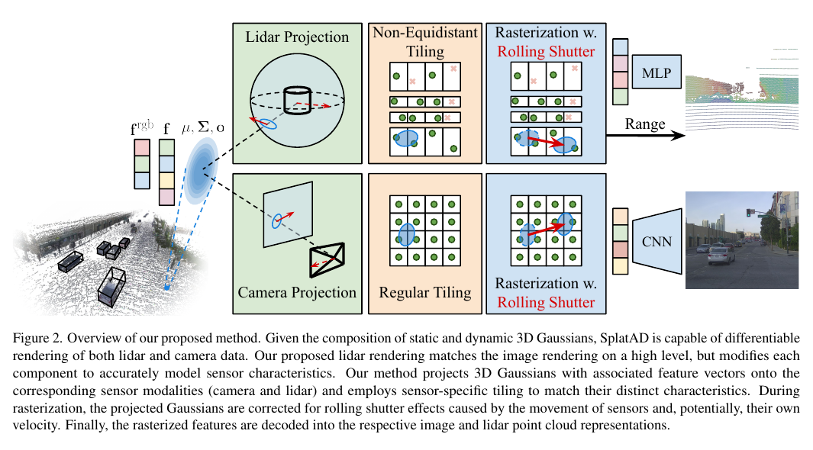
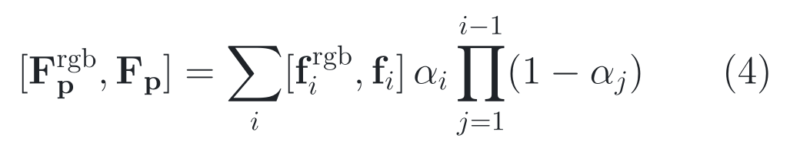
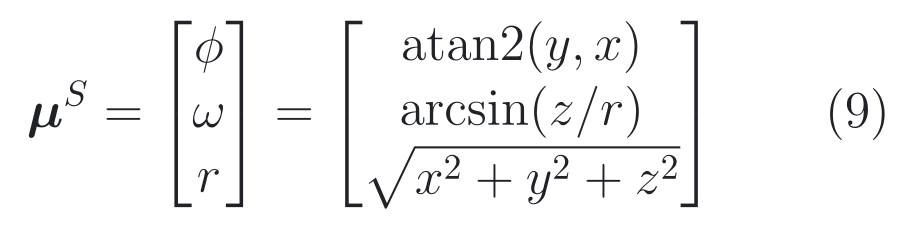
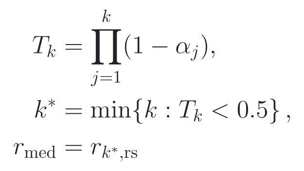
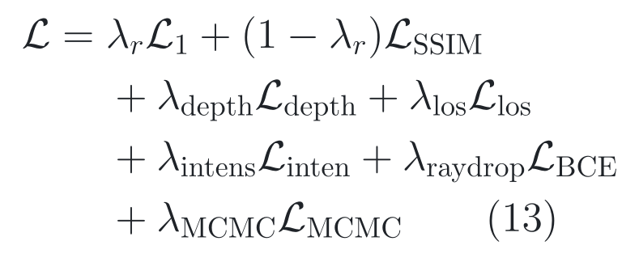
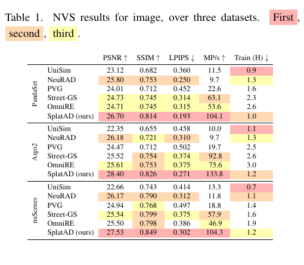
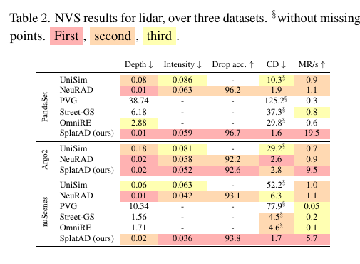
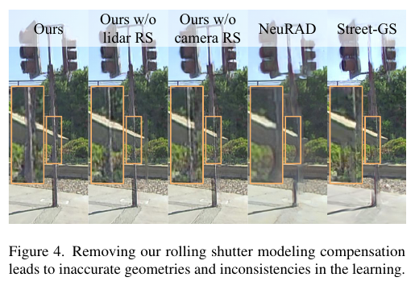
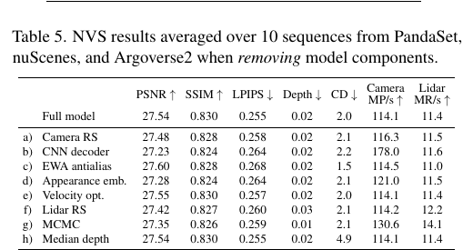

# 2026-08-08 — SplatAD: Real-Time Lidar and Camera Rendering with 3D Gaussian Splatting for Autonomous Driving

`CVPR 2025` · `Accepted` · `论文已读 / 补充材料已读 / 源码已读 / 未运行`

**主方向：** P13 · 数据生成、仿真、评测与部署 ·
**输入模态：** Surround Camera / LiDAR / Simulation / Vehicle State ·
**交叉标签：** Neural Sensor Simulation、3D Gaussian Splatting、Camera Rendering、LiDAR Rendering、Novel View Synthesis、Rolling Shutter、Dynamic Scene Modeling、Efficient Rendering

[▶ 从第一张图开始](#1-看图论文到底做了什么) ·
[返回首页](../../README.md) · [全部精读](../../index/papers.md) ·
[官方论文](https://openaccess.thecvf.com/content/CVPR2025/papers/Hess_SplatAD_Real-Time_Lidar_and_Camera_Rendering_with_3D_Gaussian_Splatting_CVPR_2025_paper.pdf) ·
[CVPR 录用页](https://openaccess.thecvf.com/content/CVPR2025/html/Hess_SplatAD_Real-Time_Lidar_and_Camera_Rendering_with_3D_Gaussian_Splatting_for_Autonomous_Driving_CVPR_2025_paper.html) ·
[官方代码 @ c24765e3c37164db187119a224f3b9b83914f4bb](https://github.com/georghess/neurad-studio/tree/c24765e3c37164db187119a224f3b9b83914f4bb)

证据与行文标签：**[原文翻译]** 忠实中文译文；**[笔记解释]** 帮助理解的通俗讲解；**[论文]** 作者材料直接支持；**[源码]** 固定 commit 直接支持；**[判断]** 本笔记分析；**[未核验]** 尚未独立运行或确认。译文中不混入解释或判断。

## 0. 阅读起点：术语先导与摘要完整翻译

### 0.1 首次术语解释

**术语覆盖声明：** 摘要中的核心专业术语先在这里解释；摘要之后第一次出现的新术语仍在正文首次出现处解释，后文保持同一中文名、英文名、缩写与语义。

- **自动驾驶（Autonomous Driving, AD）传感器仿真**：从已采集日志学习可编辑场景，并在新视角或新位姿生成相机与 LiDAR 观测；本文评的是离线传感器重建/新视角合成，不是闭环安全本身。
- **神经辐射场（Neural Radiance Field, NeRF）**：用隐式网络表示空间辐射与密度，再沿每条射线密集采样；NeuRAD 和 UniSim 属于这条路线，质量高但逐射线查询较慢。
- **三维高斯泼溅（3D Gaussian Splatting, 3DGS）**：用显式三维高斯原语表示场景，经投影、分块、排序和透明度合成高速渲染；本文继承这个主干表示。
- **SplatAD**：作者提出的方法名；它把 3DGS 扩展为共享表示上的相机—LiDAR 联合传感器渲染器。
- **新视角合成（Novel View Synthesis, NVS）**：训练只看部分采集位姿，验证在保留帧或改变位姿的视角渲染观测；它不等于任意远距离外推。
- **滚动快门（Rolling Shutter, RS）**：相机逐行、旋转式 LiDAR 逐束在不同时间采样，车辆或目标运动会让一次“帧/扫描”内部发生几何偏移。
- **射线丢失（ray drop）**：LiDAR 发射束没有形成有效返回；本文用预测概率决定一个渲染射线是否保留为点。
- **峰值信噪比（Peak Signal-to-Noise Ratio, PSNR）**：以像素误差为基础的图像质量指标，越高越好；它不直接衡量语义、物理一致性或下游感知正确率。
- **Chamfer Distance（CD）**：在两组点云间做双向最近邻距离聚合，越低越好；它可能掩盖稀有小目标和局部拓扑错误。
- **每秒百万像素/射线（MP/s / MR/s）**：作者采用的分辨率无关吞吐量，分别用于相机和 LiDAR；它不是包含数据加载、后处理和闭环系统的端到端墙钟延迟。

### 0.2 摘要完整专业中文翻译

**原文锚点：** Abstract，PDF p. 1 / proceedings p. 11982。

> **[原文翻译] Abstract · PDF p. 1 · A01**
>
> 确保自动驾驶系统的安全，需要对其在各种条件下进行广泛测试。仿真是以经济且可扩展的方式开展此类测试的关键组成部分。通过在采集日志上训练、进而允许对其进行编辑并改变传感器视角，神经渲染已经成为一种很有前景的仿真方法。然而，现有用于逼真渲染相机和 LiDAR 数据的神经辐射场方法渲染速度较慢，这限制了它们在大规模测试中的适用性。尽管三维高斯泼溅能够实现实时渲染，当前方法却局限于相机数据，无法渲染自动驾驶所必需的 LiDAR 数据。为解决这些局限，作者提出 SplatAD：首个基于 3DGS、能够从同一表示中对动态场景的相机和 LiDAR 数据进行逼真、实时渲染的方法。SplatAD 对相机滚动快门和 LiDAR 传感器特性——包括强度、射线丢失与滚动快门——进行精确建模，并通过专门设计的高效算法实现这些能力。作者在三个自动驾驶数据集上评估 SplatAD；该方法在图像与 LiDAR 新视角合成和重建任务上实现了最先进的质量，同时渲染速度提高一个数量级。具体而言，作者在新视角合成上取得最高超过 2 PSNR 的改进，在重建上取得最高超过 3 PSNR 的改进。

**完整性声明：** 以上按原摘要唯一实质段落完整翻译，保留了范围、比较、因果、最高增益和任务限定；没有抽取不清或删减内容。

> [!TIP]
> **[笔记解释] 读完摘要再看这一句：** SplatAD 把 3DGS 改造成相机—LiDAR 共用的高速传感器渲染器，最强模块证据是中位距离读出把平均 CD 从 4.9 降至 2.0；但全部证据仍来自 30 段日志的离线 NVS/重建，未证明下游感知或道路安全。

### 0.3 为什么今天值得读

**新近性与录用：** **[论文]** 本文由 CVF 官方页面确认为 CVPR 2025 主会论文，页码 11982–11992；不是 Workshop，也不是把 arXiv 预印本误写成录用。[权威录用页](https://openaccess.thecvf.com/content/CVPR2025/html/Hess_SplatAD_Real-Time_Lidar_and_Camera_Rendering_with_3D_Gaussian_Splatting_for_Autonomous_Driving_CVPR_2025_paper.html)。

**影响与社区信号：** **[判断]** 截至 2026-08-08，Semantic Scholar 接口记录 79 次引用；完整实现仓库有 494 stars，自定义 SplatAD CUDA 内核仓库有 409 stars。引用和 stars 只说明短期采用与注意力，不等于实现已复现或结论无误。[引用查询](https://api.semanticscholar.org/graph/v1/paper/ARXIV:2411.16816?fields=title,citationCount) · [完整实现](https://github.com/georghess/neurad-studio) · [渲染内核](https://github.com/carlinds/splatad)。

**作者与团队脉络：** **[论文/判断]** 论文 affiliation 为 Zenseact 与 Chalmers University of Technology；Georg Hess、Carl Lindström 等作者延续了 NeuRAD 的联合相机—LiDAR 神经渲染路线，并把逐射线 NeRF 换成专用 3DGS 光栅化。连续贡献帮助发现候选，但不能替代本篇的受控证据，也不等于论文质量。[团队官方项目页](https://research.zenseact.com/publications/splatad/) · [NeuRAD 官方论文](https://openaccess.thecvf.com/content/CVPR2024/html/Tonderski_NeuRAD_Neural_Rendering_for_Autonomous_Driving_CVPR_2024_paper.html)。

**覆盖与研究价值：** **[判断]** 2026-08-07 结束时 13 个主方向中只有 P13 尚无精读；本文以正式录用、联合传感器、公开完整实现和部署吞吐证据补齐 P13。它改变的研究判断是：3DGS 的“实时”不能直接迁到旋转式 LiDAR，传感器坐标、非等距束、滚动快门、丢束和读出规则本身就是算法，而不是外围工程。

**候选对照：** **[判断]** 同轮强候选包括 CVPR 2024 Highlight 的 [NeuRAD](https://openaccess.thecvf.com/content/CVPR2024/html/Tonderski_NeuRAD_Neural_Rendering_for_Autonomous_Driving_CVPR_2024_paper.html) 与 ICLR 2025 的 [GS-LiDAR](https://proceedings.iclr.cc/paper_files/paper/2025/hash/8e86fd925dda476f574689f4ce748193-Abstract-Conference.html)。NeuRAD 的代码和传感器模型更成熟但渲染慢；GS-LiDAR 的 LiDAR 建模更专一但没有同一表示的相机联合渲染。SplatAD 以 9.8/10 的选择评分先读：新近性与录用 2.0、感知覆盖 2.0、影响信号 1.4、团队脉络 1.0、公开材料 1.4、研究决策价值 2.0。

### 0.4 问题背景与前置工作

**30 秒问题背景：** **[笔记解释]** 想象把一段真实十字路口日志改成“自车横移 2 米”。相机需要看到新的遮挡边界，旋转 LiDAR 的前半圈和后半圈还分别来自不同时间；若把 LiDAR 当六张深度相机，杆子会被切穿，若把半透明前景与背景深度求平均，点会落在空气中。这段故事只建立直觉，不是道路安全证据；真实任务是从记录过的相机、点云、位姿和动态框学习可微场景，再对新视角生成传感器观测。

**任务与评价对象：** **[论文]** 输入日志中的多相机图像、LiDAR 点、传感器标定/运动与带轨迹的三维动态框 → 学习静态世界和刚性 actor 的 3D Gaussian 表示 → 在保留帧或改动位姿渲染 RGB、距离、强度与 ray-drop → 用 PSNR/SSIM/LPIPS、深度误差、强度 RMSE、drop accuracy、CD 与吞吐评估。坐标从 world/actor 变到 camera 或 LiDAR，再投到 image 或 spherical sensor space（论文 §3，PDF pp. 3–5）；这些离线指标不等于总体 accuracy、下游感知正确或闭环安全。

**关键前置算法：** **[论文/笔记解释]** 3DGS 提供显式高斯、16×16 图像 tile、深度排序与 alpha 合成的高速主干，但原始版本只处理相机；NeRF 用沿射线采样的隐式场，能自然共用相机和 LiDAR 射线，却要付出密集查询成本；scene graph decomposition 把静态世界与带 SE(3) 位姿的 actor 分开，能编辑车辆位置，但本文仍把所有 actor 当刚体；Mip-Splatting 的 EWA/Mip filter 抑制采样率变化下的混叠，本文直接继承其 alpha footprint。来源：论文 §2–§3，PDF pp. 2–5。

**相关论文路线：**

- **UniSim → NeuRAD → 本文：** [UniSim 官方论文](https://openaccess.thecvf.com/content/CVPR2023/html/Yang_UniSim_A_Neural_Closed-Loop_Sensor_Simulator_CVPR_2023_paper.html)建立可编辑相机—LiDAR 神经仿真；[NeuRAD 官方论文](https://openaccess.thecvf.com/content/CVPR2024/html/Tonderski_NeuRAD_Neural_Rendering_for_Autonomous_Driving_CVPR_2024_paper.html)补齐多数据集、rolling shutter、强度和 ray drop。SplatAD 继承任务、数据协议和 actor scene graph，却把逐射线 NeRF 换为模态专用投影、分块和 CUDA 光栅化；前两者仍不能回答同质量下能否获得一个数量级吞吐提升。
- **3DGS / Street Gaussians ↔ 本文：** [3DGS 官方项目](https://repo-sam.inria.fr/fungraph/3d-gaussian-splatting/)提供实时相机光栅化；[Street Gaussians 官方论文](https://www.ecva.net/papers/eccv_2024/papers_ECCV/papers/09243.pdf)把静态背景与刚性交通参与者组合起来。SplatAD 继承显式高斯和 scene graph，但替换球谐颜色、增加共享特征与两类传感器 decoder，并真正生成 LiDAR 点而不是只把已有点投到深度图上。

**本文接在哪里：** **[判断]** 已有路线分别解决了“联合传感器但慢”和“相机实时但无原生 LiDAR”；本文只改变表示到传感器输出的投影—分块—rolling-shutter—decoder 链。3DGS、MCMC densification、scene graph 和 Mip filter 是继承能力；非刚性 actor、远离训练轨迹的可靠外推、下游感知有效性与闭环安全仍未解决。

**资料使用边界：** **[判断]** 论文解析帖子、视频、Papers with Code 和社区列表只用于召回与组织讲解，不作为录用、方法、数字或源码行为的最终证据；事实回到原论文、补充材料、CVF proceedings、官方 benchmark 与固定 40 位 commit 源码，二手解析与官方证据冲突时以官方材料为准并并列差异。

**学习顺序：**
[0 摘要与术语](#0-阅读起点术语先导与摘要完整翻译) →
[1 看原图](#1-看图论文到底做了什么) →
[2 读原式](#2-读公式核心机制怎样表达) →
[3 看结果](#3-看结果证据是否支持主张) →
[4 对源码](#4-对源码公式如何落地) →
[5 记结论](#5-记结论贡献边界与开放问题)

## 1. 看图：论文到底做了什么

> **原图出处：** Hess et al., CVPR 2025, Figure 2, PDF p. 3 / proceedings p. 11984。[官方 PDF](https://openaccess.thecvf.com/content/CVPR2025/papers/Hess_SplatAD_Real-Time_Lidar_and_Camera_Rendering_with_3D_Gaussian_Splatting_CVPR_2025_paper.pdf)。仅裁取理解所需区域，原图版权归原作者及其他权利人。

### 这张图按什么顺序看

1. 左侧是一份共享的 3D Gaussian scene graph：静态世界高斯用 world 坐标，动态 actor 高斯用各自 box 的局部坐标，均携带颜色、13 维特征、均值、协方差和 opacity。
2. 上支路转到 LiDAR 球坐标，以非等距 beam 排列建 tile；下支路转到相机像素，以规则 16×16 tile 分块。
3. 两支路都在 rasterization 内按每个像素/束的采集时间修正 rolling shutter；相机 CNN 输出 RGB，LiDAR MLP 输出 intensity 与 ray-drop，距离则由 alpha 合成读出。

**看完应能复述：** 一套 scene graph 不意味着一个通用 renderer；SplatAD 共享三维原语，却按相机和旋转式 LiDAR 的采样几何分别做投影、tiling、时间补偿和输出解码。

**这张图没有证明：** 方法图只说明数据流，不证明每个模块单独有效、渲染值能训练更强的感知器、吞吐等于闭环实时，也没有展示固定实现的依赖漂移和中位深度 fallback。

### 整体算法架构与创新设计

**原方法瓶颈：** **[论文]** NeRF 型联合传感器方法要沿每条相机/LiDAR 射线密集采样，难以扩展测试；相机 3DGS 的透视投影、等规则像素 grid 和单一曝光假设又不匹配稀疏、非等距、旋转采集且会 ray-drop 的 LiDAR。作者在 §1 与 §3.3（PDF pp. 1、4–5）明确把瓶颈定位为“联合多传感器的质量、真实传感器模型与实时吞吐无法同时满足”。

**主干网络与基线：** **[论文/源码]** 这里没有传统图像 backbone/neck；主干表示是 3DGS scene graph，encoder 是从 world/actor 到 camera 或 LiDAR 的坐标变换与 covariance projection，核心表示为最多 5M 个高斯，camera head 是两残差块、hidden 32 的 CNN，LiDAR head 是 hidden 32 的 MLP；直接基线为 NeuRAD、UniSim、PVG、Street-GS 与 OmniRE（论文 §3–§4，PDF pp. 3–8）。固定配置把 feature dimension 设为 13、appearance embedding 设为 8、MCMC 上限设为 5M。[固定 SHA 配置](https://github.com/georghess/neurad-studio/blob/c24765e3c37164db187119a224f3b9b83914f4bb/nerfstudio/models/splatad.py#L154-L280)。

**继承与新增边界：** **[论文/源码]** 继承项包括 3DGS 的显式均值/协方差/opacity、tile sort 与 alpha compositing，Street-GS/NeuRAD 式 static–actor scene graph，Mip-Splatting 的 EWA filter，以及 3DGS-MCMC 的 densification/regularization；本文新增或替换的是共享 13 维 feature、camera affine CNN、LiDAR intensity/drop MLP、球坐标 non-equidistant tiling、两模态 rolling-shutter kernel 和 LiDAR median range。迁移实验中的 PVG/Street-GS/OmniRE 只是 baseline，不是 SplatAD backbone（论文 §2–§3，PDF pp. 2–6；[固定 SHA 模型](https://github.com/georghess/neurad-studio/blob/c24765e3c37164db187119a224f3b9b83914f4bb/nerfstudio/models/splatad.py#L314-L373)）。

**端到端信息流：** **[论文/源码]** 多相机 RGB + LiDAR 的 azimuth/elevation/range/time/intensity + calib/ego pose + actor box/trajectory → 由最多 2M LiDAR 点、actor 每框 500 点和随机点初始化 world/actor Gaussians → 按当前时刻把 actor-local means/covariances 变到 world，再变到 camera 或 LiDAR frame → camera 得到 H×W×13 feature map，LiDAR 得到 C×H×W×13 稀疏 feature grid → rolling-shutter rasterizer → camera CNN 给 RGB，LiDAR MLP 给 intensity/drop，alpha 读出 range → 输出图片或点云；没有跨帧预测状态写回，变化来自共享可学习场景参数和当前 pose。来源：Figure 2、§3.1–§3.3，PDF pp. 3–5；[固定 SHA forward](https://github.com/georghess/neurad-studio/blob/c24765e3c37164db187119a224f3b9b83914f4bb/nerfstudio/models/splatad.py#L835-L1230)。

**总体训练方式：** **[论文/源码]** 单阶段联合优化 30,000 steps，Adam；从混合相机/LiDAR pool 每步随机取一个尚未用过的 camera frame 或 LiDAR scan，而不是同一步配对两模态。camera step 只产生 RGB L1/SSIM；LiDAR step 产生期望距离、intensity、ray-drop 与 line-of-sight loss；共享 Gaussians 通过当前支路获得梯度，median range 只用于推理。分辨率从原图 1/4 开始，在 3k 和 6k step 各放大 2 倍，actor trajectory 可学习、camera/LiDAR pose 不优化。来源：Supplement §B（PDF p. 2）与 [固定 SHA datamanager](https://github.com/georghess/neurad-studio/blob/c24765e3c37164db187119a224f3b9b83914f4bb/nerfstudio/data/datamanagers/full_images_lidar_datamanager.py#L438-L456)。

#### 创新模块 1：Shared Feature Gaussians 与 Sensor-Specific Decoders

**位置与接口：** 共享 3D Gaussian 表示之后、最终传感器输出之前；camera 和 LiDAR 光栅化都产出 feature，再由各自 head 解码。

**输入：** 每个可见 Gaussian 的 base RGB、13 维可学习 feature、alpha 权重；camera head 另接 ray direction 与 8 维 sensor embedding，LiDAR head 接 ray direction。

**内部变换：** 先按深度/range 排序 alpha-composite；camera 以两残差块 CNN 预测逐像素 affine scale/bias 修正 base RGB，LiDAR 以 MLP 联合预测 intensity 与 ray-drop logit。

**输出：** camera 输出 H×W×3 RGB；LiDAR 输出与 beam grid 同 shape 的 intensity 和 drop probability，距离不由 MLP 回归而由 alpha readout 提供。

**为什么这样设计：** **[论文]** §3.1–§3.3（PDF pp. 3–5）明确指出球谐颜色不能自然同时表达 camera appearance 与 LiDAR intensity/drop，因此用共享 feature 承载跨传感器场景信息、用专用 decoder 处理各传感器现象。

**训练信号：** **[源码]** camera CNN 直接接 RGB L1/SSIM；LiDAR MLP 的 intensity 通道接 masked MSE，drop 通道接 BCE；共享 feature 经当前被抽到的模态获得间接梯度，不是每个 step 同时接两模态 loss。[固定 SHA losses](https://github.com/georghess/neurad-studio/blob/c24765e3c37164db187119a224f3b9b83914f4bb/nerfstudio/models/splatad.py#L1356-L1432)。

**作用与证据：** **[未核验]** 原文未提供“共享 feature 表示”整体的独立消融/受控对照，整套系统增益不能单独归因给共享表示；Table 5 只受控移除 camera CNN decoder，PSNR 从 27.54 降到 27.23、LPIPS 从 0.255 恶化到 0.264，同时 camera throughput 从 114.1 升到 178.0 MP/s，因此只支持 CNN 的质量—速度权衡。

**论文位置：** **[论文]** Figure 2、§3.1–§3.3，PDF pp. 3–5；CNN 干预在 Table 5、PDF p. 8。

**源码入口：** **[源码]** [固定 SHA head 构造](https://github.com/georghess/neurad-studio/blob/c24765e3c37164db187119a224f3b9b83914f4bb/nerfstudio/models/splatad.py#L349-L373)与 [camera/LiDAR forward](https://github.com/georghess/neurad-studio/blob/c24765e3c37164db187119a224f3b9b83914f4bb/nerfstudio/models/splatad.py#L871-L1230)。

#### 创新模块 2：Non-Equidistant Spherical LiDAR Rasterizer

**位置与接口：** world/actor Gaussian composition 之后、LiDAR alpha compositing 之前；它把相机式透视 tile 替换为真实束布局的球坐标 tile。

**输入：** LiDAR-frame mean/covariance、每个训练点或规格给出的 azimuth、elevation、capture time，以及非等距 diode elevation 边界。

**内部变换：** 先把 Cartesian mean 和 covariance 通过 spherical Jacobian 投影；横向按固定 azimuth resolution 环绕 360° 分 tile，纵向按排序后的 diode 边界短循环找交集，再按 mean range 排序并用每束一个 CUDA thread 光栅化。

**输出：** 与传感器实际 beam grid/训练稀疏点位置对应的 alpha、feature、expected range 与 median range；不是把 360° LiDAR 硬拆成六张 pinhole depth image。

**为什么这样设计：** **[论文]** 论文 §3.3，PDF p. 5 明确说明旋转式 LiDAR 垂直 diode 常非等距；为了避免等尺寸 image tile 按最细分辨率分配线程、在稀疏区制造大量空算并可能找不到真实束，作者改用非等距 spherical tiling。

**训练信号：** **[源码]** rasterizer 本身通过 expected range L1、intensity MSE、ray-drop BCE 与 line-of-sight loss 获得可微梯度；evaluation 超过每 tile 256 点时会多 pass，training 则 shuffle 并丢弃超过 256 的点。[固定 SHA LiDAR forward](https://github.com/georghess/neurad-studio/blob/c24765e3c37164db187119a224f3b9b83914f4bb/nerfstudio/models/splatad.py#L1037-L1230)。

**作用与证据：** **[未核验]** 原文未提供“非等距 spherical tiling”对“等距 tiling”的独立消融/受控对照，整套系统增益不能单独归因给该 rasterizer；Table 2 对深度图式 3DGS baselines 同时更换了投影、传感器 head、rolling shutter 和 loss，属于多组件变化。

**论文位置：** **[论文]** Figure 2、Eq. (9)–(12)、§3.3，PDF pp. 3–5；线程上限与多 pass 见 Supplement §A，PDF p. 1。

**源码入口：** **[源码]** [固定 SHA 主仓库的 LiDAR 调用](https://github.com/georghess/neurad-studio/blob/c24765e3c37164db187119a224f3b9b83914f4bb/nerfstudio/models/splatad.py#L1106-L1179)；实际 CUDA kernel 另固定为 [carlinds/splatad @ 6e31ad766d39e0c33f9034a2ed772d51364b2343](https://github.com/carlinds/splatad/tree/6e31ad766d39e0c33f9034a2ed772d51364b2343)。

#### 创新模块 3：Camera/LiDAR Rolling-Shutter Compensation

**位置与接口：** projection/tiling 后、每个 pixel 或 LiDAR beam 计算 Gaussian footprint 时；它用采集时间修正投影中心和 range。

**输入：** sensor-frame Gaussian mean、camera/LiDAR linear 与 angular velocity、actor-local velocity、pixel row 或 beam capture time，以及可学习的 sensor time offset。

**内部变换：** 将 sensor 反向运动与 actor 正向运动相加，经 projection Jacobian 得到 image/spherical velocity；扩大 AABB 防止移动 Gaussian 被 cull，再按像素/束相对扫描中点的时间平移二维中心，LiDAR 还修正 range。

**输出：** 每个采样时刻对应的 Gaussian center 与 range；静态 world 的 actor velocity 为零，动态 actor 使用局部速度变换到 sensor frame。

**为什么这样设计：** **[论文]** §3.2–§3.3（PDF pp. 3–5）明确指出高速 ego motion 使一帧内各行/束来自不同 pose；为了避免直接按单一 origin 投影造成细杆和遮挡边界错位、同时避开逐行重投所有 Gaussian 的高成本，作者在 sensor space 做一阶速度近似。

**训练信号：** **[源码]** RS 没有独立标签；几何修正参与 RGB 和 LiDAR forward，经当前模态 loss 间接训练 sensor velocity/time offset 与 actor trajectory。固定实现没有对 RS 结果 detach；camera/LiDAR pose 本身不优化。[固定 SHA actor/velocity path](https://github.com/georghess/neurad-studio/blob/c24765e3c37164db187119a224f3b9b83914f4bb/nerfstudio/models/splatad.py#L835-L1035)。

**作用与证据：** **[论文]** Table 5、PDF p. 8 的受控消融移除 camera RS：PSNR 27.54→27.48，下降 0.06 dB；LPIPS 0.255→0.258，误差恶化。移除 LiDAR RS：depth 0.02→0.03、CD 2.0→2.1，而吞吐仅 11.4→12.2 MR/s。Figure 4 还给出杆件边缘错位；证据支持小量化增益与明显细结构失真，不支持所有场景都有大幅平均提升。

**论文位置：** **[论文]** Eq. (1)–(6)、Eq. (11)–(12)、Figure 4、Table 5，§3.2–§4.3，PDF pp. 4–8。

**源码入口：** **[源码]** [固定 SHA camera RS](https://github.com/georghess/neurad-studio/blob/c24765e3c37164db187119a224f3b9b83914f4bb/nerfstudio/models/splatad.py#L871-L1035)与 [LiDAR RS](https://github.com/georghess/neurad-studio/blob/c24765e3c37164db187119a224f3b9b83914f4bb/nerfstudio/models/splatad.py#L1037-L1179)。

#### 创新模块 4：Alpha-Weighted Median Range Readout

**位置与接口：** LiDAR rasterizer 累积前后表面 alpha/range 后、点云坐标生成前；它不改变 Gaussian 或训练 loss，只改变推理 range readout。

**输入：** 按 range 排序的每束 Gaussian alpha、rolling-shutter corrected range、总 accumulated alpha，以及 ray-drop probability。

**内部变换：** 选择累计透射率首次低于 0.5、等价累计 opacity 首次超过 0.5 的 Gaussian range；固定实现若整条束累计 alpha 不足 0.5，则回退到 normalized expected range。

**输出：** 每束一个以米计的 median depth/range，再与 azimuth/elevation 转为 LiDAR-frame XYZ；ray-drop 超阈值的束随后被过滤。

**为什么这样设计：** **[论文]** §3.3（PDF p. 5）明确指出 expected range 会在前后两个 Gaussian 之间产生并不存在的深度，而 median range 选择一个实际排序表面，避免“点漂在两表面中间”。

**训练信号：** **[源码]** median readout 是 prediction-relevant、evaluation-only 路径：训练直接监督的是 expected depth 的 trimmed L1，median 没有独立 loss，也没有梯度；因此不能写成“median loss 训练了 Gaussian”。[固定 SHA readout 与 loss](https://github.com/georghess/neurad-studio/blob/c24765e3c37164db187119a224f3b9b83914f4bb/nerfstudio/models/splatad.py#L1206-L1217)。

**作用与证据：** **[论文]** Table 5、PDF p. 8 的受控比较把推理 median depth 替换为 expected depth，CD 从 2.0 恶化到 4.9，即绝对增加 2.9、相对增加 145%，而 depth 指标同为 0.02、吞吐同为 11.4 MR/s；这只支持点云表面读出，不证明训练目标更优。

**论文位置：** **[论文]** §3.3 的未编号定义（PDF p. 5）与 Table 5 row h（PDF p. 8）。

**源码入口：** **[源码]** [固定 SHA median/fallback](https://github.com/georghess/neurad-studio/blob/c24765e3c37164db187119a224f3b9b83914f4bb/nerfstudio/models/splatad.py#L1206-L1217)与 [点云生成](https://github.com/georghess/neurad-studio/blob/c24765e3c37164db187119a224f3b9b83914f4bb/nerfstudio/models/splatad.py#L1298-L1320)。

## 2. 读公式：核心机制怎样表达

**变量身份图例：** **[领域惯用]** 表示语义角色在本领域常见，但不表示所有论文都使用同一个字母；**[本文定义]** 表示论文给该符号赋予了本文特定含义；**[源码/笔记重排]** 表示固定源码等价式或本笔记计算新增的符号。

### 原文公式 1：从前到后的 alpha 特征合成

**原文公式：** 论文 Eq. (4)，PDF p. 4。

<picture><source media="(prefers-color-scheme: dark)" srcset="../../assets/notes/2026-08-08-splatad/formulas/eq-01-alpha-composite-dark.png"></picture>

> **公式来源：** Hess et al., CVPR 2025, Eq. (4)，§3.2，PDF p. 4；本图按原符号重排。[官方 PDF](https://openaccess.thecvf.com/content/CVPR2025/papers/Hess_SplatAD_Real-Time_Lidar_and_Camera_Rendering_with_3D_Gaussian_Splatting_CVPR_2025_paper.pdf) · [可复制 TeX](../../assets/notes/2026-08-08-splatad/formulas/source.tex#L4-L11)。

**先建立画面：** **[笔记解释]** 沿一条看向前车的视线从近到远叠半透明胶片：近处胶片先取走一部分光，后面的胶片只能使用还没被遮住的份额；颜色和传感器特征用同一组遮挡权重搬到像素/束上。

**变量逐项解释与身份：** **[领域惯用]** Σ 表示求和、Π 表示连乘，*i*/*j* 是按深度或 range 排序的高斯索引，字母不强制。**[本文定义]** **p** 是 camera pixel 或 LiDAR beam 的采样位置；**F**rgbp 与 **F**p 分别是该位置的合成 base RGB 和 13 维 feature；**f**rgbi、**f**i 是第 *i* 个 Gaussian 的可学习颜色与 feature；αi 是 footprint、opacity 与 EWA filter 共同给出的 0–1 有效不透明度；Πj&lt;i(1−αj) 是前面高斯留下的透射率。feature/颜色/opacity 可学习，索引和采样位置不可学习。

**变量变化会怎样：** 在其他量暂时不变时，某个近处 αi 增大会提高它自身权重、压低后方所有项；αi=0 时该 Gaussian 不贡献；最前项 α=1 时后面全部被遮住。多个 α 同时改变或 MCMC 新增/删除 Gaussian 时存在耦合，不能只看单个变量断言输出单调变化。

**纯文字读法：** 对每个按距离排序的 Gaussian，把它的颜色和 feature 乘以自身不透明度，再乘以前面所有 Gaussian 尚未遮住的比例；把所有贡献相加，得到当前像素或 LiDAR 束的合成表示。

**教学小例子：** **[笔记解释]** 这是教学示例，不是论文实验。某 LiDAR 束前后两片表面 α 分别为 0.6、0.5，feature 简化为 10、20；前者权重 0.6，后者权重 0.5×(1−0.6)=0.2，合成值为 10×0.6+20×0.2=10。故事上，近车占 60% 的返回，后墙只能使用余下 40% 里的半数。

**专业解释：** 同一权重合成 base RGB、shared feature 与 expected range，使 camera 和 LiDAR 共用 visibility；差别位于坐标投影、tile、rolling shutter、decoder 和最终 range readout，而不是另建两套场景。

**原图对应：** Figure 2 的两条支路都在 “Rasterization w. Rolling Shutter” 执行这一步；camera 输出后进 CNN，LiDAR 输出后进 MLP 和 range readout。

**固定源码映射：** **[源码]** camera 调用 [rasterization](https://github.com/georghess/neurad-studio/blob/c24765e3c37164db187119a224f3b9b83914f4bb/nerfstudio/models/splatad.py#L962-L1001)，LiDAR 调用 [lidar_rasterization](https://github.com/georghess/neurad-studio/blob/c24765e3c37164db187119a224f3b9b83914f4bb/nerfstudio/models/splatad.py#L1106-L1179)；实际内核另固定在 `carlinds/splatad@6e31ad766d39e0c33f9034a2ed772d51364b2343`。

**公式省略的实现细节：** tile culling、Gaussian duplicate/sort、每 tile 点上限、background 合成和 EWA footprint 都不在 Eq. (4)；这些会改变真实权重与吞吐。

### 原文公式 2：从 LiDAR 直角坐标转到球坐标

**原文公式：** 论文 Eq. (9)，PDF p. 5。

<picture><source media="(prefers-color-scheme: dark)" srcset="../../assets/notes/2026-08-08-splatad/formulas/eq-02-spherical-projection-dark.png"></picture>

> **公式来源：** Hess et al., CVPR 2025, Eq. (9)，§3.3，PDF p. 5；本图按原符号重排。[官方 PDF](https://openaccess.thecvf.com/content/CVPR2025/papers/Hess_SplatAD_Real-Time_Lidar_and_Camera_Rendering_with_3D_Gaussian_Splatting_CVPR_2025_paper.pdf) · [可复制 TeX](../../assets/notes/2026-08-08-splatad/formulas/source.tex#L13-L22)。

**先建立画面：** **[笔记解释]** 相机问“落在哪个像素”，旋转 LiDAR 更像雷达屏问“朝哪个水平方向、哪根上下激光、离我多远”。这一步把一个三维点改写成 beam 能理解的三张坐标标签。

**变量逐项解释与身份：** **[领域惯用]** *x*、*y*、*z* 表示 Cartesian 三轴、atan2 保留象限、arcsin 是反正弦、平方和开根号给 Euclidean range，这些角色常见但字母不强制。**[本文定义]** **μ**S 是 Gaussian mean 在 spherical sensor space 的三维向量；φ 是 azimuth，ω 是 elevation，均以弧度计；*r* 是以米计的 LiDAR range；*x*、*y*、*z* 来自 LiDAR coordinate system 中 **μ**L。所有量由 pose 和 mean 计算，本式本身无可学习参数。

**变量变化会怎样：** 在 *y*、*z* 固定时增大正 *x* 通常使 *r* 增大、φ 向前轴靠近，但 ω 同时因分母 *r* 变化而减小；*z*=0 时 ω=0；*x*=*y*=0 时 azimuth 未定义且 Jacobian 奇异。因为三个输出耦合，不能只看 *x* 判断所有量单调变化。

**纯文字读法：** 用 atan2(*y*,*x*) 求水平绕车角，用 *z* 除以三维距离后取反正弦求仰角，用三轴平方和开根号求 range；把三者组成球坐标 mean。

**教学小例子：** **[笔记解释]** 这是教学示例，不是论文实验。一个路边反光柱在 LiDAR 坐标 (3,4,0) 米：range 为 5 米，azimuth 约 0.927 rad，elevation 为 0；它应进入对应水平 tile 和地平 beam，而不是某张虚拟相机的像素。

**专业解释：** covariance 也要经 Eq. (9) 的 Jacobian 变到 spherical space，LiDAR tile 才能知道 Gaussian 在 azimuth/elevation 上覆盖多大；只变 mean 会破坏 footprint。

**原图对应：** Figure 2 上支路最左的 “Lidar Projection” 对应 Eq. (9)，后面才是 non-equidistant tiling。

**固定源码映射：** **[源码]** 固定实现把 Gaussian 传入 SplatAD kernel 的 LiDAR projection/rasterization 路径：[主仓调用](https://github.com/georghess/neurad-studio/blob/c24765e3c37164db187119a224f3b9b83914f4bb/nerfstudio/models/splatad.py#L1064-L1179)；kernel 固定为 [6e31ad7](https://github.com/carlinds/splatad/tree/6e31ad766d39e0c33f9034a2ed772d51364b2343)。

**公式省略的实现细节：** Eq. (9) 不含非等距 diode lookup、360° wrapping、tile extent、rolling-shutter time 和 training 点 shuffle；这些决定真实采样 grid。

### 原文公式 3：累计透明度的中位距离定义

**原文未编号公式：** 论文 §3.3，PDF p. 5。

<picture><source media="(prefers-color-scheme: dark)" srcset="../../assets/notes/2026-08-08-splatad/formulas/eq-03-median-range-dark.png"></picture>

> **公式来源：** Hess et al., CVPR 2025, §3.3 未编号文字定义，PDF p. 5；本图把原文乘积条件按原符号重排，辅助量 *T**k* 是 **[源码/笔记重排]**，不是论文新增编号公式。[官方 PDF](https://openaccess.thecvf.com/content/CVPR2025/papers/Hess_SplatAD_Real-Time_Lidar_and_Camera_Rendering_with_3D_Gaussian_Splatting_CVPR_2025_paper.pdf) · [可复制 TeX](../../assets/notes/2026-08-08-splatad/formulas/source.tex#L24-L30)。

**先建立画面：** **[笔记解释]** 一束激光先遇到近车、再遇到后墙；普通平均会把两个距离折中成“车与墙之间的空气点”。中位读出像沿束向前走，累计遮挡一过半就站在那个真实表面，不再把前后表面揉成一个位置。

**变量逐项解释与身份：** **[领域惯用]** *j*/*k* 是沿 range 从近到远的索引，Π 是前缀连乘，min 取首次满足条件的索引，字母不强制。**[本文定义]** α*j* 是第 *j* 个 Gaussian 对该束的有效 opacity；*k** 是首次让 remaining transmittance 低于 0.5 的 Gaussian；*r*med 是推理输出的 meter-range；*r**k*,rs 是第 *k* 个 Gaussian 经 rolling shutter 修正的 range；0.5 是作者固定阈值。**[源码/笔记重排]** *T**k* 仅为读屏和手算引入的累计透射率，不可学习。

**变量变化会怎样：** 在排序和其他 α 不变时，近处 α 增大可能让 *k** 前移，range 变近；近处 α 置零可能让阈值更晚跨越；累计 alpha 永远不足 0.5 时论文定义没有选中项，固定源码会 fallback 到 normalized expected range。排序变化或多个 α 耦合时，输出是离散跳变，不能用单一 α 做连续单调推断。

**纯文字读法：** 从最近 Gaussian 开始，把每个“尚未遮挡比例”连续相乘；找到这个比例第一次小于一半的位置，把该 Gaussian 的滚动快门修正距离作为 LiDAR 返回距离。

**教学小例子：** **[笔记解释]** 这是教学示例，不是论文实验。两表面在 8 米和 20 米，α 为 0.6、0.7：过第一面后的透射率是 0.4，已经低于 0.5，所以输出 8 米；expected range 会混入 20 米。若 α 为 0.2、0.2，总 opacity 不足一半，固定源码转用 normalized expected fallback。

**专业解释：** 该读出是 0.5-quantile 类选择，能避免跨不连续表面的均值偏置；它不保证选中表面正确，因为 alpha 校准、薄目标、排序和 ray-drop 仍可能错。

**原图对应：** Figure 2 的 LiDAR rasterization 输出 “Range”；Table 5 row h 直接干预这个读出。

**固定源码映射：** **[源码]** [median 与 fallback 实现](https://github.com/georghess/neurad-studio/blob/c24765e3c37164db187119a224f3b9b83914f4bb/nerfstudio/models/splatad.py#L1206-L1217)显示：已有 `median_depths` 在 accumulated alpha 不足时加上 expected/alpha；训练 loss 使用另一个 expected `depth` 字段。

**公式省略的实现细节：** 原文未写 fixed source 的低-opacity fallback、ray-drop threshold、point-cloud coordinate conversion，也未把 median 放进训练目标；因此论文定义与源码实际推理须分开读。

### 原文公式 4：联合优化目标

**原文公式：** 论文 Eq. (13)，PDF p. 5。

<picture><source media="(prefers-color-scheme: dark)" srcset="../../assets/notes/2026-08-08-splatad/formulas/eq-04-total-loss-dark.png"></picture>

> **公式来源：** Hess et al., CVPR 2025, Eq. (13)，§3.4，PDF p. 5；本图按原符号主动换行。[官方 PDF](https://openaccess.thecvf.com/content/CVPR2025/papers/Hess_SplatAD_Real-Time_Lidar_and_Camera_Rendering_with_3D_Gaussian_Splatting_CVPR_2025_paper.pdf) · [可复制 TeX](../../assets/notes/2026-08-08-splatad/formulas/source.tex#L32-L43)。

**先建立画面：** **[笔记解释]** 把渲染器想成同时学摄影和激光测距的学徒：相机老师看颜色与结构，LiDAR 老师看距离、视线前是否乱挡、强度与丢束，MCMC 管理员还限制高斯数量与形状；一次训练 step 实际只来相机老师或 LiDAR 老师之一。

**变量逐项解释与身份：** **[领域惯用]** 𝓛 表示 loss、λ 表示非负权重，字母不强制。**[本文定义]** 𝓛1/𝓛SSIM 是 RGB L1 与 SSIM；𝓛depth 是 expected LiDAR range loss；𝓛los 惩罚 ground-truth range 前的 opacity；𝓛inten 是 intensity loss；𝓛BCE 是 ray-drop binary cross entropy；𝓛MCMC 是 opacity/scale regularization。Supplement §B 给 λr=0.8、λdepth=0.1、λlos=0.1、λintens=1.0、λraydrop=0.1；MCMC 内部 λo=0.005、λΣ=0.001。loss 无单位，模型参数可学习，λ 固定。

**变量变化会怎样：** 在其他 loss 数值暂时不变时，提高某 λ 会线性放大该项梯度权重，λ=0 会移除该监督；λr 增大同时提高 L1、降低 SSIM 权重。真实训练中各 loss 共享 Gaussian 参数且模态交替采样，改变一项会改变后续所有项，不能由加权和静态判断最终指标单调变化。

**纯文字读法：** 用 0.8/0.2 混合相机 L1 和 SSIM，再加权加入 LiDAR 期望距离、视线、强度、丢束损失和 MCMC 的 opacity/scale 正则，得到共同优化的目标；具体 step 只计算当前模态存在的项。

**教学小例子：** **[笔记解释]** 这是教学示例，不是论文实验。某 LiDAR step 假设 depth=2、los=1、intensity=0.5、BCE=0.2，忽略 MCMC，则加权值为 0.1×2+0.1×1+1×0.5+0.1×0.2=0.82；camera 项在这个 LiDAR step 没有输入，不应误写成同时直接监督。

**专业解释：** 论文主文把 depth 与 intensity 称为 L2；固定源码对 depth 使用 trimmed absolute error、即 L1，对 intensity 使用 squared error。这不是经数值追踪确认的 bug，而是静态可核验的论文—源码目标差异。

**原图对应：** Figure 2 两个 decoder 与 range 输出分别接相机和 LiDAR loss；MCMC 正则作用于共享 Gaussian 而不是 sensor head。

**固定源码映射：** **[源码]** [固定 SHA loss dictionary](https://github.com/georghess/neurad-studio/blob/c24765e3c37164db187119a224f3b9b83914f4bb/nerfstudio/models/splatad.py#L1356-L1432)显示 depth 先按 95% error quantile mask，再取 absolute error；intensity 取 squared error；ray-drop 用 BCE。

**公式省略的实现细节：** Eq. (13) 不写模态交替采样、95% trim、line-of-sight mask、分辨率 schedule、MCMC cap 与 optimizer parameter groups；这些都影响梯度归属和复现。

## 3. 看结果：证据是否支持主张

### 3.0 数据集与实验设计总览

**数据集与任务：** **[论文]** PandaSet、Argoverse 2、nuScenes 各选与 NeuRAD 相同的 10 个 sequence，共 30 段；原文未公开三个数据集 release/version 字符串。NVS 的 train 使用 every-other frame、val 使用其余 hold-out frame，未设独立 test server；reconstruction 的 train 与评测都使用全部 frame/scan，属于拟合上限而非 test 泛化；Extrapolation 在已训练序列上做 ego/actor pose shift。来源：论文 §4（PDF pp. 6–8）与 Supplement §F（PDF pp. 3–4）。

**传感器与输入：** **[论文/源码]** PandaSet 用 6 cameras + 1 LiDAR，back camera 底部裁 260 px；Argoverse 2 用 7 ring cameras + 2 LiDARs，front-center/rear-left/rear-right 底部裁 250 px；nuScenes 用 6 cameras + top LiDAR，back camera 底部裁 80 px。三者均使用 full-resolution log、sensor pose/velocity、point time/intensity 与 actor box/trajectory；固定 parser/config 的具体数据预处理未在本仓库运行。

**实验分组：** **[论文]** 主 benchmark 包括 camera NVS（Table 1）、LiDAR NVS（Table 2）和 PandaSet reconstruction（Table 3）；泛化/外推组用 ego lane/vertical shift 与 actor rotation/translation 的 FDDINOv2（Table 4）；消融组逐项移除 RS、CNN、EWA、appearance、velocity、MCMC 或替换 median readout（Table 5）；效率/部署组报告 MP/s、MR/s 与单 A100 train hours。原文未提供天气鲁棒、跨数据集零样本迁移、下游 detector 或闭环 tracking 组。

**训练—验证—测试路线：** **[论文/源码]** 原始日志与标定/框 → 选 10 sequences 并裁 ego-vehicle 区域 → 训练：单场景 30k steps、相机/LiDAR sample pool 交替 → 验证/选模：NVS hold-out every-other frame，原文未公开 checkpoint 选择规则 → 推理/后处理：median range + ray-drop filtering，baseline 深度图转点云 → 最终评测：相机/点云质量、pose-shift FDDINOv2 与吞吐；本仓库未训练、未加载 checkpoint、未运行最终评测。

**指标与回答的问题：** **[论文]** PSNR/SSIM/LPIPS 回答像素与感知图像相似度；median squared depth error、intensity RMSE、drop accuracy 与 CD 回答 LiDAR range/reflectivity/丢束/点集几何；FDDINOv2 回答 pose shift 后的 feature distribution 差；MP/s 与 MR/s 回答 kernel 吞吐。PSNR/SSIM 不等于总体 accuracy，CD 不等于每个薄目标正确，低 FDDINOv2 不等于几何或物理正确，高吞吐也不等于闭环系统满足实时和安全。

**一眼看懂实验结论：** **[判断]** 最强模块级证据是 Table 5：只把 median range 换为 expected range，CD 2.0→4.9（+145% error），而 depth 指标与吞吐不变；最强整系统证据是 Table 1/2 的三数据集共同质量—吞吐。最大证据边界是每数据集 10 段日志、无重复 seed/置信区间、无下游感知和闭环安全验证。

### 3.1 原文公开的实验配置

- **数据集版本与划分：** **[论文]** 三个数据集具体 release string 原文未公开；每个数据集固定 10 sequences。NVS 为时间上每隔一帧的 50% train / 50% hold-out val，reconstruction 使用全部帧训练并在同帧评测；没有隐藏 test server。Supplement §F，PDF pp. 3–4。
- **传感器与输入：** **[论文]** PandaSet 6C+1L、Argoverse 2 7C+2L、nuScenes 6C+top L；full resolution，裁剪像素如总览。原文未公开统一空间 range，源码初始化 far points 上限 10 km。论文 §4 与 Supplement §B/F，PDF pp. 2–4。
- **预处理：** **[论文]** 输入 lidar point 提取 azimuth/elevation/time/range/intensity；动态点按 box 分给 actor，点投到最近 image 取初色；baseline sky masks 与 human pose extraction 另耗预处理。Supplement §A–§C，PDF pp. 1–3。
- **硬件与软件：** **[论文]** 单 NVIDIA A100，约 1–1.2 h/sequence；CUDA kernel 基于 gsplat/neurad-studio。CUDA、PyTorch、driver 具体版本原文未公开；固定源码环境未安装运行。论文 §3.4/Table 1，PDF p. 6。
- **初始化：** **[论文]** static 最多 2M LiDAR points，actor box 各随机 500 点，另加 60,000 random Gaussians，一半在 LiDAR range、一半 inverse-distance 到 10 km；scale 为三近邻平均距离的 20%，opacity=0.5。Supplement §B，PDF p. 2。
- **优化器与学习率：** **[论文]** Adam，30,000 steps；Table 6 给各 parameter groups initial/final LR 与 exponential decay：means 1.6e−6、features 2.5e−3、opacity 5e−2、scales 5e−3、quaternion 1e−3 等；warm-up 依 group 为 0–10k。Supplement Table 6，PDF p. 2。
- **batch、epochs 与采样：** **[论文/源码]** 原文未定义 conventional batch size/epochs；固定实现每 iteration 从全部未用 camera/LiDAR sample 中随机取一个，池耗尽后 reset。因传感器数量不同，模态频率由 sample 数决定，不是固定 1:1。[固定 SHA sampler](https://github.com/georghess/neurad-studio/blob/c24765e3c37164db187119a224f3b9b83914f4bb/nerfstudio/data/datamanagers/full_images_lidar_datamanager.py#L438-L456)。
- **分辨率与增强：** **[论文/源码]** 先以原分辨率 1/4 训练，3k 与 6k step 各升采样 2×；固定 actor Gaussian 在 training 具有 0.5 probability 的局部 flip augmentation。其他 color/geometry augmentation 原文未公开。[固定 SHA actor path](https://github.com/georghess/neurad-studio/blob/c24765e3c37164db187119a224f3b9b83914f4bb/nerfstudio/models/splatad.py#L835-L869)。
- **损失与权重：** **[论文]** λr=0.8、λdepth=0.1、λlos=0.1、λintens=1.0、λraydrop=0.1，MCMC opacity/scale 为 0.005/0.001；固定源码 depth 还做 95% error quantile trim。Supplement §B，PDF p. 2。
- **随机种子与重复次数：** **[未核验]** 原文未公开 random seed，也未报告每 sequence 重复训练次数、标准差或置信区间；Table 5 是 30 sequences 平均而非多 seed 统计。
- **选模与 checkpoint：** **[未核验]** 原文未公开 validation-based early stopping 或 best-checkpoint 规则；官方 README 只说明如何从一个已有 checkpoint 启 viewer，没有提供 SplatAD 官方 pretrained checkpoint 下载。
- **推理、阈值与后处理：** **[论文/源码]** inference 用 median range；固定实现 accumulated alpha 不足 0.5 时 fallback expected/alpha，并按 ray-drop score 过滤。论文未公开最终 drop threshold 数值与所有 evaluation flags。[固定 SHA readout](https://github.com/georghess/neurad-studio/blob/c24765e3c37164db187119a224f3b9b83914f4bb/nerfstudio/models/splatad.py#L1206-L1320)。
- **指标与公平性：** **[论文]** 三数据集同 hyperparameters，和 NeuRAD 采用相同 10 sequences、full resolution、50% hold-out；baseline 都用 LiDAR supervision，但深度图 baseline 无法生成 missing ray，只对 existing points 评测并以脚注标示，SplatAD 要预测 missing ray。故 Table 2 某些 CD 不是完全等难任务。论文 §4，PDF p. 7。

### 3.2 原文公开的实验流程

1. **数据准备。** **[论文]** 下载三个公开数据集，选择 Supplement §F 列出的 10 sequences，加载传感器/pose/actor box，做 camera bottom crop，NVS 再按 every-other frame 分 train/hold-out val。Supplement §F，PDF pp. 3–4。
2. **Gaussian 初始化。** **[论文/源码]** 用 LiDAR points、actor-local random points 和 far/near random points 建立 static/actor scene graph；颜色来自最近 image 或 random initialization；本仓库未执行 parser 和初始化。Supplement §B，PDF p. 2；[固定 SHA initialization](https://github.com/georghess/neurad-studio/blob/c24765e3c37164db187119a224f3b9b83914f4bb/nerfstudio/models/splatad.py#L314-L348)。
3. **联合训练。** **[论文/源码]** 30k Adam steps，每步随机取单 camera 或单 LiDAR sample；先低分辨率，逐级升采样；共享 Gaussian、head、velocity/time offset 与 actor trajectory 联合更新，camera/LiDAR pose 固定。[固定 SHA sampler](https://github.com/georghess/neurad-studio/blob/c24765e3c37164db187119a224f3b9b83914f4bb/nerfstudio/data/datamanagers/full_images_lidar_datamanager.py#L438-L456)。
4. **验证与选模。** **[论文/未核验]** NVS 在 hold-out frame 计算相机/LiDAR metrics，reconstruction 在 train-seen views 测容量上限；原文未说明 best/last checkpoint 选择和重复 seed。论文 §4，PDF pp. 6–8。
5. **推理与后处理。** **[论文/源码]** camera 输出 affine-corrected RGB；LiDAR 取 median/fallback range、intensity 和 ray-drop，转为 point cloud；3DGS baselines 则经六张虚拟 depth camera 回投。[固定 SHA point-cloud path](https://github.com/georghess/neurad-studio/blob/c24765e3c37164db187119a224f3b9b83914f4bb/nerfstudio/models/splatad.py#L1298-L1320)。
6. **最终评测。** **[论文/未核验]** 汇总三数据集 NVS、PandaSet reconstruction、pose-shift FDDINOv2、component ablation 与 MP/s/MR/s；本仓库未运行模型、checkpoint 或任何数值复现。论文 §4.1–§4.3，PDF pp. 7–8。

### 3.3 核心结果

> **原图出处：** Hess et al., CVPR 2025, Table 1, PDF p. 6 / proceedings p. 11987。[官方 PDF](https://openaccess.thecvf.com/content/CVPR2025/papers/Hess_SplatAD_Real-Time_Lidar_and_Camera_Rendering_with_3D_Gaussian_Splatting_CVPR_2025_paper.pdf)。仅裁取理解所需区域，原图版权归原作者及其他权利人。

**相机主结果怎样读：** 在 matched NeuRAD protocol 下，SplatAD 的 PandaSet PSNR 26.70 vs 25.80，绝对 +0.90 dB、相对约 +3.5%，吞吐 104.1 vs 9.7 MP/s，约 10.7×；Argoverse 2 为 28.40 vs 26.18，+2.22 dB、约 +8.5%，吞吐约 13.8×；nuScenes 为 27.53 vs 26.17，+1.36 dB、约 +5.2%，吞吐约 8.8×。PSNR 的相对百分比只是量级辅助，不代表感知质量同百分比提升。

**公平与边界：** 作者使用相同 10 sequences、full resolution 和 hold-out 规则，并复用/实现公开 baselines；但 architecture、preprocessing、sky/human priors 和训练时间不同，且没有重复 seed。表支持“三数据集共同趋势”，不支持 device-independent latency 或所有新道路域。

> **原图出处：** Hess et al., CVPR 2025, Table 2, PDF p. 7 / proceedings p. 11988。[官方 PDF](https://openaccess.thecvf.com/content/CVPR2025/papers/Hess_SplatAD_Real-Time_Lidar_and_Camera_Rendering_with_3D_Gaussian_Splatting_CVPR_2025_paper.pdf)。仅裁取理解所需区域，原图版权归原作者及其他权利人。

**LiDAR 主结果怎样读：** PandaSet 中 SplatAD 和 NeuRAD depth 都为 0.01，SplatAD intensity 0.059 vs 0.063、drop accuracy 96.7 vs 96.2、CD 1.6 vs 1.9，吞吐 19.5 vs 1.1 MR/s，约 17.7×。nuScenes 的 CD 1.7 vs 6.3，但 depth 0.02 略差于 NeuRAD 0.01。Argoverse 2 的 SplatAD CD 2.8 反而略差于 NeuRAD 2.6；因此“所有 LiDAR 指标都最优”不成立。

**任务难度脚注：** 带 § 的 3DGS baseline 只在 existing points 上取 depth，无法生成 missing rays；SplatAD/NeuRAD 要预测射线是否存在。这使 CD/throughput 可供研究判断，却不是完全同功能接口的单一排名。

> **原图出处：** Hess et al., CVPR 2025, Figure 4, PDF p. 7 / proceedings p. 11988。[官方 PDF](https://openaccess.thecvf.com/content/CVPR2025/papers/Hess_SplatAD_Real-Time_Lidar_and_Camera_Rendering_with_3D_Gaussian_Splatting_CVPR_2025_paper.pdf)。仅裁取理解所需区域，原图版权归原作者及其他权利人。

**定性图怎样读：** camera RS removal 和 LiDAR RS removal 都在细杆边缘产生错位；Table 5 的平均数值变化不大，Figure 4 说明平均指标可能稀释薄结构 failure。它仍是精选样例，不是 failure rate 统计。

> **原图出处：** Hess et al., CVPR 2025, Table 5, PDF p. 8 / proceedings p. 11989。[官方 PDF](https://openaccess.thecvf.com/content/CVPR2025/papers/Hess_SplatAD_Real-Time_Lidar_and_Camera_Rendering_with_3D_Gaussian_Splatting_CVPR_2025_paper.pdf)。仅裁取理解所需区域，原图版权归原作者及其他权利人。

**主效应与小组件：** median→expected 是最强单项 CD 干预：2.0→4.9，绝对 +2.9、相对 +145% error；camera CNN removal 让 PSNR −0.31、LPIPS +0.009，却换来约 +56% throughput；EWA removal 让 PSNR −0.54、LPIPS +0.013，但 CD 反而 2.0→1.5，揭示 image anti-aliasing 与 LiDAR 点集指标存在 trade-off；velocity optimization row 对 PSNR 几乎不变且 LPIPS 轻微恶化，不能据此宣称 pose optimization 普遍有效。

### 证据支持

- **[论文]** 在作者列明的 30 sequences、full-resolution、50% NVS protocol 下，专用 3DGS renderer 可以在相机和 LiDAR 上达到与 NeuRAD 相当或更好的大多数质量指标，同时提升约一个数量级吞吐。
- **[论文]** median range、camera CNN 与 RS 有对应粒度的干预证据；其中 median readout 的 CD 效应最大，RS 的平均效应较小但薄结构定性差异明显。
- **[源码]** 固定实现确实把 LiDAR 投影/rasterization、intensity/drop head、median/fallback 与模态 loss 接成一条可追踪调用链，而非论文图里的概念占位。

### 证据没有支持

- 没有 detector/segmenter/tracker 在 synthetic sensor output 上的 downstream gain，也没有 traffic simulator 闭环、碰撞率或道路安全结果。
- 没有跨城市/天气/硬件的零样本泛化、非刚性 actor、solid-state LiDAR、radar 或真实传感器噪声长期漂移实验。
- 没有三次 seed、置信区间、显著性检验、峰值显存、端到端 latency、功耗或 consumer GPU throughput。
- Table 2 的 baseline 功能不完全等价；Table 5 多个“独立单元”仍缺单独干预，不能把全模型增益平均分给每个创新模块。

## 4. 对源码：公式如何落地

源码审计对象为作者官方完整实现 `georghess/neurad-studio@c24765e3c37164db187119a224f3b9b83914f4bb`；自定义 rasterizer 另固定为 `carlinds/splatad@6e31ad766d39e0c33f9034a2ed772d51364b2343`。以下是静态调用链核对，不是运行复现。

### 1. 配方入口、初始化与依赖

**[源码]** `nerfstudio/configs/method_configs.py` 注册 `splatad`，配置 `max_num_iterations=30001`、模型 `max_steps=30001`、PandaSet dataparser 和各 optimizer group；README 的公开入口为 `python nerfstudio/scripts/train.py splatad pandaset-data`。[固定 SHA config](https://github.com/georghess/neurad-studio/blob/c24765e3c37164db187119a224f3b9b83914f4bb/nerfstudio/configs/method_configs.py#L319-L390) · [固定 SHA README](https://github.com/georghess/neurad-studio/blob/c24765e3c37164db187119a224f3b9b83914f4bb/README.md#L152-L198)。

**论文—源码差异 1：** 论文写 30,000 steps；配置用 30,001 iterations，很可能为了覆盖 step 30,000 的 evaluation/FID 钩子，但 **[未核验]** 本仓库未运行 scheduler/logging，不能断言多训练一步或称为 bug。

**论文—源码差异 2：** Supplement 写 60,000 random Gaussians；固定默认 `n_far_points=300_000`，初始化各生成 300k near 与 300k far，即合计 600k random points，再与最多 2M LiDAR points 合并。[固定 SHA defaults](https://github.com/georghess/neurad-studio/blob/c24765e3c37164db187119a224f3b9b83914f4bb/nerfstudio/models/splatad.py#L248-L260) · [固定 SHA initialization](https://github.com/georghess/neurad-studio/blob/c24765e3c37164db187119a224f3b9b83914f4bb/nerfstudio/models/splatad.py#L314-L329)。这是论文发布后实现配方差异，不等于数值已受影响。

**依赖风险：** `pyproject.toml` 把 `gsplat` 写成未固定 commit 的 `git+https://github.com/carlinds/splatad.git`，主仓 SHA 并不能独自冻结安装结果；本笔记因此单独审计当前 kernel SHA 6e31ad7。其他 `viser` 和 PandaSet devkit 也有 git dependency。[固定 SHA pyproject](https://github.com/georghess/neurad-studio/blob/c24765e3c37164db187119a224f3b9b83914f4bb/pyproject.toml#L55-L73)。

### 2. 真正的训练调用链与模态采样

**[源码]** Trainer 获取 batch → Pipeline 调模型 → `get_metrics_dict`/`get_loss_dict` → backward → optimizer step；datamanager 在 `unseen_cameras` 与 `unseen_lidars` 的合并集合随机抽一个索引，池空后 reset。[固定 SHA datamanager](https://github.com/georghess/neurad-studio/blob/c24765e3c37164db187119a224f3b9b83914f4bb/nerfstudio/data/datamanagers/full_images_lidar_datamanager.py#L438-L456)。

这意味着 camera loss 与 LiDAR loss 不在同一配对 batch 直接训练所有模块。共享 Gaussian/feature 会在被对应支路使用时收梯度；camera CNN 在 LiDAR step 无直接梯度，LiDAR MLP 在 camera step 无直接梯度。没有 cross-modal consistency loss，也没有把“同一 pool”误写成“每步联合对齐”。

prediction-relevant state 是优化后的 Gaussian/actor trajectory/sensor embedding 等场景参数；evaluation-only state 包括 metrics accumulation 与 median readout。模型没有像流式 detector 那样把上一帧 hidden state 写回下一帧，datamanager pool reset 只是采样状态，不能冒充时序记忆。

### 3. Camera 分支：rolling shutter 后的 affine CNN

**[源码]** `get_outputs_camera` 先组合 actor-adjusted means，取 camera pose/velocity，执行 cull/RS rasterization，得到 RGB 与 13 维 feature；再把 feature、ray direction 和 per-camera embedding 拼接送进 CNN，输出 6 channels，分成 scale 与 bias，以 `(1+scale)×base_rgb+bias` 得最终 RGB。[固定 SHA camera forward](https://github.com/georghess/neurad-studio/blob/c24765e3c37164db187119a224f3b9b83914f4bb/nerfstudio/models/splatad.py#L871-L1035)。

训练只读当前 camera；reset 发生在 datamanager sample pool，而非 model state。actor Gaussian 在 training 有随机 axis flip，这一增强未在主论文 Method 叙事中突出。Table 5 的 CNN 消融因此对应一条真实可替换 head，而不是只改 loss 名称。

### 4. LiDAR 分支：expected 训练、median 推理与 fallback

**[源码]** `get_outputs_lidar` 把 `raster_pts` 的 azimuth/elevation/time/range/intensity 交给 custom kernel，输出 feature、expected depth、median depth、alpha；MLP 给 intensity 与 ray-drop。训练 loss 使用 `outputs["depth"]`，不是 `median_depth`；生成点云才读取 `median_depth`。[固定 SHA LiDAR forward](https://github.com/georghess/neurad-studio/blob/c24765e3c37164db187119a224f3b9b83914f4bb/nerfstudio/models/splatad.py#L1037-L1230) · [固定 SHA point cloud](https://github.com/georghess/neurad-studio/blob/c24765e3c37164db187119a224f3b9b83914f4bb/nerfstudio/models/splatad.py#L1298-L1320)。

关键实现不是纯“first alpha-median”：`median_depths + (alpha <= 0.5) × expected_depth/alpha`。当累计 opacity 没过半，fallback 归一化 expected range；若 alpha 很小，数值稳定性取决于 kernel/上游 epsilon。Table 5 说明正常协议的 median readout 有效，却没有分层报告 fallback rays、薄目标或远场比例。

### 5. Loss、许可、checkpoint 与可复现账本

**[源码]** camera 是 RGB L1/SSIM；LiDAR depth 对 absolute error 做 95% quantile trim，intensity 用同 mask 的 squared error，ray-drop 用 BCE，line-of-sight loss 约束真值距离前 opacity。论文主文把 depth 写成 L2，而固定源码是 L1；该差异应在复现时作为配方轴，不应未经数值追踪定性成 bug。[固定 SHA loss](https://github.com/georghess/neurad-studio/blob/c24765e3c37164db187119a224f3b9b83914f4bb/nerfstudio/models/splatad.py#L1356-L1432)。

主仓与 custom kernel 均为 Apache-2.0，允许公开学习与再分发但仍需保留许可证/NOTICE。官方 README 说明“given a pretrained model checkpoint”可打开 viewer，却没有给 SplatAD checkpoint 下载链接；PandaSet 由 Hugging Face dataset link 获取，其他数据仍受各自协议约束。

**复现状态：** **[未核验]** 本仓库没有安装 CUDA extension、下载三个数据集、加载 checkpoint、训练、推理或重新计算任何 Table。`code_audit_status=Audited` 只表示固定 SHA 调用链、配置、license 和依赖已静态检查，不表示结果已复现。

## 5. 记结论：贡献、边界与开放问题

### 5.1 原文结论完整翻译

**原文锚点：** Conclusion，PDF p. 8 / proceedings p. 11989。

> **[原文翻译] Conclusion · PDF p. 8 · C01**
>
> 在这项工作中，作者提出了 SplatAD，这是首个使用三维高斯渲染相机与 LiDAR 数据的方法。作者将精确的传感器建模与高效算法相结合，在把运行时间改善超过一个数量级的同时，取得了最先进的新视角合成结果。作者希望 SplatAD 能够推进仿真环境在可扩展性与保真度方面的发展，从而促进对自动驾驶系统进行更安全且更具成本效益的测试。

**完整性声明：** 以上完整翻译 Conclusion 的唯一连续段落，没有把笔记判断混入作者结论。

### 5.2 原文局限与展望完整翻译

**原文锚点：** “Limitations and future work”，PDF p. 8 / proceedings p. 11989。

> **[原文翻译] Limitations · PDF p. 8 · L01**
>
> SplatAD 当前的局限是把所有动态参与者都建模为刚体。近期人体重建方面的进展可以为未来研究如何克服这一局限提供启发。

> **[原文翻译] Future Work · PDF p. 8 · O01**
>
> 此外，作者认为，引入扩散模型等数据驱动先验，是改善外推性能以及改变外观属性的一条有前景的方向。

**完整性声明：** 原文把 limitation 与 future work 放在同一连续段落；这里按原句语义拆为 L01/O01 并完整覆盖，没有替作者增加独立 Discussion 或新的展望。

### 5.3 笔记分析与研究启发

#### 5.3.1 学完必须记住的三点

1. **[笔记解释]** “共享表示”不等于“共享传感器几何”：最值得迁移的 Taste 是先共享场景，再把 sampling grid、time model、decoder 和 readout 明确做成 sensor contract。
2. **[判断]** 一个看似很小的 evaluation-only readout 可以主导点云几何；Table 5 中 median/expected 不改变训练和吞吐，却让 CD 误差增加 145%。设计新表示时必须审计 prediction-relevant 与 evaluation-only 路径。
3. **[判断]** “实时 + 高 PSNR/CD”是重要工程进展，但不自动推出仿真可用于 safety validation；还需 downstream perception、闭环行为、罕见 actor、外推与传感器失配的独立证据链。

#### 5.3.2 最大证据边界

**[判断]** 证据覆盖三数据集各 10 sequences 的离线 log reconstruction/NVS，硬件为单 A100、没有多 seed；actor 全部刚性，外推只做有限 pose shift；baseline 的 missing-ray 能力不完全对齐；官方 checkpoint 不公开，主仓还未 pin custom kernel。故最稳妥结论是“在列明静态日志协议中，SplatAD 提供强质量—吞吐锚点”，不能写成“已验证闭环安全仿真”。

#### 5.3.3 开放问题的相邻工作检索

**待核查主张：** **[判断]** 能否把 non-rigid traffic actor 与 sensor-aware joint camera/LiDAR rendering 结合，同时保住 SplatAD 量级吞吐，并在离开训练轨迹的 pose/view extrapolation 下保持几何和下游感知一致？四轴拆解为：问题=刚性 actor 与外推；机制=deformation/actor prior + sensor-specific renderer；洞见=表面运动不能只由一个 SE(3) box 表示；场景=公开 driving logs 的 camera+LiDAR。

**检索日期与范围：** 2026-08-08；检索覆盖 CVF/ECVA/ICLR proceedings、arXiv、Crossref/OpenAlex/Semantic Scholar 类索引、作者项目页与官方 GitHub。精读对照集中在 2023–2026 的 neural driving sensor simulation、dynamic/4D Gaussian 与 LiDAR Gaussian 工作；帖子/列表只用于召回。

**三路检索式：** 问题词：`neural driving sensor simulation rigid dynamic actors limitation lidar camera`；机制词：`non-rigid dynamic actor Gaussian splatting LiDAR camera autonomous driving sensor simulation`；同义词/邻域词：`deformable traffic participant 4D Gaussian sensor rendering autonomous driving`。各路均回查正式论文或原始预印本/项目，而不是把搜索摘要当结论。

**最接近已有工作：**

- [NeuRAD · CVPR 2024](https://openaccess.thecvf.com/content/CVPR2024/html/Tonderski_NeuRAD_Neural_Rendering_for_Autonomous_Driving_CVPR_2024_paper.html)联合 camera/LiDAR 与 sensor effects，但同样假设 actor 刚性且逐射线慢。
- [GS-LiDAR · ICLR 2025](https://proceedings.iclr.cc/paper_files/paper/2025/hash/8e86fd925dda476f574689f4ce748193-Abstract-Conference.html)用 panoramic Gaussians 建 LiDAR intensity/drop/dynamics，但不提供同一表示的联合相机输出。
- [OmniRE · ICLR 2025 Spotlight](https://openreview.net/forum?id=9cwxZxJixB)以 rigid/deformable scene graph 和 SMPL 表达人，覆盖 non-rigid camera reconstruction，但不是联合 LiDAR sensor simulator。
- [Uni-Gaussians](https://arxiv.org/abs/2503.08317)把 camera rasterization 与 LiDAR Gaussian ray tracing 合并，直接碰撞“联合传感器”轴，但公开稿没有解决可泛化 non-rigid actor 的模块级问题。
- [Extrapolated Urban View Synthesis Benchmark · ICCV 2025](https://openaccess.thecvf.com/content/ICCV2025/papers/Han_Extrapolated_Urban_View_Synthesis_Benchmark_ICCV_2025_paper.pdf)正式量化动态 urban renderer 在外推视角的明显下降，却主要评 camera view synthesis，不等于 LiDAR/感知闭环。

**覆盖判断：** **[部分覆盖]**。non-rigid actor、joint camera/LiDAR、Gaussian speed 与 extrapolation benchmark 四个轴分别已有工作，且 Uni-Gaussians 直接覆盖 joint Gaussian sensors；本次检索没有理由宣称 broad idea 未被研究。

**可保留的差异：** **[判断]** 只保留窄问题：在同一公开 log、同一 rigid SplatAD rollback、匹配 Gaussian cap/训练/硬件下，仅替换 actor deformation interface，是否能同时改善 non-rigid region 的 camera LPIPS、LiDAR local CD、pose-extrapolation degradation 和 detector consistency，而吞吐下降不超过预设预算。

**公开表述边界：** 截至 2026-08-08，在列明范围内，本次检索得到 **[部分覆盖]**；有限检索不等于“学界无人做过”，也不得写“绝对首次”或“确定空白”。新会议/预印本批次出现，或 30 天后继续高亮前，必须重查。

**仍不知道：** 现有 human-specific deformation 能否迁到车辆 articulation、骑行者与衣物；训练日志中的 box/SMPL/flow 监督代价是否抵消 simulator scalability；median range 对变形薄目标是否仍校准。

**最小判别实验：** 固定一个公开 PandaSet sequence 和 SplatAD checkpoint/训练预算，比较 rigid actor、一个公开 deformation field、deformation+LiDAR surface consistency 三个版本；三次 seed 报 actor mask LPIPS、actor-local CD、missing-ray F1、2D/3D detector consistency、MP/s/MR/s 和 pose shift 曲线，背景区域作为不应退化的负控。

**什么结果会推翻假设：** 匹配算力后 non-rigid region 没有稳定改善，或 LiDAR local CD/丢束、背景几何、吞吐和状态 reset 任一超过预设容差，就拒绝“deformation 是当前优先瓶颈”，回滚 rigid SplatAD，并优先检查 pose/alpha/annotation error。
