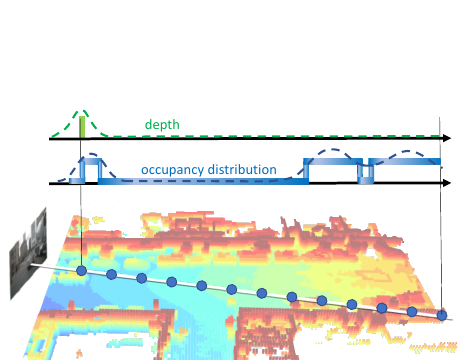
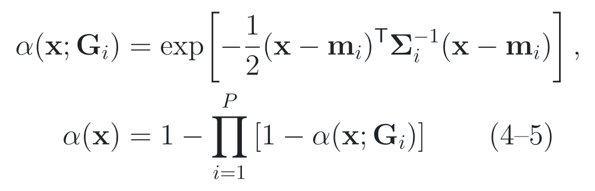
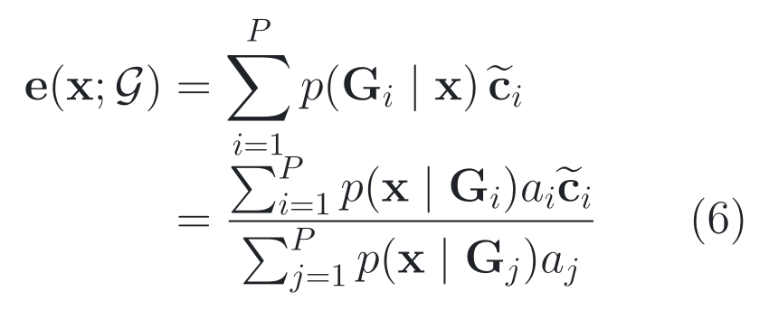
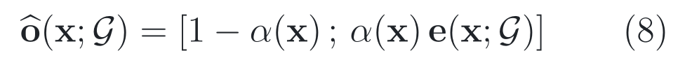
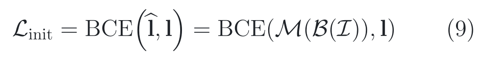
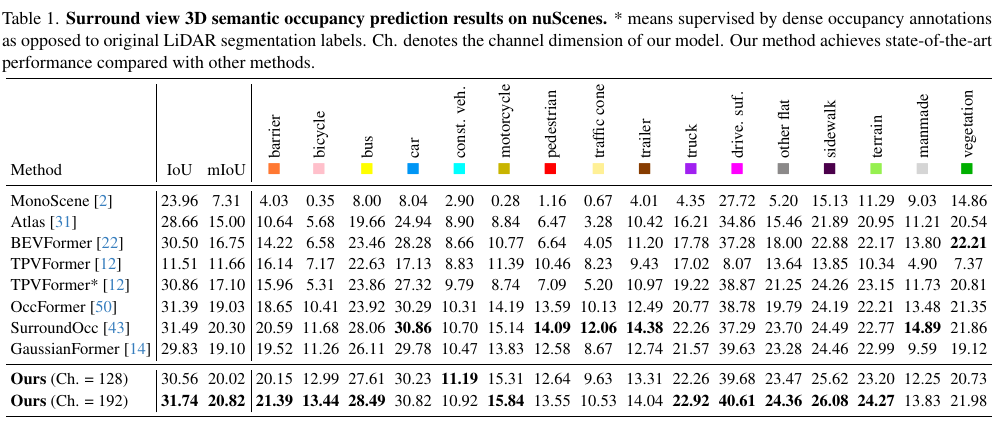
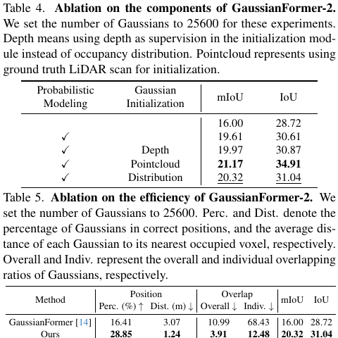

# 2026-08-13 — GaussianFormer-2: Probabilistic Gaussian Superposition for Efficient 3D Occupancy Prediction

`CVPR 2025` · `Accepted` · `论文与补充材料已读 / 官方源码已审 / Checkpoint 未运行`

**主方向：** P04 · Occupancy 与 4D 场景理解 ·
**输入模态：** Surround Camera · Monocular Camera ·
**交叉标签：** 3D Semantic Occupancy、3D Gaussian Representation、Probabilistic Modeling、Sparse Representation、Gaussian Mixture、Distribution-Based Initialization、Efficient Inference、Camera Calibration

[▶ 从第一张图开始](#1-看图论文到底做了什么) ·
[返回首页](../../README.md) · [全部精读](../../index/papers.md) ·
[官方论文](https://openaccess.thecvf.com/content/CVPR2025/papers/Huang_GaussianFormer-2_Probabilistic_Gaussian_Superposition_for_Efficient_3D_Occupancy_Prediction_CVPR_2025_paper.pdf) ·
[官方代码 @ b7e22bfc04cd6360cdee74be5af7fdace102f0a3](https://github.com/huang-yh/GaussianFormer/tree/b7e22bfc04cd6360cdee74be5af7fdace102f0a3)

证据与行文标签：**[原文翻译]** 忠实中文译文；**[笔记解释]** 帮助理解的通俗讲解；**[论文]** 作者材料直接支持；**[源码]** 固定 commit 直接支持；**[判断]** 本笔记分析；**[未核验]** 尚未独立运行或确认。译文中不混入解释或判断。

## 0. 阅读起点：术语先导与摘要完整翻译

### 0.1 首次术语解释

**术语覆盖声明：** 摘要中的核心专业术语先在这里解释；摘要后首次出现的新术语仍在正文就地解释，后文锁定同一中文名、英文名、缩写与语义。

- **三维语义占据预测（3D Semantic Occupancy Prediction）**：把车辆周围规则三维体素分别判断为空或某个语义类别；本文输入是相机图像，输出不是检测框而是稠密体素标签。
- **三维语义高斯（3D Semantic Gaussian）**：以三维中心、尺度、旋转、存在强度与语义向量描述局部空间的可形变椭球原语；它比逐体素保存特征更稀疏。
- **概率高斯叠加（Probabilistic Gaussian Superposition）**：GaussianFormer-2 的核心读出，把多个高斯对“此处被占据”的局部证据按概率并集组合，并把语义按高斯混合模型归一化。
- **高斯混合模型（Gaussian Mixture Model, GMM）**：用若干高斯分布及其权重表示混合分布；本文用它计算某点属于各高斯的后验权重，再对语义向量求条件期望。
- **分布式初始化（Distribution-Based Initialization）**：不把每个像素只压成一个表面深度，而是学习沿相机射线的占据分布，再从该分布采样高斯中心。
- **空间稀疏性（Spatial Sparsity）**：道路场景的大多数体素为空；稠密网格仍对空体素计算，稀疏原语则试图只在可能占据处投入表示容量。
- **nuScenes、KITTI-360 与 SurroundOcc**：前两者是自动驾驶数据集；SurroundOcc 是在 nuScenes 上构建的稠密三维占据标注与协议。数据集名保留原名。
- **并交比（Intersection over Union, IoU）与平均并交比（mean IoU, mIoU）**：IoU 衡量占据几何的集合重合；mIoU 对语义类别 IoU 求平均。mIoU 不是所有体素的总体 accuracy，也不直接等于闭环驾驶安全。

### 0.2 摘要完整专业中文翻译

**原文锚点：** Abstract，PDF p. 1 / proceedings p. 27477。

> **[原文翻译] Abstract · PDF p. 1 · A01**
>
> 三维语义占据预测因其在自动驾驶系统感知周围环境方面的鲁棒性，以及其提供细粒度几何和语义信息的能力，已经获得了广泛关注。大多数现有方法采用稠密网格表示，并忽略了三维场景中固有的空间稀疏性，从而造成显著的计算冗余。最近，三维语义高斯已被提出作为一种稀疏的替代方案；然而，它们仍然使用大量高斯来描述空区域。为解决这些问题，我们提出概率高斯叠加：将每个高斯解释为其邻域被占据的概率，并用概率乘法聚合不同高斯，由此表征场景的整体几何。对于语义，我们采用精确的高斯混合模型，避免高斯之间不必要的重叠。我们还设计了分布式初始化模块，使高斯能够围绕被占据区域有效初始化。与仅学习表面深度不同，我们的初始化学习与像素对齐的占据分布，从而提供更全面的几何先验。在 nuScenes 与 KITTI-360 数据集上的大量实验表明，我们的方法以高效率取得了最先进的性能。

**完整性声明：** 上述 A01 按官方 PDF 摘要唯一实质段落逐句完整翻译，保留了比较、因果、范围和数据集限定；无抽取不清或删减内容。

> [!TIP]
> **[笔记解释] 读完摘要再看这一句：** 它把“多个高斯贡献直接相加”改成“多个局部存在事件的有界并集”，最强受控证据是同预算下概率建模带来 3.61 mIoU 绝对点提升；边界是独立性与概率校准只是模型假设，checkpoint 尚未在本仓库运行。

### 0.3 为什么今天值得读

**新近性与录用：** **[论文]** 本文是 2025 年 CVPR 正式录用（Accepted）论文，由 [CVPR 2025 官方 proceedings](https://openaccess.thecvf.com/content/CVPR2025/html/Huang_GaussianFormer-2_Probabilistic_Gaussian_Superposition_for_Efficient_3D_Occupancy_Prediction_CVPR_2025_paper.html) 核验，处在本轮优先检查的最近 24 个月正式顶会窗口内。

**影响与社区信号：** **[判断]** 截至 2026-08-13，Semantic Scholar API 记录 90 次引用、其中 19 次 influential citation；[官方 GitHub](https://github.com/huang-yh/GaussianFormer) 记录约 680 stars、62 forks。它们是时间归一化采用与注意力信号，不证明公式正确、代码可复现或道路安全。

**作者与团队脉络：** **[论文/判断]** [官方论文 affiliation](https://openaccess.thecvf.com/content/CVPR2025/html/Huang_GaussianFormer-2_Probabilistic_Gaussian_Superposition_for_Efficient_3D_Occupancy_Prediction_CVPR_2025_paper.html) 为清华大学自动化系与 Phigent Robotics；作者线索还连接 GaussianFormer、GaussianWorld 等高斯 Occupancy 工作。连续贡献帮助定位研究脉络，但机构名望、团队声誉和引用不能替代方法质量、受控证据与源码完整度。

**覆盖与研究价值：** **[判断]** 仓库 13 个主方向已覆盖；P04 上次精读为 2026-07-24，是当前最长时间未读且存在高质量候选的方向。本文值得读的不是“又一个高斯模型”，而是它明确拆开几何并集、语义归一化与初始化三种职责，便于判断效率究竟来自表示、读出还是查询落点。

**候选对照：** **[判断]** 同轮强候选 [Fully Sparse 3D Occupancy Prediction（SparseOcc，ECCV 2024）](https://www.ecva.net/papers/eccv_2024/papers_ECCV/papers/03570.pdf) 在稀疏查询与 RayIoU 上更强，也有 Apache-2.0 官方源码；今天先读 GaussianFormer-2，因为它更新、概率机制和组件消融更清晰，且更适合提炼独立 Taste。许可证缺口已在排序中扣分，轮换没有压过质量门槛。综合评分 9.6/10。

### 0.4 问题背景与前置工作

**30 秒问题背景：** **[笔记解释]** 想象六个相机看见前车、护栏和远处行人：稠密体素法像把整座立体停车场每个格子都派一名检查员，即使绝大多数格子是空气；旧高斯法虽只派少量巡检员，却允许多人把同一处“占据分数”不断相加，容易鼓励椭球重叠。重叠和初始化偏到物体表面会继续传给体素语义输出。这个故事只建立计算与表示直觉，不是真实道路安全证据。

**任务与评价对象：** **[论文]** 六路相机图像与标定 → 车体坐标中的三维语义高斯 → 固定体素网格的空类/语义类概率 → 按数据集协议计算占据 IoU 与类别 mIoU（论文 §3.1、§4.1，PDF pp. 3、5）。mIoU 对类别平均，不等于总体 accuracy；离线体素重合更不等于规划闭环安全。

**关键前置算法：** **[论文/笔记解释]** 理解本文不可跳过三件事。第一，**稠密体素 Occupancy** 直接预测每个三维格点，接口清楚但空区域计算多。第二，**可变形注意力（Deformable Attention）** 只从投影后的少数图像位置给高斯查询取特征，本文沿用它迭代更新原语。第三，**GaussianFormer** 用可学习三维高斯代替密集网格，却把带语义的高斯贡献直接相加，几何与语义未分责，仍会分配大量空类高斯。

**相关论文路线：**

- **[GaussianFormer](https://openaccess.thecvf.com/content/ECCV2024/html/Huang_GaussianFormer_Scene_as_Gaussians_for_Vision-Based_3D_Semantic_Occupancy_Prediction_ECCV_2024_paper.html) → 本文：** 前者提供 image backbone、稀疏高斯查询、迭代 encoder/refinement 与体素读出；本文替换初始化和最终聚合，但继承的 encoder 能力不是新贡献。前者仍不能解释为什么重叠原语的占据值应无界相加。
- **[SparseOcc](https://www.ecva.net/papers/eccv_2024/papers_ECCV/papers/03570.pdf) ↔ 本文：** 两者都利用空空间稀疏性；SparseOcc 保留稀疏 query 和 mask-guided sampling，GaussianFormer-2 让每个 query 成为有空间尺度的概率高斯。两者的标签、读出和效率协议不同，不能仅凭一个 mIoU 数字排总榜。
- **[SurroundOcc](https://openaccess.thecvf.com/content/ICCV2023/html/Wei_SurroundOcc_Multi-Camera_3D_Occupancy_Prediction_for_Autonomous_Driving_ICCV_2023_paper.html) → 本文：** 前者提供 nuScenes 密集标注与强稠密 baseline；本文采用其协议，却没有改变标注覆盖或把离线验证扩展到闭环。

**本文接在哪里：** **[判断]** 现有路线已经有“图像 → 稀疏高斯 → Occupancy”的主链；卡点是原语仍覆盖空区、重叠贡献无界且初始化只看表面。本文只改变高斯落点与读出解释；ResNet/FPN、投影采样、迭代 refinement 和数据协议均属继承。时序一致性、概率校准及闭环影响仍未由本文解决。

**资料使用边界：** **[判断]** 论文解析、社区列表、视频和搜索引擎只用于候选召回与讲解顺序，不作为录用、方法、数字或实现行为的最终证据；所有事实回到原论文、CVF 官方 proceedings、补充材料、官方 benchmark、作者项目页与完整 40 位 commit 固定源码。

**学习顺序：** [0 摘要与术语](#0-阅读起点术语先导与摘要完整翻译) → [1 看原图](#1-看图论文到底做了什么) → [2 读原式](#2-读公式核心机制怎样表达) → [3 看结果](#3-看结果证据是否支持主张) → [4 对源码](#4-对源码公式如何落地) → [5 记结论](#5-记结论贡献边界与开放问题)

## 1. 看图：论文到底做了什么

> **原图出处：** Huang et al., CVPR 2025, Figure 3, PDF p. 3。[官方 PDF](https://openaccess.thecvf.com/content/CVPR2025/papers/Huang_GaussianFormer-2_Probabilistic_Gaussian_Superposition_for_Efficient_3D_Occupancy_Prediction_CVPR_2025_paper.pdf)。仅作学术讲解所需的局部摘录，原图版权归原作者及其他权利人。

### 这张图按什么顺序看

1. 从底部六路图像进入 Image Encoder；
2. 分布式初始化先决定高斯中心大致落在哪里，GS Encoder 再迭代更新；
3. 顶部概率建模把 geometry 与 semantics 分开：几何用“至少一个高斯覆盖”的并集，语义用归一化混合；
4. 两者最后组成空类与各语义类的体素概率。

**看完应能复述：** 图像不是直接生成稠密体素，而是先生成少量可形变高斯，再把“是否占据”与“占据后是什么类别”分别估计。

**这张图没有证明：** 方法图只说明结构，不证明概率值已校准、模块一定加速、时序稳定或相机输入足以支持道路安全。

### 整体算法架构与创新设计

**原方法瓶颈：** **[论文]** GaussianFormer 的每个高斯同时给空类和语义类加分，多个原语的贡献直接相加；作者指出这让占据值无上界、鼓励高斯重叠，并继续用大量高斯描述空区。仅从深度初始化又只看到物体表面，不能给完整占据体提供先验。来源：论文 §1、§3.1，PDF pp. 1、3–4。

**主干网络与基线：** **[论文/源码]** 直接 baseline 是 GaussianFormer。nuScenes 默认图像主干为预训练 FCOS3D 的 ResNet-101-DCN，接 FPN；高斯 encoder 由四个 refinement block 组成，最终 GaussianHead 在 200×200×16、0.5 m 体素网格上读出 17 个语义类加空类。来源：论文 §4.1，PDF p. 5；[固定 SHA 配置](https://github.com/huang-yh/GaussianFormer/blob/b7e22bfc04cd6360cdee74be5af7fdace102f0a3/config/prob/nuscenes_gs12800.py)。

**继承与新增边界：** **[论文/源码]** 继承项是图像 backbone/FPN、GaussianFormer 的 deformable image cross-attention、稀疏卷积、FFN 和逐块 Gaussian refinement；本文新增或替换的是分布式初始化、几何概率并集、归一化语义 GMM 和二者的最终组合。用于 KITTI-360 的 ResNet-50 只是迁移实验替代 backbone，不是论文原创。来源：论文 Figure 3、§3，PDF pp. 3–5；[固定 SHA encoder](https://github.com/huang-yh/GaussianFormer/blob/b7e22bfc04cd6360cdee74be5af7fdace102f0a3/model/encoder/gaussianformer/encoder.py)。

**端到端信息流：** **[论文/源码]** 当前帧六路 RGB 与内外参 → ResNet-101-DCN/FPN 多尺度图像特征 → 每像素 128 个深度 bin 加一个“禁用”bin 的射线分布 → 从分布采样 6,400 个中心并与 6,400 个自由可学习中心拼成 12,800 个高斯 → 四轮 cross-attention、FFN、稀疏卷积与 refinement → 每个高斯输出车体坐标中心、三轴尺度、四元数旋转、opacity 与 17 维语义 logits → 在 200×200×16 体素中心计算几何并集与条件语义 → 输出 18 类概率。本文没有跨帧 prediction-relevant state，序列 reset 不参与推理。来源：论文 Figure 3、§3，PDF p. 3；[固定 SHA 配置](https://github.com/huang-yh/GaussianFormer/blob/b7e22bfc04cd6360cdee74be5af7fdace102f0a3/config/prob/nuscenes_gs12800.py)。

**总体训练方式：** **[论文/源码]** 论文只共同描述初始化 BCE 与最终 occupancy loss，没有公开阶段顺序；固定配置实际上加载 `out/prob/init/init.pth`，冻结 lifter/initializer，只重新开放自由 anchors，然后训练 Gaussian encoder/head。最终 decoder 输出承受权重 10 的交叉熵与权重 1 的 Lovász loss；冻结的初始化网络在主训练中不会从配置中的 PixelDistributionLoss 获得梯度。训练和推理都只见当前图像，没有 teacher forcing；固定仓库未公开生成 `init.pth` 的完整训练配置/脚本。来源：论文 Eq. (9)、§3.3、§4.1，PDF pp. 5–6；[固定 SHA model config](https://github.com/huang-yh/GaussianFormer/blob/b7e22bfc04cd6360cdee74be5af7fdace102f0a3/config/prob/nuscenes_gs12800.py)。

#### 创新模块 1：Distribution-Based Initialization

**位置与接口：** 位于图像输入与 Gaussian encoder 之间，替换 GaussianFormer 的纯自由查询/深度表面初始化；输出中心作为后续高斯状态的起点。

**输入：** 六路相机图像、内外参、图像尺寸与训练时射线上的 Occupancy 标签；固定实现把 1–72 m 划成 128 个深度 bin，并增加一个不采样的禁用 bin。

**内部变换：** 独立 ResNet/FPN 预测每像素深度分布 → softmax → 按非空分布随机采一个射线深度 → 反投影到三维车体坐标 → farthest-point sampling 保留预算内中心 → 与自由可学习 anchors 拼接。

**输出：** nuScenes 12,800 配置产生 6,400 个分布采样中心和 6,400 个自由中心，后续 refinement 再更新位置、尺度、旋转、opacity 与语义。

**为什么这样设计：** **[论文] 作者明确动机：** 深度监督只给最近表面，而 Occupancy 分布可沿射线描述完整被占据区域，从而为高斯提供更全面的几何先验；来源：论文 §3.3、Figure 4，PDF p. 4–5。

**训练信号：** **[论文/源码]** 论文 Eq. (9) 用射线 Occupancy 分布的 BCE 训练初始化器。固定主配置加载单独 `init.pth` 后冻结 lifter，所以主训练 Occupancy loss 不直接更新该网络；自由 anchors 仍可学习。源码未公开初始化阶段的完整运行配方。来源：论文 Eq. (9)、§3.3，PDF p. 5；[固定 SHA 配置](https://github.com/huang-yh/GaussianFormer/blob/b7e22bfc04cd6360cdee74be5af7fdace102f0a3/config/prob/nuscenes_gs12800.py)。

**作用与证据：** **[论文]** Table 4 的受控比较在 25,600 个高斯和概率建模固定时，以 Distribution 替换 Depth 初始化：mIoU 19.97→20.32，绝对 +0.35 点、相对约 +1.75%；IoU 30.87→31.04，+0.17 点。Pointcloud 上界达 21.17/34.91，但它使用训练时真值 LiDAR scan，不能作为 camera-only 可部署输入。来源：论文 Table 4，PDF p. 7。

**论文位置：** **[论文]** Figure 4、Eq. (9)、§3.3，PDF pp. 4–5。

**源码入口：** **[源码]** [Distribution lifter @ 固定 SHA](https://github.com/huang-yh/GaussianFormer/blob/b7e22bfc04cd6360cdee74be5af7fdace102f0a3/model/lifter/gaussian_new_lifter.py)；[12,800 配置 @ 固定 SHA](https://github.com/huang-yh/GaussianFormer/blob/b7e22bfc04cd6360cdee74be5af7fdace102f0a3/config/prob/nuscenes_gs12800.py)。

#### 创新模块 2：Iterative Gaussian Encoder

**位置与接口：** 位于初始化中心与概率 readout 之间；它沿用 GaussianFormer 主干，只是消费新的初始 anchors，并把 refined Gaussians 交给新 head。

**输入：** 多尺度 FPN 图像特征、投影矩阵、图像尺寸，以及每个高斯的中心、尺度、旋转、opacity 与语义状态。

**内部变换：** 每个 block 依次执行 deformable cross-attention → 残差与归一化 → FFN → 残差与归一化 → 稀疏卷积 → 残差与归一化 → 第二个 FFN → 残差与归一化 → refinement。次序来自固定 encoder operation order。

**输出：** 四轮更新后的三维高斯集合；refinement 将位置增量限制在每轴约 4 m、4 m、1 m，尺度约束在 0.01–2.5 m，并归一化四元数。

**为什么这样设计：** **[判断] 笔记因果重建：** 这是本笔记根据前述瓶颈与论文结构所做的因果重建，不是作者原句。初始化只给粗落点，仍需从图像取证并反复修正原语；沿用已验证 encoder 可把论文变量控制集中在初始化与读出。

**训练信号：** **[论文/源码]** 固定配置只监督最终 decoder 输出的 occupancy CE 与 Lovász；早期 block 经共享参数和后续计算收到间接梯度，没有独立 per-layer loss。离散 tile 半径用 detach 后的 scale 计算，但 covariance/readout 路径仍可导。来源：[固定 SHA encoder/config](https://github.com/huang-yh/GaussianFormer/blob/b7e22bfc04cd6360cdee74be5af7fdace102f0a3/config/prob/nuscenes_gs12800.py)。

**作用与证据：** **[未核验]** 原文未提供该继承 encoder 的独立消融或受控对照，因此不能把整套系统增益单独归因给它。

**论文位置：** **[论文]** Figure 3、§3，PDF p. 3；具体 operation order 仅在固定源码公开。

**源码入口：** **[源码]** [encoder operation order @ 固定 SHA](https://github.com/huang-yh/GaussianFormer/blob/b7e22bfc04cd6360cdee74be5af7fdace102f0a3/model/encoder/gaussianformer/encoder.py)；[refinement @ 固定 SHA](https://github.com/huang-yh/GaussianFormer/blob/b7e22bfc04cd6360cdee74be5af7fdace102f0a3/model/encoder/gaussianformer/refinement.py)。

#### 创新模块 3：Probabilistic Geometry and Semantic Readout

**位置与接口：** 位于 refined Gaussians 与最终体素 logits 之间，替换原 GaussianFormer 的可加贡献；几何与语义先分开，再组合成空类加 17 个语义类。

**输入：** 每个体素中心，以及每个高斯的中心、逆协方差、opacity 和 softmax 后语义向量；CUDA kernel 只访问落在局部 tile 邻域的高斯。

**内部变换：** 先算 Mahalanobis 距离形成局部占据概率 → 对所有覆盖原语算“至少一个成立”的乘法并集 → 用带 determinant、opacity 和语义的归一化 GMM 求条件类别期望 → 用几何概率给语义加权，并把其补集作为空类。

**输出：** 200×200×16×18 的 Occupancy 概率体，交给 loss 或 argmax evaluator；当前帧结束后不写回时序状态。

**为什么这样设计：** **[论文] 作者明确动机：** 有界并集避免重叠高斯把几何贡献无界相加；条件语义混合避免语义重叠，并让类别概率归一化。来源：论文 §3.2、Eq. (4)–(8)，PDF p. 4。

**训练信号：** **[论文/源码]** 最终体素 CE 与 Lovász 直接训练 readout 上游可学习高斯；opacity 进入语义混合权重，却不进入固定实现的几何并集。tile/radius 离散选择的 detach 会阻断该索引选择本身的梯度，但保留入选高斯连续 covariance/semantic 路径。来源：论文 §3.2，PDF p. 4；[固定 SHA head](https://github.com/huang-yh/GaussianFormer/blob/b7e22bfc04cd6360cdee74be5af7fdace102f0a3/model/head/gaussian_head.py)。

**作用与证据：** **[论文]** Table 4 的受控消融在 25,600 高斯、其他设置相同时从无到有加入 Probabilistic Modeling：mIoU 16.00→19.61，绝对 +3.61 点、相对约 +22.56%；IoU 28.72→30.61，+1.89 点。Supplement Table 2 还显示只归一化语义从 16.00 到 18.90，完整概率形式到 20.32，因此增益不能全归给几何并集单一算子。来源：论文 Table 4，PDF p. 7；Supplement Table 2，Supplement PDF p. 1。

**论文位置：** **[论文]** Figure 3、Eq. (4)–(8)、Table 4、§3.2，PDF p. 4。

**源码入口：** **[源码]** [GaussianHead @ 固定 SHA](https://github.com/huang-yh/GaussianFormer/blob/b7e22bfc04cd6360cdee74be5af7fdace102f0a3/model/head/gaussian_head.py)；[probabilistic CUDA wrapper @ 固定 SHA](https://github.com/huang-yh/GaussianFormer/blob/b7e22bfc04cd6360cdee74be5af7fdace102f0a3/ops/localaggprob/local_aggregate_prob.py)。

> **原图出处：** Huang et al., CVPR 2025, Figure 4, PDF p. 4。[官方 PDF](https://openaccess.thecvf.com/content/CVPR2025/papers/Huang_GaussianFormer-2_Probabilistic_Gaussian_Superposition_for_Efficient_3D_Occupancy_Prediction_CVPR_2025_paper.pdf)。仅作学术讲解所需的局部摘录，原图版权归原作者及其他权利人。

**小数字教学例子：** **[笔记解释]** 假设一个像素沿射线三个 bin 的占据概率为 0.1、0.6、0.3；深度回归会压成一个位置，分布采样却可能在后两个体积区分别放入高斯。这个数字只是手算故事，不是论文实验，也不说明采样方差一定更小。

## 2. 读公式：核心机制怎样表达

**变量身份图例：** **[领域惯用]** 表示语义角色在本领域常见，但不表示所有论文都使用同一个字母；**[本文定义]** 表示论文给该符号赋予了本文特定含义；**[源码/笔记重排]** 表示固定源码等价式或本笔记计算新增的符号。

### 原文公式 1：局部占据概率与概率并集

**原文公式：** 论文 Eq. (4)–(5)，PDF p. 4。

<picture><source media="(prefers-color-scheme: dark)" srcset="../../assets/notes/2026-08-13-gaussianformer-2/formulas/eq-01-probabilistic-union-dark.png"></picture>

> **公式来源：** Huang et al., CVPR 2025, Eq. (4)–(5)，PDF p. 4；本图按原符号合并重排。[官方 PDF](https://openaccess.thecvf.com/content/CVPR2025/papers/Huang_GaussianFormer-2_Probabilistic_Gaussian_Superposition_for_Efficient_3D_Occupancy_Prediction_CVPR_2025_paper.pdf) · [可复制 TeX](../../assets/notes/2026-08-13-gaussianformer-2/formulas/source.tex#L4-L13)

**先建立画面：** **[笔记解释]** 车旁一个三维点被几个椭球“巡检员”同时看到：先让每名巡检员给出自己覆盖该点的概率，再算“不是所有人都说空”，就得到至少一人认为占据的概率。

**变量逐项解释与身份：** **[领域惯用]** exp 是指数函数，Π 是连乘，*i* 是原语索引，这些角色常见但字母不强制。**[本文定义]** **x** 是车体坐标中的查询体素中心，单位米；**G***i* 是第 *i* 个高斯，**m***i* 是其三维中心；**Σ***i* 是 3×3 协方差，逆矩阵定义椭球距离；*P* 是原语总数；α(**x**;**G***i*) 与 α(**x**) 都在 0–1。中心、尺度和旋转可学习，查询点和 *P* 不可学习。本式不使用 opacity *a**i*。

**变量变化会怎样：** 在其他量暂时不变时，**x** 越接近 **m***i*，局部 α 越接近 1；某个局部 α 置零就退出并集，置一会让整体 α 为 1；增加重复且相关的高概率原语会进一步抬高并集。协方差与中心同时变化时存在耦合，不能只看一个尺度判断所有方向的概率。

**纯文字读法：** 先用查询点到每个高斯中心的协方差归一化距离计算局部占据概率；再把每个“不被该高斯占据”的概率相乘，最后用一减去该乘积，得到至少一个高斯覆盖该点的概率。

**教学小例子：** **[笔记解释]** 这是教学示例，不是论文实验。路边点被两个高斯分别给 0.6 和 0.5 的局部概率，整体并集为 1−(1−0.6)×(1−0.5)=0.8；直接相加会得到 1.1，已经不是概率。

**专业解释：** **[判断]** 该 noisy-OR 形式天然有界，但把各高斯占据事件视作条件独立。相邻高斯通常由同一图像和同一 loss 学出，独立性并非已验证事实；有界不等于已校准。

**原图对应：** Figure 3 中 geometry 下排的 prob. exclusion。

**固定源码映射：** **[源码]** CUDA 实现先计算 `power = exp(-0.5 * Mahalanobis)`，再累计补事件乘积；见 [local aggregate prob @ 固定 SHA](https://github.com/huang-yh/GaussianFormer/tree/b7e22bfc04cd6360cdee74be5af7fdace102f0a3/ops/localaggprob)。

**公式省略的实现细节：** tile culling、离散半径、数值下溢、相关原语和空 tile 都不在论文式中；固定实现的几何分支也没有把 opacity 乘进 α。

### 原文公式 2：条件语义的高斯混合

**原文公式：** 论文 Eq. (6)，PDF p. 4。

<picture><source media="(prefers-color-scheme: dark)" srcset="../../assets/notes/2026-08-13-gaussianformer-2/formulas/eq-02-semantic-mixture-dark.png"></picture>

> **公式来源：** Huang et al., CVPR 2025, Eq. (6)，PDF p. 4；本图按原符号重排。[官方 PDF](https://openaccess.thecvf.com/content/CVPR2025/papers/Huang_GaussianFormer-2_Probabilistic_Gaussian_Superposition_for_Efficient_3D_Occupancy_Prediction_CVPR_2025_paper.pdf) · [可复制 TeX](../../assets/notes/2026-08-13-gaussianformer-2/formulas/source.tex#L15-L23)

**先建立画面：** **[笔记解释]** 几个高斯都覆盖前车边缘时，不把“车、路面、护栏”的分数无限叠起来，而像按距离与可信权重分配发言权，再对类别意见求加权平均。

**变量逐项解释与身份：** **[领域惯用]** Σ 表示求和，竖线表示条件关系，*i*/*j* 是混合分量索引，字母不强制。**[本文定义]** 𝒢 是 *P* 个高斯的集合；**e**(**x**;𝒢) 是给定该点占据后的 17 维语义期望；*p*(**G***i*|**x**) 是后验混合权重；*p*(**x**|**G***i*) 是包含 determinant 归一项的三维高斯密度，单位随空间密度而定；*a**i* 是 0–1 opacity；**c̃***i* 是 softmax 后 17 维语义向量。opacity、语义、中心与协方差来自可学习状态。

**变量变化会怎样：** 在其他量暂时不变时，提高某高斯的密度或 opacity 会提高它的归一化发言权；某个 *a*=0 时它不贡献语义；所有分母权重同时趋零时数值需要实现保护。权重归一化使所有分量耦合，单个权重变大不保证某一类别一定增大，还取决于其语义向量相对平均值。

**纯文字读法：** 对每个高斯，用查询点在该高斯下的空间密度乘 opacity 作为权重；用所有权重之和归一化，再把每个高斯的类别概率向量加权平均。

**教学小例子：** **[笔记解释]** 这是教学示例，不是论文实验。两个高斯的有效权重为 2 和 1，车类概率为 0.9 和 0.3，则混合后的车类概率为 (2×0.9+1×0.3)/3=0.7，而不是 1.2。

**专业解释：** **[论文/判断]** 这是“已占据条件下是什么类别”，不是几何占据概率。分开建模避免空类和语义类共用可加分数；但 opacity 的概率语义和校准仍未由 reliability diagram 或 ECE 验证。

**原图对应：** Figure 3 右侧 semantics 的归一化混合示意。

**固定源码映射：** **[源码]** 固定 CUDA kernel 用密度 determinant、指数项、opacity 与 softmax 语义累计分子和分母；见 [localaggprob @ 固定 SHA](https://github.com/huang-yh/GaussianFormer/tree/b7e22bfc04cd6360cdee74be5af7fdace102f0a3/ops/localaggprob)。

**公式省略的实现细节：** 论文式未写 tile 筛选、极小分母保护、半精度/单精度选择和反向 kernel；本仓库仅静态审计，没有数值追踪 CUDA backward。

### 原文公式 3：把空类与语义类重新合并

**原文公式：** 论文 Eq. (8)，PDF p. 4。

<picture><source media="(prefers-color-scheme: dark)" srcset="../../assets/notes/2026-08-13-gaussianformer-2/formulas/eq-03-final-occupancy-dark.png"></picture>

> **公式来源：** Huang et al., CVPR 2025, Eq. (8)，PDF p. 4；本图按原符号重排。[官方 PDF](https://openaccess.thecvf.com/content/CVPR2025/papers/Huang_GaussianFormer-2_Probabilistic_Gaussian_Superposition_for_Efficient_3D_Occupancy_Prediction_CVPR_2025_paper.pdf) · [可复制 TeX](../../assets/notes/2026-08-13-gaussianformer-2/formulas/source.tex#L25-L30)

**先建立画面：** **[笔记解释]** 先回答体素“有没有东西”，再在“有东西”的份额里分配车、行人、路面等类别；空类拿走剩余份额，避免同一个打分器同时扮演存在判断和分类器。

**变量逐项解释与身份：** **[本文定义]** **ô**(**x**;𝒢) 是 18 维最终 Occupancy 概率；分号表示把一个空类标量和 17 维语义向量拼接；α(**x**) 是 0–1 几何占据概率；**e**(**x**;𝒢) 是和为 1 的条件语义向量；1−α 是空类概率。上述量由前两式计算，本式无独立可学习参数。

**变量变化会怎样：** 在 **e** 暂时不变时，α 增大就线性降低空类并同比提高所有语义类总质量；α=0 时完全为空，α=1 时完全由 **e** 分配。真实模型中 α 和 **e** 共享高斯参数，联合训练时不能假定二者独立变化。

**纯文字读法：** 用一减去占据概率作为空类；再把占据概率乘以“已占据条件下”的每个语义类别概率；把两部分拼成最终类别分布。

**教学小例子：** **[笔记解释]** 这是教学示例，不是论文实验。某点 α=0.8，条件车/路面概率为 0.75/0.25，则最终空/车/路面为 0.2/0.6/0.2，总和为 1。

**专业解释：** 分解对应概率链式法则：类别质量不能超过几何占据质量。它改善概率形式的一致性，但并不证明类别频率已校准。

**原图对应：** Figure 3 顶部 Prob. Modeling 输出的几何和语义汇合。

**固定源码映射：** **[源码]** GaussianHead 在 kernel 返回语义条件分布与 geometry 后构造 empty 和 semantic 通道；见 [GaussianHead @ 固定 SHA](https://github.com/huang-yh/GaussianFormer/blob/b7e22bfc04cd6360cdee74be5af7fdace102f0a3/model/head/gaussian_head.py)。

**公式省略的实现细节：** 最终训练使用 CE 与 Lovász，不直接用校准 loss；argmax、ignore label 与 evaluator 累计逻辑也不在本式中。

### 原文公式 4：分布式初始化监督

**原文公式：** 论文 Eq. (9)，PDF p. 5。

<picture><source media="(prefers-color-scheme: dark)" srcset="../../assets/notes/2026-08-13-gaussianformer-2/formulas/eq-04-initialization-loss-dark.png"></picture>

> **公式来源：** Huang et al., CVPR 2025, Eq. (9)，PDF p. 5；本图按原符号重排。[官方 PDF](https://openaccess.thecvf.com/content/CVPR2025/papers/Huang_GaussianFormer-2_Probabilistic_Gaussian_Superposition_for_Efficient_3D_Occupancy_Prediction_CVPR_2025_paper.pdf) · [可复制 TeX](../../assets/notes/2026-08-13-gaussianformer-2/formulas/source.tex#L32-L37)

**先建立画面：** **[笔记解释]** 每个像素不只报一个“最近深度”，而是在射线上摆一列小格子，逐格学习哪里可能被占据；BCE 像逐格核对预测与三维标签。

**变量逐项解释与身份：** **[领域惯用]** 𝓛 表示损失、BCE 是二元交叉熵，符号字母不强制。**[本文定义]** 𝓘 是多相机图像；𝓑 是 image backbone；𝓜 把图像特征映射成像素对齐射线分布；**l̂** 是预测分布；**l** 是由 Occupancy annotation 投影/采样得到的监督。固定实现为每像素 128 个有效深度 bin 加 1 个禁用 bin；网络参数可学习，标签与 bin 边界不可学习。

**变量变化会怎样：** 在标签与其他预测暂时不变时，正确 bin 的预测概率靠近 1、空 bin 靠近 0 会降低 BCE；把某 bin mask 掉则不应产生梯度。softmax 使 bins 竞争，调高一个 logit 会压低其余项；不能逐 bin 独立判断最终三维采样位置。

**纯文字读法：** 先用图像 backbone 和分布映射器为每个像素预测沿射线的占据分布，再把该预测与从三维 Occupancy 标签得到的射线标签逐项计算二元交叉熵。

**教学小例子：** **[笔记解释]** 这是教学示例，不是论文实验。三个 bin 的标签为 0、1、0，预测为 0.1、0.7、0.2；BCE 会奖励中间 bin 变大并惩罚两侧假阳性，之后从分布采样而不是直接把 0.7 当论文精度。

**专业解释：** **[论文/源码]** 论文把它写成联合方法的一部分；固定发布配方却先加载并冻结 initializer，因此该 loss 的真实阶段所有权必须与主 occupancy 训练分开。

**原图对应：** Figure 4 的蓝色 occupancy distribution 与沿射线采样点。

**固定源码映射：** **[源码]** [PixelDistributionLoss @ 固定 SHA](https://github.com/huang-yh/GaussianFormer/blob/b7e22bfc04cd6360cdee74be5af7fdace102f0a3/loss/pixel_distribution_loss.py) 与 [frozen lifter 配置](https://github.com/huang-yh/GaussianFormer/blob/b7e22bfc04cd6360cdee74be5af7fdace102f0a3/config/prob/nuscenes_gs12800.py)。

**公式省略的实现细节：** 论文未公开初始化阶段优化器、epoch、随机种子、checkpoint 选择和运行入口；主配置虽仍列该 loss，但冻结参数使其不能直接训练 initializer。

## 3. 看结果：证据是否支持主张

### 3.0 数据集与实验设计总览

**数据集与任务：** **[论文]** nuScenes v1.0 共 1,000 个 20 秒场景，官方 700/150/150 train/val/test；本文按 SurroundOcc 稠密标注，在 val 评测 200×200×16 网格、16 个语义类加 empty/noise。KITTI-360 超过 320k 图像；按 SSCBench 使用 7/1/1 train/val/test 序列，8,487/1,812/2,566 keyframes，在车前 51.2×51.2×6.4 m、256×256×32 网格上评测 18 个语义类加 empty。test 状态明确为未用于本文表格，隐藏 test 标签与每类实例规模原文未公开。来源：论文 §4.1，PDF p. 5。

**传感器与输入：** **[论文/源码]** nuScenes 数据本身含相机、LiDAR、radar、IMU，但模型只输入六路 surround cameras；论文写 900×1600，固定配置读源高 900、宽 1600，再设 network input shape 为 1600×864。KITTI-360 只输入左侧前视相机，376×1408。坐标输出在 ego/vehicle 三维范围内；图像翻转与 photometric distortion 均公开。

**实验分组：** 主 benchmark 为 nuScenes/SurroundOcc Table 1 与 KITTI-360 Table 2；效率/部署比较为 Table 3；模块消融和初始化对照为 Table 4；高斯位置与重叠利用率为 Table 5；补充材料还有语义归一化细分。原文没有真实 corruption、跨城市泛化、概率校准、闭环安全或多次随机种子组。

**训练—验证—测试路线：** **[论文/源码]** 数据准备与相机标定 → 先训练但未公开配方的射线分布 initializer → 固定 checkpoint、冻结 lifter 后训练 Gaussian encoder/head → 在 validation 验证/选模，选择规则原文未公开 → 单帧图像测试推理、无时序写回、局部 CUDA 聚合 → 最终评测 IoU/mIoU。证据边界：本仓库只完成论文与固定源码静态核验，未运行训练、checkpoint 或评测。

**指标与回答的问题：** **[论文]** IoU 越高表示 occupied/empty 几何集合重合更好；mIoU 越高表示各语义类平均重合更好；Perc. 越高表示更多高斯中心落在正确 Occupancy 位置，Dist. 越低表示中心离最近 occupied voxel 更近；Overall/Indiv overlap 越低越少重叠。mIoU 不等于总体 accuracy，低重叠不等于预测正确，离线 IoU 也不等于闭环安全。

**一眼看懂实验结论：** **[判断]** 最强编号证据是 Table 4：在相同 25,600 高斯预算下，概率建模单独使 mIoU 16.00→19.61；整套 Distribution 版本到 20.32。最大证据边界是单次 paper-reported validation、无误差条/校准/时序测试，且发布配置与论文学习率、初始化阶段说明不完全对齐。

### 3.1 原文公开的实验配置

- **数据集版本/划分：** **[论文]** nuScenes v1.0 的 700/150/150 与 SSCBench-KITTI360 的 7/1/1 sequence split 已公开；本文表格使用 validation，不是隐藏 test server。来源：论文 §4.1，PDF p. 5。

- **传感器、输入与预处理：** **[论文]** nuScenes 六相机 900×1600，KITTI-360 左 ego camera 376×1408；random horizontal flip 和 photometric distortion。固定配置的 nuScenes network input height 是 864，来源图像 height 记为 900；二者并列，不用惯例补齐 resize 细节。来源：论文 §4.1，PDF p. 5；[固定 SHA 配置](https://github.com/huang-yh/GaussianFormer/blob/b7e22bfc04cd6360cdee74be5af7fdace102f0a3/config/prob/nuscenes_gs12800.py)。

- **主干与初始化：** **[论文]** nuScenes 用 FCOS3D 预训练 ResNet-101-DCN，KITTI-360 用 ImageNet ResNet-50；分别 12,800 与 38,400 高斯。**[源码]** 12,800 固定配置实际是 6,400 分布采样加 6,400 自由 anchors，并依赖 `ckpts/r101_dcn_fcos3d_pretrain.pth` 与未随仓库提供的 `out/prob/init/init.pth`。来源：论文 §4.1，PDF p. 5；[固定 SHA 配置](https://github.com/huang-yh/GaussianFormer/blob/b7e22bfc04cd6360cdee74be5af7fdace102f0a3/config/prob/nuscenes_gs12800.py)。

- **优化器与日程：** **[论文]** AdamW、weight decay 0.01、最大学习率 0.0002、cosine scheduler；nuScenes 20 epochs、batch 8，KITTI-360 30 epochs、batch 4。**[源码]** nuScenes base learning rate 0.0004，image backbone multiplier 0.1；500-step warmup、初值 0.000001、末端比例 0.1。论文与固定配置的最大学习率表述不一致，未运行不能判断 checkpoint 实际采用哪一口径。来源：论文 §4.1，PDF p. 5；[固定 SHA 配置](https://github.com/huang-yh/GaussianFormer/blob/b7e22bfc04cd6360cdee74be5af7fdace102f0a3/config/prob/nuscenes_gs12800.py)。

- **硬件软件：** **[论文]** 只在 Table 3 明确用 NVIDIA RTX 4090、batch 1 测 inference time/memory；训练 GPU 型号、数量、CUDA/PyTorch 未在论文公开。**[源码]** README 钉住 PyTorch 2.0、CUDA 11.8、MMCV 2.0.1 和自定义 CUDA ops。来源：论文 Table 3、PDF p. 6；[固定 SHA README](https://github.com/huang-yh/GaussianFormer/blob/b7e22bfc04cd6360cdee74be5af7fdace102f0a3/README.md)。

- **随机性、重复次数与选模：** **[源码]** 默认 seed 42，但 cuDNN deterministic false、benchmark true；分布采样也设置 deterministic false。**[未核验]** 论文 §4.1、PDF p. 5 未公开重复次数、方差/置信区间、最佳 checkpoint 选择或 early stopping；[固定 SHA 运行配置](https://github.com/huang-yh/GaussianFormer/blob/b7e22bfc04cd6360cdee74be5af7fdace102f0a3/config/_base_/base_schedule.py)。

- **推理、阈值与后处理：** **[源码]** 每帧独立产生网格概率后 argmax，无 temporal ensemble；固定 kernel 用局部 tile/radius 筛选。**[未核验]** 论文 §4.1、PDF p. 5 未公开独立置信阈值、test-time augmentation 或后处理；[固定 SHA head](https://github.com/huang-yh/GaussianFormer/blob/b7e22bfc04cd6360cdee74be5af7fdace102f0a3/model/head/gaussian_head.py)。

- **基线公平性与 checkpoint：** **[论文]** Table 1 同时包含不同 backbone、监督和标签来源；作者用 † 标出来自 SurroundOcc dense annotations 的方法，不能把所有行当严格同协议。**[源码]** 官方 README 提供 6,400/12,800/25,600 checkpoints 与 eval 命令，但没有文件 hash；**[未核验]** 本仓库尚未运行。来源：论文 Table 1、PDF p. 5；[固定 SHA README](https://github.com/huang-yh/GaussianFormer/blob/b7e22bfc04cd6360cdee74be5af7fdace102f0a3/README.md)。

### 3.2 原文公开的实验流程

1. **数据准备：** **[论文/源码]** 生成/读取 SurroundOcc 或 SSCBench Occupancy 标签、相机标定与图像增强；固定仓库只发布 nuScenes 配置，没有 KITTI-360 配置。来源：论文 §4.1，PDF p. 5；[固定 SHA dataset config](https://github.com/huang-yh/GaussianFormer/blob/b7e22bfc04cd6360cdee74be5af7fdace102f0a3/config/prob/nuscenes_gs12800.py)。
2. **初始化阶段训练：** **[论文/未核验]** 论文 Eq. (9)、§3.3、PDF p. 5 训练像素射线分布；固定主配置只消费 `init.pth`，该 checkpoint 的训练命令、epoch、优化器和选模规则未公开。
3. **主训练：** **[论文/源码]** 冻结 initializer，训练 Gaussian encoder/head；nuScenes paper budget 为 20 epochs、batch 8，固定 dataloader per-device batch 为 1，总 batch 取决于 GPU 数量。来源：论文 §4.1，PDF p. 5；[固定 SHA config](https://github.com/huang-yh/GaussianFormer/blob/b7e22bfc04cd6360cdee74be5af7fdace102f0a3/config/prob/nuscenes_gs12800.py)。
4. **验证/选模与 checkpoint：** **[未核验]** 论文 §4.1、PDF p. 5 说明在 validation 计算 IoU/mIoU，但未公开 checkpoint 选择规则和多次重复。
5. **推理/后处理：** **[源码]** 当前帧图像 → 12,800/38,400 高斯 → CUDA 局部概率聚合 → 18/19 类体素 argmax；没有跨帧 memory/reset。来源：[GaussianHead @ 固定 SHA](https://github.com/huang-yh/GaussianFormer/blob/b7e22bfc04cd6360cdee74be5af7fdace102f0a3/model/head/gaussian_head.py)。
6. **最终评测/测试：** **[论文]** 按官方 label mapping 汇总 occupied IoU、semantic mIoU 与每类 IoU；效率只在 RTX 4090、batch 1 的指定设置下成立。来源：论文 Eq. (10)、Table 3，PDF p. 6。

### 3.3 核心结果

> **原图出处：** Huang et al., CVPR 2025, Table 1, PDF p. 5。[官方 PDF](https://openaccess.thecvf.com/content/CVPR2025/papers/Huang_GaussianFormer-2_Probabilistic_Gaussian_Superposition_for_Efficient_3D_Occupancy_Prediction_CVPR_2025_paper.pdf)。仅作学术讲解所需的局部摘录，原图版权归原作者及其他权利人。

**主 benchmark：** **[论文]** GaussianFormer-2、ResNet-101-DCN、channel 192 在 nuScenes validation 得 IoU 31.74、mIoU 20.82。相对 GaussianFormer 的 29.83/19.10，分别绝对 +1.91、+1.72 点；mIoU 相对提升约 9.01%。相对 SurroundOcc 的 31.49/20.30 是 +0.25/+0.52 点，但监督、表示和训练预算并非严格单变量对照。

**KITTI-360：** **[论文]** GaussianFormer-2 为 IoU 38.37、mIoU 13.90；GaussianFormer 为 35.38/12.92，即 +2.99/+0.98 点，mIoU 相对约 +7.59%。单目远距离与稀有类误差仍大，平均提升不能说明每类都改善。

**效率：** **[论文]** Table 3 的 12,800 高斯版本为 323 ms，其中初始化 143 ms，显存 3,041 MB，mIoU 19.94、IoU 30.37；GaussianFormer 144k 高斯为 372 ms、6,229 MB、19.10/29.83。约 11.25 倍更少原语与约 51% 显存是强信号，但总延迟仅快约 13.2%，初始化本身占约 44.3%；不能把稀疏原语数直接等同于端到端速度。

> **原图出处：** Huang et al., CVPR 2025, Table 4–5, PDF p. 7。[官方 PDF](https://openaccess.thecvf.com/content/CVPR2025/papers/Huang_GaussianFormer-2_Probabilistic_Gaussian_Superposition_for_Efficient_3D_Occupancy_Prediction_CVPR_2025_paper.pdf)。仅作学术讲解所需的局部摘录，原图版权归原作者及其他权利人。

**组件主效应：** Table 4 在 25,600 高斯下加入概率建模，mIoU 16.00→19.61（+3.61，约 +22.56%），IoU 28.72→30.61（+1.89，约 +6.56%）；再加分布初始化到 20.32/31.04，只额外 +0.71/+0.43。主效应来自整套概率 geometry+semantics，而非能单独归给 noisy-OR。

**位置与重叠：** Table 5 相对 GaussianFormer，正确位置比例 16.41%→28.85%，最近占据体素距离 3.07→1.24 m；Overall overlap 10.99→3.91、Individual overlap 68.43→12.48。它支持原语更靠近占据区且少重叠，不证明概率已校准或每个高斯对应稳定物体身份。

### 证据支持

- 概率几何/语义整体替换在同预算受控行上有大于初始化小组件的增益；
- 分布初始化比 depth 初始化小幅提高 mIoU/IoU，真值 pointcloud 是不可部署上界；
- 更少原语显著减少显存和一定程度降低延迟；
- 两个数据集都优于直接 GaussianFormer baseline，方向一致。

### 证据没有支持

- 没有 ECE、Brier、reliability diagram，不能说输出是校准概率；
- 没有多 seed、误差条或显著性检验，0.35 mIoU 小增益的稳定性未知；
- 没有时序输入与 flicker 指标，单帧精度不等于视频稳定；
- 没有真实 corruption、跨域、闭环规划或安全实验；
- 论文 Table 1、Table 3 与 README checkpoint 的 12,800 数字对应不同 channel/config 口径，不能混成同一复现实验。

## 4. 对源码：公式如何落地

**源码身份：** **[源码]** 官方仓库 `huang-yh/GaussianFormer` 固定在 `b7e22bfc04cd6360cdee74be5af7fdace102f0a3`。下述结论来自静态调用链审计，不等于运行或数值复现。

### 1. 配置入口、依赖与缺失阶段

`config/prob/nuscenes_gs12800.py` 组装 ResNet-101-DCN/FPN、Distribution lifter、四层 encoder、GaussianHead、CE/Lovász 和 dataloader。README 给出训练与 eval 命令；安装依赖 PyTorch 2.0/CUDA 11.8/MMCV 2.0.1 及多个自定义 CUDA op。主配置需要 FCOS3D 预训练和 `out/prob/init/init.pth`，但后者的生产配置/脚本未发布；KITTI-360 配置也未发布。

### 2. 初始化调用链与真实梯度所有权

图像先进入 initializer backbone/FPN，projection 生成 129-bin logits，softmax 后最后一 bin 作为“禁用”，其余 128 bins 对应 1–72 m。实现随机采样深度并用 farthest-point sampling 选中心。主模型 `freeze_lifter=True` 会冻结 initializer/projection，仅重新开放自由 `random_anchors`；因此配置里存在 PixelDistributionLoss 不代表它在主训练直接更新 initializer。这是阶段所有权差异，不是经运行确认的 bug。

### 3. 四轮 Gaussian encoder 与 state 更新

`GaussianEncoder.forward` 严格按 cross-attention、FFN、sparse conv、FFN、refine 执行。每轮状态写回同一帧的高斯参数；最终输出供 head 使用，下一帧重新初始化，没有 prediction-relevant temporal state。训练/eval 的指标累计器属于 evaluation-only state，不应误写成模型记忆。错误可沿同帧多轮 refinement 放大，但不会跨帧自动传播。

### 4. 概率 CUDA 聚合的论文—源码核对

几何 kernel 与 Eq. (4)–(5) 一致地用指数 Mahalanobis 局部概率和补事件乘积，且确实不使用 opacity；语义 kernel 把 normalized Gaussian density、opacity 与 softmax semantics 作为混合权重。Python head 最后生成 empty=1−geometry、semantics=geometry×conditional semantics，与 Eq. (8) 对齐。

固定实现用 `(S R)` 的乘积构造 covariance，而论文 Eq. (3) 写成另一种矩阵次序；旋转约定可能使二者等价或转置，但本仓库未做数值追踪，不能把静态差异定性成 bug。实现还在 forward 中出现 `Cov.cpu().inverse().cuda()`，这是明显的设备往返与部署风险，但实际占时尚未 profile。

### 5. 许可、确定性与复现账本

固定 commit 的根 `LICENSE` 是 0 字节，未能识别开源许可授权；公开可读不等于可自由复制、修改或商用。README checkpoint 没有 hash，初始化 checkpoint 来源不完整；seed=42 也伴随 nondeterministic cuDNN 和随机分布采样。**[未核验]** 本仓库未下载 checkpoint、编译 CUDA、运行 dataset 或复算 Table 1–5，因此状态只能写“源码已审 / Checkpoint 未运行”。

**论文—源码主要差异账本：**

- 论文最大学习率 0.0002；固定 nuScenes 配置 base learning rate 0.0004，backbone 乘 0.1；
- 论文只说 12,800 高斯；配置细分为 6,400 分布采样加 6,400 自由 anchors；
- 论文描述 initialization loss，但发布主训练冻结 lifter，初始化阶段配方缺失；
- 论文同时报告 KITTI-360，仓库固定 commit 无对应 config；
- 论文公式与 CUDA 的主概率路径一致，但 covariance 矩阵次序和设备往返需数值/性能核验。

## 5. 记结论：贡献、边界与开放问题

### 5.1 原文结论完整翻译

**原文锚点：** Conclusion，PDF p. 8 / proceedings p. 27484。原文只有一个连续段落。

> **[原文翻译] Conclusion · PDF p. 8 · C01**
>
> 在本文中，我们提出了概率高斯叠加，用于高效的三维语义 Occupancy 预测。我们将每个高斯解释为其邻近点被占据的概率，并通过概率乘法聚合各高斯，以刻画三维场景的整体几何。对于语义预测，我们采用精确的高斯混合模型，从而避免不同高斯之间的重叠。我们还提出了分布式初始化模块，它学习与像素对齐的 Occupancy 分布，并围绕被占据区域有效地初始化高斯。在 nuScenes 和 KITTI-360 数据集上的大量实验表明，我们的方法以高效率取得了最先进的性能。进一步分析显示，我们的高斯在位置正确性和重叠比例方面都优于原始的三维语义高斯。

**结论完整性声明：** C01 按原文 Conclusion 唯一连续段落完整翻译，未添加本笔记评价。

### 5.2 原文局限与展望完整翻译

**原文位置声明：** 主文没有独立 Limitations、Discussion、Future Work 或 Outlook 章节；补充材料 §F “Limitations and Failure Cases”，Supplement PDF p. 4 有一个连续段落。为区分作者已观察局限与明确展望，下面按原句顺序拆为 L01 与 O01，未删减该段实质内容。

> **[原文翻译] Limitations · Supplement §F / Supplement PDF p. 4 · L01**
>
> 我们观察到，视频演示中高斯的时序闪烁是主要局限之一；我们认为，考虑过去帧的流式预测将缓解这一问题。

> **[原文翻译] Outlook · within Supplement §F / Supplement PDF p. 4 · O01**
>
> 此外，尽管得益于分布式初始化，GaussianFormer-2 中的高斯如 Figure 7 所示呈现出向被占据区域移动的趋势，但如何更有效地引导高斯仍然值得研究。

**局限与展望完整性声明：** L01/O01 合起来完整覆盖补充材料 §F 唯一段落；O01 是原文明确值得继续研究的内容，不是本笔记代作者生成。原文无独立 Future Work/Outlook 章节。

### 5.3 笔记分析与研究启发

**[笔记解释]** 把高斯想成有限数量的“空间证人”：真正值得带走的是如何规定证词的组合规则、怎样用受控实验分清主效应，以及哪些概率外观尚未经过校准审判。

#### 5.3.1 学完必须记住的三点

1. **表示稀疏不等于读出合理。** 高斯数少只是存储形式；若贡献无界相加，原语仍可能浪费在空区和重叠区。
2. **把存在与类别分责。** 先估计几何并集，再估计占据条件语义，比让空类与所有语义共用加法分数更容易解释和审计。
3. **看清增益粒度。** Table 4 最强证据支持完整概率 geometry+semantics；Distribution initialization 的独立提升只有 0.35 mIoU，不能颠倒主次。

#### 5.3.2 最大证据边界

最强证据是两个公开 validation 数据集、同预算组件消融和 RTX 4090 效率表；最大边界是没有多 seed、概率校准、时序一致性、跨域/腐蚀、闭环安全与官方可复用许可。固定源码可审不等于 checkpoint 已复现。

#### 5.3.3 开放问题的相邻工作检索

**待核查主张：** **[判断]** 能否用显式 streaming memory 缓解 Gaussian Occupancy 的跨帧闪烁，同时保持语义准确率并控制历史错误传播？四轴拆解为：问题=高斯随帧闪烁；机制=streaming memory/scene update；洞见=维持原语或状态身份并控制误差传播；场景=自动驾驶相机 Occupancy。

**检索日期与范围：** 2026-08-13；覆盖 CVF CVPR/ICCV proceedings、ICLR 官方 virtual page、arXiv、Semantic Scholar 类索引、作者官方项目与 GitHub。精读对照集中在 2025–2026 的 streaming Gaussian Occupancy、时空 Occupancy memory 与在线场景更新；聚合帖子只用于召回。

**三路检索式：** 问题词：`3D occupancy temporal flicker consistency GaussianFormer driving`；机制词：`temporal Gaussian occupancy prediction autonomous driving streaming memory 3D Gaussian`；同义词/邻域词：`streaming Gaussian scene representation occupancy autonomous driving memory bank`。三路均回查正式论文、原始预印本或官方项目，不把搜索摘要当作方法或数字证据。

**最接近已有工作：**

- [GaussianWorld · CVPR 2025](https://openaccess.thecvf.com/content/CVPR2025/papers/Zuo_GaussianWorld_Gaussian_World_Model_for_Streaming_3D_Occupancy_Prediction_CVPR_2025_paper.pdf)直接做流式高斯 Occupancy 和场景更新，覆盖最核心的 mechanism/scene 两轴。
- [S2GO · ICLR 2026](https://iclr.cc/virtual/2026/poster/10006487)继续发展 streaming sparse Gaussian Occupancy，说明“给高斯加入历史”不是尚未出现的路线。
- [ST-Occ · ICCV 2025](https://openaccess.thecvf.com/content/ICCV2025/html/Leng_Occupancy_Learning_with_Spatiotemporal_Memory_ICCV_2025_paper.html)用时空记忆学习 Occupancy，覆盖 memory 接口但不是同一高斯读出。
- [GDFusion · CVPR 2025](https://openaccess.thecvf.com/content/CVPR2025/html/Chen_Rethinking_Temporal_Fusion_with_a_Unified_Gradient_Descent_View_for_CVPR_2025_paper.html)系统研究时序融合，覆盖 error accumulation 与更新机制的一部分。
- [EmbodiedOcc · ICCV 2025](https://openaccess.thecvf.com/content/ICCV2025/html/Wu_EmbodiedOcc_Embodied_3D_Occupancy_Prediction_for_Vision-based_Online_Scene_Understanding_ICCV_2025_paper.html)在 embodied 在线场景理解中使用记忆式高斯，场景协议不同但构成邻域碰撞。

**覆盖判断：** **[部分覆盖]**。GaussianWorld 与 S2GO 已直接覆盖流式高斯 Occupancy；ST-Occ/GDFusion 覆盖时空记忆与融合；EmbodiedOcc 覆盖带记忆的在线高斯场景。因而“给 GaussianFormer-2 加过去帧”不是未解决空白。

**可保留的差异：** **[判断]** 只保留窄审计问题：在严格 read/write/reset、原语身份与错误注入协议下，时序稳定度改善是否仍保持 Occupancy 准确率；这不是新颖性结论，也不预设 memory 必然有效。

**公开表述边界：** 截至 2026-08-13，在列明范围内，本次检索得到 **[部分覆盖]**；有限检索不等于“学界无人做过”，不得写“绝对首次”或“确定空白”。出现新会议/预印本批次或 30 天后继续高亮前必须重查。

**已知事实：** 本文补充材料报告 flicker，邻近正式论文已有 streaming Gaussian/occupancy 机制。**仍不知道：** 身份稳定、flicker 指标和校准/精度是否能同时改善。**最小判别实验：** 固定 backbone、单帧 initializer 和训练预算，只加显式 memory；报告三 seed mIoU、IoU、逐帧 label-change、ECE/Brier，并做 scene reset、遮挡和错误状态注入。**推翻条件：** 若稳定度收益来自输出过度平滑、mIoU/薄目标召回下降，或 reset 后历史污染持续，则“记忆改善感知”的假设不成立。

#### 5.3.4 最终判断

**[判断]** GaussianFormer-2 最有迁移价值的不是“高斯”标签，而是对聚合运算的概率语义审计：当多个稀疏原语表达同一存在事件时，用有界并集约束几何、用归一化混合处理类别，并分别核验校准、相关性与梯度饱和。论文已经给出强模块级起点，但复现前必须先补齐初始化 checkpoint 配方、许可证与协议对齐。
