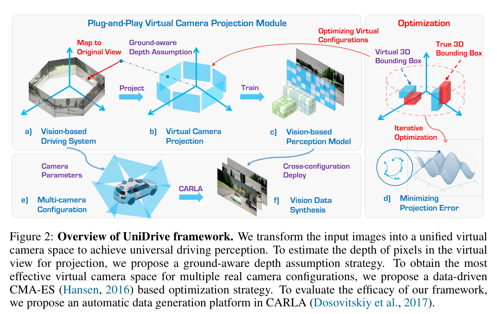
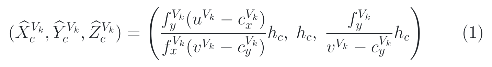
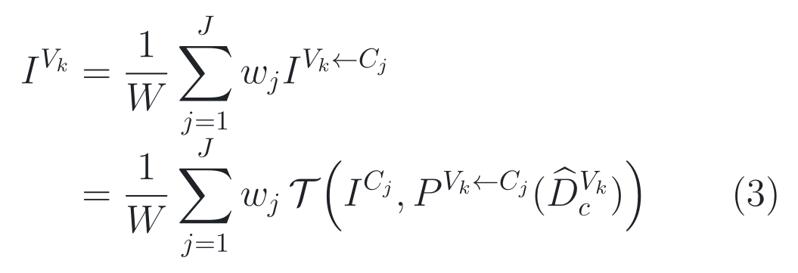
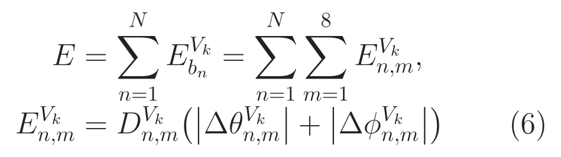
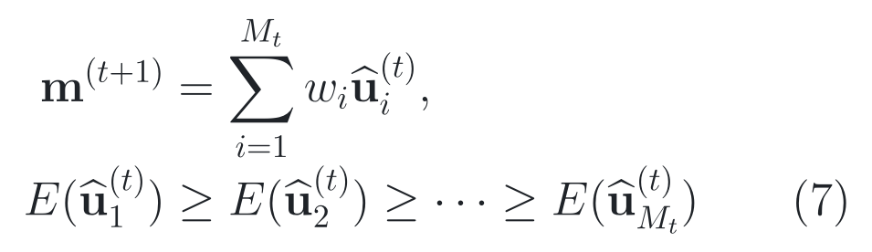
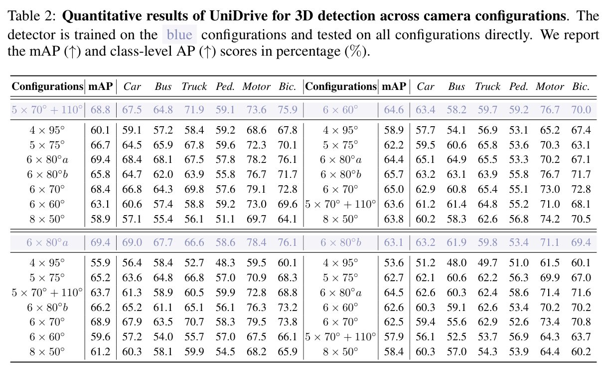

# 2026-08-14 — UniDrive: Towards Universal Driving Perception Across Camera Configurations

`ICLR 2025` · `Accepted` · `论文与补充材料已读 / 官方源码已审 / Checkpoint 未运行`

**主方向：** P03 · BEV 与统一场景表示 ·
**输入模态：** Surround Camera · Simulation ·
**交叉标签：** Camera Configuration、Virtual Camera、3D Object Detection、BEV、Geometric Projection、Camera Calibration、Cross-Rig Generalization、CARLA Benchmark

[▶ 从第一张图开始](#1-看图论文到底做了什么) ·
[返回首页](../../README.md) · [全部精读](../../index/papers.md) ·
[官方论文](https://proceedings.iclr.cc/paper_files/paper/2025/file/41badd36e935f8a80175e95d8bc6192e-Paper-Conference.pdf) ·
[官方代码 @ c73f887d792fbab27d8275e85839e959b4c24f3c](https://github.com/ywyeli/UniDrive/tree/c73f887d792fbab27d8275e85839e959b4c24f3c)

证据与行文标签：**[原文翻译]** 忠实中文译文；**[笔记解释]** 帮助理解的通俗讲解；**[论文]** 作者材料直接支持；**[源码]** 固定 commit 直接支持；**[判断]** 本笔记分析；**[未核验]** 尚未独立运行或确认。译文中不混入解释或判断。

## 0. 阅读起点：术语先导与摘要完整翻译

### 0.1 首次术语解释

**术语覆盖声明：** 摘要中的核心专业术语先在这里解释；摘要后第一次出现的新术语仍在正文就地解释，后文锁定同一中文名、英文名、缩写与语义。

- **以视觉为中心的自动驾驶（Vision-Centric Autonomous Driving）**：以相机为主要环境观测，本文具体研究多相机三维目标检测，不把纯视觉等同于完整自动驾驶系统。
- **相机内参（Camera Intrinsics）**：焦距和主点等决定“相机怎样把光线落到像素”的参数；同一物体换焦距后会占据不同像素范围。
- **相机外参（Camera Extrinsics）**：相机与车辆/世界坐标之间的位姿；相机高度、朝向或安装位置改变都会改变三维点投到哪里。
- **相机配置（Camera Configuration）**：本文把相机数量、视场角、内参、外参和阵列布局合称为一个配置；训练与测试配置不同时形成跨 rig 分布偏移。
- **虚拟相机（Virtual Camera）**：作者定义的一套标准化相机内外参；真实相机图像先被几何变换到这套共同视图，再进入下游网络。
- **地面感知投影（Ground-Aware Projection）**：UniDrive 为虚拟像素补代理深度的方法；近处按平地相交，远处截到固定半径的类圆柱面，而不是真实单目深度估计。
- **投影误差（Projection Error）**：本文以三维框八个角点在真实/虚拟视图中的俯仰角、偏航角差，并按距离加权得到的几何目标；它不是检测误差本身。
- **协方差矩阵自适应进化策略（Covariance Matrix Adaptation Evolution Strategy, CMA-ES）**：用采样、筛选和更新搜索分布来优化连续参数的无梯度方法；本文用它离线搜索虚拟相机配置。
- **鸟瞰图（Bird’s-Eye View, BEV）**：以车辆为中心俯视空间的统一表示；本文沿用 BEVFusion-C 作为检测器，BEV 主干不是 UniDrive 的原创。
- **平均精确率（mean Average Precision, mAP）**：按类别和匹配协议汇总检测精确率—召回率的指标。mAP 不是所有目标的总体 accuracy，也不等于闭环道路安全。

### 0.2 摘要完整专业中文翻译

**原文锚点：** Abstract，PDF p. 1 / proceedings paper p. 1。

<a id="abstract-a01"></a>
> **[原文翻译] Abstract · PDF p. 1 · A01**
>
> 以视觉为中心的自动驾驶已经成为实现可靠环境感知的一种强大且经济的方案。三维感知通常通过投影机制从二维图像推断三维场景，但这些机制对相机内参和外参高度敏感。因此，为了应对相机参数变化并推动自动驾驶系统的可扩展性，跨相机配置的泛化能力至关重要。本文提出 UniDrive，这是一种面向以视觉为中心的自动驾驶、旨在实现跨相机配置通用感知的新框架。我们部署一组统一虚拟相机，并提出一种地面感知投影方法，把原始图像有效变换到这些统一虚拟视图中。我们进一步提出虚拟配置优化方法，通过最小化真实相机与虚拟相机之间的期望投影误差来进行优化。所提出的虚拟相机投影能够作为即插即用模块用于现有三维感知方法，以缓解相机参数变化带来的挑战，从而得到适应性更强、可靠性更高的驾驶感知模型。为评估该框架的有效性，我们在 CARLA 中沿相同路线行驶、仅改变相机配置来采集数据集。实验结果表明，在一个特定相机配置上训练的方法，可以以较小的性能下降泛化到不同配置。

**完整性声明：** 上述 A01 按官方 PDF 摘要唯一实质段落逐句完整翻译，保留了因果、比较、范围和“较小下降”等限定；无抽取不清或删减内容。

> [!TIP]
> **[笔记解释] 读完摘要再看这一句：** UniDrive 先把不同真实相机 rig 重采样到同一虚拟视图再交给 BEV 检测器；最强证据是 6×80°a 训练、6×60°测试时 mAP 从 1.8% 提到 59.6%，最大边界是实验全在 CARLA，且固定官方源码没有发布这段核心预处理。

### 0.3 为什么今天值得读

**新近性与录用：** **[论文]** 本文是 2025 年 ICLR 正式录用论文，由 [ICLR 2025 官方 proceedings](https://proceedings.iclr.cc/paper_files/paper/2025/hash/41badd36e935f8a80175e95d8bc6192e-Abstract-Conference.html) 与 [OpenReview 论坛](https://openreview.net/forum?id=jVDPq9EdzT) 核验，处在最近 24 个月的正式顶会窗口内。

**影响与社区信号：** **[判断]** 截至 2026-08-14，[官方 GitHub](https://github.com/ywyeli/UniDrive) 记录约 98 stars、6 forks；2026 年 CVPR 正式论文 [CoIn3D](https://openaccess.thecvf.com/content/CVPR2026/papers/Kuang_CoIn3D_Revisiting_Configuration-Invariant_Multi-Camera_3D_Object_Detection_CVPR_2026_paper.pdf) 直接把 UniDrive 的 meta-camera 路线作为前置并转向真实数据。这些是采用与注意力信号，不证明 UniDrive 的模拟结论可复现或可直接外推到真车。

**作者与团队脉络：** **[论文/判断]** 论文 affiliation 显示 Ye Li、Xiaonan Huang 来自密歇根大学，Wenzhao Zheng、Kurt Keutzer 来自加州大学伯克利分校；[作者项目页](https://wzzheng.net/UniDrive/) 把本文置于三维驾驶感知与统一表示路线中。连续工作帮助定位研究脉络，但团队声誉不是论文质量，机构名望也不能替代受控证据与复现审计。

**覆盖与研究价值：** **[判断]** 仓库 13 个主方向均已有覆盖；P11 上次精读日期最早，但同轮 P11 强候选的官方仓库要么只有评测器、要么许可证/核心实现边界更弱。P03 上次精读为 2026-07-27，UniDrive 对“标定已知但相机布局改变时，统一表示究竟该在网络前还是网络内完成”给出可单独审查的几何答案，也暴露了视野缺口与源码缺失的研究风险。

**候选对照：** **[判断]** 同轮强候选 [ELM（ECCV 2024）](https://www.ecva.net/papers/eccv_2024/papers_ECCV/papers/07908.pdf) 属于更久未读的 P11 驾驶视觉语言路线，但其官方仓库许可和核心训练闭环弱于本篇；更新的 [CoIn3D（CVPR 2026）](https://openaccess.thecvf.com/content/CVPR2026/papers/Kuang_CoIn3D_Revisiting_Configuration-Invariant_Multi-Camera_3D_Object_Detection_CVPR_2026_paper.pdf) 有真实数据证据，却在本次检索中未找到作者官方代码。今天先读 UniDrive，是因为它同时保留纯感知问题、清楚的受控 cross-rig 实验、官方数据生成代码与 MIT 许可；核心预处理未开源的扣分已纳入选择。综合评分 9.1/10，轮换没有降低质量门槛。

### 问题背景与前置工作

**30 秒问题背景：** **[笔记解释]** 想象同一套 BEV 检测器先装在六个 80° 相机的车上，随后移到四个 95° 相机的车上。前车没有变，但它落到哪个像素、占多少像素、相邻相机重叠多少都变了；网络若把训练 rig 的像素布局当成稳定规律，误差会一路传到视角提升、BEV 特征和三维框。UniDrive 像在进门前先把不同摄像机画面“冲印”成同一套标准相机照片。这个故事只建立分布偏移直觉，不是真实道路安全证据。

**任务与评价对象：** **[论文]** 同步多相机 RGB、每台相机内外参 → 统一虚拟视图 → BEVFusion-C 的车体坐标三维框 → 按 CARLA 六类检测协议计算 mAP（论文 §3–4，PDF pp. 3–10）。预测对象是三维框而不是像素；离线 mAP 不等于总体 accuracy、定位校准、未知类处理或闭环安全。

**关键前置算法：** **[论文/笔记解释]** 第一，**视角提升（View Transformation）** 把图像特征放到 BEV，原 BEVFusion-C 的 Lift-Splat-Shoot 路径依赖已知标定，配置变化会改变采样对应。第二，**元相机/虚拟相机（Meta/Virtual Camera）** 先把异构相机映射到共同视图，VCSeg 已在跨相机语义分割中使用该思想；UniDrive 把目标扩展到多相机三维检测。第三，**图像重采样（Image Warping）** 根据目标视图的每个像素反查源图像位置，但单个像素没有真实深度，所以必须引入代理表面。

**相关论文路线：**

- **[Lift-Splat-Shoot](https://www.ecva.net/papers/eccv_2020/papers_ECCV/html/12356_ECCV_2020_paper.php) → UniDrive：** 前者提供图像特征到 BEV 的几何接口；本文保留该类下游视角提升，却把配置归一化前移到图像预处理。它仍不能回答同一 checkpoint 换相机数量、FOV 和位置后怎样维持输入分布。
- **[VCSeg](https://openaccess.thecvf.com/content/WACV2022/html/Choi_VCSeg_Virtual_Camera_Adaptation_for_Road_Semantic_Segmentation_WACV_2022_paper.html) → UniDrive：** 前者在道路语义分割里把不同相机转到虚拟相机；UniDrive 继承“先标准化视图”的接口，新增多相机融合、三维框相关投影误差和虚拟配置搜索。前者没有回答多相机三维检测的跨 rig 退化。
- **[CoIn3D](https://openaccess.thecvf.com/content/CVPR2026/papers/Kuang_CoIn3D_Revisiting_Configuration-Invariant_Multi-Camera_3D_Object_Detection_CVPR_2026_paper.pdf) ↔ UniDrive：** 后续工作在 nuScenes、Waymo、Lyft 上显式编码焦距、地面深度、地面梯度与 Plücker 坐标，并用新视图合成扩充观察；它直接覆盖“真实数据 cross-rig”宽问题，但需要更重的离线几何资产，不能反向证明 UniDrive 的简单代理足够。

**本文接在哪里：** **[判断]** 已有路线能在固定标定下把图像提升到 BEV，也有单相机虚拟视图；卡点是多相机 rig 一变，图像分布与投影映射同时变。UniDrive 只在网络前新增“代理表面反投影 → 多视图重采样/融合 → 离线搜索虚拟 rig”；Swin-T、FPN、LSS、BEV encoder 与 CenterHead 均属继承。真实非平地、缺视野、动态标定漂移和真实数据泛化没有被本文解决。

**资料使用边界：** **[判断]** 论文解析、视频、列表和搜索引擎只用于候选召回与讲解顺序，二手解析不作为最终证据；录用、方法和数字回到原论文、ICLR proceedings 与补充材料，实现行为回到完整 40 位 commit 固定源码。

**学习顺序：** [0 摘要与术语](#0-阅读起点术语先导与摘要完整翻译) → [1 看原图](#1-看图论文到底做了什么) → [2 读原式](#2-读公式核心机制怎样表达) → [3 看结果](#3-看结果证据是否支持主张) → [4 对源码](#4-对源码公式如何落地) → [5 记结论](#5-记结论贡献边界与开放问题)

## 1. 看图：论文到底做了什么



> **原图出处：** Li et al., ICLR 2025, Figure 2, PDF p. 4。[官方 PDF](https://proceedings.iclr.cc/paper_files/paper/2025/file/41badd36e935f8a80175e95d8bc6192e-Paper-Conference.pdf)。仅作学术讲解所需的局部摘录，原图版权归原作者及其他权利人。

### 这张图按什么顺序看

1. 左侧是真实相机配置；数量、FOV、内参和外参都可以不同。
2. 中间先用地面/类圆柱代理给虚拟像素补三维位置，再反查到各真实相机并融合。
3. 下方用 CARLA 多配置数据和三维框角点投影误差离线搜索一套虚拟相机参数。
4. 右侧同一个下游网络只接收标准虚拟视图，训练和推理接口保持一致。

**看完应能复述：** UniDrive 不让检测器直接适应所有真实 rig，而是先把几何 nuisance 归一化成一套虚拟相机输入。

**这张图没有证明：** 它没有证明代理深度等于真实场景深度、重采样无信息损失、虚拟配置最优、真实道路有效或公开源码已经实现全部箭头。

### 整体算法架构与创新设计

**原方法瓶颈：** **[论文]** 作者指出，视角提升依赖内外参，已有固定配置模型在焦距、相机高度、朝向、数量或布局变化后性能会显著下降；仅把新标定传给投影层，仍不能消除图像内容和跨视角重叠的分布变化。来源：论文 §1、§3.1，PDF pp. 1–4。

**主干网络与基线：** **[论文/源码]** 直接 baseline 是 camera-only BEVFusion（BEVFusion-C）。固定仓库中的继承配置为 Swin-T 图像 backbone、FPN neck、LSS 视角变换、BEV decoder 和 CenterHead；默认输入缩到 256×704，BEV 网格在 *x/y* 各覆盖约 −51.2 至 51.2 m、步长 0.4 m。来源：论文 Figure 3、§4.1，PDF pp. 6–8；[固定 SHA 相机配置](https://github.com/ywyeli/UniDrive/blob/c73f887d792fbab27d8275e85839e959b4c24f3c/detection_methods/bevfusion/configs/nuscenes/det/centerhead/lssfpn/camera/256x704/swint/default.yaml)。

**继承与新增边界：** **[论文/源码]** 继承项是 Swin-T/FPN、LSS、BEV encoder、CenterHead、检测损失与后处理；本文新增的是网络前的虚拟相机投影、跨真实视图融合、框角点投影误差、CMA-ES 配置搜索，以及 CARLA 多 rig 数据/benchmark。固定官方树没有发布前四项的可执行实现，不能把 vendored BEVFusion 当作 UniDrive 核心代码。来源：论文 Figure 2–3、§3，PDF pp. 4–7；[固定 SHA README 的方法声明](https://github.com/ywyeli/UniDrive/blob/c73f887d792fbab27d8275e85839e959b4c24f3c/README.md)。

**端到端信息流：** **[论文/源码]** 原始同步 RGB（每配置 4–8 台、采集分辨率 1600×900）与每台相机内外参 → 对每个虚拟像素按平地或半径 *D*<sub>0</sub> 类圆柱面构造虚拟相机三维点 → 虚拟相机坐标经世界坐标反投到所有可见真实相机 → 图像 warp 后按权重融合成 *K* 张标准虚拟视图 → Swin-T/FPN → LSS 得到 256×256 BEV 特征 → BEV decoder/CenterHead → 车体坐标六类三维框。没有跨帧 prediction-relevant state，也没有状态写回/reset。来源：论文 Algorithm 1、Figure 3、§3.2，PDF pp. 4–6；[固定 SHA BEVFusion 前向](https://github.com/ywyeli/UniDrive/blob/c73f887d792fbab27d8275e85839e959b4c24f3c/detection_methods/bevfusion/mmdet3d/models/fusion_models/bevfusion.py)。

**总体训练方式：** **[论文/源码]** CMA-ES 先离线搜索虚拟相机参数；投影/融合无可学习参数；然后用一种训练 rig 的图像经同一虚拟预处理训练 BEVFusion-C，推理时其他 rig 也经该预处理。论文未公开初始化、冻结、优化器、学习率、batch、epochs、seed、选模和确切命令。固定 vendored 配置给出 seed 0、deterministic false、20 epochs、AdamW 2×10<sup>−4</sup>、cosine schedule、per-GPU batch 6 等基础默认值，但仓库没有指出哪套配置生成论文表格，故不能把这些默认值冒充论文配方。训练与推理都使用当前帧和已知标定，无 teacher forcing；虚拟预处理没有梯度，检测损失只训练下游网络。来源：论文 Algorithm 2、§3.4、§4，PDF pp. 6–10；[固定 SHA defaults](https://github.com/ywyeli/UniDrive/blob/c73f887d792fbab27d8275e85839e959b4c24f3c/detection_methods/bevfusion/configs/default.yaml)。

#### 创新模块 1：Ground-Aware Virtual Camera Projection

**位置与接口：** 位于真实多相机 RGB/标定与任何 2D encoder 之间，是网络外预处理；它替换“直接把真实图像送进固定 rig 检测器”的输入接口。

**输入：** *J* 张真实图像、各自 3×3 内参和 4×4 外参，以及 *K* 台虚拟相机的内外参；每个虚拟输出像素还需要虚拟相机高度与阈值 *D*<sub>0</sub>。

**内部变换：** 对虚拟像素先与水平地面相交得到代理三维点 → 若距离超过 *D*<sub>0</sub>，改为同方向、固定半径的类圆柱点 → 经虚拟外参到世界坐标 → 经真实外参逆变换到真实相机坐标 → 用真实内参投到源像素 → warp 取样。

**输出：** 每台真实相机对每个虚拟视图贡献一张投影图 *I*<sup>*V*<sub>*k*</sub>←*C*<sub>*j*</sub></sup>；它保留的是代理表面上的颜色对应，不是完整三维重建。

**为什么这样设计：** **[论文] 作者明确动机：** 单个虚拟像素没有可直接用于反投影的深度；道路近处大量感知目标与地面相关，远处用固定半径避免地面交点趋于无穷。来源：论文 §3.2、Eq. (1–2)，PDF pp. 4–5。

**训练信号：** **[论文/源码]** 该模块是确定性几何变换，不从检测损失接收梯度；真实/虚拟标定和阈值直接决定采样网格。固定树未发布对应实现，无法核对插值、边界 mask、阈值和梯度开关。来源：论文 Algorithm 1、§3.2，PDF pp. 4–5；[固定 SHA 官方树](https://github.com/ywyeli/UniDrive/tree/c73f887d792fbab27d8275e85839e959b4c24f3c)。

**作用与证据：** **[未核验]** 原文未提供“地面+类圆柱代理”相对于平面、球面、真实深度或学习深度的独立消融/受控对照，因此不能把整套 UniDrive 增益单独归因给该代理。

**论文位置：** **[论文]** Figure 2、Algorithm 1、Eq. (1–2)、§3.2，PDF pp. 4–5。

**源码入口：** **[源码]** [README 对该模块的声明 @ 固定 SHA](https://github.com/ywyeli/UniDrive/blob/c73f887d792fbab27d8275e85839e959b4c24f3c/README.md)；[实际图像 loader @ 固定 SHA](https://github.com/ywyeli/UniDrive/blob/c73f887d792fbab27d8275e85839e959b4c24f3c/detection_methods/bevfusion/mmdet3d/datasets/pipelines/loading.py)。后者只读取原图，固定树内未找到论文所述 warp 主实现。

#### 创新模块 2：Weighted Multi-View Blending

**位置与接口：** 接在逐真实相机 warp 之后、2D encoder 之前；它把多个真实相机对同一虚拟视图的候选颜色合成一张图。

**输入：** *J* 张已投影图像、有效覆盖 mask 和每视图权重 *w*<sub>*j*</sub>；论文说权重“可基于”角距离或相机距离，但没有锁定实际公式。

**内部变换：** 对同一虚拟像素收集所有可见真实视图 → 乘权 → 按权重和归一化。遮挡次序、曝光差、无覆盖像素和接缝处理未由正文定义。

**输出：** *K* 张统一虚拟图像，作为下游 BEV 网络的普通 RGB 输入。

**为什么这样设计：** **[判断] 笔记因果重建：** 这是本笔记根据前述瓶颈与论文结构所做的因果重建，不是作者原句。一个虚拟方向可能落入多个真实相机的重叠 FOV，归一化融合可避免任意挑一台相机，但也可能把遮挡和曝光冲突平均掉。

**训练信号：** **[论文/源码]** 论文把权重视为投影规则的一部分，没有学习损失；固定树未发布融合实现，无法确认权重是否逐像素、mask 后是否重归一化，以及缺视野怎样填充。来源：论文 Eq. (3)、§3.2，PDF p. 5；[固定 SHA 官方树](https://github.com/ywyeli/UniDrive/tree/c73f887d792fbab27d8275e85839e959b4c24f3c)。

**作用与证据：** **[未核验]** 原文未提供 average、angular weight、nearest camera、hard select 等独立消融或受控对照，因此不能把全模型增益单独归因给融合规则。

**论文位置：** **[论文]** Algorithm 1、Eq. (3)、§3.2，PDF p. 5。

**源码入口：** **[源码]** [官方方法说明 @ 固定 SHA](https://github.com/ywyeli/UniDrive/blob/c73f887d792fbab27d8275e85839e959b4c24f3c/README.md)；固定树全文未找到 Eq. (3) 对应的 blending symbol，不能写成“源码已实现”。

#### 创新模块 3：Virtual Configuration Optimization

**位置与接口：** 位于模型训练之前的离线设计阶段；输入多种真实 rig 与三维框，输出后续所有训练/推理共享的虚拟 rig。

**输入：** *S* 种真实相机系统、带八角点的三维框集合、虚拟相机数量/内外参搜索空间、网格密度、CMA-ES 初始均值/步长/协方差及每轮候选数。

**内部变换：** 对候选虚拟 rig 计算真实 warp 与直接虚拟投影的框角点 pitch/yaw 差 → 按角点到相机距离加权并跨框/rig 求和 → 从 CMA-ES 分布采样候选 → 选择较优候选更新均值、协方差与步长 → 迭代得到虚拟配置。

**输出：** 一套固定虚拟相机数量、内参和外参；它不在每帧在线改变。

**为什么这样设计：** **[论文] 作者明确动机：** 任意手选虚拟 rig 会对某些真实配置产生大投影误差，作者因此用多 rig 的期望误差选择共同折中。来源：论文 §3.3–3.4、Algorithm 2，PDF pp. 5–7。

**训练信号：** **[论文/源码]** CMA-ES 不用反向传播；适应度是 Eq. (6) 投影误差。固定仓库未发布误差计算或 CMA-ES 实现，不能核验角度单位、可见性、边界角点、搜索范围和停止条件。来源：论文 Eq. (6–11)、Algorithm 2、§3.3–3.4，PDF pp. 5–7；[固定 SHA 官方树](https://github.com/ywyeli/UniDrive/tree/c73f887d792fbab27d8275e85839e959b4c24f3c)。

**作用与证据：** **[论文]** Figure 5(b,c) 给出受控比较，在 UniDrive 全部其他组件固定时干预“w/o optimization → w/ optimization”；例如训练列为 4×95°、测试行为 5×70°+110° 的单元格由 53.2 提到 57.2 mAP（绝对 +4.0 点、相对约 +7.5%）。矩阵中并非每个单元格都单调改善，因此该受控证据支持总体折中更稳，不支持对每个 rig 都更优。来源：论文 Figure 5，PDF p. 10。

**论文位置：** **[论文]** Eq. (4–11)、Algorithm 2、§3.3–3.4，PDF pp. 5–7。

**源码入口：** **[源码]** [官方方法说明 @ 固定 SHA](https://github.com/ywyeli/UniDrive/blob/c73f887d792fbab27d8275e85839e959b4c24f3c/README.md)；固定树未找到 CMA-ES、projection error 或 virtual configuration optimizer 的实现。

#### 创新单元 4：Controlled Multi-Configuration CARLA Benchmark

**位置与接口：** 它不是网络模块，而是把相同地图/路线/任务内容放到八种相机配置下，隔离配置变量的评测单元。

**输入：** CARLA 0.9.10 场景、路线、交通参与者、八种 4–8 相机布局，以及同步 RGB/三维框标注。

**内部变换：** 每配置生成 500 scenes、20,000 frames → 按 250/250 scenes 划分训练与 validation → 只在一个配置训练 → 在全部配置验证 → 组成 8×8 cross-configuration mAP 矩阵。

**输出：** 160,000 帧和跨 rig 检测表；没有独立 test split 或隐藏测试服务器。

**为什么这样设计：** **[论文] 作者明确动机：** 真实数据很难保持路线/内容不变而只改相机，因此用模拟器控制除相机配置外的因素。来源：论文 §4.1，PDF pp. 7–8。

**训练信号：** **[论文/源码]** 数据单元本身不接收梯度；其三维框监督进入 BEVFusion-C 检测损失。固定脚本能采集 CARLA/nuScenes 格式数据，但公开 `routes_baselines.sh` 默认只传 `base.toml`，没有循环八种论文配置。来源：论文 §4.1，PDF pp. 7–8；[固定 SHA 路线脚本](https://github.com/ywyeli/UniDrive/blob/c73f887d792fbab27d8275e85839e959b4c24f3c/create/carla_nus/scripts/routes_baselines.sh)。

**作用与证据：** **[论文]** Table 1 给出受控比较：BEVFusion-C 训练/测试 6×80°a 为 66.7 mAP，只把测试 rig 替换为 6×60° 后降到 1.8，下降 64.9 点；Table 2 与 Figure 5 再给 UniDrive 8×8 矩阵。该控制设计支持“相机配置本身可造成巨大退化”，但模拟路线重复不等于真实车辆跨平台泛化。来源：论文 Table 1–2、Figure 5，PDF p. 8–10。

**论文位置：** **[论文]** Figure 2、Table 1–2、§4.1，PDF pp. 4、7–10。

**源码入口：** **[源码]** [数据采集说明 @ 固定 SHA](https://github.com/ywyeli/UniDrive/blob/c73f887d792fbab27d8275e85839e959b4c24f3c/assets/GET_STARTED.md)；[公开路线脚本 @ 固定 SHA](https://github.com/ywyeli/UniDrive/blob/c73f887d792fbab27d8275e85839e959b4c24f3c/create/carla_nus/scripts/routes_baselines.sh)。


> **原图出处：** Li et al., ICLR 2025, Figure 3, PDF p. 6。[官方 PDF](https://proceedings.iclr.cc/paper_files/paper/2025/file/41badd36e935f8a80175e95d8bc6192e-Paper-Conference.pdf)。仅作学术讲解所需的局部摘录，原图版权归原作者及其他权利人。

**图与架构的关键对应：** 预处理只改 `Multi-view Images → Virtual Camera Space`；2D Encoder、2D-to-BEV transform、BEV Encoder 和 Head 都是下游模型。若把后四段的能力算成 UniDrive 创新，就会把“输入规范化”和“检测器本身更强”混为一谈。

## 2. 读公式：核心机制怎样表达

**变量身份图例：** **[领域惯用]** 表示语义角色在本领域常见，但不表示所有论文都使用同一个字母；**[本文定义]** 表示论文给该符号赋予了本文特定含义；**[源码/笔记重排]** 表示固定源码等价式或本笔记计算新增的符号。

### 原文公式 1：虚拟像素的地面代理三维点

**原文公式：** 论文 Eq. (1)，PDF p. 4。

<p align="center"><picture><source media="(prefers-color-scheme: dark)" srcset="../../assets/notes/2026-08-14-unidrive/formulas/eq-01-ground-proxy-dark.png"></picture></p>

> **公式来源：** Li et al., ICLR 2025, Eq. (1)，PDF p. 4；本图按原符号重排。[官方 PDF](https://proceedings.iclr.cc/paper_files/paper/2025/file/41badd36e935f8a80175e95d8bc6192e-Paper-Conference.pdf) · [可复制 TeX](../../assets/notes/2026-08-14-unidrive/formulas/source.tex#L4-L14)。

**先建立画面：** **[笔记解释]** 把虚拟相机想成站在车顶、每个像素发出一束射线；这条式子先问“这束线如果打到平整路面，落点在哪里”，给后续去真实图像找颜色一个三维地址。

**变量逐项解释与身份：** **[本文定义]** *V*<sub>*k*</sub> 是第 *k* 台虚拟相机；(*u*<sup>*V*<sub>*k*</sub></sup>, *v*<sup>*V*<sub>*k*</sub></sup>) 是其像素坐标，单位为 pixel、不可学习；(*X̂*<sub>*c*</sub><sup>*V*<sub>*k*</sub></sup>, *Ŷ*<sub>*c*</sub><sup>*V*<sub>*k*</sub></sup>, *Ẑ*<sub>*c*</sub><sup>*V*<sub>*k*</sub></sup>) 是虚拟相机坐标系中的代理交点，单位与 *h*<sub>*c*</sub> 一致。**[领域惯用]** *f*<sub>*x/y*</sub> 表示像素焦距、*c*<sub>*x/y*</sub> 表示主点，这些语义角色常见但字母并非所有论文强制统一；它们来自 3×3 虚拟内参、不可学习。**[本文定义]** *h*<sub>*c*</sub> 是虚拟相机距水平地面的高度；帽号表示先按地面得到的初始假设。分式、括号和三个分量共同决定坐标，没有时间下标或可学习参数。

**变量变化会怎样：** 在其他量暂时不变时，*v* 越接近主点 *c*<sub>*y*</sub>，分母趋近零，代理深度会急剧变大；这正是远处改用固定半径类圆柱面的原因。增大 *h*<sub>*c*</sub> 会等比例放大三个坐标；增大 *f*<sub>*x*</sub> 会缩小横向 *X̂*。若 *v* 穿过地平线，符号和可见性必须另行处理，不能只看一个变量判断实际采样是否有效。

**纯文字读法：** 先用纵向像素偏移除以纵向焦距恢复射线落地的深度比例，再用横向偏移和横向焦距得到左右位置；相机高度给出竖直分量，并把另外两个分量缩放到同一三维坐标。

**教学小例子：** **[笔记解释]** 设 *f*<sub>*x*</sub>=*f*<sub>*y*</sub>=100、主点为 (50,50)、像素为 (60,70)、相机高 2 m，则 *X̂*=100×10÷(100×20)×2=1 m，*Ŷ*=2 m，*Ẑ*=100÷20×2=10 m。也就是这束线在代理路面上指向“右约 1 m、前约 10 m”的位置。这是教学示例，不是论文实验。

**专业解释：** 这是一种单平面逆透视，不估计物体真实深度；对高于地面的车身、行人和建筑，几何点只是用于视图重采样的代理。

**回到上面的图：** 对应 Figure 2(b) 从 Virtual Camera 到 3D Ground Plane 的箭头。

**落到源码：** **[源码]** [固定 SHA README](https://github.com/ywyeli/UniDrive/blob/c73f887d792fbab27d8275e85839e959b4c24f3c/README.md) 只说明 ground-aware strategy；固定树没有 Eq. (1–2) 的执行实现。

**公式省略了什么：** Eq. (1) 没写地平线/图像边界 mask、坐标轴方向、阈值 *D*<sub>0</sub>、类圆柱切换、插值方法和无覆盖值；这些细节决定可执行行为，却未由固定源码补全。

### 原文公式 2：多真实视图的归一化融合

**原文公式：** 论文 Eq. (3)，PDF p. 5。

<p align="center"><picture><source media="(prefers-color-scheme: dark)" srcset="../../assets/notes/2026-08-14-unidrive/formulas/eq-03-view-blending-dark.png"></picture></p>

> **公式来源：** Li et al., ICLR 2025, Eq. (3)，PDF p. 5；本图按原符号重排，归一化常数的定义在原文公式后说明。[官方 PDF](https://proceedings.iclr.cc/paper_files/paper/2025/file/41badd36e935f8a80175e95d8bc6192e-Paper-Conference.pdf) · [可复制 TeX](../../assets/notes/2026-08-14-unidrive/formulas/source.tex#L16-L24)。

**先建立画面：** **[笔记解释]** 同一块虚拟挡风玻璃可能同时被左前和正前相机覆盖；这条式子像按可信度把两张重叠照片加权显影，再除以总权重，避免画面因相机数量变亮。

**变量逐项解释与身份：** **[本文定义]** *I*<sup>*V*<sub>*k*</sub></sup> 是第 *k* 个最终虚拟 RGB 图，shape 为 *H*×*W*×3；*I*<sup>*C*<sub>*j*</sub></sup> 是第 *j* 台真实相机图；*I*<sup>*V*<sub>*k*</sub>←*C*<sub>*j*</sub></sup> 是该真实图 warp 到虚拟视图后的结果。**[本文定义]** *J* 是真实相机数，*j* 是求和索引；*w*<sub>*j*</sub> 是融合权重，是否逐像素未明确；*W*=Σ*w*<sub>*j*</sub> 是总权重。**[本文定义]** *T* 是 warping 算子，*P*<sup>*V*<sub>*k*</sub>←*C*<sub>*j*</sub></sup> 是由标定和代理距离 *D̂*<sub>*c*</sub><sup>*V*<sub>*k*</sub></sup> 决定的反查映射。箭头表示从真实相机域到虚拟相机域，不是时间状态。

**变量变化会怎样：** 在其他量暂时不变时，把某个 *w*<sub>*j*</sub> 置零会移除该相机贡献；若两视图颜色相同，改变权重不改变结果；颜色冲突时结果向大权重视图移动。若所有有效权重都为零，式子除零，论文没有给 fallback。增加一台相机不必然更好：遮挡、曝光和几何代理错误会耦合，不能只看 *J* 判断质量。

**纯文字读法：** 把每台真实相机按代理几何扭到目标虚拟视图，乘上该视图的权重，把所有贡献相加，再除以权重总和，得到一张标准虚拟图。

**教学小例子：** **[笔记解释]** 某虚拟像素从两台相机取到灰度 40 和 100，权重为 1 和 3；总权重为 4，输出是 (1×40+3×100)÷4=85。它更靠近第二台相机，但不是在判断哪个表面真正可见。这是教学示例，不是论文实验。

**专业解释：** 这是线性混合而非显式遮挡推理；“权重可由角距离或相机接近度决定”只是论文给出的候选依据，不能当成已经锁定的实现。

**回到上面的图：** 对应 Figure 2(c) 多个投影视图汇到 Unified Camera View。

**落到源码：** **[源码]** [固定 SHA loader](https://github.com/ywyeli/UniDrive/blob/c73f887d792fbab27d8275e85839e959b4c24f3c/detection_methods/bevfusion/mmdet3d/datasets/pipelines/loading.py) 直接读取原图；固定树没有该融合调用链。

**公式省略了什么：** 有效像素 mask、逐像素/逐相机权重、插值核、接缝、曝光、遮挡、无覆盖填充值和 batch/GPU 实现均未公开。

### 原文公式 3：按距离加权的框角点投影误差

**原文公式：** 论文 Eq. (6)，PDF p. 6。

<p align="center"><picture><source media="(prefers-color-scheme: dark)" srcset="../../assets/notes/2026-08-14-unidrive/formulas/eq-06-projection-error-dark.png"></picture></p>

> **公式来源：** Li et al., ICLR 2025, Eq. (6)，PDF p. 6；第二行按原文前置定义并入同一图，按原符号重排。[官方 PDF](https://proceedings.iclr.cc/paper_files/paper/2025/file/41badd36e935f8a80175e95d8bc6192e-Paper-Conference.pdf) · [可复制 TeX](../../assets/notes/2026-08-14-unidrive/formulas/source.tex#L26-L38)。

**先建立画面：** **[笔记解释]** 给每个三维框装八个角标，分别沿“真实相机先 warp”与“直接看虚拟相机”两条路线投影；两条路线的视线方向越不一致，罚分越大，远处角点还被加重。

**变量逐项解释与身份：** **[本文定义]** *N* 是三维框数，*n* 是框索引；每框固定八个角点，*m*∈{1,…,8}。*E* 是总投影误差，*E*<sub>*b*<sub>*n*</sub></sub><sup>*V*<sub>*k*</sub></sup> 是框 *b*<sub>*n*</sub> 在虚拟相机 *V*<sub>*k*</sub> 下的误差，*E*<sub>*n,m*</sub><sup>*V*<sub>*k*</sub></sup> 是单角点项。*D*<sub>*n,m*</sub><sup>*V*<sub>*k*</sub></sup> 是角点到相机光心的欧氏距离；Δ*θ*、Δ*φ* 分别是真实-warp 路线与直接虚拟投影路线的俯仰、偏航角差，单位应一致，绝对值去掉方向。求和符号累加框和角点，不是均值；所有量由标定/三维框计算，不可学习。

**变量变化会怎样：** 在其他量暂时不变时，任一角差翻倍会让对应项翻倍；角差为零时该角点不贡献误差；同样角差出现在更远处，因 *D* 更大而更重。总框数增加也会自然增大 *E*，因此不同样本集间不能不归一化直接比较。pitch/yaw 相互耦合于可见性，单看一个角不能判断最终检测性能。

**纯文字读法：** 对每个三维框的八个角点，计算两条投影路线之间的俯仰角绝对差加偏航角绝对差，再乘角点距离，最后把全部角点和全部框相加。

**教学小例子：** **[笔记解释]** 两个角点距离分别 10 m、20 m，俯仰与偏航绝对差之和分别 0.02、0.03 rad，则总贡献为 10×0.02+20×0.03=0.8 m·rad；远角点贡献 0.6，占多数。这是教学示例，不是论文实验。

**专业解释：** 目标强调角度保真并用距离加权，但它不直接度量像素重采样误差、遮挡、纹理质量或 mAP；优化该代理不保证每个检测配置单调改善。

**回到上面的图：** 对应 Figure 2(d) 的 Minimizing Projection Error 与三维框角点。

**落到源码：** **[源码]** [固定 SHA 官方树](https://github.com/ywyeli/UniDrive/tree/c73f887d792fbab27d8275e85839e959b4c24f3c) 没有发现该误差计算器，无法做数值逐项追踪。

**公式省略了什么：** 没写角度周期处理、框/相机可见性、越界点、每 rig 归一化、距离/角度单位和异常值截断；这些都会改变优化适应度。

### 原文公式 4：CMA-ES 的候选均值更新

**原文公式：** 论文 Eq. (7)，PDF p. 7。

<p align="center"><picture><source media="(prefers-color-scheme: dark)" srcset="../../assets/notes/2026-08-14-unidrive/formulas/eq-07-cma-mean-dark.png"></picture></p>

> **公式来源：** Li et al., ICLR 2025, Eq. (7)，PDF p. 7；本图按原符号重排并原样保留论文排序符号。[官方 PDF](https://proceedings.iclr.cc/paper_files/paper/2025/file/41badd36e935f8a80175e95d8bc6192e-Paper-Conference.pdf) · [可复制 TeX](../../assets/notes/2026-08-14-unidrive/formulas/source.tex#L40-L49)。

**先建立画面：** **[笔记解释]** 像让多组工程师各摆一套虚拟相机，测完投影误差后挑一批候选，把下一轮搜索中心移到这些候选的加权平均附近。

**变量逐项解释与身份：** **[本文定义]** *t* 是搜索迭代，*m*<sup>(*t*+1)</sup> 是下一轮多元高斯搜索分布的均值向量；它编码所有虚拟相机的内外参。*M*<sub>*t*</sub> 是本轮选中候选数，*i* 是排名索引；*û*<sub>*i*</sub><sup>(*t*)</sup> 是第 *i* 个选中配置；*w*<sub>*i*</sub> 是性能权重，通常应归一化但本文 Eq. (7) 未在图中给约束。*E*(·) 是 Eq. (6) 派生的误差适应度。帽号表示被选中的候选，不是预测不确定性；所有量属于离线优化，不是网络参数梯度。

**变量变化会怎样：** 在其他量暂时不变时，提高某候选 *w*<sub>*i*</sub> 会把新均值拉向该候选；若所有候选相同，均值不变；若权重和不为 1，均值尺度会被改变。步长和协方差仍由 Eq. (8–11) 同时更新，所以不能只看 *m* 判断下一轮探索范围。

**纯文字读法：** 把本轮选中的 *M*<sub>*t*</sub> 套虚拟相机参数分别乘以权重后相加，作为下一轮搜索中心；论文随后给出这些候选的误差排序关系。

**教学小例子：** **[笔记解释]** 只看一个“虚拟焦距”参数，两个候选是 70 和 90，权重 0.75 与 0.25，则新均值为 75；下一轮搜索会偏向 70。真实方法同时搜索多台相机的多维参数。这是教学示例，不是论文实验。

**专业解释：** 正文目标写“最小化误差”，Algorithm 2 写选择 best solutions，但 Eq. (7) 原样给出从大到小的“≥”误差排序。**[判断]** 这是目标方向与排序记号之间的静态歧义；由于固定仓库没有 optimizer 实现，本笔记无法判定是排名约定、符号遗漏还是排版问题，更不能把它定性成运行 bug。

**回到上面的图：** 对应 Figure 2(d) 与 Algorithm 2 的 sample → evaluate → select → update 循环。

**落到源码：** **[源码]** [固定 SHA 官方树](https://github.com/ywyeli/UniDrive/tree/c73f887d792fbab27d8275e85839e959b4c24f3c) 没有 CMA-ES 调用、搜索空间或权重实现，无法消解排序歧义。

**公式省略了什么：** 参数编码/约束、单位、搜索网格密度、候选数、权重计算、停止条件，以及 Eq. (8–11) 的完整协方差/步长更新；论文也未公开最终虚拟配置的机器可读文件。

## 3. 看结果：证据是否支持主张

### 3.0 数据集与实验设计总览

**数据集与任务：** **[论文]** 唯一实验数据是作者在 CARLA 生成的多相机三维检测集，按 nuScenes 数据格式组织。八种相机配置各 500 scenes、20,000 frames，250 scenes/10,000 frames 用于 train，250 scenes/10,000 frames 用于 validation，总计 160,000 frames；没有独立 test split、隐藏标签或服务器。六类为 Car、Bus、Truck、Motorcycle、Bicycle、Pedestrian。来源：论文 §4.1，PDF pp. 7–8。

**传感器与输入：** **[论文/源码]** 每种配置只有同步 Surround Camera，原始分辨率 1600×900，相机数 4–8，FOV/布局见 Figure 4；任务用已知内外参和当前帧，不使用 LiDAR 作为模型输入。论文写使用 “Towns 1–6”；固定 README 则明确写 CARLA 0.9.10 的 Towns 1、3、4、6，每图六条不重叠路线、20 Hz。这是材料冲突/歧义，不能静默合并为同一地图集合。来源：论文 §4.1，PDF p. 7；[固定 SHA README](https://github.com/ywyeli/UniDrive/blob/c73f887d792fbab27d8275e85839e959b4c24f3c/README.md)。

**实验分组：**

- **主 benchmark：** BEVFusion-C 与 UniDrive 各自在一个 rig 训练、全部 rig 验证，分别形成 Table 1、Table 2 与 Figure 5 的跨配置矩阵。
- **配置受控组：** Figure 6 分开改变相机内参/FOV、相机高度、相机摆放，比较 BEVFusion-C 和完整 UniDrive。
- **优化消融：** Figure 5(b,c) 固定 UniDrive 其余组件，只把直觉虚拟 rig 换成优化虚拟 rig。
- **模块消融：** 原文没有地面/类圆柱代理、融合权重、warp 插值的独立消融。
- **鲁棒/泛化：** 只覆盖模拟器内的配置偏移；没有天气、域、标定噪声、缺帧或真实跨数据集组。
- **效率/部署：** 原文未报告参数、FLOPs、warp 延迟、显存或端到端 FPS。
- **迁移/任务扩展：** 只使用 BEVFusion-C；没有其他 3D detector 或分割、Occupancy、地图任务实验。

**训练—验证—测试路线：** **[论文/源码]** CARLA 相同路线按八种 rig 采集 → 每 rig 按 250/250 scenes 划 train/validation → 多 rig 标注离线计算投影误差并用 CMA-ES 选虚拟 rig → 选一个训练 rig，把图像投到虚拟视图，训练 BEVFusion-C → validation/选模规则原文未公开 → 每个目标 rig 同样投到虚拟视图 → CenterHead 后处理 → 在本地 validation 计算六类 AP/mAP。**[未核验]** 本仓库没有运行该流程；固定源码只覆盖数据采集和继承检测器，核心预处理/优化/最终评测闭环缺失。

**指标与回答的问题：** **[论文/笔记解释]** AP 与 mAP 越高，回答“在固定类别与匹配协议下，三维框检测的 precision–recall 是否更好”；cross-rig mAP 差回答同一个训练 checkpoint 换配置后保留多少检测能力。mAP 不等于总体 accuracy，不表示每类都改善，也不测标定置信度、未知类、概率校准或闭环安全。论文没有报告跨 scene 方差、置信区间或多 seed。

**一眼看懂实验结论：** **[判断]** 最强编号证据是 Figure 6(a)：训练 6×80°a 后测试 6×60°，BEVFusion-C 1.8 mAP，完整 UniDrive 59.6，绝对 +57.8 点；相对倍率约 33.1×，但低基线上的倍率不宜当作稳定百分比收益。最大证据边界是单模拟器、单 detector、已知精确标定、没有核心公开实现与重复统计，因此只支持受控模拟 cross-rig 的输入规范化价值。

### 3.1 原文公开的实验配置

**原文锚点：** 主论文 §4 Experiments，PDF pp. 7–10；Supplement §1–4；固定 SHA 数据、检测配置和运行文档。

- **数据集、版本与 train/val/test 划分。** **[论文]** CARLA 版本仅在固定 README 写 0.9.10；论文未写版本。八配置各 500 scenes/20,000 frames，250/250 scenes 对半为 train/validation；无 test。论文 “Towns 1–6” 与 README “1、3、4、6” 冲突；未公开逐路线/天气/交通密度 seed。来源：论文 §4.1，PDF p. 7；[固定 SHA README](https://github.com/ywyeli/UniDrive/blob/c73f887d792fbab27d8275e85839e959b4c24f3c/README.md)。
- **传感器、输入范围、分辨率与预处理。** **[论文]** 4–8 台相机，1600×900，配置含 4×95°、5×75°、6×80°a/b、6×70°、6×60°、8×50°、5×70°+110°。输入范围和 *D*<sub>0</sub> 未公开。**[源码]** vendored detector 默认把图像增强到 256×704，训练有 resize/rotation/flip；但仓库未指定论文用的最终配置，故只是源码线索。[固定 SHA Swin-T config](https://github.com/ywyeli/UniDrive/blob/c73f887d792fbab27d8275e85839e959b4c24f3c/detection_methods/bevfusion/configs/nuscenes/det/centerhead/lssfpn/camera/256x704/swint/default.yaml)。
- **训练硬件、软件与关键依赖。** **[未核验]** 论文/补充材料未公开训练 GPU、训练时长、CUDA/PyTorch/MMCV 版本。数据说明只写 CARLA 0.9.10，采集完整数据约需 RTX 4090 运行约 6 小时；这是数据生成估计，不是训练成本。[固定 SHA GET_STARTED](https://github.com/ywyeli/UniDrive/blob/c73f887d792fbab27d8275e85839e959b4c24f3c/assets/GET_STARTED.md)。
- **初始化或预训练权重。** **[未核验]** 论文未公开。固定继承 config 的 Swin-T 使用公开预训练 URL，但没有证据表明论文表格严格使用该文件；没有冻结说明。[固定 SHA config](https://github.com/ywyeli/UniDrive/blob/c73f887d792fbab27d8275e85839e959b4c24f3c/detection_methods/bevfusion/configs/nuscenes/det/centerhead/lssfpn/camera/256x704/swint/default.yaml)。
- **优化器、学习率与 scheduler。** **[未核验]** 论文未公开。固定 vendored camera config 是 AdamW、学习率 2×10<sup>−4</sup>、weight decay 0.01、cosine schedule、500-step warmup、gradient clip 35，但论文没有把其指认为表格配方。[固定 SHA detector defaults](https://github.com/ywyeli/UniDrive/blob/c73f887d792fbab27d8275e85839e959b4c24f3c/detection_methods/bevfusion/configs/nuscenes/det/centerhead/lssfpn/default.yaml)。
- **batch size、训练轮数/steps 与增强。** **[未核验]** 论文未公开。固定树默认 max epochs 20、Swin-T camera config samples_per_gpu 6；没有 GPU 数，不能推总 batch。固定 nuScenes pipeline 有图像/三维增强，但 CARLA 论文配方是否完全继承未公开。
- **随机种子、重复次数与模型选择。** **[未核验]** 论文未公开 seed、重复次数、误差条、validation checkpoint 选择。固定 default 是 seed 0、deterministic false，但不证明论文只跑这一 seed 或使用该设置。[固定 SHA defaults](https://github.com/ywyeli/UniDrive/blob/c73f887d792fbab27d8275e85839e959b4c24f3c/detection_methods/bevfusion/configs/default.yaml)。
- **推理设置、阈值与后处理。** **[未核验]** 论文只说直接在全部配置测试。固定 CenterHead 线索是 score threshold 0.1、按 task NMS、max 83，但论文没有锁定；虚拟 warp 的插值、mask、权重、*D*<sub>0</sub> 也未公开。[固定 SHA head config](https://github.com/ywyeli/UniDrive/blob/c73f887d792fbab27d8275e85839e959b4c24f3c/detection_methods/bevfusion/configs/nuscenes/det/centerhead/default.yaml)。
- **指标定义与基线公平设置。** **[论文]** Table 1–2 报六类 AP 与 mAP（%），每一块蓝色行为训练配置、其余行为目标验证配置。两方法使用同一 BEVFusion-C 结构；但论文未公开训练算力、增强、虚拟 warp 成本和多 seed，公平性只能核验到方法描述层。来源：论文 Table 1–2、§4.2，PDF pp. 8–9。
- **checkpoint 与最短复现入口。** **[未核验]** 官方仓库 Benchmark 区为空、TODO 仍写待添加 camera configuration benchmarks/more models，没有 checkpoint、最终虚拟配置、核心预处理或论文训练命令。公开入口只能采数据后“follow BEVFusion instructions”，不足以复现表格。[固定 SHA README](https://github.com/ywyeli/UniDrive/blob/c73f887d792fbab27d8275e85839e959b4c24f3c/README.md)。

### 3.2 原文公开的实验流程

**原文锚点：** 主论文 §3–4，PDF pp. 3–10；Supplement §1–4；固定 SHA 数据采集、annotation 与 BEVFusion 入口。

1. **数据准备：** **[论文]** 在相同 CARLA 路线和六类对象条件下只改变八种相机配置，各生成 20,000 帧并按 scene 对半切 train/validation。**[源码]** `routes_baselines.sh` 只用 `base.toml` 调路线；其他 rig TOML 虽存在，却没有论文八配置的一键循环。[固定 SHA script](https://github.com/ywyeli/UniDrive/blob/c73f887d792fbab27d8275e85839e959b4c24f3c/create/carla_nus/scripts/routes_baselines.sh)。
2. **虚拟配置搜索：** **[论文]** 用多个真实 rig 的三维框角点计算 Eq. (6) 总误差，再按 Algorithm 2/CMA-ES 更新虚拟相机内外参。**[未核验]** 搜索空间、*D*<sub>0</sub>、候选数、轮数、最终配置和可执行脚本未公开。
3. **训练：** **[论文]** 从一个 rig 取图，经同一虚拟投影后训练 BEVFusion-C 六类检测器。**[源码]** 固定 `BEVFusion.forward_single` 走 camera feature → decoder → object head；数据 loader 直接读原图，没有 prewarp，故核心调用链不闭合。[固定 SHA forward](https://github.com/ywyeli/UniDrive/blob/c73f887d792fbab27d8275e85839e959b4c24f3c/detection_methods/bevfusion/mmdet3d/models/fusion_models/bevfusion.py)。
4. **验证/选模：** **[未核验]** 论文未公开 checkpoint 频率、选择指标、early stopping 或多 seed。固定 default 每 epoch validation/checkpoint、只保留一个 checkpoint 是继承线索，不是论文证据。
5. **推理/后处理：** **[论文]** 每个目标 rig 的图像用同一虚拟配置投影，再送给同一 detector。**[源码]** 公开树无法执行投影；CenterHead 后处理可审，但确切阈值和 config 未锁定。[固定 SHA head config](https://github.com/ywyeli/UniDrive/blob/c73f887d792fbab27d8275e85839e959b4c24f3c/detection_methods/bevfusion/configs/nuscenes/det/centerhead/default.yaml)。
6. **最终评测：** **[论文]** 在 validation 上计算六类 AP/mAP，组成 cross-rig 表/矩阵并比较 BEVFusion-C、UniDrive、未优化/已优化虚拟 rig。没有公开服务器、隐藏 test 或真实数据复核。来源：论文 Table 1–2、Figure 5–6、§4.2，PDF pp. 8–10。

**复现仍缺什么：** 虚拟投影/融合实现、*D*<sub>0</sub>、权重、最终虚拟 rig、投影误差/CMA-ES 代码与配置、完整八 rig 采集循环、论文训练配置、checkpoint 和 evaluator 命令。上述缺口使“固定源码已审”成立，但“论文表格已复现”不成立。

### 3.3 核心结果



> **原图出处：** Li et al., ICLR 2025, Table 2, PDF p. 9。[官方 PDF](https://proceedings.iclr.cc/paper_files/paper/2025/file/41badd36e935f8a80175e95d8bc6192e-Paper-Conference.pdf)。仅作学术讲解所需的局部摘录，原图版权归原作者及其他权利人。

### 三个必须看的对照

1. **同配置基线不是零：** 训练/测试 6×80°a 时，BEVFusion-C 为 66.7 mAP，UniDrive 为 69.4，绝对 +2.7 点、相对约 +4.0%。说明虚拟投影不只在崩溃配置上工作，但这个提升混合了重采样、优化和重新训练，不能归到某个小组件。
2. **跨内参主效应：** 同样训练 6×80°a，测试 6×60° 时 BEVFusion-C 1.8，UniDrive 59.6，绝对 +57.8 点；对 6×70° 是 16.4→68.9，+52.5 点。该结果强支持固定 rig baseline 把相机内参当成脆弱输入分布。
3. **同一 UniDrive 仍有配置差：** 训练 6×80°a 时，测试同配置为 69.4；4×95° 为 55.9，绝对低 13.5 点；6×60° 为 59.6，低 9.8 点。它没有实现严格 configuration invariance。


> **原图出处：** Li et al., ICLR 2025, Figure 6, PDF p. 10。[官方 PDF](https://proceedings.iclr.cc/paper_files/paper/2025/file/41badd36e935f8a80175e95d8bc6192e-Paper-Conference.pdf)。仅作学术讲解所需的局部摘录，原图版权归原作者及其他权利人。

**配置因素怎样读：**

- **内参/FOV：** baseline 随 6×80°a→6×60° 从 66.7 跌到 1.8；UniDrive 从 69.4 到 59.6。它把绝对跌幅从 64.9 点收窄为 9.8 点，但没有消除损失。
- **相机高度：** 从 1.6 m 到 2.5 m，baseline 66.7→56.2，UniDrive 69.4→66.4；对应绝对跌幅 10.5 vs 3.0 点。
- **摆放：** 三种 6×80° placement，baseline 66.7/63.3/62.4，UniDrive 69.4/66.2/64.8；完整方法每项约 +2.4 至 +2.9 点，但变化范围仍在。
- **公平边界：** Figure 6 干预的是“无 UniDrive vs 完整 UniDrive”，不是只开关 ground proxy；因此只能归因给整套预处理/优化组合。

### 证据支持

- **[论文]** 在 CARLA、精确标定、固定六类和 BEVFusion-C 条件下，把不同真实 rig 统一到虚拟视图能大幅减少跨 FOV/布局/高度的 mAP 崩溃。
- **[论文]** 优化虚拟 rig 相比把相机直觉地放在车顶中心，矩阵整体更均衡；至少存在直接的 w/o vs w/ optimization 控制。
- **[论文]** 同一训练 rig 经过虚拟预处理仍能维持或略升同配置 mAP，说明该预处理在模拟数据上不是必然的大损伤。

### 证据没有支持

- **[判断]** 没有真实道路、跨数据集、天气/遮挡/标定噪声、相机故障或在线 rig 变化证据，不能写成“已证明真实车辆通用”。
- **[判断]** 没有模块级 ground/cylinder、fusion、warp 消融，不能把 57.8 点增益分给任一单独算子。
- **[判断]** 没有效率数字；重采样 *J*×*K* 个视图的开销可能吞掉 plug-and-play 的部署优势。
- **[判断]** 没有置信区间、多 seed 或每 scene 统计，无法判断小幅 2–4 点差异的稳定性。
- **[未核验]** 本仓库未运行数据生成、训练或 checkpoint；固定官方源码也不包含核心方法闭环。

## 4. 对源码：公式如何落地

```text
CARLA rig TOML / captured RGB + calibration
→ public loader opens original images
→ [paper-only gap] virtual pixel proxy + real-camera back-projection
→ [paper-only gap] multi-view blending / optimized virtual rig
→ Swin-T + FPN
→ LSS image-to-BEV transform
→ BEV decoder + CenterHead
→ 3D boxes / local validation
```

### 1. 数据生成：`routes_baselines.sh` 与 `base.toml`

- **论文对应：** Figure 2(e,f) 与 §4.1 的 CARLA 多相机配置采集。
- **源码行为：** **[源码]** route script 迭代路线 ID，却把 LiDAR 参数和 hyperparams 都固定传给 `base.toml`；该 TOML 定义一套基础六相机配置。仓库另有若干配置文件，但公开脚本没有形成论文八配置的一键循环。
- **需要留意：** `scenario_runner.py` 还含作者本机 CARLA 路径常量；这是可移植性风险，不应公开照抄成本仓路径。README 的四 Towns 与论文 Towns 1–6 也需并列保留。
- [打开固定 SHA 路线脚本](https://github.com/ywyeli/UniDrive/blob/c73f887d792fbab27d8275e85839e959b4c24f3c/create/carla_nus/scripts/routes_baselines.sh) · [基础 rig 配置](https://github.com/ywyeli/UniDrive/blob/c73f887d792fbab27d8275e85839e959b4c24f3c/create/carla_nus/hyperparams/base.toml)

### 2. 图像入口：`LoadMultiViewImageFromFiles`

- **论文对应：** Figure 3 要求 Multi-view Images 先进入 Virtual Camera Space。
- **源码行为：** **[源码]** loader 逐路径用 PIL 读取真实图像并堆叠；固定树内没有在此之前或之后调用 Eq. (1–3) 的虚拟 warp。
- **需要留意：** 这是“公开实现缺口”的直接证据，不等于论文方法无效，也不能定性为运行 bug；它只说明当前固定 commit 不能从原图复现 Figure 3 的预处理。
- [打开固定 SHA loader](https://github.com/ywyeli/UniDrive/blob/c73f887d792fbab27d8275e85839e959b4c24f3c/detection_methods/bevfusion/mmdet3d/datasets/pipelines/loading.py)

### 3. 继承主干：`BEVFusion.forward_single`

- **论文对应：** Figure 3 的 2D Encoder → 2D-to-BEV Transform → BEV Encoder → Head。
- **源码行为：** **[源码]** camera 分支提取特征，decoder 生成 BEV 表示，object head 在训练时返回分类/框损失，推理时解码三维框；没有跨帧状态。
- **需要留意：** 检测 loss 直接训练 CenterHead，并经共享网络间接更新 Swin/FPN/LSS；不存在虚拟投影参数可被梯度训练。默认公共 config 含 camera+LiDAR 开关，实际 camera-only config 把 LiDAR encoder 置空，不能把 common config 的 sweep 字段误写成本文用了 LiDAR。
- [打开固定 SHA forward](https://github.com/ywyeli/UniDrive/blob/c73f887d792fbab27d8275e85839e959b4c24f3c/detection_methods/bevfusion/mmdet3d/models/fusion_models/bevfusion.py)

### 4. 检测配置：Swin-T / LSS / CenterHead

- **论文对应：** BEVFusion-C baseline 与 UniDrive 的共同下游。
- **源码行为：** **[源码]** Swin-T/FPN 输出 256-channel 特征，LSS 使用 1–60 m 深度 bins，BEV 范围约 ±51.2 m；CenterHead 为六类 task 生成 heatmap/box，默认 score threshold 0.1。
- **需要留意：** 这些是 vendored BEVFusion defaults。仓库没有论文专用 config 名、hash 或运行命令，不能宣称 max_epochs 20、batch 6 等就是作者表格配方。
- [打开固定 SHA Swin-T config](https://github.com/ywyeli/UniDrive/blob/c73f887d792fbab27d8275e85839e959b4c24f3c/detection_methods/bevfusion/configs/nuscenes/det/centerhead/lssfpn/camera/256x704/swint/default.yaml)

### 5. 缺失核心：Virtual Projection 与 CMA-ES

- **论文对应：** Eq. (1–11)、Algorithm 1–2、Figure 2–3。
- **源码行为：** **[源码]** 固定树全文检索只在 README 找到 virtual camera/CMA-ES 的文字与图；没有投影函数、blending、projection-error calculator、optimizer、最终虚拟 rig 或 checkpoint。
- **需要留意：** `code_audit_status=Audited` 表示这棵固定树被真实检查，不表示每个论文模块都已公开。静态缺失使本仓不能独立复现，不应把“源码已读”写成“结果已跑通”。
- [打开固定 SHA 官方树](https://github.com/ywyeli/UniDrive/tree/c73f887d792fbab27d8275e85839e959b4c24f3c)

<details>
<summary><strong>展开完整源码审计、环境和复现风险</strong></summary>

- **仓库身份：** `ywyeli/UniDrive`，固定 commit `c73f887d792fbab27d8275e85839e959b4c24f3c`，提交日期 2025-07-02。
- **许可：** 根目录 MIT，Copyright 2024 Ye Li；bundled BEVFusion 为 Apache-2.0，`extra` nuScenes devkit 也含 Apache-2.0。再发布时仍需保留各自 notice，根 MIT 不自动覆盖所有 vendored 文件。
- **prediction-relevant state：** 无跨帧 state；模型只读当前相机图像/标定。没有 evaluation-only state 写回或 sequence slot/reset。
- **in-place 更新：** CMA-ES 的均值/协方差/步长是离线优化状态，但实现未公开；BEVFusion forward 不把预测写回下一帧。
- **训练与测试差异：** 图像增强只在训练；论文声称两阶段都执行相同虚拟投影。固定树无法核对该等价性。
- **环境与依赖：** CARLA 0.9.10、vendored MMDetection3D/BEVFusion；依赖版本没有锁成可复现环境。ScenarioRunner 中存在本机路径常量。
- **checkpoint/config：** README Benchmark 为空、TODO 未完成；无 checkpoint、最终虚拟配置或论文专用 config。
- **最短公开入口：** 只能按 `assets/GET_STARTED.md` 采集/标注，然后转到 BEVFusion 文档；核心投影/优化没有最短命令。
- **本仓复现状态：** **[未核验]** 未启动 CARLA、未训练、未下载 checkpoint；只完成论文/补充材料与静态固定源码调用链审计。

</details>

## 5. 记结论：贡献、边界与开放问题

### 5.1 原文结论完整翻译

**原文锚点：** Conclusion，PDF p. 10 / proceedings paper p. 10。

<a id="conclusion-c01"></a>
> **[原文翻译] Conclusion · PDF p. 10 · C01**
>
> 本文提出 UniDrive 框架，这是一个用于增强以视觉为中心的自动驾驶模型在不同相机配置之间泛化能力的鲁棒解决方案。通过利用一组统一虚拟相机和地面感知投影方法，我们的方法有效缓解了相机内参与外参带来的挑战。所提出的虚拟配置优化确保投影误差最小，使系统能够在不同传感器设置下实现适应性强且可靠的性能。CARLA 中的大量实验验证了 UniDrive 的有效性，展示了其在性能损失很小的情况下实现强泛化的能力。我们的框架不仅可以作为现有三维感知模型的即插即用模块，也为更加通用、可扩展的自动驾驶解决方案铺平了道路。

**完整性声明：** 上述 C01 按作者 Conclusion 唯一实质段落完整、未删减翻译；保留“CARLA”“最小投影误差”“性能损失很小”等原文主张强度，未加入笔记评价。

### 5.2 原文局限与展望完整翻译

**原文锚点：** Limitation（置于 Conclusion 之后），PDF p. 10。

<a id="limitations-l01"></a>
> **[原文翻译] Limitation · PDF p. 10 · L01**
>
> 本文分析的相机配置无法覆盖所有真实世界设置，因此可能需要更全面的实验。此外，我们的研究完全在模拟数据上开展，因为真实世界实验耗时且需要大量资源。

**完整性声明：** 上述 L01 按作者 Limitation 唯一连续段落完整、未删减翻译；原文没有更多局限段落。

**原文缺失声明：** （Future Work）论文没有独立 Future Work / Outlook，也没有明确标为未来工作的连续段落；已检查 Conclusion、Limitation 与 supplement，本笔记不代写、不补写作者没有提出的展望。Limitation 中“可能需要更全面实验”保留在 L01 原位，不另冒充 O01。

### 5.3 笔记分析与研究启发

**[笔记解释]** 作者的主张可以压成一个可迁移判断：当 nuisance 的几何元数据已知时，先在感知网络前做可审计的坐标规范化，可能比要求网络内部吞下所有 rig 变化更省数据。

**[判断]** 下面的批评、研究切口与反证实验是本笔记分析，不是作者已经证明的结论，也不自动代表学界尚无相邻工作。

#### 5.3.1 学完必须记住的三点

1. **[论文] 方法核心：** 用地面/类圆柱代理把不同真实相机重采样到一套虚拟 rig，再用框角点投影误差+CMA-ES 选公共虚拟参数；检测网络不必感知原始 rig 身份。
2. **[论文/源码] 最强证据：** 6×80°a→6×60° 的完整系统受控比较是 1.8→59.6 mAP；但固定官方树缺核心预处理和优化实现，只有 CARLA 数据代码与继承 detector 可审。
3. **[判断] 最大缺口：** 代理表面把高于地面的动态目标、遮挡和缺视野压成二维 warp；真实数据、标定噪声、在线变化、效率、统计稳定性和可执行核心实现均缺。

#### 5.3.2 仍未解决的问题

- **已观察事实：** 完整 UniDrive 在模拟配置偏移下显著提高 mAP；Figure 7 也承认少量区域因原始相机没有覆盖而保持未 warp。
- **为什么仍是问题：** 几何规范化不能创造真实 rig 没看到的像素，也不能用平地代理正确解释所有非平面/动态表面；重采样伪影可能被 detector 当成新域特征。
- **能区分解释的最小测试：** 固定同一真实多 rig 数据、detector、训练量和虚拟配置，单独比较 plane、plane+cylinder、真值深度、学习深度；按地面/高物体、遮挡边界、无覆盖区分层报告 AP、校准、warp error 与时延，并加入标定扰动。
- **什么结果会推翻假设：** 若匹配预算后 learned camera-aware feature modulation 或直接标定增强在 cross-rig AP、校准和时延上全线优于 virtual warp，或收益只来自模拟纹理/固定路线，则“网络前代理规范化更可迁移”的假设失败。
- **相邻工作：** CoIn3D 已在 nuScenes、Waymo、Lyft 上覆盖真实 cross-configuration，并加入空间先验调制与 Gaussian novel-view augmentation；因此不能把“真实 cross-rig 尚无人研究”保留为缺口。

#### 5.3.3 开放问题的相邻工作检索

**待核查主张：** **[判断]** 在没有离线真实三维重建/mesh、只用在线标定与当前多相机 RGB 的条件下，能否用可显式回滚的 canonicalization 同时处理联合 intrinsic/extrinsic 漂移、缺 FOV 与非平面动态目标，并优于直接 feature modulation？问题轴是跨 rig，机制轴是虚拟视图/空间先验，洞见轴是先规范化 nuisance，场景轴是真实多平台在线部署。

**检索日期与范围：** 2026-08-14；核查 ICLR proceedings/OpenReview、CVF CVPR/WACV proceedings、IEEE/ScienceDirect、arXiv、Crossref/OpenAlex/Semantic Scholar 类索引、作者项目页和官方 GitHub，覆盖至 CVPR 2026。GitHub/帖子只作代码与召回入口。

**三路检索式：** 机制词：`virtual camera canonicalization multi-camera 3D detection`；问题词：`camera configuration invariant 3D object detection autonomous driving`；同义词/邻域词：`cross-rig intrinsic extrinsic robust BEV meta camera novel view synthesis`。

**最接近已有工作：**

- **[CoIn3D（CVPR 2026）](https://openaccess.thecvf.com/content/CVPR2026/papers/Kuang_CoIn3D_Revisiting_Configuration-Invariant_Multi-Camera_3D_Object_Detection_CVPR_2026_paper.pdf)：** 问题与真实 multi-rig 直接重合；机制改用 focal/ground/Plücker feature modulation 与 ego-centric Gaussian 新视图增强；证据覆盖 nuScenes/Waymo/Lyft 和三类 detector。其新视图构造需要深度/标注/mesh 等离线资产，仍不同于只读在线 RGB+标定的轻量接口。
- **[VCSeg（WACV 2022）](https://openaccess.thecvf.com/content/WACV2022/html/Choi_VCSeg_Virtual_Camera_Adaptation_for_Road_Semantic_Segmentation_WACV_2022_paper.html)：** 机制同为虚拟相机，任务是道路语义分割而非多相机三维框；它说明 canonicalization 不是 UniDrive 首创的通用概念。
- **[Cam-Convs（CVPR 2019）](https://openaccess.thecvf.com/content_CVPR_2019/html/Facil_Cam-Convs_Camera-Aware_Multi-Scale_Convolutions_for_Single-View_Depth_CVPR_2019_paper.html)：** 用相机内参通道让网络对相机变化感知，机制是 feature conditioning 而非图像 warp；为“直接把标定交给网络”提供强前置。
- **[UniDrive（ICLR 2025）](https://proceedings.iclr.cc/paper_files/paper/2025/hash/41badd36e935f8a80175e95d8bc6192e-Abstract-Conference.html)：** 当前论文覆盖模拟多 rig、显式投影与离线优化，但没有真实在线漂移/缺视野实验。

**覆盖判断：** **[部分覆盖]**。真实 cross-rig 宽问题、虚拟相机和 camera-aware conditioning 均已有正式工作；可保留的不是“首次配置不变感知”，而是严格受限的“无离线重建资产、在线联合漂移+缺 FOV+动态非平面，并与 feature modulation 匹配比较”问题。

**可保留的差异：** 只保留一个最小判别接口：运行时仅输入当前 RGB+标定，把投影置信度/无覆盖 mask 显式传给原 detector，并在同预算下对比 Cam-Convs/CoIn3D 式 conditioning；不宣称新方法，也不把缺 FOV 当成可由重采样恢复。

**公开表述边界：** 截至 2026-08-14，在上述来源、检索式与全文核对范围内，宽问题已被部分覆盖；本次检索仅未见完全满足所列在线/无离线资产/联合扰动约束的直接同协议对照。这不等于“学界无人做过”，形成具体方法或投稿前必须重新做更广新颖性核查。

<details>
<summary><strong>身份、许可与证据账本</strong></summary>

- **Venue 与权威录用来源：** ICLR 2025 Accepted；官方 proceedings 与 OpenReview 已核验。
- **Paper / supplement：** 官方 proceedings PDF 与官方 supplemental zip 已完整读取。
- **官方仓库与固定 commit：** `ywyeli/UniDrive@c73f887d792fbab27d8275e85839e959b4c24f3c`。
- **License：** 根 MIT；vendored BEVFusion 和 nuScenes devkit 分别保留 Apache-2.0 文件。
- **Checkpoint：** 未公开/未找到。
- **已读源码：** 数据生成 README/GET_STARTED、route script、rig TOML、图像 loader、BEVFusion forward、Swin-T/LSS/CenterHead/default configs、根及 vendored licenses。
- **尚未运行或核验：** CARLA 数据生成、论文八 rig 完整采集、虚拟投影、CMA-ES、训练、checkpoint、数值评测与真实设备部署。

</details>

> [!NOTE]
> 本笔记只公开基于官方公开材料的原创讲解、必要局部图表与公式重排资产；没有上传 PDF、源码副本、数据、checkpoint、密钥或本机路径。发布前还需通过公式资产、索引、Markdown 数学、单元测试、依赖、公开 GitHub 页面与多主题/多设备渲染检查。
