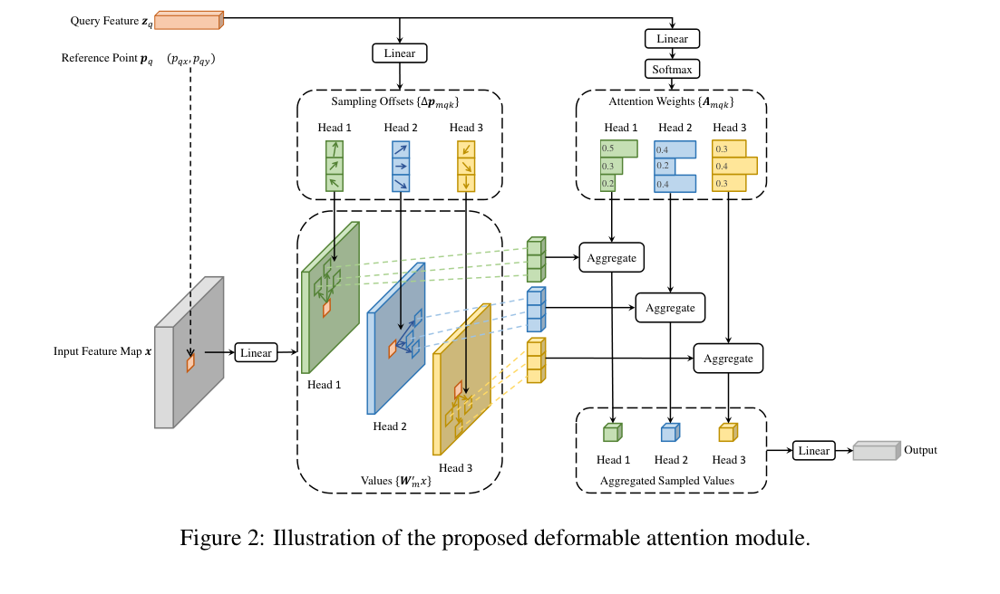
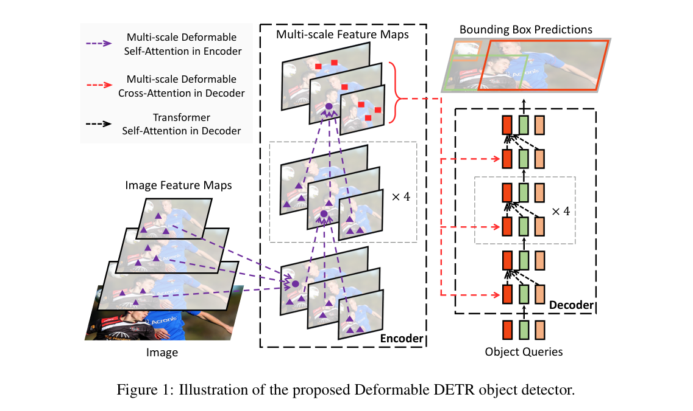

# 2026-07-29 — Multi-Scale Deformable Attention

> - **卡片状态：** 已完成公开论文与固定源码审计；算子未在本仓库独立运行
> - **来源论文：** [Deformable DETR: Deformable Transformers for End-to-End Object Detection](https://arxiv.org/pdf/2010.04159) · ICLR 2021 · [正式录用](https://openreview.net/forum?id=gZ9hCDWe6ke)
> - **官方实现：** [fundamentalvision/Deformable-DETR @ 11169a60c33333af00a4849f1808023eba96a931](https://github.com/fundamentalvision/Deformable-DETR/tree/11169a60c33333af00a4849f1808023eba96a931) · Apache-2.0
> - **机制家族：** Sparse Attention（稀疏注意力）
> - **迁移目标：** BEV Query · Temporal Memory · Multi-Modal Fusion · Sparse 3D Query
> - **证据标签：** [论文] · [源码] · [判断] · [未核验]

> **一句话 Taste：** 不让 query 平等地查看所有位置，而是先给它一个参考点，再把有限算力投到参考点周围少量、可学习的多尺度采样位置。

## 1. 先看瓶颈：为什么需要它

想象一辆车要在远处路口找到一个只占十几个像素的骑行者。普通全局注意力会让每个
query 与整张特征图的所有位置比较；高分辨率越有利于小目标，候选位置也越多。原始
DETR 还需要很长训练日程才能学会把注意力从大面积、近似均匀的区域收缩到目标附近。

[论文] 作者在 §1 和 §4.1（PDF pp. 1、5）把问题概括为两点：密集注意力处理图像特征图
时计算量大，而且收敛慢，尤其影响小目标。作者的解法不是再造一个更大的 backbone，
而是把“应该去哪里取证”本身变成可学习预测。

[判断] 真正可迁移的瓶颈不是“DETR 不够快”，而是：**当 query 已有一个粗位置先验时，
仍让它在所有空间位置平均花费预算。** 这一定义也适用于 BEV 网格、多相机投影、时序记忆
和稀疏 3D 查询；若任务根本没有可靠参考点，这个因果前提就不成立。

## 2. 原理图：它怎样执行

> **原图出处：** [论文] Figure 2，PDF p. 5，来自[官方 PDF](https://arxiv.org/pdf/2010.04159)；仅裁取理解模块所需区域，原图版权归原作者及其他权利人。

图从上到下可以读成四步。

1. **先给锚点。** 每个 query feature（查询特征）同时带一个归一化 reference point
   （参考点）。参考点说明“先从哪里附近找”，但它不是最终检测框。
2. **预测去哪看。** query 经线性层产生每个 head（注意力头）、每个尺度、每个采样点的
   二维 offset（偏移）。偏移加到参考点上，得到真正的采样位置。
3. **预测信谁。** 另一条线性层产生 attention weight（注意力权重），在该 query 的全部
   尺度与采样点上做 softmax，使有限证据预算可以自适应分配。
4. **采样再汇总。** 在各尺度特征图的非整数坐标做双线性采样，先按权重聚合，再经输出
   投影返回一个与 query 通道数相同的向量。

[源码] 固定实现的默认接口是：query shape 为（batch，query 数，256）；四层输入特征先
展平成（batch，各层像素数之和，256）；参考点可以是每层一个二维中心，也可以附带宽高。
默认 8 个头、4 个尺度、每尺度 4 个采样点，所以每个 query 最多聚合 8 × 4 × 4 = 128 个
head-level-point 组合，而不是对每个像素计算一份注意力权重。真实张量变形、坐标归一化和
CUDA 调用见固定版本的
[`MSDeformAttn.forward`](https://github.com/fundamentalvision/Deformable-DETR/blob/11169a60c33333af00a4849f1808023eba96a931/models/ops/modules/ms_deform_attn.py#L78-L116)。

## 3. 架构位置与接口合同

> **原图出处：** [论文] Figure 1，PDF p. 2，来自[官方 PDF](https://arxiv.org/pdf/2010.04159)；仅裁取理解模块所需区域，原图版权归原作者及其他权利人。

**位置与上下游。** backbone 输出多尺度图像特征；encoder 用该模块做多尺度可变形
self-attention（自注意力）；decoder 保留 object query 之间的普通全连接自注意力，只把
query 到图像特征的 cross-attention（交叉注意力）替换成该模块；最后仍由分类与框回归
heads 输出结果。固定落点见
[`DeformableTransformerEncoderLayer`](https://github.com/fundamentalvision/Deformable-DETR/blob/11169a60c33333af00a4849f1808023eba96a931/models/deformable_transformer.py#L189-L227)
和
[`DeformableTransformerDecoderLayer`](https://github.com/fundamentalvision/Deformable-DETR/blob/11169a60c33333af00a4849f1808023eba96a931/models/deformable_transformer.py#L261-L311)。

**输入合同。** 调用者必须给出 query、每个 query 在各层的参考点、拼平的多尺度 value、
各层高宽、各层在拼平序列中的起点，以及可选 padding mask。二维参考点以左上角为
（0，0）、右下角为（1，1）；固定源码随后用每层宽高归一化偏移。迁到相机、BEV 或 3D
坐标时，最容易出错的不是注意力公式，而是参考点究竟属于哪个坐标系。

**输出合同。** 输出 shape 与 query 相同，可以原位替换 Transformer attention 子层并接
残差、LayerNorm 与前馈网络；它不直接输出检测框，也不替代 task head。

**训练信号与梯度。** 模块没有独立标签。检测分类和框回归损失经输出投影、加权聚合、
采样值反向传播到 value 投影、注意力权重和采样偏移。双线性采样让采样坐标可微；padding
位置在 value 投影后被置零。没有证据表明每个采样点都得到同等直接监督。

**初始化与工程依赖。** 采样偏移的权重从零开始，bias 被排成不同注意力头、不同半径的
放射状网格；注意力权重初始为均匀分配。这给训练一个“先在参考点四周看”的起点。
主路径依赖仓库内的自定义 C++/CUDA op；每头通道数取 2 的幂时官方注释称 CUDA 更高效。
[未核验] 本仓库没有编译或测速该算子，因此这里只报告静态实现，不把源码阅读写成复现。

## 4. 设计 Taste：为什么值得迁移

**Taste 1：把算力分配规则变成预测对象。** 密集注意力默认“所有位置先付同样的比较成本”；
这里让 query 自己预测偏移和权重。迁移时应先问“我的稀缺预算是什么”，再问“哪个条件量
足以预测预算去向”，而不是机械照搬可变形采样。

**Taste 2：参考点负责可搜索性，偏移负责可适应性。** 只有局部窗口，目标移出窗口就会漏；
只有全局搜索，成本又回来。参考点把搜索域缩小，学习偏移允许各 head 离开规则网格，二者
共同形成“有先验但不被先验锁死”的结构。

**Taste 3：同一稀疏接口统一多尺度证据。** 每层都把位置归一化后纳入同一组权重，query
可以在高分辨率层找边缘、在低分辨率层找上下文。这里的创新不是“使用多尺度”本身，而是
让跨尺度选择与空间采样由同一个 query 联合决定。

**Taste 4：可替换边界写得很干净。** 输入和输出通道保持不变，encoder、decoder、残差块和
heads 不必一起重写；但这只是网络接口上的可替换。坐标生成、算子编译、显存访问和参考点
质量仍是系统级耦合，不能把它宣传成真正零成本的“即插即用”。

## 5. 证据、边界与反证实验

**模块级证据。** [论文] Table 2（PDF p. 9）在 COCO 2017 val 上报告：仅把单尺度输入改成
多尺度输入，AP 从 39.7 增至 41.4，小目标 AP 从 21.2 增至 24.1；每层每头采样点 *K* 从 1
增至 4 后，AP 从 41.4 增至 42.3；再允许多尺度可变形注意力跨尺度聚合，AP 从 42.3 增至
43.8。论文正文据此分别归纳 +1.7、+0.9 和 +1.5 AP。这里最后一组干预与证据粒度最接近
本卡模块，但仍只发生在 Deformable DETR 与 COCO 设置中。

**系统级证据。** [论文] Table 1（PDF p. 8）中，DETR 训练 500 epochs 得到 42.0 AP；基础
Deformable DETR 训练 50 epochs 得到 43.8 AP，训练 GPU hours 从 2000 降至 325。可是其
推理速度是 19 FPS，低于表中 DETR 的 28 FPS。因而证据支持“更快收敛”，不支持“所有阶段
都更快”。这行比较同时替换了注意力、多尺度特征等系统组件，也不能把 1.8 AP 全归给单个
算子。

**已知边界。** 采样预算固定且稀疏，参考点偏离目标时可能看不到纠正它所需的远处证据；
跨相机、跨帧和跨传感器迁移还会叠加标定误差与坐标不连续；自定义 CUDA op 的无序显存访问
也可能让 FLOPs 降低却不带来端到端延迟收益。

**仍不知道。** 原论文没有验证相机标定漂移、长时遮挡、极稀疏雷达、不同加速器或安全关键
漏检下的退化曲线。它也没有证明 4 个采样点在其他分辨率和任务上仍是最佳预算。

**最小反证实验。** 固定 backbone、heads、训练步数和总通道，只把原 cross-attention 换成
本模块；同时扫描每层采样点数 1、2、4、8，并人为给参考点加入由小到大的坐标扰动。记录
主指标、远小目标召回、峰值显存与端到端延迟。如果增益只在无扰动时出现，或同等延迟下
不优于局部窗口 / top-k 基线，就应推翻“该任务能从参考点引导的稀疏采样获益”的迁移假设。

## 6. 适用场景与最小接入方案

**更适合。** 高分辨率二维或 BEV 特征、query 数远少于候选位置、已有几何投影或上一帧状态
可提供粗参考点、目标尺度差异大、训练收敛是主要成本的任务。仓库中的
[BEVFormer 精读](../../notes/2026/2026-07-27-bevformer.md)就是一个已公开的迁移实例：它把
参考点投影到多相机，并对时空 BEV query 做定制的可变形取证。

**不太适合。** 没有可信空间锚点、特征图已经很小、任务依赖全局所有 token 精确交互、硬件
不支持定制采样算子，或参考点误差本身就是主要故障源的场景。此时规则局部窗口、低秩注意力
或显式候选生成可能更容易审计。

**自动驾驶感知的四个迁移接口。**

- **BEV Query：** 用相机几何或 LiDAR voxel 中心给参考点，让每个 BEV query 只从投影邻域取证；
- **Temporal Memory：** 用 ego-motion 对齐后的上一帧状态给参考点，偏移负责补偿残余运动；
- **Multi-Modal Fusion：** 先把参考点映射到各传感器坐标，再分别采样并学习模态权重；
- **Sparse 3D Query：** 让候选中心在多尺度 voxel / point 特征中稀疏取证，保留检测 head 不变。

**最小接入顺序。** 先保留现有 backbone、heads、损失和训练日程；实现一个只替换单层
cross-attention 的版本；用单尺度、单头、1 个采样点验证坐标和梯度；再扩展到多头多尺度；
最后才打开时序或多模态。任何阶段若主指标、困难切片或端到端延迟没有改善，都能回滚到原
attention。固定源码采用 [Apache-2.0 许可证](https://github.com/fundamentalvision/Deformable-DETR/blob/11169a60c33333af00a4849f1808023eba96a931/LICENSE)，实际复用前仍需审计依赖和目标项目许可证。
