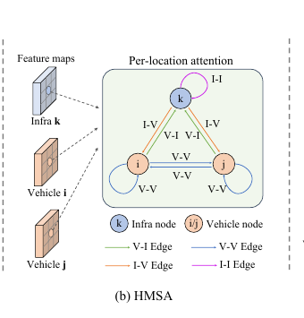

# 2026-08-02 — Heterogeneous Multi-Agent Self-Attention (HMSA)

> - **卡片状态：** 已完成；论文与固定源码已审，checkpoint 与数据未运行
> - **来源论文：** [V2X-ViT: Vehicle-to-Everything Cooperative Perception with Vision Transformer](https://www.ecva.net/papers/eccv_2022/papers_ECCV/papers/136990106.pdf) · ECCV 2022 · Accepted
> - **正式录用：** [ECVA proceedings](https://www.ecva.net/papers/eccv_2022/papers_ECCV/html/4589_ECCV_2022_paper.php)
> - **官方实现：** [DerrickXuNu/v2x-vit @ f0e6c13f41e916548b2d8aba61e42a18ce980416](https://github.com/DerrickXuNu/v2x-vit/tree/f0e6c13f41e916548b2d8aba61e42a18ce980416)
> - **机制家族：** Type-Conditioned Relational Attention
> - **迁移目标：** Multi-Sensor BEV · Cooperative Occupancy · Temporal Memory · Multi-Robot Fusion
> - **证据标签：** [论文] · [源码] · [判断] · [未核验]

> **一句话 Taste：** 当多个来源已经落在同一坐标格，却具有离散可知的角色差异时，
> 不要只给 token 加 type embedding；让节点类型决定 Q/K/V，让有向关系类型决定
> attention 与 message 变换，再用参数量匹配对照检验“类型语义”是否真的有价值。

## 1. 先看瓶颈：为什么需要它

**30 秒问题故事。** ego 车辆在路口被公交车遮挡，另一辆车和路侧杆都给同一个
BEV cell 发来证据。三份特征的 shape 一样、坐标也已对齐，但它们并不等价：路侧
LiDAR 更高、遮挡更少；车载 LiDAR 更贴近路面；“路侧→车辆”与“车辆→路侧”
也可能代表不同信任关系。普通 multi-agent self-attention 把所有来源共用一套
Q/K/V，相当于要求网络只从内容猜出角色。

**[论文] 作者瓶颈：** V2X 系统由车辆与基础设施构成异构图，安装高度、视角、
噪声和硬件条件不同；既有 V2V 融合主要按同质节点设计。作者因此为节点类型和
有向边类型分配不同参数。来源：论文 §1、§3.2，PDF p. 2、7。

**[判断] 笔记因果重建：** 这是本笔记根据前述瓶颈与论文结构所做的因果重建，
不是作者原句。若角色差异是离散、稳定且在推理时已知，关系参数比让单一投影同时
拟合所有域更容易表达“谁向谁发什么”；但若异构性是连续质量变化，二值类型会把
复杂现实压扁成过粗先验。

## 2. 原理图：它怎样执行

> **原图出处：** [论文] Figure 3b，PDF p. 6，来自[官方 PDF](https://www.ecva.net/papers/eccv_2022/papers_ECCV/papers/136990106.pdf)；仅裁取理解 HMSA 所需区域，原图版权归原作者及其他权利人。

**按真实执行顺序读：**

1. **节点分型：** 每个 agent 取 vehicle 或 infrastructure 类型；固定源码中
   `infra=1`，vehicle=0。
2. **类型专属 Q/K/V：** 对每个节点、每个 BEV cell，按节点类型选择不同线性层，
   得到 8 heads、每 head 32 维的 query、key、value。
3. **有向边分型：** 目标类型 × 来源类型映射为 V→V、V→I、I→V、I→I 四类；
   每类、每 head 都有 attention 关系矩阵和 message 关系矩阵。
4. **同位置打分：** 对固定空间 cell，只在 agent 轴比较来源；关系矩阵进入
   query-key 双线性分数，valid/ROI mask 去掉填充或 warp 出界来源。
5. **关系化消息：** value 先经 edge-type message 矩阵，再按 softmax 权重求和。
6. **目标类型输出：** 拼接 heads，按目标节点类型做输出投影、dropout 与 residual；
   下一模块 MSwin 才在空间窗口内移动信息。

**关键分界：** HMSA 不是全局空间 attention。它假设不同 agent 的相同 *(h,w)*
已经代表近似相同物理位置；若几何对齐失败，它本身不会从邻近 cell 搜索正确证据。

## 3. 架构位置与接口合同

**位置与上下游：** **[论文/源码]** 上游是 PointPillar、通信压缩、DPE 与 STTF
warp；HMSA 是每个 V2X-ViT block 的第一段，下游是 MSwin、MLP，最后只取 ego
槽位进入 anchor detection head。来源：论文 Figure 2–3，PDF p. 3、6；
[固定 block](https://github.com/DerrickXuNu/v2x-vit/blob/f0e6c13f41e916548b2d8aba61e42a18ce980416/v2xvit/models/sub_modules/v2xvit_basic.py#L82-L121)。

**输入：** 默认 *B* × *M* × 176 × 48 × 256 的 BEV 特征，*M*≤5；另有
节点/ROI mask 与 *B* × *M* × 3 prior，其中只有 infra type 被 HMSA 消费。
velocity 和 delay 被读取到局部变量，但 HMSA 不使用其数值。

**输出：** 与输入完全同 shape 的关系融合特征；节点数、BEV 分辨率与 ego 坐标系
不变。output 没有跨帧持久状态，残差保证 homogeneous content path 仍存在。

**shape 与坐标系：** 176×48 来自 *x*≈281.6 m、*y*=76.8 m 范围在 0.4 m voxel
和总 stride 4 后的网格。非 ego 点云先投到 delayed ego frame，STTF 再尝试 warp
到 current ego frame；HMSA 只对同一 grid index 的 agents 做注意力。

**节点与边语义：** 固定源码按 `type1 * 2 + type2` 选择四类关系参数；这里的
type1/type2 是目标/来源循环索引。迁移时必须先写清方向约定，否则 I→V 与 V→I
会被静默交换。

**训练信号与真实梯度：** HMSA 没有直接 loss。ego 分类 focal loss 与 box
smooth L1 经 head → 三层 encoder → residual 间接训练类型化 Q/K/V、relation
attention、relation message 和 type-specific output。mask 为 0 的来源在 softmax
前填负无穷，对应 message path 被阻断；其他来源及 residual 仍可传梯度。没有
teacher forcing、oracle box 或 HMSA attention supervision。

**初始化：** **[源码]** relation attention/message 矩阵用 Xavier uniform；
Q/K/V 与输出线性层沿用 PyTorch 默认初始化。固定 config 为 8 heads、head dim 32、
dropout 0.3，三层 encoder，每层一个 fusion block。来源：
[固定 HMSA](https://github.com/DerrickXuNu/v2x-vit/blob/f0e6c13f41e916548b2d8aba61e42a18ce980416/v2xvit/models/sub_modules/hmsa.py#L7-L37)。

**算力与内存依赖：** 同一 cell 需要构造 *M*×*M* 关系和注意力，agent 轴随
*M*² 增长；固定 *M*≤5 时可控，但不适合把几十个节点不加筛选地直接堆叠。
源码还用 Python batch/agent 双重循环选择类型层，实际 latency 受实现而非只有
理论 FLOPs 决定。论文没有单独报告 HMSA latency 或参数量。

**固定源码入口：** [类型 Q/K/V、关系矩阵、mask 与消息汇总 @ 固定 SHA](https://github.com/DerrickXuNu/v2x-vit/blob/f0e6c13f41e916548b2d8aba61e42a18ce980416/v2xvit/models/sub_modules/hmsa.py#L38-L151)。

## 4. 设计 Taste：为什么值得迁移

**瓶颈 → 设计约束。** 多来源特征已经几何对齐，但来源角色不同；角色在推理时
可知，并且“来源角色→目标角色”具有方向性。因此需要一个不改变空间分辨率、
能保留有向关系、还能退回 residual baseline 的融合单元。

**设计约束 → 机制。** 节点类型控制 content projection，边类型控制 pairwise
interaction；把两者分开，既能复用同一结构，也避免为每个具体 agent 建独立网络。

**机制 → 预期作用。** 在路侧可见、车端遮挡的 cell，I→V 关系可以学到不同于
V→V 的打分与消息变换；在只有车辆协作时，模块仍退化到 V→V 关系。

**预期作用 → 证据。** **[论文]** Table 2 的 progressive ablation 在已经加入
MSwin 与 split attention 后，把 homogeneous attention 替换为 HMSA，AP@0.7
从 0.548 到 0.601。这个干预支持类型化关系在 V2XSet noisy protocol 中有效。

**可迁移原则：** “同 shape”不代表“同分布”。若 source/target roles 是稳定、
可观测的离散变量，应把角色作用落到投影与有向关系，而不只把 type token 拼到
输入后交给单一 attention 自行分离。

## 5. 证据、边界与反证实验

**最强模块级证据：** **[论文]** Table 2 相邻两行只新增 HMSA：0.548→0.601
AP@0.7，+0.053 绝对点，约 +9.7% 相对；AP@0.5 为 0.786→0.823，+0.037。
作者正文写 HMSA 增加 6.6%，与原表相邻行差值不是同一口径，本卡不替作者猜测。

**证据支持：** 在同一 V2XSet、PointPillar backbone、progressive 组件顺序和
Noisy Setting 下，类型化节点/边关系比前一行的同质融合更好。

**证据不支持：**

- **[未核验]** 没有参数量匹配 homogeneous attention，不能排除额外容量贡献；
- **[未核验]** 没有随机 type、错 type、缺 infra 或同类传感器异构性对照；
- **[未核验]** 没有真实 V2X、跨 simulator、多类别、occupancy 或预测任务证据；
- **[判断]** attention map 变亮不等于因果重要性，也不证明被攻击节点会被降权；
- **[判断]** 更高 AP 不等于更低通信时延、更好校准或更安全。

**最大失效条件：** 上游坐标误差大到同一物体落入不同 cells 时，HMSA 只在错误的
同位置集合里比较，可能把无关消息高置信融合；若 type 标签错误、同类内部质量差异
很大或存在恶意节点，二值角色先验也可能强化错误关系。

**最小反证实验：** 固定 backbone、MSwin、DPE、训练预算和总参数量，比较四组：
homogeneous attention、HMSA、随机打乱 type 的 HMSA、连续质量条件 attention。
在 perfect、固定 bias、逐节点独立噪声、慢漂移与错 type 下各跑至少五个 seeds；
报告 AP@0.7、校准误差、最坏 5% 场景和 latency。

**什么结果会推翻迁移假设：** 若参数匹配 homogeneous 与真实 HMSA 在多 seed
差异不稳定，或随机 type 与真实 type 同样好，则“角色语义值得显式关系参数化”
不成立；若连续质量条件显著更稳，则二值类型只能作为弱 baseline。

## 6. 适用场景与最小接入方案

**适合：**

- 已对齐到同一 BEV/voxel 网格的车辆—路侧、多传感器或多机器人特征；
- 节点角色少、方向关系明确、每样本节点数较小；
- 下游已有稳定 detection/segmentation loss，可让融合模块通过共享任务间接训练。

**不适合：**

- 尚未建立共同坐标系，或主要误差是大幅跨 cell 几何错位；
- 节点数很大且通信选择尚未完成，无法承受 *M*² pairwise 计算；
- 异构性主要是连续 SNR、标定质量、延迟和可信度，却只有粗糙 type ID；
- 安全要求需要显式不确定性/故障隔离，而模块只输出普通 attention。

**自动驾驶迁移接口：** 在相机 BEV + LiDAR BEV 融合中，可把 camera/LiDAR 当
节点类型，把 Camera→LiDAR 与 LiDAR→Camera 当有向关系；在协同 occupancy 中，
可把 vehicle/infra 当类型，但必须先用 pose warp 并提供 valid ROI mask。迁移只
表示接口值得受控测试，不表示零改动必然提升。

**最小接入顺序：**

1. 保留现有 homogeneous attention 作为回滚基线，冻结其余 backbone/head；
2. 统一输入为 *B*×*M*×*H*×*W*×*C*，明确 source/target 方向与 type 编码；
3. 先仅替换 Q/K/V 与 output 为 type-specific，参数量匹配 baseline；
4. 再加入 edge-type attention matrix，最后加入 message matrix；
5. 每一步记录 AP/IoU、校准、latency、显存、错 type 与坏节点压力测试；
6. 只有多 seed 和故障条件都通过，才扩展到更多类型或更大节点数。

**回滚基线：** 单一 Q/K/V 的 homogeneous multi-agent attention + residual；若
HMSA 在真实验证集、错 type 或 latency 门槛上不占优，保留原模块和相同接口即可
回滚，不需要改下游 head 或 loss。

**许可证与复现状态：** **[源码]** 作者仓库为 MIT；固定 SHA 是
`f0e6c13f41e916548b2d8aba61e42a18ce980416`。**[未核验]** 本卡未下载 V2XSet
或 checkpoint、未编译 CUDA/Cython NMS、未运行前向/训练/消融；`Audited` 只指
静态源码检查，不代表论文结果已复现。
