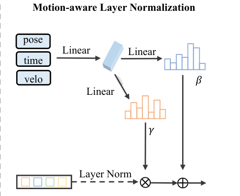

# 2026-08-03 — Motion-Aware Layer Normalization (MLN)

> - **卡片状态：** 已完成；论文与固定源码已审，checkpoint 与数据未运行
> - **来源论文：** [Exploring Object-Centric Temporal Modeling for Efficient Multi-View 3D Object Detection](https://openaccess.thecvf.com/content/ICCV2023/papers/Wang_Exploring_Object-Centric_Temporal_Modeling_for_Efficient_Multi-View_3D_Object_Detection_ICCV_2023_paper.pdf) · ICCV 2023 · Accepted
> - **正式录用：** [CVF proceedings](https://openaccess.thecvf.com/content/ICCV2023/html/Wang_Exploring_Object-Centric_Temporal_Modeling_for_Efficient_Multi-View_3D_Object_Detection_ICCV_2023_paper.html)
> - **官方实现：** [exiawsh/StreamPETR @ 95f64702306ccdb7a78889578b2a55b5deb35b2a](https://github.com/exiawsh/StreamPETR/tree/95f64702306ccdb7a78889578b2a55b5deb35b2a)
> - **机制家族：** Motion-Conditioned Normalization
> - **迁移目标：** Temporal BEV · Object Query Memory · Multi-Modal Tracking · Cooperative Perception
> - **证据标签：** [论文] · [源码] · [判断] · [未核验]

> **一句话 Taste：** 当历史状态必须与当前观测比较、却同时受坐标运动和时间陈旧
> 影响时，先把显式几何变换与特征条件化分工：中心用姿态变换，表示用恒等初始化的
> 条件 LayerNorm；再用 plain LN、显式补偿和逐条件消融证明收益来自哪里。

## 1. 先看瓶颈：为什么需要它

**30 秒问题故事。** 自车转弯时，上一帧保留了一张“前方车辆”的对象卡片。只把
三维中心乘位姿矩阵，能把静态坐标换到当前车体系，却不能告诉 256 维内容特征：
这张卡片隔了多久、对象自身以多快速度运动、视角变化多大。若直接按预测速度硬移
中心，速度一点误差又会被时间差放大。MLN 的做法不是再造一个运动预测器，而是让
这些运动元数据决定特征每个通道“放大多少、平移多少”。

**[论文] 作者瓶颈：** StreamPETR 先用自车位姿显式变换历史中心，但独立运动对象
仍会产生位置偏差；作者指出基于预测速度的显式补偿受速度精度限制，因此希望把
ego pose、时间差和速度作为条件，以隐式方式建模运动。来源：论文 §4.3，PDF p. 4。

**[判断] 笔记因果重建：** 这是本笔记根据前述瓶颈与论文结构所做的因果重建，
不是作者原句。几何中心与高维语义特征承担不同职责：刚体变换适合修正坐标系，
条件仿射适合提示“这份表示在什么运动上下文产生”。两者分工可避免把不精确速度
强行解释为精确位移；但它只是一种软条件化，不能自动校准错误运动元数据。

## 2. 原理图：它怎样执行

> **原图出处：** [论文] Figure 4，PDF p. 4，来自[官方 PDF](https://openaccess.thecvf.com/content/ICCV2023/papers/Wang_Exploring_Object-Centric_Temporal_Modeling_for_Efficient_Multi-View_3D_Object_Detection_ICCV_2023_paper.pdf)；仅裁取理解 MLN 所需区域，原图版权归原作者及其他权利人。

**按真实执行顺序读：**

1. **先修中心坐标：** 用当前自车位姿的逆乘历史位姿，再把历史三维中心换到当前
   自车坐标系；这一步是显式刚体变换，不属于 MLN 的通道仿射。
2. **组运动条件：** 对历史槽拼接二维预测速度、标量时间差和 3×4 相对位姿，
   合计 15 个原始数；当前新查询使用零速度、零时间与单位位姿。
3. **编码条件：** 固定源码以 NeRF-style 正弦/余弦编码把 15 维扩到 180 维，
   再经 180→256 线性层与 ReLU 得到条件表示。
4. **归一化特征：** 256 维对象内容或三维位置编码先经关闭 affine 的 LayerNorm，
   消除其自身均值和尺度差异。
5. **生成仿射参数：** 两个 256→256 线性层分别产生逐通道 γ 和 β；γ 分支以
   输出 1 初始化、β 分支以输出 0 初始化，所以刚接入时近似恒等。
6. **调制并送入注意力：** 输出为 γ×LN(feature)+β，shape 不变；内容和位置
   各用一个独立 MLN 实例，然后进入传播查询和混合注意力。

**关键分界：** MLN 不是 LayerNorm 后简单拼接 metadata，也不是显式把中心按
速度外推。它改变注意力所见的高维表示；对象中心仍由刚体变换与 decoder 修正。

## 3. 架构位置与接口合同

**位置与上下游：** **[论文/源码]** 上游是对象记忆读取与 ego-pose 中心对齐；
MLN 位于 StreamPETRHead 的 `temporal_alignment` 内，下游是最新 256 个传播查询、
其余历史 key/value 和六层 temporal decoder。来源：论文 Figure 4、§4.3，PDF p. 4；
[固定 SHA 调用](https://github.com/exiawsh/StreamPETR/blob/95f64702306ccdb7a78889578b2a55b5deb35b2a/projects/mmdet3d_plugin/models/dense_heads/streampetr_head.py#L420-L449)。

**输入：** 特征 *x* 为 *B*×*M*×256；历史条件原始 shape 为 *B*×*M*×15，
由二维速度、1 维时间差和 12 个相对位姿元素组成，经位置编码后为
*B*×*M*×180。这里 *M* 是当前查询数或历史槽数，不是图像空间大小。

**输出：** 与 *x* 完全同 shape 的 256 维调制特征。源码分别实例化
`ego_pose_memory` 和 `ego_pose_pe`，使内容与位置条件化参数不共享；模块不输出
框、速度、置信度或新的持久状态。

**shape、坐标系与状态：** 三维中心在当前 ego frame 读取、global frame 写回；
MLN 条件含历史到当前的位姿语义，但只作用于 feature channel。输入 memory 是
prediction-relevant state，且在上一帧写回时已经 detach；MLN 本身无跨调用状态。

**训练信号与真实梯度：** MLN 没有直接 loss。当前帧 3D focal 分类、L1 框回归
和去噪 losses，经 decoder attention 直接训练两个 MLN 的条件编码、γ、β 参数；
二维辅助 loss 训练共享图像特征/Focal Head，但不直接监督 MLN。历史内容、中心、
速度在写回时 detach，因而梯度不会跨帧回到旧预测；被 mask/reset 的历史槽也不
提供有效读取路径。来源：[固定 SHA 写回](https://github.com/exiawsh/StreamPETR/blob/95f64702306ccdb7a78889578b2a55b5deb35b2a/projects/mmdet3d_plugin/models/dense_heads/streampetr_head.py#L345-L374)。

**初始化：** **[源码]** 条件 reduce 层沿用 PyTorch 线性层默认初始化；γ/β 权重
全零，γ bias 为 1、β bias 为 0，LayerNorm 关闭 elementwise affine。模块初始
不依赖运动条件，训练可从原表示平滑进入条件表示。来源：
[固定 SHA MLN](https://github.com/exiawsh/StreamPETR/blob/95f64702306ccdb7a78889578b2a55b5deb35b2a/projects/mmdet3d_plugin/models/utils/misc.py#L154-L188)。

**算力与内存依赖：** 每个 token 需要一个 180→256 reduce 和两个 256→256
线性映射；计算随 token 数线性增长。论文只报告完整 StreamPETR 的 FPS，没有
单独给 MLN FLOPs、latency、显存或参数量，不能把“negligible”精确归给 MLN。

**固定源码入口：** [MLN forward、仿射关闭与恒等初始化 @ 固定 SHA](https://github.com/exiawsh/StreamPETR/blob/95f64702306ccdb7a78889578b2a55b5deb35b2a/projects/mmdet3d_plugin/models/utils/misc.py#L154-L188)。

## 4. 设计 Taste：为什么值得迁移

**瓶颈 → 设计约束。** 历史状态已被保存，但生成它的坐标、时刻与运动上下文和
当前不同；条件在推理时可观测，却可能带噪。因此模块要保持 feature shape、不
引入精确运动外推假设，并能在训练初期退回原表示。

**设计约束 → 机制。** 用显式刚体变换处理可信的坐标系变化，用条件 LayerNorm
处理不宜硬编码的表示变化；γ=1、β=0 初始化使接入点可回滚，且不改变上下游接口。

**机制 → 预期作用。** 当前 attention 可区分“同样内容但姿态/时间/速度不同”的
历史卡片，而无需为每种运动条件复制 decoder；内容与位置使用独立参数，也避免
假定二者应有完全相同的通道重标定。

**预期作用 → 证据。** **[论文]** Table 6 在同一 R50 消融设置中，把无 MLN
替换为完整 ego pose + time + velocity MLN，mAP 0.378→0.402、NDS
0.483→0.505；plain LN 为 0.375/0.481，显式 motion compensation 为
0.380/0.481。它支持“条件仿射比这些表内替代更有效”，不证明所有任务普适。

**可迁移原则：** 当状态内容要跨域、跨时或跨坐标系复用时，把“核心表示”和
“生成上下文”分开：先把核心表示标准化，再让低维、可观测上下文生成恒等初始化
的逐通道仿射；同时保留一个明确的无条件归一化回滚基线。

## 5. 证据、边界与反证实验

**最强模块级证据：** **[论文]** Table 6 的完整 MLN 相对 baseline：mAP
0.378→0.402，+0.024 绝对点、约 +6.35% 相对；NDS 0.483→0.505，+0.022、
约 +4.55% 相对。表内同时有 plain LN 与显式补偿，证据粒度强于只看全模型主结果。

**证据支持：** 在作者 nuScenes、R50、24-epoch 消融协议中，运动条件 LayerNorm
比无 MLN、普通 LN 和所实现的显式运动补偿更好；ego pose 条件贡献最大。

**证据不支持：**

- **[论文]** ego-only 已达 0.398/0.501，加入 time+velocity 只再 +0.004/+0.004；
  不能把完整 +0.024/+0.022 分别归给速度或时间；
- **[未核验]** 没有多 seed、置信区间、参数量匹配 MLP 拼接或 FiLM 等条件化对照；
- **[未核验]** 没有错误 ego pose、速度噪声、时间戳抖动、漏帧或长间隔压力测试；
- **[未核验]** 没有单独 MLN latency/FLOPs，也没有 LiDAR、radar、occupancy、
  协同感知或真实车端迁移证据；
- **[判断]** NDS/mAP 改善不等于更好校准、更低最坏风险或更安全。

**最大失效条件：** 当运动元数据系统性错误、历史状态已是高置信假阳性，或需要
非通道仿射的几何重匹配时，MLN 可能把错误上下文稳定地写入表示。尤其速度来自
模型旧预测且 detach，错误不能靠跨帧梯度纠正；Table 6 又显示 time/velocity 的
增量很小，迁移时把它们当核心贡献会过度外推。

**最小反证实验：** 固定 backbone、memory、decoder、token 数和参数预算，比较
无条件 LayerNorm、MLN、metadata concat+MLP、显式 warp+plain LN；MLN 再做
ego-only、time-only、velocity-only、随机条件、加噪条件。至少五 seeds，按距离、
遮挡和时间间隔分桶报告 mAP/NDS、ECE、状态假阳性存活时间、latency 和显存。

**什么结果会推翻迁移假设：** 若随机/打乱条件与真实条件同样好，或参数匹配
concat+MLP 稳定优于 MLN，则“运动元数据通过条件归一化提供有用归纳偏置”不成立；
若加少量元数据噪声即低于 plain LN，则它不适合作为鲁棒时序接口。

## 6. 适用场景与最小接入方案

**适合：**

- 时序 BEV、对象查询或轨迹记忆已经有显式状态读取点；
- 坐标、时间、传感器姿态或质量元数据在推理时可获得且维度较低；
- 上下游要求 feature shape 不变，接入必须能恒等初始化与快速回滚；
- 下游有稳定检测、分割或匹配 loss，可间接训练条件化参数。

**不适合：**

- 主要问题是跨 cell 大幅几何错位，必须先做搜索、匹配或可变形采样；
- 元数据缺失、未经标定或在部署域系统性偏移；
- 需要显式概率不确定性、故障隔离或物理约束，而模块只输出普通特征；
- token 数巨大且三层逐 token MLP 成本已超过预算。

**自动驾驶迁移接口：** 在 temporal BEV 中，输入可为旧 BEV token，条件为相对
ego pose、Δ*t* 与 flow；在 camera–radar 融合中，条件可换成标定、延迟与质量，
但必须先做空间对齐；在协同感知中可调制已 warp 的 agent features，同时把位姿
协方差作为条件候选。可迁移只表示接口值得受控测试，不表示零改动必然提升。

**最小接入顺序：**

1. 保留原始 plain LayerNorm 或 identity path 作为回滚基线；
2. 明确 feature shape、条件来源、坐标方向、缺失值和 reset 语义；
3. 先只接入最可信条件，例如 ego pose，并用 γ=1、β=0 初始化；
4. 再分别加入 Δ*t*、速度或质量，逐项做有无干预与错值压力测试；
5. 记录精度、校准、最坏分桶、latency、显存和多 seed 方差；
6. 只有真实条件优于打乱条件且噪声下不劣于 baseline，才扩展到更多元数据。

**回滚基线：** 关闭条件分支，恢复相同位置的 plain LayerNorm；若 MLN 在真实
验证集、噪声条件或 latency 门槛上不占优，上下游 shape 完全不变，可直接回滚，
无需重写 memory、attention 或 prediction head。

**许可证与复现状态：** **[源码]** 作者仓库为 Apache-2.0；固定 SHA 是
`95f64702306ccdb7a78889578b2a55b5deb35b2a`。**[未核验]** 本卡未下载 nuScenes
或 checkpoint、未编译旧 CUDA/flash-attention 栈、未运行前向/训练/Table 6
消融；`Audited` 只指固定源码静态检查，不代表论文结果已复现。
