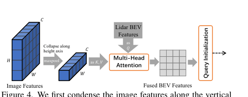

# 2026-08-05 — Image-Guided Query Initialization

> - **卡片状态：** 完成；论文与固定源码已审，checkpoint 未运行
> - **来源论文：** [TransFusion: Robust LiDAR-Camera Fusion for 3D Object Detection with Transformers](https://openaccess.thecvf.com/content/CVPR2022/html/Bai_TransFusion_Robust_LiDAR-Camera_Fusion_for_3D_Object_Detection_With_Transformers_CVPR_2022_paper.html) · [官方 PDF](https://openaccess.thecvf.com/content/CVPR2022/papers/Bai_TransFusion_Robust_LiDAR-Camera_Fusion_for_3D_Object_Detection_With_Transformers_CVPR_2022_paper.pdf) · CVPR 2022 · Accepted
> - **官方实现：** [XuyangBai/TransFusion @ 73c596f7bd3460c17cbcc58dd9bcc5a0896774a8](https://github.com/XuyangBai/TransFusion/tree/73c596f7bd3460c17cbcc58dd9bcc5a0896774a8)
> - **机制家族：** Cross-Modal Proposal Prior
> - **迁移目标：** Sparse-BEV Query Detection · Radar-Camera Fusion · Cooperative BEV · Open-World Proposal Recall
> - **证据标签：** [论文] · [源码] · [判断] · [未核验]

> **一句话 Taste：** 当主传感器能提供可靠几何、却会漏掉稀疏小目标时，让辅助模态只预测“候选可能在哪里”的稠密先验，并以 stop-gradient 的方式参与 top-K；这种可回滚接口比直接改写主特征更容易受控，但依赖固定视图结构、额外算力和可校准的辅助热力图。

## 1. 先看瓶颈：为什么需要它

### 30 秒问题故事

一辆车驶向远处路口：LiDAR 在一个骑行者上只有两三个点，主检测器的 BEV 中心热力图把它排在 top-200 之外。后面的 Transformer 即使有再强的图像融合，也看不到这个目标，因为对象查询根本没被创建。最直接的补救不是把所有图像特征写入 LiDAR BEV，而是让相机额外回答一个更小的问题：“哪些 BEV 位置值得成为候选？”Image-Guided Query Initialization 就把图像压成每列摘要，用 cross-attention 生成一张辅助 BEV 热力图，再与 LiDAR 热力图共同选 query。

**作者明确提出的瓶颈：** [论文] TransFusion §3.6，PDF p. 5 指出仅由 LiDAR 特征选择对象查询可能造成次优召回；高分辨率图像对点云稀疏的小目标仍有检测能力，因此图像应在 query 初始化阶段提供位置提示。

**笔记因果重建：** [判断] 这是本笔记根据前述瓶颈与论文结构所做的因果重建，不是作者原句：最终图像融合只能改善“已进入 query 集合”的物体，所以若主要失败发生在 top-K 之前，就应把辅助模态接到 proposal prior，而不是只加深后端融合。用同形状 heatmap 作为接口，还能随时回滚为 LiDAR-only 选择器。

## 2. 原理图：它怎样执行

> **原图出处：** [论文] Bai et al., CVPR 2022, Figure 4，PDF p. 5 / proceedings p. 1094，来自[官方 PDF](https://openaccess.thecvf.com/content/CVPR2022/papers/Bai_TransFusion_Robust_LiDAR-Camera_Fusion_for_3D_Object_Detection_With_Transformers_CVPR_2022_paper.pdf)；仅裁取理解模块所需区域，原图版权归原作者及其他权利人。

### 执行顺序

1. **压通道但不压列：** 固定配置用 ResNet50/FPN 产生六路 256 通道图像特征，再由 3 × 3 卷积投影到 128 通道。对每路图像在高度轴做 max-pool，保留宽度列序列；在 448 × 800 输入与 stride 4 的 FPN level 0 下，静态推导每路约为 128 × 200。
2. **把 BEV 当 query：** LiDAR neck 的 512 通道输出经共享卷积成为 128 × 180 × 180；展平为 32,400 个 BEV query。
3. **逐相机更新：** 六路相机各有一个 cross-only Transformer decoder。每个 decoder 让所有 BEV query 从该视图的 200 个列 token 取证；BEV 被按固定相机顺序连续更新六次。
4. **生成辅助热力图：** 最终图像更新 BEV 经 heatmap head 输出十类、180 × 180 的图像引导 logits。
5. **只在选择层融合：** LiDAR 与图像 logits 分别 sigmoid 并 detach，概率逐点等权平均；每类做局部峰值筛选，再在十类与所有 BEV 位置中统一取 top-200。
6. **回到主模态特征：** 所选 query 的内容从原始 LiDAR BEV gather，图像更新 BEV只决定索引，不直接成为 query feature；后续 LiDAR decoder 和 SMCA 融合照常执行。

**关键直觉：** 图像只拥有“提名权”，没有直接覆盖 LiDAR query 内容的权力。若模块无效，可把平均热力图换回 LiDAR heatmap，而不重写下游检测 head。

## 3. 架构位置与接口合同

### 位置与上下游

**上游：** 冻结的 ResNet50/FPN 图像 backbone/neck 与冻结的 LiDAR VoxelNet/SECOND/SECONDFPN；两者都由第二阶段训练前的外部权重初始化。

**模块位置：** 图像 FPN → shared_conv_img → height max-pool → 六个 per-view cross-only decoders → heatmap_head_img → detached heatmap average → local max / top-K。

**下游：** 被选的 200 个索引从 LiDAR BEV gather query feature，随后进入 TransFusion 的第一 LiDAR decoder 与最终 SMCA decoder。

### 输入合同

**图像输入：** [源码] 六路图像 FPN level 0 特征，固定配置通道 256；shared_conv_img 后通道 128。输入图像为 448 × 800，按架构静态推导 level 0 是 stride 4，即约 112 × 200；本笔记未跑 forward 验证动态 padding 后 shape。

**LiDAR 输入：** [源码] 180 × 180 的 BEV 特征网格，head 通道 128；坐标覆盖固定 config 的横纵各 -54 m 到 54 m。它是 LiDAR 坐标系特征格，不是图像像素。

**视图与位置：** [源码] 相机视图顺序由数据管线固定；每路图像使用独立 decoder 参数。源码没有在这条 query-init 路径传入 lidar2img 标定矩阵，而是用 BEV 位置嵌入、全局图像列位置嵌入、固定视图顺序和 per-view 参数学习对应关系。标定矩阵只在后续 SMCA 框投影中显式使用。

### 内部变换合同

**高度压缩：** raw image feature 的高度维取 max，假设一列中最显著语义足以提供 BEV 候选提示。它丢失精确垂直位置，不适合需要完整三维射线几何的任务。

**逐视图 cross-attention：** 六个 decoder 不是共享参数，也不是把六路结果对称求和；BEV 由前一视图的输出继续进入下一视图。视图顺序因此属于模块语义。

**候选融合：** 两张 sigmoid 概率图固定等权平均，没有学习可靠性门控；平均结果先 detach，再局部峰值和 top-K。

### 输出合同

**辅助输出：** 十类 180 × 180 图像引导热力图，接受直接 dense supervision。

**决策输出：** 200 个“类别 × BEV 位置”索引。query 位置取相应 BEV 格中心，query feature 取 LiDAR BEV 内容，再加类别 embedding。

**状态语义：** 本模块没有跨帧 prediction-relevant state、writeback 或 reset；缓存的图像/BEV位置网格是 shape 相关辅助成员。十 sweep LiDAR 是输入拼接，不是记忆状态。

### 训练信号与真实梯度路径

**直接监督：** [源码] heatmap_head_img 用与中心热力图相同的 Gaussian focal loss，权重 1.0；ground-truth 三维框中心按 voxel size 与 8 倍下采样映射到 BEV，再画类别高斯目标。

**间接梯度：** heatmap loss 通过 heatmap_head_img、六个 per-view decoders、height-collapse 后的 shared_conv_img 反传；图像 ResNet50/FPN 由 freeze_img=True 冻结，不更新。

**被阻断路径：** [源码] LiDAR 与图像热力图在平均前都 detach，local max 与 top-K 也是离散索引。因此最终 query 分类/回归损失不会直接训练本模块去选哪些位置；本模块主要由 dense heatmap loss 学习。不能因为同一 batch 有最终检测 loss，就写成该 loss 直接训练图像引导 query selector。

**固定源码：** [图像到 BEV 与 top-K](https://github.com/XuyangBai/TransFusion/blob/73c596f7bd3460c17cbcc58dd9bcc5a0896774a8/mmdet3d/models/dense_heads/transfusion_head.py#L816-L873)；[dense heatmap target 与 loss](https://github.com/XuyangBai/TransFusion/blob/73c596f7bd3460c17cbcc58dd9bcc5a0896774a8/mmdet3d/models/dense_heads/transfusion_head.py#L1184-L1244)。

### 初始化与算力依赖

**初始化：** [源码] Transformer decoder 权重用 Xavier uniform；BatchNorm momentum 为 0.1。heatmap_head_img 是 LiDAR heatmap head 的 deepcopy，但在融合模型加载第一阶段 checkpoint 时，图像分支没有对应已训练权重，需靠第二阶段 6 epochs 学习。外部 R50/FPN 预训练权重和第一阶段 TransFusion-L checkpoint 均不随官方仓库发布。

**算力形态：** 高度压缩把每路 key/value 从“图像高 × 图像宽”减成“图像宽”，但每一路仍让 32,400 个 BEV query 访问约 200 个列 token，并连续执行六次；成本随 BEV 面积、相机数与图像宽度增长。

**作者时延证据：** [论文] Table 7 中 TransFusion-L 为 114.9 ms；只保留图像引导、去掉最终图像融合的 w/o Fusion 为 215.0 ms；只保留最终融合、去掉图像引导的 w/o Guide 为 236.9 ms；完整模型为 265.9 ms。模块在不同组合中的成本不线性，不能用单个差值当精确独立时延，但它显然不是免费先验。

## 4. 设计 Taste：为什么值得迁移

### 可迁移原则

**把辅助模态接到候选分布，而不是立刻接到主特征。** 当主模态拥有可靠度量几何、但候选召回受稀疏性限制时，辅助模态可以先输出与主 heatmap 同形状的 proposal prior。下游仍从主模态 gather 内容，因此改动边界小、回滚简单、错误传播较可审计。

### 因果闭环

**瓶颈：** 后端融合不能恢复 top-K 之前已经漏掉的目标。

**设计约束：** 辅助模态要提高候选召回，但不能强迫整个检测器依赖它。

**机制：** 把辅助特征压成低成本列 token，映射成同坐标 BEV heatmap，只在 top-K 选择层与主 heatmap 合并。

**预期作用：** 小物体、远处物体或主传感器稀疏区域更可能进入 query 集合；辅助模态失败时可以退回主 heatmap。

**训练信号：** 用同一中心 heatmap target直接监督辅助 prior，最终 query loss 不穿过离散选择。

**证据：** Table 7 的 module-level 相邻消融显示小幅正增益，但没有统计重复与专门稀疏度曲线。

### 迁移时应保留的约束

- 先固定主模态 query budget、下游 head 和训练预算，只替换 candidate distribution。
- 辅助 prior 必须与主 heatmap 位于同一坐标、同一类别定义和相近分数标度；否则等权平均没有可解释性。
- 保留 stop-gradient 作为第一版隔离层，让错误只通过候选集合影响主模型；确认收益后再比较可微 top-K 或共享梯度。
- 为辅助模态加入显式可靠性门控或缺模态开关；论文固定等权平均不是通用最优。
- 先测 top-K recall，再测最终 mAP/NDS；若候选召回没变，后端增益不能归因给 query initialization。

## 5. 证据、边界与反证实验

### 最强模块级证据

**[论文] Table 7，PDF p. 8 的受控比较：**

- TransFusion-L：60.0 mAP / 66.8 NDS。
- w/o Fusion，即保留图像引导、移除最终图像特征融合：61.6 / 67.4。相对主模态基线为 +1.6 mAP / +0.6 NDS。
- w/o Guide，即保留最终融合、移除图像引导：64.8 / 69.3。
- 完整 TransFusion：65.6 / 69.7。相对 w/o Guide 为 +0.8 mAP / +0.4 NDS。

这两个相邻干预都支持模块有正向贡献；完整模型中的边际增益更小，说明它与后端图像融合有重叠。论文未报告 seed、误差条或专门的小/远目标 query recall，因此不能声称增益稳定、主要来自召回，或能跨数据域复现。

### 证据支持什么

- **[论文]** 同一 nuScenes validation 配方下，图像引导 query 初始化提供 0.8-1.6 mAP 和 0.4-0.6 NDS 的正向边际。
- **[源码]** 它确实只改变候选索引：query 内容从 LiDAR BEV gather，且 top-K 前 detach。
- **[论文/源码]** 模块可通过关闭 fuse image query path 或改回 LiDAR heatmap 实现清晰回滚，不必更换检测 head。

### 证据不支持什么

- **[未核验]** 没有独立实验直接证明小物体或远距 top-K recall 提升；作者的动机合理，但 Table 7 只给最终 mAP/NDS。
- **[判断]** 没有证据表明高度 max-pool 不损失关键几何；固定源码甚至不在此路径显式使用标定矩阵。
- **[判断]** 训练更准不等于更快。Table 7 显示加入图像路径显著增加时延；没有 FLOPs、显存、能耗或端到端吞吐。
- **[判断]** 等权平均不是可靠性融合。相机黑屏、曝光退化或语义误报时，错误 prior 仍有一半权重；论文没有 query-init 专属缺模态消融。
- **[未核验]** 固定 checkpoint 不公开，本笔记没有运行 forward、训练或 evaluator；静态 shape 和梯度审计不等于数值复现。

### 最大失效条件

当主模态和辅助模态在同一目标上同时低分，或辅助模态因固定视图顺序、相机位姿变化、严重遮挡和域偏移产生高置信错误时，等权 heatmap 可能既救不回漏检，又把假候选挤进有限 top-K。由于选择不可微，最终检测 loss 不能直接修正这次错误提名；由于 query 类别被初始类别 one-hot 锁定，错误类别候选也难以后端改判。

### 最小反证实验

**[判断] 假设：** 在固定 200-query 预算下，辅助 proposal prior 会优先提升稀疏/远距目标 top-K recall，并转化为稳定最终收益，而不会显著损害无故障场景。

**最小设置：**

1. 保持 LiDAR backbone、最终 decoder、loss、训练轮数与所有随机种子一致，只比较 LiDAR-only heatmap、固定等权图像 prior、带可靠性门控的图像 prior。
2. 在 nuScenes validation 构造原始输入、随机降低 LiDAR 点密度、随机丢相机、曝光退化和两种退化叠加；至少运行 5 个 seed。
3. 逐阶段报告全部目标与 small/far 子集的 top-200 recall、被辅助 prior 新增/挤出的 GT 数、最终 mAP/NDS、ECE、误报数、显存与端到端时延。
4. 另做相机顺序置换和小幅外参旋转，检验 per-view 参数与隐式列对应是否过拟合固定 rig。

**推翻条件：** 若在稀疏 LiDAR 条件下，五个 seed 的 small/far top-200 recall 中位数提升不足 1 个绝对点，或 recall 提升却使最终 mAP/NDS 的置信区间覆盖零收益且 ECE/误报明显恶化，就否定“该 prior 是值得迁移的受控候选补充”。若相机顺序置换导致远大于同等像素扰动的下降，也说明模块依赖固定 rig，而不是通用几何接口。

## 6. 适用场景与最小接入方案

### 适合

- 主传感器已能给稳定 BEV 几何和可用 LiDAR-only baseline，但稀疏区、小目标或长距 candidate recall 有清晰缺口。
- 辅助模态可以预测与主 heatmap 同坐标、同类别的稠密 prior。
- 下游使用固定预算的 sparse query，候选选择是明确瓶颈，且工程上要求随时回滚。
- 相机 rig、视图顺序和分辨率较稳定，能承担 per-view adapter 和额外 attention 时延。

### 不适合

- 主要错误发生在候选已经召回后的框定位、速度估计或类别判别；此时应改后端融合，不应继续堆 proposal prior。
- 辅助模态经常失效却没有可靠性估计；固定等权平均会把故障分数注入 top-K。
- 相机数量、顺序或内参频繁变化，需要零样本适配不同 rig；当前 per-view 独立参数和隐式位置学习不具备这种保证。
- 任务需要精确高度、深度或多层结构；沿图像高度 max-pool 的列摘要可能过度丢信息。
- 设备无法承担高分辨率 BEV 对多视图列序列的 attention 成本。

### 自动驾驶感知迁移接口

**Camera → LiDAR/Radar proposal prior：** 用相机语义 heatmap 帮稀疏 LiDAR 或 4D Radar 的 BEV query selector，但必须测雨雾、夜间与错位时的 reliability gate。

**V2X → ego BEV proposal prior：** 让路侧或邻车只提交候选分布，不直接覆盖 ego 特征；通信中断时回到 ego heatmap。需要把延迟与位姿不确定性显式写入 gate，不能直接复制固定相机顺序。

**开放世界 proposal prior：** 让 VFM/open-vocabulary 分支只扩大候选集合，再由闭集三维 head 审核；要防止语义高置信背景占满 top-K，并单独评未知类 recall 与已知类误报。

### 最小接入顺序

1. **锁定回滚基线：** 保存主模态 heatmap、top-K 代码、200-query 预算和原 checkpoint，先记录分距离/类别 query recall。
2. **增加同形状 adapter：** 辅助编码器输出与主 heatmap 相同的 BEV logits；第一版冻结主 backbone 与下游 head，只用 dense center target训练 adapter。
3. **只在选择层合并：** 先用 stop-gradient 的加权平均，保留主 heatmap 单独日志；不要同时改最终融合。
4. **加入可靠性 gate：** 输入缺失、曝光、标定或通信质量决定辅助权重；显式加入 0 权重回退路径。
5. **做模块级消融：** 主 prior、辅助 prior、二者等权、二者 gate 四组同预算比较，报告 top-K recall、最终指标、校准与时延。
6. **最后才放开联合训练：** 只有 stop-gradient 版本通过反证实验，才比较 differentiable top-K、共享 backbone 或端到端梯度；每次只改一个边界。

### 回滚基线

删除辅助 heatmap 平均和 per-view decoder，把 top-K 输入恢复为 LiDAR-only sigmoid heatmap；保留同一局部峰值、query budget、类别 embedding、LiDAR decoder、最终 head 与 evaluator。这样性能变化能落到 proposal prior，而不是 query 数或后端容量。

### 许可证与复现状态

**License：** 官方仓库根目录 Apache-2.0；复用时保留许可和通知，并审计内嵌 MMDetection3D/CUDA 代码。

**固定源码：** XuyangBai/TransFusion @ 73c596f7bd3460c17cbcc58dd9bcc5a0896774a8。

**Checkpoint：** 官方因政策不发布 pretrained models；固定 config 需要外部第一阶段与图像权重。

**复现状态：** [未核验] 已审论文、补充材料、配置、forward、loss 与 decode；未下载数据/权重，未编译旧 CUDA 栈，未运行模块或数值实验。

**结论边界：** “可迁移”只表示瓶颈、接口、回滚与模块级证据值得受控测试，不表示零改动必然提升。
