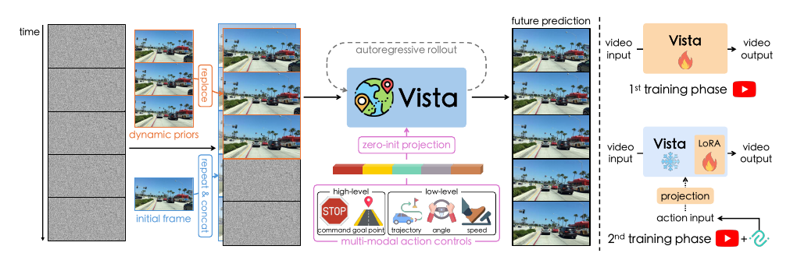
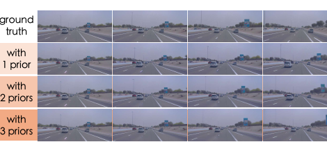

# 2026-08-07 — Dynamic-Prior Latent Replacement

> - **卡片状态：** 已完成
> - **来源论文：** [Vista: A Generalizable Driving World Model with High Fidelity and Versatile Controllability](https://proceedings.neurips.cc/paper_files/paper/2024/hash/a6a066fb44f2fe0d36cf740c873b8890-Abstract-Conference.html) · NeurIPS 2024 · Accepted
> - **官方实现：** [OpenDriveLab/Vista @ cc9821b4253ca7987c32757613d2fc2448fa9f5d](https://github.com/OpenDriveLab/Vista/tree/cc9821b4253ca7987c32757613d2fc2448fa9f5d)
> - **机制家族：** History Injection in Latent Diffusion
> - **迁移目标：** Streaming BEV · Occupancy Forecasting · Video World Models · Temporal Query Memory
> - **证据标签：** [论文] · [源码] · [判断] · [未核验]

> **一句话 Taste：** 把少量历史状态作为“不可再预测的干净槽位”硬写进当前序列，让时序模型明确读历史、只学未来；前提是状态可靠、reset 正确，并有替代注入方式的受控对照。

## 1. 先看瓶颈：为什么需要它

**30 秒问题故事：** **[笔记解释]** 路口前的货车在当前帧里只是一块矩形：没有历史，模型不知道它停着、刚起步还是横穿。若把最近三帧也当成普通 noisy targets，模型还得“重画已知事实”，且 clip 接缝可能漂移。latent replacement 把已知三帧当作钉住的状态，只把未来格交给模型。

**作者明确瓶颈：** **[论文]** SVD 的第一预测帧不与 condition image 严格一致，导致 autoregressive clip 接缝不连续；单帧只给位置，三个连续帧可近似提供位置、速度和加速度。来源：§2–§3.1，PDF p. 2–4。

**笔记因果重建：** **[判断]** 这是本笔记根据前述瓶颈与论文结构所做的因果重建，不是作者原句：hard replacement 同时建立“状态所有权”和“损失所有权”——历史槽由观察/上轮结果拥有，future slots 才由 denoiser 负责；因此 read/write/reset 能逐项审计。

**它不是整篇论文换名：** 本卡只分析 clean latent overwrite + history mask + 三帧滚动接口；不把 dynamics/structure losses、action LoRA、reward 或 Table 2 整模型结果算作本模块能力。

## 2. 原理图：它怎样执行

> **原图出处：** Gao et al., NeurIPS 2024, Figure 3，PDF p. 4，来自[官方 PDF](https://proceedings.neurips.cc/paper_files/paper/2024/file/a6a066fb44f2fe0d36cf740c873b8890-Paper-Conference.pdf)；仅裁取理解模块所需区域，原图版权归原作者及其他权利人。

**执行顺序：**

1. frozen VAE 把 25 帧 RGB 编成 *B*×25×4×*H*/8×*W*/8 latent；
2. 为每个 clip 选 0–3 个历史帧索引，构造 frame mask；
3. mask 位置把 diffusion sigma 置零，使 noisy latent 直接等于 clean latent；
4. condition-time embedding 区分“已观察”和“待预测”帧；
5. UNet 去噪所有位置，但 loss 前把已观察位置预测覆盖回 input，并以 1−mask 排除；
6. 长滚动时把上一 clip 最后三个 generated latents 写到下一 clip 前三个槽，只追加第 4 帧以后的输出。

**看图时别漏掉：** `replace` 是训练/推理数据路径，不是一个可学习 layer；图中的 autoregressive loop 才是状态写回。

> **原图出处：** Gao et al., NeurIPS 2024, Figure 11，PDF p. 9，来自[官方 PDF](https://proceedings.neurips.cc/paper_files/paper/2024/file/a6a066fb44f2fe0d36cf740c873b8890-Paper-Conference.pdf)；仅裁取理解模块所需区域，原图版权归原作者及其他权利人。

**图的证据角色：** Figure 11 定性显示 prior 增加后白车和广告牌运动更接近 ground truth；数字归因必须回到 Table 3。它没有比较 replacement 与 concat/cross-attention。

## 3. 架构位置与接口合同

**位置与上下游：** 上游是 frozen VAE encoder 和 noise sampler，下游是时空 UNet denoiser；滚动上游则变成上一 clip 的 latent output。它旁路噪声注入，不替换 backbone。

**输入合同：** 25-frame latent、同 shape noise、0/1 frame mask、noise level σ。Vista 在 576×1024 下单帧 latent 为 4×72×128；训练输入来自 ground truth frame，滚动输入来自 model-generated frame。

**输出合同：** 当前 clip 的 future latents，以及供下一 round 读取的最后三个 latents。下游 VAE decoder 只负责像素输出；condition frames 不应被重复计入 prediction loss。

**shape、坐标系与状态：** latent 空间没有显式米制坐标；它随前视相机像素排列。trajectory 等 ego-frame action 不属于本模块输入。prediction-relevant state 是 last-three latent + mask；logging image、reward ensemble 和 optimizer state 都不是该时序状态。

**真实梯度路径：** 未观察位置的 diffusion/dynamics/structure loss 经 denoiser 反传；观察位置由 1−mask 阻断直接 reconstruction gradient。clean condition latent 来自 frozen VAE，不被模块 loss 更新；mask/indices 不可学习。phase 2 时相同 loss 只更新 optimizer 收录的 LoRA/action adapters。

**初始化：** 无新增可学习权重；condition-time embedding 从原 time embedding copy 初始化。若迁移到 BEV/occupancy，应明确 history-slot embedding 是复制、零初始化还是独立学习，不能模糊处理。

**训练—推理信息差：** 训练读 ground-truth clean histories，滚动推理读自身 generated histories；这是 teacher-forcing 式 exposure gap。source 没有 scheduled sampling 或噪声历史增强来匹配这条差距。

**read / write / reset：** 读：下一轮前三槽读取 last-three latents；写：当前 sample 的最后三 latent；reset：每个 `do_sample` 新调用局部创建 state，不跨 scene。没有 batch sequence slot，因此迁移到 streaming BEV 时必须新增 scene-id/slot reset 合同。

**算力依赖：** replacement 本身是逐元素 mask，成本小；但增加 history 不减少 UNet 25-frame 去噪成本。三帧 overlap 还让相邻 clips 重复处理/解码，不能宣称整体推理更快。

**固定 SHA 入口：** [training mask / replacement](https://github.com/OpenDriveLab/Vista/blob/cc9821b4253ca7987c32757613d2fc2448fa9f5d/vwm/modules/diffusionmodules/loss.py#L69-L100)；[condition-time stack](https://github.com/OpenDriveLab/Vista/blob/cc9821b4253ca7987c32757613d2fc2448fa9f5d/vwm/modules/diffusionmodules/video_model.py#L457-L461)；[rollout read/write](https://github.com/OpenDriveLab/Vista/blob/cc9821b4253ca7987c32757613d2fc2448fa9f5d/vwm/sample_utils.py#L285-L375)。

## 4. 设计 Taste：为什么值得迁移

**瓶颈 → 设计约束：** 时序模型需要足够历史推断运动，又不能让已知状态在生成过程中漂移；历史和未来还必须有不同 loss ownership。

**设计约束 → 机制：** 把 history 变成 clean, masked slots；用独立 condition-time identity 告诉 backbone 哪些位置是观察；只在 future slots 计算监督。

**机制 → 预期作用：** 接缝数值一致性由结构保证，多个历史槽提供运动差分；但未来仍可能错，且 generated history 会把错误继续写回。

**训练信号 → 证据：** Table 3 控制 prior count，nuScenes/Waymo trajectory difference 都随 1→3 priors 下降；证据支持“history order 有用”，不独立支持“hard replace 优于其他接口”。

**可迁移原则：**

- **先分状态所有权，再选时序算子。** 哪些槽是 observation、哪些是 prediction、谁能写、何时 reset，必须先于 Transformer/LSTM 选择。
- **已知状态可硬约束，未知状态才优化。** 适用于 masked video、streaming BEV memory、occupancy forecasting 和 temporal queries。
- **状态 identity 与状态数值要分开。** clean value replacement 之外仍需 embedding/mask 告诉网络其语义。
- **训练历史要模拟部署历史。** 若部署读生成/预测状态，训练只读 ground truth 会产生 exposure gap；最小迁移必须加入受控 history corruption 或 scheduled replacement 对照。
- **可迁移不等于零改动提升。** BEV/occupancy 有米制坐标、ego-motion warp 和 scene slot；不能把 image latent mask 原样复制。

## 5. 证据、边界与反证实验

**最强模块级证据：** **[论文]** Table 3，干预为 prior 数量。nuScenes action-free trajectory difference 从 3.785（1 prior）降到 1.820（3 priors），绝对 −1.965、相对约 −51.9%；Waymo 从 3.646 降到 2.052，绝对 −1.594、相对约 −43.7%。同一表中低层 trajectory action 在 Waymo 仅 1.187→1.140，说明 history 边际依赖已有 action 信息。

**证据支持：** 在 Vista + IDM 代理指标、两个 537-sample subset 下，更多连续历史与更接近 ground-truth ego-motion 的生成相关；Figure 11 提供可视化对应。

**证据不支持：**

- **[未核验]** 原文未提供 replacement vs concat/cross-attention/copy-first-frame 的独立受控对照，整套系统增益不能单独归因给 hard replacement。
- 没有 history corruption、lost frame、misalignment、ego-pose error 或 generated-state drift 的鲁棒实验。
- 没有 wall-clock、显存或长 horizon quantitative curve；“接口便宜”不等于系统更快。
- trajectory difference 来自 IDM，不是每个对象运动、3D consistency 或 closed-loop safety。

**相邻工作核查：** 2026-08-07 执行三路检索：问题词 `long horizon driving world model history consistency`；机制词 `latent replacement observed frames video diffusion rollout`；同义/邻域词 `masked temporal slots teacher forcing occupancy forecasting state reset`。覆盖 NeurIPS/CVF/ECVA、arXiv、OpenAlex/Crossref 类索引、官方项目与 GitHub；索引部分超时，但官方正文成功。

**最近工作：** [SVD](https://openaccess.thecvf.com/content/CVPR2024/papers/Blattmann_Stable_Video_Diffusion_Scaling_Latent_Video_Diffusion_Models_to_Large_Datasets_CVPR_2024_paper.pdf)提供 image-latent conditioning；[Drive-WM](https://proceedings.neurips.cc/paper_files/paper/2023/file/3d127090aa72e9f7ec80d0a64efb1706-Paper-Conference.pdf)用条件视频做 driving rollout；[OccWorld](https://www.ecva.net/papers/eccv_2024/papers_ECCV/papers/02024.pdf)显式维护 occupancy/ego tokens；[HERMES](https://openaccess.thecvf.com/content/ICCV2025/papers/Zhou_HERMES_A_Unified_Self-Driving_World_Model_for_Simultaneous_3D_Scene_ICCV_2025_paper.pdf)在 BEV world state 中统一理解与生成。

**覆盖判断：** **[部分覆盖]**。历史条件、masked generation 和显式 world state 都已有；可迁移研究只能精确问“在 meter-aligned streaming representation 中，hard observed-slot replacement 相对 concat/attention/memory update 的误差传播与 reset trade-off”，不能宣称首次注入历史。

**最小反证实验：** 在同一公开 occupancy/BEV forecaster 上固定 backbone、预训练、数据、总 steps、history length 和推理预算，比较：无历史、concat history、cross-attention history、hard replacement；再分 ground-truth history、轻度 corruption、模型预测 history。三次 seed 报 accuracy/IoU、长尾动态类、逐 horizon degradation、state contamination、latency 与显存。

**推翻条件：** replacement 在 matched budget 下不优于 concat/attention；加入小幅 history noise 后误差更快爆炸；错误 scene slot/reset 后无法快速恢复；或 latency/显存超过预设预算，均拒绝迁移假设。

**最大失效条件：** 历史状态本身错误、时间间隔不固定、ego-motion 未对齐或 scene reset 漏掉时，hard replacement 会把错误当作不可质疑事实；长时自回归还会把生成误差逐轮固化。

## 6. 适用场景与最小接入方案

**适合：** 观察/预测槽天然可分的 masked video、rolling occupancy、streaming BEV、temporal object-query memory；系统能提供可靠 scene id、时间戳与 ego-motion warp。

**不适合：** 历史严重缺失/错位、状态坐标不断变化却无 warp、任务需要保留多模态不确定性却被单一 clean state 强钉、或无法保证 sequence reset 的服务。

**自动驾驶感知迁移接口：** 在 BEV encoder 后划分 *T*obs 个 observed slots 与 *T*pred 个 future slots；先将 history feature warp 到当前 ego frame，再按 validity mask replace。mask、timestamp、scene slot 和 detach 语义必须作为接口字段，不藏在 dataloader。

**最小接入顺序：**

1. 保持原 forecaster 不变，只加入 observed/future mask 和 loss exclusion；
2. 加 ego-motion warp 与 scene reset 单测；
3. 比较 1/2/3 history orders，确认边际；
4. 加 ground-truth→predicted-history gap 对照和 history corruption；
5. 最后才测试 learned condition embedding 或 mixed replacement，不同时更换 backbone/loss。

**回滚基线：** 同一 backbone 的无历史版本，以及简单 channel-concat history 版本；两者都匹配输入帧数、训练 steps、FLOPs/latency和预训练。若 replacement 失败，应能删除 mask/overwrite 路径恢复原 checkpoint 接口。

**许可证与复现状态：** Vista code 为 Apache-2.0；SVD 权重、OpenDV、nuScenes/Waymo/CODA 数据需逐项遵守各自条款。固定源码已审，checkpoint 未运行；README 警告旧 checkpoint 有 EMA merge error，迁移前必须记录最新权重 hash，不能只写 Git SHA。

**公开表述边界：** 截至 2026-08-07，本卡只建议把“observed slots 不再预测、future slots 独立监督、state 明确读写”作为受控接口测试；不宣称 zero-change gain、更快、更安全或首次使用历史条件。
