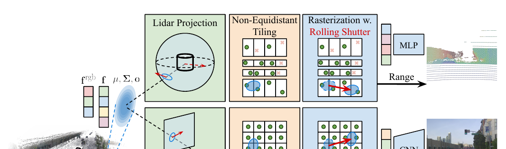

# 2026-08-08 — Alpha-Weighted Median LiDAR Range Readout

> - **卡片状态：** 论文与固定源码已审，checkpoint 未运行
> - **来源论文：** [SplatAD: Real-Time Lidar and Camera Rendering with 3D Gaussian Splatting for Autonomous Driving](https://openaccess.thecvf.com/content/CVPR2025/papers/Hess_SplatAD_Real-Time_Lidar_and_Camera_Rendering_with_3D_Gaussian_Splatting_CVPR_2025_paper.pdf) · CVPR 2025 · Accepted
> - **正式录用：** [CVPR 2025 官方页面](https://openaccess.thecvf.com/content/CVPR2025/html/Hess_SplatAD_Real-Time_Lidar_and_Camera_Rendering_with_3D_Gaussian_Splatting_for_Autonomous_Driving_CVPR_2025_paper.html)
> - **官方实现：** [georghess/neurad-studio @ c24765e3c37164db187119a224f3b9b83914f4bb](https://github.com/georghess/neurad-studio/tree/c24765e3c37164db187119a224f3b9b83914f4bb)
> - **机制家族：** Occlusion-Aware Quantile Readout
> - **迁移目标：** Neural Sensor Simulation · Occupancy Ray Rendering · Neural Surface Reconstruction · LiDAR World Models
> - **证据标签：** [论文] · [源码] · [判断] · [未核验]

> **一句话 Taste：** 当一条射线可能同时看见前后多个半透明表面时，不要默认用期望值把它们平均到空气中；先检查任务需要“均值”还是“一个真实终止表面”，再用受控读出实验决定。

## 1. 先看瓶颈：为什么需要它

**30 秒问题故事：** **[笔记解释]** 一束 LiDAR 先擦到 8 米处汽车边缘，又在 20 米处打到后墙。alpha compositing 会给两个表面都分权重；若直接求 expected range，输出可能落在 8–20 米之间，那里没有任何物体。点云的 Chamfer Distance 会惩罚这个“空气点”，下游 detector 还可能把它当噪声或虚假表面。

**作者瓶颈：** **[论文]** SplatAD §3.3、PDF p. 5 明确指出 expected range 会产生位于多个 Gaussian 之间的深度，因此训练用 expected range 保持可微，推理改用累计透射率首次低于 0.5 的 median range。这个动机只针对 ray 上离散表面读出，不宣称 median 对所有回归任务都更优。

**笔记因果重建：** **[判断]** 这是本笔记根据前述瓶颈与论文结构所做的因果重建，不是作者原句：当目标输出是“一束返回一个物理终止表面”时，期望值的平滑性可能成为几何偏置；把训练 estimator 与推理 decision rule 分开，能在不改训练的情况下匹配输出语义。

## 2. 原理图：它怎样执行

> **原图出处：** [论文] Figure 2，PDF p. 3，来自[官方 PDF](https://openaccess.thecvf.com/content/CVPR2025/papers/Hess_SplatAD_Real-Time_Lidar_and_Camera_Rendering_with_3D_Gaussian_Splatting_CVPR_2025_paper.pdf)；仅裁取理解模块所需区域，原图版权归原作者及其他权利人。

**输入 → 内部变换 → 输出：** 对每条 beam，把可见 Gaussians 按 range 从近到远排列；每个 Gaussian 给有效 alpha 和 rolling-shutter corrected range。连乘前缀透射率，选择它第一次低于 0.5 的位置；输出该 Gaussian 的 range，再由 beam azimuth/elevation 变为 LiDAR-frame XYZ。若固定源码发现累计 alpha 不足 0.5，则使用 normalized expected-range fallback。

**小数字例子：** **[笔记解释]** 这是教学示例，不是论文实验。8 米表面 alpha=0.6，20 米表面 alpha=0.7；过第一个表面后的透射率为 0.4，已经小于 0.5，所以 median 输出 8 米。若两个 alpha 都为 0.2，总 opacity 没过半，固定实现转入 fallback；这正是必须单独统计的失效子集。

## 3. 架构位置与接口合同

**位置与上下游：** 上游是 `lidar_rasterization` 输出的 `median_depths`、`rendered_depths` 和 accumulated `alpha`；下游是 point-cloud construction 与 ray-drop filtering。它不替代 spherical projection、rolling shutter、intensity/drop MLP 或训练 loss。

**输入：** 按 range 排序的 alpha 与 range，range 单位为米、坐标语义为 LiDAR ray distance；beam grid shape 为 *C*×*H*×*W*，readout 保持同一空间 shape，每束输出一个 scalar。*C* 对应 sensor/channel grouping，具体维度随 dataset parser 和 kernel layout，论文未给统一数字。

**输出与状态：** 输出 `median_depth` 是 prediction-relevant 的推理值，但不是跨帧 state；每个 scan 重新计算，没有 read/write/reset 记忆。evaluation metrics accumulation 才是 evaluation-only state，不能与 range readout 混为时序模型。

**训练信号与梯度路径：** **[源码]** 固定实现训练 `outputs["depth"]` 的 95% trimmed absolute error；`median_depth` 没有直接 loss，selection/fallback 路径不向 Gaussian 提供独立训练梯度。共享 Gaussian 仍通过 expected depth、line-of-sight、intensity/drop 与 camera loss 学到 alpha/range。[固定 SHA readout](https://github.com/georghess/neurad-studio/blob/c24765e3c37164db187119a224f3b9b83914f4bb/nerfstudio/models/splatad.py#L1206-L1217) · [固定 SHA loss](https://github.com/georghess/neurad-studio/blob/c24765e3c37164db187119a224f3b9b83914f4bb/nerfstudio/models/splatad.py#L1356-L1432)。

**初始化与算力依赖：** readout 无可学习参数、阈值固定 0.5，主要复用 rasterizer 已产生的前缀 alpha/range；Table 5 报告 median/expected 两行 LiDAR throughput 都是 11.4 MR/s。但自定义 CUDA、Gaussian sort 和 accumulated alpha 是前置依赖，不能把 readout 单独称为一个完整实时 renderer。

**固定源码身份：** 完整模型主仓为 `georghess/neurad-studio@c24765e3c37164db187119a224f3b9b83914f4bb`，Apache-2.0；custom kernel 另审计 `carlinds/splatad@6e31ad766d39e0c33f9034a2ed772d51364b2343`，Apache-2.0。主仓 `pyproject.toml` 未 pin kernel commit，安装可漂移。

## 4. 设计 Taste：为什么值得迁移

**可迁移原则：** **[判断]** 先问输出协议：如果任务要一个可落在真实表面的 termination event，quantile/median 类 readout 可能比均值更匹配；如果任务要 calibrated expectation、连续可微回归或多模态概率，median 可能丢信息。这个原则可迁到 occupancy ray termination、implicit surface extraction、LiDAR world model 和多层透明场，但“可迁移”只表示接口值得受控测试，不表示零改动必然提升。

**因果闭环：** 半透明多表面 → expected value 落在空区 → 选择首个累计 opacity 过半的实际排序表面 → 预期降低 point-set surface error → Table 5 以只替换 readout 的干预支持 CD → alpha calibration/fallback 决定是否外推。

**为什么这个小模块比整篇系统更有 Taste：** 它保持训练、Gaussian cap、decoder、数据和吞吐不变，隔离了“读出语义”本身；研究者可以先做一个 checkpoint-level A/B test，再决定是否设计更复杂的 surface loss。

## 5. 证据、边界与反证实验

**最强模块级证据：** **[论文]** Table 5、PDF p. 8 把 inference 的 median depth 替换为 expected depth；PSNR/SSIM/LPIPS 与 camera throughput 不变，LiDAR depth 都为 0.02、MR/s 都为 11.4，但 CD 从 full median 的 2.0 恶化到 expected 的 4.9。绝对增加 2.9，relative error +145%。这是一个明确的有/无该 readout 干预，比全模型 Table 2 更适合归因。

**证据支持：** 在作者三数据集各 10 sequences 的平均协议中，median readout 明显改善 point-cloud surface geometry，且没有表中可见吞吐代价；相同 depth 指标说明单一逐束误差可能看不见 point-set topology 的恶化。

**证据不支持：** 没有 thin object、range bin、fallback ratio、ray-drop calibration 或 downstream detector 分层；没有多 seed/置信区间；没有证明 0.5 比其他 quantile 更优；没有证明 median 能改善训练或相机输出。

**最大失效条件：** alpha 未校准、薄/半透明目标累计 opacity 低、前景排序错误或 ray-drop gate 错时，median 会选错表面或大量 fallback；多模态概率任务还会因只保留一个 quantile 丢掉不确定性。

**最小反证实验：** 固定同一个公开 checkpoint、ray-drop threshold、point set 与硬件，只切换 expected、median 和 *q*∈{0.3,0.5,0.7} quantile；按 range、thin-object mask、dynamic actor、fallback/non-fallback 分层报告 depth、CD、F-score、drop calibration 和 wall-clock。训练三次 seed 的 checkpoint 时再汇总 seed variance，读出 A/B 本身可在每个固定 checkpoint 确定性复核。

**推翻条件：** 若 median 的 CD gain 只来自某个 threshold/fallback artifact，在 thin/dynamic subset 无改善，或匹配 ray-drop calibration 后 expected/learned readout 同等或更优，就拒绝“固定 0.5 median 是通用选择”，只保留“读出协议必须受控审计”这一原则。

**复现状态：** **[未核验]** 本卡静态核对论文、补充材料和两份固定源码；未下载数据、checkpoint，未编译 CUDA，也未重跑 Table 5。

## 6. 适用场景与最小接入方案

**适合：** 一束/一 ray 需要输出单个物理 surface，且上游已有按距离排序的 opacity/weight；例如 neural LiDAR、occupancy ray termination、Gaussian/volume surface point extraction。

**不适合：** 输出本来就应是期望成本、连续风险或完整概率分布；alpha 没有归一/校准、排序不可靠，或多个有效返回都必须保留的 multi-return LiDAR。

**自动驾驶迁移接口：** 在现有 renderer/occupancy decoder 之后加一个纯 readout adapter，输入 per-ray ordered weights/ranges，输出 selected range、fallback flag 与 accumulated opacity；不要先改 backbone、loss、Gaussian cap 或数据。

**最小接入顺序：**

1. 导出固定 checkpoint 的 ordered range/alpha 与现有 expected output。
2. 离线实现 median 与可调 quantile，显式记录 no-crossing fallback。
3. 保持 ray-drop 和后处理完全一致，先复算 point metrics。
4. 再接一个固定 downstream perception checkpoint，检查 actor/local geometry 与预测稳定性。
5. 只有结果跨 scene/seed 稳定后，才考虑可学习 quantile 或训练时 surface supervision。

**回滚基线：** 原 checkpoint 的 normalized expected-range readout；若现有任务使用 depth argmax/first-hit，也应保留为第二 rollback，不允许以不同 threshold 或后处理制造虚假增益。

**许可证与部署风险：** 主仓和 SplatAD kernel 是 Apache-2.0；数据集和 checkpoint 另受各自条款。主仓未固定 kernel commit，生产/研究复现必须显式 pin；离散 median 对 alpha 排序/精度敏感，FP16、tile truncation 与跨 GPU kernel 结果需要单测。
