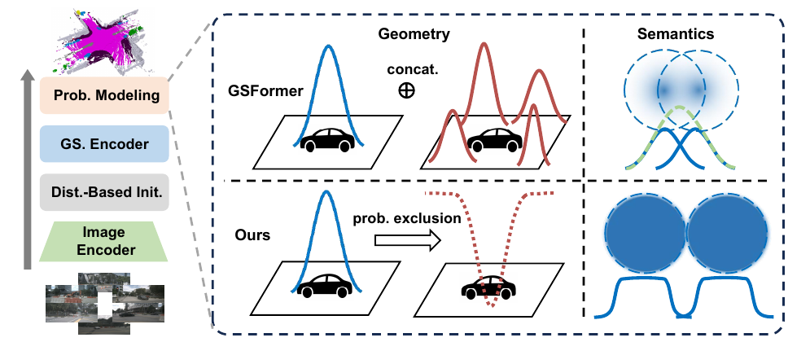
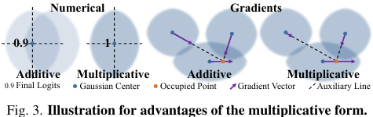

# 2026-08-13 — Probabilistic Union Geometry Readout

> - **卡片状态：** 完整 · 已索引 · 等待公开核验
> - **来源论文：** [GaussianFormer-2](https://openaccess.thecvf.com/content/CVPR2025/html/Huang_GaussianFormer-2_Probabilistic_Gaussian_Superposition_for_Efficient_3D_Occupancy_Prediction_CVPR_2025_paper.html) · CVPR 2025 · Accepted
> - **官方实现：** [huang-yh/GaussianFormer @ b7e22bfc04cd6360cdee74be5af7fdace102f0a3](https://github.com/huang-yh/GaussianFormer/tree/b7e22bfc04cd6360cdee74be5af7fdace102f0a3)
> - **机制家族：** Bounded Probabilistic Set Aggregation
> - **迁移目标：** Sparse Occupancy · Gaussian Scene Completion · Multi-Sensor Existence Fusion · Map-Free Free-Space Estimation
> - **证据标签：** [论文] · [源码] · [判断] · [未核验]

> **一句话 Taste：** 多个局部原语表达同一“存在事件”时，先用有界概率并集聚合几何，再用独立归一化混合处理属性；可迁移的前提是局部值近似概率且相关性、校准与饱和梯度都经压力测试。

## 1. 先看瓶颈：为什么需要它

**30 秒问题故事：** 六路相机都看见一辆前车，encoder 在车体周围放了几个重叠高斯。旧读出把每个高斯的占据贡献直接相加：两份 0.7 会变成 1.4，训练为了提高目标分数还可能继续堆重叠原语。问题不只是数值越界；表示预算也被重复证据消耗。

**作者瓶颈：** **[论文]** GaussianFormer 的 additive aggregation 对整体 Occupancy 没有上界，并让多个高斯以相同语义覆盖同一区域；在大量空空间中，模型仍以不少高斯描述 empty。来源：论文 §1、§3.1，PDF pp. 1、3–4。

**笔记因果重建：** **[判断]** 这是本笔记根据前述瓶颈与论文结构所做的因果重建，不是作者原句。若局部值的目标语义是“此点至少被一个原语占据”，聚合算子就应满足输入与输出都在 0–1、单个强证据足以成立、增加弱证据不降低存在概率，并避免线性累加越界；noisy-OR 是最小满足这些约束的候选。

**边界先说：** 有界不等于校准，多个高斯也不是实际独立。相同图像、相同 encoder 和相同 loss 会产生相关证据；如果不做相关重复压力测试，乘法并集可能过度自信。

## 2. 原理图：它怎样执行

> **原图出处：** Huang et al., CVPR 2025, Figure 3, PDF p. 3，来自[官方 PDF](https://openaccess.thecvf.com/content/CVPR2025/papers/Huang_GaussianFormer-2_Probabilistic_Gaussian_Superposition_for_Efficient_3D_Occupancy_Prediction_CVPR_2025_paper.pdf)；仅裁取理解模块所需区域，原图版权归原作者及其他权利人。

**执行顺序：**

1. 输入六路 RGB 与相机内外参，backbone/FPN 提取多尺度图像特征。
2. 初始化与四轮 encoder 输出 *P* 个三维高斯；每个原语含车体坐标中心、三轴尺度、四元数旋转、opacity 和 17 维语义 logits。
3. 对每个 0.5 m 体素中心，先用中心与协方差计算每个高斯的局部占据值；固定 nuScenes 范围是 200×200×16 个体素。
4. 几何分支把“所有高斯都不占据”的补事件相乘，再取补集；输出严格位于 0–1。
5. 语义分支以 normalized Gaussian density × opacity 为权重，对 softmax 类别向量归一化混合。
6. 空类取 1−geometry；17 个语义类取 geometry × conditional semantics。它是纯当前帧 readout，没有跨帧状态写回。

> **原图出处：** Huang et al., CVPR 2025 Supplement, Figure 3, Supplement PDF p. 2，来自[官方补充材料 PDF](https://openaccess.thecvf.com/content/CVPR2025/supplemental/Huang_GaussianFormer-2_Probabilistic_Gaussian_CVPR_2025_supplemental.pdf)；[索引主论文 PDF](https://openaccess.thecvf.com/content/CVPR2025/papers/Huang_GaussianFormer-2_Probabilistic_Gaussian_Superposition_for_Efficient_3D_Occupancy_Prediction_CVPR_2025_paper.pdf)。仅裁取理解模块所需区域，原图版权归原作者及其他权利人。

**小数字读图：** **[笔记解释]** 这是教学示例，不是论文实验。两个局部占据值为 0.6、0.5：additive 得 1.1；probabilistic union 得 1−0.4×0.5=0.8。后者允许第二个高斯补充证据，却不会把输出推离概率范围。

## 3. 架构位置与接口合同

**位置与上下游：** 该模块位于 Gaussian encoder/refinement 之后、体素 Occupancy loss/evaluator 之前；它替换原 GaussianFormer 的 additive local aggregation，不改变 backbone、初始化预算或 encoder 接口。

**输入：**

- 查询体素中心：车体坐标、三维米制位置，固定 nuScenes config 为 200×200×16；
- 高斯中心与 inverse covariance：决定局部椭球距离，shape 分别约为 *P*×3 与 *P*×3×3；
- opacity：每原语一个 0–1 标量，只进入语义混合，不进入固定实现的 geometry union；
- semantics：每原语 17 维 softmax 向量；
- tile/radius 索引：只筛选局部候选，scale 在构造离散半径时 detach。

**内部变换：** Mahalanobis 距离 → 指数局部概率 → 补事件连乘 → geometry；并行执行 Gaussian density 与 determinant → 乘 opacity → 归一化 semantic mixture；最后拼空类和语义类。

**输出：** 体素网格上 18 维概率向量，供 CE、Lovász 或 argmax 使用。输出没有物体 ID、轨迹、速度或预测性 state；不能从“高斯原语”名称推断对象级身份。

**训练信号与真实梯度路径：** 固定配置只对最终 decoder 输出计算权重 10 的 CE 与权重 1 的 Lovász。该 loss 直接作用 readout，并经连续 probability/density/covariance 路径回传到最终高斯与共享 encoder；离散 tile 筛选和 detach 的 radius 不接收梯度。语义 loss 经共享高斯影响 encoder，不表示它直接监督所有初始化采样；冻结 lifter 也不会被主 loss 更新。

**初始化与算力依赖：** readout 本身无可学习参数，但依赖 encoder 产生概率样的局部值。自定义 CUDA kernel 做局部聚合；固定实现仍有 covariance 从 GPU 到 CPU 求逆再回 GPU 的往返。论文 Table 3 在 RTX 4090、batch 1 下报告整模型延迟，不能独立归因给 readout kernel。

**固定源码入口：** **[源码]** [GaussianHead](https://github.com/huang-yh/GaussianFormer/blob/b7e22bfc04cd6360cdee74be5af7fdace102f0a3/model/head/gaussian_head.py)、[Python/CUDA wrapper](https://github.com/huang-yh/GaussianFormer/blob/b7e22bfc04cd6360cdee74be5af7fdace102f0a3/ops/localaggprob/local_aggregate_prob.py) 与 [12,800 配置](https://github.com/huang-yh/GaussianFormer/blob/b7e22bfc04cd6360cdee74be5af7fdace102f0a3/config/prob/nuscenes_gs12800.py)。

## 4. 设计 Taste：为什么值得迁移

**瓶颈 → 约束：** 多个局部组件重复表达同一存在事件，要求聚合后仍有概率语义，且不因组件数量增加而无界增长。

**约束 → 机制：** 对补事件做乘积，等价于 noisy-OR；它把“至少一个成立”写进算子，而不是让网络靠 loss 自己学会裁剪。属性/类别则在存在条件下归一化混合，避免把存在强度重复写入类别总质量。

**机制 → 预期作用：** 几何分支应减少重叠原语的收益、提高预算利用率；语义分支应防止多个重叠分量把类别分数无界相加。Supplement Figure 3 还展示乘法形式会给多个原语指向占据位置的自适应梯度，而可加形式给出更一致的方向。

**可迁移原则：**

1. 先确认下游问题真的是集合并集，而不是计数、密度积分或互斥选择；
2. 把 existence 与 conditional attribute 分开，分别选择聚合算子；
3. 让算子编码必须满足的不变量，例如范围、有无强证据和空集合单位元；
4. 同时记录独立性、相关性和校准假设，不把“数学像概率”写成“已经可靠”；
5. 只替换聚合接口做受控 A/B，不连带更换 backbone、初始化和训练预算。

**可能迁移的自动驾驶接口：** 稀疏 query Occupancy 的存在读出、多相机/雷达局部 existence evidence、在线地图 free-space/occupied 融合、多个 proposal 对同一体素的集合聚合。可迁移只表示接口与瓶颈值得受控测试，不表示零改动必然提升。

## 5. 证据、边界与反证实验

**最强模块级证据：** **[论文]** Table 4 在同为 25,600 高斯、相同主模型设置下，从无概率建模到加入完整 Probabilistic Modeling，mIoU 16.00→19.61，绝对 +3.61 点、相对约 +22.56%；IoU 28.72→30.61，绝对 +1.89、相对约 +6.56%。这是“加入完整 geometry+semantics 概率读出”的干预，不能全归给 noisy-OR 单算子。

**证据粒度拆分：** **[论文]** Supplement Table 2 把 normalized semantics 单独加入时 mIoU 16.00→18.90，完整形式到 20.32；说明语义归一化解释一大部分提升，几何并集与其他组合解释剩余部分。Table 5 的正确位置和重叠改善同时包含 initialization 与 readout 变化，也不能作纯 readout 因果证据。

**证据支持：** 同预算替换聚合形式可显著改善 Occupancy 指标；完整系统的高斯重叠比例下降；跨 nuScenes 与 KITTI-360 的整模型方向一致。

**证据不支持：** 没有 ECE/Brier/reliability diagram，不支持“校准概率”；没有独立 noisy-OR vs normalized-sum/max/clipped-sum 对照；没有三 seed、相关重复压力、薄目标召回、梯度范数或 kernel 单独时延。

**最大失效条件：** 多个高斯高度相关时，独立 noisy-OR 会过度自信；一个原语已接近 1 时，其他分量经乘积得到的边际梯度可能很小；局部值并非概率、任务需要计数，或 overlap 本身代表多假设不确定性时，这个读出会抹掉有用结构。

**最小反证实验：** 固定 backbone、pretraining、原语数量、初始化、encoder、loss、数据与训练/推理预算，只替换 geometry aggregation 为 additive、clipped-sum、max、normalized-sum、noisy-OR；每项跑三个 seed，同时报告 IoU/mIoU、ECE/Brier、薄目标与长尾类、overlap/utilization、梯度范数、显存与 kernel/端到端时延。额外复制同一高斯 1/2/4/8 次，测试相关重复是否让概率异常饱和。

**推翻迁移假设的结果：** 若匹配强 baseline 后 noisy-OR 不在精度—校准—效率上形成 Pareto 改善，或提升仅来自过度平滑并损害行人/骑行者等薄目标召回，或相关复制使 ECE 显著恶化，则这项迁移不成立。

## 6. 适用场景与最小接入方案

**适合：** 局部组件给出 0–1 existence evidence、下游问“至少一个是否成立”、组件数量可变且 additive 会越界的稀疏预测系统。

**不适合：** 需要总数量/质量守恒的密度积分、互斥专家选择、原语值未经 sigmoid/校准、重复来源强相关却无法建模、或者必须保留多峰对象假设的系统。

**自动驾驶迁移接口：** 在 Occupancy head 的局部聚合函数处接入；保留原始 feature sampling、query refinement 和 semantic head，先只把 geometry 聚合换成 noisy-OR。若是多传感器，先在每传感器内部聚合，再显式建模跨传感器相关性，不把相机重复视角当独立证据。

**最小接入顺序：**

1. 记录当前 additive/max baseline 的 logits、校准和 overlap；
2. 把局部贡献限制到 0–1，加入数值稳定的 log-complement 累积；
3. 只替换 geometry readout，保持 semantic 路径不变；
4. 加相关重复、空集合、单强证据和大规模组件单元测试；
5. 完成三 seed 与资源 profile 后，再决定是否分离 conditional semantics。

**回滚基线：** 原系统同预算 additive aggregation，加一个明确的 clip/logit normalization 版本；回滚必须保留同一 checkpoint 初始化和训练步数，避免把额外训练量算成机制收益。

**许可证与复现状态：** 固定 commit 根 `LICENSE` 是 0 字节，无法识别代码复制、修改或商用授权；公开可读不等于获授权。**[未核验]** 本仓库只审计调用链，未下载 checkpoint、编译 CUDA 或运行表格。迁移时优先独立重写数学接口，并先取得合规许可判断。
