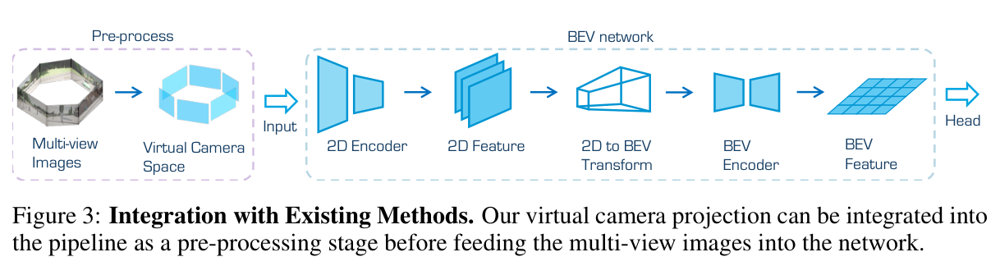
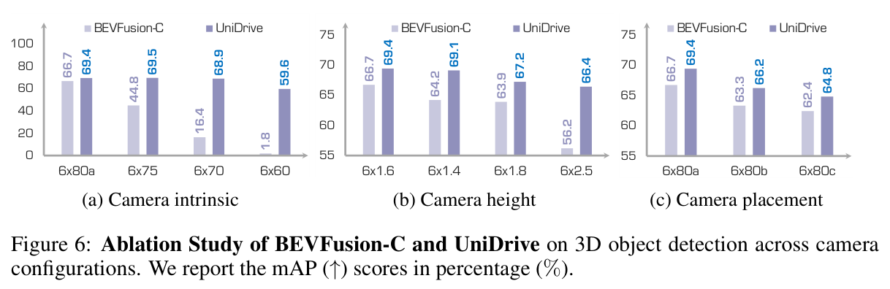

# 2026-08-14 — Virtual Camera Canonicalization Preprocessor

> - **卡片状态：** 完成；论文与补充材料已读，固定源码已审，Checkpoint 未运行
> - **来源论文：** [UniDrive: Towards Universal Driving Perception Across Camera Configurations](https://proceedings.iclr.cc/paper_files/paper/2025/file/41badd36e935f8a80175e95d8bc6192e-Paper-Conference.pdf) · [ICLR 2025 proceedings](https://proceedings.iclr.cc/paper_files/paper/2025/hash/41badd36e935f8a80175e95d8bc6192e-Abstract-Conference.html) · Accepted
> - **官方实现：** [ywyeli/UniDrive @ c73f887d792fbab27d8275e85839e959b4c24f3c](https://github.com/ywyeli/UniDrive/tree/c73f887d792fbab27d8275e85839e959b4c24f3c)
> - **机制家族：** Geometry-First Input Canonicalization
> - **迁移目标：** Cross-Rig BEV · Map Perception · Multi-Camera Occupancy · Calibration-Robust Detection
> - **证据标签：** [论文] · [源码] · [判断] · [未核验]

> **一句话 Taste：** 当 nuisance 的几何元数据已知时，先把不同传感器观测变到同一输入合同，再让旧网络处理；但 canonicalization 只能重新排列已经看见的信息，不能补回缺 FOV、真实深度、遮挡和错误标定。

## 1. 先看瓶颈：为什么需要它

**30 秒问题故事：** **[笔记解释]** 一个 BEV 检测器在六台 80° 相机的车上训练；换到四台 95° 相机后，前车仍在同一物理位置，却落到完全不同的像素和视图重叠区。若直接把新图喂给旧网络，网络先前学到的“这个像素通常对应车前多少米”会失效。Virtual Camera Canonicalization Preprocessor 像一个标准化转接头：先把新 rig 的照片重采样为训练时共同约定的虚拟相机，再交给下游网络。

**作者明确瓶颈：** **[论文]** 视觉三维感知的投影高度依赖相机内外参；相机数量、FOV、位置和高度变化会同时改变图像分布与二维—三维映射，固定配置模型跨 rig 会严重退化。来源：论文 §1、§3.1，PDF pp. 1–4。

**笔记因果重建：** **[判断]** 这是本笔记根据前述瓶颈与论文结构所做的因果重建，不是作者原句。若 nuisance 已有准确标定，而且任务主要依赖道路附近几何，那么把变化显式吸收到一个网络外几何层，能把下游网络的训练分布重新固定；代价是代理深度与重采样误差也会固定进入网络。

**问题边界：** “可迁移”只表示这个接口值得受控测试，不表示换 rig 后零改动必然提升。该故事不是真实道路安全证据，离线 mAP 也不等于总体 accuracy 或闭环安全。

## 2. 原理图：它怎样执行

> **原图出处：** [论文] Li et al., ICLR 2025, Figure 3，PDF p. 6，来自[官方 PDF](https://proceedings.iclr.cc/paper_files/paper/2025/file/41badd36e935f8a80175e95d8bc6192e-Paper-Conference.pdf)；仅裁取理解模块所需区域，原图版权归原作者及其他权利人。

**纵向执行顺序：**

1. 读取 *J* 张同步真实相机 RGB，以及每台相机 3×3 内参、4×4 外参。
2. 对目标虚拟相机的每个像素发出一条射线；近处用水平地面交点，远处用固定半径类圆柱面交点，得到代理三维点。
3. 把该点从虚拟相机坐标变到世界/车辆坐标，再变到每台真实相机坐标并投到源像素。
4. 对真实图像做逆向 warp；多个真实相机覆盖同一虚拟像素时按权重归一化融合。
5. 输出 *K* 张固定语义的虚拟 RGB，shape 仍是每视图 *H*×*W*×3。
6. 下游 2D encoder、2D-to-BEV transform、BEV encoder 与 prediction head 完全按原接口运行。

**首次术语：** **虚拟相机规范化（Virtual Camera Canonicalization）** 是把不同真实 rig 映到共同的内外参/视图合同；**代理表面（Proxy Surface）** 是为缺少真实深度的像素指定三维落点的简化几何；**逆向 warp** 从目标虚拟像素反查源像素，避免正向投影产生直接的散点写入。

**图没有证明：** Figure 3 是接口图，不是效果消融；它没有证明 ground proxy 正确、融合可见性正确、模块低延迟或真实数据有效。

## 3. 架构位置与接口合同

**位置与上下游：** 位于原始多相机 loader 与 2D image backbone 之间，替换“直接读取真实 rig 图像”的输入合同；它不替换 BEV encoder/head。

**输入：** 同一时刻 *J* 张 RGB、真实相机内外参、虚拟相机内外参、虚拟相机高度、距离阈值 *D*0、融合权重/有效 mask。论文采集图像为 1600×900，*J*=4–8；实际网络输入分辨率、阈值和权重未由作者锁定。

**输出：** *K* 张虚拟 RGB 与理应伴随的有效覆盖信息。论文只画出 RGB；**[判断]** 迁移实现应额外输出 validity/coverage mask，避免网络把黑边或重复像素当作真实内容。

**shape、坐标系与状态：** 每张输出是 *H*×*W*×3；代理点依次处在虚拟相机坐标、世界/车辆坐标、真实相机坐标。它只处理当前帧，没有 prediction-relevant temporal state、scene slot、reset 或跨帧写回。CMA-ES 的均值/协方差是离线设计状态，不进入每帧 detector。

**训练信号与真实梯度路径：** **[论文]** projection/warp/CMA-ES 不从 detector loss 学习；虚拟 rig 由框角点投影误差离线搜索。检测损失直接监督 CenterHead，并经下游共享参数间接更新 BEV/图像 backbone；核心预处理无可学习参数，也不存在“同 batch 的检测 loss 直接训练 CMA-ES”的路径。

**初始化与冻结：** CMA-ES 从初始均值、步长、单位协方差开始；具体值、参数约束和最终虚拟配置未公开。投影器无需神经权重。下游 BEVFusion-C 的预训练/冻结配方论文未公开；固定 vendored Swin-T config 有预训练 URL，但不能冒充论文表格设置。

**算力依赖：** 每个虚拟像素可能反查 *J* 个真实视图，理论采样工作随 *J*×*K* 增长；论文未报告 warp 的 GPU kernel、FLOPs、显存或端到端时延，不能称“免费 plug-and-play”。

**固定源码入口：** **[源码]** [固定 SHA README](https://github.com/ywyeli/UniDrive/blob/c73f887d792fbab27d8275e85839e959b4c24f3c/README.md) 描述虚拟投影；[固定 SHA loader](https://github.com/ywyeli/UniDrive/blob/c73f887d792fbab27d8275e85839e959b4c24f3c/detection_methods/bevfusion/mmdet3d/datasets/pipelines/loading.py) 只读取原图；固定树未发布 projection、blending、projection error 或 CMA-ES 的可执行实现。`Audited` 在此只表示真实检查固定树，不表示模块已开源或结果已复现。

**许可证与复现状态：** 根目录 MIT；vendored BEVFusion/nuScenes devkit 另有 Apache-2.0。**[未核验]** 本仓库未运行 CARLA、训练或 checkpoint；官方仓库无论文 checkpoint、最终虚拟 rig 和核心模块实现。

## 4. 设计 Taste：为什么值得迁移

**闭环：** 已知标定但输入布局改变 → 下游网络不应反复学习同一种几何 nuisance → 在 encoder 前放一个显式 canonicalizer → 用统一虚拟视图恢复固定输入语义 → 下游 loss 仍只负责任务 → cross-rig 受控实验检查是否保留性能。

**可迁移原则 1——把可测 nuisance 留在网络外：** 若相机内外参是已知元数据，先用可审计几何消除变化，能减少网络把容量浪费在重新识别 rig。类似思想可迁到多相机地图、Occupancy 或跨车 V2X 视图，但必须重新定义目标坐标和覆盖 mask。

**可迁移原则 2——canonical contract 比固定 backbone 更重要：** 迁移的核心不是 Swin-T 或 BEVFusion，而是“下游看到的每个通道/视角始终代表同一物理方向”。更换 backbone 时只要输入合同不变，机制仍可独立测试。

**可迁移原则 3——代理几何必须暴露失败：** ground/cylinder 不是真实深度；工程接口应输出 validity、proxy type、采样角度和不确定性，使下游能区分“真实覆盖”“代理强扭曲”“无覆盖”，而不是把伪影伪装成普通 RGB。

**最有算法 Taste 的取舍：** 作者没有在网络里加更复杂的 camera embedding，而是先问“能否把输入改回网络已会处理的格式”。这是值得迁移的设计思维；但论文没有证明它优于强 camera-aware conditioning，后续 CoIn3D 已表明两条路线需要直接比较。

## 5. 证据、边界与反证实验

> **原图出处：** [论文] Li et al., ICLR 2025, Figure 6，PDF p. 10，来自[官方 PDF](https://proceedings.iclr.cc/paper_files/paper/2025/file/41badd36e935f8a80175e95d8bc6192e-Paper-Conference.pdf)；仅裁取理解模块所需区域，原图版权归原作者及其他权利人。

**最强模块级证据：** **[论文]** Figure 6(a) 干预“直接 BEVFusion-C → 完整 UniDrive 预处理/优化栈”，训练 6×80°a、测试 6×60° 时 mAP 1.8→59.6，绝对 +57.8 点；6×70° 是 16.4→68.9，+52.5 点。Figure 6(b) 相机高度 1.6→2.5 m 时，baseline 66.7→56.2，而 UniDrive 69.4→66.4。

**证据粒度声明：** **[未核验]** 原文没有只开关 Ground-Aware Projection、只换融合权重或只换 proxy surface 的独立消融；Figure 6 改变的是完整 UniDrive。因此它支持“整个 canonicalization stack 在模拟 cross-rig 下有效”，不能把 +57.8 点单独归给平地公式、weighted blending 或 CMA-ES。

**证据支持：** 在 CARLA、精确标定、单帧、六类、BEVFusion-C 条件下，网络前统一视图能显著收窄跨 FOV/高度/placement 的检测退化；Figure 5 还给 w/o/with optimization 的直接控制。

**证据不支持：** 没有真实数据、cross-dataset、标定噪声、无覆盖/坏相机、天气、效率、多 seed、置信区间或其他 detector；“mAP 更高”不能写成“更安全”，也不能写成“所有配置不变”。

**最大失效条件：** 目标主要高于/离开代理表面、真实 rig 缺少虚拟视图所需 FOV、相机标定有偏、动态遮挡冲突、曝光差强、warp 伪影形成新域，或 *J*×*K* 重采样超过部署预算时，该设计会失效。最危险的是无覆盖：canonicalization 无法生成未观测事实。

**最小反证实验：** 固定一个真实跨 rig 数据集、同一 BEV detector/backbone/pretraining、训练步数、增强和推理预算，只改网络前接口：直接输入、camera-aware conditioning、plane warp、plane+cylinder warp、真值/强深度 warp；三次 seed 报 cross-rig mAP/NDS、每类/距离段、ECE、覆盖区/无覆盖区、标定噪声曲线、时延和显存。

**推翻迁移假设的结果：** 若匹配预算后 canonicalization 不改善精度—校准—时延 Pareto，或收益仅在模拟纹理存在，或 camera-aware conditioning 在所有真实 cross-rig/噪声条件下更稳，或无覆盖区显著制造高置信假阳性，则“先规范化比让网络适配更值得”不成立。

## 6. 适用场景与最小接入方案

**适合：** 标定可靠、目标坐标合同明确、主要观测落在近地道路、下游已有成熟 checkpoint、需要跨同类相机 rig 复用模型，而且能承受一次显式重采样的系统。

**不适合：** 鱼眼/极端畸变未建模、强非平面近景、无人机/室内自由视角、频繁标定漂移、关键区域缺 FOV、严格像素保真任务，或时延预算不允许 *J*×*K* warp 的系统。

**自动驾驶迁移接口：** 在图像 loader/augmentation 之后、2D backbone 之前插入 canonicalizer；输出 RGB、validity mask、source-camera id/weight 和 proxy type。若下游是 BEV Map/Occupancy，保持任务 head 与标签坐标不变，先只替换输入接口。

**最小接入顺序：**

1. 用现有 checkpoint 跑直接输入基线，并按目标 rig/FOV/距离段保存误差。
2. 只实现可测试的标定投影与 bilinear warp；以平面 proxy 起步，加入边界/无覆盖单元测试。
3. 输出 validity mask，不先做多视图颜色平均；先用 hard source selection 建立可回滚版本。
4. 加入 plane+cylinder 与 blending，每次只改一个因素；保持 detector、数据与训练预算不变。
5. 只在 hand-designed virtual rig 稳定后，再离线优化 virtual configuration；优化目标与检测指标分开报告。
6. 完成三 seed、标定扰动、无覆盖和真实墙钟 profile 后，才决定是否替换生产输入链。

**回滚基线：** 原 detector 直接读取目标 rig 图像并传入正确标定，加一个 camera-aware embedding/augmentation 版本；回滚保留同一 checkpoint 初始化、训练量、图像分辨率和推理预算。

**许可风险：** 原理可独立重写；若复用仓库，保留根 MIT 和 vendored Apache-2.0 notices。由于核心模块没有公开实现，不能假设 README 图示代码已获完整交付，也不能从第三方非官方实现推断作者行为。

**最终判断：** 这张卡真正可迁移的是“先建立稳定输入合同，再让网络做任务”的架构决策；不是 ground plane 本身，更不是“虚拟相机必然解决跨 rig”。
